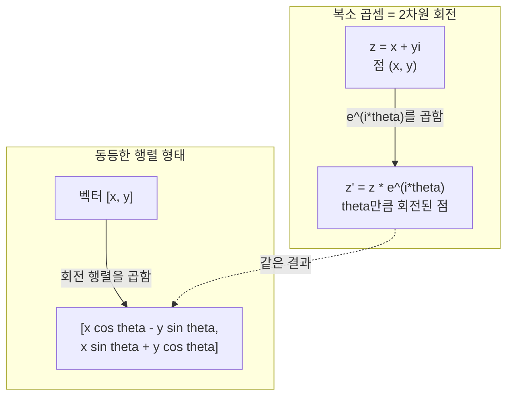
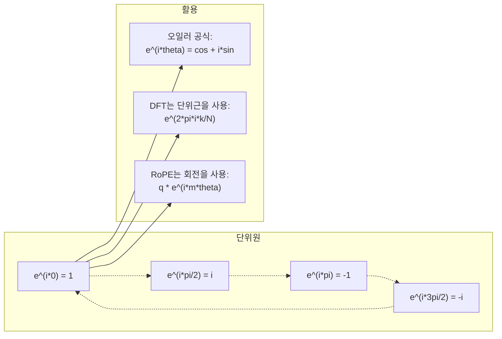

> 🇰🇷 이 문서는 한국어 번역본입니다(ELI5 스타일). 원문: [en.md](en.md)

# AI를 위한 복소수

> -1의 제곱근은 '상상 속'이 아닙니다. 회전과 주파수, 그리고 신호 처리의 절반을 여는 열쇠입니다.

**유형:** Learn
**언어:** Python
**선수 지식:** 페이즈 1, 레슨 01-04(선형대수, 미적분)
**시간:** ~60분

## 학습 목표

- 직교형(rectangular)과 극형(polar) 두 형태로 복소수 연산(덧셈, 곱셈, 나눗셈, 켤레)을 수행합니다
- 오일러 공식으로 복소 지수함수와 삼각함수 사이를 변환합니다
- 복소 단위근을 사용해 이산 푸리에 변환(DFT)을 구현합니다
- 복소 회전이 트랜스포머의 RoPE와 사인형 위치 인코딩의 토대가 되는 원리를 설명합니다

## 문제 상황

푸리에 변환 논문을 열면 `i`가 도처에 널려 있습니다. 트랜스포머 위치 인코딩을 보면 서로 다른 주파수의 `sin`과 `cos`이 있는데, 이는 복소 지수함수의 실수부와 허수부입니다. 양자 컴퓨팅을 읽으면 모든 것이 복소 벡터 공간으로 표현되어 있죠.

복소수는 추상적으로 보입니다. -1의 제곱근 위에 세워진 수 체계라니 수학적 꼼수처럼 느껴지죠. 하지만 꼼수가 아닙니다. 회전과 진동의 자연스러운 언어입니다. 무언가가 빙글빙글 돌거나, 떨리거나, 진동할 때마다 복소수가 제격인 도구입니다.

복소수를 이해하지 못하면 이산 푸리에 변환(DFT)을 이해할 수 없습니다. FFT도, 최신 언어 모델에서 RoPE(Rotary Position Embedding)가 어떻게 작동하는지도, 원조 트랜스포머 논문의 사인형 위치 인코딩이 왜 그런 주파수를 쓰는지도 이해할 수 없습니다.

이 레슨은 복소수 연산을 처음부터 만들고, 기하학과 연결하고, 머신러닝의 어디에 복소수가 등장하는지 정확히 보여줍니다.

## 핵심 개념

### 복소수란?

복소수는 두 부분으로 이루어집니다. 실수부와 허수부죠.

```
z = a + bi

여기서:
  a는 실수부
  b는 허수부
  i는 허수 단위로, i^2 = -1로 정의됩니다
```

이게 전부입니다. 수직선을 평면으로 확장하는 것입니다. 실수는 한 축 위에, 허수는 다른 축 위에 놓입니다. 모든 복소수는 이 평면 위의 한 점입니다.

### 복소수 연산

**덧셈.** 실수부끼리 더하고 허수부끼리 더합니다.

```
(a + bi) + (c + di) = (a + c) + (b + d)i

예: (3 + 2i) + (1 + 4i) = 4 + 6i
```

**곱셈.** 분배법칙을 쓰고 i^2 = -1만 기억하면 됩니다.

```
(a + bi)(c + di) = ac + adi + bci + bdi^2
                 = ac + adi + bci - bd
                 = (ac - bd) + (ad + bc)i

예: (3 + 2i)(1 + 4i) = 3 + 12i + 2i + 8i^2
                      = 3 + 14i - 8
                      = -5 + 14i
```

**켤레복소수.** 허수부의 부호를 뒤집습니다.

```
(a + bi)의 켤레 = a - bi
```

복소수와 그 켤레의 곱은 항상 실수입니다:

```
(a + bi)(a - bi) = a^2 + b^2
```

**나눗셈.** 분자와 분모에 분모의 켤레를 곱합니다.

```
(a + bi) / (c + di) = (a + bi)(c - di) / (c^2 + d^2)
```

이렇게 하면 분모에서 허수부가 사라져 깔끔한 복소수 하나가 남습니다.

### 복소 평면

복소 평면은 모든 복소수를 2차원 점에 대응시킵니다. 가로축이 실수축이고 세로축이 허수축입니다.

```
z = 3 + 2i  는 점 (3, 2)에 해당
z = -1 + 0i 는 실수축 위의 점 (-1, 0)에 해당
z = 0 + 4i  는 허수축 위의 점 (0, 4)에 해당
```

복소수는 한 점이면서 동시에 원점에서 뻗은 벡터이기도 합니다. 이 두 가지 해석이 복소수를 기하학에서 유용하게 만드는 이유입니다.

### 극형(polar form)

평면 위의 어떤 점이든 원점으로부터의 거리와 양의 실수축으로부터의 각도로 표현할 수 있습니다.

```
z = r * (cos(theta) + i*sin(theta))

여기서:
  r = |z| = sqrt(a^2 + b^2)     (크기, 또는 절댓값)
  theta = atan2(b, a)             (위상, 또는 편각)
```

직교형(a + bi)은 덧셈에 좋고, 극형(r, theta)은 곱셈에 좋습니다.

**극형에서의 곱셈.** 크기는 곱하고 각도는 더합니다.

```
z1 = r1 * e^(i*theta1)
z2 = r2 * e^(i*theta2)

z1 * z2 = (r1 * r2) * e^(i*(theta1 + theta2))
```

복소수가 회전에 완벽한 이유가 바로 이것입니다. 크기가 1인 복소수를 곱하는 것은 순수한 회전입니다.

### 오일러 공식

복소 지수함수와 삼각함수를 잇는 다리:

```
e^(i*theta) = cos(theta) + i*sin(theta)
```

이 레슨에서 가장 중요한 공식입니다. theta = pi일 때:

```
e^(i*pi) = cos(pi) + i*sin(pi) = -1 + 0i = -1

따라서: e^(i*pi) + 1 = 0
```

다섯 개의 근본 상수(e, i, pi, 1, 0)가 하나의 식으로 연결됩니다.

### 오일러 공식이 ML에서 중요한 이유

오일러 공식은 theta가 변할 때 `e^(i*theta)`가 단위원을 따라 그려진다고 말합니다. theta = 0이면 (1, 0)에, theta = pi/2이면 (0, 1)에, theta = pi이면 (-1, 0)에, theta = 3*pi/2이면 (0, -1)에 있습니다. 한 바퀴 회전은 theta = 2*pi죠.

즉 복소 지수함수는 그 자체가 회전입니다. 그리고 회전은 신호 처리와 ML 도처에 있습니다.

### 2차원 회전과의 연결

복소수 (x + yi)에 e^(i*theta)를 곱하면 점 (x, y)가 원점 주위로 각도 theta만큼 회전합니다.

```
복소 곱셈으로 회전:
  (x + yi) * (cos(theta) + i*sin(theta))
  = (x*cos(theta) - y*sin(theta)) + (x*sin(theta) + y*cos(theta))i

행렬 곱셈으로 회전:
  [cos(theta)  -sin(theta)] [x]   [x*cos(theta) - y*sin(theta)]
  [sin(theta)   cos(theta)] [y] = [x*sin(theta) + y*cos(theta)]
```

결과는 완전히 동일합니다. 복소 곱셈은 곧 2차원 회전입니다. 회전 행렬은 그저 복소 곱셈을 행렬 표기로 적어 놓은 것입니다.



### 페이저와 회전하는 신호

복소 지수함수 e^(i*omega*t)는 각주파수 omega로 단위원 주위를 도는 점입니다. t가 커지면서 점이 원을 그리죠.

이 회전하는 점의 실수부가 cos(omega*t)이고 허수부가 sin(omega*t)입니다. 사인형 신호란 회전하는 복소수가 만드는 그림자입니다.

```
e^(i*omega*t) = cos(omega*t) + i*sin(omega*t)

실수부:      cos(omega*t)    -- 코사인 파형
허수부: sin(omega*t)    -- 사인 파형
```

이것이 페이저(phasor) 표현입니다. 구불거리는 사인파를 쫓는 대신, 부드럽게 도는 화살표 하나를 쫓으면 됩니다. 위상 이동은 각도 오프셋이 되고, 진폭 변화는 크기 변화가 되며, 신호의 덧셈은 벡터 덧셈이 됩니다.

### 단위근

N차 단위근은 단위원 위에 균등하게 놓인 N개의 점입니다:

```
w_k = e^(2*pi*i*k/N)    (k = 0, 1, 2, ..., N-1)
```

N = 4이면 단위근은 1, i, -1, -i입니다(동서남북 네 방향).
N = 8이면 그 네 방향에 네 대각선 방향이 더해집니다.

단위근은 이산 푸리에 변환의 토대입니다. DFT는 신호를 이 N개의 균등 간격 주파수 성분으로 분해합니다.

### DFT와의 연결

신호 x[0], x[1], ..., x[N-1]의 이산 푸리에 변환은:

```
X[k] = sum_{n=0}^{N-1} x[n] * e^(-2*pi*i*k*n/N)
```

각 X[k]는 신호가 k번째 단위근, 즉 주파수 k의 복소 사인파와 얼마나 상관되는지를 측정합니다. DFT는 신호를 N개의 회전 페이저로 분해하고 각각의 진폭과 위상을 알려줍니다.

### i는 '상상 속'이 아닌 이유

"허수(imaginary)"라는 말은 역사적 사고에서 비롯됐습니다. 데카르트가 깔보듯 쓴 단어죠. 하지만 i가 상상 속이라는 말은, 사람들이 처음에 외면했던 음수가 상상 속이라는 말만큼 틀렸습니다. 음수는 "3에서 5를 빼면 뭐가 남지?"라는 질문에 답합니다. 허수 단위는 "제곱해서 -1이 되는 것은 무엇인가?"에 답하죠.

더 유용하게 말하면, i는 90도 회전 연산자입니다. 실수에 i를 한 번 곱하면 90도 돌아 허수축으로 향합니다. 한 번 더 i를 곱하면(i^2) 또 90도 돌아 이번엔 음의 실수 방향을 가리키죠. i^2 = -1인 이유가 바로 이것입니다. 신비한 게 아닙니다. 4분의 1 회전 두 번으로 만든 반 바퀴 회전일 뿐입니다.

복소수가 공학 도처에 있는 이유가 바로 이것입니다. 회전하는 것이라면 뭐든 -- 전자기파, 양자 상태, 신호 진동, 위치 인코딩 -- 복소수로 자연스럽게 표현됩니다.

### 복소 지수함수 vs 삼각함수

오일러 공식 이전에 공학자들은 신호를 A*cos(omega*t + phi)로 적었습니다. 진폭 A, 주파수 omega, 위상 phi죠. 되긴 하지만 계산이 괴롭습니다. 위상이 다른 두 코사인을 더하려면 삼각함수 항등식이 필요하거든요.

복소 지수함수로는 같은 신호가 A*e^(i*(omega*t + phi))가 됩니다. 신호 둘을 더하는 건 복소수 둘을 더하는 일이고, 곱하는 것(변조)은 크기는 곱하고 각도는 더하는 일이죠. 위상 이동은 각도 덧셈이 되고, 주파수 이동은 페이저 곱셈이 됩니다.

수학이 더 깔끔하다는 이유로 신호 처리 분야 전체가 복소 지수 표기로 갈아탔습니다. "실제 신호"는 언제나 복소 표현의 실수부일 뿐이고, 허수부는 장부 기입용으로 곁들여 다니면서 모든 대수가 자연스럽게 맞아떨어지게 해 줍니다.

### 트랜스포머와의 연결

**사인형 위치 인코딩**(원조 트랜스포머 논문):

```
PE(pos, 2i) = sin(pos / 10000^(2i/d))
PE(pos, 2i+1) = cos(pos / 10000^(2i/d))
```

sin과 cos 쌍은 서로 다른 주파수의 복소 지수함수 실수부와 허수부입니다. 각 주파수는 위치를 인코딩하는 서로 다른 "해상도"를 제공합니다. 낮은 주파수는 천천히 변하고(대략적인 위치), 높은 주파수는 빠르게 변하죠(정밀한 위치). 함께 있으면 각 위치에 고유한 주파수 지문을 부여합니다.

**RoPE(Rotary Position Embedding)**는 여기서 한 발 더 나아갑니다. 쿼리와 키 벡터에 복소 회전 행렬을 명시적으로 곱하는 것이죠. 두 토큰 사이의 상대 위치가 회전 각도가 됩니다. 어텐션은 이렇게 회전된 벡터로 계산되고, 모델은 복소 곱셈을 통해 상대 위치에 민감해집니다.

| 연산 | 대수적 형태 | 기하학적 의미 |
|-----------|---------------|-------------------|
| 덧셈 | (a+c) + (b+d)i | 평면에서의 벡터 덧셈 |
| 곱셈 | (ac-bd) + (ad+bc)i | 회전과 크기 조절 |
| 켤레 | a - bi | 실수축 기준 반사 |
| 크기 | sqrt(a^2 + b^2) | 원점으로부터의 거리 |
| 위상 | atan2(b, a) | 양의 실수축으로부터의 각도 |
| 나눗셈 | 켤레를 곱함 | 회전 되돌리고 크기 다시 조절 |
| 거듭제곱 | r^n * e^(i*n*theta) | n번 회전, r^n만큼 크기 조절 |



```figure
roots-of-unity
```

## 직접 만들기

### 단계 1: Complex 클래스

연산, 크기, 위상, 직교형과 극형 간 변환을 지원하는 Complex 복소수 클래스를 만듭니다.

```python
import math

class Complex:
    def __init__(self, real, imag=0.0):
        self.real = real
        self.imag = imag

    def __add__(self, other):
        return Complex(self.real + other.real, self.imag + other.imag)

    def __mul__(self, other):
        r = self.real * other.real - self.imag * other.imag
        i = self.real * other.imag + self.imag * other.real
        return Complex(r, i)

    def __truediv__(self, other):
        denom = other.real ** 2 + other.imag ** 2
        r = (self.real * other.real + self.imag * other.imag) / denom
        i = (self.imag * other.real - self.real * other.imag) / denom
        return Complex(r, i)

    def magnitude(self):
        return math.sqrt(self.real ** 2 + self.imag ** 2)

    def phase(self):
        return math.atan2(self.imag, self.real)

    def conjugate(self):
        return Complex(self.real, -self.imag)
```

### 단계 2: 극형 변환과 오일러 공식

```python
def to_polar(z):
    return z.magnitude(), z.phase()

def from_polar(r, theta):
    return Complex(r * math.cos(theta), r * math.sin(theta))

def euler(theta):
    return Complex(math.cos(theta), math.sin(theta))
```

검증: `euler(theta).magnitude()`는 항상 1.0이어야 합니다. `euler(0)`은 (1, 0)을, `euler(pi)`는 (-1, 0)을 줘야 하죠.

### 단계 3: 회전

점 (x, y)를 각도 theta만큼 회전하는 것은 복소 곱셈 한 번입니다:

```python
point = Complex(3, 4)
rotated = point * euler(math.pi / 4)
```

크기는 그대로입니다. 바뀌는 것은 각도뿐입니다.

### 단계 4: 복소수 연산으로 DFT 만들기

```python
def dft(signal):
    N = len(signal)
    result = []
    for k in range(N):
        total = Complex(0, 0)
        for n in range(N):
            angle = -2 * math.pi * k * n / N
            total = total + Complex(signal[n], 0) * euler(angle)
        result.append(total)
    return result
```

이것이 O(N^2) DFT입니다. 각 출력 X[k]는 신호 샘플에 단위근을 곱한 것들의 합입니다.

### 단계 5: 역 DFT

역 DFT는 스펙트럼에서 원래 신호를 복원합니다. 순방향 DFT와 다른 점은 딱 두 가지입니다. 지수의 부호를 뒤집고 N으로 나눕니다.

```python
def idft(spectrum):
    N = len(spectrum)
    result = []
    for n in range(N):
        total = Complex(0, 0)
        for k in range(N):
            angle = 2 * math.pi * k * n / N
            total = total + spectrum[k] * euler(angle)
        result.append(Complex(total.real / N, total.imag / N))
    return result
```

완벽한 복원이 됩니다. DFT를 적용한 뒤 IDFT를 적용하면 기계 정밀도로 원래 신호가 돌아옵니다. 정보 손실이 전혀 없죠.

### 단계 6: 단위근

```python
def roots_of_unity(N):
    return [euler(2 * math.pi * k / N) for k in range(N)]
```

두 가지 성질을 검증해 보세요:
- 모든 단위근의 크기는 정확히 1입니다.
- N개 단위근 전체의 합은 0입니다(대칭 때문에 서로 상쇄됨).

이 성질들이 DFT를 가역으로 만듭니다. 단위근은 주파수 도메인의 직교 기저를 이룹니다.

## 실전에서 쓰기

파이썬은 복소수를 기본 지원합니다. 리터럴 `j`가 허수 단위를 나타냅니다.

```python
z = 3 + 2j
w = 1 + 4j

print(z + w)
print(z * w)
print(abs(z))

import cmath
print(cmath.phase(z))
print(cmath.exp(1j * cmath.pi))
```

배열이라면 numpy가 복소수를 기본적으로 처리합니다:

```python
import numpy as np

z = np.array([1+2j, 3+4j, 5+6j])
print(np.abs(z))
print(np.angle(z))
print(np.conj(z))
print(np.real(z))
print(np.imag(z))

signal = np.sin(2 * np.pi * 5 * np.linspace(0, 1, 128))
spectrum = np.fft.fft(signal)
freqs = np.fft.fftfreq(128, d=1/128)
```

## 출시하기

`code/complex_numbers.py`를 실행하면 `outputs/skill-complex-arithmetic.md`가 생성됩니다.

## 연습 문제

1. **손으로 복소수 계산하기.** (2 + 3i) * (4 - i)를 계산하고 코드로 검증하세요. 이어서 (5 + 2i) / (1 - 3i)를 계산합니다. 두 결과를 복소 평면에 그려 보고, 곱셈이 첫 번째 수를 회전시키고 크기를 바꿨는지 확인합니다.

2. **회전 시퀀스.** 점 (1, 0)에서 시작해 e^(i*pi/6)를 열두 번 곱해 보세요. 12번의 곱셈 뒤 (1, 0)로 돌아오는지 확인합니다. 매 단계 좌표를 출력해 정12각형을 그리는지 확인하죠.

3. **알려진 신호의 DFT.** sin(2*pi*3*t)과 0.5*sin(2*pi*7*t)의 합을 32개 점으로 샘플링한 신호를 만드세요. 직접 만든 DFT를 돌려 보고, 크기 스펙트럼에 주파수 3과 7에서 봉우리가 있고 7의 봉우리가 3 봉우리의 절반 높이인지 확인합니다.

4. **단위근 시각화.** 8차 단위근을 계산하세요. 합이 0이 되는지 확인하고, 어떤 단위근이든 원시근 e^(2*pi*i/8)를 곱하면 다음 단위근이 나오는지 확인합니다.

5. **회전 행렬 동등성.** 난수 각도 10개와 난수 점 10개에 대해, 복소 곱셈이 2x2 회전 행렬을 곱한 결과와 같은지 확인하세요. 최대 수치 차이를 출력합니다.

## 핵심 용어

| 용어 | 의미 |
|------|---------------|
| 복소수 | a + bi 형태의 수. a는 실수부, b는 허수부, i^2 = -1 |
| 허수 단위 | i^2 = -1로 정의되는 수 i. 철학적 의미의 '상상'이 아니라 회전 연산자 |
| 복소 평면 | x축이 실수, y축이 허수인 2차원 평면. 아르강 평면이라고도 부름 |
| 크기(절댓값, modulus) | 원점으로부터의 거리: sqrt(a^2 + b^2). \|z\|로 표기 |
| 위상(편각) | 양의 실수축으로부터의 각도: atan2(b, a). arg(z)로 표기 |
| 켤레 | 실수축 기준 거울상: a + bi의 켤레는 a - bi |
| 극형 | z를 a + bi 대신 r * e^(i*theta)로 표현. 곱셈이 쉬워짐 |
| 오일러 공식 | e^(i*theta) = cos(theta) + i*sin(theta). 지수함수와 삼각함수를 연결 |
| 페이저 | 사인형 신호를 나타내는 회전하는 복소수 e^(i*omega*t) |
| 단위근 | k = 0부터 N-1까지의 N개 복소수 e^(2*pi*i*k/N). 단위원 위에 균등하게 놓인 N개의 점 |
| DFT | 이산 푸리에 변환. 단위근을 사용해 신호를 복소 사인파 성분으로 분해 |
| RoPE | Rotary Position Embedding. 복소 곱셈으로 트랜스포머 어텐션의 상대 위치를 인코딩 |

## 더 읽을거리

- [Visual Introduction to Euler's Formula](https://betterexplained.com/articles/intuitive-understanding-of-eulers-formula/) - 무거운 기호 없이 기하학적 직관을 키워줌
- [Su et al.: RoFormer (2021)](https://arxiv.org/abs/2104.09864) - 복소 회전을 사용한 Rotary Position Embedding을 소개한 논문
- [Vaswani et al.: Attention Is All You Need (2017)](https://arxiv.org/abs/1706.03762) - 사인형 위치 인코딩을 담은 원조 트랜스포머 논문
- [3Blue1Brown: Euler's formula with introductory group theory](https://www.youtube.com/watch?v=mvmuCPvRoWQ) - e^(i*pi) = -1인 이유에 대한 시각적 설명
- [Needham: Visual Complex Analysis](https://global.oup.com/academic/product/visual-complex-analysis-9780198534464) - 복소수를 다룬 최고의 시각적 교재, 기하학적 통찰이 가득
- [Strang: Introduction to Linear Algebra, Ch. 10](https://math.mit.edu/~gs/linearalgebra/) - 선형대수와 고윳값의 맥락에서 본 복소수
