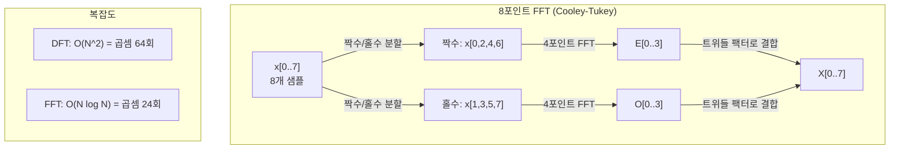
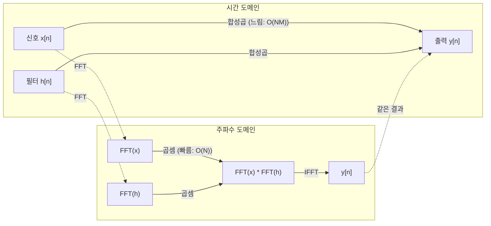

> 🇰🇷 이 문서는 한국어 번역본입니다(ELI5 스타일). 원문: [en.md](en.md)

# 푸리에 변환 (The Fourier Transform)

> 모든 신호는 사인파들의 합입니다. 푸리에 변환은 어떤 사인파들인지 알려 줍니다.

**유형:** Build
**언어:** Python
**선수 지식:** 페이즈 1, 레슨 01-04, 19(복소수)
**시간:** 약 90분

## 학습 목표

- DFT(이산 푸리에 변환)를 직접 구현하고, O(N log N) 복잡도의 Cooley-Tukey FFT와 비교해 검증합니다
- 주파수 계수를 해석합니다: 신호에서 진폭, 위상, 전력 스펙트럼을 추출합니다
- 합성곱 정리를 적용해 FFT 곱셈만으로 합성곱을 수행합니다
- 푸리에 주파수 분해를 트랜스포머의 위치 인코딩과 CNN의 합성곱 레이어와 연결합니다

## 문제 상황

오디오 녹음은 시간에 따른 압력 측정값의 나열입니다. 주가는 날짜에 따른 값의 나열이고요. 이미지는 공간에 펼쳐진 픽셀 밝기 격자입니다. 이것들은 모두 시간 도메인(또는 공간 도메인)의 데이터입니다. 어떤 인덱스를 따라 값이 변해 가는 모습을 보는 것이죠.

그런데 많은 패턴은 시간 도메인에서는 보이지 않습니다. 이 오디오 신호는 순수한 단일음일까요, 아니면 화음일까요? 이 주가에는 주간 주기가 있을까요? 이 이미지에는 반복되는 질감이 있을까요? 이런 질문은 모두 주파수 성분에 관한 것인데, 시간 도메인은 그것을 숨겨 버립니다.

푸리에 변환은 데이터를 시간 도메인에서 주파수 도메인으로 바꿔 줍니다. 신호를 받아서 서로 다른 주파수의 사인파들로 분해하죠. 각 사인파에는 진폭(얼마나 강한지)과 위상(어디서 시작하는지)이 있는데, 푸리에 변환은 이 둘을 모두 알려 줍니다.

머신러닝에서 이것이 중요한 이유는 주파수 도메인 사고가 어디에나 등장하기 때문입니다. 합성곱 신경망(CNN)은 합성곱을 수행하는데, 이는 주파수 도메인에서의 곱셈과 같습니다. 트랜스포머의 위치 인코딩은 주파수 분해로 위치를 표현합니다. 오디오 모델(음성 인식, 음악 생성)은 스펙트로그램, 즉 소리의 주파수 표현을 다룹니다. 시계열 모델은 주기적 패턴을 찾고요. 푸리에 변환을 이해하면 이 모든 것을 다룰 수 있는 어휘가 생깁니다.

## 핵심 개념

### DFT의 정의

샘플 N개(x[0], x[1], ..., x[N-1])가 주어지면, 이산 푸리에 변환(DFT)은 주파수 계수 N개(X[0], X[1], ..., X[N-1])를 만들어 냅니다:

```
X[k] = sum_{n=0}^{N-1} x[n] * e^(-2*pi*i*k*n/N)

for k = 0, 1, ..., N-1
```

각 X[k]는 복소수입니다. 크기 |X[k]|는 주파수 k의 진폭을, 위상 angle(X[k])은 그 주파수의 위상 오프셋을 알려 줍니다.

핵심 통찰: `e^(-2*pi*i*k*n/N)`는 주파수 k로 회전하는 페이저(phasor)입니다. DFT는 신호와 균등한 간격으로 배치된 N개 주파수 각각 사이의 상관관계를 계산합니다. 신호에 주파수 k의 에너지가 들어 있으면 상관관계가 커지고, 없으면 거의 0이 됩니다.

### 각 계수의 의미

**X[0]: DC 성분.** 모든 샘플의 합, 즉 평균에 비례하는 값입니다. 신호의 상수(주파수 0) 오프셋을 나타냅니다.

```
X[0] = sum_{n=0}^{N-1} x[n] * e^0 = sum of all samples
```

**1 <= k <= N/2인 X[k]: 양의 주파수.** X[k]는 N개 샘플당 k주기의 주파수를 나타냅니다. k가 클수록 주파수가 높습니다(더 빠른 진동).

**X[N/2]: 나이퀴스트 주파수.** N개 샘플로 표현할 수 있는 가장 높은 주파수입니다. 이보다 높으면 앨리어싱(aliasing, 높은 주파수가 낮은 주파수로 둔갑하는 현상)이 생깁니다.

**N/2 < k < N인 X[k]: 음의 주파수.** 실수 신호에서는 X[N-k] = conj(X[k])가 성립합니다. 음의 주파수는 양의 주파수의 거울상입니다. 그래서 유용한 정보는 처음 N/2 + 1개 계수에 들어 있습니다.

### 역 DFT

역 DFT는 주파수 계수로부터 원래 신호를 복원합니다:

```
x[n] = (1/N) * sum_{k=0}^{N-1} X[k] * e^(2*pi*i*k*n/N)

for n = 0, 1, ..., N-1
```

순방향 DFT와의 차이는 딱 두 가지입니다. 지수의 부호가 (음이 아니라) 양수라는 것, 그리고 1/N 정규화 인자가 붙는다는 것.

역 DFT는 완벽한 복원입니다. 정보가 하나도 손실되지 않습니다. 시간 도메인에서 주파수 도메인으로 갔다가 오류 없이 되돌아올 수 있습니다. DFT는 기저(basis)의 교체입니다. 즉 같은 정보를 다른 좌표계로 다시 표현하는 것이죠.

### FFT: 빠르게 만들기

위에서 정의한 DFT는 O(N^2)입니다. 출력 계수 N개 각각에 대해 입력 샘플 N개를 모두 더해야 하기 때문입니다. N이 100만이면 10^12번의 연산이 필요합니다.

고속 푸리에 변환(FFT)은 같은 결과를 O(N log N)에 계산합니다. N이 100만일 때 조 단위가 아니라 약 2,000만 번의 연산으로 끝나죠. 주파수 분석이 실용적인 기술이 된 이유가 바로 이것입니다.

Cooley-Tukey 알고리즘(가장 널리 쓰이는 FFT)은 분할 정복으로 동작합니다:

1. 신호를 짝수 인덱스 샘플과 홀수 인덱스 샘플로 나눕니다.
2. 각 절반의 DFT를 재귀적으로 계산합니다.
3. "트위들 팩터(twiddle factor)" e^(-2*pi*i*k/N)를 이용해 절반 크기의 두 DFT를 합칩니다.

```
X[k] = E[k] + e^(-2*pi*i*k/N) * O[k]          for k = 0, ..., N/2 - 1
X[k + N/2] = E[k] - e^(-2*pi*i*k/N) * O[k]    for k = 0, ..., N/2 - 1

where E = DFT of even-indexed samples
      O = DFT of odd-indexed samples
```

이 대칭성 덕분에 재귀의 각 단계에서 하는 일은 O(N)이고, 단계 수는 log2(N)입니다. 합계: O(N log N).



FFT는 신호 길이가 2의 거듭제곱이어야 합니다. 실제로는 신호를 다음 2의 거듭제곱 길이가 될 때까지 제로 패딩합니다.

### 스펙트럼 분석

**전력 스펙트럼(power spectrum)**은 |X[k]|^2, 즉 각 주파수 계수 크기의 제곱입니다. 각 주파수에 에너지가 얼마나 있는지 보여 줍니다.

**위상 스펙트럼(phase spectrum)**은 angle(X[k]), 즉 각 주파수의 위상 오프셋입니다. 대부분의 분석 작업에서는 전력 스펙트럼에 관심이 있고 위상은 무시합니다.

```
Power at frequency k:  P[k] = |X[k]|^2 = X[k].real^2 + X[k].imag^2
Phase at frequency k:  phi[k] = atan2(X[k].imag, X[k].real)
```

### 주파수 분해능

DFT의 주파수 분해능은 샘플 개수 N과 샘플링 레이트 fs에 따라 달라집니다.

```
Frequency of bin k:      f_k = k * fs / N
Frequency resolution:    delta_f = fs / N
Maximum frequency:       f_max = fs / 2  (Nyquist)
```

가까이 붙어 있는 두 주파수를 구분하려면 샘플이 더 많아야 합니다. 높은 주파수를 잡아내려면 샘플링 레이트가 더 높아야 합니다.

### 합성곱 정리

신호처리에서 가장 중요한 결과 중 하나이며, CNN과도 직접 연결됩니다.

**시간 도메인에서의 합성곱은 주파수 도메인에서의 원소별 곱셈과 같습니다.**

```
x * h = IFFT(FFT(x) . FFT(h))

where * is convolution and . is element-wise multiplication
```

왜 중요한가:

- 길이 N과 M인 두 신호를 직접 합성곱하려면 O(N*M) 연산이 듭니다.
- FFT 기반 합성곱은 O(N log N)입니다. 둘 다 변환하고, 곱하고, 되돌리면 끝입니다.
- 커널이 클 때는 FFT 합성곱이 극적으로 빠릅니다.
- 수용 영역(receptive field)이 넓은 합성곱 레이어에서 정확히 이런 일이 일어납니다.

참고: DFT는 원형 합성곱(신호가 끝에서 다시 처음으로 이어짐)을 계산합니다. 선형 합성곱(순환 없음)을 원한다면 계산 전에 두 신호를 길이 N + M - 1로 제로 패딩하세요.



### 윈도잉(windowing)

DFT는 신호가 주기적이라고 가정합니다. 즉 N개 샘플을 무한히 반복되는 신호의 한 주기로 취급하죠. 신호의 시작 값과 끝 값이 같지 않으면 경계에서 불연속이 생기고, 이것이 가짜 고주파 성분으로 드러납니다. 이를 스펙트럼 누설(spectral leakage)이라고 합니다.

윈도잉은 DFT를 계산하기 전에 신호 양끝을 0으로 서서히 줄여서(taper) 누설을 줄입니다.

자주 쓰이는 윈도우:

| 윈도우 | 모양 | 주 로브(main lobe) 폭 | 부 로브(side lobe) 크기 | 용도 |
|--------|-------|----------------|-----------------|----------|
| Rectangular | 평평함(윈도우 없음) | 가장 좁음 | 가장 높음(-13 dB) | 신호가 N개 샘플 안에서 정확히 주기적일 때 |
| Hann | 상승 코사인 | 보통 | 낮음(-31 dB) | 범용 스펙트럼 분석 |
| Hamming | 변형 코사인 | 보통 | 더 낮음(-42 dB) | 오디오 처리, 음성 분석 |
| Blackman | 삼중 코사인 | 넓음 | 매우 낮음(-58 dB) | 부 로브 억제가 결정적으로 중요할 때 |

```
Hann window:    w[n] = 0.5 * (1 - cos(2*pi*n / (N-1)))
Hamming window: w[n] = 0.54 - 0.46 * cos(2*pi*n / (N-1))
```

DFT 전에 윈도우를 신호와 원소별로 곱해서 적용합니다: `X = DFT(x * w)`.

### DFT의 성질

| 성질 | 시간 도메인 | 주파수 도메인 |
|----------|-------------|-----------------|
| 선형성 | a*x + b*y | a*X + b*Y |
| 시간 이동 | x[n - k] | X[f] * e^(-2*pi*i*f*k/N) |
| 주파수 이동 | x[n] * e^(2*pi*i*f0*n/N) | X[f - f0] |
| 합성곱 | x * h | X * H (원소별) |
| 곱셈 | x * h (원소별) | X * H (원형 합성곱, 1/N 배) |
| 파르스발 정리 | sum \|x[n]\|^2 | (1/N) * sum \|X[k]\|^2 |
| 켤레 대칭(실수 입력) | x[n] real | X[k] = conj(X[N-k]) |

파르스발 정리는 두 도메인에서 총 에너지가 같다는 뜻입니다. 변환을 거쳐도 에너지는 보존됩니다.

### 위치 인코딩과의 연결

원조 트랜스포머는 사인-코사인 기반(sinusoidal) 위치 인코딩을 사용합니다:

```
PE(pos, 2i)   = sin(pos / 10000^(2i/d_model))
PE(pos, 2i+1) = cos(pos / 10000^(2i/d_model))
```

각 차원 쌍 (2i, 2i+1)은 서로 다른 주파수로 진동합니다. 주파수는 (0, 1) 차원의 높은 값에서 마지막 차원의 낮은 값까지 등비적으로 배치됩니다. 덕분에 각 위치는 모든 주파수 대역에 걸쳐 고유한 패턴을 갖게 됩니다. 푸리에 계수가 신호를 고유하게 식별하는 것과 비슷한 원리죠.

이 방식이 제공하는 핵심 성질:

- **고유성:** 두 위치가 같은 인코딩을 갖는 일은 없습니다.
- **값의 범위 제한:** sin과 cos은 항상 [-1, 1] 안에 있습니다.
- **상대 위치:** 위치 p+k의 인코딩은 위치 p의 인코딩에 대한 선형 함수로 표현할 수 있습니다. 모델은 상대적 위치에 어텐션하는 법을 배울 수 있습니다.

### CNN과의 연결

합성곱 레이어는 학습된 필터(커널)를 신호나 이미지 위로 미끄러뜨리며 입력에 적용합니다. 수학적으로 이것이 바로 합성곱 연산입니다.

합성곱 정리에 따르면 이것은 다음과 같습니다:
1. 입력을 FFT하고
2. 커널을 FFT한 다음
3. 주파수 도메인에서 곱하고
4. 결과를 IFFT하는 것과 동일합니다

표준 CNN 구현은 직접 합성곱을 사용합니다(작은 3x3 커널에서는 이쪽이 더 빠릅니다). 하지만 커널이 크거나 전역 합성곱인 경우에는 FFT 기반 방식이 훨씬 빠릅니다. 일부 아키텍처(FNet 등)는 어텐션을 아예 FFT로 대체해서 O(N^2) 대신 O(N log N) 복잡도로 경쟁력 있는 정확도를 냅니다.

### 스펙트로그램과 단시간 푸리에 변환(STFT)

FFT 한 번으로는 신호 전체의 주파수 성분을 알 수 있지만, 그 주파수가 언제 나타나는지는 전혀 알 수 없습니다. 처프(chirp, 주파수가 시간에 따라 올라가는 신호)와 화음(모든 주파수가 동시에 존재)은 크기 스펙트럼이 같을 수 있죠.

단시간 푸리에 변환(STFT)은 신호를 겹치는 윈도우 단위로 잘라 각각 FFT를 계산해서 이 문제를 해결합니다. 그 결과가 스펙트로그램(spectrogram)입니다. 한 축은 시간, 다른 축은 주파수인 2차원 표현으로, 각 지점의 세기는 그 시각에 그 주파수가 가진 에너지를 보여 줍니다.

```
STFT 절차:
1. 윈도우 크기를 정한다 (예: 1024 샘플)
2. 홉 크기를 정한다 (예: 256 샘플 -- 75% 겹침)
3. 각 윈도우 위치마다:
   a. 윈도우로 잘라낸 구간을 꺼낸다
   b. Hann/Hamming 윈도우를 적용한다
   c. FFT를 계산한다
   d. 크기 스펙트럼을 스펙트로그램의 한 열로 저장한다
```

스펙트로그램은 오디오 머신러닝 모델의 표준 입력 표현입니다. 음성 인식 모델(Whisper, DeepSpeech)은 멜 스펙트로그램(mel-spectrogram)을 다룹니다. 주파수를 멜 스케일로 매핑한 스펙트로그램으로, 사람의 음높이 지각을 더 잘 반영합니다.

### 앨리어싱(aliasing)

신호에 fs/2(나이퀴스트 주파수)보다 높은 주파수가 들어 있으면, fs 레이트로 샘플링할 때 앨리어싱된 복제가 생깁니다. 90 Hz 신호를 100 Hz로 샘플링하면 10 Hz 신호와 똑같아 보입니다. 샘플만으로는 둘을 구분할 방법이 없습니다.

```
예시:
  실제 신호: 90 Hz 사인파
  샘플링 레이트: 100 Hz
  겉보기 주파수: 100 - 90 = 10 Hz

  100 Hz로 샘플링한 90 Hz 신호의 샘플들은
  10 Hz 신호의 샘플들과 완전히 동일합니다.
  어떤 수학을 써도 원래의 90 Hz는 복원할 수 없습니다.
```

그래서 아날로그-디지털 변환기에는 샘플링 전에 나이퀴스트 이상의 주파수를 제거하는 안티 앨리어싱 필터가 들어 있습니다. 머신러닝에서는 특성 맵(feature map)을 제대로 된 로우패스 필터링 없이 다운샘플링할 때 앨리어싱이 나타나며, 일부 아키텍처는 안티 앨리어싱 풀링 레이어로 이를 해결합니다.

### 제로 패딩은 분해능을 높이지 않습니다

흔한 오해가 하나 있습니다. FFT 전에 신호를 제로 패딩하면 주파수 분해능이 좋아진다는 것인데, 사실이 아닙니다. 제로 패딩은 기존 주파수 빈(bin)들 사이를 보간해 스펙트럼을 더 매끄러워 보이게 할 뿐입니다. 원래 샘플에 없던 주파수 세부 정보를 새로 드러내지는 못합니다.

진짜 주파수 분해능은 관측 시간 T = N / fs에만 의존합니다. delta_f만큼 떨어진 두 주파수를 구분하려면 최소 T = 1 / delta_f초 분량의 데이터가 필요합니다. 제로 패딩을 아무리 해도 이 근본 한계는 바뀌지 않습니다.

```figure
fourier-synthesis
```

## 직접 만들기

### 단계 1: DFT를 직접 구현

O(N^2) DFT는 정의에서 바로 나옵니다.

```python
import math

class Complex:
    ...

def dft(x):
    N = len(x)
    result = []
    for k in range(N):
        total = Complex(0, 0)
        for n in range(N):
            angle = -2 * math.pi * k * n / N
            w = Complex(math.cos(angle), math.sin(angle))
            xn = x[n] if isinstance(x[n], Complex) else Complex(x[n])
            total = total + xn * w
        result.append(total)
    return result
```

### 단계 2: 역 DFT

구조는 같고, 지수는 양수, N으로 나눕니다.

```python
def idft(X):
    N = len(X)
    result = []
    for n in range(N):
        total = Complex(0, 0)
        for k in range(N):
            angle = 2 * math.pi * k * n / N
            w = Complex(math.cos(angle), math.sin(angle))
            total = total + X[k] * w
        result.append(Complex(total.real / N, total.imag / N))
    return result
```

### 단계 3: FFT (Cooley-Tukey)

재귀 FFT는 길이가 2의 거듭제곱이어야 합니다. 짝수와 홀수로 나누고, 재귀 호출하고, 트위들 팩터로 합칩니다.

```python
def fft(x):
    N = len(x)
    if N <= 1:
        return [x[0] if isinstance(x[0], Complex) else Complex(x[0])]
    if N % 2 != 0:
        return dft(x)

    even = fft([x[i] for i in range(0, N, 2)])
    odd = fft([x[i] for i in range(1, N, 2)])

    result = [Complex(0)] * N
    for k in range(N // 2):
        angle = -2 * math.pi * k / N
        twiddle = Complex(math.cos(angle), math.sin(angle))
        t = twiddle * odd[k]
        result[k] = even[k] + t
        result[k + N // 2] = even[k] - t
    return result
```

### 단계 4: 스펙트럼 분석 도우미 함수

```python
def power_spectrum(X):
    return [xk.real ** 2 + xk.imag ** 2 for xk in X]

def convolve_fft(x, h):
    N = len(x) + len(h) - 1
    padded_N = 1
    while padded_N < N:
        padded_N *= 2

    x_padded = x + [0.0] * (padded_N - len(x))
    h_padded = h + [0.0] * (padded_N - len(h))

    X = fft(x_padded)
    H = fft(h_padded)

    Y = [xk * hk for xk, hk in zip(X, H)]

    y = idft(Y)
    return [y[n].real for n in range(N)]
```

## 실전에서 쓰기

실제 작업에서는 고도로 최적화된 C 라이브러리에 기반한 numpy의 FFT를 사용하세요.

```python
import numpy as np

signal = np.sin(2 * np.pi * 5 * np.arange(256) / 256)
spectrum = np.fft.fft(signal)
freqs = np.fft.fftfreq(256, d=1/256)

power = np.abs(spectrum) ** 2

positive_freqs = freqs[:len(freqs)//2]
positive_power = power[:len(power)//2]
```

윈도잉과 더 고급 스펙트럼 분석이 필요하면:

```python
from scipy.signal import windows, stft

window = windows.hann(256)
windowed = signal * window
spectrum = np.fft.fft(windowed)
```

합성곱이 필요하면:

```python
from scipy.signal import fftconvolve

result = fftconvolve(signal, kernel, mode='full')
```

스펙트로그램이 필요하면:

```python
from scipy.signal import stft

frequencies, times, Zxx = stft(signal, fs=sample_rate, nperseg=256)
spectrogram = np.abs(Zxx) ** 2
```

스펙트로그램 행렬의 형태는 (n_frequencies, n_time_frames)입니다. 각 열은 한 시간 윈도우의 전력 스펙트럼이죠. 오디오 머신러닝 모델이 입력으로 받는 것이 바로 이것입니다.

## 출시하기

`code/fourier.py`를 실행하면 `outputs/prompt-spectral-analyzer.md`가 생성됩니다.

## 연습 문제

1. **순수 단일음 식별.** 알 수 없는 주파수(1~50 Hz 사이)의 사인파 하나로 신호를 만들고, 128 Hz로 1초 동안 샘플링합니다. 직접 만든 DFT로 주파수를 찾아 보고 답이 맞는지 확인하세요. 이어서 표준편차 0.5의 가우시안 노이즈를 더하고 반복해 보세요. 노이즈는 스펙트럼에 어떤 영향을 줄까요?

2. **FFT vs DFT 검증.** 길이 64의 랜덤 신호를 만듭니다. DFT(O(N^2))와 FFT를 둘 다 계산하고, 모든 계수가 1e-10 이내 오차로 일치하는지 확인하세요. 길이 256, 512, 1024, 2048짜리 신호에서 두 함수의 실행 시간을 재고, DFT 시간을 FFT 시간으로 나눈 비율을 그래프로 그려 보세요.

3. **예시로 확인하는 합성곱 정리.** 신호 x = [1, 2, 3, 4, 0, 0, 0, 0]과 필터 h = [1, 1, 1, 0, 0, 0, 0, 0]을 만듭니다. 원형 합성곱을 직접(중첩 반복문으로) 계산합니다. 그다음 FFT로도 계산해 보세요(변환, 곱셈, 역변환). 결과가 일치하는지 확인합니다. 마지막으로 적절히 제로 패딩해서 선형 합성곱을 계산해 보세요.

4. **윈도잉의 효과.** 10 Hz와 12 Hz(매우 가까움) 사인파 두 개의 합으로 신호를 만들고, 128 Hz로 1초 샘플링합니다. 윈도우 없음, Hann 윈도우, Hamming 윈도우 세 가지로 전력 스펙트럼을 계산해 보세요. 어떤 윈도우가 두 피크를 가장 쉽게 구분하게 해 줄까요? 그 이유는 무엇일까요?

5. **위치 인코딩 분석.** d_model = 128, max_pos = 512로 사인-코사인 위치 인코딩을 생성합니다. 모든 위치 쌍 (p1, p2)에 대해 인코딩끼리의 내적을 계산해 보세요. 내적이 절대 위치가 아니라 |p1 - p2|에만 의존함을 보이세요. 거리가 멀어질수록 내적은 어떻게 될까요?

## 핵심 용어

| 용어 | 의미 |
|------|---------------|
| DFT(이산 푸리에 변환) | 시간 도메인 샘플 N개를 주파수 도메인 계수 N개로 변환합니다. 각 계수는 해당 주파수의 복소 사인파와의 상관관계입니다 |
| FFT(고속 푸리에 변환) | DFT를 O(N log N)에 계산하는 알고리즘입니다. Cooley-Tukey 알고리즘은 짝수/홀수 인덱스를 재귀적으로 나눕니다 |
| 역 DFT | 주파수 계수로부터 시간 도메인 신호를 복원합니다. DFT와 같은 공식이되 지수 부호를 뒤집고 1/N을 곱합니다 |
| 주파수 빈(bin) | DFT 출력의 각 인덱스 k는 주파수 k*fs/N Hz를 나타냅니다. "빈"은 이산적인 주파수 슬롯입니다 |
| DC 성분 | X[0], 즉 주파수 0의 계수입니다. 신호 평균에 비례합니다 |
| 나이퀴스트 주파수 | fs/2로, 샘플링 레이트 fs에서 표현 가능한 최대 주파수입니다. 이보다 높은 주파수는 앨리어싱됩니다 |
| 전력 스펙트럼 | \|X[k]\|^2로, 각 주파수 계수 크기의 제곱입니다. 주파수 전반의 에너지 분포를 보여 줍니다 |
| 위상 스펙트럼 | angle(X[k])로, 각 주파수 성분의 위상 오프셋입니다. 분석에서는 흔히 무시합니다 |
| 스펙트럼 누설 | 비주기 신호를 주기적이라고 취급할 때 생기는 가짜 주파수 성분입니다. 윈도잉으로 줄일 수 있습니다 |
| 윈도우 함수 | 스펙트럼 누설을 줄이려고 DFT 전에 적용하는 테이퍼링 함수(Hann, Hamming, Blackman)입니다 |
| 트위들 팩터 | FFT 버터플라이 연산에서 하위 DFT들을 합칠 때 쓰는 복소지수 e^(-2*pi*i*k/N)입니다 |
| 합성곱 정리 | 시간 도메인의 합성곱은 주파수 도메인의 원소별 곱셈과 같다는 정리입니다. 신호처리와 CNN의 기본입니다 |
| 원형 합성곱 | 신호가 끝에서 처음으로 이어지는 합성곱입니다. DFT가 자연히 계산하는 것이 바로 이것입니다 |
| 선형 합성곱 | 순환 없는 표준 합성곱입니다. DFT 전에 제로 패딩하면 얻을 수 있습니다 |
| 파르스발 정리 | 푸리에 변환을 거쳐도 총 에너지가 보존된다는 정리입니다. sum \|x[n]\|^2 = (1/N) sum \|X[k]\|^2 |
| 앨리어싱 | 샘플링 레이트가 부족해서 나이퀴스트 이상의 주파수가 더 낮은 주파수로 나타나는 현상입니다 |

## 더 읽을거리

- [Cooley & Tukey: An Algorithm for the Machine Calculation of Complex Fourier Series (1965)](https://www.ams.org/journals/mcom/1965-19-090/S0025-5718-1965-0178586-1/) - 컴퓨팅의 판도를 바꾼 원조 FFT 논문
- [3Blue1Brown: But what is the Fourier Transform?](https://www.youtube.com/watch?v=spUNpyF58BY) - 푸리에 변환을 가장 잘 시각화해 보여 주는 입문 자료
- [Lee-Thorp et al.: FNet: Mixing Tokens with Fourier Transforms (2021)](https://arxiv.org/abs/2105.03824) - 트랜스포머의 셀프 어텐션을 FFT로 대체한 논문
- [Smith: The Scientist and Engineer's Guide to Digital Signal Processing](http://www.dspguide.com/) - FFT, 윈도잉, 스펙트럼 분석을 깊이 있게 다루는 무료 온라인 교과서
- [Vaswani et al.: Attention Is All You Need (2017)](https://arxiv.org/abs/1706.03762) - 푸리에 주파수 분해에서 파생된 사인-코사인 위치 인코딩이 나온 논문
- [Radford et al.: Whisper (2022)](https://arxiv.org/abs/2212.04356) - 멜 스펙트로그램을 입력 표현으로 쓰는 음성 인식 모델
