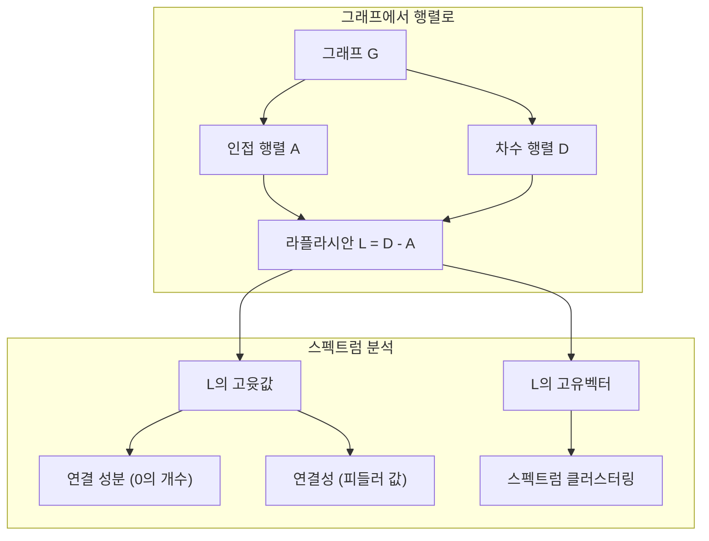
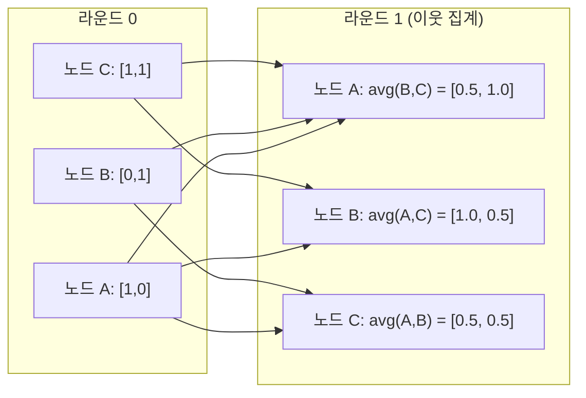

> 🇰🇷 이 문서는 한국어 번역본입니다(ELI5 스타일). 원문: [en.md](en.md)

# 머신러닝을 위한 그래프 이론

> 그래프는 '관계'를 담는 데이터 구조입니다. 데이터에 연결이 있다면 그래프 이론이 필요합니다.

**유형:** Build
**언어:** Python
**선수 지식:** 페이즈 1, 레슨 01-03(선형대수, 행렬)
**시간:** 약 90분

## 학습 목표

- 인접 행렬/리스트 표현을 갖춘 그래프 클래스를 만들고 BFS와 DFS 순회를 구현합니다
- 그래프 라플라시안을 계산하고, 그 고윳값으로 연결 성분을 찾고 노드를 클러스터링합니다
- GNN 스타일 메시지 패싱 한 라운드를 정규화된 인접 행렬 곱셈으로 구현합니다
- 스펙트럼 클러스터링으로 피들러 벡터(Fiedler vector)를 이용해 그래프를 분할합니다

## 문제 상황

소셜 네트워크, 분자, 지식 베이스, 논문 인용 네트워크, 도로 지도 — 이것들은 모두 그래프입니다. 전통적인 머신러닝은 데이터를 평평한 표로 취급합니다. 각 행은 독립적이고, 각 특성(feature)은 하나의 열이죠. 하지만 연결 구조가 중요할 때는 표 방식이 실패합니다.

소셜 네트워크를 생각해 봅시다. 어떤 사용자가 무슨 상품을 살지 예측하고 싶습니다. 그 사용자의 구매 이력도 중요하지만, 친구들의 구매 이력이 더 중요합니다. 연결 자체가 신호를 담고 있는 거죠.

분자도 마찬가지입니다. 어떤 분자가 단백질에 결합하는지 예측하고 싶다면, 원자도 중요하지만 진짜 중요한 것은 원자들이 서로 어떻게 결합되어 있는가입니다. 구조가 곧 데이터입니다.

그래프 신경망(GNN)은 딥러닝에서 가장 빠르게 성장하는 분야입니다. 신약 개발, 소셜 추천, 사기 탐지, 지식 그래프 추론을 떠받치고 있죠. 모든 GNN은 같은 기초 위에 서 있습니다. 바로 기본 그래프 이론입니다.

네 가지가 필요합니다:
1. 그래프를 행렬로 표현하는 방법(곱셈을 하려면)
2. 그래프 구조를 탐색하는 순회 알고리즘
3. 라플라시안 — 스펙트럼 그래프 이론에서 가장 중요한 행렬
4. 메시지 패싱 — GNN을 작동하게 만드는 연산

## 핵심 개념

### 그래프: 노드와 엣지

그래프 G = (V, E)는 정점(노드) 집합 V와 엣지 집합 E로 이루어집니다. 각 엣지는 두 노드를 연결합니다.

**방향 그래프 vs 무방향 그래프.** 무방향 그래프에서 엣지 (u, v)는 u가 v에 연결되고 v도 u에 연결된다는 뜻입니다. 방향 그래프(digraph)에서 엣지 (u, v)는 u가 v를 가리키지만, 그 반대가 성립한다는 보장은 없습니다.

**가중 그래프 vs 비가중 그래프.** 비가중 그래프에서 엣지는 있거나 없거나 둘 중 하나입니다. 가중 그래프에서는 각 엣지가 숫자 가중치(거리, 비용, 강도 등)를 가집니다.

| 그래프 유형 | 예시 |
|-----------|---------|
| 무방향, 비가중 | 페이스북 친구 네트워크 |
| 방향, 비가중 | 트위터 팔로우 네트워크 |
| 무방향, 가중 | 도로 지도(거리) |
| 방향, 가중 | 웹페이지 링크(PageRank 점수) |

### 인접 행렬

인접 행렬 A가 핵심 표현입니다. 노드 n개짜리 그래프에서:

```
A[i][j] = 1    if there is an edge from node i to node j
A[i][j] = 0    otherwise
```

무방향 그래프에서 A는 대칭입니다: A[i][j] = A[j][i]. 가중 그래프에서는 A[i][j] = 엣지 (i, j)의 가중치입니다.

**예시 — 삼각형:**

```
Nodes: 0, 1, 2
Edges: (0,1), (1,2), (0,2)

A = [[0, 1, 1],
     [1, 0, 1],
     [1, 1, 0]]
```

인접 행렬은 모든 GNN의 입력입니다. A에 대한 행렬 연산이 그래프에 대한 연산과 대응됩니다.

### 차수(Degree)

노드의 차수는 그 노드에 연결된 엣지의 개수입니다. 방향 그래프에서는 진입 차수(in-degree, 들어오는 엣지)와 진출 차수(out-degree, 나가는 엣지)가 따로 있습니다.

차수 행렬 D는 대각 행렬입니다:

```
D[i][i] = degree of node i
D[i][j] = 0    for i != j
```

삼각형 예시에서는 모든 노드가 두 노드와 연결되므로 D = diag(2, 2, 2)입니다.

차수는 노드의 중요도를 알려 줍니다. 차수가 높으면 허브 노드입니다. 네트워크의 차수 분포를 보면 구조가 드러납니다. 소셜 네트워크는 멱법(power law)을 따릅니다(허브는 몇 없고 잎 노드는 많음). 랜덤 그래프는 포아송 분포의 차수를 가집니다.

### BFS와 DFS

그래프 순회의 두 대표 알고리즘입니다. 둘 다 필요합니다.

**너비 우선 탐색(BFS):** 이웃을 먼저 모두 살펴본 뒤 이웃의 이웃으로 나아갑니다. 큐(FIFO)를 사용합니다.

```
BFS from node 0:
  Visit 0
  Queue: [1, 2]        (neighbors of 0)
  Visit 1
  Queue: [2, 3]        (add neighbors of 1)
  Visit 2
  Queue: [3]           (neighbors of 2 already visited)
  Visit 3
  Queue: []            (done)
```

BFS는 비가중 그래프에서 최단 경로를 찾습니다. 시작점에서 어떤 노드까지의 거리는 그 노드가 처음 발견된 BFS 레벨과 같습니다. 소셜 네트워크에서 홉 수 거리를 잴 때 BFS를 쓰는 이유입니다.

**깊이 우선 탐색(DFS):** 갈 수 있을 때까지 최대한 깊이 들어간 뒤 되돌아옵니다. 스택(LIFO)이나 재귀를 사용합니다.

```
DFS from node 0:
  Visit 0
  Stack: [1, 2]        (neighbors of 0)
  Visit 2               (pop from stack)
  Stack: [1, 3]         (add neighbors of 2)
  Visit 3               (pop from stack)
  Stack: [1]
  Visit 1               (pop from stack)
  Stack: []             (done)
```

DFS가 유용한 경우:
- 연결 성분 찾기(방문하지 않은 노드에서 DFS를 실행)
- 사이클 탐지(DFS 트리의 역방향 엣지)
- 위상 정렬(DFS 종료 순서의 역순)

| 알고리즘 | 자료구조 | 찾는 것 | 용도 |
|-----------|---------------|-------|----------|
| BFS | 큐 | 최단 경로 | 소셜 네트워크 거리, 지식 그래프 순회 |
| DFS | 스택 | 성분, 사이클 | 연결성, 위상 정렬 |

### 그래프 라플라시안

L = D - A. 스펙트럼 그래프 이론에서 가장 중요한 행렬입니다.

삼각형의 경우:

```
D = [[2, 0, 0],    A = [[0, 1, 1],    L = [[2, -1, -1],
     [0, 2, 0],         [1, 0, 1],         [-1, 2, -1],
     [0, 0, 2]]         [1, 1, 0]]         [-1, -1,  2]]
```

라플라시안은 놀라운 성질들을 가집니다:

1. **L은 양의 준정부호(positive semi-definite)입니다.** 모든 고윳값은 >= 0입니다.

2. **고윳값 0의 개수가 연결 성분의 개수와 같습니다.** 연결된 그래프는 고윳값 0을 정확히 하나 가집니다. 떨어진 성분 3개를 가진 그래프는 고윳값 0을 세 개 가집니다.

3. **0이 아닌 가장 작은 고윳값(피들러 값)이 연결 정도를 측정합니다.** 피들러 값이 크면 그래프가 촘촘하게 연결된 것이고, 작으면 병목 같은 약점이 있다는 뜻입니다.

4. **피들러 값의 고유벡터(피들러 벡터)가 가장 좋은 분할을 알려 줍니다.** 양수 값을 가진 노드는 한 그룹으로, 음수 값을 가진 노드는 다른 그룹으로 보내면 됩니다. 이것이 스펙트럼 클러스터링입니다.



### 스펙트럼 성질

인접 행렬과 라플라시안의 고윳값은 순회를 하나도 하지 않고 구조적 성질을 알려 줍니다.

**스펙트럼 클러스터링**은 이렇게 동작합니다:
1. 라플라시안 L을 계산합니다
2. L의 가장 작은 고윳값 k개에 해당하는 고유벡터를 찾습니다(연결된 그래프에서 첫 번째는 모두 1인 자명한 벡터이므로 건너뜁니다)
3. 그 고유벡터들을 각 노드의 새 좌표로 사용합니다
4. 그 좌표에 k-평균을 돌립니다

왜 동작할까요? L의 고유벡터는 그래프 위에서 "가장 매끄러운" 함수들을 인코딩합니다. 촘촘히 연결된 노드들은 비슷한 고유벡터 값을 갖고, 병목으로 갈라진 노드들은 다른 값을 갖습니다. 고유벡터가 자연스럽게 클러스터를 분리해 주는 거죠.

**랜덤 워크와의 연결.** 정규화된 라플라시안은 그래프 위의 랜덤 워크와 연결됩니다. 랜덤 워크의 정상 분포는 노드 차수에 비례합니다. 혼합 시간(워크가 수렴하는 속도)은 스펙트럼 갭에 달려 있습니다.

### 메시지 패싱

그래프 신경망의 핵심 연산입니다. 각 노드는 이웃들에게 메시지를 모으고, 모은 것을 집계하고, 자기 상태를 갱신합니다.

```
h_v^(k+1) = UPDATE(h_v^(k), AGGREGATE({h_u^(k) : u in neighbors(v)}))
```

가장 단순한 형태에서는 AGGREGATE = 평균, UPDATE = 선형 변환 + 활성화 함수입니다:

```
h_v^(k+1) = sigma(W * mean({h_u^(k) : u in neighbors(v)}))
```

이것은 변장한 행렬 곱셈입니다. H를 모든 노드 특성의 행렬, A를 인접 행렬이라고 하면:

```
H^(k+1) = sigma(A_norm * H^(k) * W)
```

여기서 A_norm은 정규화된 인접 행렬입니다(각 행의 합이 1).

메시지 패싱 한 라운드면 각 노드가 바로 이웃을 "볼" 수 있습니다. 두 라운드면 이웃의 이웃까지 볼 수 있고요. K 라운드를 쌓으면 각 노드가 K-홉 이웃까지의 정보를 얻습니다.



### 개념과 ML 응용

| 개념 | ML 응용 |
|---------|---------------|
| 인접 행렬 | GNN 입력 표현 |
| 그래프 라플라시안 | 스펙트럼 클러스터링, 커뮤니티 탐지 |
| BFS/DFS | 지식 그래프 순회, 경로 찾기 |
| 차수 분포 | 노드 중요도, 특성 엔지니어링 |
| 메시지 패싱 | GNN 레이어 (GCN, GAT, GraphSAGE) |
| L의 고윳값 | 커뮤니티 탐지, 그래프 분할 |
| 스펙트럼 클러스터링 | 비지도 노드 그룹화 |
| PageRank | 노드 중요도, 웹 검색 |

```figure
graph-degree-distribution
```

## 직접 만들기

### 단계 1: 그래프 클래스 직접 구현

```python
class Graph:
    def __init__(self, n_nodes, directed=False):
        self.n = n_nodes
        self.directed = directed
        self.adj = {i: {} for i in range(n_nodes)}

    def add_edge(self, u, v, weight=1.0):
        self.adj[u][v] = weight
        if not self.directed:
            self.adj[v][u] = weight

    def neighbors(self, node):
        return list(self.adj[node].keys())

    def degree(self, node):
        return len(self.adj[node])

    def adjacency_matrix(self):
        import numpy as np
        A = np.zeros((self.n, self.n))
        for u in range(self.n):
            for v, w in self.adj[u].items():
                A[u][v] = w
        return A

    def degree_matrix(self):
        import numpy as np
        D = np.zeros((self.n, self.n))
        for i in range(self.n):
            D[i][i] = self.degree(i)
        return D

    def laplacian(self):
        return self.degree_matrix() - self.adjacency_matrix()
```

인접 리스트(`self.adj`)는 이웃을 효율적으로 저장합니다. 인접 행렬 변환에는 numpy를 씁니다. 스펙트럼 연산들이 모두 numpy를 필요로 하기 때문입니다.

### 단계 2: BFS와 DFS

```python
from collections import deque

def bfs(graph, start):
    visited = set()
    order = []
    distances = {}
    queue = deque([(start, 0)])
    visited.add(start)
    while queue:
        node, dist = queue.popleft()
        order.append(node)
        distances[node] = dist
        for neighbor in graph.neighbors(node):
            if neighbor not in visited:
                visited.add(neighbor)
                queue.append((neighbor, dist + 1))
    return order, distances


def dfs(graph, start):
    visited = set()
    order = []
    stack = [start]
    while stack:
        node = stack.pop()
        if node in visited:
            continue
        visited.add(node)
        order.append(node)
        for neighbor in reversed(graph.neighbors(node)):
            if neighbor not in visited:
                stack.append(neighbor)
    return order
```

BFS는 O(1) popleft를 위해 deque(양방향 큐)를 씁니다. DFS는 리스트를 스택으로 쓰죠. 둘 다 모든 노드를 정확히 한 번씩 방문합니다 — 시간 복잡도 O(V + E).

### 단계 3: 연결 성분과 라플라시안 고윳값

```python
def connected_components(graph):
    visited = set()
    components = []
    for node in range(graph.n):
        if node not in visited:
            order, _ = bfs(graph, node)
            visited.update(order)
            components.append(order)
    return components


def laplacian_eigenvalues(graph):
    import numpy as np
    L = graph.laplacian()
    eigenvalues = np.linalg.eigvalsh(L)
    return eigenvalues
```

`eigvalsh`는 대칭 행렬용입니다 — 무방향 그래프의 라플라시안은 항상 대칭이죠. 고윳값을 오름차순으로 돌려 줍니다. 0의 개수를 세면 연결 성분의 개수가 나옵니다.

### 단계 4: 스펙트럼 클러스터링

```python
def spectral_clustering(graph, k=2):
    import numpy as np
    L = graph.laplacian()
    eigenvalues, eigenvectors = np.linalg.eigh(L)
    features = eigenvectors[:, 1:k+1]

    labels = np.zeros(graph.n, dtype=int)
    for i in range(graph.n):
        if features[i, 0] >= 0:
            labels[i] = 0
        else:
            labels[i] = 1
    return labels
```

k=2일 때는 피들러 벡터의 부호가 그래프를 두 클러스터로 갈라 줍니다. k>2이면 처음 k개 고유벡터(자명한 전부 1인 고유벡터는 제외)에 k-평균을 돌리면 됩니다.

### 단계 5: 메시지 패싱

```python
def message_passing(graph, features, weight_matrix):
    import numpy as np
    A = graph.adjacency_matrix()
    row_sums = A.sum(axis=1, keepdims=True)
    row_sums[row_sums == 0] = 1
    A_norm = A / row_sums
    aggregated = A_norm @ features
    output = aggregated @ weight_matrix
    return output
```

GNN 메시지 패싱 한 라운드입니다. 각 노드의 새 특성은 이웃 특성들의 가중 평균을 가중치 행렬로 변형한 것입니다. 여러 라운드를 쌓으면 정보가 더 멀리 퍼집니다.

## 실전에서 쓰기

networkx와 numpy를 쓰면 같은 연산이 한 줄짜리 코드가 됩니다:

```python
import networkx as nx
import numpy as np

G = nx.karate_club_graph()

A = nx.adjacency_matrix(G).toarray()
L = nx.laplacian_matrix(G).toarray()

eigenvalues = np.linalg.eigvalsh(L.astype(float))
print(f"Smallest eigenvalues: {eigenvalues[:5]}")
print(f"Connected components: {nx.number_connected_components(G)}")

communities = nx.community.greedy_modularity_communities(G)
print(f"Communities found: {len(communities)}")

pr = nx.pagerank(G)
top_nodes = sorted(pr.items(), key=lambda x: x[1], reverse=True)[:5]
print(f"Top 5 PageRank nodes: {top_nodes}")
```

networkx는 최적화된 C 백엔드로 어떤 크기의 그래프든 처리합니다. 프로덕션(운영 환경)에서는 이 라이브러리를 쓰세요. 직접 구현한 버전은 그것이 무엇을 하는지 이해하기 위한 것입니다.

### numpy 스펙트럼 분석

```python
import numpy as np

A = np.array([
    [0, 1, 1, 0, 0],
    [1, 0, 1, 0, 0],
    [1, 1, 0, 1, 0],
    [0, 0, 1, 0, 1],
    [0, 0, 0, 1, 0]
])

D = np.diag(A.sum(axis=1))
L = D - A

eigenvalues, eigenvectors = np.linalg.eigh(L)
print(f"Eigenvalues: {np.round(eigenvalues, 4)}")
print(f"Fiedler value: {eigenvalues[1]:.4f}")
print(f"Fiedler vector: {np.round(eigenvectors[:, 1], 4)}")

fiedler = eigenvectors[:, 1]
group_a = np.where(fiedler >= 0)[0]
group_b = np.where(fiedler < 0)[0]
print(f"Cluster A: {group_a}")
print(f"Cluster B: {group_b}")
```

무거운 일은 피들러 벡터가 해 줍니다. 양수 항목은 한 클러스터로, 음수 항목은 다른 클러스터로 갑니다. 반복 최적화 같은 것 필요 없이 고유분해 한 번이면 끝입니다.

## 출시하기

이 레슨이 만드는 것:
- `outputs/skill-graph-analysis.md` -- 그래프 구조 데이터를 분석하기 위한 스킬 레퍼런스

## 연결고리

| 개념 | 등장하는 곳 |
|---------|------------------|
| 인접 행렬 | GCN, GAT, GraphSAGE 입력 |
| 라플라시안 | 스펙트럼 클러스터링, ChebNet 필터 |
| BFS | 지식 그래프 순회, 최단 경로 질의 |
| 메시지 패싱 | 모든 GNN 레이어, 신경망 메시지 패싱 |
| 스펙트럼 갭 | 그래프 연결성, 랜덤 워크의 혼합 시간 |
| 차수 분포 | 멱법 네트워크, 노드 특성 엔지니어링 |
| 연결 성분 | 전처리, 끊어진 그래프 처리 |
| PageRank | 노드 중요도 순위, 어텐션 초기화 |

GNN은 특별히 짚고 넘어갈 가치가 있습니다. GCN(Kipf & Welling, 2017)의 그래프 합성곱 연산은 셀프 루프를 더한 인접 행렬, 즉 A_hat = A + I를 사용합니다:

```text
H^(l+1) = sigma(D_hat^(-1/2) * A_hat * D_hat^(-1/2) * H^(l) * W^(l))
```

여기서 A_hat = A + I(인접 행렬에 셀프 루프 추가)이고 D_hat은 A_hat의 차수 행렬입니다. 셀프 루프는 집계 과정에서 각 노드가 자기 자신의 특성도 포함하도록 해 줍니다. 이것이 정확히 대칭 정규화가 적용된 메시지 패싱입니다. D_hat^(-1/2) * A_hat * D_hat^(-1/2)가 정규화된 인접 행렬이죠. 라플라시안이 여기 등장하는 이유는 이 정규화가 L_sym = I - D^(-1/2) * A * D^(-1/2)와 연관되기 때문입니다. 라플라시안을 이해하면 GCN이 왜 동작하는지 이해하게 됩니다.

## 연습 문제

1. **PageRank를 직접 구현합니다.** 균등한 점수로 시작합니다. 각 단계에서: v를 가리키는 모든 u에 대해 score(v) = (1-d)/n + d * sum(score(u)/out_degree(u)). d=0.85를 사용하고, 변화량이 1e-6 미만이 될 때까지 반복합니다. 작은 웹 그래프로 테스트해 보세요.

2. **스펙트럼 클러스터링으로 커뮤니티를 찾습니다.** 두 개의 뚜렷이 분리된 클러스터를 가진 그래프를 만듭니다(예: 엣지 하나로 연결된 두 클리크). 스펙트럼 클러스터링을 돌리고 올바른 분할을 찾는지 확인하세요. 클러스터 사이 엣지를 더 추가하면 어떻게 될까요?

3. **가중 그래프의 최단 경로를 위한 다익스트라 알고리즘을 구현합니다.** 같은 그래프에 균등 가중치를 준 상태에서 BFS 결과와 비교해 보세요.

4. **2층 메시지 패싱 네트워크를 만듭니다.** 서로 다른 가중치 행렬로 메시지 패싱을 두 번 적용합니다. 2라운드 후 각 노드가 2-홉 이웃의 정보를 갖게 됨을 보이세요.

5. **실제 그래프를 분석합니다.** Karate Club 그래프(노드 34개, 엣지 78개)를 사용해 차수 분포, 라플라시안 고윳값, 스펙트럼 클러스터링을 계산합니다. 스펙트럼 클러스터링 결과를 알려진 정답 분할과 비교해 보세요.

## 핵심 용어

| 용어 | 사람들이 말하는 것 | 실제 의미 |
|------|----------------|----------------------|
| 그래프 | "노드와 엣지" | 쌍별 관계를 인코딩하는 수학적 구조 G=(V,E) |
| 인접 행렬 | "연결 표" | n x n 행렬로, 노드 i와 j가 연결되어 있으면 A[i][j] = 1 |
| 차수(degree) | "노드가 얼마나 연결되어 있는가" | 어떤 노드에 닿아 있는 엣지의 개수 |
| 라플라시안 | "D 빼기 A" | L = D - A로, 그 고윳값이 그래프 구조를 드러내는 행렬 |
| 피들러 값 | "대수적 연결성" | L의 0이 아닌 가장 작은 고윳값으로, 그래프가 얼마나 잘 연결되었는지를 측정 |
| BFS | "레벨별 탐색" | 더 깊이 가기 전에 모든 이웃을 먼저 방문하는 순회, 최단 경로를 찾음 |
| DFS | "일단 깊이 들어가기" | 한 경로를 끝까지 따라간 뒤에 되돌아오는 순회 |
| 메시지 패싱 | "노드끼리 이웃과 대화" | 각 노드가 이웃의 정보를 집계하는 것으로, GNN의 핵심 |
| 스펙트럼 클러스터링 | "고유벡터로 클러스터링" | 라플라시안의 고유벡터를 이용해 그래프를 분할 |
| 연결 성분 | "떨어져 있는 한 덩어리" | 어떤 노드에서든 다른 모든 노드에 도달할 수 있는 최대 부분그래프 |

## 더 읽을거리

- **Kipf & Welling (2017)** -- "Semi-Supervised Classification with Graph Convolutional Networks." 현대 GNN의 시대를 연 논문입니다. 스펙트럼 그래프 합성곱이 메시지 패싱으로 단순해짐을 보여 줍니다.
- **Spielman (2012)** -- "Spectral Graph Theory" 강의 노트. 라플라시안, 스펙트럼 갭, 그래프 분할의 정석적인 입문 자료입니다.
- **Hamilton (2020)** -- "Graph Representation Learning." GNN을 기초부터 응용까지 다루는 책입니다.
- **Bronstein et al. (2021)** -- "Geometric Deep Learning: Grids, Groups, Graphs, Geodesics, and Gauges." 여러 구조를 하나로 묶는 통합 프레임워크 논문입니다.
- **Veličković et al. (2018)** -- "Graph Attention Networks." 메시지 패싱에 어텐션 메커니즘을 더한 논문입니다.
