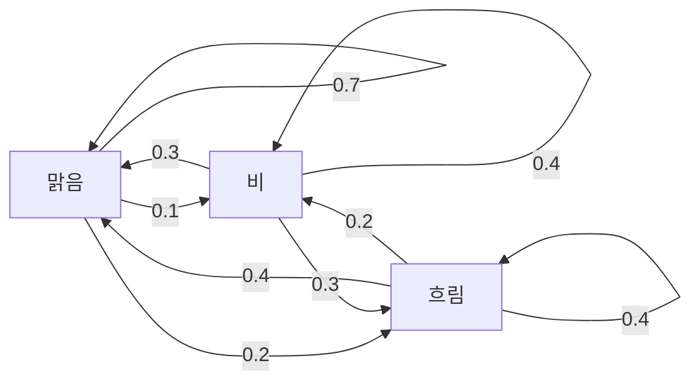
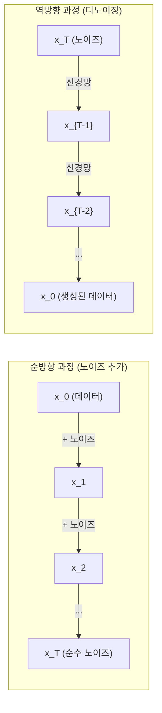

> 🇰🇷 이 문서는 한국어 번역본입니다(ELI5 스타일). 원문: [en.md](en.md)

# 확률 과정 (Stochastic Processes)

> 구조를 가진 무작위성. 랜덤 워크, 마르코프 연쇄, 확산 모델 뒤에 있는 수학입니다.

**유형:** Learn
**언어:** Python
**선수 지식:** 페이즈 1, 레슨 06-07(확률, 베이즈)
**시간:** 약 75분

## 학습 목표

- 1차원과 2차원 랜덤 워크를 시뮬레이션하고 이동 거리가 sqrt(n)로 늘어남을 검증합니다
- 마르코프 연쇄 시뮬레이터를 만들고 고유분해로 정상 분포를 계산합니다
- 목표 분포에서 샘플을 뽑기 위해 메트로폴리스-헤이스팅스 MCMC와 랑주뱅 동역학을 구현합니다
- 순방향 확산 과정을 브라운 운동과 연결하고, 역방향 과정이 어떻게 데이터를 생성하는지 설명합니다

## 문제 상황

많은 AI 시스템에는 시간에 따라 진화하는 무작위성이 있습니다. 정적인 무작위성이 아니라, 각 단계가 앞선 단계에 의존하는 구조적인 순차적 무작위성입니다.

언어 모델은 토큰을 하나씩 생성합니다. 각 토큰은 앞선 컨텍스트에 의존하죠. 모델이 확률 분포를 출력하고, 그것에서 샘플을 뽑고, 다음으로 넘어갑니다. 이것이 확률 과정입니다.

확산 모델은 이미지에 노이즈를 한 단계씩 더해 완전한 지직거림(static)으로 만듭니다. 그다음 과정을 거꾸로 돌려, 노이즈를 한 단계씩 제거하며 새 이미지가 나타나게 하죠. 순방향 과정은 마르코프 연쇄입니다. 역방향 과정은 학습된 마르코프 연쇄를 거꾸로 돌리는 것입니다.

강화 학습 에이전트는 환경 안에서 행동을 선택합니다. 각 행동은 어떤 확률로 새로운 상태로 이어지죠. 에이전트는 무작위 세계에서 무작위 정책을 따릅니다. 이 모든 것은 마르코프 결정 과정입니다.

MCMC 샘플링 — 베이즈 추론의 근간 — 은 정상 분포가 여러분이 샘플링하고 싶은 사후 분포가 되도록 마르코프 연쇄를 구성합니다.

이 모든 것은 네 가지 기본 아이디어 위에 서 있습니다:
1. 랜덤 워크 — 가장 단순한 확률 과정
2. 마르코프 연쇄 — 전이 행렬을 가진 구조적 무작위성
3. 랑주뱅 동역학 — 노이즈가 섞인 경사 하강법
4. 메트로폴리스-헤이스팅스 — 어떤 분포에서든 샘플링하기

## 핵심 개념

### 랜덤 워크

위치 0에서 시작합니다. 각 단계에서 공정한 동전을 던집니다. 앞면: 오른쪽으로 이동(+1). 뒷면: 왼쪽으로 이동(-1).

n단계 후 위치는 랜덤한 +/-1 값 n개의 합입니다. 기대 위치는 0입니다(워크가 편향되지 않음). 그런데 원점에서의 기대 거리는 sqrt(n)로 자라납니다.

이것은 직관에 어긋납니다. 워크는 공정합니다. 어느 방향으로도 기울어져 있지 않죠. 그런데 시간이 지나면 시작점에서 점점 멀어집니다. n단계 후의 표준편차가 sqrt(n)입니다.

```
단계 0:    위치 = 0
단계 1:    위치 = +1 또는 -1
단계 2:    위치 = +2, 0, 또는 -2
...
단계 100:   원점에서의 기대 거리 ~ 10 (sqrt(100))
단계 10000: 원점에서의 기대 거리 ~ 100 (sqrt(10000))
```

**2차원에서는**, 워크가 같은 확률로 위, 아래, 왼쪽, 오른쪽으로 움직입니다. 원점에서의 거리에 같은 sqrt(n) 스케일링이 적용됩니다. 경로는 프랙탈 같은 무늬를 그립니다.

**왜 sqrt(n)일까요?** 각 단계는 같은 확률로 +1 또는 -1입니다. n단계 후 위치는 S_n = X_1 + X_2 + ... + X_n이고 각 X_i는 +/-1입니다. 각 단계의 분산은 1이고 단계들은 독립이므로 Var(S_n) = n입니다. 표준편차 = sqrt(n). 중심극한정리에 의해 S_n / sqrt(n)은 표준정규분포로 수렴합니다.

이 sqrt(n) 스케일링은 머신러닝 곳곳에 나타납니다. SGD 노이즈는 1/sqrt(batch_size)로 스케일됩니다. 임베딩 차원은 sqrt(d)로 스케일되죠. 제곱근은 독립적인 랜덤 덧셈의 서명입니다.

**브라운 운동과의 연결.** 단계 크기 1/sqrt(n), 단위 시간당 n단계인 랜덤 워크를 생각해 봅시다. n이 무한대로 가면 이 워크는 브라운 운동 B(t)로 수렴합니다. B(t)가 평균 0, 분산 t의 정규분포를 따르는 연속시간 과정입니다.

브라운 운동은 확산의 수학적 토대입니다. 유체 속 입자의 무작위 부유, 주가의 변동, 그리고 — 결정적으로 — 확산 모델의 노이즈 과정을 모델링합니다.

**도박사의 파산.** 위치 k에서 시작하는 랜덤 워커에게 0과 N에 흡수 장벽이 있다고 합시다. 0에 닿기 전에 N에 도달할 확률은 얼마일까요? 공정한 워크에서는 P(reach N) = k/N입니다. 놀랍도록 단순하고 우아하죠. 이것은 마팅게일 이론과 연결됩니다. 공정한 랜덤 워크는 마팅게일입니다(기대 미래값 = 현재값).

### 마르코프 연쇄

마르코프 연쇄(Markov chain)는 고정된 확률로 상태 사이를 전이하는 시스템입니다. 핵심 성질: 다음 상태는 현재 상태에만 의존하고, 이력에는 의존하지 않습니다.

```
P(X_{t+1} = j | X_t = i, X_{t-1} = ...) = P(X_{t+1} = j | X_t = i)
```

이것이 마르코프 성질입니다. 덕분에 전체 역학을 하나의 전이 행렬 P로 기술할 수 있습니다:

```
P[i][j] = probability of going from state i to state j
```

P의 각 행의 합은 1입니다(어딘가로는 가야 하니까요).

**예시 — 날씨:**

```
상태: 맑음 (0), 비 (1), 흐림 (2)

P = [[0.7, 0.1, 0.2],    (맑음이면: 맑음 70%, 비 10%, 흐림 20%)
     [0.3, 0.4, 0.3],    (비면: 맑음 30%, 비 40%, 흐림 30%)
     [0.4, 0.2, 0.4]]    (흐리면: 맑음 40%, 비 20%, 흐림 40%)
```

어떤 상태에서 시작해도, 충분히 많은 전이 후에는 상태 분포가 정상 분포 pi로 수렴합니다. pi * P = pi가 되는 분포죠. 이것은 P의 고윳값 1에 대응하는 왼쪽 고유벡터입니다.

이 날씨 연쇄의 정상 분포는 [0.55, 0.18, 0.27]입니다. 즉 시작 상태와 무관하게 장기적으로 55%의 시간이 맑습니다.



**정상 분포 계산하기.** 방법은 두 가지입니다:

1. **멱법(power method)**: 임의의 초기 분포에 P를 반복해서 곱합니다. 충분히 반복하면 수렴합니다.
2. **고윳값 방법**: P의 고윳값 1에 대응하는 왼쪽 고유벡터를 찾습니다. P^T의 고윳값 1에 대응하는 고유벡터와 같습니다.

두 방법 모두 연쇄가 수렴 조건을 만족해야 합니다.

**수렴 조건.** 마르코프 연쇄가 유일한 정상 분포로 수렴하려면 다음을 만족해야 합니다:
- **기약(irreducible)**: 모든 상태가 다른 모든 상태로부터 도달 가능
- **비주기적(aperiodic)**: 연쇄가 고정된 주기로 순환하지 않음

머신러닝에서 만나는 대부분의 연쇄는 두 조건을 모두 만족합니다.

**흡수 상태.** 일단 들어가면 절대 나올 수 없는 상태(P[i][i] = 1)를 흡수 상태라고 합니다. 흡수 마르코프 연쇄는 종결 상태가 있는 과정을 모델링합니다. 끝나는 게임, 이탈하는 고객, 문장 끝 토큰에 도달한 토큰 시퀀스 같은 것이죠.

**혼합 시간.** 연쇄가 정상 분포에 "가까워지는" 데 몇 단계가 걸릴까요? 형식적으로는 정상 분포로부터의 총변동 거리가 어떤 임계값 아래로 내려오는 데 필요한 단계 수입니다. 혼합이 빠르다 = 필요한 단계가 적다. P의 스펙트럼 갭(1에서 두 번째로 큰 고윳값을 뺀 값)이 혼합 시간을 좌우합니다. 갭이 클수록 혼합이 빠릅니다.

### 언어 모델과의 연결

언어 모델에서의 토큰 생성은 대략 마르코프 과정입니다. 현재 컨텍스트가 주어지면 모델이 다음 토큰에 대한 분포를 출력하죠. 온도(temperature)가 분포의 날카로움을 조절합니다:

```
P(token_i) = exp(logit_i / temperature) / sum(exp(logit_j / temperature))
```

- Temperature = 1.0: 표준 분포
- Temperature < 1.0: 더 날카로움(더 결정적)
- Temperature > 1.0: 더 평평함(더 무작위)
- Temperature -> 0: argmax(그리디)

Top-k 샘플링은 확률이 가장 높은 k개 토큰으로 잘라냅니다. Top-p(핵 샘플링, nucleus)는 누적 확률이 p를 넘는 가장 작은 토큰 집합으로 잘라내죠. 둘 다 마르코프 전이 확률을 수정합니다.

### 브라운 운동

랜덤 워크의 연속시간 극한입니다. 위치 B(t)는 세 가지 성질을 가집니다:
1. B(0) = 0
2. B(t) - B(s)는 평균 0, 분산 t - s의 정규분포를 따름 (t > s)
3. 겹치지 않는 구간의 증분은 독립적

브라운 운동은 연속이지만 어디서도 미분 가능하지 않습니다. 모든 스케일에서 지직거리는 것이죠. 평면에서 경로의 프랙탈 차원은 2입니다.

이산 시뮬레이션에서는 브라운 운동을 다음처럼 근사합니다:

```
B(t + dt) = B(t) + sqrt(dt) * z,    where z ~ N(0, 1)
```

sqrt(dt) 스케일링이 중요합니다. 랜덤 워크에 중심극한정리를 적용해서 나오는 것입니다.

### 랑주뱅 동역학

경사 하강법은 함수의 최솟값을 찾습니다. 랑주뱅 동역학(Langevin dynamics)은 exp(-U(x)/T)에 비례하는 확률 분포를 찾습니다. 여기서 U는 에너지 함수, T는 온도입니다.

```
x_{t+1} = x_t - dt * gradient(U(x_t)) + sqrt(2 * T * dt) * z_t
```

입자에는 두 힘이 작용합니다:
1. **기울기 힘** (-dt * gradient(U)): 낮은 에너지 쪽으로 밉니다(경사 하강법처럼)
2. **무작위 힘** (sqrt(2*T*dt) * z): 무작위 방향으로 밉니다(탐색)

온도 T = 0이면 순수한 경사 하강법입니다. 온도가 높으면 거의 랜덤 워크죠. 적절한 온도에서는 입자가 에너지 지형을 탐색하면서 저에너지 영역에서 더 많은 시간을 보냅니다.

**확산 모델과의 연결.** 확산 모델의 순방향 과정은:

```
x_t = sqrt(alpha_t) * x_{t-1} + sqrt(1 - alpha_t) * noise
```

데이터에 노이즈를 점진적으로 섞는 마르코프 연쇄입니다. 충분한 단계를 거치면 x_T는 순수한 가우시안 노이즈가 됩니다.

역방향 과정 — 노이즈에서 데이터로 돌아가는 과정 — 도 마르코프 연쇄이지만, 그 전이 확률은 신경망이 학습합니다. 네트워크는 각 단계에서 더해진 노이즈를 예측하고 그것을 빼는 법을 배우는 거죠.



### MCMC: 마르코프 연쇄 몬테카를로

어떤 분포 p(x)에서 샘플을 뽑아야 하는데, (상수까지는) 값을 계산할 수 있지만 직접 샘플링할 수는 없을 때가 있습니다. 베이즈 사후 분포가 대표적인 예죠. 가능도 곱하기 사전 분포는 알지만 정규화 상수를 구할 수 없는 경우입니다.

**메트로폴리스-헤이스팅스**는 정상 분포가 p(x)인 마르코프 연쇄를 구성합니다:

1. 임의의 위치 x에서 시작
2. 제안 분포 Q(x'|x)에서 새 위치 x'을 제안
3. 수용 비율을 계산: a = p(x') * Q(x|x') / (p(x) * Q(x'|x))
4. 확률 min(1, a)로 x'을 수용. 아니면 x에 머무름
5. 반복

Q가 대칭이면(예: Q(x'|x) = Q(x|x') = N(x, sigma^2)) 비율은 a = p(x') / p(x)로 단순해집니다. 확률의 비율만 필요한 거죠. 정규화 상수는 약분됩니다.

이 연쇄는 완만한 조건 아래에서 p(x)로 수렴이 보장됩니다. 하지만 제안이 너무 작으면(랜덤 워크처럼) 너무 크면(수용 거절이 많아) 수렴이 느릴 수 있습니다. 제안 분포를 조정하는 것이 MCMC의 기술입니다.

**왜 동작할까요.** 수용 비율이 상세 균형(detailed balance)을 보장합니다: x에 있다가 x'으로 갈 확률이 x'에 있다가 x로 갈 확률과 같다는 것이죠. 상세 균형이 성립하면 p(x)가 연쇄의 정상 분포입니다. 그러니 충분한 단계 후에는 샘플이 p(x)에서 나옵니다.

**실무 고려사항:**
- **번인(burn-in)**: 처음 N개 샘플은 버립니다. 연쇄가 시작점에서 정상 분포에 도달할 시간이 필요합니다.
- **씬닝(thinning)**: 자기상관을 줄이려고 k번째마다 하나의 샘플만 남깁니다.
- **여러 연쇄**: 다른 시작점에서 여러 연쇄를 돌립니다. 같은 분포로 수렴하면 수렴했다는 증거가 됩니다.
- **수용률**: d차원 가우시안 제안에서 최적 수용률은 약 23%입니다(Roberts & Rosenthal, 2001). 너무 높으면 연쇄가 거의 움직이지 않고, 너무 낮으면 모든 것을 거절합니다.

### AI 속의 확률 과정

| 과정 | AI 응용 |
|---------|---------------|
| 랜덤 워크 | 강화 학습의 탐색, Node2Vec 임베딩 |
| 마르코프 연쇄 | 텍스트 생성, MCMC 샘플링 |
| 브라운 운동 | 확산 모델(순방향 과정) |
| 랑주뱅 동역학 | 스코어 기반 생성 모델, SGLD |
| 마르코프 결정 과정 | 강화 학습 |
| 메트로폴리스-헤이스팅스 | 베이즈 추론, 사후 분포 샘플링 |

```figure
random-walk-diffusion
```

## 직접 만들기

### 단계 1: 랜덤 워크 시뮬레이터

```python
import numpy as np

def random_walk_1d(n_steps, seed=None):
    rng = np.random.RandomState(seed)
    steps = rng.choice([-1, 1], size=n_steps)
    positions = np.concatenate([[0], np.cumsum(steps)])
    return positions


def random_walk_2d(n_steps, seed=None):
    rng = np.random.RandomState(seed)
    directions = rng.choice(4, size=n_steps)
    dx = np.zeros(n_steps)
    dy = np.zeros(n_steps)
    dx[directions == 0] = 1   # 오른쪽
    dx[directions == 1] = -1  # 왼쪽
    dy[directions == 2] = 1   # 위
    dy[directions == 3] = -1  # 아래
    x = np.concatenate([[0], np.cumsum(dx)])
    y = np.concatenate([[0], np.cumsum(dy)])
    return x, y
```

1차원 워크는 누적합을 저장합니다. 각 단계는 +1 또는 -1이고, n단계 후 위치는 그 합입니다. 분산은 n에 비례해 자라므로 표준편차는 sqrt(n)로 자랍니다.

### 단계 2: 마르코프 연쇄

```python
class MarkovChain:
    def __init__(self, transition_matrix, state_names=None):
        self.P = np.array(transition_matrix, dtype=float)
        self.n_states = len(self.P)
        self.state_names = state_names or [str(i) for i in range(self.n_states)]

    def step(self, current_state, rng=None):
        if rng is None:
            rng = np.random.RandomState()
        probs = self.P[current_state]
        return rng.choice(self.n_states, p=probs)

    def simulate(self, start_state, n_steps, seed=None):
        rng = np.random.RandomState(seed)
        states = [start_state]
        current = start_state
        for _ in range(n_steps):
            current = self.step(current, rng)
            states.append(current)
        return states

    def stationary_distribution(self):
        eigenvalues, eigenvectors = np.linalg.eig(self.P.T)
        idx = np.argmin(np.abs(eigenvalues - 1.0))
        stationary = np.real(eigenvectors[:, idx])
        stationary = stationary / stationary.sum()
        return np.abs(stationary)
```

정상 분포는 P의 고윳값 1에 대응하는 왼쪽 고유벡터입니다. P^T의 고유벡터를 계산해서 찾습니다(전치하면 왼쪽 고유벡터가 오른쪽 고유벡터로 바뀝니다).

### 단계 3: 랑주뱅 동역학

```python
def langevin_dynamics(grad_U, x0, dt, temperature, n_steps, seed=None):
    rng = np.random.RandomState(seed)
    x = np.array(x0, dtype=float)
    trajectory = [x.copy()]
    for _ in range(n_steps):
        noise = rng.randn(*x.shape)
        x = x - dt * grad_U(x) + np.sqrt(2 * temperature * dt) * noise
        trajectory.append(x.copy())
    return np.array(trajectory)
```

기울기는 x를 낮은 에너지 쪽으로 밀고, 노이즈는 그곳에 갇히지 않게 해 줍니다. 평형 상태에서 샘플의 분포는 exp(-U(x)/temperature)에 비례합니다.

### 단계 4: 메트로폴리스-헤이스팅스

```python
def metropolis_hastings(target_log_prob, proposal_std, x0, n_samples, seed=None):
    rng = np.random.RandomState(seed)
    x = np.array(x0, dtype=float)
    samples = [x.copy()]
    accepted = 0
    for _ in range(n_samples - 1):
        x_proposed = x + rng.randn(*x.shape) * proposal_std
        log_ratio = target_log_prob(x_proposed) - target_log_prob(x)
        if np.log(rng.rand()) < log_ratio:
            x = x_proposed
            accepted += 1
        samples.append(x.copy())
    acceptance_rate = accepted / (n_samples - 1)
    return np.array(samples), acceptance_rate
```

이 알고리즘은 새 점을 제안하고, 그 점이 더 높은 확률을 갖는지 확인하고(또는 비율에 비례하는 확률로 수용하고), 반복합니다. 좋은 혼합을 위해서는 수용률이 대략 23~50% 정도여야 합니다.

## 실전에서 쓰기

실무에서는 이런 알고리즘을 검증된 라이브러리로 사용합니다. 하지만 디버깅과 튜닝을 위해서는 내부 동작을 이해하는 것이 중요합니다.

```python
import numpy as np

rng = np.random.RandomState(42)
walk = np.cumsum(rng.choice([-1, 1], size=10000))
print(f"Final position: {walk[-1]}")
print(f"Expected distance: {np.sqrt(10000):.1f}")
print(f"Actual distance: {abs(walk[-1])}")
```

### 전이 행렬을 위한 numpy

```python
import numpy as np

P = np.array([[0.7, 0.1, 0.2],
              [0.3, 0.4, 0.3],
              [0.4, 0.2, 0.4]])

distribution = np.array([1.0, 0.0, 0.0])
for _ in range(100):
    distribution = distribution @ P

print(f"Stationary distribution: {np.round(distribution, 4)}")
```

초기 분포에 P를 반복해서 곱합니다. 충분히 반복하면 시작 위치와 무관하게 정상 분포로 수렴합니다. 이것이 지배적인 왼쪽 고유벡터를 찾는 멱법입니다.

### 실제 프레임워크와의 연결

- **PyTorch 확산:** Hugging Face `diffusers`의 `DDPMScheduler`는 순방향/역방향 마르코프 연쇄를 구현합니다
- **NumPyro / PyMC:** 베이즈 추론에 MCMC(메트로폴리스-헤이스팅스를 개선한 NUTS 샘플러)를 사용합니다
- **Gymnasium (강화 학습):** 환경의 step 함수가 마르코프 결정 과정을 정의합니다

### 마르코프 연쇄 수렴 검증하기

```python
import numpy as np

P = np.array([[0.9, 0.1], [0.3, 0.7]])

eigenvalues = np.linalg.eigvals(P)
spectral_gap = 1 - sorted(np.abs(eigenvalues))[-2]
print(f"Eigenvalues: {eigenvalues}")
print(f"Spectral gap: {spectral_gap:.4f}")
print(f"Approximate mixing time: {1/spectral_gap:.1f} steps")
```

스펙트럼 갭은 연쇄가 초기 상태를 얼마나 빨리 잊는지 알려 줍니다. 갭이 0.2면 대략 5단계면 섞이고, 0.01이면 대략 100단계가 필요합니다. 긴 시뮬레이션을 돌리기 전에 반드시 확인하세요. 천천히 섞이는 연쇄는 연산 낭비입니다.

## 출시하기

이 레슨이 만드는 것:
- `outputs/prompt-stochastic-process-advisor.md` -- 주어진 문제에 어떤 확률 과정 프레임워크가 맞는지 찾도록 돕는 프롬프트

## 연결고리

| 개념 | 등장하는 곳 |
|---------|------------------|
| 랜덤 워크 | Node2Vec 그래프 임베딩, 강화 학습의 탐색 |
| 마르코프 연쇄 | LLM의 토큰 생성, MCMC 샘플링 |
| 브라운 운동 | DDPM의 순방향 확산 과정, SDE 기반 모델 |
| 랑주뱅 동역학 | 스코어 기반 생성 모델, 확률적 기울기 랑주뱅 동역학(SGLD) |
| 정상 분포 | MCMC 수렴 목표, PageRank |
| 메트로폴리스-헤이스팅스 | 베이즈 사후 분포 샘플링, 담금질 기법(simulated annealing) |
| 온도 | LLM 샘플링, 강화 학습의 볼츠만 탐색, 담금질 기법 |
| 혼합 시간 | MCMC의 수렴 속도, 스펙트럼 갭 분석 |
| 흡수 상태 | 시퀀스 끝 토큰, 강화 학습의 종결 상태 |
| 상세 균형 | MCMC 샘플러의 정당성 보장 |

확산 모델은 각별히 주목할 가치가 있습니다. DDPM(Ho et al., 2020)은 순방향 마르코프 연쇄를 정의합니다:

```
q(x_t | x_{t-1}) = N(x_t; sqrt(1-beta_t) * x_{t-1}, beta_t * I)
```

여기서 beta_t는 노이즈 스케줄입니다. T단계 후 x_T는 대략 N(0, I)이 됩니다. 역방향 과정은 노이즈를 예측하는 신경망으로 파라미터화됩니다:

```
p_theta(x_{t-1} | x_t) = N(x_{t-1}; mu_theta(x_t, t), sigma_t^2 * I)
```

생성의 모든 단계가 학습된 마르코프 연쇄의 한 단계입니다. 마르코프 연쇄를 이해하면 확산 모델이 어떻게, 왜 데이터를 생성하는지 이해하게 됩니다.

SGLD(Stochastic Gradient Langevin Dynamics)는 미니배치 경사 하강법에 랑주뱅 노이즈를 결합합니다. 전체 기울기를 계산하는 대신 확률적 추정치를 쓰고 보정된 노이즈를 더하죠. 학습률이 감소함에 따라 SGLD는 최적화에서 샘플링으로 전환됩니다. 즉 근사적인 베이즈 사후 분포 샘플을 공짜로 얻는 것입니다. 신경망에서 불확실성 추정치를 얻는 가장 단순한 방법 중 하나입니다.

이 모든 연결에 담긴 핵심 통찰: 확률 과정은 이론 도구가 아니라는 것입니다. 현대 AI 시스템 안의 계산 메커니즘입니다. LLM의 온도를 조율할 때 여러분은 마르코프 연쇄를 조정하는 것이고, 확산 모델을 학습시킬 때는 브라운 운동 같은 과정을 되돌리는 법을 배우는 것이며, 베이즈 추론을 실행할 때는 사후 분포로 수렴하는 연쇄를 구성하는 것입니다.

## 연습 문제

1. **10000단계짜리 랜덤 워크 1000개를 시뮬레이션합니다.** 최종 위치들의 분포를 그려 보세요. 평균 0, 표준편차 sqrt(10000) = 100인 가우시안에 가까운지 검증합니다.

2. **마르코프 연쇄로 텍스트 생성기를 만듭니다.** 작은 코퍼스로 학습합니다: 각 단어마다 다음 단어로의 전이를 세어 전이 행렬을 만듭니다. 연쇄에서 샘플링해 새 문장을 생성해 보세요.

3. **메트로폴리스-헤이스팅스로 담금질 기법(simulated annealing)을 구현합니다.** 높은 온도에서 시작해(거의 모든 것을 수용) 점차 식힙니다(개선만 수용). 지역 최솟값이 많은 함수의 최솟값을 찾는 데 사용해 보세요.

4. **여러 온도에서 랑주뱅 동역학을 비교합니다.** 이중 우울 퍼텐셜 U(x) = (x^2 - 1)^2에서 샘플링합니다. 낮은 온도에서는 샘플이 한 우물에 몰리고, 높은 온도에서는 양쪽에 퍼집니다. 연쇄가 우물 사이를 오갈 수 있는 임계 온도를 찾아 보세요.

5. **순방향 확산 과정을 구현합니다.** 1차원 신호(예: 사인파)에서 시작해 선형 노이즈 스케줄로 100단계에 걸쳐 점진적으로 노이즈를 더합니다. 신호가 순수한 노이즈로 망가지는 과정을 보여 주세요. 그다음 과정을 되돌리는 간단한 디노이저를 구현합니다(추정한 노이즈를 그냥 빼는 순진한 것이라도 좋습니다).

## 핵심 용어

| 용어 | 사람들이 말하는 것 | 실제 의미 |
|------|----------------|----------------------|
| 랜덤 워크 | "동전 던지기 이동" | 각 단계에서 위치가 무작위 증분만큼 변하는 과정 |
| 마르코프 성질 | "기억 없음" | 미래는 이력이 아니라 현재 상태에만 의존한다 |
| 전이 행렬 | "확률 표" | P[i][j] = 상태 i에서 상태 j로 갈 확률 |
| 정상 분포 | "장기 평균" | pi*P = pi를 만족하는 분포 pi — 연쇄의 평형 상태 |
| 브라운 운동 | "무작위 지직거림" | 랜덤 워크의 연속시간 극한, B(t) ~ N(0, t) |
| 랑주뱅 동역학 | "노이즈 섞인 경사 하강법" | 결정적 기울기와 무작위 교란을 결합한 갱신 규칙 |
| MCMC | "목표를 향해 걷기" | 원하는 분포가 정상 분포가 되도록 마르코프 연쇄를 구성하는 것 |
| 메트로폴리스-헤이스팅스 | "제안하고 수용/거절하기" | 수용 비율로 수렴을 보장하는 MCMC 알고리즘 |
| 온도 | "무작위성 조절 손잡이" | 탐색과 활용 사이의 절충을 조절하는 파라미터 |
| 확산 과정 | "노이즈 넣고, 노이즈 빼기" | 순방향: 노이즈를 점진적으로 추가. 역방향: 점진적으로 제거. 데이터를 생성한다. |

## 더 읽을거리

- **Ho, Jain, Abbeel (2020)** -- "Denoising Diffusion Probabilistic Models." 확산 모델 혁명을 연 DDPM 논문입니다. 순방향/역방향 마르코프 연쇄의 명쾌한 유도가 담겨 있습니다.
- **Song & Ermon (2019)** -- "Generative Modeling by Estimating Gradients of the Data Distribution." 랑주뱅 동역학으로 샘플링하는 스코어 기반 접근법입니다.
- **Roberts & Rosenthal (2004)** -- "General state space Markov chains and MCMC algorithms." MCMC가 언제, 왜 동작하는지에 대한 이론입니다.
- **Norris (1997)** -- "Markov Chains." 표준 교과서입니다. 수렴, 정상 분포, 도달 시간을 다룹니다.
- **Welling & Teh (2011)** -- "Bayesian Learning via Stochastic Gradient Langevin Dynamics." SGD와 랑주뱅 동역학을 결합해 확장 가능한 베이즈 추론을 만든 논문입니다.
