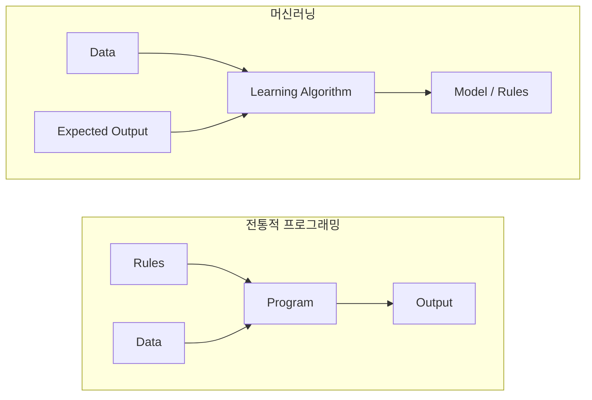
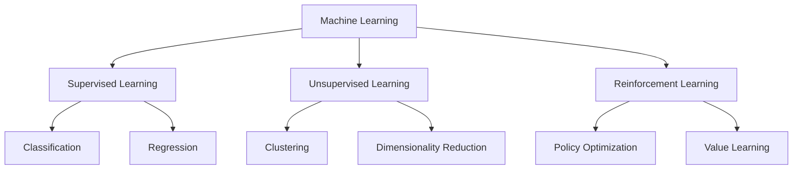
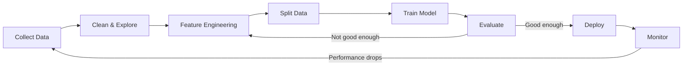
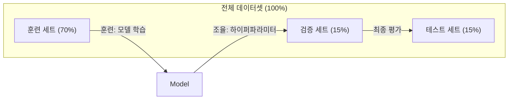
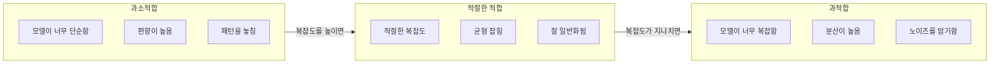
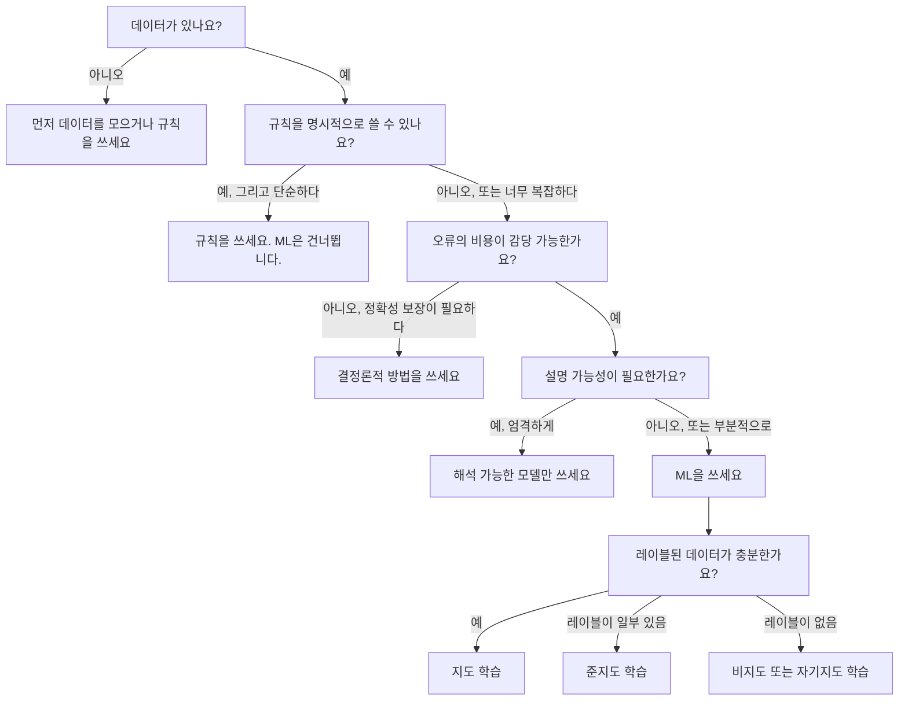

> 🇰🇷 이 문서는 한국어 번역본입니다(ELI5 스타일). 원문: [en.md](en.md)

# 머신러닝이란 무엇인가

> 머신러닝은 규칙을 손으로 작성하는 대신, 컴퓨터가 데이터 속에서 패턴을 찾도록 가르치는 것입니다.

**유형:** Learn
**언어:** Python
**선수 지식:** 페이즈 1 (수학 기초)
**시간:** 약 45분

## 학습 목표

- 지도 학습, 비지도 학습, 강화 학습의 차이를 설명하고, 주어진 문제에 어느 유형이 맞는지 판별합니다
- 최근접 중심(centroid) 분류기를 직접 구현하고 랜덤 베이스라인과 비교해 평가합니다
- 분류와 회귀 작업을 구분하고 각각에 알맞은 손실 함수를 고릅니다
- 주어진 비즈니스 문제가 머신러닝에 적합한지, 아니면 결정론적 규칙으로 푸는 편이 나은지 판단합니다

## 문제 상황

스팸 필터를 만들고 싶다고 합시다. 전통적인 접근 방식은 자리에 앉아 수백 개의 규칙을 작성하는 것입니다. "이메일에 'FREE MONEY'가 들어 있으면 스팸으로 표시해라. 느낌표가 3개를 넘으면 스팸으로 표시해라." 몇 주 동안 규칙을 씁니다. 그런데 스패머가 표현을 바꿉니다. 규칙이 무너지죠. 규칙을 더 씁니다. 이 악순환은 끝나지 않습니다.

머신러닝은 이 구도를 뒤집습니다. 규칙을 쓰는 대신, 레이블이 붙은 이메일 수천 통("스팸" 또는 "정상")을 컴퓨터에 주고 스스로 규칙을 찾게 합니다. 컴퓨터는 여러분이 미처 생각하지 못한 패턴을 찾아 냅니다. 스패머가 전술을 바꾸면 코드를 다시 쓰는 대신 새 데이터로 재학습시키면 됩니다.

"규칙을 프로그래밍하기"에서 "데이터로부터 학습하기"로의 이 전환이 바로 머신러닝의 핵심입니다. 모든 추천 엔진, 음성 비서, 자율주행차, 언어 모델이 이 방식으로 동작합니다.

## 핵심 개념

### 규칙이 아니라 데이터로부터 학습한다

전통적인 프로그래밍과 머신러닝은 정반대 방향에서 문제를 풉니다.



전통적 프로그래밍: 사람이 규칙을 씁니다. 프로그램이 그 규칙을 데이터에 적용해 출력을 만들어 냅니다.

머신러닝: 데이터와 기대 출력을 제공합니다. 알고리즘이 규칙을 찾아 냅니다.

학습이 끝나고 나온 "모델"이 바로 그 규칙입니다. 숫자(가중치, 파라미터)로 인코딩된 규칙이죠. 모델은 본 적 있는 예제에서 일반화해서, 본 적 없는 데이터에 대한 예측을 합니다.

### 머신러닝의 세 가지 유형



**지도 학습(supervised learning)**: 입력-출력 쌍이 있습니다. 모델은 입력을 출력으로 매핑하는 법을 배웁니다.
- "고양이 또는 개라는 레이블이 붙은 사진 10,000장입니다. 둘을 구분하는 법을 배우세요."
- "집 특성과 가격 데이터입니다. 가격을 예측하는 법을 배우세요."

**비지도 학습(unsupervised learning)**: 입력만 있습니다. 레이블은 없습니다. 모델이 스스로 구조를 찾습니다.
- "고객 구매 이력 10,000건입니다. 자연스러운 그룹을 찾아 보세요."
- "1,000차원 데이터 포인트입니다. 구조를 유지하면서 2차원으로 줄이세요."

**강화 학습(reinforcement learning)**: 에이전트가 환경 안에서 행동을 하고 보상이나 벌점을 받습니다. 총 보상을 최대화하는 전략(정책)을 배웁니다.
- "이 게임을 해 보세요. 이기면 +1, 지면 -1입니다. 전략을 스스로 찾으세요."
- "이 로봇 팔을 제어하세요. 물건을 집으면 +1, 시간을 낭비할 때마다 -0.01입니다."

실무에서 만들게 될 것의 대부분은 지도 학습입니다. 비지도 학습은 전처리와 탐색에 흔히 쓰입니다. 강화 학습은 게임 AI, 로봇공학, 그리고 언어 모델의 RLHF를 떠받칩니다.

### 빅 3 너머

위의 세 범주는 깔끔하지만, 실제 세계의 머신러닝은 경계가 흐려지는 경우가 많습니다.

**준지도 학습(semi-supervised learning)**은 소량의 레이블 데이터와 대량의 비레이블 데이터를 함께 사용합니다. 레이블이 붙은 의료 영상 100장과 붙지 않은 영상 100,000장이 있을 수 있죠. 기법으로는 다음이 있습니다:

- **레이블 전파(label propagation):** 비슷한 데이터 포인트끼리 잇는 그래프를 만듭니다. 레이블이 그래프를 타고 레이블 있는 노드에서 레이블 없는 이웃으로 퍼져 나갑니다.
- **유사 레이블링(pseudo-labeling):** 레이블 데이터로 모델을 학습시키고, 그 모델로 비레이블 데이터의 레이블을 예측한 뒤, 전체로 다시 학습시킵니다. 모델이 스스로 학습 세트를 만들어 내는 거죠.
- **일관성 정규화(consistency regularization):** 입력과 그것을 살짝 변형한 버전에 대해 모델이 같은 예측을 내놓아야 합니다. 레이블이 없어도 동작합니다.

**자기지도 학습(self-supervised learning)**은 데이터 자체에서 지도 신호를 만들어 냅니다. 사람이 붙인 레이블이 전혀 필요 없습니다. 모델이 데이터의 구조에서 자기만의 예측 과제를 만드는 것이죠.

- **마스크드 언어 모델링(BERT):** 문장에서 단어 15%를 가리고, 빠진 단어를 맞히도록 모델을 학습시킵니다. "레이블"은 원래 텍스트에서 나옵니다.
- **대조 학습(SimCLR):** 이미지 하나를 골라 서로 다른 두 증강 버전을 만듭니다. 두 버전이 같은 원본에서 나왔음을 알아보면서, 다른 이미지의 증강 버전들과는 구별하도록 모델을 학습시킵니다.
- **다음 토큰 예측(GPT):** 앞의 모든 단어가 주어졌을 때 다음 단어를 예측합니다. 모든 텍스트 문서가 학습 예제가 됩니다.

이것들은 빅 3와 별개의 범주가 아닙니다. 지도 학습과 비지도 학습의 아이디어를 조합한 전략입니다. 자기지도 학습은 기술적으로는 지도 학습입니다(모델이 무언가를 예측하니까요). 다만 레이블이 사람이 아니라 자동으로 생성될 뿐입니다.

### 분류 vs 회귀

이것이 지도 학습의 두 대표 작업입니다.

| 측면 | 분류 | 회귀 |
|--------|---------------|------------|
| 출력 | 이산적인 범주 | 연속적인 숫자 |
| 예시 | "이 이메일은 스팸인가?" | "집 가격은 얼마일까?" |
| 출력 공간 | {고양이, 개, 새} | 임의의 실수 |
| 손실 함수 | 교차 엔트로피, 정확도 | 평균 제곱 오차, MAE |
| 결정 | 클래스 사이의 경계 | 데이터에 맞춘 곡선 |

분류는 "어느 범주?"에 답합니다. 회귀는 "얼마나?"에 답하죠.

어떤 문제는 어느 쪽으로도 볼 수 있습니다. 주식이 오를지 내릴지 예측하는 것은 분류입니다. 정확한 가격을 예측하는 것은 회귀죠.

### ML 워크플로

모든 머신러닝 프로젝트는 알고리즘과 무관하게 같은 파이프라인을 따릅니다.



**데이터 수집(Collect Data)**: 원시 데이터를 모읍니다. 데이터가 많으면 거의 항상 좋지만, 양보다 품질이 더 중요합니다.

**정리와 탐색(Clean & Explore)**: 결측값 처리, 중복 제거, 분포 시각화, 이상 징후 발견. 이 단계가 전체 프로젝트 시간의 60-80%를 잡아먹기도 합니다.

**특성 엔지니어링(Feature Engineering)**: 원시 데이터를 모델이 쓸 수 있는 특성(feature)으로 바꿉니다. 날짜를 요일로 바꾸고, 수치 열을 정규화하고, 범주형 변수를 인코딩합니다. 좋은 특성이 화려한 알고리즘보다 중요합니다.

**데이터 분할(Split Data)**: 훈련, 검증, 테스트 세트로 나눕니다. 모델은 훈련 데이터로 학습하고, 여러분은 검증 데이터로 하이퍼파라미터를 조율하고, 최종 성능은 테스트 데이터로 보고합니다.

**모델 학습(Train Model)**: 훈련 데이터를 알고리즘에 넣습니다. 알고리즘은 손실 함수를 최소화하도록 내부 파라미터를 조정합니다.

**평가(Evaluate)**: 검증/테스트 데이터에서 성능을 측정합니다. 성능이 만족스럽지 않으면 돌아가서 다른 특성, 알고리즘, 하이퍼파라미터를 시도합니다.

**배포(Deploy)**: 모델을 프로덕션(운영 환경)에 올려 새 데이터에 대한 예측을 하게 합니다.

**모니터링(Monitor)**: 시간에 따른 성능을 추적합니다. 데이터 분포는 바뀌고(데이터 드리프트), 모델은 성능이 떨어집니다. 성능이 떨어지면 재학습시킵니다.

### 훈련, 검증, 테스트 분할

초보자가 가장 많이 틀리는 개념입니다. 모델은 반드시 학습 중에 본 적 없는 데이터로 평가해야 합니다. 그렇지 않으면 여러분은 학습이 아니라 암기를 측정하는 것입니다.



| 분할 | 목적 | 사용 시점 | 일반적 크기 |
|-------|---------|-----------|-------------|
| 훈련 | 모델이 이 데이터로 학습한다 | 학습 중 | 60-80% |
| 검증 | 하이퍼파라미터 조율, 모델 비교 | 학습 실행이 끝날 때마다 | 10-20% |
| 테스트 | 최종적인 편향 없는 성능 추정 | 딱 한 번, 맨 마지막에 | 10-20% |

테스트 세트는 신성한 영역입니다. 딱 한 번 봅니다. 테스트 성능을 보고 모델을 계속 고치면, 사실상 테스트 세트로 학습하는 것이 되고 보고하는 수치는 무의미해집니다.

데이터셋이 작다면 k-겹 교차 검증을 쓰세요. 데이터를 k조각으로 나눠 k-1조각으로 학습하고 남은 한 조각으로 검증하는 것을 돌려가며 반복한 뒤 결과를 평균합니다.

### 과적합 vs 과소적합



**과소적합(underfitting)**: 모델이 너무 단순해서 데이터 속 패턴을 잡아내지 못합니다. 구부러진 관계를 직선 하나로 맞추려는 꼴이죠. 훈련 오차도 높고 테스트 오차도 높습니다.

**과적합(overfitting)**: 모델이 너무 복잡해서 노이즈까지 포함한 훈련 데이터를 통째로 외워 버립니다. 모든 훈련 포인트를 통과하지만 새 데이터에서는 실패하는 구불구불한 곡선이죠. 훈련 오차는 낮고 테스트 오차는 높습니다.

**적절한 적합**: 모델이 노이즈를 외우지 않으면서 실제 패턴을 잡아냅니다. 훈련 오차와 테스트 오차가 둘 다 합리적으로 낮습니다.

과적합의 신호:
- 훈련 정확도가 검증 정확도보다 훨씬 높다
- 모델이 훈련 데이터에서는 잘 되는데 새 데이터에서는 형편없다
- 훈련 데이터를 더하면 성능이 좋아진다(모델이 학습이 아니라 암기를 했었다는 뜻)

과적합 해법:
- 훈련 데이터를 더 모은다
- 모델 복잡도를 줄인다(파라미터를 줄이고, 구조를 단순하게)
- 정규화(큰 가중치에 페널티를 더한다)
- 드롭아웃(학습 중에 뉴런을 무작위로 0으로 만든다)
- 조기 종료(검증 오차가 늘기 시작하면 학습을 멈춘다)

과소적합 해법:
- 더 복잡한 모델을 쓴다
- 특성을 더 추가한다
- 정규화를 줄인다
- 더 오래 학습한다

### 편향-분산 절충

과적합과 과소적합 뒤에 있는 수학적 프레임워크입니다.

**편향(bias)**: 모델의 잘못된 가정에서 오는 오차입니다. 참 관계가 비선형인데 선형 모델을 쓰면 편향이 높습니다. 편향이 높으면 과소적합으로 갑니다.

**분산(variance)**: 훈련 데이터의 작은 요동에 민감해서 오는 오차입니다. 분산이 높은 모델은 데이터의 다른 부분집합으로 학습할 때마다 예측이 크게 달라집니다. 분산이 높으면 과적합으로 갑니다.

| 모델 복잡도 | 편향 | 분산 | 결과 |
|-----------------|------|----------|--------|
| 너무 낮음 (구부러진 데이터에 선형 모델) | 높음 | 낮음 | 과소적합 |
| 딱 맞음 | 중간 | 중간 | 좋은 일반화 |
| 너무 높음 (포인트 10개에 20차 다항식) | 낮음 | 높음 | 과적합 |

총 오차 = 편향^2 + 분산 + 줄일 수 없는 노이즈

줄일 수 없는 노이즈는 줄일 수 없습니다(데이터 자체의 무작위성입니다). 여러분은 편향^2 + 분산이 최소가 되는 지점, 즉 스위트 스팟을 찾으면 됩니다.

### 무료 점심 정리(No Free Lunch Theorem)

모든 문제에서 가장 잘 되는 단 하나의 알고리즘은 존재하지 않습니다. 어떤 부류의 문제에서 잘 되는 알고리즘은 다른 부류에서는 형편없을 수 있습니다. 데이터 과학자가 여러 알고리즘을 시도하고 결과를 비교하는 이유입니다.

실무에서 선택은 다음에 달려 있습니다:
- 데이터가 얼마나 있는지
- 특성이 몇 개인지
- 관계가 선형인지 비선형인지
- 해석 가능성이 필요한지
- 컴퓨팅 자원을 얼마나 쓸 수 있는지

### 머신러닝을 쓰지 말아야 할 때

ML은 강력하지만 항상 맞는 도구는 아닙니다. 모델에 손을 뻗기 전에, 정말 모델이 필요한지 물어보세요.

**ML을 쓰지 말아야 할 경우:**

- **규칙이 단순하고 명확할 때.** 세금 계산, 정렬 알고리즘, 단위 변환. 로직을 if문 몇 개로 쓸 수 있다면 모델은 이득 없이 복잡함만 더합니다.
- **데이터가 없거나 극소량일 때.** ML은 배울 예제가 필요합니다. 데이터 포인트 10개로는 의미 있는 것을 학습할 수 없습니다. 먼저 데이터를 모으세요.
- **틀리면 재앙이고 정확성이 보장되어야 할 때.** 의약품 용량 계산, 원자로 제어, 암호학적 검증. ML 모델은 확률적입니다. 때때로 틀립니다. "가끔 틀림"이 용납될 수 없다면 결정론적 방법을 쓰세요.
- **조회 테이블이나 휴리스틱으로 해결될 때.** 단순한 임계값이나 표가 사례의 99%를 커버한다면, ML을 추가하는 것은 의미 있는 개선 없이 유지보수 비용만 늘립니다.
- **결정을 설명할 수 없고 설명 가능성이 요구될 때.** 규제 산업(대출, 보험, 형사 사법)에서는 모든 결정이 완전히 설명 가능해야 할 때가 있습니다. 일부 ML 모델은 해석 가능합니다(선형 회귀, 작은 결정 트리). 대부분은 아닙니다.
- **재학습 속도보다 문제가 더 빨리 바뀔 때.** 규칙이 매일 바뀌는데 재학습에 일주일이 걸린다면, 모델은 언제나 낡은 상태일 것입니다.

이 의사 결정 플로차트를 쓰세요:



```figure
f3-learning-boundary
```

## 직접 만들기

`code/ml_intro.py`의 코드는 가장 단순한 ML 알고리즘인 최근접 중심 분류기를 직접 구현합니다. 핵심 아이디어, 즉 데이터로부터 학습한 뒤 새 데이터를 예측한다는 것을 보여 주죠.

### 단계 1: 최근접 중심 분류기 직접 구현

최근접 중심 분류기는 훈련 데이터에서 각 클래스의 중심(평균)을 계산합니다. 예측할 때는 각 새 포인트를 가장 가까운 중심의 클래스로 배정합니다.

```python
class NearestCentroid:
    def fit(self, X, y):
        self.classes = np.unique(y)
        self.centroids = np.array([
            X[y == c].mean(axis=0) for c in self.classes
        ])

    def predict(self, X):
        distances = np.array([
            np.sqrt(((X - c) ** 2).sum(axis=1))
            for c in self.centroids
        ])
        return self.classes[distances.argmin(axis=0)]
```

이것이 알고리즘의 전부입니다. fit은 평균 두 개를 계산하고, predict는 거리를 계산합니다. 경사 하강법도, 반복도, 하이퍼파라미터도 없습니다.

### 단계 2: 합성 데이터로 학습

살짝 겹치는 두 클래스로 이루어진 2차원 분류 데이터셋을 생성합니다. 중심 분류기는 클래스 중심들 사이에 선형 결정 경계를 그립니다.

```python
rng = np.random.RandomState(42)
X_class0 = rng.randn(100, 2) + np.array([1.0, 1.0])
X_class1 = rng.randn(100, 2) + np.array([-1.0, -1.0])
X = np.vstack([X_class0, X_class1])
y = np.array([0] * 100 + [1] * 100)
```

### 단계 3: 베이스라인과 비교

모든 ML 모델은 자명한(trivial) 베이스라인과 비교해야 합니다. 여기서 베이스라인은 무작위 클래스를 예측하는 것입니다. ML 모델이 무작위 찍기도 못 이긴다면 뭔가 잘못된 것입니다.

```python
baseline_preds = rng.choice([0, 1], size=len(y_test))
baseline_acc = np.mean(baseline_preds == y_test)
```

중심 분류기는 이 깨끗한 데이터셋에서 90% 이상의 정확도를 내야 합니다. 랜덤 베이스라인은 50% 정도이고요.

### 왜 중요한가

최근접 중심 분류기는 지독하게 단순합니다. 하이퍼파라미터도, 반복도, 경사 하강법도 없습니다. 그런데도 ML의 근본 패턴을 담고 있습니다:

1. 훈련 데이터에서 표현을 **학습**한다(중심들)
2. 그 표현으로 새 데이터를 **예측**한다(가장 가까운 거리)
3. 베이스라인과 비교해 **평가**한다(무작위 찍기)

로지스틱 회귀부터 트랜스포머까지 모든 ML 알고리즘이 이 세 단계 패턴을 따릅니다. 표현은 더 복잡해지지만 워크플로는 같습니다.

### 단계 4: 중심 분류기가 못 하는 것

최근접 중심 분류기는 각 클래스가 하나의 덩어리라고 가정합니다. 선형 결정 경계를 그리죠. 다음 경우에는 실패합니다:

- 클래스가 여러 클러스터로 이루어져 있을 때(예: 숫자 "1"은 여러 가지 방식으로 쓰입니다)
- 결정 경계가 비선형일 때(예: 한 클래스가 다른 클래스를 감쌀 때)
- 특성들의 스케일이 크게 다를 때(가장 스케일이 큰 특성이 거리를 지배합니다)

이 한계들이 여러분이 배울 다른 모든 알고리즘의 동기가 됩니다. K-최근접 이웃은 여러 클러스터를 다룹니다. 결정 트리는 비선형 경계를 다룹니다. 특성 스케일링은 스케일 문제를 고칩니다. 각 레슨이 이전 레슨의 한계 위에 쌓이는 거죠.

## 실전에서 쓰기

sklearn은 `NearestCentroid`와 합성 데이터 생성기를 제공합니다:

```python
from sklearn.neighbors import NearestCentroid
from sklearn.datasets import make_classification
from sklearn.model_selection import train_test_split

X, y = make_classification(
    n_samples=500, n_features=2, n_redundant=0,
    n_clusters_per_class=1, random_state=42
)
X_train, X_test, y_train, y_test = train_test_split(X, y, test_size=0.3)

clf = NearestCentroid()
clf.fit(X_train, y_train)
print(f"Accuracy: {clf.score(X_test, y_test):.3f}")
```

## 출시하기

이 레슨은 `outputs/prompt-ml-problem-framer.md`를 만듭니다. 막연한 비즈니스 문제를 구체적인 ML 작업으로 바꿔 주는 프롬프트입니다. 문제 설명("우리는 이탈률을 줄이고 싶다" 또는 "다음 분기 수요를 예측하자")을 주면, 학습 유형을 판별하고, 예측 대상을 정의하고, 후보 특성을 나열하고, 성공 지표를 고르고, 베이스라인을 정하고, 데이터 누수나 클래스 불균형 같은 함정을 표시해 줍니다. 잘못된 것을 만드는 낭비를 피하려면 ML 프로젝트를 시작할 때 사용하세요.

## 핵심 용어

| 용어 | 사람들이 말하는 것 | 실제 의미 |
|------|----------------|----------------------|
| 모델 | "그 AI" | 입력을 출력으로 매핑하는, 학습 가능한 파라미터를 가진 수학 함수 |
| 학습(훈련) | "AI 가르치기" | 예측이 알려진 출력과 일치하도록 최적화 알고리즘으로 모델 파라미터를 조정하는 것 |
| 특성(feature) | "입력 열" | 모델이 예측에 사용하는, 데이터의 측정 가능한 속성 |
| 레이블 | "정답" | 학습 예제의 알려진 출력으로, 오차 신호를 계산하는 데 쓰임 |
| 하이퍼파라미터 | "여러분이 조정하는 설정" | 학습 과정을 제어하는, 학습 전에 정해 두는 파라미터 (학습률, 레이어 수) |
| 손실 함수 | "모델이 얼마나 틀렸는가" | 예측과 실제 출력 사이의 격차를 측정하는 함수로, 학습이 이것을 최소화하려 함 |
| 과적합 | "시험을 통째로 외웠다" | 모델이 일반 패턴 대신 훈련 데이터 고유의 노이즈를 배워서 새 데이터에서 실패함 |
| 과소적합 | "아무것도 배우지 못했다" | 모델이 너무 단순해서 데이터 속 실제 패턴을 잡아내지 못함 |
| 일반화 | "새 데이터에서도 된다" | 학습에 쓰지 않은 데이터에서도 정확한 예측을 하는 모델의 능력 |
| 교차 검증 | "여러 조각으로 나눠 테스트" | 데이터를 훈련/테스트 폴드로 반복해서 나누고 결과를 평균해 더 견고한 성능 추정을 얻는 기법 |
| 정규화 | "가중치를 작게 유지" | 지나치게 복잡한 모델을 억제하려고 손실 함수에 페널티 항을 더하는 것 |
| 데이터 드리프트 | "세상이 바뀌었다" | 들어오는 데이터의 통계 분포가 시간에 따라 이동해 모델 성능이 저하됨 |

## 연습 문제

1. 아무 데이터셋이나 골라(Iris, Titanic 등) 훈련/검증/테스트를 70/15/15로 나눕니다. 테스트 세트로 하이퍼파라미터를 조율하면 안 되는 이유를 설명하세요.
2. 실제 문제 세 개를 적습니다. 각 문제가 분류, 회귀, 클러스터링 중 무엇인지, 그리고 지도 학습인지 비지도 학습인지 판별하세요.
3. 어떤 모델이 훈련 데이터에서는 99% 정확도를 내지만 테스트 데이터에서는 60%입니다. 문제를 진단하고, 고치기 위해 시도할 세 가지를 적으세요.

## 더 읽을거리

- [An Introduction to Statistical Learning](https://www.statlearning.com/) - 실용적인 예제와 함께 고전 ML 방법 전반을 다루는 무료 교과서
- [Google's Machine Learning Crash Course](https://developers.google.com/machine-learning/crash-course) - ML 개념을 간결하게 시각적으로 소개하는 강좌
- [Scikit-learn User Guide](https://scikit-learn.org/stable/user_guide.html) - Python에서 ML을 구현할 때의 실전 레퍼런스
