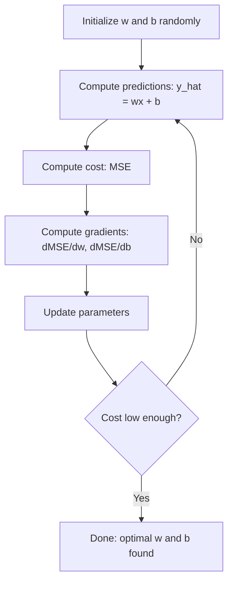

> 🇰🇷 이 문서는 한국어 번역본입니다(ELI5 스타일). 원문: [en.md](en.md)

# 선형 회귀

> 선형 회귀는 데이터에 가장 잘 맞는 직선을 긋는 것입니다. 머신러닝의 "hello world"죠.

**유형:** Build
**언어:** Python
**선수 지식:** 페이즈 1 (선형대수, 미적분, 최적화), 페이즈 2 레슨 1
**시간:** 약 90분

## 학습 목표

- 평균 제곱 오차에 대한 경사 하강법 갱신 규칙을 유도하고 선형 회귀를 직접 구현합니다
- 경사 하강법과 정규방정식을 계산 복잡도와 사용 시점 측면에서 비교합니다
- 특성 표준화를 적용한 다중 선형 회귀 모델을 만들고 학습된 가중치를 해석합니다
- 릿지 회귀(L2 정규화)가 큰 가중치에 페널티를 주어 과적합을 막는 방식을 설명합니다

## 문제 상황

데이터가 있습니다. 집 크기와 판매 가격이죠. 크기가 주어졌을 때 새 집의 가격을 예측하고 싶습니다. 산점도에서 눈대중으로 볼 수도 있지만, 공식이 필요합니다. 어떤 크기를 넣어도 가격 예측을 뱉도록, 데이터에 가장 잘 맞는 직선이 필요한 거죠.

선형 회귀가 그 직선을 만들어 줍니다. 더 중요한 것은, ML 학습 루프 전체를 소개한다는 점입니다. 모델을 정의하고, 비용 함수를 정의하고, 파라미터를 최적화합니다. 모든 ML 알고리즘이 이 같은 패턴을 따릅니다. 가장 단순한 사례로 여기서 완전히 익혀 두면 어디서든 알아볼 수 있게 됩니다.

단순한 문제 전용이 아닙니다. 선형 회귀는 프로덕션(운영 환경) 시스템에서 수요 예측, A/B 테스트 분석, 금융 모델링에 쓰이고, 모든 회귀 작업의 베이스라인으로도 사용됩니다.

## 핵심 개념

### 모델

선형 회귀는 입력(x)과 출력(y) 사이에 선형 관계가 있다고 가정합니다:

```
y = wx + b
```

- `w` (가중치/기울기): x가 1 늘어날 때 y가 얼마나 변하는지
- `b` (편향/절편): x = 0일 때의 y 값

입력이 여러 개(특성 여러 개)면 다음처럼 확장됩니다:

```
y = w1*x1 + w2*x2 + ... + wn*xn + b
```

또는 벡터 형태로: `y = w^T * x + b`

목표: 모든 훈련 예제에서 예측 y가 실제 y에 최대한 가깝게 만드는 w와 b 값을 찾는 것입니다.

### 비용 함수 (평균 제곱 오차)

"최대한 가깝게"는 어떻게 잴까요? 예측이 얼마나 틀렸는지를 하나의 숫자로 나타내는 것이 필요합니다. 가장 흔한 선택은 평균 제곱 오차(MSE)입니다:

```
MSE = (1/n) * sum((y_predicted - y_actual)^2)
```

왜 제곱일까요? 두 가지 이유입니다. 첫째, 큰 오차에 작은 오차보다 훨씬 큰 페널티를 줍니다(오차 10은 오차 1보다 10배가 아니라 100배 나쁩니다). 둘째, 제곱 함수는 매끄럽고 어디서든 미분 가능해서 최적화가 단순해집니다.

비용 함수는 하나의 면을 만듭니다. 가중치 w 하나와 편향 b 하나에 대해 MSE 면은 그릇처럼 생겼습니다(볼록한 포물면). 그릇의 바닥이 MSE가 최소가 되는 곳이죠. 학습이란 그 바닥을 찾는 것입니다.

### 경사 하강법

경사 하강법은 언덕을 내려가는 걸음으로 그릇의 바닥을 찾습니다.



기울기(그래디언트)는 두 가지를 알려 줍니다. 각 파라미터를 어느 방향으로 움직일지, 그리고 얼마나 움직일지.

y_hat = wx + b일 때 MSE의 기울기는:

```
dMSE/dw = (2/n) * sum((y_hat - y) * x)
dMSE/db = (2/n) * sum(y_hat - y)
```

갱신 규칙:

```
w = w - learning_rate * dMSE/dw
b = b - learning_rate * dMSE/db
```

학습률(learning rate)이 걸음 크기를 조절합니다. 너무 크면: 최솟값을 지나쳐 발산합니다. 너무 작으면: 학습이 영원히 걸립니다. 흔한 시작값: 0.01, 0.001, 0.0001.

### 정규방정식 (닫힌 형태 해)

선형 회귀에는 특별히, 반복 없이 최적 가중치를 한 번에 주는 직접 공식이 있습니다:

```
w = (X^T * X)^(-1) * X^T * y
```

행렬을 역행렬로 풀어 w를 한 번에 구합니다. 작은 데이터셋에서는 완벽하게 동작합니다. 큰 데이터셋(수백만 행 또는 수천 특성)에서는 특성 개수 기준 O(n^3)인 행렬 역산 때문에 경사 하강법이 선호됩니다.

### 다중 선형 회귀

특성이 여러 개면 모델은 이렇게 됩니다:

```
y = w1*x1 + w2*x2 + ... + wn*xn + b
```

나머지는 모두 똑같이 동작합니다. 비용 함수는 MSE고, 경사 하강법은 모든 가중치를 동시에 갱신하죠. 유일한 차이는 직선 대신 초평면을 맞춘다는 것입니다.

여기서 특성 스케일링이 중요합니다. 한 특성은 0에서 1 사이, 다른 특성은 0에서 1,000,000 사이라면 비용 면이 길쭉해져서 경사 하강법이 애를 먹습니다. 학습 전에 특성을 표준화하세요(평균을 빼고 표준편차로 나눕니다).

### 다항 회귀

관계가 선형이 아니면 어떻게 할까요? 다항 특성을 만들면 여전히 선형 회귀를 쓸 수 있습니다:

```
y = w1*x + w2*x^2 + w3*x^3 + b
```

이것도 여전히 "선형" 회귀입니다. 모델이 가중치(w1, w2, w3)에 대해 선형이기 때문입니다. x의 비선형 특성을 쓸 뿐이죠.

차수가 높은 다항식은 더 복잡한 곡선을 맞출 수 있지만 과적합 위험이 있습니다. 10차 다항식은 10포인트 데이터셋의 모든 점을 통과하지만 새 데이터에서는 나쁘게 예측합니다.

### R-제곱 점수

MSE는 얼마나 틀렸는지 알려 주지만, 그 숫자는 y의 스케일에 의존합니다. R-제곱(R^2)은 스케일에 독립적인 척도입니다:

```
R^2 = 1 - (sum of squared residuals) / (sum of squared deviations from mean)
    = 1 - SS_res / SS_tot
```

- R^2 = 1.0: 완벽한 예측
- R^2 = 0.0: 모델이 매번 평균을 예측하는 것과 다를 바 없음
- R^2 < 0.0: 모델이 평균 예측보다 못함

### 정규화 맛보기 (릿지 회귀)

특성이 많으면 모델이 큰 가중치를 부여하며 과적합할 수 있습니다. 릿지 회귀(L2 정규화)는 페널티를 더합니다:

```
Cost = MSE + lambda * sum(w_i^2)
```

페널티 항이 큰 가중치를 억제합니다. 하이퍼파라미터 lambda가 절충을 조절합니다. lambda가 클수록 가중치가 작아지고 정규화가 강해집니다. 이 내용은 이후 레슨에서 깊이 다룹니다. 지금은 그것이 존재하고, 왜 도움이 되는지만 알아 두세요.

```figure
linear-regression-fit
```

## 직접 만들기

### 단계 1: 샘플 데이터 생성

```python
import random
import math

random.seed(42)

TRUE_W = 3.0
TRUE_B = 7.0
N_SAMPLES = 100

X = [random.uniform(0, 10) for _ in range(N_SAMPLES)]
y = [TRUE_W * x + TRUE_B + random.gauss(0, 2.0) for x in X]

print(f"Generated {N_SAMPLES} samples")
print(f"True relationship: y = {TRUE_W}x + {TRUE_B} (+ noise)")
print(f"First 5 points: {[(round(X[i], 2), round(y[i], 2)) for i in range(5)]}")
```

### 단계 2: 경사 하강법으로 선형 회귀 직접 구현

```python
class LinearRegression:
    def __init__(self, learning_rate=0.01):
        self.w = 0.0
        self.b = 0.0
        self.lr = learning_rate
        self.cost_history = []

    def predict(self, X):
        return [self.w * x + self.b for x in X]

    def compute_cost(self, X, y):
        predictions = self.predict(X)
        n = len(y)
        cost = sum((pred - actual) ** 2 for pred, actual in zip(predictions, y)) / n
        return cost

    def compute_gradients(self, X, y):
        predictions = self.predict(X)
        n = len(y)
        dw = (2 / n) * sum((pred - actual) * x for pred, actual, x in zip(predictions, y, X))
        db = (2 / n) * sum(pred - actual for pred, actual in zip(predictions, y))
        return dw, db

    def fit(self, X, y, epochs=1000, print_every=200):
        for epoch in range(epochs):
            dw, db = self.compute_gradients(X, y)
            self.w -= self.lr * dw
            self.b -= self.lr * db
            cost = self.compute_cost(X, y)
            self.cost_history.append(cost)
            if epoch % print_every == 0:
                print(f"  Epoch {epoch:4d} | Cost: {cost:.4f} | w: {self.w:.4f} | b: {self.b:.4f}")
        return self

    def r_squared(self, X, y):
        predictions = self.predict(X)
        y_mean = sum(y) / len(y)
        ss_res = sum((actual - pred) ** 2 for actual, pred in zip(y, predictions))
        ss_tot = sum((actual - y_mean) ** 2 for actual in y)
        return 1 - (ss_res / ss_tot)


print("=== Training Linear Regression (Gradient Descent) ===")
model = LinearRegression(learning_rate=0.005)
model.fit(X, y, epochs=1000, print_every=200)
print(f"\nLearned: y = {model.w:.4f}x + {model.b:.4f}")
print(f"True:    y = {TRUE_W}x + {TRUE_B}")
print(f"R-squared: {model.r_squared(X, y):.4f}")
```

### 단계 3: 정규방정식 (닫힌 형태 해)

```python
class LinearRegressionNormal:
    def __init__(self):
        self.w = 0.0
        self.b = 0.0

    def fit(self, X, y):
        n = len(X)
        x_mean = sum(X) / n
        y_mean = sum(y) / n
        numerator = sum((X[i] - x_mean) * (y[i] - y_mean) for i in range(n))
        denominator = sum((X[i] - x_mean) ** 2 for i in range(n))
        self.w = numerator / denominator
        self.b = y_mean - self.w * x_mean
        return self

    def predict(self, X):
        return [self.w * x + self.b for x in X]

    def r_squared(self, X, y):
        predictions = self.predict(X)
        y_mean = sum(y) / len(y)
        ss_res = sum((actual - pred) ** 2 for actual, pred in zip(y, predictions))
        ss_tot = sum((actual - y_mean) ** 2 for actual in y)
        return 1 - (ss_res / ss_tot)


print("\n=== Normal Equation (Closed-Form) ===")
model_normal = LinearRegressionNormal()
model_normal.fit(X, y)
print(f"Learned: y = {model_normal.w:.4f}x + {model_normal.b:.4f}")
print(f"R-squared: {model_normal.r_squared(X, y):.4f}")
```

### 단계 4: 다중 선형 회귀

```python
class MultipleLinearRegression:
    def __init__(self, n_features, learning_rate=0.01):
        self.weights = [0.0] * n_features
        self.bias = 0.0
        self.lr = learning_rate
        self.cost_history = []

    def predict_single(self, x):
        return sum(w * xi for w, xi in zip(self.weights, x)) + self.bias

    def predict(self, X):
        return [self.predict_single(x) for x in X]

    def compute_cost(self, X, y):
        predictions = self.predict(X)
        n = len(y)
        return sum((pred - actual) ** 2 for pred, actual in zip(predictions, y)) / n

    def fit(self, X, y, epochs=1000, print_every=200):
        n = len(y)
        n_features = len(X[0])
        for epoch in range(epochs):
            predictions = self.predict(X)
            errors = [pred - actual for pred, actual in zip(predictions, y)]
            for j in range(n_features):
                grad = (2 / n) * sum(errors[i] * X[i][j] for i in range(n))
                self.weights[j] -= self.lr * grad
            grad_b = (2 / n) * sum(errors)
            self.bias -= self.lr * grad_b
            cost = self.compute_cost(X, y)
            self.cost_history.append(cost)
            if epoch % print_every == 0:
                print(f"  Epoch {epoch:4d} | Cost: {cost:.4f}")
        return self

    def r_squared(self, X, y):
        predictions = self.predict(X)
        y_mean = sum(y) / len(y)
        ss_res = sum((actual - pred) ** 2 for actual, pred in zip(y, predictions))
        ss_tot = sum((actual - y_mean) ** 2 for actual in y)
        return 1 - (ss_res / ss_tot)


random.seed(42)
N = 100
X_multi = []
y_multi = []
for _ in range(N):
    size = random.uniform(500, 3000)
    bedrooms = random.randint(1, 5)
    age = random.uniform(0, 50)
    price = 50 * size + 10000 * bedrooms - 1000 * age + 50000 + random.gauss(0, 20000)
    X_multi.append([size, bedrooms, age])
    y_multi.append(price)


def standardize(X):
    n_features = len(X[0])
    means = [sum(X[i][j] for i in range(len(X))) / len(X) for j in range(n_features)]
    stds = []
    for j in range(n_features):
        variance = sum((X[i][j] - means[j]) ** 2 for i in range(len(X))) / len(X)
        stds.append(variance ** 0.5)
    X_scaled = []
    for i in range(len(X)):
        row = [(X[i][j] - means[j]) / stds[j] if stds[j] > 0 else 0 for j in range(n_features)]
        X_scaled.append(row)
    return X_scaled, means, stds


y_mean_val = sum(y_multi) / len(y_multi)
y_std_val = (sum((yi - y_mean_val) ** 2 for yi in y_multi) / len(y_multi)) ** 0.5
y_scaled = [(yi - y_mean_val) / y_std_val for yi in y_multi]

X_scaled, x_means, x_stds = standardize(X_multi)

print("\n=== Multiple Linear Regression (3 features) ===")
print("Features: house size, bedrooms, age")
multi_model = MultipleLinearRegression(n_features=3, learning_rate=0.01)
multi_model.fit(X_scaled, y_scaled, epochs=1000, print_every=200)

print(f"\nWeights (standardized): {[round(w, 4) for w in multi_model.weights]}")
print(f"Bias (standardized): {multi_model.bias:.4f}")
print(f"R-squared: {multi_model.r_squared(X_scaled, y_scaled):.4f}")
```

### 단계 5: 다항 회귀

```python
class PolynomialRegression:
    def __init__(self, degree, learning_rate=0.01):
        self.degree = degree
        self.weights = [0.0] * degree
        self.bias = 0.0
        self.lr = learning_rate

    def make_features(self, X):
        return [[x ** (d + 1) for d in range(self.degree)] for x in X]

    def predict(self, X):
        features = self.make_features(X)
        return [sum(w * f for w, f in zip(self.weights, row)) + self.bias for row in features]

    def fit(self, X, y, epochs=1000, print_every=200):
        features = self.make_features(X)
        n = len(y)
        for epoch in range(epochs):
            predictions = [sum(w * f for w, f in zip(self.weights, row)) + self.bias for row in features]
            errors = [pred - actual for pred, actual in zip(predictions, y)]
            for j in range(self.degree):
                grad = (2 / n) * sum(errors[i] * features[i][j] for i in range(n))
                self.weights[j] -= self.lr * grad
            grad_b = (2 / n) * sum(errors)
            self.bias -= self.lr * grad_b
            if epoch % print_every == 0:
                cost = sum(e ** 2 for e in errors) / n
                print(f"  Epoch {epoch:4d} | Cost: {cost:.6f}")
        return self

    def r_squared(self, X, y):
        predictions = self.predict(X)
        y_mean = sum(y) / len(y)
        ss_res = sum((actual - pred) ** 2 for actual, pred in zip(y, predictions))
        ss_tot = sum((actual - y_mean) ** 2 for actual in y)
        return 1 - (ss_res / ss_tot)


random.seed(42)
X_poly = [x / 10.0 for x in range(0, 50)]
y_poly = [0.5 * x ** 2 - 2 * x + 3 + random.gauss(0, 1.0) for x in X_poly]

x_max = max(abs(x) for x in X_poly)
X_poly_norm = [x / x_max for x in X_poly]
y_poly_mean = sum(y_poly) / len(y_poly)
y_poly_std = (sum((yi - y_poly_mean) ** 2 for yi in y_poly) / len(y_poly)) ** 0.5
y_poly_norm = [(yi - y_poly_mean) / y_poly_std for yi in y_poly]

print("\n=== Polynomial Regression (degree 2 vs degree 5) ===")
print("True relationship: y = 0.5x^2 - 2x + 3")

print("\nDegree 2:")
poly2 = PolynomialRegression(degree=2, learning_rate=0.1)
poly2.fit(X_poly_norm, y_poly_norm, epochs=2000, print_every=500)
print(f"  R-squared: {poly2.r_squared(X_poly_norm, y_poly_norm):.4f}")

print("\nDegree 5:")
poly5 = PolynomialRegression(degree=5, learning_rate=0.1)
poly5.fit(X_poly_norm, y_poly_norm, epochs=2000, print_every=500)
print(f"  R-squared: {poly5.r_squared(X_poly_norm, y_poly_norm):.4f}")

print("\nDegree 2 fits the true curve well. Degree 5 fits training data slightly better")
print("but risks overfitting on new data.")
```

### 단계 6: 릿지 회귀 (L2 정규화)

```python
class RidgeRegression:
    def __init__(self, n_features, learning_rate=0.01, alpha=1.0):
        self.weights = [0.0] * n_features
        self.bias = 0.0
        self.lr = learning_rate
        self.alpha = alpha

    def predict_single(self, x):
        return sum(w * xi for w, xi in zip(self.weights, x)) + self.bias

    def predict(self, X):
        return [self.predict_single(x) for x in X]

    def fit(self, X, y, epochs=1000, print_every=200):
        n = len(y)
        n_features = len(X[0])
        for epoch in range(epochs):
            predictions = self.predict(X)
            errors = [pred - actual for pred, actual in zip(predictions, y)]
            mse = sum(e ** 2 for e in errors) / n
            reg_term = self.alpha * sum(w ** 2 for w in self.weights)
            cost = mse + reg_term
            for j in range(n_features):
                grad = (2 / n) * sum(errors[i] * X[i][j] for i in range(n))
                grad += 2 * self.alpha * self.weights[j]
                self.weights[j] -= self.lr * grad
            grad_b = (2 / n) * sum(errors)
            self.bias -= self.lr * grad_b
            if epoch % print_every == 0:
                print(f"  Epoch {epoch:4d} | Cost: {cost:.4f} | L2 penalty: {reg_term:.4f}")
        return self


print("\n=== Ridge Regression (L2 Regularization) ===")
print("Same data as multiple regression, with alpha=0.1")
ridge = RidgeRegression(n_features=3, learning_rate=0.01, alpha=0.1)
ridge.fit(X_scaled, y_scaled, epochs=1000, print_every=200)
print(f"\nRidge weights: {[round(w, 4) for w in ridge.weights]}")
print(f"Plain weights: {[round(w, 4) for w in multi_model.weights]}")
print("Ridge weights are smaller (shrunk toward zero) due to the L2 penalty.")
```

## 실전에서 쓰기

이번에는 scikit-learn으로 같은 것을 해 봅니다. 실제 프로덕션에서 쓰게 될 도구입니다.

```python
from sklearn.linear_model import LinearRegression as SklearnLR
from sklearn.linear_model import Ridge
from sklearn.preprocessing import PolynomialFeatures, StandardScaler
from sklearn.model_selection import train_test_split
from sklearn.metrics import mean_squared_error, r2_score
import numpy as np

np.random.seed(42)
X_sk = np.random.uniform(0, 10, (100, 1))
y_sk = 3.0 * X_sk.squeeze() + 7.0 + np.random.normal(0, 2.0, 100)

X_train, X_test, y_train, y_test = train_test_split(X_sk, y_sk, test_size=0.2, random_state=42)

lr = SklearnLR()
lr.fit(X_train, y_train)
y_pred = lr.predict(X_test)

print("=== Scikit-learn Linear Regression ===")
print(f"Coefficient (w): {lr.coef_[0]:.4f}")
print(f"Intercept (b): {lr.intercept_:.4f}")
print(f"R-squared (test): {r2_score(y_test, y_pred):.4f}")
print(f"MSE (test): {mean_squared_error(y_test, y_pred):.4f}")

poly = PolynomialFeatures(degree=2, include_bias=False)
X_poly_sk = poly.fit_transform(X_train)
X_poly_test = poly.transform(X_test)

lr_poly = SklearnLR()
lr_poly.fit(X_poly_sk, y_train)
print(f"\nPolynomial degree 2 R-squared: {r2_score(y_test, lr_poly.predict(X_poly_test)):.4f}")

scaler = StandardScaler()
X_train_scaled = scaler.fit_transform(X_train)
X_test_scaled = scaler.transform(X_test)

ridge = Ridge(alpha=1.0)
ridge.fit(X_train_scaled, y_train)
print(f"Ridge R-squared: {r2_score(y_test, ridge.predict(X_test_scaled)):.4f}")
print(f"Ridge coefficient: {ridge.coef_[0]:.4f}")
```

직접 구현한 버전과 scikit-learn은 같은 결과를 냅니다. 차이는 scikit-learn이 경계 사례, 수치 안정성, 성능 최적화를 알아서 처리한다는 것입니다. 프로덕션에서는 라이브러리를 쓰세요. 직접 구현한 버전은 무슨 일이 일어나는지 이해하기 위한 것입니다.

## 출시하기

이 레슨이 만드는 것:
- `outputs/skill-regression.md` - 문제에 따라 알맞은 회귀 접근법을 고르는 스킬

## 연습 문제

1. 배치 경사 하강법, 확률적 경사 하강법(SGD), 미니배치 경사 하강법을 구현합니다. 같은 데이터셋에서 수렴 속도를 비교하세요. 무엇이 가장 빨리 수렴하나요? 비용 곡선이 가장 매끄러운 것은 무엇인가요?
2. 3차 함수(y = ax^3 + bx^2 + cx + d + noise)에서 데이터를 생성합니다. 1차, 3차, 10차 다항식을 피팅합니다. 훈련 R^2와 테스트 R^2를 비교하세요. 몇 차에서 과적합이 뚜렷해지나요?
3. 라쏘 회귀(L1 정규화: 페널티 = alpha * sum(|w_i|))를 구현합니다. 다중 특성 주택 데이터로 학습시키고, 어떤 가중치가 0이 되는지 릿지와 비교하세요. L1은 희소한 해를 만들고 L2는 그렇지 않은 이유는 무엇일까요?

## 핵심 용어

| 용어 | 사람들이 말하는 것 | 실제 의미 |
|------|----------------|----------------------|
| 선형 회귀 | "데이터에 직선 긋기" | wx+b와 실제 y 값 사이의 제곱 차이 합을 최소화하는 가중치 w와 편향 b를 찾는 것 |
| 비용 함수 | "모델이 얼마나 나쁜가" | 모델 파라미터를 예측 오차를 재는 하나의 숫자로 매핑하는 함수로, 최적화가 이것을 최소화함 |
| 평균 제곱 오차 | "제곱 오차의 평균" | (1/n) * sum of (predicted - actual)^2로, 큰 오차에 불균형적으로 큰 페널티를 줌 |
| 경사 하강법 | "언덕 아래로 걷기" | 편미분을 이용해 비용 함수를 줄이는 방향으로 파라미터를 반복해서 조정하는 것 |
| 학습률 | "걸음 크기" | 경사 하강법 단계마다 파라미터가 얼마나 변하는지를 조절하는 스칼라 |
| 정규방정식 | "직접 풀기" | 반복 없이 최적 가중치를 주는 닫힌 형태 해 w = (X^T X)^-1 X^T y |
| R-제곱 | "적합이 얼마나 좋은가" | 모델이 설명하는 y의 분산 비율로, 음의 무한대부터 1.0까지의 값을 가짐 |
| 특성 스케일링 | "특성들을 비교 가능하게 만들기" | 경사 하강법이 더 빨리 수렴하도록 특성을 비슷한 범위로 변환하는 것 (예: 평균 0, 분산 1) |
| 정규화(regularization) | "복잡성에 페널티 주기" | 비용 함수에 가중치를 줄이는 항을 더해 과적합을 막는 것 |
| 릿지 회귀 | "L2 정규화" | MSE에 lambda * sum(w_i^2) 페널티를 더한 선형 회귀 |
| 다항 회귀 | "선형 수학으로 곡선 피팅하기" | 다항 특성 (x, x^2, x^3, ...)에 대한 선형 회귀로, 가중치에 대해서는 여전히 선형임 |
| 과적합 | "훈련 데이터를 외우기" | 모델이 너무 복잡해서 훈련 데이터의 노이즈까지 맞추고 새 데이터에서 실패하는 것 |

## 더 읽을거리

- [An Introduction to Statistical Learning (ISLR)](https://www.statlearning.com/) -- 무료 PDF. 3장과 6장이 실용적인 R 예제와 함께 선형 회귀와 정규화를 다룹니다
- [The Elements of Statistical Learning (ESL)](https://hastie.su.domains/ElemStatLearn/) -- 무료 PDF. ISLR의 더 수학적인 짝으로, 릿지와 라쏘를 더 깊이 다룹니다
- [Stanford CS229 Lecture Notes on Linear Regression](https://cs229.stanford.edu/main_notes.pdf) -- Andrew Ng의 노트로, 정규방정식과 경사 하강법을 기본 원리부터 유도합니다
- [scikit-learn LinearRegression documentation](https://scikit-learn.org/stable/modules/linear_model.html) -- 코드 예제와 함께 LinearRegression, Ridge, Lasso, ElasticNet을 다루는 실전 레퍼런스
