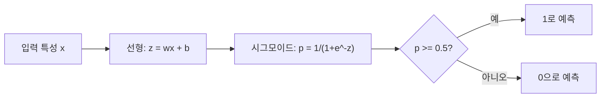
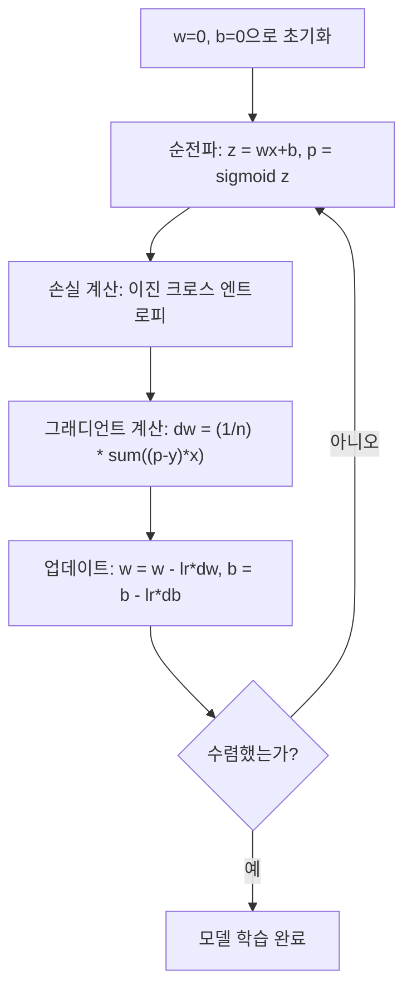

> 🇰🇷 이 문서는 한국어 번역본입니다(ELI5 스타일). 원문: [en.md](en.md)

# 로지스틱 회귀 (Logistic Regression)

> 로지스틱 회귀는 곧은 선을 S자 곡선으로 휘어서, 예/아니오 질문에 확률로 답합니다.

**유형:** Build
**언어:** Python
**선수 지식:** 페이즈 2 레슨 1-2 (What Is ML, Linear Regression)
**시간:** 약 90분

## 학습 목표

- 시그모이드(sigmoid) 함수와 이진 크로스 엔트로피 손실을 사용해 로지스틱 회귀를 직접 구현합니다
- 이진 분류를 위한 정밀도, 재현율, F1 점수, 오차 행렬(Confusion Matrix)을 계산하고 해석합니다
- 분류에 MSE가 왜 실패하는지, 이진 크로스 엔트로피는 왜 볼록한(convex) 비용 곡면을 만드는지 설명합니다
- 다중 클래스 분류를 위한 소프트맥스 회귀 모델을 만들고, 임계값 조정의 트레이드오프를 평가합니다

## 문제 상황

크기만 보고 종양이 악성인지 양성인지 예측하고 싶다고 합시다. 선형 회귀를 시도합니다. 그러면 0.3이나 1.7, -0.5 같은 숫자가 나옵니다. 이 숫자들은 무슨 뜻일까요? 1.7은 "아주 악성"이라는 뜻일까요? -0.5는 "아주 양성"이라는 뜻일까요? 선형 회귀는 상하한이 없는(unbounded) 숫자를 출력합니다. 분류에는 0과 1 사이의 확률과, 예/아니오라는 명확한 결정이 필요합니다.

로지스틱 회귀가 이 문제를 해결합니다. 똑같은 선형 조합(wx + b)을 계산한 뒤 시그모이드 함수에 통과시킵니다. 시그모이드는 어떤 숫자든 (0, 1) 범위 안으로 찌그러뜨립니다(squash). 출력은 확률입니다. 임계값(보통 0.5)을 정하고 결정을 내리면 됩니다.

이 알고리즘은 실무에서 가장 널리 쓰이는 알고리즘 중 하나입니다. 이름에 '회귀'가 들어 있지만, 로지스틱 회귀는 회귀 알고리즘이 아니라 분류 알고리즘입니다. 이름이 이렇게 붙은 이유는 자기가 쓰는 로지스틱(시그모이드) 함수에서 왔습니다.

## 핵심 개념

### 왜 분류에는 선형 회귀가 실패하는가

공부 시간으로 합격/불합격(1/0)을 예측한다고 상상해 봅시다. 선형 회귀는 데이터를 지나는 직선을 피팅합니다:

```
hours:  1   2   3   4   5   6   7   8   9   10
actual: 0   0   0   0   1   1   1   1   1   1
```

선형 피팅은 1시간에서 -0.2, 10시간에서 1.3 같은 예측을 낼 수 있습니다. 이 값들은 확률이 아닙니다. 0보다 작고 1보다 큽니다. 더 나쁜 것은, 이상치 하나(50시간 공부한 사람)가 직선 전체를 끌어당겨 모든 사람의 예측을 바꿔버릴 수 있다는 점입니다.

분류에는 다음을 만족하는 함수가 필요합니다:
- 0과 1 사이의 값(확률)을 출력할 것
- 날카로운 전환 지점(결정 경계)을 만들 것
- 경계에서 멀리 떨어진 이상치에 의해 왜곡되지 않을 것

### 시그모이드 함수

시그모이드 함수가 정확히 이 일을 해 냅니다:

```
sigmoid(z) = 1 / (1 + e^(-z))
```

성질:
- z가 큰 양수이면 sigmoid(z)는 1에 가까워집니다
- z가 큰 음수이면 sigmoid(z)는 0에 가까워집니다
- z = 0이면 sigmoid(z) = 0.5입니다
- 출력은 항상 0과 1 사이입니다
- 함수가 매끄럽고 어디서든 미분 가능합니다

도함수도 편리한 형태를 갖습니다: sigmoid'(z) = sigmoid(z) * (1 - sigmoid(z)). 덕분에 그래디언트 계산이 효율적입니다.

### 로지스틱 회귀 = 선형 모델 + 시그모이드

모델은 z = wx + b를 계산하고(선형 회귀와 동일), 그다음 시그모이드를 적용합니다:



출력 p는 P(y=1 | x), 즉 입력이 클래스 1에 속할 확률로 해석됩니다. 결정 경계는 wx + b = 0이 되는 곳으로, 여기서는 시그모이드 출력이 정확히 0.5가 됩니다.

### 이진 크로스 엔트로피 손실

로지스틱 회귀에 MSE를 쓸 수는 없습니다. 시그모이드와 결합한 MSE는 국소 최솟값이 많은 비볼록(non-convex) 비용 곡면을 만듭니다. 대신 이진 크로스 엔트로피(로그 손실)를 사용합니다:

```
Loss = -(1/n) * sum(y * log(p) + (1-y) * log(1-p))
```

이게 왜 작동하는지 보겠습니다:
- y=1이고 p가 1에 가까울 때: log(1) = 0이므로 손실이 0에 가깝습니다(맞음, 비용 낮음)
- y=1이고 p가 0에 가까울 때: log(0)은 음의 무한대에 가까워지므로 손실이 매우 커집니다(틀림, 비용 높음)
- y=0이고 p가 0에 가까울 때: log(1) = 0이므로 손실이 0에 가깝습니다(맞음, 비용 낮음)
- y=0이고 p가 1에 가까울 때: log(0)은 음의 무한대에 가까워지므로 손실이 매우 커집니다(틀림, 비용 높음)

이 손실 함수는 로지스틱 회귀에서 볼록(convex)하므로, 전역 최솟값이 하나뿐이라는 보장이 생깁니다.

### 로지스틱 회귀를 위한 경사 하강법

시그모이드와 이진 크로스 엔트로피 조합의 그래디언트는 깔끔한 형태를 갖습니다:

```
dL/dw = (1/n) * sum((p - y) * x)
dL/db = (1/n) * sum(p - y)
```

선형 회귀의 그래디언트와 똑같아 보입니다. 차이는 p = wx + b가 아니라 p = sigmoid(wx + b)라는 점입니다. 시그모이드가 비선형성을 도입하지만, 그래디언트 업데이트 규칙 자체는 그대로입니다.



### 결정 경계

2차원 입력(특성 두 개)에서 결정 경계는 다음을 만족하는 선입니다:

```
w1*x1 + w2*x2 + b = 0
```

한쪽 면의 점들은 1로, 다른 쪽 면의 점들은 0으로 분류됩니다. 로지스틱 회귀는 항상 선형 결정 경계를 만듭니다. 곡선 경계가 필요하면 다항 특성을 추가하거나 비선형 모델을 사용해야 합니다.

### 소프트맥스를 사용한 다중 클래스 분류

이진 로지스틱 회귀는 두 클래스를 다룹니다. 클래스가 k개일 때는 소프트맥스(softmax) 함수를 사용합니다:

```
softmax(z_i) = e^(z_i) / sum(e^(z_j) for all j)
```

각 클래스는 자기만의 가중치 벡터를 갖습니다. 모델이 클래스별 점수 z_i를 계산하면, 소프트맥스가 그 점수들을 합이 1이 되는 확률로 바꿉니다. 예측 클래스는 확률이 가장 높은 클래스입니다.

손실 함수는 범주형 크로스 엔트로피(categorical cross-entropy)가 됩니다:

```
Loss = -(1/n) * sum(sum(y_k * log(p_k)))
```

여기서 y_k는 참 클래스면 1, 나머지는 모두 0입니다(원-핫 인코딩).

### 평가 지표

정확도만으로는 부족합니다. 95%가 음성이고 5%가 양성인 데이터셋에서, 항상 음성으로만 예측하는 모델의 정확도는 95%지만 전혀 쓸모가 없습니다.

**오차 행렬(Confusion Matrix)**:

| | 예측 양성 | 예측 음성 |
|---|---|---|
| 실제 양성 | 진양성(True Positive, TP) | 위음성(False Negative, FN) |
| 실제 음성 | 위양성(False Positive, FP) | 진음성(True Negative, TN) |

**정밀도(Precision)**: 양성이라고 예측한 것 중 실제 양성은 몇 개일까?
```
Precision = TP / (TP + FP)
```

**재현율(Recall, 민감도)**: 실제 양성 중 우리가 잡아낸 것은 몇 개일까?
```
Recall = TP / (TP + FN)
```

**F1 점수**: 정밀도와 재현율의 조화 평균. 두 지표의 균형을 잡아 줍니다.
```
F1 = 2 * (Precision * Recall) / (Precision + Recall)
```

무엇을 우선할까:
- **정밀도**: 거짓 양성의 비용이 클 때(스팸 필터 — 정상 이메일을 차단하고 싶지 않음)
- **재현율**: 거짓 음성의 비용이 클 때(암 검진 — 종양을 놓치고 싶지 않음)
- **F1**: 균형 잡힌 지표 하나가 필요할 때

```figure
logistic-sigmoid
```

## 직접 만들기

### 단계 1: 시그모이드 함수와 데이터 생성

```python
import random
import math

def sigmoid(z):
    z = max(-500, min(500, z))
    return 1.0 / (1.0 + math.exp(-z))


random.seed(42)
N = 200
X = []
y = []

for _ in range(N // 2):
    X.append([random.gauss(2, 1), random.gauss(2, 1)])
    y.append(0)

for _ in range(N // 2):
    X.append([random.gauss(5, 1), random.gauss(5, 1)])
    y.append(1)

combined = list(zip(X, y))
random.shuffle(combined)
X, y = zip(*combined)
X = list(X)
y = list(y)

print(f"Generated {N} samples (2 classes, 2 features)")
print(f"Class 0 center: (2, 2), Class 1 center: (5, 5)")
print(f"First 5 samples:")
for i in range(5):
    print(f"  Features: [{X[i][0]:.2f}, {X[i][1]:.2f}], Label: {y[i]}")
```

### 단계 2: 로지스틱 회귀 직접 구현

```python
class LogisticRegression:
    def __init__(self, n_features, learning_rate=0.01):
        self.weights = [0.0] * n_features
        self.bias = 0.0
        self.lr = learning_rate
        self.loss_history = []

    def predict_proba(self, x):
        z = sum(w * xi for w, xi in zip(self.weights, x)) + self.bias
        return sigmoid(z)

    def predict(self, x, threshold=0.5):
        return 1 if self.predict_proba(x) >= threshold else 0

    def compute_loss(self, X, y):
        n = len(y)
        total = 0.0
        for i in range(n):
            p = self.predict_proba(X[i])
            p = max(1e-15, min(1 - 1e-15, p))
            total += y[i] * math.log(p) + (1 - y[i]) * math.log(1 - p)
        return -total / n

    def fit(self, X, y, epochs=1000, print_every=200):
        n = len(y)
        n_features = len(X[0])
        for epoch in range(epochs):
            dw = [0.0] * n_features
            db = 0.0
            for i in range(n):
                p = self.predict_proba(X[i])
                error = p - y[i]
                for j in range(n_features):
                    dw[j] += error * X[i][j]
                db += error
            for j in range(n_features):
                self.weights[j] -= self.lr * (dw[j] / n)
            self.bias -= self.lr * (db / n)
            loss = self.compute_loss(X, y)
            self.loss_history.append(loss)
            if epoch % print_every == 0:
                print(f"  Epoch {epoch:4d} | Loss: {loss:.4f} | w: [{self.weights[0]:.3f}, {self.weights[1]:.3f}] | b: {self.bias:.3f}")
        return self

    def accuracy(self, X, y):
        correct = sum(1 for i in range(len(y)) if self.predict(X[i]) == y[i])
        return correct / len(y)


split = int(0.8 * N)
X_train, X_test = X[:split], X[split:]
y_train, y_test = y[:split], y[split:]

print("\n=== Training Logistic Regression ===")
model = LogisticRegression(n_features=2, learning_rate=0.1)
model.fit(X_train, y_train, epochs=1000, print_every=200)

print(f"\nTrain accuracy: {model.accuracy(X_train, y_train):.4f}")
print(f"Test accuracy:  {model.accuracy(X_test, y_test):.4f}")
print(f"Weights: [{model.weights[0]:.4f}, {model.weights[1]:.4f}]")
print(f"Bias: {model.bias:.4f}")
```

### 단계 3: 오차 행렬과 지표 직접 구현

```python
class ClassificationMetrics:
    def __init__(self, y_true, y_pred):
        self.tp = sum(1 for t, p in zip(y_true, y_pred) if t == 1 and p == 1)
        self.tn = sum(1 for t, p in zip(y_true, y_pred) if t == 0 and p == 0)
        self.fp = sum(1 for t, p in zip(y_true, y_pred) if t == 0 and p == 1)
        self.fn = sum(1 for t, p in zip(y_true, y_pred) if t == 1 and p == 0)

    def accuracy(self):
        total = self.tp + self.tn + self.fp + self.fn
        return (self.tp + self.tn) / total if total > 0 else 0

    def precision(self):
        denom = self.tp + self.fp
        return self.tp / denom if denom > 0 else 0

    def recall(self):
        denom = self.tp + self.fn
        return self.tp / denom if denom > 0 else 0

    def f1(self):
        p = self.precision()
        r = self.recall()
        return 2 * p * r / (p + r) if (p + r) > 0 else 0

    def print_confusion_matrix(self):
        print(f"\n  Confusion Matrix:")
        print(f"                  Predicted")
        print(f"                  Pos   Neg")
        print(f"  Actual Pos     {self.tp:4d}  {self.fn:4d}")
        print(f"  Actual Neg     {self.fp:4d}  {self.tn:4d}")

    def print_report(self):
        self.print_confusion_matrix()
        print(f"\n  Accuracy:  {self.accuracy():.4f}")
        print(f"  Precision: {self.precision():.4f}")
        print(f"  Recall:    {self.recall():.4f}")
        print(f"  F1 Score:  {self.f1():.4f}")


y_pred_test = [model.predict(x) for x in X_test]
print("\n=== Classification Report (Test Set) ===")
metrics = ClassificationMetrics(y_test, y_pred_test)
metrics.print_report()
```

### 단계 4: 결정 경계 분석

```python
print("\n=== Decision Boundary ===")
w1, w2 = model.weights
b = model.bias
print(f"Decision boundary: {w1:.4f}*x1 + {w2:.4f}*x2 + {b:.4f} = 0")
if abs(w2) > 1e-10:
    print(f"Solved for x2:     x2 = {-w1/w2:.4f}*x1 + {-b/w2:.4f}")

print("\nSample predictions near the boundary:")
test_points = [
    [3.0, 3.0],
    [3.5, 3.5],
    [4.0, 4.0],
    [2.5, 2.5],
    [5.0, 5.0],
]
for point in test_points:
    prob = model.predict_proba(point)
    pred = model.predict(point)
    print(f"  [{point[0]}, {point[1]}] -> prob={prob:.4f}, class={pred}")
```

### 단계 5: 소프트맥스로 다중 클래스 다루기

```python
class SoftmaxRegression:
    def __init__(self, n_features, n_classes, learning_rate=0.01):
        self.n_features = n_features
        self.n_classes = n_classes
        self.lr = learning_rate
        self.weights = [[0.0] * n_features for _ in range(n_classes)]
        self.biases = [0.0] * n_classes

    def softmax(self, scores):
        max_score = max(scores)
        exp_scores = [math.exp(s - max_score) for s in scores]
        total = sum(exp_scores)
        return [e / total for e in exp_scores]

    def predict_proba(self, x):
        scores = [
            sum(self.weights[k][j] * x[j] for j in range(self.n_features)) + self.biases[k]
            for k in range(self.n_classes)
        ]
        return self.softmax(scores)

    def predict(self, x):
        probs = self.predict_proba(x)
        return probs.index(max(probs))

    def fit(self, X, y, epochs=1000, print_every=200):
        n = len(y)
        for epoch in range(epochs):
            grad_w = [[0.0] * self.n_features for _ in range(self.n_classes)]
            grad_b = [0.0] * self.n_classes
            total_loss = 0.0
            for i in range(n):
                probs = self.predict_proba(X[i])
                for k in range(self.n_classes):
                    target = 1.0 if y[i] == k else 0.0
                    error = probs[k] - target
                    for j in range(self.n_features):
                        grad_w[k][j] += error * X[i][j]
                    grad_b[k] += error
                true_prob = max(probs[y[i]], 1e-15)
                total_loss -= math.log(true_prob)
            for k in range(self.n_classes):
                for j in range(self.n_features):
                    self.weights[k][j] -= self.lr * (grad_w[k][j] / n)
                self.biases[k] -= self.lr * (grad_b[k] / n)
            if epoch % print_every == 0:
                print(f"  Epoch {epoch:4d} | Loss: {total_loss / n:.4f}")
        return self

    def accuracy(self, X, y):
        correct = sum(1 for i in range(len(y)) if self.predict(X[i]) == y[i])
        return correct / len(y)


random.seed(42)
X_3class = []
y_3class = []

centers = [(1, 1), (5, 1), (3, 5)]
for label, (cx, cy) in enumerate(centers):
    for _ in range(50):
        X_3class.append([random.gauss(cx, 0.8), random.gauss(cy, 0.8)])
        y_3class.append(label)

combined = list(zip(X_3class, y_3class))
random.shuffle(combined)
X_3class, y_3class = zip(*combined)
X_3class = list(X_3class)
y_3class = list(y_3class)

split_3 = int(0.8 * len(X_3class))
X_train_3 = X_3class[:split_3]
y_train_3 = y_3class[:split_3]
X_test_3 = X_3class[split_3:]
y_test_3 = y_3class[split_3:]

print("\n=== Multi-class Softmax Regression (3 classes) ===")
softmax_model = SoftmaxRegression(n_features=2, n_classes=3, learning_rate=0.1)
softmax_model.fit(X_train_3, y_train_3, epochs=1000, print_every=200)
print(f"\nTrain accuracy: {softmax_model.accuracy(X_train_3, y_train_3):.4f}")
print(f"Test accuracy:  {softmax_model.accuracy(X_test_3, y_test_3):.4f}")

print("\nSample predictions:")
for i in range(5):
    probs = softmax_model.predict_proba(X_test_3[i])
    pred = softmax_model.predict(X_test_3[i])
    print(f"  True: {y_test_3[i]}, Predicted: {pred}, Probs: [{', '.join(f'{p:.3f}' for p in probs)}]")
```

### 단계 6: 임계값 조정

```python
print("\n=== Threshold Tuning ===")
print("Default threshold: 0.5. Adjusting the threshold trades precision for recall.\n")

thresholds = [0.3, 0.4, 0.5, 0.6, 0.7]
print(f"{'Threshold':>10} {'Accuracy':>10} {'Precision':>10} {'Recall':>10} {'F1':>10}")
print("-" * 52)

for t in thresholds:
    y_pred_t = [1 if model.predict_proba(x) >= t else 0 for x in X_test]
    m = ClassificationMetrics(y_test, y_pred_t)
    print(f"{t:>10.1f} {m.accuracy():>10.4f} {m.precision():>10.4f} {m.recall():>10.4f} {m.f1():>10.4f}")
```

## 실전에서 쓰기

이제 같은 작업을 scikit-learn으로 해 봅시다.

```python
from sklearn.linear_model import LogisticRegression as SklearnLR
from sklearn.metrics import accuracy_score, precision_score, recall_score, f1_score
from sklearn.metrics import confusion_matrix, classification_report
from sklearn.model_selection import train_test_split
from sklearn.preprocessing import StandardScaler
import numpy as np

np.random.seed(42)
X_0 = np.random.randn(100, 2) + [2, 2]
X_1 = np.random.randn(100, 2) + [5, 5]
X_sk = np.vstack([X_0, X_1])
y_sk = np.array([0] * 100 + [1] * 100)

X_tr, X_te, y_tr, y_te = train_test_split(X_sk, y_sk, test_size=0.2, random_state=42)

scaler = StandardScaler()
X_tr_sc = scaler.fit_transform(X_tr)
X_te_sc = scaler.transform(X_te)

lr = SklearnLR()
lr.fit(X_tr_sc, y_tr)
y_pred = lr.predict(X_te_sc)

print("=== Scikit-learn Logistic Regression ===")
print(f"Accuracy:  {accuracy_score(y_te, y_pred):.4f}")
print(f"Precision: {precision_score(y_te, y_pred):.4f}")
print(f"Recall:    {recall_score(y_te, y_pred):.4f}")
print(f"F1:        {f1_score(y_te, y_pred):.4f}")
print(f"\nConfusion Matrix:\n{confusion_matrix(y_te, y_pred)}")
print(f"\nClassification Report:\n{classification_report(y_te, y_pred)}")
```

직접 구현한 것과 동일한 결정 경계와 지표가 나옵니다. Scikit-learn은 여기에 솔버 옵션(liblinear, lbfgs, saga), 자동 정규화, 다중 클래스 전략(one-vs-rest, multinomial), 수치 안정성 최적화를 더해 줍니다.

## 출시하기

이 레슨이 만드는 산출물:
- `code/logistic_regression.py` - 지표를 함께 갖춘 로지스틱 회귀 직접 구현

## 연습 문제

1. 선형으로 분리되지 않는 데이터셋(예: 두 개의 동심원)을 만듭니다. 로지스틱 회귀를 학습시키고 실패하는 모습을 관찰합니다. 그다음 다항 특성(x1^2, x2^2, x1*x2)을 추가해 다시 학습시키고, 정확도가 좋아지는지 확인합니다.
2. 3클래스 소프트맥스 모델을 위한 다중 클래스 오차 행렬을 구현합니다. 클래스별 정밀도와 재현율을 계산합니다. 어떤 클래스가 가장 분류하기 어려운가요?
3. ROC 곡선을 직접 만듭니다. 0부터 1까지 100개의 임계값에 대해 진양성률과 거짓 양성률을 계산합니다. 사다리꼴 공식(trapezoidal rule)으로 AUC(곡선 아래 면적)를 계산합니다.

## 핵심 용어

| 용어 | 사람들이 말하는 표현 | 실제 의미 |
|------|----------------|----------------------|
| 로지스틱 회귀 | "분류를 위한 회귀" | 선형 모델 뒤에 시그모이드 함수를 붙여 클래스 확률을 출력하는 모델 |
| 시그모이드 함수 | "S자 곡선" | 임의의 실수를 (0, 1) 범위로 바꾸는 함수 1/(1+e^(-z)) |
| 이진 크로스 엔트로피 | "로그 손실(log loss)" | 손실 함수 -[y*log(p) + (1-y)*log(1-p)] — 확신에 찬 잘못된 예측을 아주 크게 벌점 |
| 결정 경계 | "가르는 선" | 모델의 출력 확률이 0.5가 되는 면으로, 예측 클래스를 나눔 |
| 소프트맥스 | "다중 클래스용 시그모이드" | 점수 벡터를 합이 1이 되는 확률로 바꾸는 함수 |
| 정밀도(Precision) | "고른 것 중 진짜는 얼마나" | TP / (TP + FP) — 양성이라고 예측한 것 중 실제 양성의 비율 |
| 재현율(Recall) | "진짜 중 고른 것은 얼마나" | TP / (TP + FN) — 실제 양성 중 모델이 올바르게 찾아낸 비율 |
| F1 점수 | "균형 정확도" | 정밀도와 재현율의 조화 평균: 2*P*R / (P+R) |
| 오차 행렬 | "오류 내역표" | 클래스 쌍별 TP, TN, FP, FN 개수를 보여주는 표 |
| 임계값(Threshold) | "커트라인" | 이 값보다 확률이 높으면 클래스 1로 예측하는 기준값(기본 0.5, 조정 가능) |
| 원-핫 인코딩 | "범주용 이진 열" | 클래스 k를 k번째 자리만 1이고 나머지는 0인 벡터로 표현하는 방식 |
| 범주형 크로스 엔트로피 | "다중 클래스 로그 손실" | 원-핫 인코딩된 레이블을 써서 이진 크로스 엔트로피를 k 클래스로 확장한 것 |
