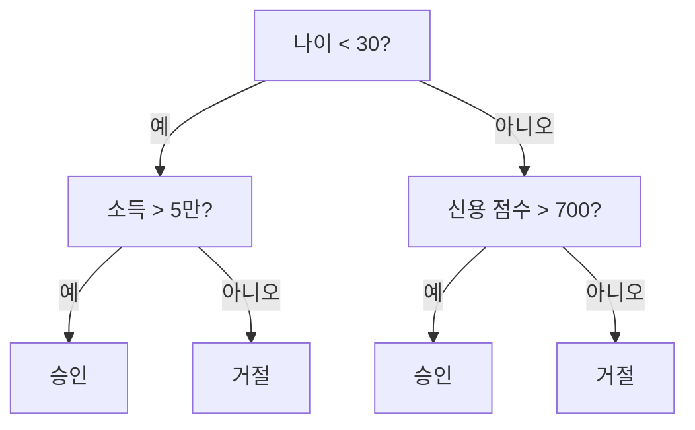
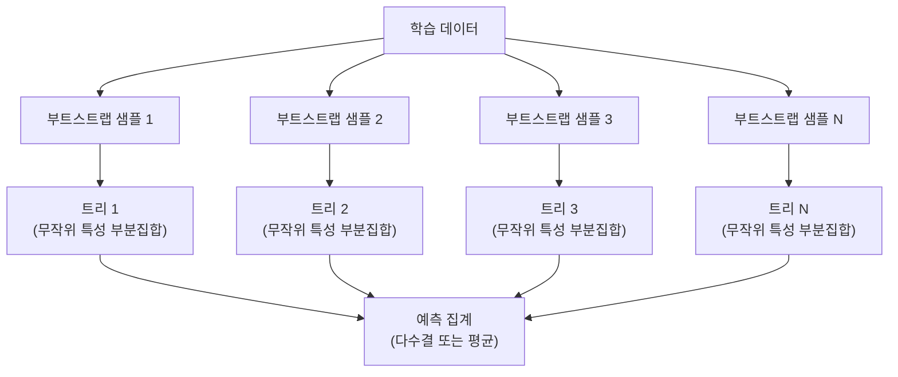

> 🇰🇷 이 문서는 한국어 번역본입니다(ELI5 스타일). 원문: [en.md](en.md)

# 결정 트리와 랜덤 포레스트 (Decision Trees and Random Forests)

> 결정 트리는 그저 하나의 플로차트입니다. 그런데 이 트리들을 모은 숲(random forest)은 ML에서 가장 강력한 도구 중 하나입니다.

**유형:** Build
**언어:** Python
**선수 지식:** 페이즈 1 (레슨 09 정보이론, 06 확률)
**시간:** 약 90분

## 학습 목표

- 지니 불순도, 엔트로피, 정보 이득 계산을 직접 구현해 최적의 결정 트리 분할을 찾습니다
- 사전 가지치기(pre-pruning) 컨트롤(최대 깊이, 최소 샘플 수)을 갖춘 결정 트리 분류기를 직접 만듭니다
- 부트스트랩 샘플링과 특성 무작위화를 사용해 랜덤 포레스트를 구성하고, 분산을 줄이는 이유를 설명합니다
- MDI 특성 중요도와 순열 중요도(permutation importance)를 비교하고, MDI가 언제 편향되는지 짚어 봅니다

## 문제 상황

테이블 형태의 데이터가 있다고 합시다. 행은 샘플, 열은 특성(feature)이고, 예측하고 싶은 타깃 열이 하나 있습니다. 신경망을 던져 넣을 수도 있습니다. 하지만 테이블 데이터에서는 트리 기반 모델(결정 트리, 랜덤 포레스트, 그래디언트 부스티드 트리)이 딥러닝을 꾸준히 압도합니다. 구조화된 데이터를 다루는 Kaggle 대회는 트랜스포머가 아니라 XGBoost와 LightGBM이 지배합니다.

왜일까요? 트리는 전처리 없이도 섞인 특성 타입(수치형 + 범주형)을 다룹니다. 특성 엔지니어링 없이도 비선형 관계를 다룹니다. 해석도 가능합니다. 트리를 들여다보면 어떤 예측이 왜 나왔는지 정확히 볼 수 있습니다. 그리고 여러 트리를 평균 내는 랜덤 포레스트는 중간 크기 데이터셋에서 과적합에 매우 잘 견딥니다.

이 레슨에서는 재귀적 분할로 결정 트리를 직접 만들고, 그 위에 랜덤 포레스트를 올립니다. 분할 기준 뒤에 있는 수학(지니 불순도, 엔트로피, 정보 이득)을 직접 구현하고, 약한 학습기(weak learner)들의 앙상블이 왜 강한 학습기가 되는지 이해하게 됩니다.

## 핵심 개념

### 결정 트리가 하는 일

결정 트리는 예/아니오 질문을 연달아 던지면서 특성 공간을 직사각형 영역들로 나눕니다.



각 내부 노드는 특성을 임계값과 비교해 검사합니다. 각 리프 노드는 예측을 내놓습니다. 새 데이터 점을 분류하려면 루트에서 출발해 리프에 도달할 때까지 가지를 따라가면 됩니다.

트리는 위에서 아래로 만들어집니다. 각 노드에서 데이터를 가장 잘 가르는 특성과 임계값을 고르는 방식입니다. "가장 잘"이라는 기준은 분할 기준(split criterion)으로 정의됩니다.

### 분할 기준: 불순도 측정

각 노드에는 샘플 집합이 있습니다. 이 샘플들을 나눠서, 결과로 생긴 자식 노드들이 최대한 "순수"해지길 원합니다. 즉 각 자식이 한 클래스 위주로만 이뤄지도록 하는 것입니다.

**지니 불순도(Gini impurity)**는 한 노드의 클래스 분포대로 레이블을 붙였을 때, 무작위로 뽑은 샘플을 잘못 분류할 확률을 측정합니다.

```
Gini(S) = 1 - sum(p_k^2)

where p_k is the proportion of class k in set S.
```

순수한 노드(한 클래스뿐)에서는 지니 = 0입니다. 50/50 이진 분할에서는 지니 = 0.5입니다. 낮을수록 좋습니다.

```
Example: 6 cats, 4 dogs

Gini = 1 - (0.6^2 + 0.4^2) = 1 - (0.36 + 0.16) = 0.48
```

**엔트로피**는 노드 안의 정보량(무질서도)을 측정합니다. 페이즈 1 레슨 09에서 다뤘습니다.

```
Entropy(S) = -sum(p_k * log2(p_k))
```

순수한 노드에서는 엔트로피 = 0이고, 50/50 이진 분할에서는 엔트로피 = 1.0입니다. 낮을수록 좋습니다.

```
Example: 6 cats, 4 dogs

Entropy = -(0.6 * log2(0.6) + 0.4 * log2(0.4))
        = -(0.6 * -0.737 + 0.4 * -1.322)
        = 0.442 + 0.529
        = 0.971 bits
```

**정보 이득(information gain)**은 분할 후 불순도(엔트로피 또는 지니)가 얼마나 줄었는지를 뜻합니다.

```
IG(S, feature, threshold) = Impurity(S) - weighted_avg(Impurity(S_left), Impurity(S_right))

where the weights are the proportions of samples in each child.
```

각 노드에서의 탐욕적(greedy) 알고리즘은 이렇습니다: 모든 특성과 가능한 모든 임계값을 시도해 보고, 정보 이득을 최대화하는 (특성, 임계값) 쌍을 고릅니다.

### 분할이 동작하는 방식

현재 노드에 특성 n개, 샘플 m개가 있는 데이터셋이 있다고 합시다:

1. 각 특성 j에 대해 (j = 1부터 n까지):
   - 특성 j 값을 기준으로 샘플을 정렬
   - 연속된 서로 다른 값들 사이의 모든 중간점을 임계값으로 시도
   - 각 임계값에 대한 정보 이득을 계산
2. 정보 이득이 가장 높은 특성과 임계값을 선택
3. 데이터를 왼쪽(특성 <= 임계값)과 오른쪽(특성 > 임계값)으로 분할
4. 각 자식에 대해 재귀적으로 반복

이 탐욕적 접근은 전역적으로 최적인 트리를 보장하지 않습니다. 최적 트리를 찾는 문제는 NP-난해(NP-hard)합니다. 하지만 탐욕적 분할은 실전에서 잘 작동합니다.

### 정지 조건

정지 조건이 없으면 트리는 모든 리프가 순수해질 때(리프당 샘플 하나)까지 자랍니다. 이러면 학습 데이터를 완벽히 외워 버리고, 일반화 성능은 끔찍해집니다.

**사전 가지치기(pre-pruning)**는 트리가 다 자라기 전에 멈춥니다:
- 최대 깊이: 트리가 정해진 깊이에 도달하면 분할 중단
- 리프당 최소 샘플 수: 노드의 샘플이 k개보다 적으면 중단
- 최소 정보 이득: 최선의 분할이 불순도를 임계값보다 적게 개선하면 중단
- 최대 리프 수: 리프 총개수 제한

**사후 가지치기(post-pruning)**는 트리를 끝까지 키운 다음 잘라냅니다:
- 비용-복잡도 가지치기(scikit-learn이 사용): 리프 개수에 비례하는 벌점을 추가. 벌점을 키우면 트리가 작아짐
- 축소 오류 가지치기: 검증 오류가 늘어나지 않는다면 서브트리를 제거

사전 가지치기가 더 단순하고 빠릅니다. 사후 가지치기는 대체로 더 좋은 트리를 만듭니다. 나중에 유용한 분할로 이어질 수도 있는 분할을 미리 멈춰 버리는 일이 없기 때문입니다.

### 회귀를 위한 결정 트리

회귀에서는 리프의 예측값이 그 리프에 속한 타깃값들의 평균입니다. 분할 기준도 바뀝니다:

정보 이득 대신 **분산 감소(variance reduction)**를 사용합니다:

```
VR(S, feature, threshold) = Var(S) - weighted_avg(Var(S_left), Var(S_right))
```

분산을 가장 크게 줄이는 분할을 고릅니다. 트리는 입력 공간을 영역들로 나누고, 각 영역에서 상수(평균) 하나를 예측합니다.

### 랜덤 포레스트: 앙상블의 힘

결정 트리 하나는 분산이 큽니다. 데이터가 조금만 바뀌어도 완전히 다른 트리가 나올 수 있습니다. 랜덤 포레스트는 많은 트리를 평균 내서 이 문제를 해결합니다.



두 가지 무작위성이 트리들을 서로 다르게 만듭니다:

**배깅(bagging, bootstrap aggregating):** 각 트리는 부트스트랩 샘플, 즉 학습 데이터에서 복원 추출한 무작위 샘플로 학습됩니다. 원래 샘플의 약 63%가 각 부트스트랩에 등장하고(나머지는 검증에 쓸 수 있는 out-of-bag 샘플이 됩니다).

**특성 무작위화:** 각 분할에서는 특성의 무작위 부분집합만 고려합니다. 분류에서 기본값은 sqrt(n_features), 회귀에서는 n_features/3입니다. 모든 트리가 똑같은 지배적 특성으로 분할하는 것을 막아 줍니다.

핵심 통찰: 서로 상관되지 않은(decorrelated) 많은 트리를 평균 내면 편향을 키우지 않고도 분산을 줄일 수 있습니다. 트리 하나하나는 평범할 수 있지만, 앙상블은 강합니다.

### 특성 중요도

랜덤 포레스트는 특성 중요도 점수를 자연스럽게 제공합니다. 가장 흔한 방법:

**불순도 평균 감소(MDI, Mean Decrease in Impurity):** 각 특성에 대해, 그 특성이 쓰인 모든 트리의 모든 노드에서 불순도 감소량을 합산합니다. 이른 분할에서 더 큰 불순도 감소를 만드는 특성이 더 중요합니다.

```
importance(feature_j) = sum over all nodes where feature_j is used:
    (n_samples_at_node / n_total_samples) * impurity_decrease
```

빠릅니다(학습 중에 계산됨) 하지만 고유값이 많은 특성, 가능한 분할 지점이 많은 특성 쪽으로 편향되어 있습니다.

**순열 중요도(permutation importance)**는 대안입니다: 한 특성의 값을 섞어 보고(shuffle) 모델 정확도가 얼마나 떨어지는지 측정합니다. 더 믿을 만하지만 느립니다.

### 트리가 신경망을 이기는 경우

테이블 데이터에서는 트리와 포레스트가 신경망을 지배합니다. 이유 몇 가지:

| 요인 | 트리 | 신경망 |
|--------|-------|----------------|
| 섞인 타입(수치형 + 범주형) | 기본 지원 | 인코딩 필요 |
| 작은 데이터셋(1만 행 미만) | 잘 동작 | 과적합 |
| 특성 상호작용 | 분할로 찾아냄 | 아키텍처 설계 필요 |
| 해석 가능성 | 완전한 투명성 | 블랙박스 |
| 학습 시간 | 몇 분 | 몇 시간 |
| 하이퍼파라미터 민감도 | 낮음 | 높음 |

데이터에 공간적·순차적 구조(이미지, 텍스트, 오디오)가 있을 때는 신경망이 이깁니다. 특성의 평평한 테이블이라면 트리가 기본 선택입니다.

```figure
decision-tree-depth
```

## 직접 만들기

### 단계 1: 지니 불순도와 엔트로피

두 분할 기준을 모두 직접 구현하고, 어떤 분할이 좋은지 두 기준이 서로 동의하는지 확인합니다.

```python
import math

def gini_impurity(labels):
    n = len(labels)
    if n == 0:
        return 0.0
    counts = {}
    for label in labels:
        counts[label] = counts.get(label, 0) + 1
    return 1.0 - sum((c / n) ** 2 for c in counts.values())

def entropy(labels):
    n = len(labels)
    if n == 0:
        return 0.0
    counts = {}
    for label in labels:
        counts[label] = counts.get(label, 0) + 1
    return -sum(
        (c / n) * math.log2(c / n) for c in counts.values() if c > 0
    )
```

### 단계 2: 최선의 분할 찾기

모든 특성과 모든 임계값을 시도해 보고, 정보 이득이 가장 높은 것을 돌려줍니다.

```python
def information_gain(parent_labels, left_labels, right_labels, criterion="gini"):
    measure = gini_impurity if criterion == "gini" else entropy
    n = len(parent_labels)
    n_left = len(left_labels)
    n_right = len(right_labels)
    if n_left == 0 or n_right == 0:
        return 0.0
    parent_impurity = measure(parent_labels)
    child_impurity = (
        (n_left / n) * measure(left_labels) +
        (n_right / n) * measure(right_labels)
    )
    return parent_impurity - child_impurity
```

### 단계 3: DecisionTree 클래스 만들기

재귀적 분할, 예측, 특성 중요도 추적을 갖춥니다. `_build`가 트리의 심장입니다. 노드가 순수하거나 사전 가지치기 한도에 걸리면 멈추고, 그렇지 않으면 최선의 분할을 택해 두 자식에 각각 재귀합니다.

```python
import random

class DecisionTree:
    def __init__(self, max_depth=None, min_samples_split=2,
                 min_samples_leaf=1, criterion="gini",
                 max_features=None):
        self.max_depth = max_depth
        self.min_samples_split = min_samples_split
        self.min_samples_leaf = min_samples_leaf
        self.criterion = criterion
        self.max_features = max_features
        self.tree = None
        self.feature_importances_ = None

    def fit(self, X, y):
        self.n_features = len(X[0])
        self.feature_importances_ = [0.0] * self.n_features
        self.n_samples = len(X)
        self.tree = self._build(X, y, depth=0)
        total = sum(self.feature_importances_)
        if total > 0:
            self.feature_importances_ = [
                fi / total for fi in self.feature_importances_
            ]

    def predict(self, X):
        return [self._predict_one(x, self.tree) for x in X]

    def _build(self, X, y, depth):
        if len(set(y)) == 1:
            return {"leaf": True, "value": y[0]}

        if self.max_depth is not None and depth >= self.max_depth:
            return self._make_leaf(y)

        if len(y) < self.min_samples_split:
            return self._make_leaf(y)

        best_feature, best_threshold, best_gain = self._best_split(X, y)

        if best_feature is None or best_gain <= 0:
            return self._make_leaf(y)

        left_X, left_y, right_X, right_y = self._split_data(
            X, y, best_feature, best_threshold
        )

        if len(left_y) < self.min_samples_leaf or len(right_y) < self.min_samples_leaf:
            return self._make_leaf(y)

        weight = len(y) / self.n_samples
        self.feature_importances_[best_feature] += weight * best_gain

        return {
            "leaf": False,
            "feature": best_feature,
            "threshold": best_threshold,
            "left": self._build(left_X, left_y, depth + 1),
            "right": self._build(right_X, right_y, depth + 1),
        }

    def _make_leaf(self, y):
        counts = {}
        for label in y:
            counts[label] = counts.get(label, 0) + 1
        return {"leaf": True, "value": max(counts, key=counts.get)}

    def _best_split(self, X, y):
        best_feature = None
        best_threshold = None
        best_gain = -1.0

        if self.max_features == "sqrt":
            k = max(1, int(math.sqrt(self.n_features)))
            feature_indices = random.sample(range(self.n_features), k)
        elif isinstance(self.max_features, int):
            if self.max_features < 1:
                raise ValueError("max_features must be at least 1 when given as an integer")
            k = min(self.max_features, self.n_features)
            feature_indices = random.sample(range(self.n_features), k)
        else:
            feature_indices = list(range(self.n_features))

        for feature_idx in feature_indices:
            values = sorted(set(X[i][feature_idx] for i in range(len(X))))
            if len(values) <= 1:
                continue

            for i in range(len(values) - 1):
                threshold = (values[i] + values[i + 1]) / 2.0
                left_y = [y[j] for j in range(len(X)) if X[j][feature_idx] <= threshold]
                right_y = [y[j] for j in range(len(X)) if X[j][feature_idx] > threshold]

                if len(left_y) < self.min_samples_leaf or len(right_y) < self.min_samples_leaf:
                    continue

                gain = information_gain(y, left_y, right_y, self.criterion)
                if gain > best_gain:
                    best_gain = gain
                    best_feature = feature_idx
                    best_threshold = threshold

        return best_feature, best_threshold, best_gain

    def _split_data(self, X, y, feature, threshold):
        left_X, left_y, right_X, right_y = [], [], [], []
        for i in range(len(X)):
            if X[i][feature] <= threshold:
                left_X.append(X[i])
                left_y.append(y[i])
            else:
                right_X.append(X[i])
                right_y.append(y[i])
        return left_X, left_y, right_X, right_y

    def _predict_one(self, x, node):
        if node["leaf"]:
            return node["value"]
        if x[node["feature"]] <= node["threshold"]:
            return self._predict_one(x, node["left"])
        return self._predict_one(x, node["right"])
```

### 단계 4: RandomForest 클래스 만들기

부트스트랩 샘플링, 특성 무작위화, 다수결 투표를 갖춥니다.

```python
class RandomForest:
    def __init__(self, n_trees=100, max_depth=None,
                 min_samples_split=2, max_features="sqrt",
                 criterion="gini"):
        self.n_trees = n_trees
        self.max_depth = max_depth
        self.min_samples_split = min_samples_split
        self.max_features = max_features
        self.criterion = criterion
        self.trees = []

    def fit(self, X, y):
        n = len(X)
        for _ in range(self.n_trees):
            indices = [random.randint(0, n - 1) for _ in range(n)]
            X_boot = [X[i] for i in indices]
            y_boot = [y[i] for i in indices]
            tree = DecisionTree(
                max_depth=self.max_depth,
                min_samples_split=self.min_samples_split,
                max_features=self.max_features,
                criterion=self.criterion,
            )
            tree.fit(X_boot, y_boot)
            self.trees.append(tree)

    def predict(self, X):
        all_preds = [tree.predict(X) for tree in self.trees]
        predictions = []
        for i in range(len(X)):
            votes = {}
            for preds in all_preds:
                v = preds[i]
                votes[v] = votes.get(v, 0) + 1
            predictions.append(max(votes, key=votes.get))
        return predictions
```

모든 헬퍼 메서드가 포함된 전체 구현은 `code/trees.py`에 있습니다.

## 실전에서 쓰기

scikit-learn이라면 랜덤 포레스트 학습이 세 줄이면 끝납니다:

```python
from sklearn.ensemble import RandomForestClassifier
from sklearn.datasets import load_iris
from sklearn.model_selection import train_test_split

X, y = load_iris(return_X_y=True)
X_train, X_test, y_train, y_test = train_test_split(X, y, random_state=42)

rf = RandomForestClassifier(n_estimators=100, random_state=42)
rf.fit(X_train, y_train)
print(f"Accuracy: {rf.score(X_test, y_test):.4f}")
print(f"Feature importances: {rf.feature_importances_}")
```

실무에서는 그래디언트 부스티드 트리(XGBoost, LightGBM, CatBoost)가 종종 랜덤 포레스트보다 더 강합니다. 트리를 순차적으로 만들면서 각 트리가 앞선 트리들의 오류를 고쳐 나가기 때문입니다. 하지만 랜덤 포레스트는 잘못 설정하기 어렵고 하이퍼파라미터 튜닝이 거의 필요 없다는 장점이 있습니다.

## 출시하기

이 레슨은 `outputs/prompt-tree-interpreter.md`를 산출합니다 — 결정 트리의 분할을 비즈니스 이해관계자에게 맞춰 해석해 주는 프롬프트입니다. 학습된 트리의 구조(깊이, 사용된 특성, 분할 임계값, 정확도)를 넣어 주면, 모델을 일상 언어의 규칙으로 바꾸고, 특성 중요도를 순위 매기고, 과적합이나 데이터 누수를 표시하고, 다음 단계를 추천해 줍니다. 코드를 읽지 못하는 사람에게 트리 기반 모델을 설명해야 할 때 언제든 쓰면 됩니다.

## 연습 문제

1. 3클래스짜리 2차원 데이터셋에서 결정 트리 하나를 학습시킵니다. 분할을 손으로 추적해 직사각형 결정 경계를 그려 봅니다. max_depth=2일 때와 max_depth=10일 때의 경계를 비교합니다.

2. 회귀 트리를 위한 분산 감소 분할을 구현합니다. 200개 점에 대해 y = sin(x) + 노이즈를 만들고 회귀 트리를 피팅합니다. 트리의 계단형(piecewise-constant) 예측을 참 곡선과 함께 그려 비교합니다.

3. 트리 1, 5, 10, 50, 200개로 랜덤 포레스트를 만듭니다. 학습 정확도와 테스트 정확도를 트리 개수에 대해 그려 봅니다. 테스트 정확도는 정체하되 떨어지지 않는다는 것(포레스트는 과적합에 강함)을 확인합니다.

4. 5개의 서로 다른 데이터셋에서 지니 불순도와 엔트로피를 분할 기준으로 비교합니다. 정확도와 트리 깊이를 측정합니다. 대부분 거의 동일한 결과가 나옵니다. 그 이유를 설명해 보세요.

5. 순열 중요도를 구현합니다. 한 특성이 무작위 노이즈인데 고유값은 매우 많은 데이터셋에서 MDI 중요도와 비교합니다. MDI는 노이즈 특성을 높게 순위 매기지만, 순열 중요도는 그렇지 않습니다.

## 핵심 용어

| 용어 | 사람들이 말하는 표현 | 실제 의미 |
|------|----------------|----------------------|
| 결정 트리 | "예측용 플로차트" | if/else 분할의 연속을 학습해서 특성 공간을 직사각형 영역으로 나누는 모델 |
| 지니 불순도 | "노드가 얼마나 섞였나" | 노드에서 무작위 샘플을 잘못 분류할 확률. 0 = 순수, 이진 분류에서 최대 불순도 = 0.5 |
| 엔트로피 | "노드의 무질서도" | 노드의 정보량. 0 = 순수, 이진 분류에서 최대 불확실성 = 1.0. 정보이론에서 온 개념 |
| 정보 이득 | "분할이 얼마나 좋나" | 분할 후 불순도가 줄어든 양. 분할을 고르는 탐욕적 기준 |
| 사전 가지치기 | "트리를 일찍 멈춤" | 최대 깊이, 최소 샘플 수, 최소 이득 임계값 등을 정해 트리 성장을 일찍 멈추는 것 |
| 사후 가지치기 | "다 키운 뒤 다듬기" | 트리를 끝까지 키운 뒤 검증 성능을 개선하지 않는 서브트리를 제거하는 것 |
| 배깅 | "무작위 부분집합으로 학습" | bootstrap aggregating. 각 모델을 서로 다른 복원 무작위 샘플로 학습 |
| 랜덤 포레스트 | "트리 여러 개" | 결정 트리의 앙상블. 각 트리는 부트스트랩 샘플로 학습되고, 각 분할에서 무작위 특성 부분집합을 사용 |
| 특성 중요도(MDI) | "어떤 특성이 중요하나" | 각 특성이 만든 불순도 감소 총량. 모든 트리와 노드에 걸쳐 합산 |
| 순열 중요도 | "섞어 보고 확인" | 한 특성의 값을 무작위로 섞었을 때 떨어지는 정확도. 노이즈가 섞인 특성에는 MDI보다 믿을 만함 |
| 분산 감소 | "정보 이득의 회귀 버전" | 정보 이득에 해당하는 회귀 트리 개념. 타깃 분산을 가장 크게 줄이는 분할을 고름 |
| 부트스트랩 샘플 | "중복 허용 무작위 샘플" | 원본 데이터셋에서 복원 추출로 뽑은 무작위 샘플. 크기는 같지만 중복이 있음 |

## 더 읽을거리

- [Breiman: Random Forests (2001)](https://link.springer.com/article/10.1023/A:1010933404324) - 랜덤 포레스트 원논문
- [Grinsztajn et al.: Why do tree-based models still outperform deep learning on tabular data? (2022)](https://arxiv.org/abs/2207.08815) - 테이블 데이터 작업에서 트리 대 신경망을 엄밀하게 비교
- [scikit-learn Decision Trees documentation](https://scikit-learn.org/stable/modules/tree.html) - 시각화 도구가 포함된 실전 가이드
- [XGBoost: A Scalable Tree Boosting System (Chen & Guestrin, 2016)](https://arxiv.org/abs/1603.02754) - Kaggle을 지배하는 그래디언트 부스팅 논문
