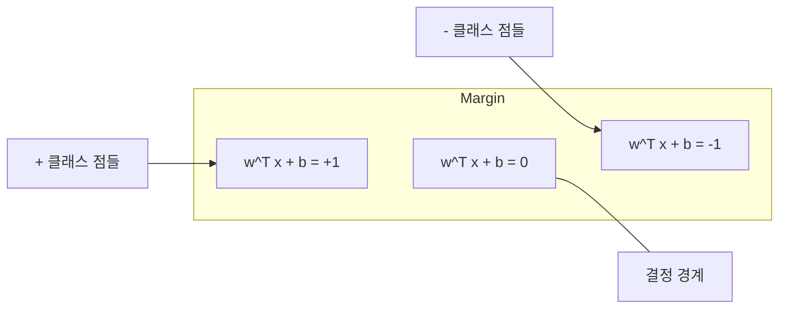
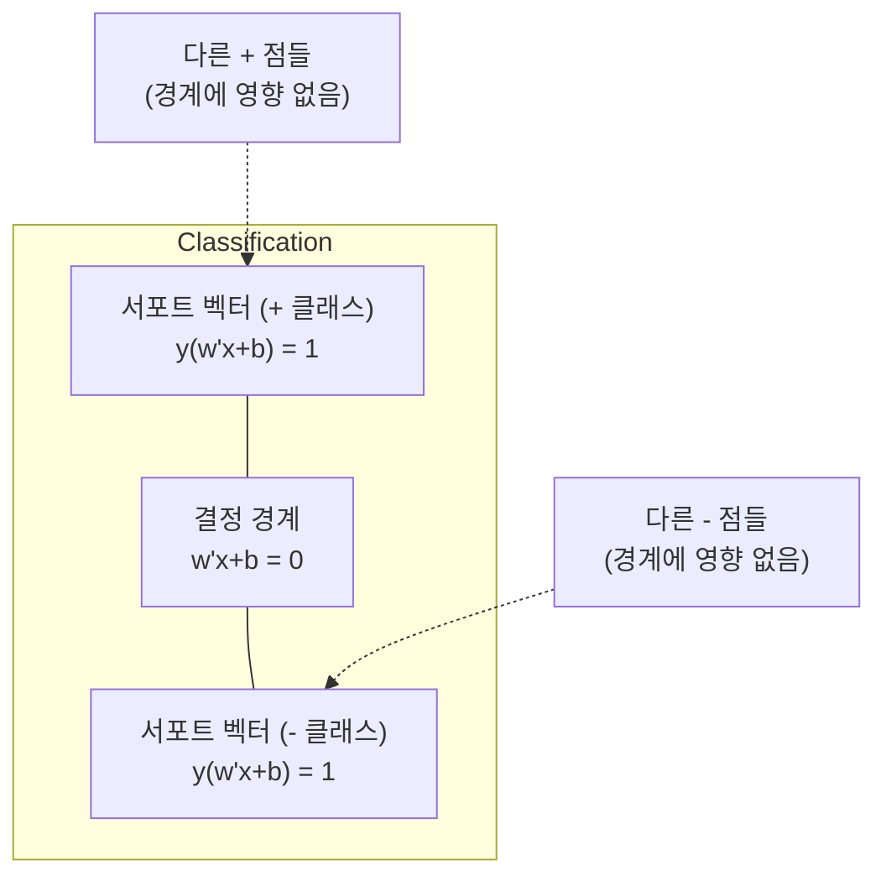
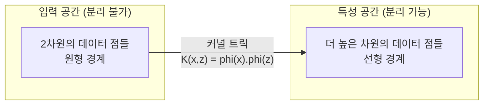

> 🇰🇷 이 문서는 한국어 번역본입니다(ELI5 스타일). 원문: [en.md](en.md)

# 서포트 벡터 머신 (Support Vector Machines)

> 두 클래스 사이에 가장 넓은 길을 찾습니다. 아이디어는 이게 전부입니다.

**유형:** Build
**언어:** Python
**선수 지식:** 페이즈 1 (레슨 08 최적화, 14 노름과 거리, 18 볼록 최적화)
**시간:** 약 90분

## 학습 목표

- 힌지 손실(hinge loss)과 원형(primal) 정식화 위의 경사 하강법으로 선형 SVM을 직접 구현합니다
- 최대 마진 원리를 설명하고, 학습된 모델에서 서포트 벡터를 찾아냅니다
- 선형, 다항, RBF 커널을 비교하고, 커널 트릭이 고차원 매핑을 명시적으로 계산하지 않고 어떻게 회피하는지 설명합니다
- 마진 폭과 분류 오류 사이의 트레이드오프를 C 파라미터가 어떻게 조절하는지 평가합니다

## 문제 상황

두 클래스로 이뤄진 데이터 점들이 있고, 이들을 가르는 선(또는 초평면)을 그려야 합니다. 쓸 만한 선은 무한히 많습니다. 그중 무엇을 골라야 할까요?

마진이 가장 큰 선입니다. 마진은 결정 경계와, 양쪽 면에서 경계에 가장 가까운 데이터 점들 사이의 거리입니다. 마진이 넓을수록 분류기가 더 확신에 차 있고, 보지 못한 데이터에도 더 잘 일반화된다는 뜻입니다.

이 직관이 서포트 벡터 머신(SVM)으로 이어집니다. SVM은 ML에서 수학적으로 가장 우아한 알고리즘 중 하나입니다. 딥러닝 이전 시대에는 SVM이 지배적인 분류 방법이었고, 지금도 작은 데이터셋, 고차원 데이터, 그리고 이론적 보장을 갖춘 원칙적이고 잘 이해된 모델이 필요한 문제에서는 최선의 선택입니다.

SVM은 페이즈 1과 직접 연결됩니다. 최적화는 볼록하고(레슨 18), 마진은 노름으로 측정되며(레슨 14), 커널 트릭은 점곱을 활용해 고차원 공간에서 직접 계산하지 않고도 비선형 경계를 다룹니다.

## 핵심 개념

### 최대 마진 분류기

레이블 y_i가 {-1, +1}에 속하고 특성 벡터 x_i가 있는 선형 분리 가능한 데이터가 주어졌을 때, 클래스들을 가르는 초평면 w^T x + b = 0을 찾고 싶습니다.

점 x_i에서 초평면까지의 거리는:

```
distance = |w^T x_i + b| / ||w||
```

올바르게 분류된 점이라면: y_i * (w^T x_i + b) > 0. 마진은 초평면에서 양쪽 면의 가장 가까운 점까지 거리의 두 배입니다.



최적화 문제:

```
maximize    2 / ||w||     (the margin width)
subject to  y_i * (w^T x_i + b) >= 1  for all i
```

동치인 형태(||w||^2을 최소화하는 쪽이 최적화하기 더 쉽습니다):

```
minimize    (1/2) ||w||^2
subject to  y_i * (w^T x_i + b) >= 1  for all i
```

이것은 볼록 이차계획법(quadratic program) 문제입니다. 유일한 전역 해가 존재합니다. 마진 경계 위에 정확히 놓인 데이터 점들(y_i * (w^T x_i + b) = 1인 점)이 바로 서포트 벡터입니다. 결정 경계를 결정하는 것은 이 점들뿐입니다. 서포트 벡터가 아닌 점을 옮기거나 없애도 경계는 변하지 않습니다.

### 서포트 벡터: 결정적인 소수



대부분의 학습 점은 무관합니다. 서포트 벡터만이 중요합니다. 이 때문에 SVM은 예측 시점에 메모리를 아낍니다. 저장해야 하는 것은 전체 학습셋이 아니라 서포트 벡터뿐입니다.

서포트 벡터의 개수는 일반화 오류의 상한도 알려 줍니다. 데이터셋 크기 대비 서포트 벡터가 적을수록 일반화가 더 좋습니다.

### 소프트 마진: C 파라미터로 노이즈 다루기

실제 데이터는 완벽히 분리되는 일이 드뭅니다. 어떤 점은 경계의 잘못된 쪽에 있거나 마진 안에 들어올 수 있습니다. 소프트 마진 정식화는 슬랙 변수(slack variable)를 도입해 위반을 허용합니다.

```
minimize    (1/2) ||w||^2 + C * sum(xi_i)
subject to  y_i * (w^T x_i + b) >= 1 - xi_i
            xi_i >= 0  for all i
```

슬랙 변수 xi_i는 점 i가 마진을 얼마나 위반했는지 측정합니다. C가 트레이드오프를 조절합니다:

| C 값 | 행동 |
|---------|----------|
| 큰 C | 위반을 크게 벌점. 마진이 좁고 오분류가 적음. 과적합 |
| 작은 C | 위반을 더 허용. 마진이 넓고 오분류가 많음. 과소적합 |

C는 정규화 세기를 뒤집은 것입니다. 큰 C = 정규화 약함. 작은 C = 정규화 강함.

### 힌지 손실: SVM의 손실 함수

소프트 마진 SVM은 제약 없는 최적화 문제로 다시 쓸 수 있습니다:

```
minimize    (1/2) ||w||^2 + C * sum(max(0, 1 - y_i * (w^T x_i + b)))
```

max(0, 1 - y_i * f(x_i)) 항이 바로 힌지 손실입니다. 점이 올바르게 분류되고 마진 밖에 있으면 0이고, 마진 안에 있거나 잘못 분류되면 선형적으로 벌점이 붙습니다.

```
Hinge loss for a single point:

loss
  |
  | \
  |  \
  |   \
  |    \
  |     \_______________
  |
  +-----|-----|-------->  y * f(x)
       0     1

Zero loss when y*f(x) >= 1 (correctly classified, outside margin).
Linear penalty when y*f(x) < 1.
```

로지스틱 손실(로지스틱 회귀)과 비교하면:

```
Hinge:     max(0, 1 - y*f(x))          Hard cutoff at margin
Logistic:  log(1 + exp(-y*f(x)))        Smooth, never exactly zero
```

힌지 손실은 희소한 해를 만듭니다(서포트 벡터만 0이 아닌 기여를 합니다). 로지스틱 손실은 모든 데이터 점을 사용합니다. 그래서 SVM이 예측 시점에 메모리를 더 아낍니다.

### 경사 하강법으로 선형 SVM 학습하기

제약 있는 QP를 푸는 대신, 힌지 손실에 L2 정규화를 더한 식을 경사 하강법으로 최소화해 선형 SVM을 학습시킬 수 있습니다:

```
L(w, b) = (lambda/2) * ||w||^2 + (1/n) * sum(max(0, 1 - y_i * (w^T x_i + b)))

Gradient with respect to w:
  If y_i * (w^T x_i + b) >= 1:  dL/dw = lambda * w
  If y_i * (w^T x_i + b) < 1:   dL/dw = lambda * w - y_i * x_i

Gradient with respect to b:
  If y_i * (w^T x_i + b) >= 1:  dL/db = 0
  If y_i * (w^T x_i + b) < 1:   dL/db = -y_i
```

이것을 원형(primal) 정식화라고 부릅니다. 에포크당 O(n * d)로 실행됩니다(n은 샘플 수, d는 특성 수). 크고 희소한 고차원 데이터(텍스트 분류)에서 빠릅니다.

### 쌍대(dual) 정식화와 커널 트릭

SVM 문제의 라그랑지안 쌍대(페이즈 1 레슨 18의 KKT 조건)는:

```
maximize    sum(alpha_i) - (1/2) * sum_ij(alpha_i * alpha_j * y_i * y_j * (x_i . x_j))
subject to  0 <= alpha_i <= C
            sum(alpha_i * y_i) = 0
```

쌍대 문제는 데이터 점 사이의 점곱 x_i . x_j만 사용합니다. 이것이 핵심 통찰입니다. 모든 점곱을 커널 함수 K(x_i, x_j)로 바꾸면, 변환을 명시적으로 계산하지 않고도 SVM이 비선형 경계를 학습할 수 있습니다.

```
Linear kernel:      K(x, z) = x . z
Polynomial kernel:  K(x, z) = (x . z + c)^d
RBF (Gaussian):     K(x, z) = exp(-gamma * ||x - z||^2)
```

RBF 커널은 데이터를 무한 차원 공간으로 보냅니다. 입력 공간에서 가까운 점들은 커널 값이 1에 가깝고, 멀리 떨어진 점들은 0에 가깝습니다. 어떤 매끄러운 결정 경계든 학습할 수 있습니다.



커널 트릭은 고차원 공간에 가지 않으면서 그 공간에서의 점곱을 계산합니다. D차원 데이터에서 차수 d의 다항 커널이라면, 명시적 특성 공간은 O(D^d) 차원이 됩니다. 하지만 K(x, z)는 O(D) 시간에 계산됩니다.

### 회귀를 위한 SVM (SVR)

서포트 벡터 회귀(Support Vector Regression)는 데이터 주위에 폭이 엡실론(epsilon)인 튜브를 씌웁니다. 튜브 안의 점은 손실이 0이고, 튜브 밖의 점은 선형적으로 벌점을 받습니다.

```
minimize    (1/2) ||w||^2 + C * sum(xi_i + xi_i*)
subject to  y_i - (w^T x_i + b) <= epsilon + xi_i
            (w^T x_i + b) - y_i <= epsilon + xi_i*
            xi_i, xi_i* >= 0
```

epsilon 파라미터가 튜브 폭을 조절합니다. 넓은 튜브 = 서포트 벡터가 적음 = 더 매끄러운 피팅. 좁은 튜브 = 서포트 벡터가 많음 = 더 촘촘한 피팅.

### SVM이 딥러닝에 진 이유 (그리고 여전히 이기는 경우)

SVM은 1990년대 후반부터 2010년대 초반까지 ML을 지배했습니다. 딥러닝이 이들을 앞지른 이유는 여러 가지입니다:

| 요인 | SVM | 딥러닝 |
|--------|------|---------------|
| 특성 엔지니어링 | 필요함 | 특성을 스스로 학습 |
| 확장성 | 커널에 대해 O(n^2) ~ O(n^3) | SGD로 에포크당 O(n) |
| 이미지/텍스트/오디오 | 손으로 만든 특성 필요 | 원시 데이터에서 학습 |
| 큰 데이터셋(10만 초과) | 느림 | 잘 확장됨 |
| GPU 가속 | 이득이 제한적 | 극적인 속도 향상 |

그래도 SVM이 이기는 상황:
- 작은 데이터셋(수백~수천 개 샘플)
- 고차원 희소 데이터(TF-IDF 특성을 쓴 텍스트)
- 수학적 보장(마진 한계)이 필요할 때
- 학습 시간을 최소화해야 할 때(선형 SVM은 매우 빠름)
- 마진 구조가 뚜렷한 이진 분류
- 이상 탐지(one-class SVM)

```figure
svm-margin
```

## 직접 만들기

### 단계 1: 힌지 손실과 그래디언트

기초 작업입니다. 배치에 대한 힌지 손실과 그래디언트를 계산합니다.

```python
def hinge_loss(X, y, w, b):
    n = len(X)
    total_loss = 0.0
    for i in range(n):
        margin = y[i] * (dot(w, X[i]) + b)
        total_loss += max(0.0, 1.0 - margin)
    return total_loss / n
```

### 단계 2: 경사 하강법으로 선형 SVM

정규화된 힌지 손실을 최소화해 학습합니다. QP 솔버가 필요 없습니다.

```python
class LinearSVM:
    def __init__(self, lr=0.001, lambda_param=0.01, n_epochs=1000):
        self.lr = lr
        self.lambda_param = lambda_param
        self.n_epochs = n_epochs
        self.w = None
        self.b = 0.0

    def fit(self, X, y):
        n_features = len(X[0])
        self.w = [0.0] * n_features
        self.b = 0.0

        for epoch in range(self.n_epochs):
            for i in range(len(X)):
                margin = y[i] * (dot(self.w, X[i]) + self.b)
                if margin >= 1:
                    self.w = [wj - self.lr * self.lambda_param * wj
                              for wj in self.w]
                else:
                    self.w = [wj - self.lr * (self.lambda_param * wj - y[i] * X[i][j])
                              for j, wj in enumerate(self.w)]
                    self.b -= self.lr * (-y[i])

    def predict(self, X):
        return [1 if dot(self.w, x) + self.b >= 0 else -1 for x in X]
```

### 단계 3: 커널 함수

선형, 다항, RBF 커널을 구현합니다.

```python
def linear_kernel(x, z):
    return dot(x, z)

def polynomial_kernel(x, z, degree=3, c=1.0):
    return (dot(x, z) + c) ** degree

def rbf_kernel(x, z, gamma=0.5):
    diff = [xi - zi for xi, zi in zip(x, z)]
    return math.exp(-gamma * dot(diff, diff))
```

### 단계 4: 마진과 서포트 벡터 찾기

학습 후 어떤 점들이 서포트 벡터인지 찾아내고 마진 폭을 계산합니다.

```python
def find_support_vectors(X, y, w, b, tol=1e-3):
    support_vectors = []
    for i in range(len(X)):
        margin = y[i] * (dot(w, X[i]) + b)
        if abs(margin - 1.0) < tol:
            support_vectors.append(i)
    return support_vectors
```

모든 데모가 포함된 전체 구현은 `code/svm.py`에 있습니다.

## 실전에서 쓰기

scikit-learn이라면:

```python
from sklearn.svm import SVC, LinearSVC, SVR
from sklearn.preprocessing import StandardScaler
from sklearn.pipeline import Pipeline

clf = Pipeline([
    ("scaler", StandardScaler()),
    ("svm", SVC(kernel="rbf", C=1.0, gamma="scale")),
])
clf.fit(X_train, y_train)
print(f"Accuracy: {clf.score(X_test, y_test):.4f}")
print(f"Support vectors: {clf['svm'].n_support_}")
```

중요: SVM을 학습시키기 전에는 반드시 특성(feature)을 스케일링하세요. SVM은 특성 크기에 민감합니다. 마진이 ||w||에 의존하는데, 스케일이 맞지 않는 특성은 기하학을 왜곡합니다.

큰 데이터셋에서는 `SVC`(쌍대 정식화, O(n^2) ~ O(n^3)) 대신 `LinearSVC`(원형 정식화, 에포크당 O(n))를 사용하세요:

```python
from sklearn.svm import LinearSVC

clf = Pipeline([
    ("scaler", StandardScaler()),
    ("svm", LinearSVC(C=1.0, max_iter=10000)),
])
```

## 연습 문제

1. 2차원 선형 분리 데이터셋을 만듭니다. 직접 만든 LinearSVM을 학습시키고 서포트 벡터를 찾아냅니다. 서포트 벡터가 결정 경계에 가장 가까운 점들인지 확인합니다.

2. 노이즈가 있는 데이터셋에서 C를 0.001부터 1000까지 바꿔 봅니다. 각 C 값에 대한 결정 경계를 그립니다. 넓은 마진(과소적합)에서 좁은 마진(과적합)으로 넘어가는 전환을 관찰합니다.

3. 클래스 경계가 원형(비선형)인 데이터셋을 만듭니다. 선형 SVM이 실패하는 모습을 보여 줍니다. RBF 커널 행렬을 계산하고, 커널이 만들어 준 특성 공간에서는 두 클래스가 분리 가능해진다는 것을 보여 줍니다.

4. 같은 데이터셋에서 힌지 손실과 로지스틱 손실을 비교합니다. 선형 SVM과 로지스틱 회귀를 각각 학습시킵니다. 각 모델의 결정 경계에 기여하는 학습 점이 몇 개인지 세어 봅니다(서포트 벡터 대 전체 점).

5. SVR(엡실론 무감속 손실)을 구현합니다. y = sin(x) + 노이즈에 피팅합니다. 예측 주위에 엡실론 튜브를 그리고, 서포트 벡터(튜브 밖의 점)를 강조합니다.

## 핵심 용어

| 용어 | 실제 의미 |
|------|----------------------|
| 서포트 벡터 | 결정 경계에 가장 가까운 학습 점들. 초평면을 결정하는 유일한 점들 |
| 마진 | 결정 경계와 가장 가까운 서포트 벡터들 사이의 거리. SVM은 이것을 최대화 |
| 힌지 손실 | max(0, 1 - y*f(x)). 올바르게 분류되고 마진 밖이면 0, 그 외에는 선형 벌점 |
| C 파라미터 | 마진 폭과 분류 오류 사이의 트레이드오프. 큰 C = 좁은 마진, 작은 C = 넓은 마진 |
| 소프트 마진 | 슬랙 변수로 마진 위반을 허용하는 SVM 정식화. 분리 불가능한 데이터를 다룸 |
| 커널 트릭 | 그 공간으로 명시적으로 매핑하지 않으면서 고차원 특성 공간의 점곱을 계산하는 것 |
| 선형 커널 | K(x, z) = x . z. 표준 점곱과 동일. 선형 분리 데이터에 사용 |
| RBF 커널 | K(x, z) = exp(-gamma * \|\|x-z\|\|^2). 무한 차원으로 매핑. 어떤 매끄러운 경계든 학습 |
| 다항 커널 | K(x, z) = (x . z + c)^d. 다항 조합의 특성 공간으로 매핑 |
| 쌍대 정식화 | 데이터 점 사이의 점곱에만 의존하도록 SVM 문제를 다시 쓴 것. 커널을 가능하게 함 |
| SVR | 서포트 벡터 회귀. 데이터 주위에 엡실론 튜브를 씌움. 튜브 안의 점은 손실 0 |
| 슬랙 변수 | xi_i: 점이 마진을 얼마나 위반했는지 측정. 마진 밖에서 올바르게 분류된 점은 0 |
| 최대 마진 | 각 클래스의 가장 가까운 점들까지의 거리를 최대화하는 초평면을 고르는 원리 |

## 더 읽을거리

- [Vapnik: The Nature of Statistical Learning Theory (1995)](https://link.springer.com/book/10.1007/978-1-4757-3264-1) - SVM과 통계적 학습의 기초가 되는 책
- [Cortes & Vapnik: Support-vector networks (1995)](https://link.springer.com/article/10.1007/BF00994018) - 최초의 SVM 논문
- [Platt: Sequential Minimal Optimization (1998)](https://www.microsoft.com/en-us/research/publication/sequential-minimal-optimization-a-fast-algorithm-for-training-support-vector-machines/) - SVM 학습을 실용적으로 만든 SMO 알고리즘
- [scikit-learn SVM documentation](https://scikit-learn.org/stable/modules/svm.html) - 구현 세부 사항이 담긴 실전 가이드
- [LIBSVM: A Library for Support Vector Machines](https://www.csie.ntu.edu.tw/~cjlin/libsvm/) - 대부분의 SVM 구현의 토대가 되는 C++ 라이브러리
