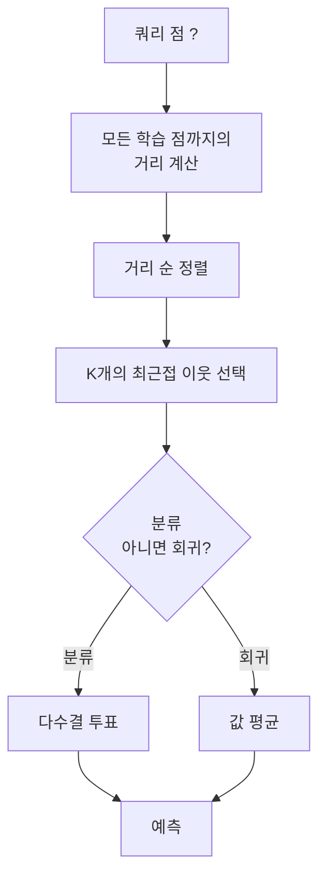
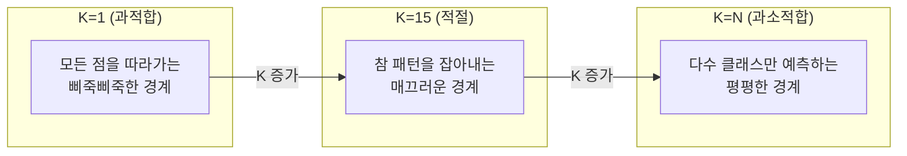
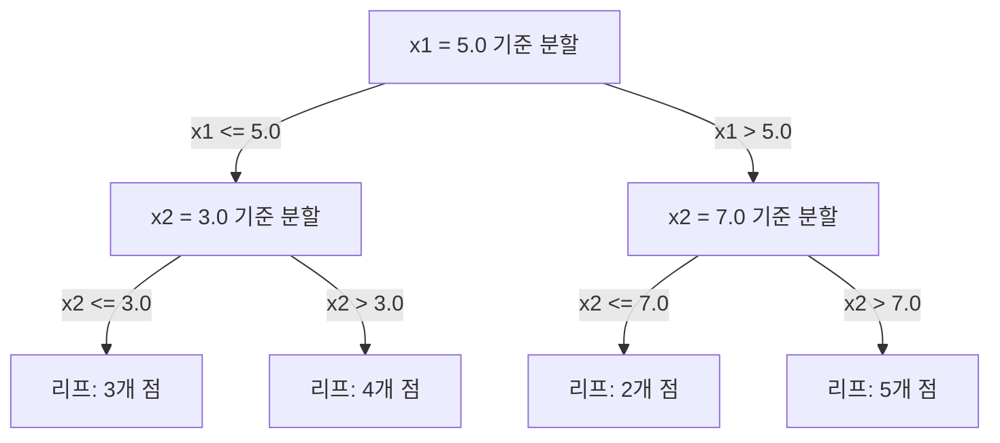

> 🇰🇷 이 문서는 한국어 번역본입니다(ELI5 스타일). 원문: [en.md](en.md)

# K-최근접 이웃과 거리 (K-Nearest Neighbors and Distances)

> 전부 저장해 두고, 이웃을 보고 예측합니다. 실제로 동작하는 가장 단순한 알고리즘입니다.

**유형:** Build
**언어:** Python
**선수 지식:** 페이즈 1 (레슨 14 노름과 거리)
**시간:** 약 90분

## 학습 목표

- K를 조절할 수 있고 거리 가중 투표를 갖춘 KNN 분류·회귀를 직접 구현합니다
- L1, L2, 코사인, 민코프스키 거리 지표를 비교하고 데이터 타입에 맞는 것을 고릅니다
- 차원의 저주를 설명하고, KNN이 고차원 공간에서 왜 성능이 나빠지는지 보여 줍니다
- 효율적인 최근접 이웃 탐색을 위한 KD-트리를 만들고, 무차별 대입(brute-force)보다 나은 경우를 분석합니다

## 문제 상황

데이터셋이 있고, 새 데이터 점이 도착했습니다. 이 점을 분류하거나 값을 예측해야 합니다. 선형 회귀나 SVM처럼 데이터에서 파라미터를 학습하는 대신, 새 점에 가장 가까운 K개의 학습 점을 찾아 투표를 시키면 됩니다.

이것이 K-최근접 이웃(KNN)입니다. 학습 단계가 없습니다. 배울 파라미터도, 최소화할 손실 함수도 없습니다. 학습셋 전체를 저장해 두고 예측 시점에 거리를 계산합니다.

너무 단순해서 동작할 것 같지 않게 들리죠. 하지만 KNN은 의외로 많은 문제에서 경쟁력이 있습니다. 특히 중소 규모 데이터셋에서 그렇고, 깊이 이해하면 근본 개념들이 드러납니다. 거리 지표의 선택(페이즈 1 레슨 14와 연결), 차원의 저주, 게으른 학습(lazy learning)과 부지런한 학습(eager learning)의 차이 같은 것들입니다.

KNN은 현대 AI 곳곳에서 다른 이름으로도 등장합니다. 벡터 데이터베이스는 임베딩 위에서 KNN 탐색을 하고, RAG(검색 증강 생성)는 가장 가까운 K개의 문서 조각을 찾고, 추천 시스템은 비슷한 사용자나 아이템을 찾습니다. 알고리즘은 같습니다. 규모와 자료 구조만 다를 뿐입니다.

## 핵심 개념

### KNN이 동작하는 방식

레이블이 붙은 점들의 데이터셋과 새 쿼리 점이 주어졌을 때:

1. 쿼리에서 데이터셋의 모든 점까지의 거리를 계산합니다
2. 거리 순으로 정렬합니다
3. 가장 가까운 K개의 점을 고릅니다
4. 분류라면: K개 이웃 사이의 다수결 투표
5. 회귀라면: K개 이웃 값의 평균(또는 가중 평균)



알고리즘의 전부입니다. 피팅도, 경사 하강법도, 에포크도 없습니다.

### K 고르기

K는 유일한 하이퍼파라미터입니다. 편향-분산 트레이드오프를 조절합니다:

| K | 행동 |
|---|----------|
| K = 1 | 결정 경계가 모든 점을 따라감. 학습 오차 0. 분산 큼. 과적합 |
| 작은 K (3-5) | 국소 구조에 민감. 복잡한 경계를 잡아낼 수 있음 |
| 큰 K | 더 매끄러운 경계. 노이즈에 더 강함. 과소적합할 수 있음 |
| K = N | 모든 점에 다수 클래스를 예측. 최대 편향 |

N개 점짜리 데이터셋에서 흔한 시작점은 K = sqrt(N)입니다. 이진 분류에서는 무승부를 피하려고 홀수 K를 씁니다.



### 거리 지표

거리 함수가 "가깝다"의 의미를 정의합니다. 지표가 다르면 이웃도, 예측도 달라집니다.

**L2(유클리드)**가 기본값입니다. 직선 거리입니다.

```
d(a, b) = sqrt(sum((a_i - b_i)^2))
```

특성 스케일에 민감합니다. KNN에 L2를 쓰기 전에는 반드시 특성을 표준화하세요.

**L1(맨해튼)**은 절대 차이를 합산합니다. 차이를 제곱하지 않으므로 L2보다 이상치에 강합니다.

```
d(a, b) = sum(|a_i - b_i|)
```

**코사인 거리**는 벡터 사이의 각도를 측정하고 크기는 무시합니다. 텍스트와 임베딩 데이터에는 필수입니다.

```
d(a, b) = 1 - (a . b) / (||a|| * ||b||)
```

**민코프스키**는 파라미터 p로 L1과 L2를 일반화합니다.

```
d(a, b) = (sum(|a_i - b_i|^p))^(1/p)

p=1: Manhattan
p=2: Euclidean
p->inf: Chebyshev (max absolute difference)
```

어떤 지표를 쓸지는 데이터에 달려 있습니다:

| 데이터 타입 | 최선의 지표 | 이유 |
|-----------|------------|-----|
| 스케일이 비슷한 수치형 특성 | L2 (유클리드) | 기본값, 공간적 데이터에 적합 |
| 이상치가 있는 수치형 특성 | L1 (맨해튼) | 강건함, 큰 차이를 증폭하지 않음 |
| 텍스트 임베딩 | 코사인 | 크기는 노이즈, 방향이 의미 |
| 고차원 희소 | 코사인 또는 L1 | L2는 차원의 저주에 시달림 |
| 섞인 타입 | 커스텀 거리 | 특성 타입별로 지표를 조합 |

### 가중 KNN

표준 KNN은 K개 이웃에게 똑같은 가중치를 줍니다. 하지만 거리 0.1의 이웃은 거리 5.0의 이웃보다 더 중요해야 합니다.

**거리 가중 KNN**은 각 이웃에 거리의 역수만큼 가중치를 줍니다:

```
weight_i = 1 / (distance_i + epsilon)

For classification: weighted vote
For regression:     weighted average = sum(w_i * y_i) / sum(w_i)
```

epsilon은 쿼리 점이 학습 점과 정확히 일치할 때 0으로 나누는 것을 막습니다.

가중 KNN은 K 선택에 덜 민감합니다. 가까운 이웃의 기여가 어차피 압도적으로 크기 때문입니다.

### 차원의 저주

KNN 성능은 고차원에서 나빠집니다. 막연한 걱정이 아니라 수학적 사실입니다.

**문제 1: 거리가 수렴합니다.** 차원이 커질수록 최대 거리와 최소 거리의 비가 1에 가까워집니다. 모든 점이 쿼리에서 똑같이 "멀어"집니다.

```
In d dimensions, for random uniform points:

d=2:    max_dist / min_dist = varies widely
d=100:  max_dist / min_dist ~ 1.01
d=1000: max_dist / min_dist ~ 1.001

When all distances are nearly equal, "nearest" is meaningless.
```

**문제 2: 부피가 폭발합니다.** 데이터의 고정된 비율 안에서 K개의 이웃을 잡으려면, 탐색 반경을 특성 공간의 훨씬 큰 비율을 덮도록 넓혀야 합니다. 고차원에서 "이웃"은 공간 대부분을 포괄합니다.

**문제 3: 구석이 지배합니다.** d차원 단위 초입방체에서 부피 대부분은 중심이 아니라 구석 근처에 몰립니다. 초입방체에 내접하는 구가 차지하는 부피 비율은 d가 커질수록 0으로 사라집니다.

실전적 결론: KNN은 특성이 약 20-50개까지는 잘 동작합니다. 그 이상이면 KNN 적용 전에 차원 축소(PCA, UMAP, t-SNE)를 하거나, 데이터가 본래 갖는 낮은 차원성을 활용하는 트리 기반 탐색 구조를 써야 합니다.

### KD-트리: 빠른 최근접 이웃 탐색

무차별 대입 KNN은 쿼리에서 모든 학습 점까지의 거리를 계산합니다. 쿼리당 O(n * d)입니다. 큰 데이터셋에서는 너무 느립니다.

KD-트리는 특성 축을 따라 공간을 재귀적으로 나눕니다. 각 레벨에서 한 차원을 중앙값 기준으로 분할합니다.



최근접 이웃을 찾으려면 쿼리가 속한 리프까지 트리를 따라 내려간 뒤, 더 가까운 점이 있을 수 있는 인접 구역만 역추적(backtrack)하며 확인합니다.

평균 쿼리 시간은 저차원에서 O(log n)입니다. 하지만 KD-트리는 고차원(d > 20)에서 O(n)으로 나빠집니다. 역추적이 가지치기해 주는 가지가 점점 줄어들기 때문입니다.

### 볼 트리: 중간 차원에서 더 나은 선택

볼 트리는 축에 정렬된 상자 대신 중첩된 초구(hypersphere)로 데이터를 나눕니다. 각 노드는 그 서브트리의 모든 점을 담는 볼(중심 + 반지름)을 정의합니다.

KD-트리 대비 장점:
- 중간 차원(약 50까지)에서 더 잘 동작
- 축에 정렬되지 않은 구조도 다룸
- 더 촘촘한 경계 부피 덕분에 탐색 중 더 많은 가지를 잘라냄

KD-트리와 볼 트리는 둘 다 정확한 알고리즘입니다. 진짜 대규모 탐색(수백만 점, 수백 차원)에는 근사 최근접 이웃 방법(HNSW, IVF, 곱 양자화)을 대신 사용합니다. 이것들은 페이즈 1 레슨 14에서 다룹니다.

### 게으른 학습 vs 부지런한 학습

KNN은 게으른 학습기입니다. 학습 시점에는 아무 일도 하지 않고 예측 시점에 모든 일을 합니다. 대부분의 다른 알고리즘(선형 회귀, SVM, 신경망)은 부지런한 학습기입니다. 학습 시점에 무거운 계산으로 컴팩트한 모델을 만들어 두고, 예측은 빠릅니다.

| 측면 | 게으름 (KNN) | 부지런함 (SVM, 신경망) |
|--------|------------|------------------------|
| 학습 시간 | O(1) — 데이터를 저장만 | O(n * epochs) |
| 예측 시간 | 쿼리당 O(n * d) | O(d) 또는 O(parameters) |
| 예측 시 메모리 | 학습셋 전체 저장 | 모델 파라미터만 저장 |
| 새 데이터 적응 | 점을 즉시 추가 | 모델 재학습 |
| 결정 경계 | 암묵적, 즉석 계산 | 명시적, 학습 후 고정 |

게으른 학습이 이상적인 경우:
- 데이터셋이 자주 바뀔 때(재학습 없이 점 추가/제거)
- 쿼리가 아주 몇 번만 있을 때
- 학습 시간이 0이어야 할 때
- 무차별 대입 탐색이 충분히 빠를 정도로 데이터셋이 작을 때

### 회귀를 위한 KNN

다수결 투표 대신, 회귀용 KNN은 K개 이웃의 타깃값을 평균 냅니다.

```
prediction = (1/K) * sum(y_i for i in K nearest neighbors)

Or with distance weighting:
prediction = sum(w_i * y_i) / sum(w_i)
where w_i = 1 / distance_i
```

KNN 회귀는 계단형(piecewise-constant, 가중치를 쓰면 piecewise-smooth) 예측을 만듭니다. 학습 데이터 범위를 벗어나 외삽할 수 없습니다. 학습 타깃이 모두 0에서 100 사이라면 KNN은 절대 200을 예측하지 못합니다.

```figure
knn-smoothness
```

## 직접 만들기

### 단계 1: 거리 함수

L1, L2, 코사인, 민코프스키 거리를 구현합니다. 페이즈 1 레슨 14와 직접 연결됩니다.

```python
import math

def l2_distance(a, b):
    return math.sqrt(sum((ai - bi) ** 2 for ai, bi in zip(a, b)))

def l1_distance(a, b):
    return sum(abs(ai - bi) for ai, bi in zip(a, b))

def cosine_distance(a, b):
    dot_val = sum(ai * bi for ai, bi in zip(a, b))
    norm_a = math.sqrt(sum(ai ** 2 for ai in a))
    norm_b = math.sqrt(sum(bi ** 2 for bi in b))
    if norm_a == 0 or norm_b == 0:
        return 1.0
    return 1.0 - dot_val / (norm_a * norm_b)

def minkowski_distance(a, b, p=2):
    if p == float('inf'):
        return max(abs(ai - bi) for ai, bi in zip(a, b))
    return sum(abs(ai - bi) ** p for ai, bi in zip(a, b)) ** (1 / p)
```

### 단계 2: KNN 분류기와 회귀기

K, 거리 지표, 선택적 거리 가중치를 설정할 수 있는 완전한 KNN을 만듭니다.

```python
class KNN:
    def __init__(self, k=5, distance_fn=l2_distance, weighted=False,
                 task="classification"):
        self.k = k
        self.distance_fn = distance_fn
        self.weighted = weighted
        self.task = task
        self.X_train = None
        self.y_train = None

    def fit(self, X, y):
        self.X_train = X
        self.y_train = y

    def predict(self, X):
        return [self._predict_one(x) for x in X]
```

### 단계 3: 효율적 탐색을 위한 KD-트리

각 차원의 중앙값으로 재귀적으로 분할하는 KD-트리를 직접 만듭니다.

```python
class KDTree:
    def __init__(self, X, indices=None, depth=0):
        # 데이터를 재귀적으로 분할합니다
        self.axis = depth % len(X[0])
        # 현재 축의 중앙값으로 분할합니다
        ...

    def query(self, point, k=1):
        # 리프까지 내려간 뒤 역추적합니다
        ...
```

모든 헬퍼 메서드와 데모가 포함된 전체 구현은 `code/knn.py`에 있습니다.

### 단계 4: 특성 스케일링

KNN에는 특성 스케일링이 필요합니다. 거리는 특성 크기에 민감하기 때문입니다. 0부터 1000까지 범위인 특성은 0부터 1까지 범위인 특성을 압도합니다.

```python
def standardize(X):
    n = len(X)
    d = len(X[0])
    means = [sum(X[i][j] for i in range(n)) / n for j in range(d)]
    stds = [
        max(1e-10, (sum((X[i][j] - means[j]) ** 2 for i in range(n)) / n) ** 0.5)
        for j in range(d)
    ]
    return [[((X[i][j] - means[j]) / stds[j]) for j in range(d)] for i in range(n)], means, stds
```

## 실전에서 쓰기

scikit-learn이라면:

```python
from sklearn.neighbors import KNeighborsClassifier
from sklearn.preprocessing import StandardScaler
from sklearn.pipeline import Pipeline

clf = Pipeline([
    ("scaler", StandardScaler()),
    ("knn", KNeighborsClassifier(n_neighbors=5, metric="euclidean")),
])
clf.fit(X_train, y_train)
print(f"Accuracy: {clf.score(X_test, y_test):.4f}")
```

Scikit-learn은 데이터셋이 충분히 크고 차원이 충분히 낮으면 자동으로 KD-트리나 볼 트리를 사용합니다. 고차원 데이터에서는 무차별 대입으로 되돌아갑니다. `algorithm` 파라미터로 이 동작을 제어할 수 있습니다.

대규모 최근접 이웃 탐색(수백만 벡터)에는 FAISS, Annoy 또는 벡터 데이터베이스를 사용하세요:

```python
import faiss

index = faiss.IndexFlatL2(dimension)
index.add(embeddings)
distances, indices = index.search(query_vectors, k=5)
```

## 연습 문제

1. 3클래스짜리 2차원 데이터셋에 KNN 분류를 구현합니다. K=1, K=5, K=15, K=N에 대한 결정 경계를 그립니다. 과적합에서 과소적합으로 넘어가는 전환을 관찰합니다.

2. 2, 5, 10, 50, 100, 500차원에서 무작위 점 1000개를 생성합니다. 각 차원수마다 최대 쌍별 거리와 최소 쌍별 거리의 비를 계산합니다. 비율을 차원수에 대해 그려서 차원의 저주를 눈으로 확인합니다.

3. 텍스트 분류 문제(TF-IDF 벡터 사용)에서 KNN에 대한 L1, L2, 코사인 거리를 비교합니다. 어떤 지표가 가장 좋은 정확도를 내나요? 텍스트에서는 왜 코사인이 이기는 경향이 있을까요?

4. KD-트리를 구현하고, 2D, 10D, 50D 데이터셋(각각 1천, 1만, 10만 점)에 대해 무차별 대입과 쿼리 시간을 비교합니다. 어느 차원수에서 KD-트리가 무차별 대입보다 빠르지 않게 되나요?

5. y = sin(x) + 노이즈를 위한 가중 KNN 회귀기를 만듭니다. K=3, 10, 30에 대해 가중치 없는 KNN과 비교합니다. 가중치를 주면 예측이 더 매끄러워진다는 것, 특히 K가 클 때 그렇다는 것을 보여 줍니다.

## 핵심 용어

| 용어 | 실제 의미 |
|------|----------------------|
| K-최근접 이웃 | 쿼리에 가장 가까운 K개의 학습 점을 찾아 예측하는 비모수 알고리즘 |
| 게으른 학습 | 학습 시점에 계산이 없음. 모든 일이 예측 시점에 일어남. KNN이 대표 사례 |
| 부지런한 학습 | 학습 시점에 무거운 계산으로 컴팩트한 모델을 만듦. 대부분의 ML 알고리즘이 여기 속함 |
| 차원의 저주 | 고차원에서 거리가 수렴하고 이웃 범위가 공간 대부분을 덮게 되어 KNN이 무력해지는 현상 |
| KD-트리 | 특성 축을 따라 공간을 재귀적으로 나누는 이진 트리. 저차원에서 O(log n) 쿼리 |
| 볼 트리 | 중첩된 초구의 트리. 중간 차원(약 50까지)에서 KD-트리보다 잘 동작 |
| 가중 KNN | 이웃에 거리의 역수만큼 가중치를 줌. 가까운 이웃이 예측에 더 큰 영향 |
| 특성 스케일링 | 특성을 비슷한 범위로 맞추는 것. KNN 같은 거리 기반 방법에 필수 |
| 다수결 투표 | K개 이웃 중 가장 흔한 클래스를 세어 분류하는 방식 |
| 무차별 대입 탐색 | 모든 학습 점까지의 거리를 계산. 쿼리당 O(n*d). 정확하지만 n이 크면 느림 |
| 근사 최근접 이웃 | 정확한 탐색보다 훨씬 빠르게 근사적인 최근접 점을 찾는 알고리즘(HNSW, LSH, IVF) |
| 보로노이 다이어그램 | 각 영역이 어떤 학습 점 하나보다 가까운 점들을 모두 담도록 공간을 나눈 것. K=1 KNN은 보로노이 경계를 만듦 |

## 더 읽을거리

- [Cover & Hart: Nearest Neighbor Pattern Classification (1967)](https://ieeexplore.ieee.org/document/1053964) - KNN의 오류율이 베이즈 최적의 두 배를 넘지 않음을 증명한 기초 논문
- [Friedman, Bentley, Finkel: An Algorithm for Finding Best Matches in Logarithmic Expected Time (1977)](https://dl.acm.org/doi/10.1145/355744.355745) - 최초의 KD-트리 논문
- [Beyer et al.: When Is "Nearest Neighbor" Meaningful? (1999)](https://link.springer.com/chapter/10.1007/3-540-49257-7_15) - 최근접 이웃에 대한 차원의 저주의 형식적 분석
- [scikit-learn Nearest Neighbors documentation](https://scikit-learn.org/stable/modules/neighbors.html) - 알고리즘 선택이 담긴 실전 가이드
- [FAISS: A Library for Efficient Similarity Search](https://github.com/facebookresearch/faiss) - 수십억 규모 근사 최근접 이웃 탐색을 위한 Meta의 라이브러리
