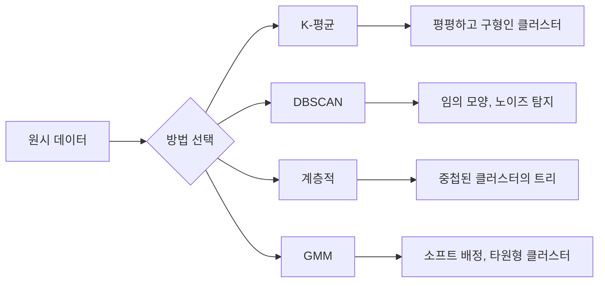

> 🇰🇷 이 문서는 한국어 번역본입니다(ELI5 스타일). 원문: [en.md](en.md)

# 비지도 학습 (Unsupervised Learning)

> 레이블도, 선생님도 없습니다. 알고리즘이 스스로 구조를 찾아냅니다.

**유형:** Build
**언어:** Python
**선수 지식:** 페이즈 1 (노름과 거리, 확률과 분포), 페이즈 2 레슨 1-6
**시간:** 약 90분

## 학습 목표

- K-평균, DBSCAN, 가우시안 혼합 모델을 직접 구현하고 클러스터링 동작을 비교합니다
- 실루엣 점수와 엘보우 방법으로 클러스터 품질을 평가하고 최적의 K를 고릅니다
- DBSCAN이 K-평균을 능가하는 경우를 설명하고, 어떤 알고리즘이 비구형 클러스터와 이상치를 다루는지 짚어 봅니다
- 클러스터링 기법을 활용해 정상 패턴에서 벗어난 점을 표시하는 이상 탐지 파이프라인을 만듭니다

## 문제 상황

지금까지의 모든 ML 레슨은 레이블이 달린 데이터를 가정했습니다. "입력이 여기 있고, 정답 출력이 저기 있다"는 식입니다. 그런데 현실에서 레이블은 비쌉니다. 병원에는 수백만 건의 환자 기록이 있지만 누구도 각 기록에 질병 카테고리를 손으로 붙이지 않았습니다. 전자상거래 사이트에는 수백만 건의 사용자 세션이 있지만 고객 세그먼트에 손으로 레이블을 붙인 사람은 없습니다. 보안 팀에는 네트워크 로그가 있지만 모든 이상 징후에 표시를 해 둔 사람은 없습니다.

비지도 학습은 무엇을 찾아야 하는지 알려 주지 않아도 패턴을 찾아냅니다. 비슷한 데이터 점들을 묶고, 숨겨진 구조를 발견하고, 이상치를 드러냅니다. 지도 학습이 정답지가 달린 교과서로 배우는 것이라면, 비지도 학습은 패턴이 저절로 드러날 때까지 원시 데이터를 들여다보는 것입니다.

단, 함정이 있습니다. 레이블이 없으면 "맞음"과 "틀림"을 직접 측정할 수 없습니다. 알고리즘이 찾아낸 구조가 의미 있는지 평가하려면 다른 도구가 필요합니다.

## 핵심 개념

### 클러스터링: 비슷한 것들을 한데 모으기

클러스터링은 각 데이터 점을 그룹(클러스터)에 배정합니다. 같은 그룹 안의 점들이 다른 그룹의 점들보다 서로 더 비슷하도록요. 늘 묻게 되는 질문은: "비슷하다"의 기준은 무엇인가?



### K-평균: 일등 공신

K-평균은 데이터를 정확히 K개의 클러스터로 나눕니다. 각 클러스터는 중심점(centroid, 질량의 중심)을 가지며, 모든 점은 가장 가까운 중심점에 속합니다.

로이드(Lloyd) 알고리즘:

1. 무작위 점 K개를 초기 중심점으로 고릅니다
2. 각 데이터 점을 가장 가까운 중심점에 배정합니다
3. 각 중심점을 배정된 점들의 평균으로 다시 계산합니다
4. 배정이 더 이상 바뀌지 않을 때까지 2-3단계를 반복합니다

목적 함수(관성, inertia)는 각 점에서 배정된 중심점까지 거리 제곱의 총합을 측정합니다. K-평균은 이 값을 최소화하지만, 국소 최솟값 하나만 찾을 뿐입니다. 초기화가 다르면 결과도 달라집니다.

### K 고르기

표준적인 방법 두 가지:

**엘보우 방법:** K = 1, 2, 3, ..., n에 대해 K-평균을 실행합니다. 관성을 K에 대해 그리고, 클러스터를 더 추가해도 관성이 유의미하게 줄지 않는 "엘보우(팔꿈치)" 지점을 찾습니다.

**실루엣 점수:** 각 점에 대해 자기 클러스터와의 유사도(a)와 가장 가까운 다른 클러스터와의 유사도(b)를 측정합니다. 실루엣 계수는 (b - a) / max(a, b)이며, -1(잘못된 클러스터)부터 +1(잘 클러스터링됨)까지의 값을 가집니다. 모든 점에 걸쳐 평균 내면 전역 점수가 됩니다.

### DBSCAN: 밀도 기반 클러스터링

K-평균은 클러스터가 구형이라고 가정하고 K를 미리 정하라고 요구합니다. DBSCAN은 어느 쪽 가정도 하지 않습니다. 희소한 지역으로 서로 떨어진 밀집 지역을 클러스터로 찾아냅니다.

파라미터 두 개:
- **eps**: 이웃(neighborhood)의 반지름
- **min_samples**: 밀집 지역을 이루는 데 필요한 최소 점 개수

세 종류의 점:
- **핵심 점(core point)**: eps 거리 안에 최소 min_samples개의 점을 가짐
- **경계 점(border point)**: 핵심 점의 eps 안에 있지만 스스로는 핵심 점이 아님
- **노이즈 점(noise point)**: 핵심도 경계도 아님. 이것들이 이상치입니다.

DBSCAN은 서로 eps 안에 있는 핵심 점들을 같은 클러스터로 연결합니다. 경계 점은 근처 핵심 점의 클러스터에 합류하고, 노이즈 점은 어느 클러스터에도 속하지 않습니다.

장점: 어떤 모양의 클러스터든 찾고, 클러스터 개수를 자동으로 정하고, 이상치를 식별합니다. 약점: 밀도가 서로 다른 클러스터들이 섞여 있으면 힘들어합니다.

### 계층적 클러스터링

중첩된 클러스터들의 트리(덴드로그램)를 만듭니다.

응집형(agglomerative, 아래에서 위로):
1. 각 점을 자기만의 클러스터로 시작합니다
2. 가장 가까운 두 클러스터를 합칩니다
3. 클러스터가 하나만 남을 때까지 반복합니다
4. 원하는 레벨에서 덴드로그램을 잘라 K개의 클러스터를 얻습니다

클러스터 사이의 "가까움"은 다음과 같이 측정할 수 있습니다:
- **단일 연결(single linkage)**: 두 클러스터의 점들 사이 최소 거리
- **완전 연결(complete linkage)**: 두 클러스터의 점들 사이 최대 거리
- **평균 연결(average linkage)**: 모든 쌍의 평균 거리
- **워드(Ward) 방법**: 클러스터 내 분산 총합이 가장 조금 늘어나는 병합

### 가우시안 혼합 모델 (GMM)

K-평균은 하드 배정을 합니다. 각 점은 정확히 하나의 클러스터에 속합니다. GMM은 소프트 배정을 합니다. 각 점은 각 클러스터에 속할 확률을 가집니다.

GMM은 데이터가 K개의 가우시안 분포 혼합으로부터 생성되었다고 가정합니다. 각 가우시안은 자기만의 평균과 공분산을 갖습니다. 기댓값 최대화(EM, Expectation-Maximization) 알고리즘은 다음을 번갈아 수행합니다:

- **E-단계**: 각 점이 각 가우시안에 속할 확률을 계산합니다
- **M-단계**: 데이터의 가능도를 최대화하도록 각 가우시안의 평균, 공분산, 혼합 가중치를 갱신합니다

GMM은 타원형 클러스터를 모델링할 수 있고(K-평균은 구형만), 겹치는 클러스터도 자연스럽게 다룹니다.

### 언제 무엇을 쓸까

| 방법 | 가장 잘 맞는 경우 | 피해야 할 경우 |
|--------|----------|------------|
| K-평균 | 큰 데이터셋, 구형 클러스터, K를 알 때 | 불규칙한 모양, 이상치 존재 |
| DBSCAN | K를 모를 때, 임의 모양, 이상치 탐지 | 밀도가 제각각일 때, 매우 높은 차원 |
| 계층적 | 작은 데이터셋, 덴드로그램 필요, K를 모를 때 | 큰 데이터셋(O(n^2) 메모리) |
| GMM | 겹치는 클러스터, 소프트 배정 필요 | 매우 큰 데이터셋, 차원이 너무 많을 때 |

### 클러스터링을 활용한 이상 탐지

클러스터링은 이상 탐지를 자연스럽게 지원합니다:
- **K-평균**: 어떤 중심점에서도 먼 점이 이상치
- **DBSCAN**: 정의상 노이즈 점이 이상치
- **GMM**: 모든 가우시안에서 확률이 낮은 점이 이상치

```figure
kmeans-step
```

## 직접 만들기

### 단계 1: K-평균 직접 구현

```python
import math
import random


def euclidean_distance(a, b):
    return math.sqrt(sum((ai - bi) ** 2 for ai, bi in zip(a, b)))


def kmeans(data, k, max_iterations=100, seed=42):
    random.seed(seed)
    n_features = len(data[0])

    centroids = random.sample(data, k)

    for iteration in range(max_iterations):
        clusters = [[] for _ in range(k)]
        assignments = []

        for point in data:
            distances = [euclidean_distance(point, c) for c in centroids]
            nearest = distances.index(min(distances))
            clusters[nearest].append(point)
            assignments.append(nearest)

        new_centroids = []
        for cluster in clusters:
            if len(cluster) == 0:
                new_centroids.append(random.choice(data))
                continue
            centroid = [
                sum(point[j] for point in cluster) / len(cluster)
                for j in range(n_features)
            ]
            new_centroids.append(centroid)

        if all(
            euclidean_distance(old, new) < 1e-6
            for old, new in zip(centroids, new_centroids)
        ):
            print(f"  Converged at iteration {iteration + 1}")
            break

        centroids = new_centroids

    return assignments, centroids
```

### 단계 2: 엘보우 방법과 실루엣 점수

```python
def compute_inertia(data, assignments, centroids):
    total = 0.0
    for point, cluster_id in zip(data, assignments):
        total += euclidean_distance(point, centroids[cluster_id]) ** 2
    return total


def silhouette_score(data, assignments):
    n = len(data)
    if n < 2:
        return 0.0

    clusters = {}
    for i, c in enumerate(assignments):
        clusters.setdefault(c, []).append(i)

    if len(clusters) < 2:
        return 0.0

    scores = []
    for i in range(n):
        own_cluster = assignments[i]
        own_members = [j for j in clusters[own_cluster] if j != i]

        if len(own_members) == 0:
            scores.append(0.0)
            continue

        a = sum(euclidean_distance(data[i], data[j]) for j in own_members) / len(own_members)

        b = float("inf")
        for cluster_id, members in clusters.items():
            if cluster_id == own_cluster:
                continue
            avg_dist = sum(euclidean_distance(data[i], data[j]) for j in members) / len(members)
            b = min(b, avg_dist)

        if max(a, b) == 0:
            scores.append(0.0)
        else:
            scores.append((b - a) / max(a, b))

    return sum(scores) / len(scores)


def find_best_k(data, max_k=10):
    print("Elbow method:")
    inertias = []
    for k in range(1, max_k + 1):
        assignments, centroids = kmeans(data, k)
        inertia = compute_inertia(data, assignments, centroids)
        inertias.append(inertia)
        print(f"  K={k}: inertia={inertia:.2f}")

    print("\nSilhouette scores:")
    for k in range(2, max_k + 1):
        assignments, centroids = kmeans(data, k)
        score = silhouette_score(data, assignments)
        print(f"  K={k}: silhouette={score:.4f}")

    return inertias
```

### 단계 3: DBSCAN 직접 구현

```python
def dbscan(data, eps, min_samples):
    n = len(data)
    labels = [-1] * n
    cluster_id = 0

    def region_query(point_idx):
        neighbors = []
        for i in range(n):
            if euclidean_distance(data[point_idx], data[i]) <= eps:
                neighbors.append(i)
        return neighbors

    visited = [False] * n

    for i in range(n):
        if visited[i]:
            continue
        visited[i] = True

        neighbors = region_query(i)

        if len(neighbors) < min_samples:
            labels[i] = -1
            continue

        labels[i] = cluster_id
        seed_set = list(neighbors)
        seed_set.remove(i)

        j = 0
        while j < len(seed_set):
            q = seed_set[j]

            if not visited[q]:
                visited[q] = True
                q_neighbors = region_query(q)
                if len(q_neighbors) >= min_samples:
                    for nb in q_neighbors:
                        if nb not in seed_set:
                            seed_set.append(nb)

            if labels[q] == -1:
                labels[q] = cluster_id

            j += 1

        cluster_id += 1

    return labels
```

### 단계 4: 가우시안 혼합 모델 (EM 알고리즘)

```python
def gmm(data, k, max_iterations=100, seed=42):
    random.seed(seed)
    n = len(data)
    d = len(data[0])

    indices = random.sample(range(n), k)
    means = [list(data[i]) for i in indices]
    variances = [1.0] * k
    weights = [1.0 / k] * k

    def gaussian_pdf(x, mean, variance):
        d = len(x)
        coeff = 1.0 / ((2 * math.pi * variance) ** (d / 2))
        exponent = -sum((xi - mi) ** 2 for xi, mi in zip(x, mean)) / (2 * variance)
        return coeff * math.exp(max(exponent, -500))

    for iteration in range(max_iterations):
        responsibilities = []
        for i in range(n):
            probs = []
            for j in range(k):
                probs.append(weights[j] * gaussian_pdf(data[i], means[j], variances[j]))
            total = sum(probs)
            if total == 0:
                total = 1e-300
            responsibilities.append([p / total for p in probs])

        old_means = [list(m) for m in means]

        for j in range(k):
            r_sum = sum(responsibilities[i][j] for i in range(n))
            if r_sum < 1e-10:
                continue

            weights[j] = r_sum / n

            for dim in range(d):
                means[j][dim] = sum(
                    responsibilities[i][j] * data[i][dim] for i in range(n)
                ) / r_sum

            variances[j] = sum(
                responsibilities[i][j]
                * sum((data[i][dim] - means[j][dim]) ** 2 for dim in range(d))
                for i in range(n)
            ) / (r_sum * d)
            variances[j] = max(variances[j], 1e-6)

        shift = sum(
            euclidean_distance(old_means[j], means[j]) for j in range(k)
        )
        if shift < 1e-6:
            print(f"  GMM converged at iteration {iteration + 1}")
            break

    assignments = []
    for i in range(n):
        assignments.append(responsibilities[i].index(max(responsibilities[i])))

    return assignments, means, weights, responsibilities
```

### 단계 5: 테스트 데이터 생성과 전체 실행

```python
def make_blobs(centers, n_per_cluster=50, spread=0.5, seed=42):
    random.seed(seed)
    data = []
    true_labels = []
    for label, (cx, cy) in enumerate(centers):
        for _ in range(n_per_cluster):
            x = cx + random.gauss(0, spread)
            y = cy + random.gauss(0, spread)
            data.append([x, y])
            true_labels.append(label)
    return data, true_labels


def make_moons(n_samples=200, noise=0.1, seed=42):
    random.seed(seed)
    data = []
    labels = []
    n_half = n_samples // 2
    for i in range(n_half):
        angle = math.pi * i / n_half
        x = math.cos(angle) + random.gauss(0, noise)
        y = math.sin(angle) + random.gauss(0, noise)
        data.append([x, y])
        labels.append(0)
    for i in range(n_half):
        angle = math.pi * i / n_half
        x = 1 - math.cos(angle) + random.gauss(0, noise)
        y = 1 - math.sin(angle) - 0.5 + random.gauss(0, noise)
        data.append([x, y])
        labels.append(1)
    return data, labels


if __name__ == "__main__":
    centers = [[2, 2], [8, 3], [5, 8]]
    data, true_labels = make_blobs(centers, n_per_cluster=50, spread=0.8)

    print("=== K-Means on 3 blobs ===")
    assignments, centroids = kmeans(data, k=3)
    print(f"  Centroids: {[[round(c, 2) for c in cent] for cent in centroids]}")
    sil = silhouette_score(data, assignments)
    print(f"  Silhouette score: {sil:.4f}")

    print("\n=== Elbow Method ===")
    find_best_k(data, max_k=6)

    print("\n=== DBSCAN on 3 blobs ===")
    db_labels = dbscan(data, eps=1.5, min_samples=5)
    n_clusters = len(set(db_labels) - {-1})
    n_noise = db_labels.count(-1)
    print(f"  Found {n_clusters} clusters, {n_noise} noise points")

    print("\n=== GMM on 3 blobs ===")
    gmm_assignments, gmm_means, gmm_weights, _ = gmm(data, k=3)
    print(f"  Means: {[[round(m, 2) for m in mean] for mean in gmm_means]}")
    print(f"  Weights: {[round(w, 3) for w in gmm_weights]}")
    gmm_sil = silhouette_score(data, gmm_assignments)
    print(f"  Silhouette score: {gmm_sil:.4f}")

    print("\n=== DBSCAN on moons (non-spherical clusters) ===")
    moon_data, moon_labels = make_moons(n_samples=200, noise=0.1)
    moon_db = dbscan(moon_data, eps=0.3, min_samples=5)
    n_moon_clusters = len(set(moon_db) - {-1})
    n_moon_noise = moon_db.count(-1)
    print(f"  Found {n_moon_clusters} clusters, {n_moon_noise} noise points")

    print("\n=== K-Means on moons (will fail to separate) ===")
    moon_km, moon_centroids = kmeans(moon_data, k=2)
    moon_sil = silhouette_score(moon_data, moon_km)
    print(f"  Silhouette score: {moon_sil:.4f}")
    print("  K-Means splits moons poorly because they are not spherical")

    print("\n=== Anomaly detection with DBSCAN ===")
    anomaly_data = list(data)
    anomaly_data.append([20.0, 20.0])
    anomaly_data.append([-5.0, -5.0])
    anomaly_data.append([15.0, 0.0])
    anomaly_labels = dbscan(anomaly_data, eps=1.5, min_samples=5)
    anomalies = [
        anomaly_data[i]
        for i in range(len(anomaly_labels))
        if anomaly_labels[i] == -1
    ]
    print(f"  Detected {len(anomalies)} anomalies")
    for a in anomalies[-3:]:
        print(f"    Point {[round(v, 2) for v in a]}")
```

## 실전에서 쓰기

scikit-learn에서는 같은 알고리즘들이 한 줄짜리 코드입니다:

```python
from sklearn.cluster import KMeans, DBSCAN, AgglomerativeClustering
from sklearn.mixture import GaussianMixture
from sklearn.metrics import silhouette_score as sklearn_silhouette

km = KMeans(n_clusters=3, random_state=42).fit(data)
db = DBSCAN(eps=1.5, min_samples=5).fit(data)
agg = AgglomerativeClustering(n_clusters=3).fit(data)
gmm_model = GaussianMixture(n_components=3, random_state=42).fit(data)
```

직접 구현한 버전은 이 라이브러리들이 정확히 무엇을 계산하는지 보여 줍니다. K-평균은 배정과 재계산을 반복하고, DBSCAN은 밀집 시드에서 클러스터를 키우고, GMM은 기댓값과 최대화를 번갈아 수행합니다. 라이브러리 버전은 여기에 수치 안정성, 더 똑똑한 초기화(K-Means++), GPU 가속을 더하지만, 핵심 로직은 같습니다.

## 출시하기

이 레슨은 K-평균, DBSCAN, GMM의 동작하는 직접 구현체를 산출합니다. 클러스터링 코드는 더 고급 비지도 학습 방법의 기초로 재사용할 수 있습니다.

## 연습 문제

1. K-Means++ 초기화를 구현합니다. 무작위로 중심점을 고르는 대신, 첫 번째는 무작위로 고르고 이후의 각 중심점은 기존 가장 가까운 중심점까지 거리 제곱에 비례하는 확률로 고릅니다. 무작위 초기화와 수렴 속도를 비교합니다.
2. 계층적 응집형 클러스터링을 코드에 추가합니다. 워드 연결법(Ward's linkage)을 구현하고 덴드로그램(병합 순서의 중첩 리스트)을 만듭니다. 서로 다른 레벨에서 잘라 K-평균 결과와 비교합니다.
3. 간단한 이상 탐지 파이프라인을 만듭니다. 같은 데이터에 DBSCAN과 GMM을 실행하고, 두 방법이 모두 이상치라고 동의하는 점(DBSCAN의 노이즈, GMM의 저확률)을 표시합니다. 겹침 정도를 측정하고 두 방법이 어긋나는 경우를 논의합니다.

## 핵심 용어

| 용어 | 사람들이 말하는 표현 | 실제 의미 |
|------|----------------|----------------------|
| 클러스터링 | "비슷한 것 묶기" | 그룹 내 유사도가 그룹 간 유사도를 넘도록 데이터를 부분집합으로 나누는 것. 구체적 거리 지표로 측정 |
| 중심점(centroid) | "클러스터의 중심" | 클러스터에 배정된 모든 점의 평균. K-평균이 클러스터 대표로 사용 |
| 관성(inertia) | "클러스터가 얼마나 다닥다닥한가" | 각 점에서 배정된 중심점까지 거리 제곱의 합. 낮을수록 더 다닥다닥함 |
| 실루엣 점수 | "클러스터가 얼마나 잘 갈라져 있는가" | 각 점에 대해 (b - a) / max(a, b). a는 클러스터 내 평균 거리, b는 가장 가까운 다른 클러스터의 평균 거리 |
| 핵심 점(core point) | "밀집 지역의 점" | DBSCAN에서 eps 거리 안에 최소 min_samples개의 이웃을 가진 점 |
| EM 알고리즘 | "소프트 K-평균" | 기댓값 최대화: 소속 확률을 계산하고(E-단계) 분포 파라미터를 갱신하는(M-단계) 작업을 반복 |
| 덴드로그램 | "클러스터의 트리" | 계층적 클러스터링에서 클러스터가 병합된 순서와 거리를 보여주는 트리 다이어그램 |
| 이상(anomaly) | "이상치(outlier)" | 기대 패턴에 맞지 않는 데이터 점. DBSCAN에서는 노이즈로, GMM에서는 저확률로 식별 |

## 더 읽을거리

- [Stanford CS229 - Unsupervised Learning](https://cs229.stanford.edu/notes2022fall/main_notes.pdf) - Andrew Ng의 클러스터링과 EM 강의 노트
- [scikit-learn Clustering Guide](https://scikit-learn.org/stable/modules/clustering.html) - 모든 클러스터링 알고리즘의 실전 비교와 시각 예제
- [DBSCAN original paper (Ester et al., 1996)](https://www.aaai.org/Papers/KDD/1996/KDD96-037.pdf) - 밀도 기반 클러스터링을 소개한 논문
