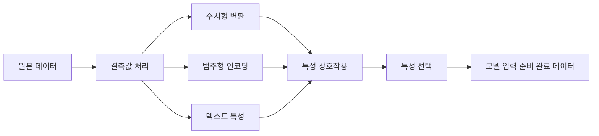

> 🇰🇷 이 문서는 한국어 번역본입니다(ELI5 스타일). 원문: [en.md](en.md)

# 특성 엔지니어링과 특성 선택

> 좋은 특성(feature) 하나는 천 개의 데이터 포인트만 하다.

**유형:** Build
**언어:** Python
**선수 지식:** 페이즈 1 (ML을 위한 통계학, 선형대수학), 페이즈 2 레슨 1-7
**소요 시간:** ~90분

## 학습 목표

- 수치형 변환(표준화, 최소-최대 스케일링, 로그 변환, 구간화)을 직접 구현하고, 각각이 언제 적합한지 설명할 수 있다
- 범주형 특성을 위한 원-핫 인코딩, 레이블 인코딩, 타깃 인코딩을 만들어 보고, 타깃 인코딩에 숨어 있는 데이터 누수(data leakage) 위험을 짚어낼 수 있다
- TF-IDF 벡터라이저를 처음부터 직접 만들고, 텍스트 분류에서 왜 단순 단어 개수 세기보다 나은지 설명할 수 있다
- 필터 기반 특성 선택(분산 임계값, 상관계수, 상호 정보량)을 적용해 차원을 줄일 수 있다

## 문제 상황

데이터셋이 하나 있습니다. 알고리즘을 고릅니다. 학습시킵니다. 결과는 그저 그렇습니다. 더 화려한 알고리즘을 시도합니다. 여전히 그저 그렇습니다. 일주일 내내 하이퍼파라미터를 조정해 봅니다. 겨우 조금 나아졌을 뿐입니다.

그런데 누군가 원본 데이터를 더 좋은 특성으로 바꿔 주었더니, 단순한 로지스틱 회귀가 여러분이 정성껏 튜닝한 그래디언트 부스팅 앙상블을 이겨 버립니다.

이런 일은 정말 자주 벌어집니다. 전통적인 ML에서는 어떤 알고리즘을 고르느냐보다 데이터를 어떻게 표현하느냐가 더 중요합니다. "집 크기(제곱피트)"와 "방 개수"를 특성으로 쓴 집값 모델은, "주소를 문자열 그대로" 넣은 모델을 무슨 수를 써도 이깁니다. 학습기가 아무리 정교해도, 알고리즘은 여러분이 준 재료로만 일할 수 있기 때문입니다.

특성 엔지니어링(feature engineering)은 원본 데이터를, 모델이 패턴을 찾기 쉬운 표현으로 바꾸는 과정입니다. 특성 선택(feature selection)은 신호는 더해주지 않으면서 잡음만 더하는 특성을 던져 버리는 과정이고요. 이 둘을 합치면 전통적인 ML에서 가장 효과가 큰 작업이 됩니다.

## 개념

### 특성 파이프라인



### 수치형 특성

원본 숫자는 모델에 바로 쓸 수 있게 준비된 경우가 드뭅니다. 흔히 쓰는 변환들입니다:

**스케일링:** 특성들을 같은 범위로 맞춰서, 거리 기반 알고리즘(K-평균, KNN, SVM)이 모든 특성을 똑같이 대우하게 만듭니다. 최소-최대 스케일링은 [0, 1] 범위로 매핑하고, 표준화(z-score)는 평균=0, 표준편차=1로 매핑합니다.

**로그 변환:** 오른쪽으로 치우친 분포(소득, 인구, 단어 개수)를 눌러 압축합니다. 곱셈 관계를 덧셈 관계로 바꿔 줍니다.

**구간화(binning):** 연속적인 값을 카테고리로 바꿉니다. 특성과 타깃 사이의 관계가 비선형이지만 계단식일 때(예: 연령대) 유용합니다.

**다항 특성:** x^2, x^3, x1*x2 같은 항을 만듭니다. 특성 수가 늘어나는 대가를 치르면서 선형 모델이 비선형 관계를 잡아낼 수 있게 해 줍니다.

### 범주형 특성

모델은 숫자를 필요로 합니다. 카테고리는 인코딩이 필요합니다.

**원-핫 인코딩:** 카테고리마다 이진(binary) 컬럼을 하나씩 만듭니다. "color = red/blue/green"은 is_red, is_blue, is_green 세 컬럼이 됩니다. 카디널리티(고유 값 개수)가 낮은 특성에는 잘 맞지만, 카테고리가 많아지면 컬럼이 폭발적으로 늘어납니다.

**레이블 인코딩:** 카테고리마다 정수를 매핑합니다: red=0, blue=1, green=2. 거짓 순서가 생긴다는 게 함정입니다(모델이 green > blue > red라고 오해할 수 있죠). 개별 값 기준으로 분기하는 트리 기반 모델에만 적합합니다.

**타깃 인코딩:** 카테고리마다, 그 카테고리의 타깃 변수 평균으로 값을 바꿔 버립니다. 강력하지만 위험합니다. 데이터 누수 위험이 높기 때문입니다. 반드시 학습 데이터에서만 계산하고, 테스트 데이터에는 그 결과를 적용해야 합니다.

### 텍스트 특성

**카운트 벡터라이저:** 문서에 각 단어가 몇 번 나오는지 셉니다. "the cat sat on the mat"은 {the: 2, cat: 1, sat: 1, on: 1, mat: 1}이 됩니다.

**TF-IDF:** 단어 빈도-역문서 빈도(Term Frequency-Inverse Document Frequency). 문서들 사이에서 얼마나 희귀한 단어인지에 따라 가중치를 줍니다. "the" 같은 흔한 단어는 가중치가 낮아지고, 드물지만 특징적인 단어는 가중치가 높아집니다.

```
TF(word, doc) = count(word in doc) / total words in doc
IDF(word) = log(total docs / docs containing word)
TF-IDF = TF * IDF
```

### 결측값

실제 데이터에는 구멍이 뚫려 있습니다. 대처 전략들입니다:

- **행 삭제:** 결측 데이터가 드물고 무작위로 발생할 때만 사용
- **평균/중앙값 대체(imputation):** 단순하고 분포의 모양을 유지합니다(중앙값이 이상치에 더 강건합니다)
- **최빈값 대체:** 범주형 특성에 사용
- **지시자 컬럼:** 대체하기 전에 "was_this_missing" 같은 이진 컬럼을 하나 추가합니다. 데이터가 비어 있다는 사실 자체가 유용한 정보일 수 있습니다
- **앞/뒤 방향 채우기:** 시계열 데이터에 사용

### 특성 상호작용

가끔 관계는 조합 안에 숨어 있습니다. "키"와 "몸무게"를 따로 두는 것보다 "BMI = 몸무게 / 키^2"가 훨씬 예측력이 좋습니다. 특성 상호작용은 특성 공간을 곱셈으로 늘리기 때문에, 도메인 지식을 동원해 올바른 조합을 골라야 합니다.

### 특성 선택

특성이 많다고 무조건 좋은 게 아닙니다. 무관한 특성은 잡음을 더하고, 학습 시간을 늘리고, 과적합을 일으킬 수 있습니다.

**필터 방식(모델 학습 전):**
- 상관계수: 서로 상관이 매우 높은 특성(중복)은 제거
- 상호 정보량(mutual information): 어떤 특성을 알게 되었을 때 타깃에 대한 불확실성이 얼마나 줄어드는지 측정
- 분산 임계값: 거의 변하지 않는 특성은 제거

**래퍼 방식(모델 기반):**
- L1 정규화(라쏘): 쓸모없는 특성의 가중치를 정확히 0으로 몰아넣음
- 재귀적 특성 제거: 학습하고, 가장 덜 중요한 특성을 빼고, 반복

**선택이 중요한 이유:** 좋은 특성 10개만 쓴 모델은 보통, 좋은 특성 10개에 잡음 섞인 특성 90개를 더 쓴 모델보다 성능이 좋습니다. 잡음 특성들은 학습 데이터에만 맞는 패턴을 과적합할 기회를 모델에 계속 주기 때문입니다.

```figure
feature-scaling
```

## 직접 만들기

### 단계 1: 처음부터 만드는 수치형 변환

```python
import math


def min_max_scale(values):
    min_val = min(values)
    max_val = max(values)
    if max_val == min_val:
        return [0.0] * len(values)
    return [(v - min_val) / (max_val - min_val) for v in values]


def standardize(values):
    n = len(values)
    mean = sum(values) / n
    variance = sum((v - mean) ** 2 for v in values) / n
    std = math.sqrt(variance) if variance > 0 else 1.0
    return [(v - mean) / std for v in values]


def log_transform(values):
    return [math.log(v + 1) for v in values]


def bin_values(values, n_bins=5):
    min_val = min(values)
    max_val = max(values)
    bin_width = (max_val - min_val) / n_bins
    if bin_width == 0:
        return [0] * len(values)
    result = []
    for v in values:
        bin_idx = int((v - min_val) / bin_width)
        bin_idx = min(bin_idx, n_bins - 1)
        result.append(bin_idx)
    return result


def polynomial_features(row, degree=2):
    n = len(row)
    result = list(row)
    if degree >= 2:
        for i in range(n):
            result.append(row[i] ** 2)
        for i in range(n):
            for j in range(i + 1, n):
                result.append(row[i] * row[j])
    return result
```

### 단계 2: 처음부터 만드는 범주형 인코딩

```python
def one_hot_encode(values):
    categories = sorted(set(values))
    cat_to_idx = {cat: i for i, cat in enumerate(categories)}
    n_cats = len(categories)

    encoded = []
    for v in values:
        row = [0] * n_cats
        row[cat_to_idx[v]] = 1
        encoded.append(row)

    return encoded, categories


def label_encode(values):
    categories = sorted(set(values))
    cat_to_int = {cat: i for i, cat in enumerate(categories)}
    return [cat_to_int[v] for v in values], cat_to_int


def target_encode(feature_values, target_values, smoothing=10):
    global_mean = sum(target_values) / len(target_values)

    category_stats = {}
    for feat, target in zip(feature_values, target_values):
        if feat not in category_stats:
            category_stats[feat] = {"sum": 0.0, "count": 0}
        category_stats[feat]["sum"] += target
        category_stats[feat]["count"] += 1

    encoding = {}
    for cat, stats in category_stats.items():
        cat_mean = stats["sum"] / stats["count"]
        weight = stats["count"] / (stats["count"] + smoothing)
        encoding[cat] = weight * cat_mean + (1 - weight) * global_mean

    return [encoding[v] for v in feature_values], encoding
```

### 단계 3: 처음부터 만드는 텍스트 특성

```python
def count_vectorize(documents):
    vocab = {}
    idx = 0
    for doc in documents:
        for word in doc.lower().split():
            if word not in vocab:
                vocab[word] = idx
                idx += 1

    vectors = []
    for doc in documents:
        vec = [0] * len(vocab)
        for word in doc.lower().split():
            vec[vocab[word]] += 1
        vectors.append(vec)

    return vectors, vocab


def tfidf(documents):
    n_docs = len(documents)

    vocab = {}
    idx = 0
    for doc in documents:
        for word in doc.lower().split():
            if word not in vocab:
                vocab[word] = idx
                idx += 1

    doc_freq = {}
    for doc in documents:
        seen = set()
        for word in doc.lower().split():
            if word not in seen:
                doc_freq[word] = doc_freq.get(word, 0) + 1
                seen.add(word)

    vectors = []
    for doc in documents:
        words = doc.lower().split()
        word_count = len(words)
        tf_map = {}
        for word in words:
            tf_map[word] = tf_map.get(word, 0) + 1

        vec = [0.0] * len(vocab)
        for word, count in tf_map.items():
            tf = count / word_count
            idf = math.log(n_docs / doc_freq[word])
            vec[vocab[word]] = tf * idf
        vectors.append(vec)

    return vectors, vocab
```

### 단계 4: 처음부터 만드는 결측값 대체

```python
def impute_mean(values):
    present = [v for v in values if v is not None]
    if not present:
        return [0.0] * len(values), 0.0
    mean = sum(present) / len(present)
    return [v if v is not None else mean for v in values], mean


def impute_median(values):
    present = sorted(v for v in values if v is not None)
    if not present:
        return [0.0] * len(values), 0.0
    n = len(present)
    if n % 2 == 0:
        median = (present[n // 2 - 1] + present[n // 2]) / 2
    else:
        median = present[n // 2]
    return [v if v is not None else median for v in values], median


def impute_mode(values):
    present = [v for v in values if v is not None]
    if not present:
        return values, None
    counts = {}
    for v in present:
        counts[v] = counts.get(v, 0) + 1
    mode = max(counts, key=counts.get)
    return [v if v is not None else mode for v in values], mode


def add_missing_indicator(values):
    return [0 if v is not None else 1 for v in values]
```

### 단계 5: 처음부터 만드는 특성 선택

```python
def correlation(x, y):
    n = len(x)
    mean_x = sum(x) / n
    mean_y = sum(y) / n
    cov = sum((xi - mean_x) * (yi - mean_y) for xi, yi in zip(x, y)) / n
    std_x = math.sqrt(sum((xi - mean_x) ** 2 for xi in x) / n)
    std_y = math.sqrt(sum((yi - mean_y) ** 2 for yi in y) / n)
    if std_x == 0 or std_y == 0:
        return 0.0
    return cov / (std_x * std_y)


def mutual_information(feature, target, n_bins=10):
    feat_min = min(feature)
    feat_max = max(feature)
    bin_width = (feat_max - feat_min) / n_bins if feat_max != feat_min else 1.0
    feat_binned = [
        min(int((f - feat_min) / bin_width), n_bins - 1) for f in feature
    ]

    n = len(feature)
    target_classes = sorted(set(target))

    feat_bins = sorted(set(feat_binned))
    p_feat = {}
    for b in feat_bins:
        p_feat[b] = feat_binned.count(b) / n

    p_target = {}
    for t in target_classes:
        p_target[t] = target.count(t) / n

    mi = 0.0
    for b in feat_bins:
        for t in target_classes:
            joint_count = sum(
                1 for fb, tv in zip(feat_binned, target) if fb == b and tv == t
            )
            p_joint = joint_count / n
            if p_joint > 0:
                mi += p_joint * math.log(p_joint / (p_feat[b] * p_target[t]))

    return mi


def variance_threshold(features, threshold=0.01):
    n_features = len(features[0])
    n_samples = len(features)
    selected = []

    for j in range(n_features):
        col = [features[i][j] for i in range(n_samples)]
        mean = sum(col) / n_samples
        var = sum((v - mean) ** 2 for v in col) / n_samples
        if var >= threshold:
            selected.append(j)

    return selected


def remove_correlated(features, threshold=0.9):
    n_features = len(features[0])
    n_samples = len(features)

    to_remove = set()
    for i in range(n_features):
        if i in to_remove:
            continue
        col_i = [features[r][i] for r in range(n_samples)]
        for j in range(i + 1, n_features):
            if j in to_remove:
                continue
            col_j = [features[r][j] for r in range(n_samples)]
            corr = abs(correlation(col_i, col_j))
            if corr >= threshold:
                to_remove.add(j)

    return [i for i in range(n_features) if i not in to_remove]
```

### 단계 6: 전체 파이프라인과 데모

```python
import random


def make_housing_data(n=200, seed=42):
    random.seed(seed)
    data = []
    for _ in range(n):
        sqft = random.uniform(500, 5000)
        bedrooms = random.choice([1, 2, 3, 4, 5])
        age = random.uniform(0, 50)
        neighborhood = random.choice(["downtown", "suburbs", "rural"])
        has_pool = random.choice([True, False])

        sqft_with_missing = sqft if random.random() > 0.05 else None
        age_with_missing = age if random.random() > 0.08 else None

        price = (
            50 * sqft
            + 20000 * bedrooms
            - 1000 * age
            + (50000 if neighborhood == "downtown" else 10000 if neighborhood == "suburbs" else 0)
            + (15000 if has_pool else 0)
            + random.gauss(0, 20000)
        )

        data.append({
            "sqft": sqft_with_missing,
            "bedrooms": bedrooms,
            "age": age_with_missing,
            "neighborhood": neighborhood,
            "has_pool": has_pool,
            "price": price,
        })
    return data


if __name__ == "__main__":
    data = make_housing_data(200)

    print("=== Raw Data Sample ===")
    for row in data[:3]:
        print(f"  {row}")

    sqft_raw = [d["sqft"] for d in data]
    age_raw = [d["age"] for d in data]
    prices = [d["price"] for d in data]

    print("\n=== Missing Value Handling ===")
    sqft_missing = sum(1 for v in sqft_raw if v is None)
    age_missing = sum(1 for v in age_raw if v is None)
    print(f"  sqft missing: {sqft_missing}/{len(sqft_raw)}")
    print(f"  age missing: {age_missing}/{len(age_raw)}")

    sqft_indicator = add_missing_indicator(sqft_raw)
    age_indicator = add_missing_indicator(age_raw)
    sqft_imputed, sqft_fill = impute_median(sqft_raw)
    age_imputed, age_fill = impute_mean(age_raw)
    print(f"  sqft filled with median: {sqft_fill:.0f}")
    print(f"  age filled with mean: {age_fill:.1f}")

    print("\n=== Numerical Transforms ===")
    sqft_scaled = standardize(sqft_imputed)
    age_scaled = min_max_scale(age_imputed)
    sqft_log = log_transform(sqft_imputed)
    age_binned = bin_values(age_imputed, n_bins=5)
    print(f"  sqft standardized: mean={sum(sqft_scaled)/len(sqft_scaled):.4f}, std={math.sqrt(sum(v**2 for v in sqft_scaled)/len(sqft_scaled)):.4f}")
    print(f"  age min-max: [{min(age_scaled):.2f}, {max(age_scaled):.2f}]")
    print(f"  age bins: {sorted(set(age_binned))}")

    print("\n=== Categorical Encoding ===")
    neighborhoods = [d["neighborhood"] for d in data]

    ohe, ohe_cats = one_hot_encode(neighborhoods)
    print(f"  One-hot categories: {ohe_cats}")
    print(f"  Sample encoding: {neighborhoods[0]} -> {ohe[0]}")

    le, le_map = label_encode(neighborhoods)
    print(f"  Label encoding map: {le_map}")

    te, te_map = target_encode(neighborhoods, prices, smoothing=10)
    print(f"  Target encoding: {({k: round(v) for k, v in te_map.items()})}")

    print("\n=== Text Features ===")
    descriptions = [
        "large modern house with pool",
        "small cozy cottage near downtown",
        "spacious family home with large yard",
        "modern apartment downtown with view",
        "rustic cabin in rural area",
    ]
    cv, cv_vocab = count_vectorize(descriptions)
    print(f"  Vocabulary size: {len(cv_vocab)}")
    print(f"  Doc 0 non-zero features: {sum(1 for v in cv[0] if v > 0)}")

    tf, tf_vocab = tfidf(descriptions)
    print(f"  TF-IDF vocabulary size: {len(tf_vocab)}")
    top_words = sorted(tf_vocab.keys(), key=lambda w: tf[0][tf_vocab[w]], reverse=True)[:3]
    print(f"  Doc 0 top TF-IDF words: {top_words}")

    print("\n=== Polynomial Features ===")
    sample_row = [sqft_scaled[0], age_scaled[0]]
    poly = polynomial_features(sample_row, degree=2)
    print(f"  Input: {[round(v, 4) for v in sample_row]}")
    print(f"  Polynomial: {[round(v, 4) for v in poly]}")
    print(f"  Features: [x1, x2, x1^2, x2^2, x1*x2]")

    print("\n=== Feature Selection ===")
    feature_matrix = [
        [sqft_scaled[i], age_scaled[i], float(sqft_indicator[i]), float(age_indicator[i])]
        + ohe[i]
        for i in range(len(data))
    ]

    print(f"  Total features: {len(feature_matrix[0])}")

    surviving_var = variance_threshold(feature_matrix, threshold=0.01)
    print(f"  After variance threshold (0.01): {len(surviving_var)} features kept")

    surviving_corr = remove_correlated(feature_matrix, threshold=0.9)
    print(f"  After correlation filter (0.9): {len(surviving_corr)} features kept")

    binary_prices = [1 if p > sum(prices) / len(prices) else 0 for p in prices]
    print("\n  Mutual information with target:")
    feature_names = ["sqft", "age", "sqft_missing", "age_missing"] + [f"neigh_{c}" for c in ohe_cats]
    for j in range(len(feature_matrix[0])):
        col = [feature_matrix[i][j] for i in range(len(feature_matrix))]
        mi = mutual_information(col, binary_prices, n_bins=10)
        print(f"    {feature_names[j]}: MI={mi:.4f}")

    print("\n  Correlation with price:")
    for j in range(len(feature_matrix[0])):
        col = [feature_matrix[i][j] for i in range(len(feature_matrix))]
        corr = correlation(col, prices)
        print(f"    {feature_names[j]}: r={corr:.4f}")
```

## 실전에서 쓰기

scikit-learn을 쓰면 이런 변환들을 조립형 파이프라인으로 묶을 수 있습니다:

```python
from sklearn.preprocessing import StandardScaler, OneHotEncoder, PolynomialFeatures
from sklearn.impute import SimpleImputer
from sklearn.feature_extraction.text import TfidfVectorizer
from sklearn.feature_selection import mutual_info_classif, VarianceThreshold
from sklearn.compose import ColumnTransformer
from sklearn.pipeline import Pipeline

numeric_pipe = Pipeline([
    ("imputer", SimpleImputer(strategy="median")),
    ("scaler", StandardScaler()),
])

categorical_pipe = Pipeline([
    ("encoder", OneHotEncoder(sparse_output=False)),
])

preprocessor = ColumnTransformer([
    ("num", numeric_pipe, ["sqft", "age"]),
    ("cat", categorical_pipe, ["neighborhood"]),
])
```

직접 만든 버전은 각 변환 안에서 정확히 무슨 일이 일어나는지 보여 줍니다. 라이브러리 버전은 경계 상황 처리, 희소 행렬(sparse matrix) 지원, 파이프라인 조립 같은 기능을 더해 주지만, 수학은 똑같습니다.

## 출시하기

이 레슨이 만드는 산출물:
- `outputs/prompt-feature-engineer.md` - 원본 데이터에서 체계적으로 특성을 뽑아내기 위한 프롬프트

## 연습 문제

1. 수치형 변환에 강건 스케일링(robust scaling, 평균과 표준편차 대신 중앙값과 사분위 범위 사용)을 추가하세요. 극단적인 이상치가 있는 데이터에서 표준 스케일링과 비교해 보세요.
2. Leave-one-out 타깃 인코딩을 구현해 보세요. 각 행마다 그 행 자신의 타깃 값을 제외한 나머지로 타깃 평균을 계산하는 방식입니다. 순진한 타깃 인코딩과 비교해 이 방법이 과적합을 어떻게 줄여 주는지 확인해 보세요.
3. 분산 임계값, 상관계수 필터, 상호 정보량 랭킹을 결합한 자동화된 특성 선택 파이프라인을 만들어 보세요. 주택 데이터셋에 적용하고, 전체 특성을 쓴 모델과 선택된 특성만 쓴 모델의 성능을 (간단한 선형 회귀로) 비교해 보세요.

## 핵심 용어

| 용어 | 흔히 하는 말 | 실제 의미 |
|------|----------------|----------------------|
| 특성 엔지니어링 | "새 컬럼 만들기" | 원본 데이터를 모델에 패턴이 드러나는 표현으로 바꾸는 것 |
| 표준화 | "정규분포처럼 만들기" | 평균을 빼고 표준편차로 나눠서 특성이 평균=0, 표준편차=1을 갖게 만드는 것 |
| 원-핫 인코딩 | "더미 변수 만들기" | 카테고리마다 이진 컬럼을 하나씩 만들어서, 각 행에서 정확히 한 컬럼만 1이 되게 하는 것 |
| 타깃 인코딩 | "정답을 갖고 인코딩하기" | 카테고리마다 그 카테고리의 평균 타깃 값으로 바꾸는 것. 과적합을 막으려면 스무딩을 적용 |
| TF-IDF | "고급 단어 개수 세기" | 단어 빈도 × 역문서 빈도. 전체 코퍼스에서 그 단어가 얼마나 특징적인지에 따라 가중치를 부여 |
| 대체(imputation) | "빈칸 채우기" | 결측값을 추정한 값(평균, 중앙값, 최빈값, 또는 모델이 예측한 값)으로 바꾸는 것 |
| 특성 선택 | "나쁜 컬럼 버리기" | 잡음이나 중복만 더하는 특성을 제거하고, 타깃에 대한 신호가 있는 특성만 남기는 것 |
| 상호 정보량 | "한 가지를 알면 다른 한 가지에 대해 얼마나 알 수 있나" | 변수 X를 관찰해서 얻는, 변수 Y에 대한 불확실성 감소분을 측정한 값 |
| 데이터 누수 | "무심코 부정행위 하기" | 예측 시점에는 알 수 없는 정보를 학습 중에 사용해서, 지나치게 낙관적인(그리고 거짓된) 결과를 내는 것 |

## 더 읽을거리

- [Feature Engineering and Selection (Max Kuhn & Kjell Johnson)](http://www.feat.engineering/) - 특성 엔지니어링의 전체 풍경을 다루는 무료 온라인 책
- [scikit-learn Preprocessing Guide](https://scikit-learn.org/stable/modules/preprocessing.html) - 표준 변환 전반에 대한 실용적인 레퍼런스
- [Target Encoding Done Right (Micci-Barreca, 2001)](https://dl.acm.org/doi/10.1145/507533.507538) - 스무딩을 적용한 타깃 인코딩에 관한 원조 논문
