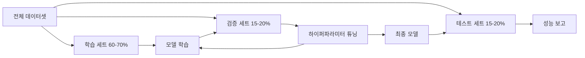

> 🇰🇷 이 문서는 한국어 번역본입니다(ELI5 스타일). 원문: [en.md](en.md)

# 모델 평가

> 모델은 그 모델을 재는 잣대만큼만 좋다.

**유형:** Build
**언어:** Python
**선수 지식:** 페이즈 1 (확률과 분포, ML을 위한 통계학), 페이즈 2 레슨 1-8
**소요 시간:** ~90분

## 학습 목표

- K-폴드 및 층화 K-폴드 교차 검증을 처음부터 직접 구현하고, 비대칭(불균형) 데이터에서 왜 층화가 중요한지 설명할 수 있다
- 정밀도(precision), 재현율(recall), F1, AUC-ROC, 그리고 회귀 지표(MSE, RMSE, MAE, R-제곱)를 처음부터 직접 계산할 수 있다
- 학습 곡선을 해석해서 모델이 높은 편향 때문에 문제인지, 높은 분산 때문에 문제인지 진단할 수 있다
- 데이터 누수, 잘못된 지표 선택, 테스트 세트 오염 같은 흔한 평가 실수들을 짚어낼 수 있다

## 문제 상황

모델을 학습시켰습니다. 여러분의 데이터에서 정확도가 95%가 나옵니다. 좋은 걸까요?

좋을 수도, 아닐 수도 있습니다. 데이터의 95%가 한 클래스에 속한다면, 무조건 그 클래스만 예측하는 모델도 완전히 쓸모없으면서 정확도 95%를 달성합니다. 학습에 쓴 데이터와 똑같은 데이터로 평가했다면, 그 95%라는 숫자는 무의미합니다. 모델이 그냥 정답을 통째로 외웠을 뿐이니까요. 데이터셋에 시간 순서가 있는데 분할 전에 무작위로 섞었다면, 모델이 미래 데이터를 보고 과거를 예측하고 있을 수도 있습니다.

모델 평가는 대부분의 ML 프로젝트가 삐걱거리는 지점입니다. 잘못된 지표는 나쁜 모델을 좋아 보이게 만들고, 잘못된 분할은 모델에게 컨닝의 기회를 주고, 잘못된 비교는 더 나쁜 모델을 고르게 만듭니다. 평가를 올바르게 하는 건 선택 사항이 아닙니다. 프로덕션(운영 환경)에서 잘 작동하는 모델과, 실제 데이터를 만나는 순간 무너지는 모델을 가르는 바로 그 차이입니다.

## 개념

### 학습 / 검증 / 테스트



세 가지 분할, 세 가지 용도:

- **학습 세트**: 모델이 이 데이터로부터 배웁니다. 학습 중에 이 예시들을 직접 봅니다.
- **검증 세트**: 하이퍼파라미터를 튜닝하고 모델 사이에서 하나를 고를 때 사용합니다. 모델은 이 데이터로 학습하지 않지만, 여러분의 결정은 이 데이터의 영향을 받습니다.
- **테스트 세트**: 딱 한 번, 맨 마지막에 최종 성능을 보고할 때만 만집니다. 테스트 성능을 본 뒤에 다시 돌아가서 모델을 고치기 시작하면, 그것은 더 이상 테스트 세트가 아닙니다. 두 번째 검증 세트가 된 것입니다.

테스트 세트는 "보고된 성능이 정말 한 번도 본 적 없는 데이터에서의 성적"이라는 걸 보증해 주는 마지막 보루입니다.

### K-폴드 교차 검증

데이터셋이 작을 때는 학습/검증 분할을 딱 한 번 하면 데이터가 낭비되고 추정값도 시끄럽게 요동칩니다. K-폴드 교차 검증은 모든 데이터를 학습과 검증에 두루 씁니다:

```mermaid
flowchart TB
    subgraph Fold1["폴드 1"]
        direction LR
        V1["검증"] --- T1a["학습"] --- T1b["학습"] --- T1c["학습"] --- T1d["학습"]
    end
    subgraph Fold2["폴드 2"]
        direction LR
        T2a["학습"] --- V2["검증"] --- T2b["학습"] --- T2c["학습"] --- T2d["학습"]
    end
    subgraph Fold3["폴드 3"]
        direction LR
        T3a["학습"] --- T3b["학습"] --- V3["검증"] --- T3c["학습"] --- T3d["학습"]
    end
    subgraph Fold4["폴드 4"]
        direction LR
        T4a["학습"] --- T4b["학습"] --- T4c["학습"] --- V4["검증"] --- T4d["학습"]
    end
    subgraph Fold5["폴드 5"]
        direction LR
        T5a["학습"] --- T5b["학습"] --- T5c["학습"] --- T5d["학습"] --- V5["검증"]
    end
    Fold1 --> R["점수 평균"]
    Fold2 --> R
    Fold3 --> R
    Fold4 --> R
    Fold5 --> R
```



1. 데이터를 크기가 같은 K개의 폴드로 나눈다
2. 각 폴드마다, 나머지 K-1개 폴드로 학습하고 남은 한 폴드로 검증한다
3. K개의 검증 점수를 평균 낸다

K=5 또는 K=10이 표준적인 선택입니다. 모든 데이터 포인트는 정확히 한 번 검증에 쓰입니다. 평균 점수는 어떤 단일 분할보다 안정적인 추정값입니다.

**층화 K-폴드(stratified K-fold)**: 각 폴드 안에서 클래스 분포를 그대로 유지합니다. 데이터셋이 클래스 A 70%, 클래스 B 30%라면 각 폴드도 대략 같은 비율을 갖습니다. 무작위 분할에서는 소수 클래스 샘플이 전부 한 폴드에 몰릴 수 있으므로, 불균형 데이터셋에서는 이것이 중요합니다.

### 분류 지표

**혼동 행렬(confusion matrix)**: 모든 것의 기초입니다. 이진 분류의 경우:

|  | 예측: 양성 | 예측: 음성 |
|--|---|---|
| 실제 양성 | 참 양성 (TP) | 거짓 음성 (FN) |
| 실제 음성 | 거짓 양성 (FP) | 참 음성 (TN) |

이 행렬에서 나머지 모든 지표가 나옵니다:

- **정확도(Accuracy)** = (TP + TN) / (TP + TN + FP + FN). 올바르게 예측한 비율. 클래스가 불균형할 때는 기만적입니다.
- **정밀도(Precision)** = TP / (TP + FP). 양성이라고 예측한 것들 중 실제로 양성인 비율은? 거짓 양성이 비용이 클 때 씁니다(예: 스팸 필터가 진짜 이메일을 스팸으로 처리하는 경우).
- **재현율(Recall, 민감도)** = TP / (TP + FN). 실제 양성들 중 우리가 몇 개를 잡아냈나? 거짓 음성이 비용이 클 때 씁니다(예: 암 검진에서 종양을 놓치는 경우).
- **F1 점수** = 2 * precision * recall / (precision + recall). 정밀도와 재현율의 조화 평균. 어느 쪽이 명확히 우세하지 않을 때 둘의 균형을 잡아 줍니다.
- **AUC-ROC**: ROC(수신자 조작 특성) 곡선 아래 면적. 다양한 분류 임계값에서 참 양성률 대 거짓 양성률을 그린 곡선입니다. AUC = 0.5는 무작위 찍기, AUC = 1.0은 완벽한 분리를 뜻합니다. 임계값에 독립적입니다. 즉, 여러분이 어떤 기준선을 고르든 상관없이, 모델이 양성을 음성보다 얼마나 잘 위쪽으로 배열하는지를 측정합니다.

### 회귀 지표

- **MSE** (평균 제곱 오차) = mean((y_true - y_pred)^2). 큰 오차에 제곱으로 벌을 줍니다. 이상치에 민감합니다.
- **RMSE** (제곱근 평균 제곱 오차) = sqrt(MSE). 타깃 변수와 같은 단위를 갖습니다. MSE보다 해석이 쉽습니다.
- **MAE** (평균 절대 오차) = mean(|y_true - y_pred|). 모든 오차를 선형적으로 다룹니다. MSE보다 이상치에 강건합니다.
- **R-제곱** = 1 - SS_res / SS_tot, 여기서 SS_res = sum((y_true - y_pred)^2)이고 SS_tot = sum((y_true - y_mean)^2). 모델이 설명하는 분산의 비율. R^2 = 1.0이면 완벽합니다. R^2 = 0.0은 모델이 항상 평균을 예측하는 것보다 나은 게 없다는 뜻입니다. 모델이 평균보다 나쁘면 R^2는 음수가 될 수도 있습니다.

### 학습 곡선

학습 점수와 검증 점수를 학습 세트 크기의 함수로 그린 것입니다:

- **높은 편향(과소적합)**: 두 곡선이 모두 낮은 점수에 수렴합니다. 데이터를 더 넣어도 소용없습니다. 더 복잡한 모델이 필요합니다.
- **높은 분산(과적합)**: 학습 점수는 높은데 검증 점수는 훨씬 낮습니다. 둘 사이 간격이 큽니다. 데이터를 더 넣으면 도움이 될 것입니다.

### 검증 곡선

학습 점수와 검증 점수를 하이퍼파라미터의 함수로 그린 것입니다:

- 복잡도가 낮을 때: 두 점수 모두 낮음 (과소적합)
- 복잡도가 적절할 때: 두 점수 모두 높고 서로 가까움
- 복잡도가 높을 때: 학습 점수는 높게 유지되지만 검증 점수가 떨어짐 (과적합)

최적의 하이퍼파라미터 값은 검증 점수가 정점을 찍는 지점입니다.

### 흔한 평가 실수

**데이터 누수(data leakage)**: 테스트 세트의 정보가 학습으로 새어 들어가는 것. 예시: 분할하기 전에 전체 데이터셋으로 스케일러를 학습시키기, 시계열 예측에 미래 데이터 포함하기, 타깃에서 파생된 특성 사용하기. 항상 먼저 분할하고, 그다음 전처리합니다.

**클래스 불균형**: 거래의 99%는 정상이고 1%만 사기입니다. 무조건 "정상"만 예측하는 모델이 정확도 99%를 달성합니다. 대신 정밀도, 재현율, F1, AUC-ROC를 사용하세요.

**잘못된 지표**: 의료 진단처럼 재현율을 최적화해야 하는 상황에서 정확도를 최적화하거나, 데이터에 극단적인 이상치가 많은데 RMSE를 최적화하는 경우(대신 MAE를 쓰세요).

**층화 분할 미사용**: 불균형 데이터에서 무작위 분할은 검증 폴드에 소수 클래스 샘플을 거의 못 넣을 수 있고, 그러면 추정값이 불안정해집니다.

**너무 자주 테스트하기**: 테스트 성능을 들여다보고 조정할 때마다 테스트 세트에 과적합됩니다. 테스트 세트는 일회용입니다.

```figure
precision-recall-threshold
```

## 직접 만들기

### 단계 1: 학습/검증/테스트 분할

```python
import random
import math


def train_val_test_split(X, y, train_ratio=0.6, val_ratio=0.2, seed=42):
    random.seed(seed)
    n = len(X)
    indices = list(range(n))
    random.shuffle(indices)

    train_end = int(n * train_ratio)
    val_end = int(n * (train_ratio + val_ratio))

    train_idx = indices[:train_end]
    val_idx = indices[train_end:val_end]
    test_idx = indices[val_end:]

    X_train = [X[i] for i in train_idx]
    y_train = [y[i] for i in train_idx]
    X_val = [X[i] for i in val_idx]
    y_val = [y[i] for i in val_idx]
    X_test = [X[i] for i in test_idx]
    y_test = [y[i] for i in test_idx]

    return X_train, y_train, X_val, y_val, X_test, y_test
```

### 단계 2: K-폴드 및 층화 K-폴드 교차 검증

```python
def kfold_split(n, k=5, seed=42):
    random.seed(seed)
    indices = list(range(n))
    random.shuffle(indices)

    fold_size = n // k
    folds = []

    for i in range(k):
        start = i * fold_size
        end = start + fold_size if i < k - 1 else n
        val_idx = indices[start:end]
        train_idx = indices[:start] + indices[end:]
        folds.append((train_idx, val_idx))

    return folds


def stratified_kfold_split(y, k=5, seed=42):
    random.seed(seed)

    class_indices = {}
    for i, label in enumerate(y):
        class_indices.setdefault(label, []).append(i)

    for label in class_indices:
        random.shuffle(class_indices[label])

    folds = [{"train": [], "val": []} for _ in range(k)]

    for label, indices in class_indices.items():
        fold_size = len(indices) // k
        for i in range(k):
            start = i * fold_size
            end = start + fold_size if i < k - 1 else len(indices)
            val_part = indices[start:end]
            train_part = indices[:start] + indices[end:]
            folds[i]["val"].extend(val_part)
            folds[i]["train"].extend(train_part)

    return [(f["train"], f["val"]) for f in folds]


def cross_validate(X, y, model_fn, k=5, metric_fn=None, stratified=False):
    n = len(X)

    if stratified:
        folds = stratified_kfold_split(y, k)
    else:
        folds = kfold_split(n, k)

    scores = []
    for train_idx, val_idx in folds:
        X_train = [X[i] for i in train_idx]
        y_train = [y[i] for i in train_idx]
        X_val = [X[i] for i in val_idx]
        y_val = [y[i] for i in val_idx]

        model = model_fn()
        model.fit(X_train, y_train)
        predictions = [model.predict(x) for x in X_val]

        if metric_fn:
            score = metric_fn(y_val, predictions)
        else:
            score = sum(1 for yt, yp in zip(y_val, predictions) if yt == yp) / len(y_val)
        scores.append(score)

    return scores
```

### 단계 3: 혼동 행렬과 분류 지표

```python
def confusion_matrix(y_true, y_pred):
    tp = sum(1 for yt, yp in zip(y_true, y_pred) if yt == 1 and yp == 1)
    tn = sum(1 for yt, yp in zip(y_true, y_pred) if yt == 0 and yp == 0)
    fp = sum(1 for yt, yp in zip(y_true, y_pred) if yt == 0 and yp == 1)
    fn = sum(1 for yt, yp in zip(y_true, y_pred) if yt == 1 and yp == 0)
    return tp, tn, fp, fn


def accuracy(y_true, y_pred):
    tp, tn, fp, fn = confusion_matrix(y_true, y_pred)
    total = tp + tn + fp + fn
    return (tp + tn) / total if total > 0 else 0.0


def precision(y_true, y_pred):
    tp, tn, fp, fn = confusion_matrix(y_true, y_pred)
    return tp / (tp + fp) if (tp + fp) > 0 else 0.0


def recall(y_true, y_pred):
    tp, tn, fp, fn = confusion_matrix(y_true, y_pred)
    return tp / (tp + fn) if (tp + fn) > 0 else 0.0


def f1_score(y_true, y_pred):
    p = precision(y_true, y_pred)
    r = recall(y_true, y_pred)
    return 2 * p * r / (p + r) if (p + r) > 0 else 0.0


def roc_curve(y_true, y_scores):
    thresholds = sorted(set(y_scores), reverse=True)
    tpr_list = []
    fpr_list = []

    total_positives = sum(y_true)
    total_negatives = len(y_true) - total_positives

    for threshold in thresholds:
        y_pred = [1 if s >= threshold else 0 for s in y_scores]
        tp = sum(1 for yt, yp in zip(y_true, y_pred) if yt == 1 and yp == 1)
        fp = sum(1 for yt, yp in zip(y_true, y_pred) if yt == 0 and yp == 1)

        tpr = tp / total_positives if total_positives > 0 else 0.0
        fpr = fp / total_negatives if total_negatives > 0 else 0.0

        tpr_list.append(tpr)
        fpr_list.append(fpr)

    return fpr_list, tpr_list, thresholds


def auc_roc(y_true, y_scores):
    fpr_list, tpr_list, _ = roc_curve(y_true, y_scores)

    pairs = sorted(zip(fpr_list, tpr_list))
    fpr_sorted = [p[0] for p in pairs]
    tpr_sorted = [p[1] for p in pairs]

    area = 0.0
    for i in range(1, len(fpr_sorted)):
        width = fpr_sorted[i] - fpr_sorted[i - 1]
        height = (tpr_sorted[i] + tpr_sorted[i - 1]) / 2
        area += width * height

    return area
```

### 단계 4: 회귀 지표

```python
def mse(y_true, y_pred):
    n = len(y_true)
    return sum((yt - yp) ** 2 for yt, yp in zip(y_true, y_pred)) / n


def rmse(y_true, y_pred):
    return math.sqrt(mse(y_true, y_pred))


def mae(y_true, y_pred):
    n = len(y_true)
    return sum(abs(yt - yp) for yt, yp in zip(y_true, y_pred)) / n


def r_squared(y_true, y_pred):
    mean_y = sum(y_true) / len(y_true)
    ss_res = sum((yt - yp) ** 2 for yt, yp in zip(y_true, y_pred))
    ss_tot = sum((yt - mean_y) ** 2 for yt in y_true)
    if ss_tot == 0:
        return 0.0
    return 1.0 - ss_res / ss_tot
```

### 단계 5: 학습 곡선

```python
def learning_curve(X, y, model_fn, metric_fn, train_sizes=None, val_ratio=0.2, seed=42):
    random.seed(seed)
    n = len(X)
    indices = list(range(n))
    random.shuffle(indices)

    val_size = int(n * val_ratio)
    val_idx = indices[:val_size]
    pool_idx = indices[val_size:]

    X_val = [X[i] for i in val_idx]
    y_val = [y[i] for i in val_idx]

    if train_sizes is None:
        train_sizes = [int(len(pool_idx) * r) for r in [0.1, 0.2, 0.4, 0.6, 0.8, 1.0]]

    train_scores = []
    val_scores = []

    for size in train_sizes:
        subset = pool_idx[:size]
        X_train = [X[i] for i in subset]
        y_train = [y[i] for i in subset]

        model = model_fn()
        model.fit(X_train, y_train)

        train_pred = [model.predict(x) for x in X_train]
        val_pred = [model.predict(x) for x in X_val]

        train_scores.append(metric_fn(y_train, train_pred))
        val_scores.append(metric_fn(y_val, val_pred))

    return train_sizes, train_scores, val_scores
```

### 단계 6: 테스트용 간단한 분류기와 전체 데모

```python
class SimpleLogistic:
    def __init__(self, lr=0.1, epochs=100):
        self.lr = lr
        self.epochs = epochs
        self.weights = None
        self.bias = 0.0

    def sigmoid(self, z):
        z = max(-500, min(500, z))
        return 1.0 / (1.0 + math.exp(-z))

    def fit(self, X, y):
        n_features = len(X[0])
        self.weights = [0.0] * n_features
        self.bias = 0.0

        for _ in range(self.epochs):
            for xi, yi in zip(X, y):
                z = sum(w * x for w, x in zip(self.weights, xi)) + self.bias
                pred = self.sigmoid(z)
                error = yi - pred
                for j in range(n_features):
                    self.weights[j] += self.lr * error * xi[j]
                self.bias += self.lr * error

    def predict_proba(self, x):
        z = sum(w * xi for w, xi in zip(self.weights, x)) + self.bias
        return self.sigmoid(z)

    def predict(self, x):
        return 1 if self.predict_proba(x) >= 0.5 else 0


class SimpleLinearRegression:
    def __init__(self, lr=0.001, epochs=200):
        self.lr = lr
        self.epochs = epochs
        self.weights = None
        self.bias = 0.0

    def fit(self, X, y):
        n_features = len(X[0])
        self.weights = [0.0] * n_features
        self.bias = 0.0
        n = len(X)

        for _ in range(self.epochs):
            for xi, yi in zip(X, y):
                pred = sum(w * x for w, x in zip(self.weights, xi)) + self.bias
                error = yi - pred
                for j in range(n_features):
                    self.weights[j] += self.lr * error * xi[j] / n
                self.bias += self.lr * error / n

    def predict(self, x):
        return sum(w * xi for w, xi in zip(self.weights, x)) + self.bias


def standardize(values):
    n = len(values)
    mean = sum(values) / n
    var = sum((v - mean) ** 2 for v in values) / n
    std = math.sqrt(var) if var > 0 else 1.0
    return [(v - mean) / std for v in values], mean, std


def make_classification_data(n=300, seed=42):
    random.seed(seed)
    X = []
    y = []
    for _ in range(n):
        x1 = random.gauss(0, 1)
        x2 = random.gauss(0, 1)
        label = 1 if (x1 + x2 + random.gauss(0, 0.5)) > 0 else 0
        X.append([x1, x2])
        y.append(label)
    return X, y


def make_regression_data(n=200, seed=42):
    random.seed(seed)
    X = []
    y = []
    for _ in range(n):
        x1 = random.uniform(0, 10)
        x2 = random.uniform(0, 5)
        target = 3 * x1 + 2 * x2 + random.gauss(0, 2)
        X.append([x1, x2])
        y.append(target)
    return X, y


def make_imbalanced_data(n=300, minority_ratio=0.05, seed=42):
    random.seed(seed)
    X = []
    y = []
    for _ in range(n):
        if random.random() < minority_ratio:
            x1 = random.gauss(3, 0.5)
            x2 = random.gauss(3, 0.5)
            label = 1
        else:
            x1 = random.gauss(0, 1)
            x2 = random.gauss(0, 1)
            label = 0
        X.append([x1, x2])
        y.append(label)
    return X, y


if __name__ == "__main__":
    X_clf, y_clf = make_classification_data(300)

    print("=== Train/Validation/Test Split ===")
    X_train, y_train, X_val, y_val, X_test, y_test = train_val_test_split(X_clf, y_clf)
    print(f"  Train: {len(X_train)}, Val: {len(X_val)}, Test: {len(X_test)}")
    print(f"  Train class distribution: {sum(y_train)}/{len(y_train)} positive")
    print(f"  Val class distribution: {sum(y_val)}/{len(y_val)} positive")

    model = SimpleLogistic(lr=0.1, epochs=200)
    model.fit(X_train, y_train)

    print("\n=== Classification Metrics ===")
    y_pred = [model.predict(x) for x in X_test]
    tp, tn, fp, fn = confusion_matrix(y_test, y_pred)
    print(f"  Confusion matrix: TP={tp}, TN={tn}, FP={fp}, FN={fn}")
    print(f"  Accuracy:  {accuracy(y_test, y_pred):.4f}")
    print(f"  Precision: {precision(y_test, y_pred):.4f}")
    print(f"  Recall:    {recall(y_test, y_pred):.4f}")
    print(f"  F1 Score:  {f1_score(y_test, y_pred):.4f}")

    y_scores = [model.predict_proba(x) for x in X_test]
    auc = auc_roc(y_test, y_scores)
    print(f"  AUC-ROC:   {auc:.4f}")

    print("\n=== K-Fold Cross-Validation (K=5) ===")
    cv_scores = cross_validate(
        X_clf, y_clf,
        model_fn=lambda: SimpleLogistic(lr=0.1, epochs=200),
        k=5,
        metric_fn=accuracy,
    )
    mean_cv = sum(cv_scores) / len(cv_scores)
    std_cv = math.sqrt(sum((s - mean_cv) ** 2 for s in cv_scores) / len(cv_scores))
    print(f"  Fold scores: {[round(s, 4) for s in cv_scores]}")
    print(f"  Mean: {mean_cv:.4f} (+/- {std_cv:.4f})")

    print("\n=== Stratified K-Fold Cross-Validation (K=5) ===")
    strat_scores = cross_validate(
        X_clf, y_clf,
        model_fn=lambda: SimpleLogistic(lr=0.1, epochs=200),
        k=5,
        metric_fn=accuracy,
        stratified=True,
    )
    strat_mean = sum(strat_scores) / len(strat_scores)
    strat_std = math.sqrt(sum((s - strat_mean) ** 2 for s in strat_scores) / len(strat_scores))
    print(f"  Fold scores: {[round(s, 4) for s in strat_scores]}")
    print(f"  Mean: {strat_mean:.4f} (+/- {strat_std:.4f})")

    print("\n=== Imbalanced Data: Why Accuracy Lies ===")
    X_imb, y_imb = make_imbalanced_data(300, minority_ratio=0.05)
    positives = sum(y_imb)
    print(f"  Class distribution: {positives} positive, {len(y_imb) - positives} negative ({positives/len(y_imb)*100:.1f}% positive)")

    always_negative = [0] * len(y_imb)
    print(f"  Always-negative baseline:")
    print(f"    Accuracy:  {accuracy(y_imb, always_negative):.4f}")
    print(f"    Precision: {precision(y_imb, always_negative):.4f}")
    print(f"    Recall:    {recall(y_imb, always_negative):.4f}")
    print(f"    F1 Score:  {f1_score(y_imb, always_negative):.4f}")

    X_tr_i, y_tr_i, X_v_i, y_v_i, X_te_i, y_te_i = train_val_test_split(X_imb, y_imb)
    model_imb = SimpleLogistic(lr=0.5, epochs=500)
    model_imb.fit(X_tr_i, y_tr_i)
    y_pred_imb = [model_imb.predict(x) for x in X_te_i]
    print(f"\n  Trained model on imbalanced data:")
    print(f"    Accuracy:  {accuracy(y_te_i, y_pred_imb):.4f}")
    print(f"    Precision: {precision(y_te_i, y_pred_imb):.4f}")
    print(f"    Recall:    {recall(y_te_i, y_pred_imb):.4f}")
    print(f"    F1 Score:  {f1_score(y_te_i, y_pred_imb):.4f}")

    print("\n=== Regression Metrics ===")
    X_reg, y_reg = make_regression_data(200)

    col0 = [x[0] for x in X_reg]
    col1 = [x[1] for x in X_reg]
    col0_s, m0, s0 = standardize(col0)
    col1_s, m1, s1 = standardize(col1)
    X_reg_scaled = [[col0_s[i], col1_s[i]] for i in range(len(X_reg))]

    X_tr_r, y_tr_r, X_v_r, y_v_r, X_te_r, y_te_r = train_val_test_split(X_reg_scaled, y_reg)
    reg_model = SimpleLinearRegression(lr=0.01, epochs=500)
    reg_model.fit(X_tr_r, y_tr_r)
    y_pred_r = [reg_model.predict(x) for x in X_te_r]

    print(f"  MSE:       {mse(y_te_r, y_pred_r):.4f}")
    print(f"  RMSE:      {rmse(y_te_r, y_pred_r):.4f}")
    print(f"  MAE:       {mae(y_te_r, y_pred_r):.4f}")
    print(f"  R-squared: {r_squared(y_te_r, y_pred_r):.4f}")

    mean_baseline = [sum(y_tr_r) / len(y_tr_r)] * len(y_te_r)
    print(f"\n  Mean baseline:")
    print(f"    MSE:       {mse(y_te_r, mean_baseline):.4f}")
    print(f"    R-squared: {r_squared(y_te_r, mean_baseline):.4f}")

    print("\n=== Learning Curve ===")
    sizes, train_sc, val_sc = learning_curve(
        X_clf, y_clf,
        model_fn=lambda: SimpleLogistic(lr=0.1, epochs=200),
        metric_fn=accuracy,
    )
    print(f"  {'Size':>6} {'Train':>8} {'Val':>8}")
    for s, tr, va in zip(sizes, train_sc, val_sc):
        print(f"  {s:>6} {tr:>8.4f} {va:>8.4f}")

    print("\n=== Statistical Model Comparison ===")
    model_a_scores = cross_validate(
        X_clf, y_clf,
        model_fn=lambda: SimpleLogistic(lr=0.1, epochs=100),
        k=5, metric_fn=accuracy,
    )
    model_b_scores = cross_validate(
        X_clf, y_clf,
        model_fn=lambda: SimpleLogistic(lr=0.1, epochs=500),
        k=5, metric_fn=accuracy,
    )
    diffs = [a - b for a, b in zip(model_a_scores, model_b_scores)]
    mean_diff = sum(diffs) / len(diffs)
    std_diff = math.sqrt(sum((d - mean_diff) ** 2 for d in diffs) / len(diffs))
    t_stat = mean_diff / (std_diff / math.sqrt(len(diffs))) if std_diff > 0 else 0.0
    print(f"  Model A (100 epochs) mean: {sum(model_a_scores)/len(model_a_scores):.4f}")
    print(f"  Model B (500 epochs) mean: {sum(model_b_scores)/len(model_b_scores):.4f}")
    print(f"  Mean difference: {mean_diff:.4f}")
    print(f"  Paired t-statistic: {t_stat:.4f}")
    print(f"  (|t| > 2.78 for significance at p<0.05 with df=4)")
```

## 실전에서 쓰기

scikit-learn을 쓰면 평가가 워크플로에 이미 들어 있습니다:

```python
from sklearn.model_selection import cross_val_score, StratifiedKFold, learning_curve
from sklearn.metrics import (
    accuracy_score, precision_score, recall_score, f1_score,
    roc_auc_score, confusion_matrix, mean_squared_error, r2_score,
)
from sklearn.linear_model import LogisticRegression

model = LogisticRegression()
scores = cross_val_score(model, X, y, cv=StratifiedKFold(5), scoring="f1")
```

직접 만든 버전은 교차 검증이 정확히 무슨 짓을 하는지(마법은 없습니다, 그냥 for 루프와 인덱스 추적입니다), 각 지표가 어떻게 계산되는지(그냥 TP/FP/TN/FN을 세는 것입니다), 그리고 층화가 왜 중요한지(각 폴드에서 클래스 비율을 지키는 것)를 보여 줍니다. 라이브러리 버전은 병렬 처리, 더 많은 스코어링 옵션, 파이프라인 연동 같은 기능을 더해 줍니다.

## 출시하기

이 레슨이 만드는 산출물:
- `outputs/skill-evaluation.md` - 분류 및 회귀 모델의 평가 전략을 다루는 스킬

## 연습 문제

1. 정밀도-재현율 곡선을 구현해 보세요: 여러 임계값에서 정밀도 대 재현율을 그립니다. 평균 정밀도(PR 곡선 아래 면적)를 계산하세요. 불균형 데이터셋에서 PR 곡선과 ROC 곡선을 비교하고, 각각이 언제 더 유용한 정보를 주는지 설명해 보세요.
2. 중첩(nested) 교차 검증 루프를 만들어 보세요: 바깥 루프는 모델 성능을 평가하고, 안쪽 루프는 하이퍼파라미터를 튜닝합니다. 이걸 쓰면 검증 데이터가 평가로 새어 들어가는 일 없이 두 모델을 공정하게 비교할 수 있습니다.
3. 모델 비교를 위한 순열 검정(permutation test)을 구현해 보세요: 레이블을 섞고, 다시 학습시키고, 성능을 측정합니다. 100번 반복해서 귀무 분포(null distribution)를 만들고, 관찰된 모델 성능에 대한 p-값을 이 분포로부터 계산하세요.

## 핵심 용어

| 용어 | 흔히 하는 말 | 실제 의미 |
|------|----------------|----------------------|
| 과적합 | "학습 데이터를 통째로 외우는 것" | 모델이 학습 데이터 속 잡음까지 잡아내서, 학습 데이터에서는 잘 되지만 본 적 없는 데이터에서는 형편없는 것 |
| 교차 검증 | "여러 부분집합으로 나눠서 테스트하는 것" | 어떤 부분으로 검증할지 체계적으로 돌려 가며, 모든 회차의 결과를 평균 내는 것 |
| 정밀도 | "양성이라고 예측한 것 중 맞은 개수" | TP / (TP + FP): 양성 예측 중 실제로 양성인 비율 |
| 재현율 | "실제 양성 중 몇 개를 찾았나" | TP / (TP + FN): 실제 양성 중 올바르게 식별된 비율 |
| AUC-ROC | "모델이 클래스를 얼마나 잘 가르는가" | 모든 임계값에서 참 양성률 대 거짓 양성률 곡선 아래 면적. 0.5(무작위)에서 1.0(완벽)까지 |
| R-제곱 | "분산을 얼마나 설명하나" | 1 - (잔차 제곱합 / 전체 제곱합): 모델이 잡아낸 타깃 분산의 비율 |
| 데이터 누수 | "모델이 컨닝한 것" | 예측 시점에는 알 수 없는 정보를 학습 중에 사용해서, 지나치게 낙관적인 평가 결과를 내는 것 |
| 학습 곡선 | "데이터가 늘면 성능이 어떻게 변하나" | 학습 점수와 검증 점수를 학습 세트 크기에 대해 그린 그래프. 과소적합이나 과적합을 드러낸다 |
| 층화 분할 | "클래스 비율을 균형 있게 유지하는 것" | 각 부분집합이 전체 데이터셋과 같은 클래스 비율을 갖도록 데이터를 나누는 것 |

## 더 읽을거리

- [scikit-learn Model Selection Guide](https://scikit-learn.org/stable/model_selection.html) - 교차 검증, 지표, 하이퍼파라미터 튜닝에 대한 종합 레퍼런스
- [Beyond Accuracy: Precision and Recall (Google ML Crash Course)](https://developers.google.com/machine-learning/crash-course/classification/precision-and-recall) - 인터랙티브 예시와 함께 보는 명쾌한 설명
- [A Survey of Cross-Validation Procedures (Arlot & Celisse, 2010)](https://projecteuclid.org/journals/statistics-surveys/volume-4/issue-none/A-survey-of-cross-validation-procedures-for-model-selection/10.1214/09-SS054.full) - 어떤 교차 검증 전략이 언제, 왜 통하는지에 대한 엄밀한 다룸
