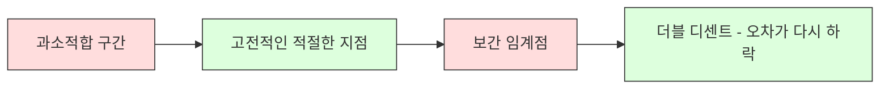
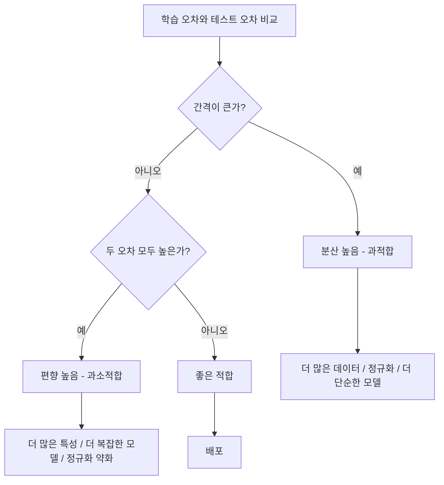
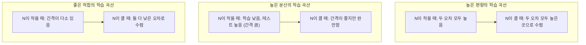
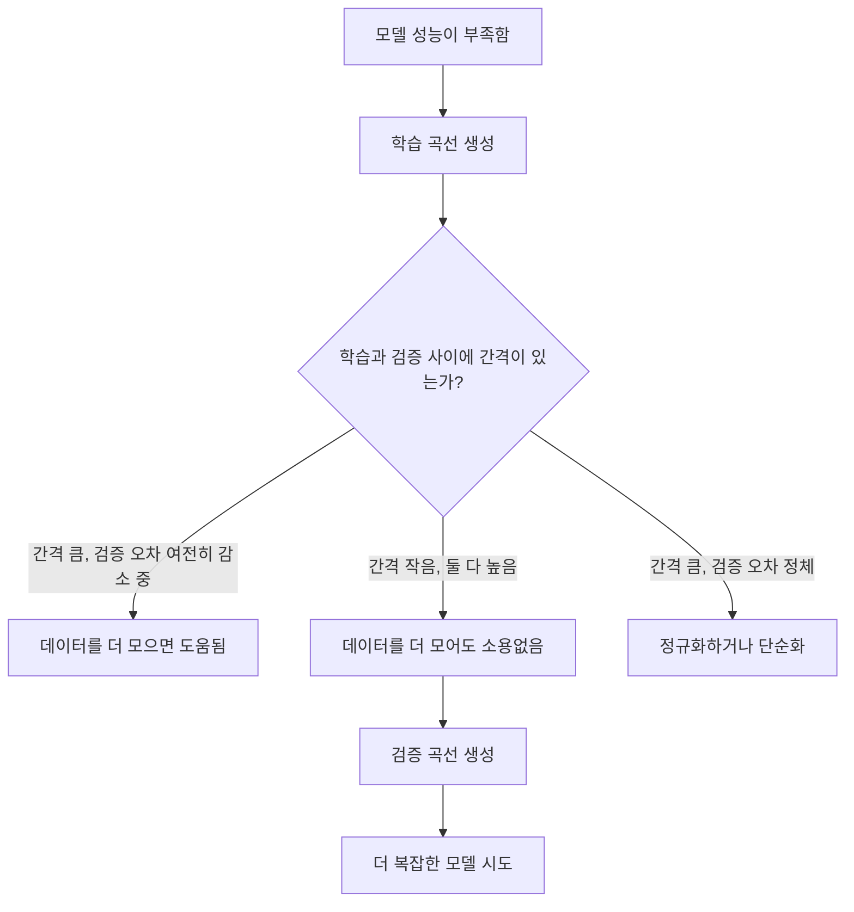

> 🇰🇷 이 문서는 한국어 번역본입니다(ELI5 스타일). 원문: [en.md](en.md)

# 편향-분산 트레이드오프

> 모델 오차는 항상 세 가지 출처 중 하나에서 옵니다: 편향(bias), 분산(variance), 또는 잡음(noise). 우리가 통제할 수 있는 건 앞의 둘뿐입니다.

**유형:** Learn
**언어:** Python
**선수 지식:** 페이즈 2, 레슨 01-09 (ML 기초, 회귀, 분류, 평가)
**소요 시간:** ~75분

## 학습 목표

- 기대 예측 오차의 편향-분산 분해를 유도하고, 줄일 수 없는 잡음의 역할을 설명할 수 있다
- 학습 오차와 테스트 오차의 패턴을 보고 모델의 문제가 높은 편향인지 높은 분산인지 진단할 수 있다
- 정규화 기법(L1, L2, 드롭아웃, 조기 종료)이 어떻게 분산을 희생해서 편향을 줄이고(또는 그 반대로) 균형을 맞추는지 설명할 수 있다
- 복잡도를 점점 높여 가는 모델들에서 편향-분산 트레이드오프를 시각화하는 실험을 구현할 수 있다

## 문제 상황

모델을 학습시켰습니다. 테스트 데이터에서 어느 정도 오차가 나옵니다. 그 오차는 어디서 온 걸까요?

모델이 너무 단순하면(곡선 데이터에 선형 회귀를 적용한 경우) 진짜 패턴을 계속 빗나가게 잡습니다. 그게 편향입니다. 모델이 너무 복잡하면(데이터 포인트 15개에 20차 다항식) 학습 데이터는 완벽하게 맞추지만 새 데이터에는 들쭉날쭉하고 엉터리인 예측을 내놓습니다. 그게 분산입니다.

모델 용량이 고정되어 있다면 둘을 동시에 최소화할 수 없습니다. 편향을 누르면 분산이 올라가고, 분산을 누르면 편향이 올라갑니다. 이 트레이드오프를 이해하는 것이 머신러닝에서 가장 쓸모 있는 단 하나의 진단 스킬입니다. 모델을 더 복잡하게 해야 할지 단순하게 해야 할지, 데이터를 더 모을지 더 좋은 특성을 만들지, 정규화를 강하게 할지 약하게 할지 알려 주기 때문입니다.

## 개념

### 편향: 체계적인 오차

편향은 모델의 평균적인 예측이 진짜 값에서 얼마나 벗어나 있는지를 잽니다. 같은 분포에서 뽑은 여러 학습 세트들로 똑같은 모델을 학습시킨 뒤 예측들을 평균 냈다고 하면, 편향은 그 평균과 진실 사이의 간격입니다.

편향이 높다는 건 모델이 너무 뻣뻣해서 진짜 패턴을 잡아내지 못한다는 뜻입니다. 포물선에 직선을 맞추면, 데이터를 아무리 줘도 곡선을 놓칩니다. 이것이 과소적합입니다.

```
편향 높음 (과소적합):
  모델이 항상 대충 비슷한 엉터리를 예측한다.
  학습 오차: 높음
  테스트 오차: 높음
  둘 사이 간격: 작음
```

### 분산: 학습 데이터에 대한 민감도

분산은 학습 데이터의 다른 부분집합으로 학습할 때 예측이 얼마나 달라지는지를 잽니다. 학습 세트의 작은 변화가 모델의 큰 변화로 이어진다면 분산이 높은 겁니다.

분산이 높다는 건 모델이 데이터 속 진짜 신호가 아니라 학습 데이터의 잡음에 맞춰지고 있다는 뜻입니다. 20차 다항식은 모든 학습 포인트를 꿰뚫고 지나가지만, 그 사이에서는 미친 듯이 요동칩니다. 이것이 과적합입니다.

```
분산 높음 (과적합):
  모델이 학습 데이터는 완벽히 맞추지만 새 데이터에서 실패한다.
  학습 오차: 낮음
  테스트 오차: 높음
  둘 사이 간격: 큼
```

### 분해 공식

어떤 점 x에 대해, 제곱 손실 기준의 기대 예측 오차는 정확히 다음처럼 분해됩니다:

```
Expected Error = Bias^2 + Variance + Irreducible Noise

where:
  Bias^2   = (E[f_hat(x)] - f(x))^2
  Variance = E[(f_hat(x) - E[f_hat(x)])^2]
  Noise    = E[(y - f(x))^2]             (sigma^2)
```

- `f(x)`는 진짜 함수입니다
- `f_hat(x)`는 모델의 예측입니다
- `E[...]`는 서로 다른 학습 세트들에 대한 기댓값입니다
- `y`는 관측된 레이블입니다(진짜 함수에 잡음이 더해진 값)

잡음 항은 줄일 수 없습니다. 잡음 섞인 데이터에서 어떤 모델도 sigma^2보다 잘할 수 없습니다. 우리가 할 일은 bias^2와 variance 사이의 올바른 균형을 찾는 것입니다.

### 모델 복잡도 대 오차


고전적인 U자 곡선:

| 복잡도 | 편향 | 분산 | 전체 오차 |
|-----------|------|----------|-------------|
| 너무 낮음 | 높음 | 낮음 | 높음 (과소적합) |
| 딱 맞음 | 중간 | 중간 | 가장 낮음 |
| 너무 높음 | 낮음 | 높음 | 높음 (과적합) |

### 편향-분산 통제 수단으로서의 정규화

정규화는 분산을 줄이기 위해 일부러 편향을 늘리는 행위입니다. 모델에 제약을 걸어서 잡음을 좇지 못하게 만드는 것이죠.

- **L2 (릿지):** 모든 가중치를 0 쪽으로 줄입니다. 모든 특성을 유지하되 그 영향력을 줄입니다.
- **L1 (라쏘):** 일부 가중치를 정확히 0으로 밀어 넣습니다. 특성 선택 효과가 있습니다.
- **드롭아웃:** 학습 중에 뉴런을 무작위로 비활성화합니다. 중복된 표현을 갖도록 강제합니다.
- **조기 종료:** 모델이 학습 데이터에 완전히 맞춰지기 전에 학습을 멈춥니다.

정규화 강도(lambda, 드롭아웃 비율, 에포크 수)가 편향-분산 곡선에서 내가 어디쯤 서 있을지를 직접 결정합니다. 정규화가 강할수록 편향은 커지고 분산은 작아집니다.

### 더블 디센트: 현대적 관점

고전 이론은 이렇게 말합니다: 적절한 지점을 지나면 복잡도가 늘어날수록 항상 나빠진다고. 하지만 2019년 이후 연구들은 뜻밖의 사실을 보여 줬습니다. 모델 용량을 보간 임계점(모델이 학습 데이터를 완벽히 맞출 만큼 파라미터가 충분해지는 지점)을 한참 넘어 계속 키우면, 테스트 오차가 다시 내려갈 수 있다는 것입니다.



이 "더블 디센트(double descent)" 현상은 왜 어마어마하게 과대파라미터화된 신경망(학습 예시보다 파라미터가 훨씬 많은)이 여전히 잘 일반화되는지 설명해 줍니다. 고전적인 편향-분산 트레이드오프가 틀린 건 아니지만, 현대적인 영역에서는 불완전하다는 뜻입니다.

더블 디센트에 대한 핵심 관찰:
- 선형 모델, 결정 트리, 신경망 모두에서 일어난다
- 보간 영역에서는 데이터를 더 모으면 오히려 나빠질 수 있다 (샘플 축 더블 디센트)
- 학습 에포크를 더 돌려도 생길 수 있다 (에포크 축 더블 디센트)
- 정규화는 그 봉우리를 매끈하게 다듬지만 없애지는 못한다

왜 이런 일이 벌어질까요? 보간 임계점에서 모델은 모든 학습 포인트를 맞출 만큼 겨우 간신히 용량을 갖춘 상태입니다. 그래서 모든 점을 꿰뚫는 아주 특수한 해 하나로 몰려 들어야 하고, 데이터의 작은 요동이 적합 결과의 큰 변화로 이어집니다. 분산이 정점을 찍는 지점이 바로 여기입니다. 임계점을 지나면 모델은 데이터를 완벽하게 맞추는 해를 여럿 갖게 됩니다. 그러면 학습 알고리즘(예: 암묵적인 정규화 효과가 있는 경사 하강법)이 그중 가장 단순한 해를 고르는 경향이 있습니다. 단순한 해를 향한 이 암묵적 편향 때문에 과대파라미터화된 모델이 일반화되는 것입니다.

| 영역 | 파라미터 대 샘플 | 행동 양식 |
|--------|----------------------|----------|
| 과소파라미터화 | p << n | 고전적 트레이드오프가 적용됨 |
| 보간 임계점 | p ~ n | 분산이 정점, 테스트 오차 급등 |
| 과대파라미터화 | p >> n | 암묵적 정규화가 발동, 테스트 오차 하락 |

실전 교훈: 신경망이나 대형 트리 앙상블을 쓴다면 보간 임계점에서 멈추지 마세요. 그보다 훨씬 아래(명시적 정규화와 함께)에 머물거나, 훨씬 위로 넘어가세요. 가장 나쁜 자리는 바로 임계점 한복판입니다.

### 내 모델 진단하기



| 증상 | 진단 | 처방 |
|---------|-----------|-----|
| 학습 오차 높음, 테스트 오차 높음 | 편향 | 더 많은 특성, 복잡한 모델, 정규화 약화 |
| 학습 오차 낮음, 테스트 오차 높음 | 분산 | 더 많은 데이터, 정규화, 단순한 모델, 드롭아웃 |
| 학습 오차 낮음, 테스트 오차 낮음 | 좋은 적합 | 출시 |
| 학습 오차 감소 중, 테스트 오차 증가 중 | 과적합 진행 중 | 조기 종료 |

### 실전 전략

**편향이 문제일 때:**
- 다항 특성이나 상호작용 특성 추가
- 더 유연한 모델 사용 (선형 대신 트리 앙상블)
- 정규화 강도 약화
- 더 오래 학습 (아직 수렴하지 않았다면)

**분산이 문제일 때:**
- 더 많은 학습 데이터 확보
- 배깅 사용 (랜덤 포레스트)
- 정규화 강화 (lambda를 높이고, 드롭아웃 늘리기)
- 특성 선택 (잡음 섞인 특성 제거)
- 교차 검증으로 조기에 발견

### 앙상블 방법과 분산 축소

앙상블 방법은 분산과 싸우는 가장 실전적인 도구입니다.

**배깅(Bootstrap Aggregating)**은 학습 데이터의 서로 다른 부트스트랩 샘플들로 여러 모델을 학습시킨 뒤 예측을 평균 냅니다. 개별 모델은 분산이 높지만, 그 평균은 분산이 훨씬 낮습니다. 랜덤 포레스트는 결정 트리에 적용한 배깅입니다.

수학적으로 왜 되는 걸까요: 분산이 sigma^2인 독립적인 예측 N개를 평균 내면, 그 평균의 분산은 sigma^2 / N입니다. 모델들은 진짜 독립은 아닙니다(비슷한 데이터를 보니까요), 그래서 감소폭은 1/N보다는 작지만 그래도 상당합니다.

**부스팅**은 모델을 순서대로 차곡차곡 쌓으면서 편향을 줄입니다. 이때 새 모델마다 지금까지의 앙상블이 틀린 부분에 집중합니다. 그래디언트 부스팅과 AdaBoost가 대표적입니다. 부스팅은 모델을 너무 많이 더하면 과적합할 수 있으므로 조기 종료나 정규화가 필요합니다.

| 방법 | 주요 효과 | 편향 변화 | 분산 변화 |
|--------|---------------|-------------|-----------------|
| 배깅 | 분산 감소 | 변화 없음 | 감소 |
| 부스팅 | 편향 감소 | 감소 | 증가할 수 있음 |
| 스태킹 | 둘 다 감소 | 메타 학습기에 따라 다름 | 베이스 모델에 따라 다름 |
| 드롭아웃 | 암묵적 배깅 | 약간 증가 | 감소 |

**실전 규칙:** 베이스 모델의 분산이 높다면(깊은 트리, 고차 다항식) 배깅을 쓰세요. 베이스 모델의 편향이 높다면(얕은 스텀프, 단순 선형 모델) 부스팅을 쓰세요.

### 학습 곡선

학습 곡선은 학습 오차와 검증 오차를 학습 세트 크기의 함수로 그린 것입니다. 여러분이 갖고 있는 진단 도구 중 가장 실전적인 도구입니다. 학습/테스트를 한 번만 비교하는 것과 달리, 학습 곡선은 모델의 궤적을 보여 주고 데이터를 더 모으면 도움이 될지 알려 줍니다.



읽는 법:

| 시나리오 | 학습 오차 | 검증 오차 | 간격 | 의미 | 할 일 |
|----------|---------------|-----------------|-----|---------------|------------|
| 높은 편향 | 높음 | 높음 | 작음 | 모델이 패턴을 잡지 못함 | 더 많은 특성, 복잡한 모델, 정규화 약화 |
| 높은 분산 | 낮음 | 높음 | 큼 | 모델이 학습 데이터를 외움 | 더 많은 데이터, 정규화, 단순한 모델 |
| 좋은 적합 | 중간 | 중간 | 작음 | 모델이 잘 일반화함 | 출시 |
| 높은 분산, 개선 중 | 낮음 | 데이터가 늘수록 감소 | 줄어드는 중 | 데이터로 해결 가능한 분산 문제 | 더 많은 데이터 수집 |
| 높은 편향, 평평함 | 높음 | 높고 평평함 | 작고 평평함 | 데이터를 더 모어도 소용없음 | 모델 아키텍처 변경 |

핵심 통찰: 두 곡선이 모두 정체되어 있고 간격은 작은데 두 오차 모두 높다면, 데이터를 더 모어도 소용이 없습니다. 더 나은 모델이 필요한 것입니다. 간격이 크고 아직 줄어드는 중이라면, 데이터를 더 모으면 도움이 됩니다.

### 학습 곡선 만드는 법

두 가지 접근이 있습니다:

**접근 1: 학습 세트 크기를 바꾸고 모델 고정.** 모델과 하이퍼파라미터를 고정합니다. 점점 큰 학습 데이터 부분집합으로 학습시키고, 각 크기에서 학습 오차와 검증 오차를 측정합니다. 이것이 표준적인 학습 곡선입니다.

**접근 2: 모델 복잡도를 바꾸고 데이터 고정.** 데이터를 고정합니다. 복잡도 파라미터(다항식 차수, 트리 깊이, 레이어 수)를 쓸어 넘기며, 각 복잡도에서 학습 오차와 검증 오차를 측정합니다. 이것은 검증 곡선으로, 편향-분산 트레이드오프를 직접 보여 줍니다.

두 접근은 서로를 보완합니다. 첫 번째는 데이터를 더 모으면 도움이 될지 알려 주고, 두 번째는 다른 모델로 바꾸면 도움이 될지 알려 줍니다. 다음 단계를 결정하기 전에 둘 다 해 보세요.



```figure
bias-variance
```

## 직접 만들기

`code/bias_variance.py`의 코드가 편향-분산 분해 실험 전체를 실행합니다. 접근 방식을 단계별로 소개합니다.

### 단계 1: 알려진 함수에서 합성 데이터 생성

가우시안 잡음이 섞인 `f(x) = sin(1.5x) + 0.5x`를 사용합니다. 진짜 함수를 알고 있으면 정확한 편향과 분산을 계산할 수 있습니다.

```python
def true_function(x):
    return np.sin(1.5 * x) + 0.5 * x

def generate_data(n_samples=30, noise_std=0.5, x_range=(-3, 3), seed=None):
    rng = np.random.RandomState(seed)
    x = rng.uniform(x_range[0], x_range[1], n_samples)
    y = true_function(x) + rng.normal(0, noise_std, n_samples)
    return x, y
```

### 단계 2: 부트스트랩 샘플링과 다항식 적합

각 다항식 차수마다 부트스트랩 학습 세트를 여러 개 뽑아 다항식을 적합시키고, 고정된 테스트 그리드에서의 예측을 기록합니다. 그러면 각 테스트 점에서 예측들의 분포를 얻을 수 있습니다.

```python
def fit_polynomial(x_train, y_train, degree, lam=0.0):
    X = np.column_stack([x_train ** d for d in range(degree + 1)])
    if lam > 0:
        penalty = lam * np.eye(X.shape[1])
        penalty[0, 0] = 0
        w = np.linalg.solve(X.T @ X + penalty, X.T @ y_train)
    else:
        w = np.linalg.lstsq(X, y_train, rcond=None)[0]
    return w
```

서로 다른 부트스트랩 샘플 200개에 적합시킵니다. 각 부트스트랩 샘플은 같은 근본 분포에서 나왔지만 담고 있는 점들은 서로 다릅니다.

### 단계 3: Bias^2와 분산 분해 계산

각 테스트 점마다 200세트의 예측이 있으므로, 정의 그대로 분해를 계산할 수 있습니다:

```python
mean_pred = predictions.mean(axis=0)
bias_sq = np.mean((mean_pred - y_true) ** 2)
variance = np.mean(predictions.var(axis=0))
total_error = np.mean(np.mean((predictions - y_true) ** 2, axis=1))
```

- `mean_pred`는 부트스트랩 샘플들로 추정한 E[f_hat(x)]입니다
- `bias_sq`는 평균 예측과 진실 사이 간격의 제곱입니다
- `variance`는 부트스트랩 샘플들에 걸친 예측의 평균적인 퍼짐 정도입니다
- `total_error`는 대략 bias^2 + variance + noise와 같아야 합니다

### 단계 4: 학습 곡선

학습 곡선은 모델 복잡도를 고정한 채 학습 세트 크기를 쓸어 넘깁니다. 모델이 데이터에 제약받는 상황인지, 용량에 제약받는 상황인지 보여 줍니다.

```python
def demo_learning_curves():
    sizes = [10, 15, 20, 30, 50, 75, 100, 150, 200, 300]
    degree = 5

    for n in sizes:
        train_errors = []
        test_errors = []
        for seed in range(50):
            x_train, y_train = generate_data(n_samples=n, seed=seed * 100)
            w = fit_polynomial(x_train, y_train, degree)
            train_pred = predict_polynomial(x_train, w)
            train_mse = np.mean((train_pred - y_train) ** 2)
            test_pred = predict_polynomial(x_test, w)
            test_mse = np.mean((test_pred - y_test) ** 2)
            train_errors.append(train_mse)
            test_errors.append(test_mse)
        # 여러 회차를 평균 내면 학습 곡선의 한 점이 된다
```

분산이 높은 모델(작은 데이터에 5차 다항식)에서는 이렇게 보입니다:
- 학습 오차는 낮은 값에서 시작해, 데이터가 늘어 외우기가 어려워질수록 증가
- 테스트 오차는 높은 값에서 시작해, 모델이 신호를 더 많이 얻을수록 감소
- 간격은 데이터가 늘수록 좁아짐

편향이 높은 모델(1차 다항식)에서는 두 오차가 빠르게 같은 높은 값으로 수렴하고, 데이터를 더 모아도 소용이 없습니다.

### 단계 5: 정규화 스윕

코드에는 `demo_regularization_sweep()`도 들어 있습니다. 고차 다항식(15차)을 고정하고 릿지 정규화 강도를 0.001부터 100까지 쓸어 넘깁니다. 모델 복잡도를 바꾸는 대신 제약 강도를 바꾼다는 점에서, 편향-분산 트레이드오프를 다른 각도에서 보여 줍니다.

```python
def demo_regularization_sweep():
    alphas = [0.001, 0.005, 0.01, 0.05, 0.1, 0.5, 1.0, 5.0, 10.0, 50.0, 100.0]
    for alpha in alphas:
        results = bias_variance_decomposition([15], lam=alpha)
        r = results[15]
        print(f"alpha={alpha:.3f}  bias={r['bias_sq']:.4f}  var={r['variance']:.4f}")
```

alpha가 낮으면 15차 다항식은 사실상 제약이 없습니다. 각 부트스트랩 샘플의 잡음을 좇기 때문에 분산이 지배합니다. alpha가 높으면 벌칙이 너무 강해서 모델이 사실상 거의 상수 함수가 됩니다. 편향이 지배하죠. 최적의 alpha는 이 두 극단 사이 어딘가에 있습니다.

다항식 차수를 바꿀 때 보았던 바로 그 U자 곡선이지만, 이산적인 조절 대신 연속적인 다이얼로 조종하는 셈입니다. 실전에서는 특성 세트를 바꾸지 않고도 세밀한 조절이 가능하기 때문에, 정규화가 트레이드오프를 제어하는 선호되는 방식입니다.

## 실전에서 쓰기

sklearn은 `learning_curve`와 `validation_curve`를 제공해서, 부트스트랩 루프를 직접 짜지 않고도 이런 진단을 자동화할 수 있습니다.

### 검증 곡선: 모델 복잡도 스윕

```python
from sklearn.model_selection import validation_curve
from sklearn.pipeline import make_pipeline
from sklearn.preprocessing import PolynomialFeatures
from sklearn.linear_model import Ridge

degrees = list(range(1, 16))
train_scores_all = []
val_scores_all = []

for d in degrees:
    pipe = make_pipeline(PolynomialFeatures(d), Ridge(alpha=0.01))
    train_scores, val_scores = validation_curve(
        pipe, X, y, param_name="polynomialfeatures__degree",
        param_range=[d], cv=5, scoring="neg_mean_squared_error"
    )
    train_scores_all.append(-train_scores.mean())
    val_scores_all.append(-val_scores.mean())
```

편향-분산 트레이드오프 곡선을 그대로 얻을 수 있습니다. 검증 점수가 학습 점수에 비해 가장 나쁜 곳에서 분산이 지배합니다. 둘 다 나쁜 곳에서는 편향이 지배합니다.

### 학습 곡선: 학습 세트 크기 스윕

```python
from sklearn.model_selection import learning_curve

pipe = make_pipeline(PolynomialFeatures(5), Ridge(alpha=0.01))
train_sizes, train_scores, val_scores = learning_curve(
    pipe, X, y, train_sizes=np.linspace(0.1, 1.0, 10),
    cv=5, scoring="neg_mean_squared_error"
)
train_mse = -train_scores.mean(axis=1)
val_mse = -val_scores.mean(axis=1)
```

`train_mse`와 `val_mse`를 `train_sizes`에 대해 그려 보세요. 그 모양이 모델에 관한 모든 것을 말해 줍니다.

### 정규화 스윕과 교차 검증

```python
from sklearn.model_selection import cross_val_score

alphas = [0.001, 0.01, 0.1, 1.0, 10.0, 100.0]
for alpha in alphas:
    pipe = make_pipeline(PolynomialFeatures(10), Ridge(alpha=alpha))
    scores = cross_val_score(pipe, X, y, cv=5, scoring="neg_mean_squared_error")
    print(f"alpha={alpha:>7.3f}  MSE={-scores.mean():.4f} +/- {scores.std():.4f}")
```

모델 복잡도를 고정한 채 정규화 강도를 쓸어 넘깁니다. 같은 편향-분산 트레이드오프가 보일 겁니다: 낮은 alpha는 높은 분산, 높은 alpha는 높은 편향입니다.

### 한데 모아서: 완전한 진단 워크플로

실전에서는 이 진단들을 순서대로 돌립니다:

1. 모델을 학습시키고 학습 오차와 테스트 오차를 계산한다.
2. 둘 다 높으면: 편향 문제입니다. 4단계로 건너뛰세요.
3. 학습 오차는 낮은데 테스트 오차가 높으면: 분산 문제입니다. 학습 곡선을 그려서 데이터를 더 모으면 도움이 될지 확인하세요. 안 된다면 정규화를 하세요.
4. 주요 복잡도 파라미터를 쓸어 넘기는 검증 곡선을 만들어 적절한 지점을 찾으세요.
5. 그 지점에서 학습 곡선을 만드세요. 간격이 아직 크다면 더 많은 데이터나 정규화가 필요합니다.
6. `cross_val_score`로 서로 다른 alpha 값의 릿지/라쏘를 시도하세요. 교차 검증 오차가 가장 낮은 alpha를 고르세요.

대부분의 테이블 데이터셋에서 이 과정은 연산 10-15분이면 끝나고, 몇 시간짜리 추측을 줄여 줍니다.

## 출시하기

이 레슨이 만드는 산출물: `outputs/prompt-model-diagnostics.md`

## 연습 문제

1. `noise_std=0` (잡음 없음)으로 분해를 실행해 보세요. 줄일 수 없는 오차 항에는 무슨 일이 생기나요? 최적 복잡도가 바뀌나요?

2. 학습 세트 크기를 30에서 300으로 늘려 보세요. 분산 항에는 어떤 영향을 주나요? 최적 다항식 차수가 이동하나요?

3. 실험에 L2 정규화(릿지 회귀)를 추가해 보세요. 고차 다항식(15차)을 고정하고 lambda를 0부터 100까지 쓸어 넘기며, bias^2와 variance를 lambda의 함수로 그려 보세요.

4. 진짜 함수를 다항식에서 `sin(x)`로 바꿔 보세요. 편향-분산 분해는 어떻게 달라지나요? 여전히 명확한 최적 차수가 있나요?

5. 간단한 부트스트랩 집계(배깅) 래퍼를 구현해 보세요: 부트스트랩 샘플로 모델 10개를 학습시키고 예측을 평균 냅니다. 이렇게 하면 편향을 크게 늘리지 않으면서 분산이 줄어든다는 것을 보여 보세요.

## 핵심 용어

| 용어 | 흔히 하는 말 | 실제 의미 |
|------|----------------|----------------------|
| 편향 | "모델이 너무 단순하다" | 잘못된 가정에서 오는 체계적인 오차. 평균적인 모델 예측과 진실 사이의 간격. |
| 분산 | "모델이 과적합이다" | 학습 데이터에 민감해서 오는 오차. 학습 세트가 바뀔 때 예측이 얼마나 달라지는가. |
| 줄일 수 없는 오차 | "데이터 속 잡음" | 데이터 생성 과정 자체의 무작위성에서 오는 오차. 어떤 모델도 제거할 수 없다. |
| 과소적합 | "충분히 배우지 못함" | 편향이 높은 상태. 학습 데이터에서조차 진짜 패턴을 놓친다. |
| 과적합 | "데이터를 외워버림" | 분산이 높은 상태. 일반화되지 않는 학습 데이터의 잡음까지 맞춰버린다. |
| 정규화 | "모델에 제약 걸기" | 모델 복잡도를 줄이기 위해 벌칙을 더하는 것. 편향을 희생해서 분산을 낮춘다. |
| 더블 디센트 | "파라미터가 많으면 오히려 도움될 수 있다" | 모델 용량이 보간 임계점을 한참 넘어서면 테스트 오차가 다시 내려간다. |
| 모델 복잡도 | "모델이 얼마나 유연한가" | 임의의 패턴을 맞출 수 있는 모델의 용량. 아키텍처, 특성, 정규화로 조절된다. |

## 더 읽을거리

- [Hastie, Tibshirani, Friedman: Elements of Statistical Learning, Ch. 7](https://hastie.su.domains/ElemStatLearn/) -- 편향-분산 분해의 정석적인 다룸
- [Belkin et al., Reconciling modern machine learning practice and the bias-variance trade-off (2019)](https://arxiv.org/abs/1812.11118) -- 더블 디센트를 처음 제안한 논문
- [Nakkiran et al., Deep Double Descent (2019)](https://arxiv.org/abs/1912.02292) -- 에포크 축과 샘플 축 더블 디센트
- [Scott Fortmann-Roe: Understanding the Bias-Variance Tradeoff](http://scott.fortmann-roe.com/docs/BiasVariance.html) -- 명쾌한 시각적 설명
