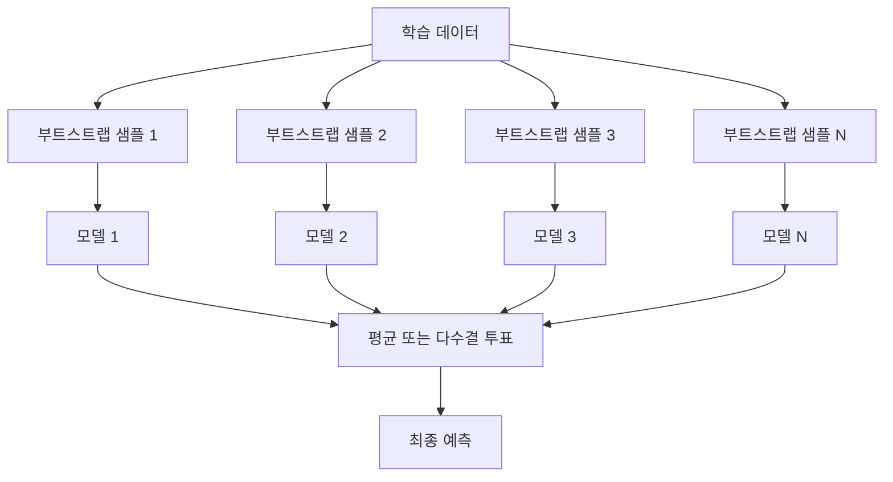
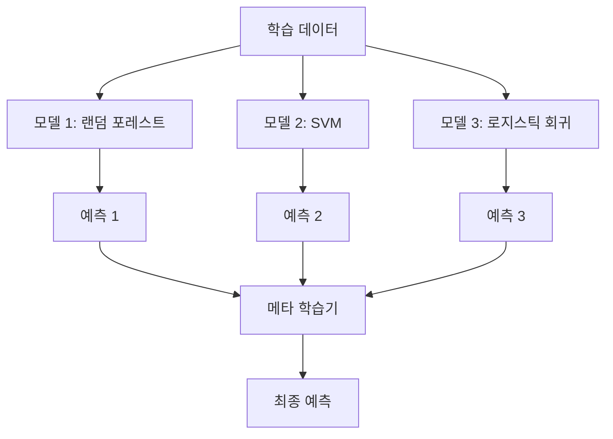

> 🇰🇷 이 문서는 한국어 번역본입니다(ELI5 스타일). 원문: [en.md](en.md)

# 앙상블 방법

> 약한 학습기들도 올바르게 결합하면 강한 학습기가 된다. 이것은 비유가 아니라 정리(theorem)다.

**유형:** Build
**언어:** Python
**선수 지식:** 페이즈 2, 레슨 10 (편향-분산 트레이드오프)
**소요 시간:** ~120분

## 학습 목표

- AdaBoost와 그래디언트 부스팅을 처음부터 직접 구현하고, 부스팅이 어떻게 순차적으로 편향을 줄이는지 설명할 수 있다
- 배깅 앙상블을 만들고, 서로 상관되지 않은 모델들을 평균 내면 편향을 늘리지 않고도 분산이 줄어든다는 것을 보여 줄 수 있다
- 배깅, 부스팅, 스태킹을 비교하면서 각 방법이 오차의 어떤 구성 요소를 겨냥하는지 설명할 수 있다
- 앙상블의 다양성을 평가하고, 왜 독립적인 약한 학습기가 늘어날수록 다수결 투표 정확도가 좋아지는지 설명할 수 있다

## 문제 상황

결정 트리 하나는 학습이 빠르고 해석하기 쉽지만 과적합됩니다. 선형 모델 하나는 복잡한 경계에서 과소적합됩니다. 완벽한 모델 아키텍처를 만들려고 며칠을 쏟을 수도 있습니다. 아니면, 완벽하지 않은 모델 여러 개를 묶어서 그중 어떤 것보다도 나은 무언가를 만들 수도 있습니다.

앙상블 방법이 하는 일이 정확히 후자입니다. 테이블 데이터 Kaggle 대회를 우승하는 가장 믿을 만한 기법이고, 대부분의 프로덕션(운영 환경) ML 시스템을 떠받치는 기반이며, 편향-분산 트레이드오프가 실제로 작동하는 모습을 보여 줍니다. 배깅은 분산을 줄입니다. 부스팅은 편향을 줄입니다. 스태킹은 어떤 입력에는 어떤 모델을 믿을지 배웁니다.

## 개념

### 앙상블이 왜 통하는가

정확도가 p > 0.5인 독립적인 분류기 N개가 있다고 해 봅시다. 다수결 투표의 정확도는:

```
P(majority correct) = sum over k > N/2 of C(N,k) * p^k * (1-p)^(N-k)
```

정확도 60%짜리 분류기 21개의 다수결 투표 정확도는 약 74%입니다. 분류기 101개면 84%까지 올라갑니다. 모델들이 서로 다른 실수를 할 때는 오차가 서로 상쇄되는 것입니다.

핵심 조건은 **다양성**입니다. 모든 모델이 똑같은 실수를 한다면 결합해도 아무 소용이 없습니다. 앙상블이 다음 방법들로 다양한 모델을 만들어 내기 때문에 통하는 것입니다:

- 서로 다른 학습 부분집합 (배깅)
- 서로 다른 특성 부분집합 (랜덤 포레스트)
- 순차적인 오차 교정 (부스팅)
- 서로 다른 모델 계열 (스태킹)

### 배깅 (Bootstrap Aggregating)

배깅은 각 모델을 학습 데이터의 서로 다른 부트스트랩 샘플로 학습시켜서 다양성을 만듭니다.



부트스트랩 샘플은 원본 데이터에서 같은 크기만큼 중복을 허용하며(with replacement) 뽑은 것입니다. 고유 샘플의 약 63.2%가 각 부트스트랩에 등장하고, 남은 36.8%(out-of-bag 샘플)는 공짜 검증 세트 역할을 합니다.

배깅은 편향을 크게 늘리지 않고 분산을 줄입니다. 개별 트리는 각자의 부트스트랩 샘플에 과적합하지만, 그 과적합 양상이 트리마다 다르기 때문에 평균을 내면 잡음이 상쇄됩니다.

**랜덤 포레스트**는 배깅에 한 가지를 더 얹은 것입니다: 분기할 때마다 특성의 무작위 부분집합만 고려합니다. 이것이 트리들 사이의 다양성을 한층 더 강제합니다. 후보 특성 수는 분류에서는 보통 `sqrt(n_features)`, 회귀에서는 `n_features / 3`입니다.

### 부스팅 (순차적 오차 교정)

부스팅은 모델을 순서대로 학습시킵니다. 각 새 모델은 이전 모델들이 틀린 예시에 집중합니다.


부스팅은 편향을 줄입니다. 각 새 모델이 지금까지의 앙상블의 체계적인 오차를 교정합니다. 최종 예측은 모든 모델의 가중합이고, 더 나은 모델일수록 높은 가중치를 받습니다.

트레이드오프: 라운드를 너무 많이 돌리면 부스팅은 과적합할 수 있습니다. 점점 더 어려운 예시를 계속 맞추려 하는데, 그중 일부는 잡음일 수 있기 때문입니다.

### AdaBoost

AdaBoost(Adaptive Boosting)는 최초의 실용적인 부스팅 알고리즘입니다. 어떤 베이스 학습기와도 작동하며, 보통 결정 스텀프(깊이 1짜리 트리)를 씁니다.

알고리즘:

```
1. 샘플 가중치 초기화: 모든 i에 대해 w_i = 1/N

2. t = 1부터 T까지:
   a. 가중치가 적용된 데이터로 약한 학습기 h_t를 학습
   b. 가중 오차 계산:
      err_t = sum(w_i * I(h_t(x_i) != y_i)) / sum(w_i)
   c. 모델 가중치 계산:
      alpha_t = 0.5 * ln((1 - err_t) / err_t)
   d. 샘플 가중치 갱신:
      w_i = w_i * exp(-alpha_t * y_i * h_t(x_i))
   e. 가중치를 합이 1이 되도록 정규화

3. 최종 예측: H(x) = sign(sum(alpha_t * h_t(x)))
```

오차가 낮은 모델일수록 높은 alpha를 받습니다. 잘못 분류된 샘플은 가중치가 높아져서 다음 모델이 그쪽에 집중하게 됩니다.

### 그래디언트 부스팅

그래디언트 부스팅은 부스팅을 임의의 손실 함수로 일반화한 것입니다. 샘플 가중치를 다시 매기는 대신, 각 새 모델을 현재 앙상블의 잔차(손실의 음의 기울기)에 적합시킵니다.

```
1. 초기화: F_0(x) = argmin_c sum(L(y_i, c))

2. t = 1부터 T까지:
   a. 의사 잔차(pseudo-residual) 계산:
      r_i = -dL(y_i, F_{t-1}(x_i)) / dF_{t-1}(x_i)
   b. 잔차 r_i에 트리 h_t를 적합
   c. 최적 스텝 크기 찾기:
      gamma_t = argmin_gamma sum(L(y_i, F_{t-1}(x_i) + gamma * h_t(x_i)))
   d. 갱신:
      F_t(x) = F_{t-1}(x) + learning_rate * gamma_t * h_t(x)

3. 최종 예측: F_T(x)
```

제곱 오차 손실에서는 의사 잔차가 실제 잔차 그 자체입니다: `r_i = y_i - F_{t-1}(x_i)`. 각 트리가 문자 그대로 이전 앙상블의 오차를 맞추는 셈입니다.

학습률(shrinkage, 축소)은 각 트리가 얼마나 기여할지 조절합니다. 학습률이 작을수록 더 많은 트리가 필요하지만 일반화는 더 잘 됩니다. 전형적인 값: 0.01에서 0.3.

### XGBoost: 테이블 데이터를 지배하는 이유

XGBoost(eXtreme Gradient Boosting)는 그래디언트 부스팅에 공학적 최적화를 얹어서 빠르고, 정확하고, 과적합에도 잘 버티게 만든 것입니다:

- **정규화된 목적 함수:** 리프 가중치에 L1/L2 벌칙을 걸어서 개별 트리가 너무 자신만만해지지 않게 합니다
- **2차 근사:** 손실의 1차 도함수와 2차 도함수를 모두 사용해서 더 나은 분기 결정을 내립니다
- **희소성 인식 분기:** 결측값을 기본으로 처리합니다. 각 분기에서 결측 데이터에 대한 최선의 방향을 학습합니다
- **컬럼 서브샘플링:** 랜덤 포레스트처럼 각 분기에서 특성을 샘플링해서 다양성을 만듭니다
- **가중 분위 스케치(weighted quantile sketch):** 분산 환경의 연속형 특성에 대해 분기점을 효율적으로 찾습니다
- **캐시 친화적 블록 구조:** CPU 캐시 라인에 맞게 최적화된 메모리 배치입니다

테이블 데이터에서는 XGBoost(과 그 후속격인 LightGBM)가 신경망을 꾸준히 앞섭니다. 당분간 이 상황은 바뀌지 않습니다. 데이터가 행과 열이 있는 테이블에 들어간다면, 그래디언트 부스팅부터 시작하세요.

### 스태킹 (메타 학습)

스태킹은 여러 베이스 모델의 예측을 메타 학습기(meta-learner)의 특성으로 사용합니다.



메타 학습기는 어떤 입력에는 어떤 베이스 모델을 믿어야 하는지 배웁니다. 랜덤 포레스트는 어떤 영역에서 더 낫고 SVM은 다른 영역에서 더 낫다면, 메타 학습기는 그에 맞게 판을 배우게 됩니다.

데이터 누수를 피하려면 베이스 모델의 예측은 반드시 학습 세트에 대한 교차 검증으로 만들어야 합니다. 같은 데이터로 베이스 모델을 학습시키고 메타 특성까지 만들어 내는 일은 절대 없어야 합니다.

### 투표

가장 단순한 앙상블입니다. 예측을 그냥 직접 결합합니다.

- **하드 투표:** 클래스 레이블로 다수결 투표.
- **소프트 투표:** 예측 확률을 평균 내고, 평균 확률이 가장 높은 클래스를 고릅니다. 확신도 정보를 활용하기 때문에 보통 더 좋습니다.

```figure
f3-ensemble-average
```

## 직접 만들기

### 단계 1: 결정 스텀프 (베이스 학습기)

`code/ensembles.py`의 코드가 모든 것을 처음부터 구현합니다. 결정 스텀프, 즉 분기 하나짜리 트리부터 시작합니다.

```python
class DecisionStump:
    def __init__(self):
        self.feature_idx = None
        self.threshold = None
        self.polarity = 1
        self.alpha = None

    def fit(self, X, y, weights):
        n_samples, n_features = X.shape
        best_error = float("inf")

        for f in range(n_features):
            thresholds = np.unique(X[:, f])
            for thresh in thresholds:
                for polarity in [1, -1]:
                    pred = np.ones(n_samples)
                    pred[polarity * X[:, f] < polarity * thresh] = -1
                    error = np.sum(weights[pred != y])
                    if error < best_error:
                        best_error = error
                        self.feature_idx = f
                        self.threshold = thresh
                        self.polarity = polarity

    def predict(self, X):
        n = X.shape[0]
        pred = np.ones(n)
        idx = self.polarity * X[:, self.feature_idx] < self.polarity * self.threshold
        pred[idx] = -1
        return pred
```

### 단계 2: 처음부터 만드는 AdaBoost

```python
class AdaBoostScratch:
    def __init__(self, n_estimators=50):
        self.n_estimators = n_estimators
        self.stumps = []
        self.alphas = []

    def fit(self, X, y):
        n = X.shape[0]
        weights = np.full(n, 1 / n)

        for _ in range(self.n_estimators):
            stump = DecisionStump()
            stump.fit(X, y, weights)
            pred = stump.predict(X)

            err = np.sum(weights[pred != y])
            err = np.clip(err, 1e-10, 1 - 1e-10)

            alpha = 0.5 * np.log((1 - err) / err)
            weights *= np.exp(-alpha * y * pred)
            weights /= weights.sum()

            stump.alpha = alpha
            self.stumps.append(stump)
            self.alphas.append(alpha)

    def predict(self, X):
        total = sum(a * s.predict(X) for a, s in zip(self.alphas, self.stumps))
        return np.sign(total)
```

### 단계 3: 처음부터 만드는 그래디언트 부스팅

```python
class GradientBoostingScratch:
    def __init__(self, n_estimators=100, learning_rate=0.1, max_depth=3):
        self.n_estimators = n_estimators
        self.lr = learning_rate
        self.max_depth = max_depth
        self.trees = []
        self.initial_pred = None

    def fit(self, X, y):
        self.initial_pred = np.mean(y)
        current_pred = np.full(len(y), self.initial_pred)

        for _ in range(self.n_estimators):
            residuals = y - current_pred
            tree = SimpleRegressionTree(max_depth=self.max_depth)
            tree.fit(X, residuals)
            update = tree.predict(X)
            current_pred += self.lr * update
            self.trees.append(tree)

    def predict(self, X):
        pred = np.full(X.shape[0], self.initial_pred)
        for tree in self.trees:
            pred += self.lr * tree.predict(X)
        return pred
```

### 단계 4: sklearn과 비교

코드는 우리가 처음부터 만든 구현이 sklearn의 `AdaBoostClassifier`와 `GradientBoostingClassifier`와 비슷한 정확도를 내는지 확인하고, 모든 방법을 나란히 비교합니다.

## 실전에서 쓰기

### 각 방법을 언제 쓸까

| 방법 | 줄이는 것 | 가장 잘 맞는 곳 | 주의할 점 |
|--------|---------|----------|---------------|
| 배깅 / 랜덤 포레스트 | 분산 | 잡음 섞인 데이터, 많은 특성 | 편향에는 도움 안 됨 |
| AdaBoost | 편향 | 깨끗한 데이터, 단순한 베이스 학습기 | 이상치와 잡음에 민감 |
| 그래디언트 부스팅 | 편향 | 테이블 데이터, 대회 | 학습이 느리고, 튜닝 없이는 과적합하기 쉬움 |
| XGBoost / LightGBM | 둘 다 | 프로덕션(운영 환경) 테이블 ML | 하이퍼파라미터가 많음 |
| 스태킹 | 둘 다 | 마지막 1-2% 정확도 쟁취 | 복잡하고, 메타 학습기 과적합 위험 |
| 투표 | 분산 | 다양한 모델의 빠른 결합 | 모델들이 다양할 때만 도움 |

### 테이블 데이터를 위한 프로덕션 스택

대부분의 테이블 예측 문제에서 시도해 볼 순서입니다:

1. **LightGBM 또는 XGBoost** 기본 파라미터로 시작
2. n_estimators, learning_rate, max_depth, min_child_weight 튜닝
3. 마지막 0.5%가 필요하다면, 다양한 모델 3-5개로 스태킹 앙상블 구축
4. 전 과정에서 교차 검증 사용

테이블 데이터에서 신경망은 거의 항상 그래디언트 부스팅보다 나쁩니다. 꾸준한 연구 시도에도 불구하고요. TabNet, NODE 같은 아키텍처가 가끔 맞먹기는 하지만, 잘 튜닝된 XGBoost를 이기는 일은 드뭅니다.

## 출시하기

이 레슨은 `outputs/prompt-ensemble-selector.md`를 만듭니다 -- 주어진 데이터셋에 맞는 올바른 앙상블 방법을 고르는 걸 도와주는 프롬프트입니다. 데이터를 설명하면(크기, 특성 유형, 잡음 수준, 클래스 균형), 그리고 풀려는 문제를 설명하면, 프롬프트가 의사 결정 체크리스트를 훑으며 방법 하나를 추천하고, 시작용 하이퍼파라미터를 제안하고, 그 방법의 흔한 실수를 경고해 줍니다. 전체 선택 가이드가 담긴 `outputs/skill-ensemble-builder.md`도 함께 만듭니다.

## 연습 문제

1. AdaBoost 구현을 고쳐서 매 라운드 후 학습 정확도를 기록하게 해 보세요. 정확도 대 학습기 개수 그래프를 그려 보세요. 언제 수렴하나요?

2. 회귀 트리에 무작위 특성 서브샘플링을 추가해서 랜덤 포레스트를 처음부터 구현해 보세요. `max_features=sqrt(n_features)`로 트리 100개를 학습시키고 예측을 평균 내세요. 단일 트리와 비교해서 분산이 얼마나 줄었는지 확인해 보세요.

3. 그래디언트 부스팅 구현에 조기 종료를 추가해 보세요: 매 라운드 후 검증 손실을 기록하고, 10라운드 연속으로 개선되지 않으면 멈춥니다. 실제로 필요한 트리 개수는 몇 개인가요?

4. 베이스 모델 세 개(로지스틱 회귀, 결정 트리, k-최근접 이웃)와 로지스틱 회귀 메타 학습기로 스태킹 앙상블을 만들어 보세요. 메타 특성은 5-폴드 교차 검증으로 생성하세요. 각 베이스 모델 단독과 비교해 보세요.

5. 같은 데이터셋을 XGBoost 기본 파라미터로 실행해 보세요. 직접 만든 그래디언트 부스팅과 정확도를 비교하고, 둘 다 시간을 재세요. 속도 차이가 얼마나 되나요?

## 핵심 용어

| 용어 | 흔히 하는 말 | 실제 의미 |
|------|----------------|----------------------|
| 배깅 | "무작위 부분집합으로 학습하기" | 부트스트랩 집계(bootstrap aggregating): 부트스트랩 샘플로 모델을 학습시키고 예측을 평균 내서 분산을 줄인다 |
| 부스팅 | "어려운 예시에 집중하기" | 모델을 순차적으로 학습시키면서 각 모델이 지금까지의 앙상블 오차를 교정하게 해서 편향을 줄인다 |
| AdaBoost | "데이터 가중치 다시 매기기" | 샘플 가중치 갱신으로 하는 부스팅. 잘못 분류된 점이 다음 학습기에서 더 높은 가중치를 받는다 |
| 그래디언트 부스팅 | "잔차를 맞추기" | 각 새 모델을 손실 함수의 음의 기울기에 적합시키는 방식의 부스팅 |
| XGBoost | "Kaggle의 필살기" | 정규화, 2차 최적화, 시스템 수준 속도 기교를 얹은 그래디언트 부스팅 |
| 스태킹 | "모델 위에 모델 쌓기" | 베이스 모델들의 예측을 메타 학습기의 입력 특성으로 사용한다 |
| 랜덤 포레스트 | "무작위 트리 수백 그루" | 결정 트리로 하는 배깅. 다양성을 위해 각 분기에서 무작위 특성 서브샘플링을 더한다 |
| 앙상블 다양성 | "서로 다른 실수 하기" | 앙상블이 개별 모델보다 나아지려면 모델들의 오차가 서로 상관되지 않아야 한다 |
| OOB(out-of-bag) 오차 | "공짜 검증" | 부트스트랩 추첨에 안 들어간 샘플(약 36.8%)이 별도 holdout 없이 검증 세트 구실을 한다 |

## 더 읽을거리

- [Schapire & Freund: Boosting: Foundations and Algorithms](https://mitpress.mit.edu/9780262526036/) -- AdaBoost 창시자들이 쓴 책
- [Friedman: Greedy Function Approximation: A Gradient Boosting Machine (2001)](https://statweb.stanford.edu/~jhf/ftp/trebst.pdf) -- 그래디언트 부스팅 원조 논문
- [Chen & Guestrin: XGBoost (2016)](https://arxiv.org/abs/1603.02754) -- XGBoost 논문
- [Wolpert: Stacked Generalization (1992)](https://www.sciencedirect.com/science/article/abs/pii/S0893608005800231) -- 스태킹 원조 논문
- [scikit-learn Ensemble Methods](https://scikit-learn.org/stable/modules/ensemble.html) -- 실용적인 레퍼런스
