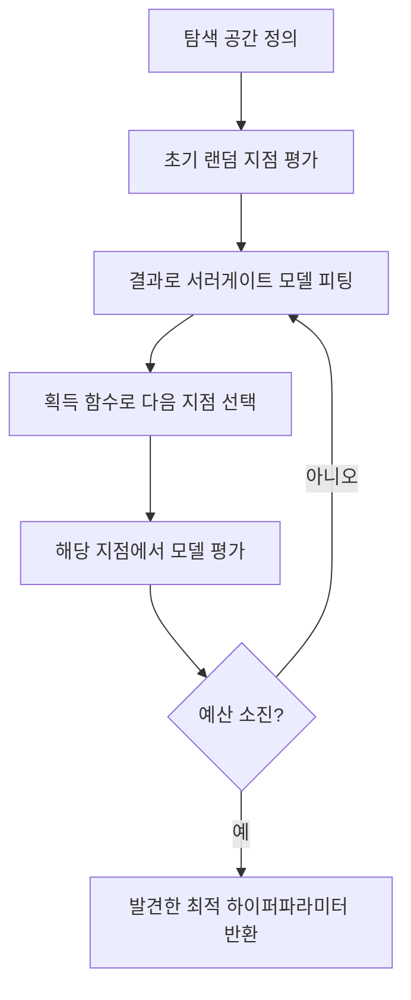
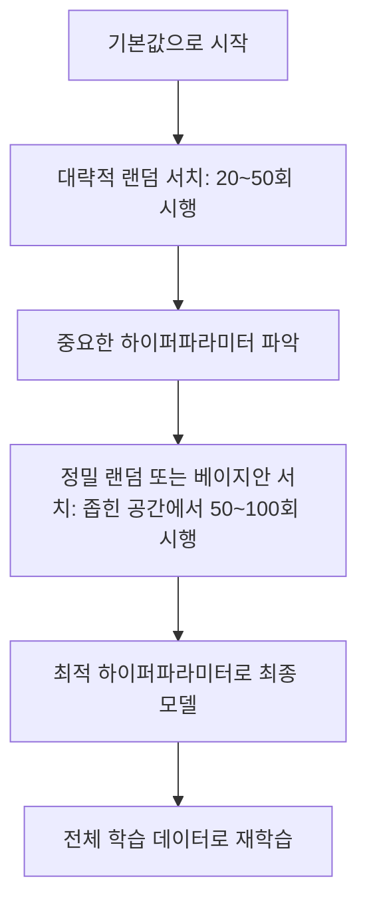
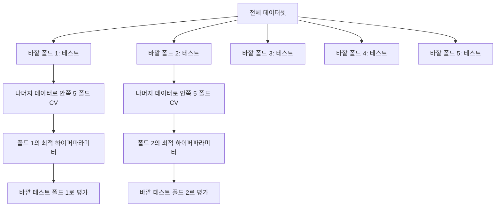

# 하이퍼파라미터 튜닝

> 🇰🇷 이 문서는 한국어 번역본입니다(ELI5 스타일). 원문: [en.md](en.md)

> 하이퍼파라미터는 학습이 시작되기 전에 돌려 보는 다이얼(조절 손잡이)입니다. 이 다이얼을 잘 맞추느냐 못 맞추느냐가 그저 그런 모델과 훌륭한 모델의 차이를 만듭니다.

**유형:** 빌드
**언어:** Python
**선수 지식:** 페이즈 2, 레슨 11(앙상블 방법)
**시간:** 약 90분

## 학습 목표

- 그리드 서치, 랜덤 서치, 베이지안 최적화를 직접 구현하고 샘플 효율을 비교할 수 있습니다
- 대부분의 하이퍼파라미터가 유효 차원(effective dimensionality)이 낮을 때 왜 랜덤 서치가 그리드 서치보다 나은지 설명할 수 있습니다
- 서러게이트 모델(대체 모델)과 획득 함수(acquisition function)를 사용해 탐색을 이끄는 베이지안 최적화 루프를 만들 수 있습니다
- 적절한 교차 검증을 통해 검증 세트에 과적합되는 것을 피하는 하이퍼파라미터 튜닝 전략을 설계할 수 있습니다

## 문제 상황

당신의 그래디언트 부스팅 모델에는 학습률, 트리 개수, 최대 깊이, 리프당 최소 샘플 수, 서브샘플 비율, 컬럼 샘플 비율이 있습니다. 하이퍼파라미터가 여섯 개입니다. 각각 값 후보가 5개씩이라면 그리드 크기는 5^6 = 15,625가지 조합입니다. 하나 학습하는 데 10초가 걸린다면, 전부 시도하는 데 43시간의 컴퓨팅이 필요합니다.

그리드 서치는 가장 당연해 보이지만 규모가 커지면 최악의 방법입니다. 랜덤 서치는 더 적은 컴퓨팅으로 더 잘합니다. 베이지안 최적화는 과거 평가 결과에서 학습해 더욱 잘합니다. 어떤 전략을 쓸지, 어떤 하이퍼파라미터가 실제로 중요한지 아는 것이 며칠치 낭비될 GPU 시간을 아껴 줍니다.

## 개념

### 파라미터 vs 하이퍼파라미터

파라미터는 학습 중에 배워지는 값이고(가중치, 편향, 분할 기준점), 하이퍼파라미터는 학습 시작 전에 정해지며 학습이 어떻게 진행될지를 조절합니다.

| 하이퍼파라미터 | 조절하는 것 | 일반적인 범위 |
|---------------|-----------------|---------------|
| 학습률(learning rate) | 업데이트 한 번의 보폭 | 0.001 ~ 1.0 |
| 트리/에포크 개수 | 얼마나 오래 학습할지 | 10 ~ 10,000 |
| 최대 깊이 | 모델 복잡도 | 1 ~ 30 |
| 정규화(lambda) | 과적합 방지 | 0.0001 ~ 100 |
| 배치 크기 | 그래디언트 추정의 노이즈 | 16 ~ 512 |
| 드롭아웃 비율 | 끄는 뉴런의 비율 | 0.0 ~ 0.5 |

### 그리드 서치

그리드 서치는 지정한 값들의 모든 조합을 평가합니다. 철저하고 이해하기 쉽지만, 하이퍼파라미터 개수에 따라 지수적으로 비용이 늘어납니다.

```
하이퍼파라미터 2개의 그리드:

  learning_rate: [0.01, 0.1, 1.0]
  max_depth:     [3, 5, 7]

  평가 횟수: 3 x 3 = 9가지 조합

  (0.01, 3)  (0.01, 5)  (0.01, 7)
  (0.1,  3)  (0.1,  5)  (0.1,  7)
  (1.0,  3)  (1.0,  5)  (1.0,  7)
```

그리드 서치에는 근본적인 결함이 있습니다. 한 하이퍼파라미터만 중요하고 나머지는 중요하지 않다면, 대부분의 평가가 낭비됩니다. 9번의 평가에서 중요한 파라미터의 고유한 값은 겨우 3개만 얻습니다.

### 랜덤 서치

랜덤 서치는 그리드 대신 분포에서 하이퍼파라미터를 샘플링합니다. 같은 9번의 예산으로 각 하이퍼파라미터의 고유한 값 9개를 얻습니다.


랜덤이 그리드를 이기는 이유(Bergstra & Bengio, 2012):

- 대부분의 하이퍼파라미터는 유효 차원이 낮습니다. 6개 중 실제로 중요한 것은 보통 1~2개뿐입니다.
- 그리드 서치는 중요하지 않은 차원에 평가를 낭비합니다.
- 랜덤 서치는 같은 예산으로 중요한 차원을 더 촘촘히 커버합니다.
- 60번의 랜덤 시행이면 최적값의 5% 이내에 드는 점을 찾을 확률이 95%입니다(탐색 공간 안에 그런 점이 존재한다면).

### 베이지안 최적화

랜덤 서치는 평가 결과를 무시합니다. 학습률이 너무 높으면 발산한다든지, 깊이 3이 깊이 10보다 꾸준히 낫다든지 하는 사실을 배우지 못합니다. 베이지안 최적화는 과거 평가를 활용해 다음에 어디를 탐색할지 정합니다.



두 가지 핵심 구성 요소:

**서러게이트 모델(대체 모델):** 비싼 목적 함수를 근사하는, 평가가 저렴한 모델(보통 가우시안 프로세스)입니다. 탐색 공간의 어느 지점에서든 예측값과 불확실성 추정치를 모두 알려 줍니다.

**획득 함수(acquisition function):** 활용(exploitation, 알려진 좋은 지점 근처를 찾기)과 탐색(exploration, 불확실성이 높은 곳을 찾기)의 균형을 맞춰 다음에 어디를 평가할지 결정합니다. 흔한 선택지:

- **기대 개선(Expected Improvement, EI):** 이 지점에서 현재 최고 기록 대비 얼마나 개선될 것으로 기대하는가?
- **상한 신뢰 한계(Upper Confidence Bound, UCB):** 예측값에 불확실성의 배수를 더한 값. UCB가 높다는 것은 유망하거나 아직 탐험되지 않았다는 뜻입니다.
- **개선 확률(Probability of Improvement, PI):** 이 지점이 현재 최고 기록을 넘을 확률은 얼마인가?

베이지안 최적화는 보통 랜덤 서치보다 2~5배 적은 평가로 더 좋은 하이퍼파라미터를 찾습니다. 서러게이트 모델을 피팅하는 비용은 실제 모델 학습에 비하면 무시할 수준입니다.

### 조기 종료

모든 학습 실행을 끝까지 해 볼 필요는 없습니다. 어떤 설정이 10에포크 시점에서 명백히 나쁘다면 멈추고 다음으로 넘어갑니다. 이것이 하이퍼파라미터 탐색 맥락에서의 조기 종료입니다.

전략:
- **인내 기반(patience-based):** 검증 손실이 N에포크 연속으로 개선되지 않으면 중단
- **중간값 프루닝(median pruning):** 시행의 중간 결과가 같은 단계에서 완료된 시행들의 중간값보다 나쁘면 중단
- **하이퍼밴드(Hyperband):** 많은 설정에 작은 예산을 배분한 뒤, 좋은 설정들에는 점진적으로 예산을 늘려 줌

하이퍼밴드는 특히 효과적입니다. 81개의 설정을 각각 1에포크로 시작하고, 상위 1/3만 남겨 3에포크를 주는 식을 반복합니다. 이 방식은 모든 설정을 전체 예산으로 평가하는 것보다 10~50배 빠르게 좋은 설정을 찾아 냅니다.

### 학습률 스케줄러

학습률은 거의 항상 가장 중요한 하이퍼파라미터입니다. 고정해 두기보다 스케줄러로 학습 중에 조정하는 편이 좋습니다.

| 스케줄러 | 공식 | 사용 시점 |
|-----------|---------|-------------|
| 스텝 감쇠(step decay) | N에포크마다 0.1배 | 클래식한 CNN 학습 |
| 코사인 어닐링(cosine annealing) | lr * 0.5 * (1 + cos(pi * t / T)) | 현대의 기본값 |
| 워밍업 + 감쇠 | 선형 증가 후 코사인 감쇠 | 트랜스포머 |
| 원 사이클(one-cycle) | 한 사이클 동안 증가했다 감소 | 빠른 수렴 |
| 정체 시 감소 | 지표가 정체되면 일정 비율로 감소 | 안전한 기본값 |

### 하이퍼파라미터 중요도

모든 하이퍼파라미터가 똑같이 중요한 것은 아닙니다. 랜덤 포레스트(Probst et al., 2019)와 그래디언트 부스팅 연구는 일관된 패턴을 보여 줍니다:

**중요도 높음:**
- 학습률(항상 가장 먼저 튜닝)
- 추정기/에포크 개수(튜닝 대신 조기 종료 사용)
- 정규화 강도

**중요도 중간:**
- 최대 깊이 / 레이어 개수
- 리프당 최소 샘플 수 / weight decay
- 서브샘플 비율

**중요도 낮음:**
- max_features(랜덤 포레스트의 경우)
- 활성 함수의 구체적 선택
- 배치 크기(합리적인 범위 내에서)

중요한 것부터 튜닝하고, 나머지는 기본값으로 두세요.

### 실전 전략



구체적인 워크플로:

1. **라이브러리 기본값으로 시작합니다.** 경험 많은 실무자들이 고른 값이고 이미 80%는 맞춰진 경우가 많습니다.
2. **대략적인 랜덤 서치.** 넓은 범위로 20~50회 시행. 조기 종료로 나쁜 실행은 빠르게 쳐냅니다.
3. **결과를 분석합니다.** 어떤 하이퍼파라미터가 성능과 상관이 있나요? 탐색 공간을 좁힙니다.
4. **정밀 탐색.** 좁힌 공간에서 베이지안 최적화 또는 집중된 랜덤 서치. 50~100회 시행.
5. **찾은 최적 하이퍼파라미터로 전체 학습 데이터를 대상으로 재학습합니다.**

### 교차 검증 통합

검증 분할 하나만으로 하이퍼파라미터를 튜닝하는 것은 위험합니다. 최고의 하이퍼파라미터가 특정 검증 폴드에 과적합될 수 있죠. 중첩 교차 검증(nested cross-validation)은 두 개의 루프로 이 문제를 해결합니다:

- **바깥 루프**(평가): 데이터를 train+val과 test로 나눕니다. 편향 없는 성능을 보고합니다.
- **안쪽 루프**(튜닝): train+val을 train과 val로 나눕니다. 최적 하이퍼파라미터를 찾습니다.



각 바깥 폴드는 자기만의 최적 하이퍼파라미터를 독립적으로 찾습니다. 바깥 점수들은 일반화 성능의 편향 없는 추정치입니다.

sklearn으로 구현하면:

```python
from sklearn.model_selection import cross_val_score, GridSearchCV
from sklearn.ensemble import GradientBoostingRegressor

inner_cv = GridSearchCV(
    GradientBoostingRegressor(),
    param_grid={
        "learning_rate": [0.01, 0.05, 0.1],
        "max_depth": [2, 3, 5],
        "n_estimators": [50, 100, 200],
    },
    cv=5,
    scoring="neg_mean_squared_error",
)

outer_scores = cross_val_score(
    inner_cv, X, y, cv=5, scoring="neg_mean_squared_error"
)

print(f"Nested CV MSE: {-outer_scores.mean():.4f} +/- {outer_scores.std():.4f}")
```

비용이 많이 듭니다(바깥 5폴드 x 안쪽 5폴드 x 그리드 27지점 = 모델 학습 675회). 하지만 신뢰할 수 있는 성능 추정치를 줍니다. 논문에 최종 결과를 보고할 때나 결정의 판돈이 클 때 사용하세요.

### 실전 팁

**학습률부터 시작하세요.** 그래디언트 기반 방법에서 학습률은 언제나 가장 중요한 하이퍼파라미터입니다. 학습률이 나쁘면 다른 모든 것이 무의미해집니다. 다른 하이퍼파라미터는 기본값으로 고정한 채 학습률을 먼저 스윕(sweep)하세요.

**학습률과 정규화에는 로그 균등(log-uniform) 분포를 쓰세요.** 0.001과 0.01의 차이는 0.1과 1.0의 차이만큼 중요합니다. 선형으로 탐색하면 큰 값 쪽에 예산을 낭비하게 됩니다.

**n_estimators 튜닝 대신 조기 종료를 쓰세요.** 부스팅과 신경망에서는 n_estimators나 에포크를 넉넉히 잡고 언제 멈출지는 조기 종료에 맡깁니다. 탐색 대상에서 하이퍼파라미터 하나가 사라집니다.

**예산 배분.** 튜닝 예산의 60%는 가장 중요한 상위 2개 하이퍼파라미터에 쓰세요. 나머지 40%를 나머지 모든 항목에 쓰면 됩니다. 상위 2개가 성능 변동의 대부분을 차지합니다.

**스케일이 중요합니다.** 배치 크기는 로그 스케일로 탐색하지 마세요(16, 32, 64 같은 값이 적당합니다). 학습률은 항상 로그 스케일로 탐색하세요. 탐색 분포를 하이퍼파라미터가 모델에 영향을 주는 방식에 맞춰야 합니다.

| 모델 유형 | 주요 하이퍼파라미터 | 권장 탐색 방법 | 예산 |
|-----------|--------------------|--------------------|--------|
| 랜덤 포레스트 | n_estimators, max_depth, min_samples_leaf | 랜덤 서치, 50회 시행 | 낮음(학습이 빠름) |
| 그래디언트 부스팅 | learning_rate, n_estimators, max_depth | 베이지안, 100회 시행 + 조기 종료 | 중간 |
| 신경망 | learning_rate, weight_decay, batch_size | 베이지안 또는 랜덤, 100회 이상 시행 | 높음(학습이 느림) |
| SVM | C, gamma(RBF 커널) | 로그 스케일 그리드, 25~50회 시행 | 낮음(파라미터 2개) |
| Lasso/Ridge | alpha | 로그 스케일 1차원 탐색, 20회 시행 | 매우 낮음 |
| XGBoost | learning_rate, max_depth, subsample, colsample | 베이지안, 100~200회 시행 + 조기 종료 | 중간 |

**고민되면:** 하이퍼파라미터 개수의 2배를 시행 횟수로 하는 랜덤 서치를 하세요(예: 하이퍼파라미터 6개 = 최소 12회 이상 시행). 50회 랜덤 서치가 정성껏 설계한 그리드 서치를 이기는 일이 얼마나 흔한지 놀라게 될 겁니다.

```figure
k-fold-cv
```

## 직접 만들기

### 단계 1: 그리드 서치 직접 구현

`code/tuning.py`의 코드는 그리드 서치, 랜덤 서치, 간단한 베이지안 옵티마이저를 직접 구현합니다.

```python
def grid_search(model_fn, param_grid, X_train, y_train, X_val, y_val):
    keys = list(param_grid.keys())
    values = list(param_grid.values())
    best_score = -float("inf")
    best_params = None
    n_evals = 0

    for combo in itertools.product(*values):
        params = dict(zip(keys, combo))
        model = model_fn(**params)
        model.fit(X_train, y_train)
        score = evaluate(model, X_val, y_val)
        n_evals += 1

        if score > best_score:
            best_score = score
            best_params = params

    return best_params, best_score, n_evals
```

### 단계 2: 랜덤 서치 직접 구현

```python
def random_search(model_fn, param_distributions, X_train, y_train,
                  X_val, y_val, n_iter=50, seed=42):
    rng = np.random.RandomState(seed)
    best_score = -float("inf")
    best_params = None

    for _ in range(n_iter):
        params = {k: sample(v, rng) for k, v in param_distributions.items()}
        model = model_fn(**params)
        model.fit(X_train, y_train)
        score = evaluate(model, X_val, y_val)

        if score > best_score:
            best_score = score
            best_params = params

    return best_params, best_score, n_iter
```

### 단계 3: 베이지안 최적화(간소화)

핵심 아이디어: 관찰된 (하이퍼파라미터, 점수) 쌍에 가우시안 프로세스를 피팅한 뒤, 획득 함수로 다음에 볼 지점을 정합니다.

```python
class SimpleBayesianOptimizer:
    def __init__(self, search_space, n_initial=5):
        self.search_space = search_space
        self.n_initial = n_initial
        self.X_observed = []
        self.y_observed = []

    def _kernel(self, x1, x2, length_scale=1.0):
        dists = np.sum((x1[:, None, :] - x2[None, :, :]) ** 2, axis=2)
        return np.exp(-0.5 * dists / length_scale ** 2)

    def _fit_gp(self, X_new):
        X_obs = np.array(self.X_observed)
        y_obs = np.array(self.y_observed)
        y_mean = y_obs.mean()
        y_centered = y_obs - y_mean

        K = self._kernel(X_obs, X_obs) + 1e-4 * np.eye(len(X_obs))
        K_star = self._kernel(X_new, X_obs)

        L = np.linalg.cholesky(K)
        alpha = np.linalg.solve(L.T, np.linalg.solve(L, y_centered))
        mu = K_star @ alpha + y_mean

        v = np.linalg.solve(L, K_star.T)
        var = 1.0 - np.sum(v ** 2, axis=0)
        var = np.maximum(var, 1e-6)

        return mu, var

    def _expected_improvement(self, mu, var, best_y):
        sigma = np.sqrt(var)
        z = (mu - best_y) / (sigma + 1e-10)
        ei = sigma * (z * norm_cdf(z) + norm_pdf(z))
        return ei

    def suggest(self):
        if len(self.X_observed) < self.n_initial:
            return sample_random(self.search_space)

        candidates = [sample_random(self.search_space) for _ in range(500)]
        X_cand = np.array([to_vector(c) for c in candidates])
        mu, var = self._fit_gp(X_cand)
        ei = self._expected_improvement(mu, var, max(self.y_observed))
        return candidates[np.argmax(ei)]

    def observe(self, params, score):
        self.X_observed.append(to_vector(params))
        self.y_observed.append(score)
```

GP 서러게이트 모델은 각 후보 지점에서 두 가지를 알려 줍니다. 예측 점수(mu)와 불확실성(var)입니다. 기대 개선(EI)은 이 둘의 균형을 잡습니다. 모델이 높은 점수를 예측하는 지점이거나 불확실성이 높은 지점을 선호합니다. 초반에는 대부분의 지점에서 불확실성이 높아 탐색(exploration) 위주로 움직이고, 후반에는 가장 유망한 영역에 집중합니다.

### 단계 4: 모든 방법 비교

세 방법 모두 같은 합성 목적 함수에 돌려서 비교해 봅니다. 이 비교는 각 옵티마이저를 직접적인 목적 함수와 함께 호출하는 간소화된 래퍼를 사용합니다(모델 학습 없음). 따라서 API는 위의 모델 기반 구현과 다릅니다:

```python
def synthetic_objective(params):
    lr = params["learning_rate"]
    depth = params["max_depth"]
    return -(np.log10(lr) + 2) ** 2 - (depth - 4) ** 2 + 10

param_grid = {
    "learning_rate": [0.001, 0.01, 0.1, 1.0],
    "max_depth": [2, 3, 4, 5, 6, 7, 8],
}

grid_best = None
grid_score = -float("inf")
grid_history = []
for combo in itertools.product(*param_grid.values()):
    params = dict(zip(param_grid.keys(), combo))
    score = synthetic_objective(params)
    grid_history.append((params, score))
    if score > grid_score:
        grid_score = score
        grid_best = params

param_dist = {
    "learning_rate": ("log_float", 0.001, 1.0),
    "max_depth": ("int", 2, 8),
}

rand_best = None
rand_score = -float("inf")
rand_history = []
rng = np.random.RandomState(42)
for _ in range(28):
    params = {k: sample(v, rng) for k, v in param_dist.items()}
    score = synthetic_objective(params)
    rand_history.append((params, score))
    if score > rand_score:
        rand_score = score
        rand_best = params

optimizer = SimpleBayesianOptimizer(param_dist, n_initial=5)
bayes_history = []
for _ in range(28):
    params = optimizer.suggest()
    score = synthetic_objective(params)
    optimizer.observe(params, score)
    bayes_history.append((params, score))
bayes_score = max(s for _, s in bayes_history)

print(f"{'Method':<20} {'Best Score':>12} {'Evaluations':>12}")
print("-" * 50)
print(f"{'Grid Search':<20} {grid_score:>12.4f} {len(grid_history):>12}")
print(f"{'Random Search':<20} {rand_score:>12.4f} {len(rand_history):>12}")
print(f"{'Bayesian Opt':<20} {bayes_score:>12.4f} {len(bayes_history):>12}")
```

같은 예산이라면 베이지안 최적화가 보통 가장 빨리 최고 점수를 찾습니다. 명백히 나쁜 영역에 평가를 낭비하지 않기 때문입니다. 랜덤 서치는 그리드 서치보다 넓은 범위를 커버합니다. 그리드 서치가 이기는 경우는 하이퍼파라미터가 아주 적어 전수 탐색을 감당할 수 있을 때뿐입니다.

## 실전 활용

### 실무에서의 Optuna

진지한 하이퍼파라미터 튜닝에는 Optuna가 권장 라이브러리입니다. 프루닝, 분산 탐색, 시각화를 기본으로 지원합니다.

```python
import optuna

def objective(trial):
    lr = trial.suggest_float("learning_rate", 1e-4, 1e-1, log=True)
    n_est = trial.suggest_int("n_estimators", 50, 500)
    max_depth = trial.suggest_int("max_depth", 2, 10)

    model = GradientBoostingRegressor(
        learning_rate=lr,
        n_estimators=n_est,
        max_depth=max_depth,
    )
    model.fit(X_train, y_train)
    return mean_squared_error(y_val, model.predict(X_val))

study = optuna.create_study(direction="minimize")
study.optimize(objective, n_trials=100)

print(f"Best params: {study.best_params}")
print(f"Best MSE: {study.best_value:.4f}")
```

Optuna의 핵심 기능:
- `suggest_float(..., log=True)`: 로그 스케일로 탐색하는 것이 좋은 파라미터(학습률, 정규화)에 사용
- `suggest_int`: 정수 파라미터용
- `suggest_categorical`: 이산적인 선택지용
- 내장 MedianPruner로 나쁜 시행을 조기 종료
- `study.trials_dataframe()`: 분석용

### 프루닝과 함께 쓰는 Optuna

프루닝은 유망하지 않은 시행을 일찍 멈춰 대량의 컴퓨팅을 아껴 줍니다. 패턴은 다음과 같습니다:

```python
import optuna
from sklearn.model_selection import cross_val_score

def objective(trial):
    params = {
        "learning_rate": trial.suggest_float("lr", 1e-4, 0.5, log=True),
        "max_depth": trial.suggest_int("max_depth", 2, 10),
        "n_estimators": trial.suggest_int("n_estimators", 50, 500),
        "subsample": trial.suggest_float("subsample", 0.5, 1.0),
    }

    model = GradientBoostingRegressor(**params)
    scores = cross_val_score(model, X_train, y_train, cv=3,
                             scoring="neg_mean_squared_error")
    mean_score = -scores.mean()

    trial.report(mean_score, step=0)
    if trial.should_prune():
        raise optuna.TrialPruned()

    return mean_score

pruner = optuna.pruners.MedianPruner(n_startup_trials=10, n_warmup_steps=5)
study = optuna.create_study(direction="minimize", pruner=pruner)
study.optimize(objective, n_trials=200)
```

`MedianPruner`는 어떤 시행의 중간 값이 같은 단계에서 완료된 모든 시행의 중간값보다 나쁘면 그 시행을 멈춥니다. 프루닝을 쓰려면 중간 지표를 보고하는 `trial.report()`와 시행을 멈춰야 하는지 확인하는 `trial.should_prune()`을 호출해야 합니다. `n_startup_trials=10`은 프루닝이 시작되기 전에 최소 10개 시행이 온전히 완료되도록 보장합니다. 보통 전체 컴퓨팅의 40~60%를 아낍니다.

### sklearn 내장 튜너

빠른 실험에는 sklearn이 `GridSearchCV`, `RandomizedSearchCV`, `HalvingRandomSearchCV`를 제공합니다:

```python
from sklearn.model_selection import RandomizedSearchCV
from scipy.stats import loguniform, randint

param_dist = {
    "learning_rate": loguniform(1e-4, 0.5),
    "max_depth": randint(2, 10),
    "n_estimators": randint(50, 500),
}

search = RandomizedSearchCV(
    GradientBoostingRegressor(),
    param_dist,
    n_iter=100,
    cv=5,
    scoring="neg_mean_squared_error",
    random_state=42,
    n_jobs=-1,
)
search.fit(X_train, y_train)
print(f"Best params: {search.best_params_}")
print(f"Best CV MSE: {-search.best_score_:.4f}")
```

학습률과 정규화에는 scipy의 `loguniform`을 쓰세요. 정수 하이퍼파라미터에는 `randint`를 쓰세요. `n_jobs=-1` 플래그는 모든 CPU 코어에 걸쳐 병렬화합니다.

### 하이퍼파라미터 튜닝의 흔한 실수

**전처리를 통한 데이터 누수.** 교차 검증 전에 데이터셋 전체로 스케일러를 피팅하면 검증 폴드의 정보가 학습에 새어 들어갑니다. 전처리는 항상 `Pipeline` 안에 넣어 학습 폴드에서만 피팅되게 하세요.

**검증 세트에 과적합.** 수천 번의 시행을 돌리면 사실상 검증 세트로 학습하는 셈이 됩니다. 최종 성능 추정에는 중첩 교차 검증을 쓰거나, 튜닝 중에는 절대 손대지 않는 별도의 테스트 세트를 확해 두세요.

**너무 좁은 범위 탐색.** 최적값이 탐색 공간의 경계에 있다면 충분히 넓게 탐색하지 못한 것입니다. 진짜 최적값은 범위 밖에 있을 수 있죠. 최적 파라미터가 가장자리에 있는지 항상 확인하세요.

**상호작용 효과 무시.** 부스팅에서 학습률과 추정기 개수는 강하게 상호작용합니다. 낮은 학습률에는 더 많은 추정기가 필요합니다. 따로따로 튜닝하면 함께 튜닝할 때보다 결과가 나쁩니다.

**반복 학습 모델에 조기 종료를 쓰지 않음.** 그래디언트 부스팅과 신경망에서는 n_estimators나 에포크를 크게 잡고 조기 종료를 쓰세요. 반복 횟수를 하이퍼파라미터로 튜닝하는 것보다 무조건 낫습니다.

## 연습 문제

1. 같은 총 예산(예: 50회 평가)으로 그리드 서치와 랜덤 서치를 실행하고 찾은 최고 점수를 비교하세요. 다른 시드로 실험을 10번 반복해 보세요. 랜덤 서치가 이기는 빈도는 얼마나 되나요?

2. 하이퍼밴드(Hyperband)를 직접 구현하세요. 81개 설정으로 시작해 각각 1에포크 학습합니다. 매 라운드마다 상위 1/3만 남기고 예산을 3배로 늘립니다. 총 컴퓨팅(모든 설정의 에포크 합)을 81개 설정을 전체 예산으로 돌리는 경우와 비교해 보세요.

3. 레슨 11의 그래디언트 부스팅 구현에 학습률 스케줄러(코사인 어닐링)를 추가해 보세요. 고정 학습률에 비해 도움이 되나요?

4. Optuna로 실제 데이터셋(예: sklearn의 유방암 데이터셋)에서 RandomForestClassifier를 튜닝해 보세요. `optuna.visualization.plot_param_importances(study)`로 어떤 하이퍼파라미터가 가장 중요한지 확인하세요. 이 레슨의 중요도 순위와 일치하나요?

5. 간단한 획득 함수(기대 개선, EI)를 구현하고 탐색과 활용의 대비를 보여 주세요. 서러게이트 모델의 평균과 불확실성을 그리고, EI가 다음으로 어디를 평가할지 표시해 보세요.

## 핵심 용어

| 용어 | 사람들이 말하는 것 | 실제 의미 |
|------|----------------|----------------------|
| 하이퍼파라미터 | "내가 고르는 설정값" | 데이터에서 배우는 것이 아니라 학습 전에 정해지며 학습 과정을 조절하는 값 |
| 그리드 서치 | "모든 조합을 시도" | 지정한 파라미터 그리드 위의 전수 탐색. 비용이 지수적으로 증가. |
| 랜덤 서치 | "그냥 무작위로 샘플링" | 분포에서 하이퍼파라미터를 샘플링. 그리드 서치보다 중요한 차원을 더 잘 커버. |
| 베이지안 최적화 | "똑똑한 탐색" | 목적 함수의 서러게이트 모델을 활용해 다음 평가 지점을 정하며 탐색과 활용의 균형을 맞춤 |
| 서러게이트 모델 | "저렴한 근사 모델" | 관찰된 평가들로 비싼 목적 함수를 근사하는 모델(보통 가우시안 프로세스) |
| 획득 함수 | "다음에 어디를 볼지" | 기대 개선과 불확실성의 균형으로 후보 지점에 점수를 매김. EI와 UCB가 흔한 선택. |
| 조기 종료 | "시간 낭비 그만" | 검증 성능이 더 이상 개선되지 않으면 학습을 일찍 종료 |
| 하이퍼밴드 | "설정들의 토너먼트" | 적응적 자원 배분: 많은 설정을 작은 예산으로 시작해, 좋은 것만 남겨 예산을 늘림 |
| 학습률 스케줄러 | "학습 중에 학습률 변경" | 더 나은 수렴을 위해 학습 과정 내내 학습률을 조정하는 함수 |

## 더 읽을거리

- [Bergstra & Bengio: Random Search for Hyper-Parameter Optimization (2012)](https://jmlr.org/papers/v13/bergstra12a.html) -- 랜덤이 그리드를 이긴다는 것을 보여 준 논문
- [Snoek et al., Practical Bayesian Optimization of Machine Learning Algorithms (2012)](https://arxiv.org/abs/1206.2944) -- ML을 위한 베이지안 최적화
- [Li et al., Hyperband: A Novel Bandit-Based Approach (2018)](https://jmlr.org/papers/v18/16-558.html) -- 하이퍼밴드 논문
- [Optuna: A Next-generation Hyperparameter Optimization Framework](https://arxiv.org/abs/1907.10902) -- Optuna 논문
- [Probst et al., Tunability: Importance of Hyperparameters (2019)](https://jmlr.org/papers/v20/18-444.html) -- 어떤 하이퍼파라미터가 중요한가
