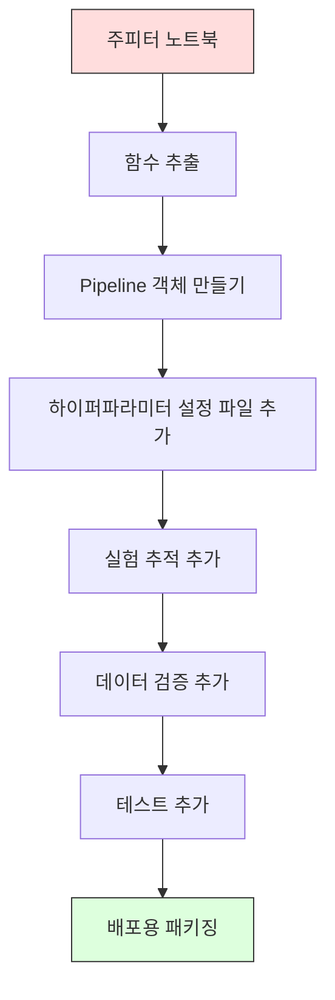

# ML 파이프라인

> 🇰🇷 이 문서는 한국어 번역본입니다(ELI5 스타일). 원문: [en.md](en.md)

> 모델은 제품이 아닙니다. 파이프라인이 제품입니다. 파이프라인은 원시 데이터에서 배포된 예측에 이르는 모든 것이며, 모든 단계는 재현 가능해야 합니다.

**유형:** 빌드
**언어:** Python
**선수 지식:** 페이즈 2, 레슨 12(하이퍼파라미터 튜닝)
**시간:** 약 120분

## 학습 목표

- 결측치 대체, 스케일링, 인코딩, 모델 학습을 하나의 재현 가능한 객체로 묶는 ML 파이프라인을 직접 만들 수 있습니다
- 데이터 누수 시나리오를 식별하고, 파이프라인이 트랜스포머를 학습 데이터에만 피팅함으로써 어떻게 누수를 막는지 설명할 수 있습니다
- 수치형 특성(feature)과 범주형 특성에 서로 다른 전처리를 적용하는 ColumnTransformer를 만들 수 있습니다
- 파이프라인 직렬화를 구현하고, 같은 피팅된 파이프라인이 학습 환경과 프로덕션(운영 환경)에서 동일한 결과를 내는 것을 확인할 수 있습니다

## 문제 상황

데이터를 불러오고, 결측치를 중간값으로 채우고, 특성을 스케일링하고, 모델을 학습시키고, 정확도를 출력하는 노트북이 있습니다. 잘 동작합니다. 출시합니다.

한 달 뒤, 누군가 모델을 재학습시켰는데 다른 결과가 나옵니다. 중간값이 테스트 데이터를 포함한 전체 데이터셋에서 계산됐던 것입니다(데이터 누수). 스케일링 파라미터가 저장되지 않아 추론 때는 다른 통계값을 씁니다. 특성 엔지니어링 코드가 학습과 서빙 사이에 복사-붙여넣기 되어 있었고, 두 사본이 서로 어긋나 버렸습니다. 프로덕션에서 범주형 컬럼에 인코더가 본 적 없는 새 값이 등장했습니다.

이런 일은 가정의 산물이 아닙니다. 프로덕션에서 ML 시스템이 실패하는 가장 흔한 이유들입니다. 파이프라인은 모든 변환 단계를 하나의 순서 있는 재현 가능한 객체로 묶어서 이 문제들을 전부 해결합니다.

## 개념

### 파이프라인이란

파이프라인은 데이터 변환들의 순서 있는 나열과 그 뒤에 붙는 모델입니다. 각 단계는 이전 단계의 출력을 입력으로 받습니다. 파이프라인 전체는 학습 데이터로 딱 한 번 피팅됩니다. 추론 시점에는 같은 피팅된 파이프라인이 새 데이터를 변환하고 예측을 만들어 냅니다.


파이프라인이 보장하는 것:
- 변환은 학습 데이터에만 피팅된다(누수 없음)
- 추론 시점에 같은 변환이 적용된다
- 객체 전체를 직렬화해 산출물 하나로 배포할 수 있다
- 교차 검증은 폴드마다 파이프라인을 적용하므로, 미묘한 누수를 막아 준다

### 데이터 누수: 조용한 살인자

데이터 누수는 테스트 세트나 미래 데이터의 정보가 학습을 오염시킬 때 일어납니다. 파이프라인은 가장 흔한 형태의 누수를 막아 줍니다.

**누수되는(잘못된) 코드:**
```python
X = df.drop("target", axis=1)
y = df["target"]

scaler = StandardScaler()
X_scaled = scaler.fit_transform(X)

X_train, X_test = X_scaled[:800], X_scaled[800:]
y_train, y_test = y[:800], y[800:]
```

스케일러가 테스트 데이터를 봤습니다. 평균과 표준편차에 테스트 샘플이 섞여 있습니다. 이러면 정확도 추정치가 부풀려집니다.

**올바른 코드:**
```python
X_train, X_test = X[:800], X[800:]

scaler = StandardScaler()
X_train_scaled = scaler.fit_transform(X_train)
X_test_scaled = scaler.transform(X_test)
```

파이프라인을 쓰면 이런 걸 신경 쓸 필요가 없습니다. 파이프라인이 자동으로 처리해 줍니다.

### sklearn Pipeline

sklearn의 `Pipeline`은 트랜스포머들과 추정기(estimator)를 연결합니다. 모든 단계를 순서대로 적용하는 `.fit()`, `.predict()`, `.score()`를 제공합니다.

```python
from sklearn.pipeline import Pipeline
from sklearn.preprocessing import StandardScaler
from sklearn.linear_model import LogisticRegression

pipe = Pipeline([
    ("scaler", StandardScaler()),
    ("model", LogisticRegression()),
])

pipe.fit(X_train, y_train)
predictions = pipe.predict(X_test)
```

`pipe.fit(X_train, y_train)`을 호출하면:
1. 스케일러가 X_train에 `fit_transform`을 호출합니다
2. 모델이 스케일된 X_train에 `fit`을 호출합니다

`pipe.predict(X_test)`를 호출하면:
1. 스케일러가 X_test에 `transform`을 호출합니다(fit_transform이 아님)
2. 모델이 스케일된 X_test에 `predict`를 호출합니다

피팅하는 동안 스케일러는 테스트 데이터를 절대 보지 못합니다. 이게 파이프라인의 핵심입니다.

### ColumnTransformer: 컬럼마다 다른 파이프라인

실제 데이터셋에는 서로 다른 전처리가 필요한 수치형 컬럼과 범주형 컬럼이 섞여 있습니다. `ColumnTransformer`가 이걸 처리합니다.

```python
from sklearn.compose import ColumnTransformer
from sklearn.preprocessing import StandardScaler, OneHotEncoder
from sklearn.impute import SimpleImputer

numeric_pipe = Pipeline([
    ("impute", SimpleImputer(strategy="median")),
    ("scale", StandardScaler()),
])

categorical_pipe = Pipeline([
    ("impute", SimpleImputer(strategy="most_frequent")),
    ("encode", OneHotEncoder(handle_unknown="ignore")),
])

preprocessor = ColumnTransformer([
    ("num", numeric_pipe, ["age", "income", "score"]),
    ("cat", categorical_pipe, ["city", "gender", "plan"]),
])

full_pipeline = Pipeline([
    ("preprocess", preprocessor),
    ("model", GradientBoostingClassifier()),
])
```

OneHotEncoder의 `handle_unknown="ignore"`는 프로덕션에서 매우 중요합니다. 새 범주가 등장해도(모델이 본 적 없는 도시 등) 크래시 대신 영벡터를 만들어 냅니다.

### 실험 추적

파이프라인이 학습을 재현 가능하게 만들어 주지만, 실험 사이에서 무슨 일이 있었는지 추적할 필요도 있습니다. 어떤 하이퍼파라미터를 썼는지, 어떤 데이터셋 버전인지, 지표는 얼마였는지, 어떤 코드가 돌고 있었는지요.

**MLflow**가 가장 흔한 오픈소스 해법입니다:

```python
import mlflow

with mlflow.start_run():
    mlflow.log_param("max_depth", 5)
    mlflow.log_param("n_estimators", 100)
    mlflow.log_param("learning_rate", 0.1)

    pipe.fit(X_train, y_train)
    accuracy = pipe.score(X_test, y_test)

    mlflow.log_metric("accuracy", accuracy)
    mlflow.sklearn.log_model(pipe, "model")
```

모든 실행(run)은 파라미터, 지표, 산출물, 전체 모델과 함께 기록됩니다. 실행끼리 비교하고, 어떤 실험이든 재현하고, 어떤 모델 버전이든 배포할 수 있습니다.

**Weights & Biases(wandb)**는 호스팅 대시보드와 함께 같은 기능을 제공합니다:

```python
import wandb

wandb.init(project="my-pipeline")
wandb.config.update({"max_depth": 5, "n_estimators": 100})

pipe.fit(X_train, y_train)
accuracy = pipe.score(X_test, y_test)

wandb.log({"accuracy": accuracy})
```

### 모델 버전 관리

실험 추적 다음에는 모델 버전을 관리해야 합니다. 어떤 모델이 프로덕션에 있나? 어떤 게 스테이징에 있나? 지난주 것은 어느 것이었나?

MLflow의 Model Registry가 제공하는 것:
- **버전 추적:** 저장된 모델마다 버전 번호가 붙습니다
- **단계 전환:** "Staging", "Production", "Archived"
- **승인 워크플로:** 모델은 명시적으로 승격돼야 프로덕션에 들어갑니다
- **롤백:** 이전 버전으로 즉시 되돌릴 수 있습니다

### DVC로 데이터 버전 관리

코드는 git으로 버전 관리합니다. 데이터도 버전 관리해야 하지만 git은 대용량 파일을 감당하지 못합니다. DVC(Data Version Control)가 이 문제를 해결합니다.

```
dvc init
dvc add data/training.csv
git add data/training.csv.dvc data/.gitignore
git commit -m "Track training data"
dvc push
```

DVC는 실제 데이터를 원격 저장소(S3, GCS, Azure)에 저장하고, 해시를 기록한 작은 `.dvc` 파일만 git에 남깁니다. git 커밋을 체크아웃하면 `dvc checkout`이 그때 쓰였던 정확한 데이터를 복원해 줍니다.

즉, 모든 git 커밋이 코드와 데이터를 함께 고정(pin)합니다. 완전한 재현성입니다.

### 재현 가능한 실험

재현 가능한 실험에는 네 가지가 필요합니다:

1. **고정된 랜덤 시드:** numpy, random, 프레임워크(torch, sklearn)의 시드를 설정합니다
2. **고정된 의존성:** 정확한 버전이 적힌 requirements.txt 또는 poetry.lock
3. **버전 관리되는 데이터:** DVC 또는 유사 도구
4. **설정 파일:** 모든 하이퍼파라미터는 설정에 담고, 코드에 하드코딩하지 않습니다

```python
import numpy as np
import random

def set_seed(seed=42):
    random.seed(seed)
    np.random.seed(seed)
    try:
        import torch
        torch.manual_seed(seed)
        torch.cuda.manual_seed_all(seed)
        torch.backends.cudnn.deterministic = True
    except ImportError:
        pass
```

### 노트북에서 프로덕션 파이프라인까지



전형적인 발전 과정:

1. **노트북 탐색:** 빠른 실험, 시각화, 특성 아이디어
2. **함수 추출:** 전처리, 특성 엔지니어링, 평가를 모듈로 옮깁니다
3. **파이프라인 만들기:** 변환들을 sklearn Pipeline이나 커스텀 클래스로 연결합니다
4. **설정 관리:** 모든 하이퍼파라미터를 YAML/JSON 설정으로 옮깁니다
5. **실험 추적:** MLflow나 wandb 로깅을 추가합니다
6. **데이터 검증:** 학습 전에 스키마, 분포, 결측치 패턴을 점검합니다
7. **테스트:** 트랜스포머 단위 테스트, 전체 파이프라인 통합 테스트
8. **배포:** 파이프라인을 직렬화하고 API(FastAPI, Flask)로 감싸고 컨테이너화합니다

### 파이프라인의 흔한 실수

| 실수 | 왜 나쁜가 | 해결책 |
|---------|-------------|-----|
| 분할 전에 전체 데이터로 피팅 | 데이터 누수 | cross_val_score와 함께 Pipeline 사용 |
| 파이프라인 밖에서 특성 엔지니어링 | 학습과 서빙에서 변환이 달라짐 | 모든 변환을 Pipeline 안에 |
| 미지의 범주 미처리 | 프로덕션에서 새 값 등장 시 크래시 | OneHotEncoder(handle_unknown="ignore") |
| 하드코딩된 컬럼 이름 | 스키마가 바뀌면 깨짐 | 설정 파일의 컬럼 이름 목록 사용 |
| 데이터 검증 부재 | 나쁜 데이터에서 조용히 잘못된 예측 | 예측 전 스키마 검사 추가 |
| 학습/서빙 불일치(skew) | 프로덕션에서 모델이 다른 특성을 봄 | 양쪽에 하나의 Pipeline 객체 사용 |

```figure
f3-pipeline-flow
```

## 직접 만들기

`code/pipeline.py`의 코드는 완전한 ML 파이프라인을 직접 만듭니다:

### 단계 1: 커스텀 트랜스포머

```python
class CustomTransformer:
    def __init__(self):
        self.means = None
        self.stds = None

    def fit(self, X):
        self.means = np.mean(X, axis=0)
        self.stds = np.std(X, axis=0)
        self.stds[self.stds == 0] = 1.0
        return self

    def transform(self, X):
        return (X - self.means) / self.stds

    def fit_transform(self, X):
        return self.fit(X).transform(X)
```

### 단계 2: 파이프라인 직접 구현

```python
class PipelineFromScratch:
    def __init__(self, steps):
        self.steps = steps

    def fit(self, X, y=None):
        X_current = X.copy()
        for name, step in self.steps[:-1]:
            X_current = step.fit_transform(X_current)
        name, model = self.steps[-1]
        model.fit(X_current, y)
        return self

    def predict(self, X):
        X_current = X.copy()
        for name, step in self.steps[:-1]:
            X_current = step.transform(X_current)
        name, model = self.steps[-1]
        return model.predict(X_current)
```

### 단계 3: 파이프라인과 함께 교차 검증

이 코드는 파이프라인과 함께 쓴 교차 검증이 어떻게 데이터 누수를 막는지 보여 줍니다. 스케일러가 각 폴드의 학습 데이터마다 따로 피팅됩니다.

### 단계 4: sklearn으로 완전한 프로덕션 파이프라인

`ColumnTransformer`, 여러 전처리 경로, 모델을 갖춘 완전한 파이프라인을 적절한 교차 검증과 실험 로깅으로 학습합니다.

## 출시하기

이 레슨이 만드는 것:
- `outputs/prompt-ml-pipeline.md` -- ML 파이프라인을 만들고 디버깅하기 위한 스킬
- `code/pipeline.py` -- 직접 구현부터 sklearn까지 완주하는 완전한 파이프라인

## 연습 문제

1. 수치형 컬럼 3개와 범주형 컬럼 2개가 있는 데이터셋을 다루는 파이프라인을 만드세요. `ColumnTransformer`로 수치형에는 중간값 대체 + 스케일링을, 범주형에는 최빈값 대체 + 원-핫 인코딩을 적용합니다. 5-폴드 교차 검증으로 학습하세요.

2. 일부러 데이터 누수를 만들어 보세요. 분할 전에 전체 데이터셋으로 스케일러를 피팅합니다. 교차 검증 점수(누수된 것)와 파이프라인 교차 검증 점수(깨끗한 것)를 비교해 보세요. 차이는 얼마나 되나요?

3. `joblib.dump`로 파이프라인을 직렬화하세요. 별도의 스크립트에서 불러와 예측을 실행하고, 예측이 동일한지 확인하세요.

4. 가장 중요한 수치형 컬럼 두 개에 대해 다항 특성(차수 2)을 만드는 커스텀 트랜스포머를 파이프라인에 추가하세요. 파이프라인의 어느 위치에 들어가야 할까요?

5. 파이프라인에 MLflow 추적을 설정하세요. 하이퍼파라미터를 다르게 해서 5번의 실험을 돌립니다. MLflow UI(`mlflow ui`)로 실행들을 비교하고 최고의 모델을 고르세요.

## 핵심 용어

| 용어 | 사람들이 말하는 것 | 실제 의미 |
|------|----------------|----------------------|
| 파이프라인 | "변환들의 사슬 + 모델" | 피팅된 트랜스포머들과 모델의 순서 있는 나열로, 하나의 단위로 적용되어 누수를 막음 |
| 데이터 누수 | "테스트 정보가 학습에 새어 들어감" | 학습 세트 바깥의 정보를 사용해 모델을 만들어 성능 추정치를 부풀리는 것 |
| ColumnTransformer | "컬럼마다 다른 전처리" | 컬럼의 부분집합마다 다른 파이프라인을 적용하고 결과를 합침 |
| 실험 추적 | "실행 로그 남기기" | 학습 실행마다 파라미터, 지표, 산출물, 코드 버전을 기록하는 것 |
| MLflow | "모델 추적과 배포" | 실험 추적, 모델 레지스트리, 배포를 위한 오픈소스 플랫폼 |
| DVC | "데이터를 위한 git" | 대용량 데이터 파일용 버전 관리 시스템. 해시는 git에, 데이터는 원격 저장소에 저장 |
| 모델 레지스트리 | "모델 버전 목록" | 단계 레이블(staging, production, archived)과 함께 모델 버전을 추적하는 시스템 |
| 학습/서빙 불일치(skew) | "노트북에서는 됐는데" | 학습 때와 추론 때 데이터가 처리되는 방식의 차이로, 조용한 오류를 일으킴 |
| 재현성 | "같은 코드, 같은 결과" | 같은 코드, 데이터, 설정으로 동일한 결과를 얻는 능력 |

## 더 읽을거리

- [scikit-learn Pipeline docs](https://scikit-learn.org/stable/modules/compose.html) -- 공식 파이프라인 레퍼런스
- [MLflow documentation](https://mlflow.org/docs/latest/index.html) -- 실험 추적과 모델 레지스트리
- [DVC documentation](https://dvc.org/doc) -- 데이터 버전 관리
- [Sculley et al., Hidden Technical Debt in Machine Learning Systems (2015)](https://papers.nips.cc/paper/2015/hash/86df7dcfd896fcaf2674f757a2463eba-Abstract.html) -- ML 시스템 복잡성에 관한 기념비적인 논문
- [Google ML Best Practices: Rules of ML](https://developers.google.com/machine-learning/guides/rules-of-ml) -- 실전 프로덕션 ML 조언
