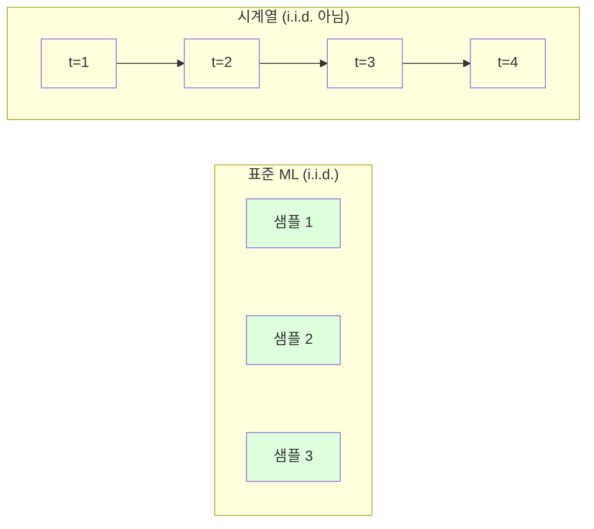
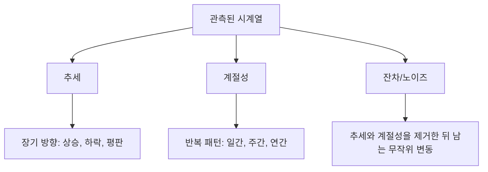
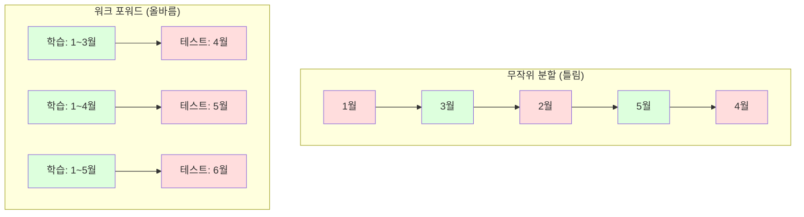

# 시계열 기초

> 🇰🇷 이 문서는 한국어 번역본입니다(ELI5 스타일). 원문: [en.md](en.md)

> 과거 성과는 미래 결과를 예측합니다 -- 단, 정상성(stationarity)을 먼저 확인했다면요.

**유형:** 빌드
**언어:** Python
**선수 지식:** 페이즈 2, 레슨 01~09
**시간:** 약 90분

## 학습 목표

- 시계열을 추세, 계절성, 잔차 성분으로 분해하고 정상성을 검사할 수 있습니다
- 시차(lag) 특성(feature)과 롤링 통계량을 구현해 시계열을 지도 학습 문제로 바꿀 수 있습니다
- 미래 데이터가 학습으로 새어 들지 않게 막는 워크 포워드(walk-forward) 검증 프레임워크를 만들 수 있습니다
- 무작위 학습/테스트 분할이 시계열에 왜 무효한지 설명하고, 올바른 시간 기반 분할과의 성능 격차를 직접 보여 줄 수 있습니다

## 문제 상황

시간 순서로 정렬된 데이터가 있습니다. 일별 매출, 시간별 기온, 분 단위 CPU 사용량, 주별 주가. 다음 값, 다음 주, 다음 분기를 예측하고 싶습니다.

평소의 ML 도구를 꺼냅니다. 무작위 학습/테스트 분할, 교차 검증, 특성 행렬을 넣으면 예측이 나오는 그 틀이요. 그런데 모든 단계가 틀렸습니다.

시계열은 표준 ML이 의존하는 가정을 깨뜨립니다. 샘플이 독립이 아닙니다 -- 오늘 기온은 어제 기온에 의존합니다. 무작위 분할은 미래 정보를 과거로 새어 들게 합니다. 백테스트에서 멋져 보이던 특성이 프로덕션(운영 환경)에서 실패하는 이유는, 시간이 흐르며 변하는 패턴에 의존하기 때문입니다.

무작위 교차 검증에서 95% 정확도를 내던 모델이 올바른 시간 기반 평가에서는 55%를 받을 수도 있습니다. 이 차이는 사소한 기술적 문제가 아닙니다. 종이 위에서만 되는 모델과 실전에서 되는 모델의 차이입니다.

이 레슨은 기초를 다룹니다. 시간 데이터가 뭐가 다른지, 모델을 어떻게 정직하게 평가하는지, 시계열을 표준 ML 모델이 소화할 수 있는 특성으로 어떻게 바꾸는지입니다.

## 개념

### 시계열이 다른 이유

표준 ML은 i.i.d.(독립이면서 동일한 분포)를 가정합니다. 각 샘플은 다른 샘플과 독립적으로, 같은 분포에서 뽑힙니다. 시계열은 둘 다 위반합니다:

- **독립이 아님.** 오늘의 주가는 어제의 주가에 의존합니다. 이번 주 매출은 지난주 매출과 상관됩니다.
- **동일 분포가 아님.** 분포가 시간에 따라 이동합니다. 12월 매출은 3월 매출과 다르게 보입니다.

이 위반은 가볍지 않습니다. 특성을 만드는 방식, 모델을 평가하는 방식, 어떤 알고리즘이 통하는지가 모두 달라집니다.



표준 ML에서 샘플은 서로 맞바꿀 수 있습니다. 섞어도 아무것도 바뀌지 않습니다. 시계열에서는 순서가 전부입니다. 섞는 순간 신호가 파괴됩니다.

### 시계열의 구성 요소

모든 시계열은 다음의 조합입니다:



- **추세(trend)**: 장기 방향입니다. 매출이 매년 10%씩 성장. 전 지구 기온 상승.
- **계절성(seasonality)**: 고정된 주기로 반복되는 패턴입니다. 소매 매출은 12월에 급증. 에어컨 사용량은 7월에 정점.
- **잔차(residual)**: 추세와 계절성을 제거한 뒤 남는 것입니다. 잔차가 백색 잡음처럼 보이면 분해가 신호를 잘 잡아낸 것입니다.

### 정상성

시계열의 통계적 성질(평균, 분산, 자기상관)이 시간이 지나도 변하지 않으면 정상(stationary)입니다. 대부분의 예측 방법은 정상성을 가정합니다.

**중요한 이유:** 비정상 시계열은 평균이 흘러갑니다(drift). 1월 데이터로 학습한 모델은 2월이 보여 줄 평균과 다른 평균을 배운 것입니다. 체계적으로 틀리겠죠.

**확인 방법:** 윈도우별 롤링 평균과 롤링 표준편차를 계산합니다. 흘러간다면 비정상입니다.

**해결 방법:** 차분(differencing). 원시값 대신 연속한 값 사이의 변화를 모델링합니다:

```
diff[t] = value[t] - value[t-1]
```

차분 한 번으로 정상이 되지 않으면 다시 적용합니다(2차 차분). 실제 시계열 대부분은 두 번이면 충분합니다.

**예제:**

원본 계열: [100, 102, 106, 112, 120]
1차 차분:  [2, 4, 6, 8] (여전히 상승 추세)
2차 차분:  [2, 2, 2] (상수 -- 정상)

원본 계열은 2차(이차 함수) 추세를 갖고 있었습니다. 1차 차분으로 선형 추세가 됐고, 2차 차분으로 평평해졌습니다. 실전에서는 두 번 이상 필요한 경우가 드뭅니다.

**정식 검정:** ADF(Augmented Dickey-Fuller) 검정이 정상성의 표준 통계 검정입니다. 귀무가설은 "이 계열은 비정상이다"입니다. p-값이 0.05보다 낮으면 귀무가설을 기각하고 정상성이라 결론 내릴 수 있습니다. 우리는 ADF를 직접 구현하지 않습니다(점근 분포 표가 필요합니다). 하지만 코드의 롤링 통계량 접근이 실용적인 시각적 검사를 제공합니다.

### 자기상관

자기상관은 시각 t의 값이 t-k(과거 k스텝)의 값과 얼마나 상관되는지를 측정합니다. 자기상관 함수(ACF)는 각 시차 k에 대해 이 상관을 그래프로 그립니다.

**ACF가 알려 주는 것:**
- 계열이 얼마나 먼 과거까지 기억하는지. 시차 5 이후 ACF가 0으로 떨어지면 5스텝보다 오래된 값은 무관합니다.
- 계절성이 존재하는지. 시차 12에서 ACF가 튀면(월별 데이터) 연간 계절성이 있습니다.
- 시차 특성을 몇 개 만들지. ACF가 무시할 수준이 되기 전까지의 시차를 사용하세요.

**PACF(편자기상관 함수)**는 간접 상관을 제거합니다. 오늘이 3일 전과 상관된 것이 둘 다 어제와 상관되기 때문이라면, 시차 3의 PACF는 0이지만 시차 3의 ACF는 0이 아닙니다.

### 시차 특성: 시계열을 지도 학습으로 바꾸기

표준 ML 모델은 특성 행렬 X와 타깃 y가 필요합니다. 시계열은 값 한 컬럼만 줍니다. 그 다리를 놓아 주는 것이 시차(lag) 특성입니다.

계열 [10, 12, 14, 13, 15]에서 lag-1과 lag-2 특성을 만들면:

| lag_2 | lag_1 | 타깃 |
|-------|-------|--------|
| 10    | 12    | 14     |
| 12    | 14    | 13     |
| 14    | 13    | 15     |

이제 표준 회귀 문제가 됩니다. 어떤 ML 모델이든(선형 회귀, 랜덤 포레스트, 그래디언트 부스팅) 시차들로 타깃을 예측할 수 있습니다.

추가로 만들 수 있는 특성:
- **롤링 통계량:** 최근 k개 값에 대한 평균, 표준편차, 최솟값, 최댓값
- **달력 특성:** 요일, 월, is_holiday, is_weekend
- **차분 값:** 이전 스텝 대비 변화
- **확장 통계량:** 누적 평균, 누적 합
- **비율 특성:** 현재 값 / 롤링 평균(최근 평균에서 얼마나 벗어났는가)
- **상호작용 특성:** lag_1 * day_of_week(요일이 모멘텀에 주는 효과)

**시차는 몇 개?** 자기상관 함수를 사용하세요. 시차 10까지 ACF가 유의하면 최소 10개의 시차를 쓰세요. 주간 계절성이 있다면 시차 7(그리고 어쩌면 14)을 포함하세요. 시차가 많을수록 모델에게 더 많은 역사를 주지만, 피팅할 특성도 늘어나 과적합 위험이 커집니다.

**타깃 정렬의 함정.** 시차 특성을 만들 때 타깃은 반드시 시각 t의 값이어야 하고, 모든 특성은 시각 t-1 이하의 값을 사용해야 합니다. 실수로 시각 t의 값을 특성에 넣으면 완벽한 예측자, 그리고 완전히 쓸모없는 모델이 됩니다. 이것이 시계열 특성 엔지니어링에서 가장 흔한 버그입니다.

### 워크 포워드 검증

이 레슨에서 가장 중요한 개념입니다. 표준 k-폴드 교차 검증은 샘플을 학습과 테스트에 무작위로 배정합니다. 시계열에서 이것은 미래 정보를 새어 들게 합니다.



워크 포워드 검증:
1. 시각 t까지의 데이터로 학습
2. 시각 t+1에서 예측(다중 스텝이면 t+1~t+k)
3. 윈도우를 앞으로 민다
4. 반복

각 테스트 폴드는 모든 학습 데이터보다 뒤에 오는 데이터만 담습니다. 미래 누수가 없습니다. 배포될 때 모델이 어떻게 수행할지에 대한 정직한 추정치를 얻습니다.

**확장 윈도우(expanding window)**는 모든 과거 데이터를 학습에 씁니다(윈도우가 커짐). **슬라이딩 윈도우(sliding window)**는 고정 크기 학습 윈도우를 씁니다(윈도우가 미끄러져 감). 오래된 데이터도 여전히 관련이 있다고 믿으면 확장을, 세상이 변해서 오래된 데이터가 해가 된다면 슬라이딩을 쓰세요.

### ARIMA 직관

ARIMA는 클래식한 시계열 모델입니다. 세 가지 구성 요소가 있습니다:

- **AR(자기회귀):** 과거 값들로 예측합니다. AR(p)는 최근 p개 값을 사용합니다.
- **I(적분):** 정상성을 얻기 위한 차분입니다. I(d)는 차분 d회를 적용합니다.
- **MA(이동 평균):** 과거 예측 오차로 예측합니다. MA(q)는 최근 q개 오차를 사용합니다.

ARIMA(p, d, q)는 셋을 결합합니다. p, d, q는 ACF/PACF 분석이나 자동 탐색(auto-ARIMA)으로 고릅니다.

우리는 ARIMA를 직접 구현하지 않습니다. 이 레슨 범위를 넘어서는 수치 최적화가 필요합니다. 핵심은 각 구성 요소가 무엇을 하는지 이해해서, ARIMA 결과를 해석하고 언제 쓸지 아는 것입니다.

### 무엇을 언제 쓸까

| 접근법 | 가장 잘 맞는 것 | 계절성 처리 | 외부 특성 처리 |
|----------|---------|-------------------|------------------------|
| 시차 특성 + ML | 외부 특성이 많은 표 형태 데이터 | 달력 특성으로 가능 | 예 |
| ARIMA | 단일 단변량 계열, 단기 | SARIMA 변형 | 아니오(제한적으로는 ARIMAX) |
| 지수 평활 | 단순한 추세 + 계절성 | 예(Holt-Winters) | 아니오 |
| Prophet | 비즈니스 예측, 휴일 | 예(Fourier 항) | 제한적 |
| 신경망(LSTM, 트랜스포머) | 긴 시퀀스, 다중 계열 | 학습해서 처리 | 예 |

대부분의 실전 문제에서 시차 특성 + 그래디언트 부스팅이 가장 강한 출발점입니다. 외부 특성을 자연스럽게 다루고, 정상성을 요구하지 않으며, 디버깅이 쉽습니다.

### 예측 범위(horizon)와 전략

단일 스텝 예측은 한 스텝 앞을 예측합니다. 다중 스텝 예측은 여러 스텝을 예측합니다. 전략은 세 가지입니다:

**재귀적(recursive, 반복형):** 한 스텝 앞을 예측하고, 그 예측을 다음 스텝의 입력으로 씁니다. 단순하지만 오차가 누적됩니다. 각 예측이 이전 예측을 사용하므로 실수가 증폭됩니다.

**직접(direct):** 각 예측 범위마다 별도의 모델을 학습합니다. 모델-1은 t+1을, 모델-5는 t+5를 예측합니다. 오차 누적은 없지만 각 모델의 학습 샘플이 적고 정보를 공유하지 못합니다.

**다중 출력(multi-output):** 모든 범위를 동시에 출력하는 모델 하나를 학습합니다. 범위들 사이에 정보를 공유하지만 다중 출력을 지원하는 모델(또는 커스텀 손실 함수)이 필요합니다.

대부분의 실전 문제에서는 짧은 범위(1~5스텝)는 재귀로, 더 긴 범위는 직접 방식으로 시작하세요.

### 시계열의 흔한 실수

| 실수 | 왜 일어나나 | 해결 방법 |
|---------|---------------|-----------|
| 무작위 학습/테스트 분할 | 표준 ML에서 온 습관 | 워크 포워드 또는 시간 기반 분할 사용 |
| 미래 특성 사용 | 시각 t의 특성이 실수로 포함됨 | 모든 특성의 시간 정렬을 감사 |
| 계절성에 과적합 | 모델이 달력 패턴을 암기 | 테스트 세트에 계절 주기를 온전히 하나 확보 |
| 스케일 변화 무시 | 매출은 두 배인데 패턴은 그대로 | 절댓값 대신 변화율 모델링 |
| 너무 많은 시차 특성 | "역사는 많을수록 좋다" | ACF로 관련 시차 결정 |
| 차분 안 함 | "모델이 알아서 하겠지" | 트리 모델은 추세 처리 가능, 선형 모델은 정상성 필요 |

```figure
f3-series-decompose
```

## 직접 만들기

`code/time_series.py`의 코드는 핵심 빌딩 블록을 직접 구현합니다.

### 시차 특성 생성기

```python
def make_lag_features(series, n_lags):
    n = len(series)
    X = np.full((n, n_lags), np.nan)
    for lag in range(1, n_lags + 1):
        X[lag:, lag - 1] = series[:-lag]
    valid = ~np.isnan(X).any(axis=1)
    return X[valid], series[valid]
```

이 함수는 1차원 계열을 특성 행렬로 바꿉니다. 각 행은 마지막 `n_lags`개 값을 특성으로, 현재 값을 타깃으로 갖습니다.

### 워크 포워드 교차 검증

```python
def walk_forward_split(n_samples, n_splits=5, min_train=50):
    assert min_train < n_samples, "min_train must be less than n_samples"
    step = max(1, (n_samples - min_train) // n_splits)
    for i in range(n_splits):
        train_end = min_train + i * step
        test_end = min(train_end + step, n_samples)
        if train_end >= n_samples:
            break
        yield slice(0, train_end), slice(train_end, test_end)
```

각 분할은 학습 데이터가 테스트 데이터보다 엄격히 앞서도록 보장합니다. 학습 윈도우는 폴드마다 확장됩니다.

### 단순 자기회귀 모델

순수 AR 모델은 그저 시차 특성에 대한 선형 회귀입니다:

```python
class SimpleAR:
    def __init__(self, n_lags=5):
        self.n_lags = n_lags
        self.weights = None
        self.bias = None

    def fit(self, series):
        X, y = make_lag_features(series, self.n_lags)
        # 정규 방정식으로 풀기
        X_b = np.column_stack([np.ones(len(X)), X])
        theta = np.linalg.lstsq(X_b, y, rcond=None)[0]
        self.bias = theta[0]
        self.weights = theta[1:]
        return self
```

개념적으로는 레슨 02의 선형 회귀와 동일하지만, 같은 변수의 시간 지연 버전들에 적용한 것입니다.

### 정상성 검사

코드는 롤링 통계량을 계산해 정상성을 시각적·수치적으로 평가합니다:

```python
def check_stationarity(series, window=50):
    rolling_mean = np.array([
        series[max(0, i - window):i].mean()
        for i in range(1, len(series) + 1)
    ])
    rolling_std = np.array([
        series[max(0, i - window):i].std()
        for i in range(1, len(series) + 1)
    ])
    return rolling_mean, rolling_std
```

롤링 평균이 흘러가거나 롤링 표준편차가 변하면 비정상입니다. 차분을 적용하고 다시 검사하세요.

코드는 또한 계열의 전반부와 후반부를 비교해 정상성을 검사합니다. 평균이 표준편차의 절반보다 크게 다르거나 분산 비율이 2배를 넘으면 비정상으로 표시됩니다.

### 자기상관

```python
def autocorrelation(series, max_lag=20):
    n = len(series)
    mean = series.mean()
    var = series.var()
    acf = np.zeros(max_lag + 1)
    for k in range(max_lag + 1):
        cov = np.mean((series[:n-k] - mean) * (series[k:] - mean))
        acf[k] = cov / var if var > 0 else 0
    return acf
```

## 실전 활용

sklearn에서는 시차 특성을 어떤 회귀기에든 바로 쓸 수 있습니다:

```python
from sklearn.linear_model import Ridge
from sklearn.ensemble import GradientBoostingRegressor

X, y = make_lag_features(series, n_lags=10)

for train_idx, test_idx in walk_forward_split(len(X)):
    model = Ridge(alpha=1.0)
    model.fit(X[train_idx], y[train_idx])
    predictions = model.predict(X[test_idx])
```

ARIMA는 statsmodels를 사용합니다:

```python
from statsmodels.tsa.arima.model import ARIMA

model = ARIMA(train_series, order=(5, 1, 2))
fitted = model.fit()
forecast = fitted.forecast(steps=30)
```

`time_series.py`의 코드는 두 접근법을 모두 보여 주고 워크 포워드 검증으로 비교합니다.

### sklearn TimeSeriesSplit

sklearn은 워크 포워드 검증을 구현한 `TimeSeriesSplit`을 제공합니다:

```python
from sklearn.model_selection import TimeSeriesSplit

tscv = TimeSeriesSplit(n_splits=5)
for train_index, test_index in tscv.split(X):
    X_train, X_test = X[train_index], X[test_index]
    y_train, y_test = y[train_index], y[test_index]
    model.fit(X_train, y_train)
    score = model.score(X_test, y_test)
```

이것은 우리가 직접 만든 `walk_forward_split`과 동등하지만 sklearn의 교차 검증 프레임워크에 통합되어 있습니다. `cross_val_score`와 함께 쓸 수 있습니다:

```python
from sklearn.model_selection import cross_val_score

scores = cross_val_score(model, X, y, cv=TimeSeriesSplit(n_splits=5))
print(f"Mean score: {scores.mean():.4f} +/- {scores.std():.4f}")
```

### 평가 지표

시계열 예측은 회귀 지표를 쓰지만, 시간을 고려한 맥락이 붙습니다:

- **MAE(평균 절대 오차):** |y_true - y_pred|의 평균. 원래 단위로 해석이 쉽습니다. "평균적으로 예측이 3.2도 벗어난다."
- **RMSE(평균 제곱근 오차):** 평균 제곱 오차의 제곱근. 큰 오차를 MAE보다 더 벌점화합니다. 큰 오차가 여러 작은 오차보다 나쁠 때 사용하세요.
- **MAPE(평균 절대 백분율 오차):** |error / true_value| * 100의 평균. 스케일에 독립적이라 서로 다른 계열 비교에 유용합니다. 하지만 실제 값이 0이면 정의되지 않습니다.
- **나이브 베이스라인 비교:** 항상 단순한 베이스라인과 비교하세요. 계절 나이브 베이스라인은 한 주기 전(어제, 지난주)의 값으로 예측합니다. 모델이 나이브를 못 이긴다면 뭔가 잘못된 겁니다.

### 롤링 특성

코드는 시차 특성에 롤링 통계량(7일과 14일 윈도우의 평균, 표준편차, 최솟값, 최댓값)을 추가하는 방법을 보여 줍니다. 시차 특성만으로는 담지 못하는 최근 추세와 변동성 정보를 모델에게 줍니다.

예를 들어 롤링 평균이 상승 중이면 상승 추세를 시사합니다. 롤링 표준편차가 커지면 변동성이 커지고 있음을 시사합니다. 이런 패턴은 트리 기반 모델은 배울 수 있지만 선형 모델은 못 배웁니다.

## 출시하기

이 레슨이 만드는 것:
- `outputs/prompt-time-series-advisor.md` -- 시계열 문제를 구조화하기 위한 프롬프트
- `code/time_series.py` -- 시차 특성, 워크 포워드 검증, AR 모델, 정상성 검사

### 반드시 이겨야 할 베이스라인

모델을 만들기 전에 베이스라인을 세우세요:

1. **마지막 값(지속성, persistence).** 내일이 오늘과 같을 거라고 예측합니다. 많은 계열에서 놀랍도록 이기기 어렵습니다.
2. **계절 나이브(seasonal naive).** 오늘이 지난주 같은 요일(또는 작년 같은 날)과 같을 거라고 예측합니다. 이것을 못 이긴다면 모델은 계절성 너머의 유용한 패턴을 배우지 못한 겁니다.
3. **이동 평균.** 마지막 k개 값의 평균으로 예측합니다. 노이즈를 부드럽게 하지만 갑작스러운 변화는 못 잡습니다.

그럴듯한 ML 모델이 계절 나이브 베이스라인에게 진다면 버그가 있는 겁니다. 가장 흔한 원인: 특성의 미래 누수, 잘못된 평가 방법, 아니면 그 계열이 진짜 무작위라 예측 불가능한 경우입니다.

### 실전 팁

1. **그리기부터 시작.** 어떤 모델링보다 먼저 원시 계열을 그리세요. 추세, 계절성, 이상치, 구조적 변화(행동의 갑작스러운 변화)를 찾으세요. 30초짜리 육안 검사가 한 시간짜리 자동 분석보다 더 많이 말해 주는 경우가 흔합니다.

2. **차분 먼저, 모델링 나중.** 계열에 뚜렷한 추세가 있다면 시차 특성을 만들기 전에 차분하세요. 트리 기반 모델은 추세를 다룰 수 있지만 선형 모델은 못 하고, 차분은 해가 되지 않습니다.

3. **계절 주기를 최소 하나는 온전히 확보.** 주간 계절성이 있다면 테스트 세트에 최소한 온전한 일주일이 필요합니다. 월간이면 최소 온전한 한 달. 아니면 모델이 계절 패턴을 잡았는지 평가할 수 없습니다.

4. **프로덕션에서 모니터링.** 세상이 변하면서 시계열 모델은 시간이 지나면 성능이 떨어집니다. 예측 오차를 롤링 방식으로 추적하세요. 오차가 커지기 시작하면 최근 데이터로 모델을 재학습시키세요.

5. **체제 변화(regime change) 조심.** 팬데믹 이전 데이터로 학습한 모델은 팬데믹 이후 행동을 예측하지 못합니다. 알려진 체제 변화의 지시자를 특성으로 넣거나, 오래된 데이터를 잊는 슬라이딩 윈도우를 사용하세요.

6. **왜곡된 계열은 로그 변환.** 매출, 가격, 개수는 오른쪽으로 치우친 경우가 많습니다. 로그를 취하면 분산이 안정되고 곱셈적 패턴이 덧셈적으로 바뀌어 선형 모델이 다룰 수 있게 됩니다. 로그 공간에서 예측한 뒤 지수 함수로 원래 단위로 되돌리세요.

## 연습 문제

1. **정상성 실험.** 선형 추세가 있는 계열을 생성하세요. 롤링 통계량으로 정상성을 검사하고, 1차 차분을 적용한 뒤 다시 검사하세요. 2차(이차 함수) 추세에는 차분이 몇 번 필요한가요?

2. **시차 선택.** 계절성 계열(period=7)에 ACF를 계산하세요. 어떤 시차들이 자기상관이 가장 높은가요? 그 시차들만으로(연속 시차가 아니라) 시차 특성을 만드세요. 시차 1~7을 쓰는 것과 비교해 정확도가 좋아지나요?

3. **워크 포워드 vs 무작위 분할.** 시차 특성에 Ridge 회귀를 학습시키세요. 무작위 80/20 분할과 워크 포워드 검증으로 평가하세요. 무작위 분할은 성능을 얼마나 과대평가하나요?

4. **특성 엔지니어링.** 시차 특성에 롤링 평균(window=7), 롤링 표준편차(window=7), 요일 특성을 추가하세요. 워크 포워드 검증으로 이것들이 있을 때와 없을 때의 정확도를 비교하세요.

5. **다중 스텝 예측.** AR 모델을 1스텝이 아니라 5스텝 앞을 예측하도록 수정하세요. 두 전략을 비교하세요: (a) 한 스텝 예측 후 그 예측을 다음 입력으로 사용(재귀), (b) 각 범위마다 별도 모델 학습(직접). 어느 쪽이 더 정확한가요?

## 핵심 용어

| 용어 | 사람들이 말하는 것 | 실제 의미 |
|------|----------------|----------------------|
| 정상성 | "통계가 시간이 지나도 안 변함" | 평균, 분산, 자기상관 구조가 시간에 걸쳐 일정한 계열 |
| 차분 | "연속한 값을 빼기" | 추세를 제거하고 정상성을 얻으려고 y[t] - y[t-1]을 계산하는 것 |
| 자기상관(ACF) | "계열이 자기 자신과 상관되는 정도" | 시계열과 그 시간 지연 사본 사이의 상관을, 시차의 함수로 나타낸 것 |
| 편자기상관(PACF) | "직접 상관만" | 더 짧은 모든 시차의 효과를 제거한 뒤의 시차 k 자기상관 |
| 시차 특성 | "과거 값을 입력으로" | y[t]를 예측하려고 y[t-1], y[t-2], ..., y[t-k]를 특성으로 사용 |
| 워크 포워드 검증 | "시간을 존중하는 교차 검증" | 학습 데이터가 항상 시간상 테스트 데이터보다 앞서는 평가 |
| ARIMA | "클래식한 시계열 모델" | AutoRegressive Integrated Moving Average: 과거 값(AR), 차분(I), 과거 오차(MA)를 결합 |
| 계절성 | "반복되는 달력 패턴" | 달력 주기(일간, 주간, 연간)에 묶인 시계열의 규칙적이고 예측 가능한 순환 |
| 추세 | "장기 방향" | 시간이 지나며 계열 수준이 지속적으로 오르거나 내리는 것 |
| 확장 윈도우 | "모든 역사를 사용" | 폴드마다 학습 세트가 커지는 워크 포워드 검증 |
| 슬라이딩 윈도우 | "고정 크기 역사" | 학습 세트가 고정 길이 윈도우로 앞으로 미끄러지는 워크 포워드 검증 |

## 더 읽을거리

- [Hyndman and Athanasopoulos, Forecasting: Principles and Practice (3rd ed.)](https://otexts.com/fpp3/) -- 시계열 예측의 최고 무료 교과서
- [scikit-learn Time Series Split](https://scikit-learn.org/stable/modules/generated/sklearn.model_selection.TimeSeriesSplit.html) -- sklearn의 워크 포워드 분할기
- [statsmodels ARIMA docs](https://www.statsmodels.org/stable/generated/statsmodels.tsa.arima.model.ARIMA.html) -- 진단 기능이 있는 ARIMA 구현
- [Makridakis et al., The M5 Competition (2022)](https://www.sciencedirect.com/science/article/pii/S0169207021001874) -- ML 방법 vs 통계 방법을 보여 준 대규모 예측 대회
