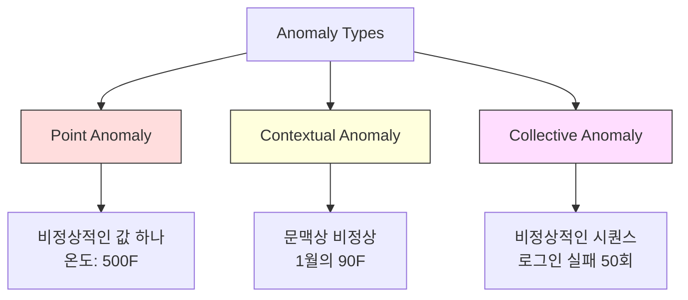
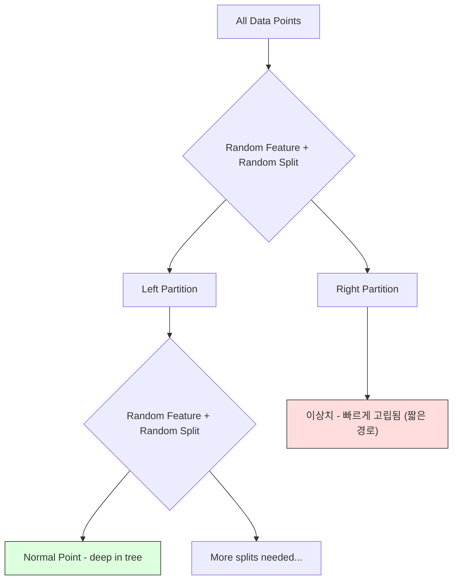
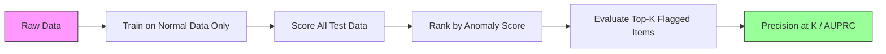

> 🇰🇷 이 문서는 한국어 번역본입니다(ELI5 스타일). 원문: [en.md](en.md)

# 이상 탐지(Anomaly Detection)

> 정상은 정의하기 쉽습니다. 비정상이란 정상에 들어맞지 않는 것 전부입니다.

**유형:** Build
**언어:** Python
**선수 지식:** Phase 2, 레슨 01-09
**시간:** 약 75분

## 학습 목표

- Z-점수(Z-score), IQR(사분위수 범위), Isolation Forest 이상 탐지 기법을 직접 구현하기
- 점 이상치(point anomaly), 문맥적 이상치(contextual anomaly), 집단적 이상치(collective anomaly)를 구분하고 각 유형에 맞는 탐지 방법을 선택하기
- 이상 탐지를 '이상치 분류'가 아니라 '정상 데이터 모델링'으로 접근해야 하는 이유 설명하기
- 비지도 이상 탐지와 지도 학습 분류를 비교하고, 처음 보는 이상치 커버리지와 정밀도 사이의 트레이드오프 평가하기

## 문제 상황

어떤 신용카드가 오후 2시에 뉴욕에서 결제되고, 5분 뒤인 오후 2시 5분에 도쿄에서 결제됩니다. 공장 센서가 평소 범위인 80~120도일 때 150도를 가리킵니다. 하루 평균 요청이 200건인 서버에 초당 50,000건의 요청이 몰려듭니다.

이것들이 이상치(anomaly)입니다. 이것을 찾아내는 일은 중요합니다. 사기는 수십억의 비용을 부르고, 설비 고장은 생산 중단이라는 대가를 치르게 하고, 네트워크 침입은 데이터 유출로 이어집니다.

어려운 점: 이상치에 레이블이 붙은 예시를 갖고 있는 경우는 드뭅니다. 거래의 0.1%만 사기입니다. 설비 고장은 1년에 몇 번 일어나지 않습니다. '이상치' 클래스에 학습할 데이터가 거의 없기 때문에 표준 분류기를 학습시킬 수 없습니다. 레이블이 조금 있더라도, 지금까지 본 이상치가 앞으로 만나게 될 이상치 유형의 전부는 아닙니다. 내일의 사기 수법은 오늘의 것과 다르게 생겼습니다.

이상 탐지는 문제를 뒤집습니다. 무엇이 비정상인지 배우는 대신, 무엇이 정상인지 배웁니다. 정상에서 벗어나는 것은 모두 수상합니다. 이 방식은 레이블 없이도 동작하고, 새로운 유형의 이상치에도 적응하며, 방대한 데이터셋으로 확장할 수 있습니다.

## 개념

### 이상치의 유형

모든 이상치가 똑같지는 않습니다:

- **점 이상치(Point anomalies).** 문맥과 상관없이 그 자체로 특이한 데이터 포인트 하나. 500도를 가리키는 온도 센서. 평소 50달러를 쓰는 계좌에서의 5만 달러 결제.
- **문맥적 이상치(Contextual anomalies).** 주어진 문맥에서 특이한 데이터 포인트. 90도 온도는 여름엔 정상이지만 겨울엔 이상치입니다. 같은 값, 다른 문맥.
- **집단적 이상치(Collective anomalies).** 개별 포인트는 정상일 수 있지만 그룹으로 보면 특이한 데이터 포인트의 나열. 로그인 실패 5회는 정상입니다. 50회 연속이면 무차별 대입 공격입니다.

대부분의 방법은 점 이상치를 탐지합니다. 문맥적 이상치에는 시간이나 위치 특성(feature)이 필요하고, 집단적 이상치에는 시퀀스를 인식하는 방법이 필요합니다.



### 비지도 프레이밍

표준 분류에서는 두 클래스 모두에 레이블이 있습니다. 이상 탐지에서는 보통 다음 세 가지 상황 중 하나에 놓입니다:

1. **완전 비지도.** 레이블이 전혀 없습니다. 모든 데이터에 탐지기를 학습시키고(fit), 이상치가 '정상' 모델을 망가뜨릴 만큼 흔하지 않기를 바랄 뿐입니다.
2. **준지도.** 정상 데이터만으로 이루어진 깨끗한 데이터셋이 있습니다. 이 깨끗한 세트에 학습시키고 나머지 전부에 점수를 매깁니다. 가능하다면 가장 강력한 설정입니다.
3. **약지도.** 레이블 붙은 이상치가 몇 개 있습니다. 이것들은 학습이 아니라 평가에 사용합니다. 비지도로 학습한 뒤, 레이블 붙은 부분집합에서 정밀도/재현율을 측정합니다.

핵심 통찰: 이상 탐지는 분류와 근본적으로 다릅니다. 두 클래스 사이의 결정 경계를 배우는 것이 아니라 정상 데이터의 분포를 모델링하는 것입니다.

### 지도 vs 비지도: 트레이드오프

레이블 붙은 이상치가 있다면, 학습에 쓸까요(지도 학습 분류), 평가에만 쓸까요(비지도 탐지)?

**지도(분류로 취급):**
- 이전에 본 유형의 이상치는 정확히 잡아냅니다
- 알려진 이상치 유형에서 정밀도가 더 높습니다
- 처음 보는 유형의 이상치는 완전히 놓칩니다
- 새로운 이상치 유형이 나타나면 재학습이 필요합니다
- 이상치 예시가 충분히 필요합니다(보통 너무 적습니다)

**비지도(정상 모델링, 벗어나면 표시):**
- 정상에서 벗어나기만 하면 무엇이든 잡아냅니다. 처음 보는 유형도 포함입니다
- 레이블 붙은 이상치가 필요 없습니다
- 거짓 양성(false positive, 오탐) 비율이 높습니다(특이한 것이 모두 나쁜 것은 아닙니다)
- 분포 변화(distribution shift)에 더 강합니다

실전에서 가장 좋은 시스템은 둘을 결합합니다: 폭넓은 커버리지를 위한 비지도 탐지, 알려진 우선순위 높은 이상치 유형을 위한 지도 모델, 애매한 사례를 위한 사람의 검토.

### Z-점수 방법

가장 단순한 접근입니다. 각 특성의 평균과 표준편차를 계산하고, 평균에서 k 표준편차를 벗어난 포인트를 표시합니다.

```text
z_score = (x - mean) / std
anomaly if |z_score| > threshold
```

기본 임계값은 3.0입니다(정규분포(가우시안 분포)에서 정상 데이터의 99.7%는 평균에서 표준편차 3배 안에 들어갑니다).

**강점:** 단순합니다. 빠릅니다. 해석하기 쉽습니다("이 값은 정상에서 표준편차 4.5만큼 떨어져 있습니다").

**약점:** 데이터가 정규분포를 따른다고 가정합니다. 학습 데이터 속 이상치에 민감합니다(이상치가 평균을 밀어내고 표준편차를 부풀려서 자신이 더 잘 숨습니다). 다봉분포(multimodal)에서는 실패합니다.

**잘 동작하는 경우:** 데이터가 대략 종 모양인 단일 특성 모니터링. 서버 응답 시간, 제조 공차, 안정적인 베이스라인을 가진 센서 값.

**실패하는 경우:** 여러 클러스터가 있는 데이터(기준 온도가 다른 두 사무실 위치), 치우친 데이터(1,000달러 거래는 드물지만 이상치는 아닌 거래 금액), 학습 세트에 이상치가 섞인 데이터.

### IQR 방법

Z-점수보다 강건합니다(robust). 평균과 표준편차 대신 사분위수 범위(interquartile range)를 사용합니다.

```
Q1 = 25th percentile
Q3 = 75th percentile
IQR = Q3 - Q1
lower_bound = Q1 - factor * IQR
upper_bound = Q3 + factor * IQR
anomaly if x < lower_bound or x > upper_bound
```

기본 계수(factor)는 1.5입니다.

**강점:** 이상치에 강건합니다(백분위수는 극단값의 영향을 받지 않습니다). 치우친 분포에서도 동작합니다. 정규성 가정이 없습니다.

**약점:** 단변량(univariate) 전용입니다(각 특성에 독립적으로 적용). 특성을 함께 봐야만 이상해지는 이상치는 잡지 못합니다(각 특성 개별로는 정상이지만 결합 공간에서는 이상치인 포인트가 있을 수 있습니다).

**실전 참고:** IQR의 1.5 계수는 상자 그림(box plot)의 수염(whisker)에 해당합니다. 수염 밖의 포인트가 잠재적 이상치입니다. 1.5 대신 3.0을 쓰면 탐지기가 더 보수적이 됩니다(표시도 줄고 오탐도 줄어듭니다). 적절한 계수는 오탐을 얼마나 견딜 수 있는지에 달려 있습니다.

### Isolation Forest

핵심 통찰: 이상치는 적고 다릅니다. 데이터를 무작위로 분할해 나가면 이상치는 더 쉽게 고립됩니다. 나머지와 분리되기까지 필요한 무작위 분할 횟수가 적다는 뜻입니다.



**동작 방식:**
1. 무작위 트리를 많이 만듭니다(고립 트리의 숲, isolation forest)
2. 각 노드에서 특성을 하나 무작위로 고르고, 그 특성의 최솟값과 최댓값 사이에서 분할 값을 무작위로 고릅니다
3. 모든 포인트가 고립될 때(자기만 있는 리프에 들어갈 때)까지 분할을 반복합니다
4. 이상치는 모든 트리에서 평균 경로 길이가 더 짧습니다

**왜 동작하는가:** 정상 포인트는 촘촘한(밀도 높은) 영역에 삽니다. 이웃과 분리하려면 무작위 분할이 많이 필요합니다. 이상치는 성긴 영역에 삽니다. 무작위 분할 한두 번이면 고립하기 충분합니다.

이상치 점수는 모든 트리에서의 평균 경로 길이에 기반하며, 무작위 이진 탐색 트리의 기대 경로 길이로 정규화합니다:

```
score(x) = 2^(-average_path_length(x) / c(n))
```

`c(n)`은 n개 샘플에 대한 기대 경로 길이입니다. 점수가 1에 가까우면 이상치입니다. 0.5에 가까우면 정상입니다. 0에 가까우면 아주 정상입니다(촘촘한 클러스터 깊은 곳).

**강점:** 분포 가정이 없습니다. 고차원에서 동작합니다. 확장성이 좋습니다(각 트리가 데이터의 일부만 쓰기 때문에 샘플 수에 대해 준선형(sublinear)으로 확장합니다). 혼합 특성 유형을 다룹니다.

**약점:** 촘촘한 영역 안의 이상치에는 약합니다(마스킹 효과). 관련 없는 특성이 많으면 무작위 분할이 덜 효과적입니다.

**핵심 하이퍼파라미터:**
- `n_estimators`: 트리 개수. 100이면 보통 충분합니다. 트리가 많을수록 점수가 안정되지만 계산은 느려집니다.
- `max_samples`: 트리당 샘플 수. 원 논문의 기본값은 256입니다. 작게 잡으면 개별 트리의 정확도는 떨어지지만 다양성은 커집니다. 이 부분표집(subsampling)이 Isolation Forest를 빠르게 만드는 비결입니다. 각 트리는 데이터의 일부만 봅니다.
- `contamination`: 예상 이상치 비율. 임계값을 정할 때만 쓰입니다. 점수 자체에는 영향을 주지 않습니다.

### LOF(Local Outlier Factor, 국소 이상치 지수)

LOF는 어떤 포인트 주변의 국소 밀도를 이웃 주변 밀도와 비교합니다. 촘촘한 영역들에 둘러싸인 성긴 영역의 포인트가 이상치입니다.

**동작 방식:**
1. 각 포인트의 k 최근접 이웃을 찾습니다
2. 국소 도달 가능성 밀도(local reachability density)를 계산합니다(동네가 얼마나 촘촘한가)
3. 각 포인트의 밀도를 이웃들의 밀도와 비교합니다
4. 이웃보다 밀도가 훨씬 낮으면 이상치입니다

**LOF 점수:**
- LOF가 1.0에 가까우면 이웃과 밀도가 비슷합니다(정상)
- LOF가 1.0보다 크면 이웃보다 밀도가 낮습니다(잠재적 이상치)
- LOF가 1.0보다 훨씬 크면(예: 2.0 이상) 밀도가 확연히 낮습니다(이상치로 보임)

'국소(local)'가 핵심입니다. 클러스터 두 개가 있는 데이터셋을 생각해 봅시다. 1,000개 포인트의 촘촘한 클러스터와 50개 포인트의 성긴 클러스터입니다. 성긴 클러스터 가장자리의 포인트는 전역적으로는 특이하지 않습니다. 이웃이 50개 있으니까요. 하지만 바로 옆 이웃들이 자신보다 더 촘촘하다면 국소적으로는 특이합니다. LOF는 전역 방법이 놓치는 이 미묘한 차이를 잡아냅니다.

**강점:** 국소 이상치를 탐지합니다(전역적으로는 특이하지 않아도 동네에서는 특이한 포인트). 밀도가 서로 다른 클러스터들에서도 동작합니다.

**약점:** 큰 데이터셋에서 느립니다(순진한 구현은 O(n^2)). k 선택에 민감합니다. 아주 높은 차원에서는 잘 동작하지 않습니다(차원의 저주가 거리 계산을 망칩니다).

### 비교

| 방법 | 가정 | 속도 | 고차원 처리 | 국소 이상치 탐지 |
|--------|------------|-------|-------------------|------------------------|
| Z-점수 | 정규분포 | 매우 빠름 | 예(특성별) | 아니요 |
| IQR | 없음(특성별) | 매우 빠름 | 예(특성별) | 아니요 |
| Isolation Forest | 없음 | 빠름 | 예 | 부분적으로 |
| LOF | 거리가 의미 있음 | 느림 | 잘 못함 | 예 |

### 평가의 어려움

이상 탐지기 평가는 분류기 평가보다 어렵습니다:

- **극단적 클래스 불균형.** 이상치가 0.1%면 전부 '정상'으로 예측해도 정확도가 99.9% 나옵니다. 정확도는 무용지물입니다.
- **AUROC는 오해를 부릅니다.** 불균형이 심하면 실전 임계값에서 대부분의 이상치를 놓치고도 AUROC는 좋아 보일 수 있습니다.
- **더 나은 지표:** Precision@k(상위 k개 표시 항목 중 진짜 이상치가 몇 개인가), AUPRC(정밀도-재현율 곡선 아래 면적), 고정 거짓 양성 비율에서의 재현율.



### 이상 탐지 파이프라인

실전에서 이상 탐지는 다음 워크플로를 따릅니다:

1. **베이스라인 데이터 수집.** 이상치가 없거나 아주 적다고 알 수 있는 기간이 이상적입니다.
2. **특성 엔지니어링.** 원본 특성에 파생 특성을 더합니다(이동 통계, 시간 특성, 비율).
3. **탐지기 학습.** 베이스라인 데이터로 학습합니다. 모델이 '정상'이 어떤 모습인지 배웁니다.
4. **새 데이터 점수 매기기.** 새 관측치마다 이상치 점수를 매깁니다.
5. **임계값 선택.** 점수 컷오프를 정합니다. 이것은 비즈니스 결정입니다. 임계값이 높으면 오탐이 줄지만 놓치는 이상치가 늘어납니다.
6. **알림 및 조사.** 표시된 포인트는 사람의 검토나 자동 대응으로 넘어갑니다.
7. **피드백 수집.** 표시된 항목이 진짜 이상치였는지 오탐이었는지 기록합니다. 이 데이터로 탐지기를 평가하고 시간이 지나며 임계값을 조정합니다.

파이프라인은 '완성'되는 순간이 없습니다. 데이터 분포는 흘러가고, 새로운 이상치 유형이 나타나고, 임계값은 조정이 필요합니다. 이상 탐지를 일회성 모델이 아니라 살아있는 시스템으로 다루세요.

```figure
f3-anomaly-fence
```

## 직접 만들기

`code/anomaly_detection.py`의 코드는 Z-점수, IQR, Isolation Forest를 직접 구현합니다.

### Z-점수 탐지기

```python
def zscore_detect(X, threshold=3.0):
    mean = X.mean(axis=0)
    std = X.std(axis=0)
    std[std == 0] = 1.0
    z = np.abs((X - mean) / std)
    return z.max(axis=1) > threshold
```

단순하고 벡터화되어 있습니다. 어떤 특성 하나라도 임계값을 넘으면 그 포인트를 표시합니다.

### IQR 탐지기

```python
def iqr_detect(X, factor=1.5):
    q1 = np.percentile(X, 25, axis=0)
    q3 = np.percentile(X, 75, axis=0)
    iqr = q3 - q1
    iqr[iqr == 0] = 1.0
    lower = q1 - factor * iqr
    upper = q3 + factor * iqr
    outside = (X < lower) | (X > upper)
    return outside.any(axis=1)
```

### Isolation Forest 직접 구현

직접 구현하는 코드는 특성 공간을 무작위로 분할하는 고립 트리(isolation tree)를 만듭니다:

```python
class IsolationTree:
    def __init__(self, max_depth):
        self.max_depth = max_depth

    def fit(self, X, depth=0):
        n, p = X.shape
        if depth >= self.max_depth or n <= 1:
            self.is_leaf = True
            self.size = n
            return self
        self.is_leaf = False
        self.feature = np.random.randint(p)
        x_min = X[:, self.feature].min()
        x_max = X[:, self.feature].max()
        if x_min == x_max:
            self.is_leaf = True
            self.size = n
            return self
        self.threshold = np.random.uniform(x_min, x_max)
        left_mask = X[:, self.feature] < self.threshold
        self.left = IsolationTree(self.max_depth).fit(X[left_mask], depth + 1)
        self.right = IsolationTree(self.max_depth).fit(X[~left_mask], depth + 1)
        return self
```

어떤 포인트를 고립하기까지의 경로 길이가 이상치 점수를 결정합니다. 경로가 짧을수록 더 이상치입니다.

`IsolationForest` 클래스는 여러 트리를 감쌉니다:

```python
class IsolationForest:
    def __init__(self, n_estimators=100, max_samples=256, seed=42):
        self.n_estimators = n_estimators
        self.max_samples = max_samples

    def fit(self, X):
        sample_size = min(self.max_samples, X.shape[0])
        max_depth = int(np.ceil(np.log2(sample_size)))
        for _ in range(self.n_estimators):
            idx = rng.choice(X.shape[0], size=sample_size, replace=False)
            tree = IsolationTree(max_depth=max_depth)
            tree.fit(X[idx])
            self.trees.append(tree)

    def anomaly_score(self, X):
        avg_path = average path length across all trees
        scores = 2.0 ** (-avg_path / c(max_samples))
        return scores
```

정규화 계수 `c(n)`은 원소 n개짜리 이진 탐색 트리에서 실패한 탐색의 기대 경로 길이입니다. `2 * H(n-1) - 2*(n-1)/n`과 같으며, `H`는 조화수(harmonic number)입니다. 이 정규화 덕분에 점수를 크기가 다른 데이터셋끼리 비교할 수 있습니다.

### 데모 시나리오

코드는 여러 테스트 시나리오를 만듭니다:

1. **이상치가 섞인 단일 클러스터.** 2차원 가우시안 클러스터에서 중심에서 멀리 떨어진 곳에 이상치를 주입합니다. 모든 방법이 여기서는 동작해야 합니다.
2. **다봉 데이터.** 크기와 밀도가 다른 세 클러스터. 클러스터 사이의 포인트가 이상치입니다. 특성별 범위가 넓어서 Z-점수는 고전합니다.
3. **고차원 데이터.** 특성은 50개인데 이상치는 그중 5개에서만 다릅니다. 방법들이 특성의 부분집합에서 이상치를 찾을 수 있는지 시험합니다.

각 데모는 precision, recall, F1, Precision@k로 모든 방법을 비교합니다.

## 실전에서 쓰기

sklearn 사용(라이브러리 구현체를 쓰는 것이지, 직접 구현이 아닙니다):

```python
from sklearn.ensemble import IsolationForest
from sklearn.neighbors import LocalOutlierFactor

iso = IsolationForest(n_estimators=100, contamination=0.05, random_state=42)
iso.fit(X_train)
predictions = iso.predict(X_test)

lof = LocalOutlierFactor(n_neighbors=20, contamination=0.05, novelty=True)
lof.fit(X_train)
predictions = lof.predict(X_test)
```

`contamination`은 예상 이상치 비율을 정합니다. 이 값을 올바로 정하는 것이 중요합니다. 너무 낮으면 이상치를 놓치고, 너무 높으면 오탐이 늘어납니다.

`anomaly_detection.py`의 코드는 직접 구현한 것과 sklearn을 같은 데이터에서 비교합니다.

### sklearn contamination 매개변수

sklearn의 `contamination` 매개변수는 연속적인 이상치 점수를 이진 예측으로 바꾸는 임계값을 결정합니다. 근본적인 점수 자체는 바꾸지 않습니다.

```python
iso_5 = IsolationForest(contamination=0.05)
iso_10 = IsolationForest(contamination=0.10)
```

둘 다 같은 이상치 점수를 만듭니다. 하지만 `iso_5`는 상위 5%를 표시하고 `iso_10`은 상위 10%를 표시합니다. 진짜 이상치 비율을 모른다면(보통 모릅니다) contamination을 "auto"로 두고 원시 점수를 직접 다루세요. 거짓 양성과 거짓 음성 사이의 비용 트레이드오프에 맞춰 자신만의 임계값을 정하세요.

### One-Class SVM

알아둘 가치가 있는 또 다른 비지도 이상 탐지기입니다. One-Class SVM은 고차원 특성 공간(커널 트릭 사용)에서 정상 데이터 주위에 경계를 그립니다.

```python
from sklearn.svm import OneClassSVM

oc_svm = OneClassSVM(kernel="rbf", gamma="auto", nu=0.05)
oc_svm.fit(X_train)
predictions = oc_svm.predict(X_test)
```

`nu` 매개변수는 대략적인 이상치 비율입니다. One-Class SVM은 작거나 중간 크기 데이터셋에서 잘 동작하지만 아주 큰 데이터로는 확장되지 않습니다(커널 행렬이 제곱으로 커집니다).

### 오토인코더 접근(예고)

오토인코더(autoencoder)는 데이터를 압축했다가 복원하도록 학습하는 신경망입니다. 정상 데이터로 학습합니다. 테스트 때 이상치는 복원 오차가 큽니다. 네트워크가 정상 패턴만 복원하도록 배웠기 때문입니다.

이 내용은 Phase 3(딥러닝)에서 다룹니다. 하지만 원리는 같습니다. 정상을 모델링하고, 벗어나는 것을 표시합니다.

### 앙상블 이상 탐지

앙상블(ensemble) 기법이 분류를 향상시키는 것처럼(레슨 11), 여러 이상 탐지기를 결합하면 탐지 성능이 좋아집니다. 가장 단순한 방법:

1. 여러 탐지기를 실행합니다(Z-점수, IQR, Isolation Forest, LOF)
2. 각 탐지기의 점수를 [0, 1]로 정규화합니다
3. 정규화된 점수를 평균냅니다
4. 평균 점수가 임계값을 넘는 포인트를 표시합니다

방법마다 실패하는 방식이 다르기 때문에 오탐이 줄어듭니다. 네 가지 방법 모두가 표시한 포인트는 거의 확실히 이상치입니다. 하나만 표시했다면 그 방법만의 특이 습성일 수 있습니다.

더 정교한 앙상블은 추정된 신뢰도(가능하다면 알려진 이상치가 있는 검증 세트에서 측정)에 따라 각 탐지기에 가중치를 둡니다.

### 프로덕션(운영 환경) 고려사항

1. **임계값 드리프트.** 데이터 분포가 흘러가면 고정 임계값은 낡습니다. 이상치 점수 분포를 모니터링하고 주기적으로 조정하세요.
2. **알림 피로.** 오탐이 너무 많으면 운영자가 무시하게 됩니다. 높은 임계값(적지만 신뢰할 수 있는 알림)으로 시작하고 신뢰가 쌓이면 낮추세요.
3. **앙상블 접근.** 프로덕션에서는 여러 탐지기를 결합하세요. 여러 방법이 모두 이상치라고 동의할 때만 포인트를 표시합니다. 오탐이 크게 줄어듭니다.
4. **특성 엔지니어링.** 원본 특성만으로는 거의 부족합니다. 이동 통계, 비율, 마지막 이벤트 이후 경과 시간, 도메인 특화 특성을 더하세요. 좋은 특성 세트가 탐지기 선택보다 더 중요합니다.
5. **피드백 루프.** 운영자가 표시된 항목을 조사해 확인하거나 기각하면 그 결과를 시스템에 다시 넣으세요. 레이블 데이터를 쌓아 탐지기를 평가하고 개선합니다.

## 출시하기

이 레슨이 만드는 것:
- `outputs/skill-anomaly-detector.md` -- 올바른 탐지기를 고르기 위한 결정 스킬
- `code/anomaly_detection.py` -- Z-점수, IQR, Isolation Forest 직접 구현, sklearn 비교 포함

### 임계값 고르기

이상치 점수는 연속적입니다. 이진 결정을 내리려면 임계값이 필요합니다. 이것은 기술적 결정이 아니라 비즈니스 결정입니다.

두 시나리오를 생각해 봅시다:
- **사기 탐지.** 사기를 놓치면 비용이 큽니다(지불 취소, 고객 신뢰). 오탐은 분석가의 5분 조사 비용입니다. 사기를 더 많이 잡도록 임계값을 낮게 잡고 오탐을 더 감수합니다.
- **설비 정비.** 오탐 한 번은 5만 달러짜리 불필요한 정지라는 비용입니다. 놓친 고장은 50만 달러 수리 비용입니다. 두 비용의 균형점에 임계값을 두세요.

두 경우 모두 최적 임계값은 거짓 양성과 거짓 음성의 비용 비율에 달려 있습니다. 여러 임계값에서 정밀도와 재현율을 그래프로 그리고, 비용 함수를 겹쳐 그린 뒤, 비용이 최소인 지점을 고르세요.

### 프로덕션으로 확장하기

프로덕션의 실시간 이상 탐지를 위해:

1. **배치 학습, 온라인 점수.** 최근 정상 데이터로 주기적으로(매일, 매주) 모델을 학습합니다. 새 관측치가 도착하면 그때그때 점수를 매깁니다.
2. **특성 계산이 일치해야 합니다.** 30일 이동 통계로 학습했다면 새 관측치의 특성을 계산하는 데 30일 치 이력이 필요합니다. 필요한 이력을 버퍼에 쌓아두세요.
3. **점수 분포 모니터링.** 이상치 점수 분포를 시간에 따라 추적합니다. 중앙값이 위로 흘러간다면 데이터가 바뀌었거나 모델이 낡았다는 뜻입니다.
4. **설명 가능성.** 이상치를 표시할 때는 이유를 말하세요. Z-점수: "특성 X가 정상보다 표준편차 4.2배 위입니다." Isolation Forest: "이 포인트는 평균 3.1번의 분할로 고립됐습니다(정상 포인트는 8.5번 걸립니다)."

## 연습 문제

1. **임계값 튜닝.** Z-점수 탐지기를 임계값 1.0부터 5.0까지 0.5 간격으로 돌려 보세요. 각 임계값에서 정밀도와 재현율을 그래프로 그리세요. 여러분 데이터의 스위트 스팟은 어디인가요?

2. **다변량 이상치.** 각 특성 개별로는 정상처럼 보이지만 조합은 이상치인 2차원 데이터를 만드세요(예: 주 클러스터의 대각선 방향에서 먼 포인트). 특성별 Z-점수는 이것을 놓치지만 Isolation Forest는 잡아낸다는 것을 보이세요.

3. **LOF 직접 구현.** k-최근접 이웃으로 Local Outlier Factor를 구현하세요. 같은 데이터에서 sklearn의 LocalOutlierFactor와 비교하세요. k=10과 k=50을 사용해 보세요. k 선택이 결과에 어떤 영향을 주나요?

4. **스트리밍 이상 탐지.** Z-점수 탐지기를 스트리밍 설정에서 동작하도록 바꿔 보세요. 새 포인트가 도착할 때 실행 평균과 분산을 갱신합니다(Welford의 온라인 알고리즘). 같은 데이터에서 배치 Z-점수와 비교하세요.

5. **실제 데이터 평가.** 알려진 이상치가 있는 데이터셋(예: Kaggle의 신용카드 사기 데이터)을 가져오세요. precision@100, precision@500, AUPRC로 네 가지 방법을 모두 평가하세요. 어떤 방법이 가장 좋나요? 왜 그런가요?

## 핵심 용어

| 용어 | 사람들이 말하는 것 | 실제 의미 |
|------|----------------|----------------------|
| 이상치(Anomaly) | "특이한 값, 이상한 포인트" | 정상 데이터의 기대 패턴에서 크게 벗어난 데이터 포인트 |
| 점 이상치 | "혼자 튀는 값 하나" | 문맥과 상관없이 특이한 개별 관측치 |
| 문맥적 이상치 | "값은 정상, 문맥이 틀림" | 주어진 문맥(시간, 위치 등)에서는 특이하지만 다른 문맥에서는 정상일 수 있는 관측치 |
| Isolation Forest | "무작위 분할로 이상치 찾기" | 무작위 트리들의 앙상블로, 이상치를 정상 포인트보다 적은 분할로 고립시킴 |
| Local Outlier Factor | "이웃과 밀도 비교" | 국소 밀도가 이웃들의 밀도보다 훨씬 낮은 포인트를 표시하는 방법 |
| Z-점수 | "평균에서 표준편차 몇 배" | (x - 평균) / 표준편차, 포인트가 중심에서 표준편차 단위로 얼마나 먼지 측정 |
| IQR | "사분위수 범위" | Q3 - Q1, 가운데 50% 데이터의 퍼짐을 측정하며 강건한 이상치 탐지에 사용 |
| Contamination | "예상 이상치 비율" | 탐지기에게 데이터의 몇 퍼센트를 이상치로 표시해야 하는지 알려주는 하이퍼파라미터 |
| Precision@k | "상위 k개 표시 중 진짜가 몇 개" | 가장 의심스러운 k개 포인트만으로 계산한 정밀도, 불균형 이상 탐지에 유용 |
| AUPRC | "정밀도-재현율 곡선 아래 면적" | 모든 임계값에 걸친 정밀도-재현율 성능을 하나의 수로 요약, 불균형 데이터에서 AUROC보다 나음 |

## 더 읽을거리

- [Liu 외, Isolation Forest (2008)](https://cs.nju.edu.cn/zhouzh/zhouzh.files/publication/icdm08b.pdf) -- Isolation Forest 원 논문
- [Breunig 외, LOF: Identifying Density-Based Local Outliers (2000)](https://dl.acm.org/doi/10.1145/342009.335388) -- LOF 원 논문
- [scikit-learn 이상치 탐지 문서](https://scikit-learn.org/stable/modules/outlier_detection.html) -- sklearn의 모든 이상 탐지기 개요
- [Chandola 외, Anomaly Detection: A Survey (2009)](https://dl.acm.org/doi/10.1145/1541880.1541882) -- 이상 탐지 방법을 총망라한 서베이
- [Goldstein and Uchida, A Comparative Evaluation of Unsupervised Anomaly Detection Algorithms (2016)](https://journals.plos.org/plosone/article?id=10.1371/journal.pone.0152173) -- 실제 데이터셋에서 10가지 방법을 실증 비교
