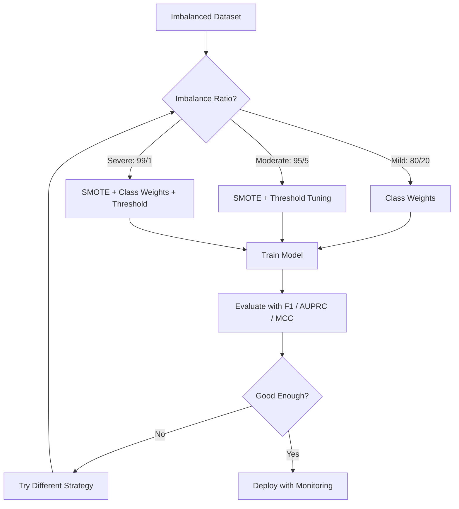
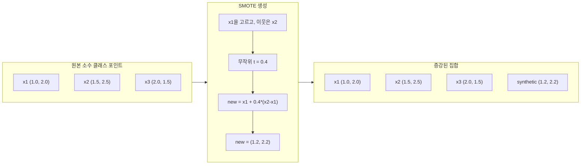
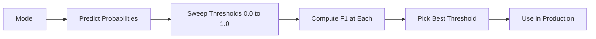
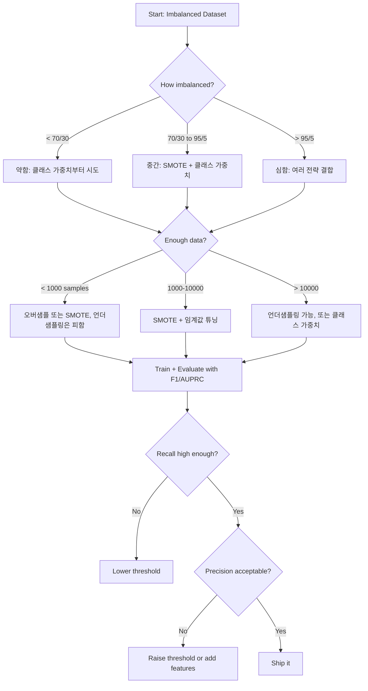

> 🇰🇷 이 문서는 한국어 번역본입니다(ELI5 스타일). 원문: [en.md](en.md)

# 불균형 데이터 다루기

> 데이터의 99%가 "정상"이라면, 정확도는 거짓말입니다.

**유형:** Build
**언어:** Python
**선수 지식:** Phase 2, 레슨 01-09 (특히 평가 지표)
**시간:** 약 90분

## 학습 목표

- SMOTE를 직접 구현하고, 합성 오버샘플링이 무작위 복제와 어떻게 다른지 설명하기
- 정확도 대신 F1, AUPRC, Matthews 상관 계수(MCC)로 불균형 분류기를 평가하기
- 클래스 가중치, 임계값 튜닝, 리샘플링 전략을 비교하고 불균형 비율에 맞는 접근을 선택하기
- SMOTE, 클래스 가중치, 임계값 최적화를 결합한 완성형 불균형 데이터 파이프라인 만들기

## 문제 상황

사기 탐지 모델을 만들었습니다. 정확도가 99.9%입니다. 기뻐합니다. 그런데 모델이 모든 거래를 "사기 아님"으로 예측하고 있다는 사실을 깨닫습니다.

이것은 버그가 아닙니다. 거래의 0.1%만 사기라면 이것이 합리적인 행동입니다. 모델은 항상 다수 클래스를 고르는 편이 전체 오차를 최소화한다는 것을 배웁니다. 기술적으로는 맞고, 완전히 쓸모없습니다.

이런 일은 분류가 진짜로 중요한 곳이라면 어디서나 일어납니다. 질병 진단: 양성 비율 1%. 네트워크 침입: 공격 0.01%. 제조 불량: 불량률 0.5%. 스팸 필터: 스팸 20%. 고객 이탈 예측: 이탈자 5%. 소수 클래스가 더 중대할수록 더 드물게 나타나는 경향이 있습니다.

정확도가 실패하는 이유는 모든 올바른 예측을 똑같이 한 점으로 치기 때문입니다. 정상 거래를 바로 잡은 것과 사기를 잡은 것이 둘 다 정확도 1점입니다. 하지만 사기를 잡는 것이야말로 모델이 존재하는 이유입니다. 희귀하지만 중요한 클래스에 모델이 주의를 기울이도록 만드는 지표, 기법, 학습 전략이 필요합니다.

## 개념

### 정확도가 실패하는 이유

1,000개 샘플 중 음성 990개, 양성 10개인 데이터셋을 생각해 봅시다. 항상 음성으로 예측하는 모델:

|  | 양성으로 예측 | 음성으로 예측 |
|--|---|---|
| 실제 양성 | 0 (TP) | 10 (FN) |
| 실제 음성 | 0 (FP) | 990 (TN) |

정확도 = (0 + 990) / 1000 = 99.0%

모델이 잡은 사기는 0건입니다. 잡은 질병 0건. 잡은 불량 0건. 그런데 정확도는 99%라고 말합니다. 불균형 문제에서 정확도가 위험한 이유입니다.

### 더 나은 지표

**정밀도(Precision)** = TP / (TP + FP). 양성으로 표시한 것 전체 중 진짜 양성은 몇 개일까? 정밀도가 높으면 오탐이 적다는 뜻입니다.

**재현율(Recall)** = TP / (TP + FN). 실제 양성 전체 중 몇 개를 잡았을까? 재현율이 높으면 놓친 양성이 적다는 뜻입니다.

**F1 점수** = 2 * 정밀도 * 재현율 / (정밀도 + 재현율). 조화평균입니다. 정밀도와 재현율 사이의 극단적 불균형을 산술 평균보다 더 세게 벌줍니다.

**F-beta 점수** = (1 + beta^2) * 정밀도 * 재현율 / (beta^2 * 정밀도 + 재현율). beta > 1이면 재현율이 더 중요합니다. beta < 1이면 정밀도가 더 중요합니다. 사기 탐지에서는 F2가 흔합니다(사기를 놓치는 것이 오탐보다 나쁩니다).

**AUPRC**(정밀도-재현율 곡선 아래 면적, Area Under Precision-Recall Curve). AUC-ROC와 비슷하지만 불균형 데이터에서 더 유용합니다. 무작위 분류기의 AUPRC는 양성 클래스 비율과 같습니다(ROC처럼 0.5가 아닙니다). 덕분에 개선이 더 잘 보입니다.

**Matthews 상관 계수** = (TP * TN - FP * FN) / sqrt((TP+FP)(TP+FN)(TN+FP)(TN+FN)). -1에서 +1 범위입니다. 두 클래스 모두에서 잘해야만 높은 점수가 나옵니다. 클래스 크기가 크게 달라도 균형이 잡혀 있습니다.

위의 "항상 음성 예측" 모델의 경우: 정밀도 = 0/0(정의되지 않음, 보통 0으로 둠), 재현율 = 0/10 = 0, F1 = 0, MCC = 0. 이 지표들은 모델을 무가치하다고 올바로 판정합니다.

### 불균형 데이터 파이프라인



### SMOTE: 합성 소수 클래스 오버샘플링 기법(Synthetic Minority Oversampling Technique)

무작위 오버샘플링은 기존 소수 클래스 샘플을 복제합니다. 동작은 하지만 모델이 동일한 포인트를 반복해서 보기 때문에 과적합 위험이 있습니다.

SMOTE는 그럴듯하지만 복사본은 아닌 새로운 합성 소수 샘플을 만듭니다. 알고리즘은 이렇습니다:

1. 각 소수 클래스 샘플 x에 대해, 다른 소수 클래스 샘플 사이에서 k 최근접 이웃을 찾습니다
2. 이웃 하나를 무작위로 고릅니다
3. x와 그 이웃을 잇는 선분 위에 새 샘플을 만듭니다

공식: `new_sample = x + random(0, 1) * (neighbor - x)`

실제 소수 포인트들 사이를 보간하기 때문에, 기존 데이터를 복사하지 않으면서 특성 공간의 같은 영역에 샘플을 만들어냅니다.



### 리샘플링 전략 비교

**무작위 오버샘플링(Random Oversampling)**: 소수 클래스 샘플을 복제해 다수 클래스 수와 맞춥니다.
- 장점: 단순함, 정보 손실 없음
- 단점: 완전히 동일한 복제본이 과적합을 일으킴, 학습 시간 증가

**무작위 언더샘플링(Random Undersampling)**: 다수 클래스 샘플을 제거해 소수 클래스 수와 맞춥니다.
- 장점: 학습이 빠름, 단순함
- 단점: 유용할 수 있는 다수 클래스 데이터를 버림, 분산 증가

**SMOTE**: 보간으로 합성 소수 샘플을 생성합니다.
- 장점: 새 데이터 포인트를 만들어냄, 무작위 오버샘플링보다 과적합이 적음
- 단점: 결정 경계 근처에서 잡음 섞인 샘플을 만들 수 있음, 다수 클래스 분포를 고려하지 않음

| 전략 | 바뀌는 데이터 | 위험 | 언제 사용 |
|----------|-------------|------|-------------|
| 오버샘플 | 소수 클래스 복제 | 과적합 | 작은 데이터셋, 중간 정도 불균형 |
| 언더샘플 | 다수 클래스 제거 | 정보 손실 | 큰 데이터셋, 빠른 학습 필요 |
| SMOTE | 합성 소수 추가 | 경계 잡음 | 중간 정도 불균형, k-NN에 쓸 소수 샘플이 충분할 때 |

### 클래스 가중치

데이터를 바꾸는 대신, 모델이 오류를 대하는 방식을 바꿉니다. 소수 클래스를 잘못 분류하는 데 더 높은 가중치를 부여합니다.

음성 950개, 양성 50개인 이진 문제:
- 음성 클래스 가중치 = n_samples / (2 * n_negative) = 1000 / (2 * 950) = 0.526
- 양성 클래스 가중치 = n_samples / (2 * n_positive) = 1000 / (2 * 50) = 10.0

양성 클래스가 19배의 가중치를 받습니다. 양성 샘플 하나를 틀리는 것이 음성 19개를 틀리는 것과 같은 비용입니다. 모델은 소수 클래스에 주의를 기울일 수밖에 없습니다.

로지스틱 회귀에서는 손실 함수가 이렇게 바뀝니다:

```
weighted_loss = -sum(w_i * [y_i * log(p_i) + (1-y_i) * log(1-p_i)])
```

여기서 w_i는 샘플 i의 클래스에 따라 달라집니다.

클래스 가중치는 기댓값 측면에서 오버샘플링과 수학적으로 동등하지만, 새 데이터 포인트를 만들지 않습니다. 덕분에 더 빠르고, 복제 샘플의 과적합 위험도 없습니다.

### 임계값 튜닝

대부분의 분류기는 확률을 출력합니다. 기본 임계값은 0.5입니다: P(positive) >= 0.5이면 양성 예측. 하지만 0.5는 임의로 정한 값입니다. 클래스가 불균형하면 최적 임계값은 보통 훨씬 낮습니다.

절차:
1. 모델을 학습합니다
2. 검증 세트에서 예측 확률을 얻습니다
3. 임계값을 0.0부터 1.0까지 훑습니다
4. 각 임계값에서 F1(또는 여러분이 고른 지표)을 계산합니다
5. 지표를 최대화하는 임계값을 고릅니다



모델이 사기 거래에 P(fraud) = 0.15를 출력할 수 있습니다. 임계값 0.5에서는 사기 아님으로 분류됩니다. 임계값 0.10이면 올바로 잡힙니다. 확률 보정(calibration)보다 순위가 더 중요합니다. 사기가 비사기보다 높은 확률만 받는다면, 둘을 갈라놓는 임계값이 반드시 존재합니다.

### 비용 민감 학습(Cost-Sensitive Learning)

클래스 가중치의 일반화입니다. 균일한 비용 대신 특정 오분류 비용을 지정합니다:

|  | 양성으로 예측 | 음성으로 예측 |
|--|---|---|
| 실제 양성 | 0 (정답) | C_FN = 100 |
| 실제 음성 | C_FP = 1 | 0 (정답) |

사기 거래를 놓치는 것(FN)은 오탐(FP)보다 100배 비쌉니다. 모델은 총 오류 개수가 아니라 총 비용을 최적화합니다.

실제 세계의 비용을 추정할 수 있다면 이것이 가장 원칙적인 접근입니다. 암 진단을 놓치는 비용과, 불필요한 조직검사로 이어지는 오탐의 비용은 전혀 다릅니다. 이 비용들을 명시하면 올바른 트레이드오프가 강제됩니다.

### 의사 결정 플로차트



```figure
class-imbalance
```

## 직접 만들기

### 단계 1: 불균형 데이터셋 생성

```python
import numpy as np


def make_imbalanced_data(n_majority=950, n_minority=50, seed=42):
    rng = np.random.RandomState(seed)

    X_maj = rng.randn(n_majority, 2) * 1.0 + np.array([0.0, 0.0])
    X_min = rng.randn(n_minority, 2) * 0.8 + np.array([2.5, 2.5])

    X = np.vstack([X_maj, X_min])
    y = np.concatenate([np.zeros(n_majority), np.ones(n_minority)])

    shuffle_idx = rng.permutation(len(y))
    return X[shuffle_idx], y[shuffle_idx]
```

### 단계 2: SMOTE 직접 구현

```python
def euclidean_distance(a, b):
    return np.sqrt(np.sum((a - b) ** 2))


def find_k_neighbors(X, idx, k):
    distances = []
    for i in range(len(X)):
        if i == idx:
            continue
        d = euclidean_distance(X[idx], X[i])
        distances.append((i, d))
    distances.sort(key=lambda x: x[1])
    return [d[0] for d in distances[:k]]


def smote(X_minority, k=5, n_synthetic=100, seed=42):
    rng = np.random.RandomState(seed)
    n_samples = len(X_minority)
    k = min(k, n_samples - 1)
    synthetic = []

    for _ in range(n_synthetic):
        idx = rng.randint(0, n_samples)
        neighbors = find_k_neighbors(X_minority, idx, k)
        neighbor_idx = neighbors[rng.randint(0, len(neighbors))]
        t = rng.random()
        new_point = X_minority[idx] + t * (X_minority[neighbor_idx] - X_minority[idx])
        synthetic.append(new_point)

    return np.array(synthetic)
```

### 단계 3: 무작위 오버샘플링과 언더샘플링

```python
def random_oversample(X, y, seed=42):
    rng = np.random.RandomState(seed)
    classes, counts = np.unique(y, return_counts=True)
    max_count = counts.max()

    X_resampled = list(X)
    y_resampled = list(y)

    for cls, count in zip(classes, counts):
        if count < max_count:
            cls_indices = np.where(y == cls)[0]
            n_needed = max_count - count
            chosen = rng.choice(cls_indices, size=n_needed, replace=True)
            X_resampled.extend(X[chosen])
            y_resampled.extend(y[chosen])

    X_out = np.array(X_resampled)
    y_out = np.array(y_resampled)
    shuffle = rng.permutation(len(y_out))
    return X_out[shuffle], y_out[shuffle]


def random_undersample(X, y, seed=42):
    rng = np.random.RandomState(seed)
    classes, counts = np.unique(y, return_counts=True)
    min_count = counts.min()

    X_resampled = []
    y_resampled = []

    for cls in classes:
        cls_indices = np.where(y == cls)[0]
        chosen = rng.choice(cls_indices, size=min_count, replace=False)
        X_resampled.extend(X[chosen])
        y_resampled.extend(y[chosen])

    X_out = np.array(X_resampled)
    y_out = np.array(y_resampled)
    shuffle = rng.permutation(len(y_out))
    return X_out[shuffle], y_out[shuffle]
```

### 단계 4: 클래스 가중치를 적용한 로지스틱 회귀

```python
def sigmoid(z):
    return 1.0 / (1.0 + np.exp(-np.clip(z, -500, 500)))


def logistic_regression_weighted(X, y, weights, lr=0.01, epochs=200):
    n_samples, n_features = X.shape
    w = np.zeros(n_features)
    b = 0.0

    for _ in range(epochs):
        z = X @ w + b
        pred = sigmoid(z)
        error = pred - y
        weighted_error = error * weights

        gradient_w = (X.T @ weighted_error) / n_samples
        gradient_b = np.mean(weighted_error)

        w -= lr * gradient_w
        b -= lr * gradient_b

    return w, b


def compute_class_weights(y):
    classes, counts = np.unique(y, return_counts=True)
    n_samples = len(y)
    n_classes = len(classes)
    weight_map = {}
    for cls, count in zip(classes, counts):
        weight_map[cls] = n_samples / (n_classes * count)
    return np.array([weight_map[yi] for yi in y])
```

### 단계 5: 임계값 튜닝

```python
def find_optimal_threshold(y_true, y_probs, metric="f1"):
    best_threshold = 0.5
    best_score = -1.0

    for threshold in np.arange(0.05, 0.96, 0.01):
        y_pred = (y_probs >= threshold).astype(int)
        tp = np.sum((y_pred == 1) & (y_true == 1))
        fp = np.sum((y_pred == 1) & (y_true == 0))
        fn = np.sum((y_pred == 0) & (y_true == 1))

        if metric == "f1":
            precision = tp / (tp + fp) if (tp + fp) > 0 else 0.0
            recall = tp / (tp + fn) if (tp + fn) > 0 else 0.0
            score = 2 * precision * recall / (precision + recall) if (precision + recall) > 0 else 0.0
        elif metric == "recall":
            score = tp / (tp + fn) if (tp + fn) > 0 else 0.0
        elif metric == "precision":
            score = tp / (tp + fp) if (tp + fp) > 0 else 0.0

        if score > best_score:
            best_score = score
            best_threshold = threshold

    return best_threshold, best_score
```

### 단계 6: 평가 함수

```python
def confusion_matrix_values(y_true, y_pred):
    tp = np.sum((y_pred == 1) & (y_true == 1))
    tn = np.sum((y_pred == 0) & (y_true == 0))
    fp = np.sum((y_pred == 1) & (y_true == 0))
    fn = np.sum((y_pred == 0) & (y_true == 1))
    return tp, tn, fp, fn


def compute_metrics(y_true, y_pred):
    tp, tn, fp, fn = confusion_matrix_values(y_true, y_pred)
    accuracy = (tp + tn) / (tp + tn + fp + fn)
    precision = tp / (tp + fp) if (tp + fp) > 0 else 0.0
    recall = tp / (tp + fn) if (tp + fn) > 0 else 0.0
    f1 = 2 * precision * recall / (precision + recall) if (precision + recall) > 0 else 0.0

    denom = np.sqrt(float((tp + fp) * (tp + fn) * (tn + fp) * (tn + fn)))
    mcc = (tp * tn - fp * fn) / denom if denom > 0 else 0.0

    return {
        "accuracy": accuracy,
        "precision": precision,
        "recall": recall,
        "f1": f1,
        "mcc": mcc,
    }
```

### 단계 7: 모든 접근 비교

```python
X, y = make_imbalanced_data(950, 50, seed=42)
split = int(0.8 * len(y))
X_train, X_test = X[:split], X[split:]
y_train, y_test = y[:split], y[split:]

# 베이스라인: 아무 처치도 하지 않음
w_base, b_base = logistic_regression_weighted(
    X_train, y_train, np.ones(len(y_train)), lr=0.1, epochs=300
)
probs_base = sigmoid(X_test @ w_base + b_base)
preds_base = (probs_base >= 0.5).astype(int)

# 오버샘플링
X_over, y_over = random_oversample(X_train, y_train)
w_over, b_over = logistic_regression_weighted(
    X_over, y_over, np.ones(len(y_over)), lr=0.1, epochs=300
)
preds_over = (sigmoid(X_test @ w_over + b_over) >= 0.5).astype(int)

# SMOTE
minority_mask = y_train == 1
X_minority = X_train[minority_mask]
synthetic = smote(X_minority, k=5, n_synthetic=len(y_train) - 2 * int(minority_mask.sum()))
X_smote = np.vstack([X_train, synthetic])
y_smote = np.concatenate([y_train, np.ones(len(synthetic))])
w_sm, b_sm = logistic_regression_weighted(
    X_smote, y_smote, np.ones(len(y_smote)), lr=0.1, epochs=300
)
preds_smote = (sigmoid(X_test @ w_sm + b_sm) >= 0.5).astype(int)

# 클래스 가중치
sample_weights = compute_class_weights(y_train)
w_cw, b_cw = logistic_regression_weighted(
    X_train, y_train, sample_weights, lr=0.1, epochs=300
)
probs_cw = sigmoid(X_test @ w_cw + b_cw)
preds_cw = (probs_cw >= 0.5).astype(int)

# 임계값 튜닝 (테스트 세트가 아닌 별도의 검증 세트에서 튜닝)
probs_val = sigmoid(X_val @ w_cw + b_cw)
best_thresh, best_f1 = find_optimal_threshold(y_val, probs_val, metric="f1")
preds_thresh = (probs_cw >= best_thresh).astype(int)
```

코드 파일은 이 모든 것을 하나의 스크립트로 실행하고 결과를 출력합니다.

## 실전에서 쓰기

scikit-learn과 imbalanced-learn을 쓰면 이 기법들이 한 줄짜리 코드가 됩니다:

```python
from sklearn.linear_model import LogisticRegression
from sklearn.metrics import classification_report, f1_score
from sklearn.model_selection import train_test_split
from imblearn.over_sampling import SMOTE
from imblearn.under_sampling import RandomUnderSampler
from imblearn.pipeline import Pipeline

X_train, X_test, y_train, y_test = train_test_split(X, y, stratify=y)

model_weighted = LogisticRegression(class_weight="balanced")
model_weighted.fit(X_train, y_train)
print(classification_report(y_test, model_weighted.predict(X_test)))

smote = SMOTE(random_state=42)
X_resampled, y_resampled = smote.fit_resample(X_train, y_train)
model_smote = LogisticRegression()
model_smote.fit(X_resampled, y_resampled)
print(classification_report(y_test, model_smote.predict(X_test)))

pipeline = Pipeline([
    ("smote", SMOTE()),
    ("model", LogisticRegression(class_weight="balanced")),
])
pipeline.fit(X_train, y_train)
print(classification_report(y_test, pipeline.predict(X_test)))
```

직접 구현은 각 기법이 정확히 무엇을 하는지 보여줍니다. SMOTE는 소수 클래스 위에서의 k-NN 보간일 뿐입니다. 클래스 가중치는 손실에 곱셈을 하는 것입니다. 임계값 튜닝은 컷오프를 도는 for 루프입니다. 마법은 없습니다.

## 출시하기

이 레슨이 만드는 것:
- `outputs/skill-imbalanced-data.md` -- 불균형 분류 문제를 다루기 위한 결정 체크리스트

## 연습 문제

1. **Borderline-SMOTE**: SMOTE 구현을 수정해 결정 경계 근처의 소수 포인트(k 최근접 이웃 중 다수 클래스 샘플이 포함된 포인트)에만 합성 샘플을 생성하도록 하세요. 클래스가 겹치는 데이터셋에서 표준 SMOTE와 결과를 비교하세요.

2. **비용 행렬 최적화**: 비용 행렬을 매개변수로 받는 비용 민감 학습을 구현하세요. 비용 행렬을 받아 기대 비용을 최소화하는 최적 예측을 돌려주는 함수를 만드세요. 서로 다른 비용 비율(1:10, 1:100, 1:1000)로 시험하고 정밀도-재현율 트레이드오프가 어떻게 바뀌는지 그래프로 그리세요.

3. **임계값 보정**: Platt 스케일링을 구현하세요(모델의 원시 출력 위에 로지스틱 회귀를 학습시켜 보정된 확률을 만듭니다). 보정 전후의 정밀도-재현율 곡선을 비교하세요. 보정은 순위를 바꾸지 않지만(AUC는 그대로) 확률을 더 의미 있게 만든다는 것을 보이세요.

4. **균형 배깅 앙상블**: 여러 모델을 학습시키되 각각 균형 잡힌 부트스트랩 샘플(소수 클래스 전부 + 다수 클래스의 무작위 부분집합)로 학습합니다. 예측을 평균냅니다. SMOTE를 쓴 단일 모델과 이 접근을 비교하세요. 성능과 실행 간 분산을 모두 측정하세요.

5. **불균형 비율 실험**: 균형 잡힌 데이터셋을 가져와 불균형 비율을 점진적으로 높이세요(50/50, 70/30, 90/10, 95/5, 99/1). 각 비율에서 SMOTE를 쓴 경우와 쓰지 않은 경우로 학습합니다. 두 접근의 F1 대 불균형 비율 그래프를 그리세요. 어떤 비율부터 SMOTE가 의미 있는 차이를 만들기 시작하나요?

## 핵심 용어

| 용어 | 사람들이 말하는 것 | 실제 의미 |
|------|----------------|----------------------|
| 클래스 불균형 | "한 클래스가 샘플이 훨씬 많음" | 데이터셋의 클래스 분포가 크게 치우쳐 모델이 다수 클래스를 선호하게 되는 상태 |
| SMOTE | "합성 오버샘플링" | 기존 소수 샘플과 그 k 최근접 소수 이웃 사이를 보간해 새 소수 샘플을 만드는 기법 |
| 클래스 가중치 | "희귀 클래스 오류를 더 비싸게 만들기" | 손실 함수에 클래스별 가중치를 곱해 소수 클래스 오분류를 더 세게 벌주는 것 |
| 임계값 튜닝 | "결정 경계 옮기기" | 분류의 확률 컷오프를 기본값 0.5에서 원하는 지표를 최적화하는 값으로 바꾸는 것 |
| 정밀도-재현율 트레이드오프 | "둘 다 가질 수는 없음" | 임계값을 낮추면 더 많은 양성을 잡지만(재현율 상승) 오탐도 늘어나고(정밀도 하락), 그 반대도 마찬가지 |
| AUPRC | "PR 곡선 아래 면적" | 정밀도-재현율 곡선을 하나의 수로 요약, 클래스가 심하게 불균형할 때 AUC-ROC보다 유용 |
| Matthews 상관 계수 | "균형 잡힌 지표" | 예측 레이블과 실제 레이블 사이의 상관으로, 모델이 두 클래스 모두에서 잘할 때만 높은 점수가 나옴 |
| 비용 민감 학습 | "틀리는 종류마다 비용이 다름" | 실제 세계의 오분류 비용을 학습 목표에 반영해, 모델이 오류 개수가 아닌 총 비용을 최적화하게 하는 것 |
| 무작위 오버샘플링 | "소수 클래스 복제" | 소수 클래스 샘플을 반복해 클래스 수를 맞추는 것, 단순하지만 복제된 포인트에 과적합할 위험 |

## 더 읽을거리

- [SMOTE: Synthetic Minority Over-sampling Technique (Chawla 외, 2002)](https://arxiv.org/abs/1106.1813) -- SMOTE 원 논문, 지금도 불균형 학습 분야에서 가장 많이 인용되는 논문
- [Learning from Imbalanced Data (He & Garcia, 2009)](https://ieeexplore.ieee.org/document/5128907) -- 샘플링, 비용 민감, 알고리즘 접근을 망라한 종합 서베이
- [imbalanced-learn 문서](https://imbalanced-learn.org/stable/) -- SMOTE 변형, 언더샘플링 전략, 파이프라인 통합을 갖춘 Python 라이브러리
- [The Precision-Recall Plot Is More Informative than the ROC Plot (Saito & Rehmsmeier, 2015)](https://journals.plos.org/plosone/article?id=10.1371/journal.pone.0118432) -- 불균형 문제에서 ROC 곡선보다 PR 곡선을 선호해야 할 때와 그 이유
