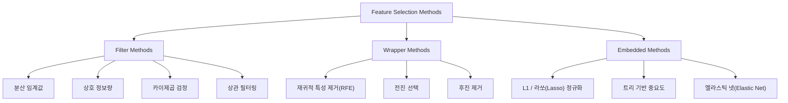
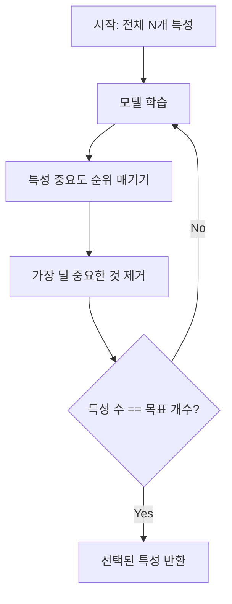
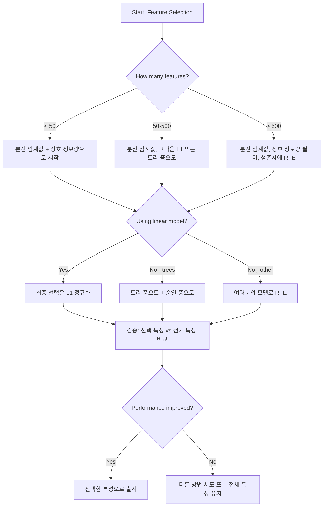

> 🇰🇷 이 문서는 한국어 번역본입니다(ELI5 스타일). 원문: [en.md](en.md)

# 특성 선택(Feature Selection)

> 특성이 많다고 좋은 게 아닙니다. 올바른 특성이 좋은 것입니다.

**유형:** Build
**언어:** Python
**선수 지식:** Phase 2, 레슨 01-09, 08 (특성 엔지니어링)
**시간:** 약 75분

## 학습 목표

- 필터 방법(분산 임계값, 상호 정보량, 카이제곱 검정)과 래퍼 방법(RFE, 전진 선택)을 직접 구현하기
- 상호 정보량이 상관계수가 놓치는 비선형 특성-타깃 관계를 잡아내는 이유 설명하기
- L1 정규화(임베디드 선택)와 RFE(래퍼 선택)를 비교하고 계산 비용 트레이드오프 평가하기
- 여러 방법을 결합한 특성 선택 파이프라인을 만들고, 보류 데이터에서 일반화가 개선됨을 보이기

## 문제 상황

특성이 500개입니다. 모델은 천천히 학습되고, 늘 과적합되고, 아무도 모델이 무엇을 배웠는지 설명할 수 없습니다. 성능을 높이려고 특성을 더 추가합니다. 더 나빠집니다.

이것이 현실이 된 차원의 저주입니다. 특성 수가 늘어나면 특성 공간의 부피가 폭발적으로 커집니다. 데이터 포인트는 성기게 흩어집니다. 포인트 사이 거리는 서로 비슷해집니다. 모델이 진짜 패턴을 찾으려면 기하급수적으로 더 많은 데이터가 필요합니다. 잡음 특성이 신호 특성을 덮어버립니다. 과적합이 기본값이 됩니다.

특성 선택이 해독제입니다. 잡음을 걷어냅니다. 중복을 제거합니다. 타깃에 대한 실제 정보를 담고 있는 특성만 남깁니다. 결과: 더 빠른 학습, 더 나은 일반화, 실제로 설명할 수 있는 모델.

목표는 가능한 모든 정보를 쓰는 것이 아닙니다. 올바른 정보를 쓰는 것입니다.

## 개념

### 특성 선택의 세 범주

모든 특성 선택 방법은 세 범주 중 하나에 속합니다:



**필터 방법(Filter methods)**은 통계적 측도로 각 특성을 독립적으로 채점합니다. 모델을 쓰지 않습니다. 빠르지만 특성 간 상호작용을 놓칩니다.

**래퍼 방법(Wrapper methods)**은 특성 부분집합을 평가하려고 모델을 학습시킵니다. 모델 성능을 점수로 씁니다. 결과는 더 좋지만 모델을 여러 번 재학습해야 해서 비쌉니다.

**임베디드 방법(Embedded methods)**은 모델 학습의 일부로 특성을 선택합니다. L1 정규화는 가중치를 0으로 몰아갑니다. 결정 트리는 가장 유용한 특성으로 분할합니다. 선택이 별도 단계가 아니라 학습(fitting) 중에 일어납니다.

### 분산 임계값

가장 단순한 필터입니다. 어떤 특성이 샘플 사이에서 거의 변하지 않는다면, 거의 정보가 없는 것입니다.

1,000개 샘플 중 999개에서 0.0인 특성을 생각해 봅시다. 분산이 거의 0입니다. 어떤 모델도 이 특성으로 클래스를 구분할 수 없습니다. 제거합니다.

```
variance(x) = mean((x - mean(x))^2)
```

임계값(예: 0.01)을 정하고, 그보다 분산이 낮은 모든 특성을 버립니다. 타깃 변수를 전혀 보지 않고도 상수 또는 준상수 특성을 제거할 수 있습니다.

언제 쓰나: 다른 방법들 전의 전처리 단계로. 명백히 쓸모없는 특성을 거의 공짜에 걸러냅니다.

한계: 분산이 높아도 순수한 잡음일 수 있습니다. 분산 임계값은 필요조건이지 충분조건이 아닙니다.

### 상호 정보량

상호 정보량(mutual information)은 특성 X의 값을 앎으로써 타깃 Y에 대한 불확실성이 얼마나 줄어드는지 측정합니다.

```
I(X; Y) = sum_x sum_y p(x, y) * log(p(x, y) / (p(x) * p(y)))
```

X와 Y가 독립이면 p(x, y) = p(x) * p(y)이므로 로그항이 0이고 I(X; Y) = 0입니다. X가 Y에 대해 알려주는 것이 많을수록 상호 정보량이 높아집니다.

상관계수 대비 핵심 장점: 상호 정보량은 비선형 관계를 잡아냅니다. 어떤 특성은 타깃과의 상관이 0이지만, 관계가 이차식이거나 주기적이라서 상호 정보량은 높을 수 있습니다.

연속 특성은 먼저 구간으로 나눕니다(discretize, 히스토그램 기반 추정). 구간 수가 추정값에 영향을 줍니다. 구간이 너무 적으면 정보를 잃고, 너무 많으면 잡음이 섞입니다. 흔한 선택: sqrt(n) 구간 또는 Sturges 규칙(1 + log2(n)).


### 재귀적 특성 제거(RFE, Recursive Feature Elimination)

RFE는 래퍼 방법입니다. 모델 자신의 특성 중요도를 이용해 반복적으로 가지치기를 합니다:

1. 모든 특성으로 모델을 학습시킵니다
2. 중요도로 특성의 순위를 매깁니다(선형 모델은 계수, 트리는 불순도 감소)
3. 가장 덜 중요한 특성을 제거합니다
4. 원하는 특성 수가 남을 때까지 반복합니다



RFE는 특성 상호작용을 고려합니다. 모델이 남은 특성을 전부 함께 보기 때문입니다. 하나를 제거하면 다른 특성들의 중요도가 바뀝니다. 그래서 필터 방법보다 철저합니다.

비용: 모델을 (전체 특성 수 - 목표 개수)번 학습시켜야 합니다. 특성 500개에서 목표 10개면 학습 490번입니다. 비싼 모델에서는 느립니다. 한 단계에 여러 특성을 제거하면(예: 매 라운드 하위 10% 제거) 빨라집니다.

### L1(라쏘, Lasso) 정규화

L1 정규화는 손실 함수에 가중치 절댓값의 합을 더합니다:

```
loss = prediction_error + alpha * sum(|w_i|)
```

alpha 매개변수가 특성을 얼마나 공격적으로 가지치기할지 조절합니다. alpha가 클수록 더 많은 가중치가 정확히 0이 됩니다.

왜 정확히 0일까요? L1 페널티는 가중치 공간에 마름모 모양의 제약 영역을 만듭니다. 최적해는 이 마름모의 꼭짓점에 놓이는 경향이 있고, 그 꼭짓점에서는 하나 이상의 가중치가 0입니다. L2 정규화(릿지, ridge)는 원 모양 제약을 만들어 가중치가 줄어들기는 해도 거의 0에 닿지 않습니다.

이것이 임베디드 특성 선택입니다. 모델이 학습 중에 어떤 특성을 무시할지 스스로 배웁니다. 가중치가 0인 특성은 사실상 제거된 것입니다.

장점: 학습 한 번으로 끝남, 상관된 특성 처리(하나를 고르고 나머지는 0으로 만듦), 대부분의 선형 모델 구현에 내장.

한계: 선형 모델에만 동작합니다. 비선형 특성 중요도는 잡아내지 못합니다.

### 트리 기반 특성 중요도

결정 트리와 그 앙상블(랜덤 포레스트, 그래디언 부스팅)은 특성의 순위를 자연스럽게 매깁니다. 모든 분할은 불순도를 줄입니다(분류는 지니 또는 엔트로피, 회귀는 분산). 더 큰 불순도 감소를 만들어내는 특성이 더 중요합니다.

트리 T개인 랜덤 포레스트에서:

```
importance(feature_j) = (1/T) * sum over all trees of
    sum over all nodes splitting on feature_j of
        (n_samples * impurity_decrease)
```

이렇게 하면 각 특성에 정규화된 중요도 점수가 매겨집니다. 비선형 관계와 특성 상호작용을 자동으로 다룹니다.

주의: 트리 기반 중요도는 고유 값이 많은 특성(높은 카디널리티)에 편향되어 있습니다. 무작위 ID 열은 모든 샘플을 완벽히 갈라놓기 때문에 중요해 보입니다. 순열 중요도로 교차 확인하세요.

### 순열 중요도

모델에 구애받지 않는(model-agnostic) 방법입니다:

1. 모델을 학습시키고 검증 데이터에서 베이스라인 성능을 기록합니다
2. 각 특성에 대해: 그 값을 무작위로 섞고 성능이 얼마나 떨어지는지 측정합니다
3. 하락폭이 클수록 더 중요한 특성입니다

어떤 특성을 섞어도 성능이 상하지 않는다면 모델은 그 특성에 의존하지 않는 것입니다. 성능이 무너진다면 그 특성이 핵심입니다.

순열 중요도는 트리 기반 중요도의 카디널리티 편향을 피합니다. 하지만 느립니다. 특성당 평가를 한 번씩 전부 돌리고, 안정성을 위해 여러 번 반복해야 합니다.

### 비교표

| 방법 | 유형 | 속도 | 비선형 | 특성 상호작용 |
|--------|------|-------|-----------|---------------------|
| 분산 임계값 | 필터 | 매우 빠름 | 아니요 | 아니요 |
| 상호 정보량 | 필터 | 빠름 | 예 | 아니요 |
| 상관 필터 | 필터 | 빠름 | 아니요 | 아니요 |
| RFE | 래퍼 | 느림 | 모델에 따라 | 예 |
| L1 / 라쏘 | 임베디드 | 빠름 | 아니요(선형) | 아니요 |
| 트리 중요도 | 임베디드 | 중간 | 예 | 예 |
| 순열 중요도 | 모델 불문 | 느림 | 예 | 예 |

### 의사 결정 플로차트



```figure
f3-feature-prune
```

## 직접 만들기

### 단계 1: 알려진 특성 구조를 가진 합성 데이터 생성

```python
import numpy as np


def make_feature_selection_data(n_samples=500, seed=42):
    rng = np.random.RandomState(seed)

    x1 = rng.randn(n_samples)
    x2 = rng.randn(n_samples)
    x3 = rng.randn(n_samples)
    x4 = x1 + 0.1 * rng.randn(n_samples)
    x5 = x2 + 0.1 * rng.randn(n_samples)

    informative = np.column_stack([x1, x2, x3, x4, x5])

    correlated = np.column_stack([
        x1 * 0.9 + 0.1 * rng.randn(n_samples),
        x2 * 0.8 + 0.2 * rng.randn(n_samples),
        x3 * 0.7 + 0.3 * rng.randn(n_samples),
        x1 * 0.5 + x2 * 0.5 + 0.1 * rng.randn(n_samples),
        x2 * 0.6 + x3 * 0.4 + 0.1 * rng.randn(n_samples),
    ])

    noise = rng.randn(n_samples, 10) * 0.5

    X = np.hstack([informative, correlated, noise])
    y = (2 * x1 - 1.5 * x2 + x3 + 0.5 * rng.randn(n_samples) > 0).astype(int)

    feature_names = (
        [f"info_{i}" for i in range(5)]
        + [f"corr_{i}" for i in range(5)]
        + [f"noise_{i}" for i in range(10)]
    )

    return X, y, feature_names
```

정답(ground truth)을 우리가 알고 있습니다: 특성 0-4는 유용하고(단, 3과 4는 0과 1의 상관 복사본), 특성 5-9는 유용한 특성들과 상관되어 있고, 특성 10-19는 순수한 잡음입니다. 좋은 선택 방법이라면 0-4를 가장 높게, 10-19를 가장 낮게 매겨야 합니다.

### 단계 2: 분산 임계값

```python
def variance_threshold(X, threshold=0.01):
    variances = np.var(X, axis=0)
    mask = variances > threshold
    return mask, variances
```

### 단계 3: 상호 정보량(이산형)

```python
def discretize(x, n_bins=10):
    min_val, max_val = x.min(), x.max()
    if max_val == min_val:
        return np.zeros_like(x, dtype=int)
    bin_edges = np.linspace(min_val, max_val, n_bins + 1)
    binned = np.digitize(x, bin_edges[1:-1])
    return binned


def mutual_information(X, y, n_bins=10):
    n_samples, n_features = X.shape
    mi_scores = np.zeros(n_features)

    y_vals, y_counts = np.unique(y, return_counts=True)
    p_y = y_counts / n_samples

    for f in range(n_features):
        x_binned = discretize(X[:, f], n_bins)
        x_vals, x_counts = np.unique(x_binned, return_counts=True)
        p_x = dict(zip(x_vals, x_counts / n_samples))

        mi = 0.0
        for xv in x_vals:
            for yi, yv in enumerate(y_vals):
                joint_mask = (x_binned == xv) & (y == yv)
                p_xy = np.sum(joint_mask) / n_samples
                if p_xy > 0:
                    mi += p_xy * np.log(p_xy / (p_x[xv] * p_y[yi]))
        mi_scores[f] = mi

    return mi_scores
```

### 단계 4: 재귀적 특성 제거

```python
def simple_logistic_importance(X, y, lr=0.1, epochs=100):
    n_samples, n_features = X.shape
    w = np.zeros(n_features)
    b = 0.0

    for _ in range(epochs):
        z = X @ w + b
        pred = 1.0 / (1.0 + np.exp(-np.clip(z, -500, 500)))
        error = pred - y
        w -= lr * (X.T @ error) / n_samples
        b -= lr * np.mean(error)

    return w, b


def rfe(X, y, n_features_to_select=5, lr=0.1, epochs=100):
    n_total = X.shape[1]
    remaining = list(range(n_total))
    rankings = np.ones(n_total, dtype=int)
    rank = n_total

    while len(remaining) > n_features_to_select:
        X_subset = X[:, remaining]
        w, _ = simple_logistic_importance(X_subset, y, lr, epochs)
        importances = np.abs(w)

        least_idx = np.argmin(importances)
        original_idx = remaining[least_idx]
        rankings[original_idx] = rank
        rank -= 1
        remaining.pop(least_idx)

    for idx in remaining:
        rankings[idx] = 1

    selected_mask = rankings == 1
    return selected_mask, rankings
```

### 단계 5: L1 특성 선택

```python
def soft_threshold(w, alpha):
    return np.sign(w) * np.maximum(np.abs(w) - alpha, 0)


def l1_feature_selection(X, y, alpha=0.1, lr=0.01, epochs=500):
    n_samples, n_features = X.shape
    w = np.zeros(n_features)
    b = 0.0

    for _ in range(epochs):
        z = X @ w + b
        pred = 1.0 / (1.0 + np.exp(-np.clip(z, -500, 500)))
        error = pred - y

        gradient_w = (X.T @ error) / n_samples
        gradient_b = np.mean(error)

        w -= lr * gradient_w
        w = soft_threshold(w, lr * alpha)
        b -= lr * gradient_b

    selected_mask = np.abs(w) > 1e-6
    return selected_mask, w
```

### 단계 6: 트리 기반 중요도(간단한 결정 트리)

```python
def gini_impurity(y):
    if len(y) == 0:
        return 0.0
    classes, counts = np.unique(y, return_counts=True)
    probs = counts / len(y)
    return 1.0 - np.sum(probs ** 2)


def best_split(X, y, feature_idx):
    values = np.unique(X[:, feature_idx])
    if len(values) <= 1:
        return None, -1.0

    best_threshold = None
    best_gain = -1.0
    parent_gini = gini_impurity(y)
    n = len(y)

    for i in range(len(values) - 1):
        threshold = (values[i] + values[i + 1]) / 2.0
        left_mask = X[:, feature_idx] <= threshold
        right_mask = ~left_mask

        n_left = np.sum(left_mask)
        n_right = np.sum(right_mask)

        if n_left == 0 or n_right == 0:
            continue

        gain = parent_gini - (n_left / n) * gini_impurity(y[left_mask]) - (n_right / n) * gini_impurity(y[right_mask])

        if gain > best_gain:
            best_gain = gain
            best_threshold = threshold

    return best_threshold, best_gain


def tree_importance(X, y, n_trees=50, max_depth=5, seed=42):
    rng = np.random.RandomState(seed)
    n_samples, n_features = X.shape
    importances = np.zeros(n_features)

    for _ in range(n_trees):
        sample_idx = rng.choice(n_samples, size=n_samples, replace=True)
        feature_subset = rng.choice(n_features, size=max(1, int(np.sqrt(n_features))), replace=False)

        X_boot = X[sample_idx]
        y_boot = y[sample_idx]

        tree_imp = _build_tree_importance(X_boot, y_boot, feature_subset, max_depth)
        importances += tree_imp

    total = importances.sum()
    if total > 0:
        importances /= total

    return importances


def _build_tree_importance(X, y, feature_subset, max_depth, depth=0):
    n_features = X.shape[1]
    importances = np.zeros(n_features)

    if depth >= max_depth or len(np.unique(y)) <= 1 or len(y) < 4:
        return importances

    best_feature = None
    best_threshold = None
    best_gain = -1.0

    for f in feature_subset:
        threshold, gain = best_split(X, y, f)
        if gain > best_gain:
            best_gain = gain
            best_feature = f
            best_threshold = threshold

    if best_feature is None or best_gain <= 0:
        return importances

    importances[best_feature] += best_gain * len(y)

    left_mask = X[:, best_feature] <= best_threshold
    right_mask = ~left_mask

    importances += _build_tree_importance(X[left_mask], y[left_mask], feature_subset, max_depth, depth + 1)
    importances += _build_tree_importance(X[right_mask], y[right_mask], feature_subset, max_depth, depth + 1)

    return importances
```

### 단계 7: 모든 방법 실행 및 비교

코드 파일은 같은 합성 데이터셋에서 다섯 가지 방법을 모두 실행하고, 각 방법이 어떤 특성을 선택하는지 보여주는 비교표를 출력합니다.

## 실전에서 쓰기

scikit-learn에서는 특성 선택이 파이프라인에 내장되어 있습니다:

```python
from sklearn.feature_selection import (
    VarianceThreshold,
    mutual_info_classif,
    RFE,
    SelectFromModel,
)
from sklearn.linear_model import Lasso, LogisticRegression
from sklearn.ensemble import RandomForestClassifier

vt = VarianceThreshold(threshold=0.01)
X_filtered = vt.fit_transform(X)

mi_scores = mutual_info_classif(X, y)
top_k = np.argsort(mi_scores)[-10:]

rfe_selector = RFE(LogisticRegression(), n_features_to_select=10)
rfe_selector.fit(X, y)
X_rfe = rfe_selector.transform(X)

lasso_selector = SelectFromModel(Lasso(alpha=0.01))
lasso_selector.fit(X, y)
X_lasso = lasso_selector.transform(X)

rf = RandomForestClassifier(n_estimators=100)
rf.fit(X, y)
importances = rf.feature_importances_
```

직접 구현은 각 방법 안에서 무슨 일이 일어나는지 정확히 보여줍니다. 분산 임계값은 `var(X, axis=0)`를 계산하고 마스크를 씌우는 것입니다. 상호 정보량은 분할표에서 결합 빈도와 주변 빈도를 세는 것입니다. RFE는 학습하고, 순위를 매기고, 가지치기하는 루프입니다. L1은 soft-thresholding 단계가 붙은 경사 하강법입니다. 트리 중요도는 분할에서의 불순도 감소를 모아 두는 것입니다. 마법은 없습니다. 통계와 루프일 뿐입니다.

sklearn 버전은 견고함(예: mutual_info_classif는 구간화 대신 k-NN 밀도 추정을 사용), 속도(C 구현), 파이프라인 통합을 더합니다.

## 출시하기

이 레슨이 만드는 것:
- `outputs/skill-feature-selector.md` -- 올바른 특성 선택 방법을 고르기 위한 빠른 참조 의사 결정 트리

## 연습 문제

1. **전진 선택(forward selection)**: RFE의 반대를 구현하세요. 특성 0개에서 시작해 매 단계 모델 성능을 가장 많이 올리는 특성을 추가합니다. 특성을 더해도 도움이 되지 않으면 멈춥니다. 선택된 특성을 RFE 결과와 비교하세요. 어느 쪽이 빠른가요? 어느 쪽이 더 좋은 결과를 내나요?

2. **안정성 선택(stability selection)**: L1 특성 선택을 50번 실행하되, 매번 데이터의 무작위 80% 부분집합에서 살짝씩 다른 alpha 값으로 돌립니다. 각 특성이 선택된 횟수를 셉니다. 실행의 80% 초과에서 선택된 특성이 '안정적' 특성입니다. 안정적 특성을 단일 실행 L1 선택과 비교하세요. 어느 쪽이 더 신뢰할 만한가요?

3. **다중공선성 탐지**: 모든 특성의 상관 행렬을 계산하세요. 상관 임계값(예: 0.9)이 주어지면 상관이 높은 쌍에서 특성 하나를 제거하는(타깃과의 상호 정보량이 더 높은 쪽을 남김) 함수를 구현하세요. 합성 데이터셋으로 시험하고 중복되는 상관 특성이 제거되는지 확인하세요.

4. **특성 선택 파이프라인**: 분산 임계값, 상호 정보량 필터, RFE를 하나의 파이프라인으로 연결하세요. 먼저 거의 0에 가까운 분산의 특성을 제거하고, 상호 정보량 상위 50%를 남기고, 생존자로 RFE를 돌립니다. 이 파이프라인과 전체 특성에 RFE를 단독 실행한 것을 비교하세요. 파이프라인이 더 빠른가요? 정확도는 동등한가요?

5. **순열 중요도 직접 구현**: 순열 중요도를 구현하세요. 각 특성의 값을 10번 섞고 F1 점수의 평균 하락폭을 측정합니다. 트리 기반 중요도와 순위를 비교하세요. 둘이 어긋나는 사례를 찾고 그 이유를 설명하세요(힌트: 상관된 특성).

## 핵심 용어

| 용어 | 사람들이 말하는 것 | 실제 의미 |
|------|----------------|----------------------|
| 필터 방법 | "특성을 독립적으로 채점" | 모델을 학습시키지 않고 통계적 측도로 특성의 순위를 매기는 특성 선택 접근, 각 특성을 따로따로 평가 |
| 래퍼 방법 | "모델을 써서 특성 고르기" | 모델을 학습시켜 그 성능을 선택 기준으로 삼아 특성 부분집합을 평가하는 특성 선택 접근 |
| 임베디드 방법 | "모델이 학습 중에 특성을 선택" | 모델 학습(fitting)의 일부로 일어나는 특성 선택, 예: L1 정규화가 가중치를 0으로 몰아감 |
| 상호 정보량 | "한 변수가 다른 변수에 대해 알려주는 양" | X를 알 때 Y에 대한 불확실성이 줄어드는 정도, 선형·비선형 의존성을 모두 포착 |
| 재귀적 특성 제거 | "학습, 순위, 가지치기, 반복" | 모델을 학습시키고 가장 덜 중요한 특성을 제거하는 것을 목표 개수에 도달할 때까지 반복하는 반복형 래퍼 방법 |
| L1 / 라쏘 정규화 | "특성을 죽이는 페널티" | 손실 함수에 가중치 절댓값의 합을 더해 중요하지 않은 특성 가중치를 정확히 0으로 만드는 것 |
| 분산 임계값 | "상수 특성 제거" | 샘플 사이 분산이 지정 임계값 미만인 특성을 버려 정보가 없는 특성을 걸러내는 것 |
| 특성 중요도 | "어떤 특성이 가장 중요한가" | 각 특성이 모델 예측에 기여하는 정도의 점수, 분할 이득(트리) 또는 계수 크기(선형)로 계산 |
| 순열 중요도 | "섞어서 피해를 측정" | 각 특성의 값을 무작위로 섞고 그 결과 모델 성능이 얼마나 떨어지는지 측정해 특성 중요도를 평가하는 것 |
| 차원의 저주 | "특성은 많은데 데이터는 부족" | 특성을 더하면 특성 공간의 부피가 지수적으로 커져 데이터가 성기고 거리가 무의미해지는 현상 |

## 더 읽을거리

- [An Introduction to Variable and Feature Selection (Guyon & Elisseeff, 2003)](https://jmlr.org/papers/v3/guyon03a.html) -- 특성 선택 방법에 관한 기초 서베이, 지금도 널리 인용됨
- [scikit-learn 특성 선택 가이드](https://scikit-learn.org/stable/modules/feature_selection.html) -- 코드 예제와 함께 보는 필터·래퍼·임베디드 방법 실전 참조
- [Stability Selection (Meinshausen & Buhlmann, 2010)](https://arxiv.org/abs/0809.2932) -- 부분표집과 특성 선택을 결합해 견고하고 재현 가능한 결과를 얻는 방법
- [Beware Default Random Forest Importances (Strobl 외, 2007)](https://bmcbioinformatics.biomedcentral.com/articles/10.1186/1471-2105-8-25) -- 트리 기반 중요도의 카디널리티 편향을 보이고 조건부 중요도를 대안으로 제안
