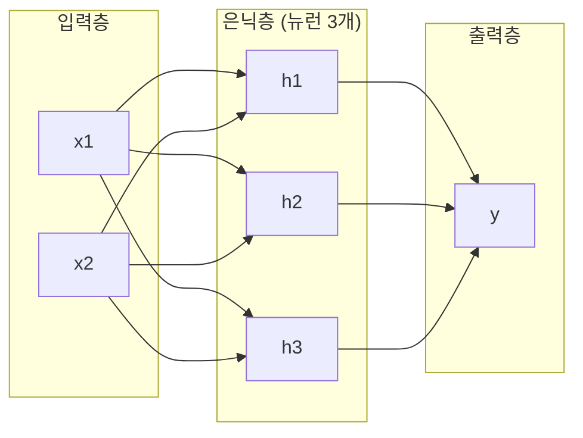
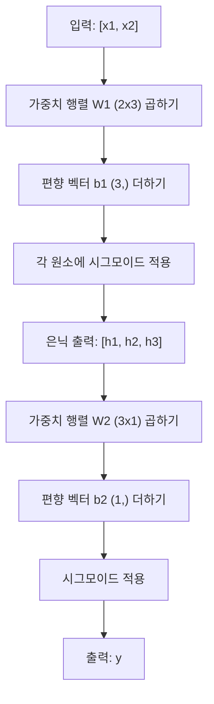
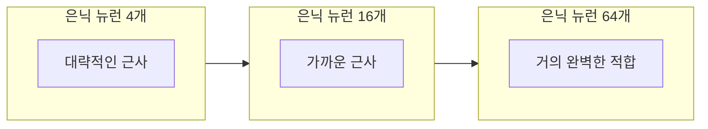

> 🇰🇷 이 문서는 한국어 번역본입니다(ELI5 스타일). 원문: [en.md](en.md)

# 다층 신경망과 순전파

> 뉴런 하나는 직선을 긋습니다. 쌓으면 무엇이든 그릴 수 있습니다.

**유형:** Build
**언어:** Python
**선수 지식:** Phase 01 (수학 기초), 레슨 03.01 (퍼셉트론)
**시간:** 약 90분

## 학습 목표

- Layer와 Network 클래스로 완전한 순전파를 수행하는 다층 네트워크를 직접 만들기
- 네트워크 각 층을 통과하는 행렬 차원을 추적하고 모양 불일치를 찾아내기
- 비선형 활성화를 쌓으면 네트워크가 휘어진 결정 경계를 배울 수 있는 이유 설명하기
- 손으로 조정한 시그모이드 가중치로 2-2-1 구조의 XOR 문제 풀기

## 문제 상황

뉴런 하나는 직선을 그리는 기계입니다. 그게 전부입니다. 데이터를 가로지르는 직선 하나. AI의 모든 실제 문제(이미지 인식, 언어 이해, 바둑 두기)는 곡선을 필요로 합니다. 뉴런을 층으로 쌓는 것이 곡선을 얻는 방법입니다.

1969년 Minsky와 Papert는 이 한계가 치명적임을 증명했습니다: 단일 층 네트워크는 XOR을 배울 수 없습니다. '배우기 어려운' 정도가 아니라 수학적으로 불가능합니다. XOR 진리표는 [0,1]과 [1,0]을 한쪽에, [0,0]과 [1,1]을 다른 쪽에 놓습니다. 어떤 직선도 이 둘을 갈라놓지 못합니다.

이것이 10년 넘게 신경망 연구 자금을 끊었습니다. 돌이켜보면 해결책은 명백했습니다: 층 하나만 쓰는 것을 그만두라. 뉴런을 층으로 쌓아라. 첫 층이 입력 공간을 새로운 특성으로 조각내게 하고, 둘째 층이 그 특성들을 조합해 어떤 직선 하나로는 불가능한 결정을 내리게 하라.

그 스택이 바로 다층 네트워크입니다. 오늘날 프로덕션(운영 환경)에 있는 모든 딥러닝 모델의 기초입니다. 순전파(forward pass, 입력에서 은닉층을 거쳐 출력으로 데이터가 흐르는 것)는 다른 무엇이든 동작하게 하기 전에 먼저 만들어야 하는 첫 번째 것입니다.

## 개념

### 층: 입력, 은닉, 출력

다층 네트워크에는 세 종류의 층이 있습니다:

**입력층** -- 사실상 층이 아닙니다. 원본 데이터를 담습니다. 특성이 두 개면 입력 노드도 두 개입니다. 여기서는 계산이 일어나지 않습니다.

**은닉층(hidden layers)** -- 실제 일이 일어나는 곳입니다. 각 뉴런은 이전 층의 모든 출력을 받아 가중치와 편향을 적용한 뒤, 그 결과를 활성화 함수에 통과시킵니다. '은닉'이라 부르는 이유는 이 값들이 학습 데이터에서 직접 보이지 않기 때문입니다.

**출력층** -- 최종 답입니다. 이진 분류에서는 시그모이드를 쓴 뉴런 하나. 다중 클래스에서는 클래스당 뉴런 하나.



이것은 2-3-1 네트워크입니다. 입력 둘, 은닉 뉴런 셋, 출력 하나. 모든 연결에는 가중치가 있습니다. 모든 뉴런(입력 제외)에는 편향이 있습니다.

각 층은 히든 상태(hidden state)라 불리는 숫자 벡터를 만들어 냅니다. 텍스트에서 히든 상태는 차원을 늘립니다. 단어를 의미를 담을 수 있는 768개의 숫자로 인코딩합니다. 이미지에서는 차원을 줄입니다. 수백만 픽셀을 다루기 쉬운 표현으로 압축합니다. 학습이 사는 곳이 바로 히든 상태입니다.

### 뉴런과 활성화

각 뉴런은 세 가지 일을 합니다:

1. 모든 입력에 대응하는 가중치를 곱합니다
2. 곱을 모두 더하고 편향을 더합니다
3. 합을 활성화 함수에 통과시킵니다

일단은 활성화가 시그모이드(sigmoid)입니다:

```
sigmoid(z) = 1 / (1 + e^(-z))
```

시그모이드는 어떤 수든 (0, 1) 범위로 눌러 담습니다. 큰 양수는 1쪽으로, 큰 음수는 0쪽으로 밀어냅니다. 0은 0.5가 됩니다. 이 매끄러운 곡선이 학습을 가능하게 합니다. 퍼셉트론의 딱딱한 계단과 달리 시그모이드는 모든 곳에서 기울기를 갖습니다.

### 순전파: 데이터가 흐르는 방식

순전파는 입력 데이터를 층을 거쳐 출력에 닿을 때까지 밀어 넣습니다. 순전파 중에는 학습이 일어나지 않습니다. 순수한 계산입니다: 곱하고, 더하고, 활성화하고, 반복합니다.



각 층에서 세 연산이 순서대로 일어납니다:

```
z = W * input + b       (선형 변환)
a = sigmoid(z)           (활성화)
```

한 층의 출력이 다음 층의 입력이 됩니다. 그것이 순전파의 전부입니다.

### 행렬 차원

차원 추적은 딥러닝에서 가장 중요한 디버깅 스킬입니다. 2-3-1 네트워크를 보세요:

| 단계 | 연산 | 차원 | 결과 모양 |
|------|-----------|------------|-------------|
| 입력 | x | -- | (2,) |
| 은닉 선형 | W1 * x + b1 | W1: (3, 2), b1: (3,) | (3,) |
| 은닉 활성화 | sigmoid(z1) | -- | (3,) |
| 출력 선형 | W2 * h + b2 | W2: (1, 3), b2: (1,) | (1,) |
| 출력 활성화 | sigmoid(z2) | -- | (1,) |

규칙: k층의 가중치 행렬 W의 모양은 (k층의 뉴런 수, k-1층의 뉴런 수)입니다. 행은 현재 층에, 열은 이전 층에 맞춥니다. 모양이 맞지 않으면 버그입니다.

### 범용 근사 정리

1989년 George Cybenko는 놀라운 사실을 증명했습니다: 은닉층 하나와 충분한 뉴런을 가진 신경망은 어떤 연속 함수든 원하는 정확도로 근사할 수 있습니다.

이것은 은닉층 하나가 항상 최선이라는 뜻이 아닙니다. 그 구조가 이론적으로 능력이 있다는 뜻입니다. 실제로는 더 깊은 네트워크(층은 더 많고 층당 뉴런은 더 적음)가 얕고 넓은 네트워크보다 훨씬 적은 총 파라미터로 같은 함수를 배웁니다. 딥러닝이 동작하는 이유입니다.

직관: 은닉층의 각 뉴런은 하나의 '봉우리' 또는 특성을 배웁니다. 적절한 위치에 놓인 충분한 봉우리는 어떤 매끄러운 곡선이든 근사할 수 있습니다. 뉴런이 많을수록, 봉우리가 많을수록, 근사가 좋아집니다.



### 조합 가능성

신경망은 조합 가능(composable)합니다. 쌓을 수 있고, 연결할 수 있고, 병렬로 실행할 수 있습니다. Whisper 모델은 인코더 네트워크로 오디오를 처리하고 별도의 디코더 네트워크로 텍스트를 만들어 냅니다. 현대 LLM은 디코더 전용입니다. BERT는 인코더 전용입니다. T5는 인코더-디코더입니다. 구조 선택이 모델이 할 수 있는 일을 정의합니다.

```figure
mlp-forward
```

## 직접 만들기

순수 파이썬입니다. numpy 없음. 모든 행렬 연산을 직접 작성합니다.

### 단계 1: 시그모이드 활성화

```python
import math

def sigmoid(x):
    x = max(-500.0, min(500.0, x))
    return 1.0 / (1.0 + math.exp(-x))
```

[-500, 500]으로 자르는 것(클램프)은 오버플로를 막습니다. `math.exp(500)`은 크지만 유한합니다. `math.exp(1000)`은 무한대입니다.

### 단계 2: Layer 클래스

딥러닝의 모든 것 중 가장 중요한 연산은 행렬 곱셈입니다. 모든 층, 모든 어텐션 헤드, 모든 순전파 -- 끝까지 파고들면 전부 행렬 곱입니다. 선형 층은 입력 벡터를 받아 가중치 행렬을 곱하고 편향 벡터를 더합니다: y = Wx + b. 이 한 줄의 식이 신경망 계산의 90%입니다.

층은 가중치 행렬과 편향 벡터를 담습니다. forward 메서드는 입력 벡터를 받아 활성화된 출력을 돌려줍니다.

```python
class Layer:
    def __init__(self, n_inputs, n_neurons, weights=None, biases=None):
        if weights is not None:
            self.weights = weights
        else:
            import random
            self.weights = [
                [random.uniform(-1, 1) for _ in range(n_inputs)]
                for _ in range(n_neurons)
            ]
        if biases is not None:
            self.biases = biases
        else:
            self.biases = [0.0] * n_neurons

    def forward(self, inputs):
        self.last_input = inputs
        self.last_output = []
        for neuron_idx in range(len(self.weights)):
            z = sum(
                w * x for w, x in zip(self.weights[neuron_idx], inputs)
            )
            z += self.biases[neuron_idx]
            self.last_output.append(sigmoid(z))
        return self.last_output
```

가중치 행렬의 모양은 (n_neurons, n_inputs)입니다. 각 행은 한 뉴런의 모든 입력에 대한 가중치입니다. forward 메서드는 뉴런들을 돌며 가중 합에 편향을 더하고, 시그모이드를 적용하고, 결과를 모읍니다.

### 단계 3: Network 클래스

네트워크는 층의 목록입니다. 순전파는 이들을 연쇄합니다: k층의 출력이 k+1층으로 들어갑니다.

```python
class Network:
    def __init__(self, layers):
        self.layers = layers

    def forward(self, inputs):
        current = inputs
        for layer in self.layers:
            current = layer.forward(current)
        return current
```

이것이 순전파의 전부입니다. 로직 네 줄. 데이터가 들어가 모든 층을 통과해 반대편으로 나옵니다.

### 단계 4: 손으로 조정한 가중치로 XOR

레슨 01에서는 OR, NAND, AND 퍼셉트론을 조합해 XOR을 풀었습니다. 이제 같은 일을 Layer와 Network 클래스로 합니다. 2-2-1 구조: 입력 둘, 은닉 뉴런 둘, 출력 하나.

```python
hidden = Layer(
    n_inputs=2,
    n_neurons=2,
    weights=[[20.0, 20.0], [-20.0, -20.0]],
    biases=[-10.0, 30.0],
)

output = Layer(
    n_inputs=2,
    n_neurons=1,
    weights=[[20.0, 20.0]],
    biases=[-30.0],
)

xor_net = Network([hidden, output])

xor_data = [
    ([0, 0], 0),
    ([0, 1], 1),
    ([1, 0], 1),
    ([1, 1], 0),
]

for inputs, expected in xor_data:
    result = xor_net.forward(inputs)
    predicted = 1 if result[0] >= 0.5 else 0
    print(f"  {inputs} -> {result[0]:.6f} (rounded: {predicted}, expected: {expected})")
```

큰 가중치(20, -20)는 시그모이드를 계단 함수처럼 동작하게 만듭니다. 첫 번째 은닉 뉴런은 OR을, 두 번째는 NAND를 흉내 냅니다. 출력 뉴런은 이 둘을 AND로 조합하는데, 그것이 곧 XOR입니다.

### 단계 5: 원 분류

더 어려운 문제: 원점이 중심이고 반지름 0.5인 원의 안과 밖으로 2차원 포인트를 분류합니다. 휘어진 결정 경계가 필요합니다. 단일 퍼셉트론에는 불가능한 일입니다.

```python
import random
import math

random.seed(42)

data = []
for _ in range(200):
    x = random.uniform(-1, 1)
    y = random.uniform(-1, 1)
    label = 1 if (x * x + y * y) < 0.25 else 0
    data.append(([x, y], label))

circle_net = Network([
    Layer(n_inputs=2, n_neurons=8),
    Layer(n_inputs=8, n_neurons=1),
])
```

무작위 가중치로는 네트워크가 잘 분류하지 못합니다. 하지만 순전파는 여전히 돌아갑니다. 이게 요점입니다. 순전파는 그저 계산입니다. 올바른 가중치를 배우는 것은 역전파이고, 레슨 03에서 나옵니다.

```python
correct = 0
for inputs, expected in data:
    result = circle_net.forward(inputs)
    predicted = 1 if result[0] >= 0.5 else 0
    if predicted == expected:
        correct += 1

print(f"Accuracy with random weights: {correct}/{len(data)} ({100*correct/len(data):.1f}%)")
```

무작위 가중치는 나쁜 정확도를 냅니다. 흔히 다수 클래스를 찍는 것보다도 나쁩니다. 학습 후(레슨 03)에는 은닉 뉴런 8개를 가진 같은 구조가 안과 밖을 갈라놓는 휘어진 경계를 그릴 수 있게 됩니다.

## 실전에서 쓰기

PyTorch는 위의 모든 것을 네 줄로 합니다:

```python
import torch
import torch.nn as nn

model = nn.Sequential(
    nn.Linear(2, 8),
    nn.Sigmoid(),
    nn.Linear(8, 1),
    nn.Sigmoid(),
)

x = torch.tensor([[0.0, 0.0], [0.0, 1.0], [1.0, 0.0], [1.0, 1.0]])
output = model(x)
print(output)
```

`nn.Linear(2, 8)`은 여러분의 Layer 클래스입니다. 모양 (8, 2)의 가중치 행렬과 모양 (8,)의 편향 벡터입니다. `nn.Sigmoid()`는 원소별로 적용되는 여러분의 시그모이드 함수입니다. `nn.Sequential`은 여러분의 Network 클래스입니다. 층을 순서대로 연결합니다.

차이는 속도와 규모입니다. PyTorch는 GPU에서 돌고, 수백만 샘플짜리 배치를 다루고, 역전파에 쓸 기울기를 자동으로 계산합니다. 하지만 순전파 로직은 방금 직접 만든 것과 동일합니다.

## 출시하기

이 레슨은 네트워크 구조 설계를 위한 재사용 가능한 프롬프트를 만듭니다:

- `outputs/prompt-network-architect.md`

특정 문제에 대해 층이 몇 개이고 층당 뉴런이 몇 개이며 어떤 활성화 함수를 쓸지 정해야 할 때 사용하세요.

## 연습 문제

1. 2-4-2-1 네트워크(은닉층 두 개)를 만들고 무작위 가중치로 XOR 데이터에 순전파를 돌리세요. 중간 은닉층 출력을 출력해 각 층에서 표현이 어떻게 변하는지 확인하세요.

2. 원 분류기의 은닉층 크기를 8에서 2로, 그다음 32로 바꾸세요. 매번 무작위 가중치로 순전파를 돌리세요. 은닉 뉴런 수가 출력의 범위나 분포를 바꾸나요? 왜 그런가요?

3. Network 클래스에 학습 가능한 가중치와 편향의 총 개수를 돌려주는 `count_parameters` 메서드를 구현하세요. 784-256-128-10 네트워크(고전적인 MNIST 구조)로 시험하세요. 파라미터는 몇 개인가요?

4. 3-4-4-2 네트워크의 순전파를 만드세요. RGB 색 값(0-1로 정규화)을 넣고 두 출력을 관찰하세요. 두 클래스짜리 간단한 색 분류기의 구조입니다.

5. 시그모이드를 '누수 계단(leaky step)' 함수로 바꾸세요: z < 0이면 0.01 * z를, 아니면 1.0을 돌려줍니다. 단계 4의 같은 손 조정 가중치로 XOR에 순전파를 돌리세요. 아직 동작하나요? 딱 끊어지는 컷오프보다 매끄러운 시그모이드가 선호되는 이유는 무엇인가요?

## 핵심 용어

| 용어 | 사람들이 말하는 것 | 실제 의미 |
|------|----------------|----------------------|
| 순전파 | "모델 돌리기" | 입력을 모든 층에 밀어 넣어(가중치 곱, 편향 더하기, 활성화) 출력을 만드는 것 |
| 은닉층 | "가운데 부분" | 입력과 출력 사이의 층, 그 값들은 데이터에서 직접 관측되지 않음 |
| 다층 네트워크 | "딥러닝 신경망" | 뉴런 층을 순서대로 쌓은 것, 각 층의 출력이 다음 층의 입력이 됨 |
| 활성화 함수 | "비선형성" | 선형 변환 뒤에 적용되어 결정 경계에 곡선을 넣는 함수 |
| 시그모이드 | "S 곡선" | sigma(z) = 1/(1+e^(-z)), 모든 실수를 (0,1)로 눌러 담음, 매끄럽고 모든 곳에서 미분 가능 |
| 가중치 행렬 | "파라미터" | 모양 (현재 층 뉴런 수, 이전 층 뉴런 수)의 행렬 W, 학습 가능한 연결 세기 |
| 편향 벡터 | "오프셋" | 행렬 곱 뒤에 더해지는 벡터, 입력이 모두 0이어도 뉴런이 활성화될 수 있게 함 |
| 범용 근사 | "신경망은 뭐든 배움" | 은닉층 하나에 충분한 뉴런만 있으면 어떤 연속 함수든 근사 가능 -- 단 '충분한'이 수십억 개일 수 있음 |
| 선형 변환 | "행렬 곱 단계" | z = W * x + b, 활성화 전의 계산, 입력을 새 공간으로 사상 |
| 결정 경계 | "분류기가 갈리는 곳" | 네트워크 출력이 분류 임계값을 넘는 입력 공간의 면 |

## 더 읽을거리

- Michael Nielsen, "Neural Networks and Deep Learning", 1-2장 (http://neuralnetworksanddeeplearning.com/) -- 순전파와 네트워크 구조에 관한 가장 명확한 무료 설명, 인터랙티브 시각화 포함
- Cybenko, "Approximation by Superpositions of a Sigmoidal Function" (1989) -- 범용 근사 정리 원 논문, 의외로 읽기 쉬움
- 3Blue1Brown, "But what is a neural network?" (https://www.youtube.com/watch?v=aircAruvnKk) -- 층, 가중치, 순전파에 대한 20분짜리 시각적 워크스루, 올바른 멘탈 모델을 만들어 줌
- Goodfellow, Bengio, Courville, "Deep Learning", 6장 (https://www.deeplearningbook.org/) -- 다층 네트워크의 표준 참조, 무료 온라인
