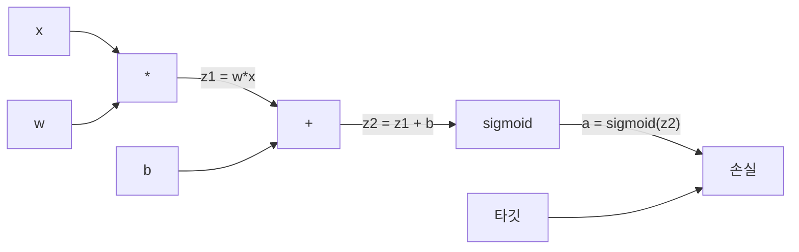
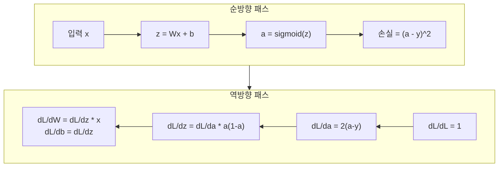

# 밑바닥부터 만드는 역전파

> 🇰🇷 이 문서는 한국어 번역본입니다(ELI5 스타일). 원문: [en.md](en.md)

> 역전파는 학습을 가능하게 만드는 알고리즘입니다. 역전파가 없다면 신경망은 그저 값비싼 난수 생성기에 불과합니다.

**유형:** 만들기(Build)
**언어:** Python
**선수 지식:** 레슨 03.02(다층 신경망)
**시간:** 약 120분

## 학습 목표

- 계산 그래프를 만들고 위상 정렬(topological sort)로 그래디언트(gradient)를 계산하는 Value 기반 오토그래드(autograd) 엔진을 직접 구현합니다
- 연쇄 법칙(chain rule)을 사용해 덧셈, 곱셈, 시그모이드의 역방향 패스(backward pass)를 유도합니다
- 직접 만든 역전파 엔진만으로 XOR 문제와 원(circle) 분류 문제에서 다층 신경망을 학습시킵니다
- 깊은 시그모이드 신경망에서 나타나는 기울기 소실(vanishing gradient) 문제를 확인하고, 그래디언트가 지수적으로 줄어드는 이유를 설명합니다

## 문제 상황

여러분의 신경망에는 입력 768개, 출력 3072개짜리 은닉층이 하나 있습니다. 가중치가 2,359,296개라는 뜻입니다. 이 신경망이 잘못된 예측을 했습니다. 그 오류를 만든 가중치는 어느 것일까요? 가중치를 하나씩 따로 검사하려면 순방향 패스(forward pass)를 230만 번 돌려야 합니다. 역전파는 역방향 패스 딱 한 번으로 230만 개의 그래디언트를 전부 계산합니다. 이건 단순한 최적화가 아닙니다. 학습할 수 있느냐, 아예 불가능하느냐의 차이입니다.

순진한 방법은 이렇습니다. 가중치 하나를 골라 아주 조금 움직여 보고, 순방향 패스를 다시 돌려서 손실이 올랐는지 내렸는지 측정합니다. 그러면 그 가중치의 그래디언트를 알 수 있죠. 이제 이 짓을 신경망의 모든 가중치에 반복합니다. 여기에 학습 단계 수천 번, 데이터 포인트 수백만 개를 곱하면? 쓸만한 뭔가를 학습시키려면 지질학적 시간(수백만 년)이 필요합니다.

역전파가 이 문제를 해결합니다. 순방향 패스 한 번, 역방향 패스 한 번이면 모든 그래디언트가 계산됩니다. 비결은 미적분의 연쇄 법칙을 계산 그래프에 체계적으로 적용하는 것입니다. 딥러닝을 실용적으로 만들어 준 알고리즘이 바로 이것입니다. 역전파가 없었다면 우리는 아직도 장난감 수준의 문제에 갇혀 있었을 겁니다.

## 핵심 개념

### 신경망에 적용한 연쇄 법칙

연쇄 법칙은 페이즈 01, 레슨 05에서 봤습니다. 짧게 복습하면, y = f(g(x))일 때 dy/dx = f'(g(x)) * g'(x)입니다. 사슬을 따라 도함수들을 곱해 나가는 거죠.

신경망에서 이 "사슬"은 입력부터 손실까지 이어지는 연산의 나열입니다. 각 층은 가중치를 곱하고, 편향을 더하고, 활성화 함수를 통과시킵니다. 손실 함수는 최종 출력과 타깃을 비교하고요. 역전파는 이 사슬을 거꾸로 거슬러 올라가면서 각 연산이 오류에 얼마나 기여했는지 계산합니다.

### 계산 그래프

순방향 패스를 돌릴 때마다 그래프가 하나 만들어집니다. 각 노드는 연산(곱셈, 덧셈, 시그모이드)이고, 각 엣지는 값(순방향)과 그래디언트(역방향)를 실어 나릅니다.



순방향 패스: 값이 왼쪽에서 오른쪽으로 흐릅니다. x와 w로 z1 = w*x를 만들고, b를 더해 z2를 얻습니다. 시그모이드를 통과하면 활성화 값 a가 나옵니다. 그리고 손실 함수로 a를 타깃 y와 비교합니다.

역방향 패스: 그래디언트가 오른쪽에서 왼쪽으로 흐릅니다. dL/da(활성화 값이 변할 때 손실이 얼마나 변하는지)에서 시작해서, da/dz2(시그모이드의 도함수)를 곱합니다. 그러면 dL/dz2가 나옵니다. 이것을 dL/db(z2 = z1 + b이므로 dL/dz2와 같음)와 dL/dz1으로 나눕니다. 그다음 dL/dw = dL/dz1 * x, dL/dx = dL/dz1 * w입니다.

그래프의 모든 노드는 역방향 패스에서 딱 한 가지 일을 합니다. 위에서 내려온 그래디언트를 받아 자기 국소 도함수를 곱한 뒤 아래로 전달하는 것입니다.

### 순방향 vs 역방향



순방향 패스는 중간값을 전부 저장합니다. z, a, 각 층의 입력 같은 것들이죠. 역방향 패스는 이렇게 저장해 둔 값을 사용해서 그래디언트를 계산합니다. 이것이 역전파의 핵심에 있는 '메모리-연산량 트레이드오프'입니다. 메모리(활성화 값 저장)를 희생해서 속도(수백만 번 대신 딱 한 번의 패스)를 얻는 겁니다.

### 신경망을 통과하는 그래디언트 흐름

3층 신경망이라면 그래디언트가 모든 층을 거치며 사슬처럼 이어집니다.


각 층을 지날 때마다 그래디언트에 시그모이드 도함수가 곱해집니다. 시그모이드 도함수는 a * (1 - a)인데, 최댓값이 0.25(a = 0.5일 때)밖에 안 됩니다. 세 층을 지나면 그래디언트는 최악의 경우 0.25^3 = 0.0156배가 됩니다. 열 층을 지나면 0.25^10 = 0.000001배죠.

### 기울기 소실

이것이 바로 기울기 소실(vanishing gradient) 문제입니다. 시그모이드는 출력을 0과 1 사이로 눌러 담고, 도함수는 항상 0.25보다 작습니다. 시그모이드 층을 충분히 쌓으면 그래디언트는 결국 0으로 수렴합니다. 앞쪽 층들은 거의 0에 가까운 그래디언트만 받기 때문에 거의 학습하지 못하죠.

```
sigmoid(z):     출력 범위 [0, 1]
sigmoid'(z):    최댓값 0.25 (z = 0일 때)

5층 통과 후:   그래디언트 * 0.25^5 = 원래 값의 0.001배
10층 통과 후:  그래디언트 * 0.25^10 = 원래 값의 0.000001배
```

그래서 깊은 시그모이드 신경망은 학습시키기가 거의 불가능합니다. 해결책인 ReLU와 그 변형들은 레슨 04에서 다룹니다. 지금은 이것만 이해하면 됩니다. 역전파 자체는 완벽하게 동작합니다. 문제는 역전파가 통과해야 하는 활성화 함수에 있는 거죠.

### 2층 신경망 그래디언트 유도하기

입력 x, 시그모이드 은닉층, 시그모이드 출력층, MSE 손실을 가진 신경망의 구체적인 수학입니다.

순방향 패스:
```
z1 = W1 * x + b1
a1 = sigmoid(z1)
z2 = W2 * a1 + b2
a2 = sigmoid(z2)
L = (a2 - y)^2
```

역방향 패스(연쇄 법칙을 한 단계씩 적용):
```
dL/da2 = 2(a2 - y)
da2/dz2 = a2 * (1 - a2)
dL/dz2 = dL/da2 * da2/dz2 = 2(a2 - y) * a2 * (1 - a2)

dL/dW2 = dL/dz2 * a1
dL/db2 = dL/dz2

dL/da1 = dL/dz2 * W2
da1/dz1 = a1 * (1 - a1)
dL/dz1 = dL/da1 * da1/dz1

dL/dW1 = dL/dz1 * x
dL/db1 = dL/dz1
```

모든 그래디언트는 손실에서부터 거슬러 올라간 국소 도함수들의 곱입니다. 역전파가 하는 일이 그게 전부입니다.

```figure
backprop-vanishing
```

## 만들어 보기

### 단계 1: Value 노드

계산에 등장하는 모든 숫자는 Value가 됩니다. Value는 자신의 데이터, 자신의 그래디언트, 그리고 자신이 어떻게 만들어졌는지(역방향 그래디언트 계산 방법을 알아내기 위해 필요합니다)를 저장합니다.

```python
class Value:
    def __init__(self, data, children=(), op=''):
        self.data = data
        self.grad = 0.0
        self._backward = lambda: None
        self._children = set(children)
        self._op = op

    def __repr__(self):
        return f"Value(data={self.data:.4f}, grad={self.grad:.4f})"
```

아직 그래디언트는 없습니다(0.0). 역방향 함수도 아직 없습니다(아무것도 하지 않는 no-op). `_children`은 이 Value를 만들어낸 Value들이 누구인지 기록해 둡니다. 나중에 그래프를 위상 정렬할 때 필요합니다.

### 단계 2: 역방향 함수를 가진 연산들

각 연산은 새로운 Value를 만들면서, 그래디언트가 자신을 통과해 어떻게 거슬러 흐르는지 정의합니다.

```python
def __add__(self, other):
    other = other if isinstance(other, Value) else Value(other)
    out = Value(self.data + other.data, (self, other), '+')

    def _backward():
        self.grad += out.grad
        other.grad += out.grad

    out._backward = _backward
    return out

def __mul__(self, other):
    other = other if isinstance(other, Value) else Value(other)
    out = Value(self.data * other.data, (self, other), '*')

    def _backward():
        self.grad += other.data * out.grad
        other.grad += self.data * out.grad

    out._backward = _backward
    return out
```

덧셈의 경우: d(a+b)/da = 1, d(a+b)/db = 1입니다. 그래서 두 입력은 모두 출력의 그래디언트를 그대로 받습니다.

곱셈의 경우: d(a*b)/da = b, d(a*b)/db = a입니다. 각 입력은 '상대 입력 값 × 출력 그래디언트'를 받습니다.

`+=`가 결정적인 부분입니다. 하나의 Value가 여러 연산에서 쓰일 수 있는데, 그 Value의 그래디언트는 모든 경로에서 온 그래디언트의 합이기 때문입니다.

### 단계 3: 시그모이드와 손실

```python
import math

def sigmoid(self):
    x = self.data
    x = max(-500, min(500, x))
    s = 1.0 / (1.0 + math.exp(-x))
    out = Value(s, (self,), 'sigmoid')

    def _backward():
        self.grad += (s * (1 - s)) * out.grad

    out._backward = _backward
    return out
```

시그모이드 도함수는 sigmoid(x) * (1 - sigmoid(x))입니다. 순방향 패스에서 이미 sigmoid(x) = s를 계산해 뒀으니 재사용하면 됩니다. 추가 계산은 없습니다.

```python
def mse_loss(predicted, target):
    diff = predicted + Value(-target)
    return diff * diff
```

출력이 하나일 때의 MSE는 (predicted - target)^2입니다. 여기서는 뺄셈을 '음수 Value를 더하기'로 표현합니다.

### 단계 4: 역방향 패스

위상 정렬은 노드를 올바른 순서로 처리하도록 보장해 줍니다. 어떤 노드를 통과해 그래디언트를 전파하기 전에, 그 노드의 그래디언트가 먼저 전부 쌓여 있다는 보장이 생기는 거죠.

```python
def backward(self):
    topo = []
    visited = set()

    def build_topo(v):
        if v not in visited:
            visited.add(v)
            for child in v._children:
                build_topo(child)
            topo.append(v)

    build_topo(self)
    self.grad = 1.0
    for v in reversed(topo):
        v._backward()
```

손실에서 시작합니다(그래디언트 = 1.0, dL/dL = 1이므로). 정렬된 그래프를 거꾸로 걸어 내려갑니다. 각 노드의 `_backward`가 자식 노드들에게 그래디언트를 밀어 줍니다.

### 단계 5: 층과 신경망

```python
import random

class Neuron:
    def __init__(self, n_inputs):
        scale = (2.0 / n_inputs) ** 0.5
        self.weights = [Value(random.uniform(-scale, scale)) for _ in range(n_inputs)]
        self.bias = Value(0.0)

    def __call__(self, x):
        act = sum((wi * xi for wi, xi in zip(self.weights, x)), self.bias)
        return act.sigmoid()

    def parameters(self):
        return self.weights + [self.bias]


class Layer:
    def __init__(self, n_inputs, n_outputs):
        self.neurons = [Neuron(n_inputs) for _ in range(n_outputs)]

    def __call__(self, x):
        out = [n(x) for n in self.neurons]
        return out[0] if len(out) == 1 else out

    def parameters(self):
        params = []
        for n in self.neurons:
            params.extend(n.parameters())
        return params


class Network:
    def __init__(self, sizes):
        self.layers = []
        for i in range(len(sizes) - 1):
            self.layers.append(Layer(sizes[i], sizes[i + 1]))

    def __call__(self, x):
        for layer in self.layers:
            x = layer(x)
            if not isinstance(x, list):
                x = [x]
        return x[0] if len(x) == 1 else x

    def parameters(self):
        params = []
        for layer in self.layers:
            params.extend(layer.parameters())
        return params

    def zero_grad(self):
        for p in self.parameters():
            p.grad = 0.0
```

Neuron은 입력을 받아 가중합 + 편향을 계산하고 시그모이드를 적용합니다. 가중치 초기화에서 sqrt(2/n_inputs)로 크기를 조정하는 이유는 더 깊은 신경망에서 시그모이드 포화를 막기 위해서입니다. Layer는 Neuron의 목록이고, Network는 Layer의 목록입니다. `parameters()` 메서드는 학습 가능한 모든 Value를 모아 주기 때문에, 이걸로 값을 갱신할 수 있습니다.

### 단계 6: XOR 학습시키기

```python
random.seed(42)
net = Network([2, 4, 1])

xor_data = [
    ([0.0, 0.0], 0.0),
    ([0.0, 1.0], 1.0),
    ([1.0, 0.0], 1.0),
    ([1.0, 1.0], 0.0),
]

learning_rate = 1.0

for epoch in range(1000):
    total_loss = Value(0.0)
    for inputs, target in xor_data:
        x = [Value(i) for i in inputs]
        pred = net(x)
        loss = mse_loss(pred, target)
        total_loss = total_loss + loss

    net.zero_grad()
    total_loss.backward()

    for p in net.parameters():
        p.data -= learning_rate * p.grad

    if epoch % 100 == 0:
        print(f"Epoch {epoch:4d} | Loss: {total_loss.data:.6f}")

print("\nXOR Results:")
for inputs, target in xor_data:
    x = [Value(i) for i in inputs]
    pred = net(x)
    print(f"  {inputs} -> {pred.data:.4f} (expected {target})")
```

손실이 줄어드는 걸 지켜 보세요. 무작위 예측에서 정확한 XOR 출력까지, 전부 역전파가 그래디언트를 계산하고 가중치를 올바른 방향으로 조금씩 움직여 준 덕분입니다.

### 단계 7: 원 분류

레슨 02에서는 원 분류를 위해 가중치를 손으로 직접 맞춰 봤습니다. 이번에는 신경망이 스스로 학습하게 해 봅시다.

```python
random.seed(7)

def generate_circle_data(n=100):
    data = []
    for _ in range(n):
        x1 = random.uniform(-1.5, 1.5)
        x2 = random.uniform(-1.5, 1.5)
        label = 1.0 if x1 * x1 + x2 * x2 < 1.0 else 0.0
        data.append(([x1, x2], label))
    return data

circle_data = generate_circle_data(80)

circle_net = Network([2, 8, 1])
learning_rate = 0.5

for epoch in range(2000):
    random.shuffle(circle_data)
    total_loss_val = 0.0
    for inputs, target in circle_data:
        x = [Value(i) for i in inputs]
        pred = circle_net(x)
        loss = mse_loss(pred, target)
        circle_net.zero_grad()
        loss.backward()
        for p in circle_net.parameters():
            p.data -= learning_rate * p.grad
        total_loss_val += loss.data

    if epoch % 200 == 0:
        correct = 0
        for inputs, target in circle_data:
            x = [Value(i) for i in inputs]
            pred = circle_net(x)
            predicted_class = 1.0 if pred.data > 0.5 else 0.0
            if predicted_class == target:
                correct += 1
        accuracy = correct / len(circle_data) * 100
        print(f"Epoch {epoch:4d} | Loss: {total_loss_val:.4f} | Accuracy: {accuracy:.1f}%")
```

여기서는 온라인 SGD를 사용합니다. 배치 전체를 모아서 한 번에 갱신하는 대신, 샘플 하나하나를 볼 때마다 가중치를 바로 업데이트하는 방식이죠. 이렇게 하면 대칭성이 더 빨리 깨지고, 전체 손실 지형에서 시그모이드 포화를 피할 수 있습니다. 매 에포크마다 데이터를 섞는 이유는 신경망이 데이터 순서를 통째로 외워 버리는 것을 막기 위해서입니다.

손으로 맞추는 건 이제 없습니다. 신경망이 스스로 원형 결정 경계를 찾아냅니다. 이것이 역전파의 힘입니다. 여러분은 아키텍처와 손실 함수, 데이터만 정의하면 됩니다. 가중치는 알고리즘이 알아서 찾아냅니다.

## 실전에서 쓰기

위에서 한 모든 일을 PyTorch는 몇 줄로 처리합니다. 핵심 아이디어는 완전히 같습니다. 오토그래드(autograd)가 순방향 패스 동안 계산 그래프를 만들고, 그래프를 거꾸로 추적해서 그래디언트를 계산하죠.

```python
import torch
import torch.nn as nn

model = nn.Sequential(
    nn.Linear(2, 4),
    nn.Sigmoid(),
    nn.Linear(4, 1),
    nn.Sigmoid(),
)
optimizer = torch.optim.SGD(model.parameters(), lr=1.0)
criterion = nn.MSELoss()

X = torch.tensor([[0,0],[0,1],[1,0],[1,1]], dtype=torch.float32)
y = torch.tensor([[0],[1],[1],[0]], dtype=torch.float32)

for epoch in range(1000):
    pred = model(X)
    loss = criterion(pred, y)
    optimizer.zero_grad()
    loss.backward()
    optimizer.step()

print("PyTorch XOR Results:")
with torch.no_grad():
    for i in range(4):
        pred = model(X[i])
        print(f"  {X[i].tolist()} -> {pred.item():.4f} (expected {y[i].item()})")
```

`loss.backward()`는 여러분이 쓴 `total_loss.backward()`에 해당합니다. `optimizer.step()`은 여러분이 직접 작성한 `p.data -= lr * p.grad`, `optimizer.zero_grad()`는 `net.zero_grad()`에 해당하죠. 알고리즘은 같은데 구현만 산업용 강도로 되어 있는 겁니다. PyTorch는 GPU 가속, 혼합 정밀도(mixed precision), 그래디언트 체크포인팅, 수백 종의 층 타입을 알아서 처리해 줍니다. 하지만 역방향 패스는 같은 계산 그래프에 같은 연쇄 법칙을 적용하는 것입니다.

학습(훈련)은 순방향 패스를 돌리고, 그다음 역방향 패스를 돌리고, 그다음 가중치를 업데이트합니다. 반면 추론(inference)은 순방향 패스만 돌립니다. 그래디언트도 없고, 업데이트도 없죠. 이 구분이 중요한 이유는 프로덕션(운영 환경)에서 일어나는 일이 추론이기 때문입니다. Claude나 GPT 같은 API를 호출하면 추론이 실행되는 겁니다. 프롬프트가 네트워크를 순방향으로 흐르고, 반대편에서 토큰이 나옵니다. 가중치는 하나도 바뀌지 않죠. 역전파를 이해할 가치가 있는 이유는, 그 네트워크의 모든 가중치가 역전파로 만들어졌기 때문입니다.

## 출시하기

이 레슨이 만드는 산출물:
- `outputs/prompt-gradient-debugger.md` -- 모든 신경망에서 그래디언트 문제(소실, 폭발, NaN)를 진단하기 위한 재사용 가능한 프롬프트

## 연습 문제

1. Value 클래스에 `__sub__` 메서드를 추가합니다(a - b = a + (-1 * b)). 이어서 `__neg__` 메서드도 구현해 보세요. (a - b)^2 같은 간단한 식을 손으로 계산한 결과와 비교해서 그래디언트가 맞는지 확인합니다.

2. Value에 `relu` 메서드를 추가합니다(출력은 max(0, x), 도함수는 x > 0일 때 1, 아니면 0). 은닉층의 시그모이드를 relu로 바꿔서 XOR을 다시 학습시켜 보세요. 수렴 속도를 비교합니다. 학습이 더 빨라지는 걸 볼 수 있을 겁니다. 레슨 04의 맛보기입니다.

3. Value에 정수 거듭제곱을 위한 `__pow__` 메서드를 구현합니다. 이걸로 `mse_loss`를 제대로 된 `(predicted - target) ** 2` 식으로 바꿔 보세요. 그래디언트가 원래 구현과 일치하는지 확인합니다.

4. 학습 루프에 그래디언트 클리핑(gradient clipping)을 추가합니다. `backward()`를 호출한 뒤 모든 그래디언트를 [-1, 1] 범위로 잘라내는 거죠. 더 깊은 신경망(시그모이드로 만든 4층 이상)을 학습시키고, 클리핑을 적용했을 때와 안 했을 때의 손실 곡선을 비교해 보세요. 그래디언트 폭발에 대한 여러분의 첫 방어선입니다.

5. 시각화를 만들어 봅시다. XOR 학습이 끝나면 신경망의 모든 파라미터 그래디언트를 출력합니다. 어느 층의 그래디언트가 가장 작은지 찾아보세요. 핵심 개념 섹션에서 읽은 기울기 소실 문제를 직접 확인할 수 있습니다.

## 핵심 용어

| 용어 | 사람들이 말하는 표현 | 실제 의미 |
|------|----------------|----------------------|
| 역전파(Backpropagation) | "네트워크가 학습해요" | 계산 그래프를 거꾸로 따라가며 연쇄 법칙을 적용해, 모든 가중치에 대해 dL/dw를 계산하는 알고리즘 |
| 계산 그래프(Computational graph) | "네트워크 구조" | 노드는 연산이고 엣지는 값(순방향)과 그래디언트(역방향)를 실어 나르는 방향성 비순환 그래프 |
| 연쇄 법칙(Chain rule) | "도함수를 곱하면 돼요" | y = f(g(x))이면 dy/dx = f'(g(x)) * g'(x). 역전파의 수학적 토대 |
| 그래디언트(Gradient) | "가장 가파르게 오르는 방향" | 손실을 파라미터로 편미분한 값. 손실을 줄이려면 그 파라미터를 어느 방향으로 바꿔야 하는지 알려 줍니다 |
| 기울기 소실(Vanishing gradient) | "깊은 네트워크는 학습이 안 돼요" | 그래디언트가 시그모이드처럼 포화되는 활성화 함수가 있는 층들을 거치며 지수적으로 줄어드는 현상 |
| 순방향 패스(Forward pass) | "네트워크 돌리기" | 각 층의 연산을 순서대로 적용하고 중간값을 저장하면서, 입력으로부터 출력을 계산하는 과정 |
| 역방향 패스(Backward pass) | "그래디언트 계산하기" | 계산 그래프를 거꾸로 순회하면서 연쇄 법칙으로 각 노드에 그래디언트를 쌓아 가는 과정 |
| 학습률(Learning rate) | "얼마나 빨리 배우나" | 가중치를 업데이트할 때의 보폭(스텝 크기)을 조절하는 스칼라 값. w_new = w_old - lr * gradient |
| 위상 정렬(Topological sort) | "올바른 순서" | 그래프 노드를, 자신이 의존하는 모든 노드 뒤에 오도록 나열한 순서. 그래디언트 전파 전에 각 노드의 그래디언트가 다 쌓였음을 보장합니다 |
| 오토그래드(Autograd) | "자동 미분" | 순방향 계산 중에 계산 그래프를 만들고 그래디언트를 자동으로 계산해 주는 시스템. PyTorch의 엔진이 하는 일이 바로 이것입니다 |

## 더 읽을거리

- Rumelhart, Hinton & Williams, "Learning representations by back-propagating errors" (1986) -- 역전파를 대중화하고 다층 신경망 학습의 문을 연 논문
- 3Blue1Brown, "Neural Networks" 시리즈 (https://www.youtube.com/playlist?list=PLZHQObOWTQDNU6R1_67000Dx_ZCJB-3pi) -- 역전파와 신경망을 흐르는 그래디언트를 시각적으로 가장 잘 설명한 자료
