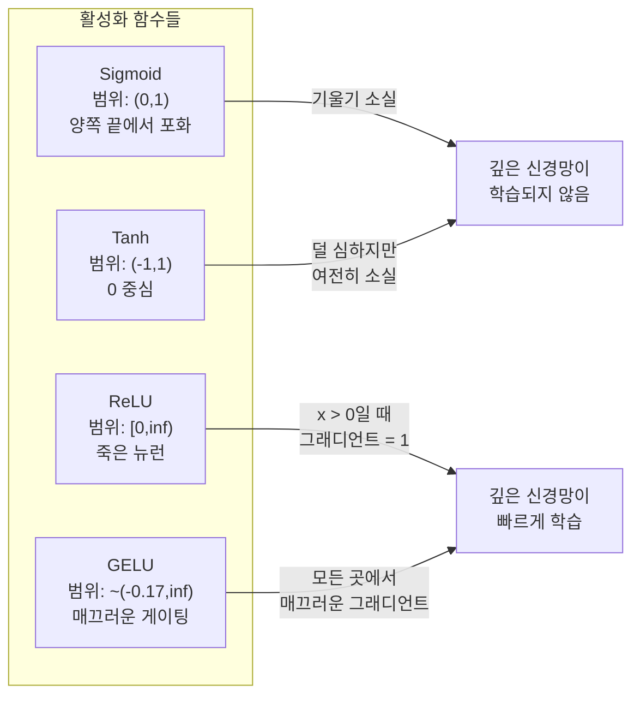
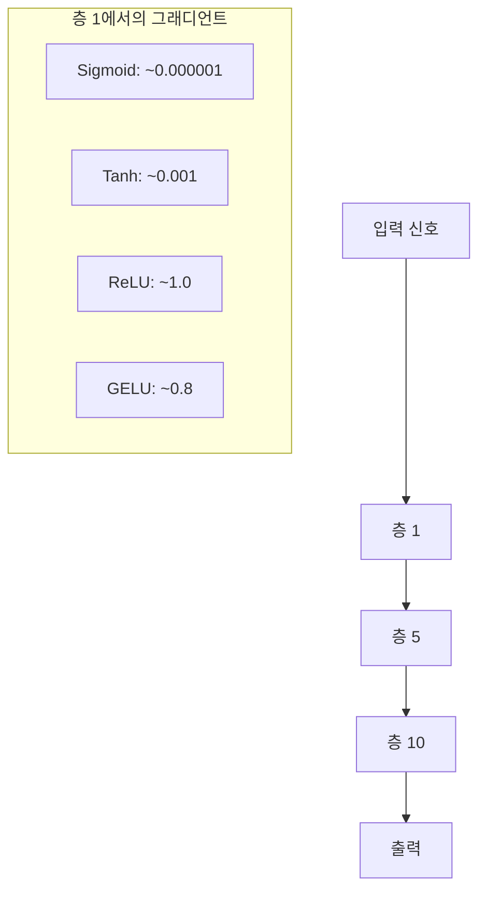
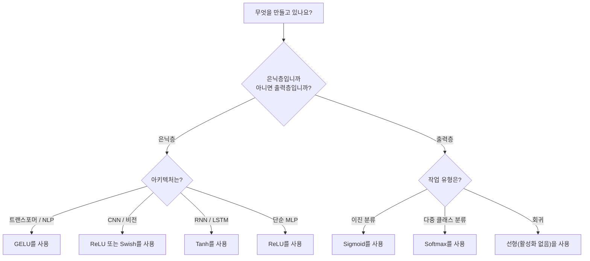

# 활성화 함수

> 🇰🇷 이 문서는 한국어 번역본입니다(ELI5 스타일). 원문: [en.md](en.md)

> 비선형성이 없다면 여러분의 100층 신경망은 그저 화려한 행렬 곱셈일 뿐입니다. 활성화 함수는 신경망이 곡선으로 사고할 수 있게 해 주는 관문입니다.

**유형:** 만들기(Build)
**언어:** Python
**선수 지식:** 레슨 03.03(역전파)
**시간:** 약 75분

## 학습 목표

- sigmoid, tanh, ReLU, Leaky ReLU, GELU, Swish, softmax와 그 도함수들을 밑바닥부터 구현합니다
- 서로 다른 활성화 함수를 10층 이상 통과시키면서 활성화 값의 크기를 측정해 기울기 소실 문제를 진단합니다
- ReLU 신경망에서 죽은 뉴런(dead neuron)을 탐지하고, GELU가 이런 실패 모드를 피하는 이유를 설명합니다
- 주어진 아키텍처(트랜스포머, CNN, RNN, 출력층)에 맞는 올바른 활성화 함수를 선택합니다

## 문제 상황

선형 변환 두 개를 쌓아 보겠습니다. y = W2(W1x + b1) + b2. 전개하면 y = W2W1x + W2b1 + b2가 됩니다. 이는 결국 y = Ax + c, 즉 단 하나의 선형 변환입니다. 선형 층을 아무리 많이 쌓아도 결과는 행렬 곱셈 하나로 합쳐져 버립니다. 여러분의 100층 신경망은 표현력이 층 하나짜리와 똑같은 거죠.

이건 이론 속 재미있는 사실 정도가 아닙니다. 깊은 선형 신경망은 문자 그대로 XOR을 배울 수 없고, 나선형 데이터셋을 분류할 수 없고, 얼굴을 인식할 수 없다는 뜻입니다. 활성화 함수가 없다면 깊이는 환상에 불과합니다.

활성화 함수가 이 선형성을 깨뜨립니다. 각 층의 출력을 비선형 함수로 구부려 주기 때문에, 신경망이 결정 경계를 휘게 만들고, 임의의 함수를 근사하고, 실제로 학습할 수 있게 되는 거죠. 하지만 잘못된 활성화 함수를 고르면 그래디언트가 0으로 사라지거나(깊은 신경망의 sigmoid), 무한대로 폭발하거나(초기화를 소홀히 한 무한대 범위 활성화), 뉴런이 영구히 죽어 버립니다(큰 음수 편향을 가진 ReLU). 활성화 함수 선택이 신경망이 학습 자체를 할 수 있는지를 직접 결정합니다.

## 핵심 개념

### 비선형성이 왜 필요한가

행렬 곱셈은 결합할 수 있습니다. 벡터에 행렬 A를 곱한 뒤 행렬 B를 곱하는 것은 AB를 곱하는 것과 완전히 같습니다. 즉, 선형 층 열 개를 쌓는 것은 거대한 행렬 하나를 가진 선형 층 하나와 수학적으로 동치입니다. 그 많은 파라미터, 그 깊은 구조가 전부 낭비되는 거죠. 이 사슬을 끊어 줄 무언가가 필요합니다. 활성화 함수가 바로 그 역할을 합니다.

증명해 보겠습니다. 선형 층은 f(x) = Wx + b를 계산합니다. 두 개를 쌓으면:

```
Layer 1: h = W1 * x + b1
Layer 2: y = W2 * h + b2
```

대입하면:

```
y = W2 * (W1 * x + b1) + b2
y = (W2 * W1) * x + (W2 * b1 + b2)
y = A * x + c
```

층 하나가 되어 버렸습니다. 이제 층 사이에 비선형 활성화 g()를 넣어 보겠습니다:

```
h = g(W1 * x + b1)
y = W2 * h + b2
```

이번에는 대입이 안 됩니다. W2 * g(W1 * x + b1) + b2는 단일 선형 변환으로 줄일 수 없습니다. 신경망이 비선형 함수를 표현할 수 있게 된 거죠. 활성화 함수가 들어 있는 층이 하나 늘어날 때마다 표현력이 하나씩 늘어납니다.

### Sigmoid

신경망의 원조 활성화 함수입니다.

```
sigmoid(x) = 1 / (1 + e^(-x))
```

출력 범위는 (0, 1)입니다. 매끄럽고, 미분 가능하고, 어떤 실수든 확률 같은 값으로 바꿔 줍니다.

도함수는:

```
sigmoid'(x) = sigmoid(x) * (1 - sigmoid(x))
```

이 도함수의 최댓값은 0.25로, x = 0에서 나옵니다. 역전파에서 그래디언트는 층을 거치며 곱해집니다. 시그모이드 열 층을 지나면 그래디언트는 최악의 경우 0.25를 열 번 곱한 값이 됩니다:

```
0.25^10 = 0.000000953674
```

원래 신호의 백만 분의 일보다도 작습니다. 이것이 기울기 소실(vanishing gradient) 문제입니다. 앞쪽 층의 그래디언트가 너무 작아져서 가중치가 거의 업데이트되지 않습니다. 신경망이 학습하는 것처럼 보입니다(뒤쪽 층에서는 손실이 줄어드니까) -- 하지만 첫 번째 층들은 얼어 붙어 있습니다. 깊은 시그모이드 신경망은 학습이 안 됩니다.

추가 문제: 시그모이드 출력은 항상 양수(0에서 1)이므로, 가중치에 대한 그래디언트도 항상 같은 부호를 가집니다. 이로 인해 경사 하강법이 지그재그로 움직이게 됩니다.

### Tanh

시그모이드의 중심을 0으로 옮긴 버전입니다.

```
tanh(x) = (e^x - e^(-x)) / (e^x + e^(-x))
```

출력 범위는 (-1, 1)입니다. 0을 중심으로 하기 때문에 지그재그 문제가 사라집니다.

도함수는:

```
tanh'(x) = 1 - tanh(x)^2
```

최댓값은 x = 0에서 1.0으로, 시그모이드보다 네 배 좋습니다. 하지만 기울기 소실 문제는 여전히 존재합니다. 입력이 큰 양수나 큰 음수면 도함수는 0에 가까워집니다. 열 층이면 여전히 그래디언트를 짓누릅니다. 다만 시그모이드보다는 덜 공격적일 뿐이죠.

### ReLU: 돌파구

Rectified Linear Unit(정류 선형 유닛). Nair와 Hinton이 2010년에 딥러닝용으로 널리 알렸고(함수 자체는 1969년 후쿠시마의 연구까지 거슬러 올라갑니다), 모든 것을 바꿔 놓았습니다.

```
relu(x) = max(0, x)
```

출력 범위는 [0, 무한대)입니다. 도함수는 놀랄 만큼 단순합니다:

```
relu'(x) = 1  if x > 0
            0  if x <= 0
```

양수 입력에서는 기울기 소실이 없습니다. 그래디언트가 정확히 1이라 그대로 통과합니다. 깊은 신경망이 학습 가능해진 이유가 바로 이것입니다. ReLU는 그래디언트 크기를 층을 넘나들며 보존합니다.

하지만 실패 모드가 하나 있습니다. 죽은 뉴런(dead neuron) 문제입니다. 어떤 뉴런의 가중 입력이 항상 음수라면(큰 음수 편향이나 불운한 가중치 초기화 때문에), 출력은 항상 0, 그래디언트도 항상 0이고, 결코 업데이트되지 않습니다. 영원히 죽어 있는 거죠. 실제로 ReLU 신경망의 뉴런 10~40%가 학습 중에 죽을 수 있습니다.

### Leaky ReLU

죽은 뉴런에 대한 가장 단순한 해결책입니다.

```
leaky_relu(x) = x        if x > 0
                alpha * x if x <= 0
```

alpha는 작은 상수로, 보통 0.01을 씁니다. 음수 쪽에 기울기 0 대신 작은 기울기가 있으므로, 죽은 뉴런도 여전히 그래디언트 신호를 받아 회복할 수 있습니다.

### GELU: 현대의 기본값

Gaussian Error Linear Unit. Hendrycks와 Gimpel이 2016년에 소개했습니다. BERT, GPT, 그리고 대부분의 현대 트랜스포머의 기본 활성화 함수입니다.

```
gelu(x) = x * Phi(x)
```

Phi(x)는 표준 정규분포의 누적 분포 함수입니다. 실무에서 쓰는 근사식은:

```
gelu(x) ~= 0.5 * x * (1 + tanh(sqrt(2/pi) * (x + 0.044715 * x^3)))
```

GELU는 모든 지점에서 매끄럽고, 작은 음수 값을 허용하며(0으로 hard-clipping하는 ReLU와 다릅니다), 확률적인 해석도 가능합니다. 각 입력을 '가우시안 분포에서 양수일 확률'로 가중치를 매기는 거죠. 이 매끄러운 게이팅은 그래디언트 흐름이 더 좋고 죽은 뉴런 문제를 완전히 피하기 때문에, 트랜스포머 아키텍처에서 ReLU보다 성능이 뛰어납니다.

### Swish / SiLU

Ramachandran 등이 2017년 자동 탐색으로 발견한 셀프 게이팅(self-gated) 활성화 함수입니다.

```
swish(x) = x * sigmoid(x)
```

Swish는 공식적으로 x * sigmoid(x)입니다. Google이 활성화 함수 공간을 자동 탐색해서 발견했죠. 신경망이 신경망의 부품을 설계한 셈입니다.

GELU처럼 매끄럽고, 비단조적이며, 작은 음수 값을 허용합니다. 차이는 미묘합니다. Swish는 게이팅에 sigmoid를 쓰고 GELU는 가우시안 CDF를 쓴다는 것. 실제 성능은 거의 동일합니다. Swish는 EfficientNet과 일부 비전 모델에 쓰이고, 언어 모델에서는 GELU가 지배적입니다.

### Softmax: 출력층의 활성화 함수

은닉층에는 쓰지 않습니다. Softmax는 로짓(logit)이라 불리는 원시 점수 벡터를 확률 분포로 바꿔 줍니다.

```
softmax(x_i) = e^(x_i) / sum(e^(x_j) for all j)
```

모든 출력이 0과 1 사이에 있고, 출력 전체의 합이 1입니다. 그래서 다중 클래스 분류의 표준 마지막 활성화 함수입니다. 가장 큰 로짓이 가장 높은 확률을 받지만, argmax와 달리 softmax는 미분 가능하고 상대적인 확신의 크기 정보도 유지합니다.

### 모양 비교



### 그래디언트 흐름 비교



### 언제 어떤 활성화 함수를 쓸까



```figure
softmax-temperature
```

## 만들어 보기

### 단계 1: 도함수까지 전부 구현하기

각 함수는 float 하나를 받아 float 하나를 반환합니다. 각 도함수 함수도 같은 입력을 받아 그래디언트를 반환합니다.

```python
import math

def sigmoid(x):
    x = max(-500, min(500, x))
    return 1.0 / (1.0 + math.exp(-x))

def sigmoid_derivative(x):
    s = sigmoid(x)
    return s * (1 - s)

def tanh_act(x):
    return math.tanh(x)

def tanh_derivative(x):
    t = math.tanh(x)
    return 1 - t * t

def relu(x):
    return max(0.0, x)

def relu_derivative(x):
    return 1.0 if x > 0 else 0.0

def leaky_relu(x, alpha=0.01):
    return x if x > 0 else alpha * x

def leaky_relu_derivative(x, alpha=0.01):
    return 1.0 if x > 0 else alpha

def gelu(x):
    return 0.5 * x * (1 + math.tanh(math.sqrt(2 / math.pi) * (x + 0.044715 * x ** 3)))

def gelu_derivative(x):
    phi = 0.5 * (1 + math.erf(x / math.sqrt(2)))
    pdf = math.exp(-0.5 * x * x) / math.sqrt(2 * math.pi)
    return phi + x * pdf

def swish(x):
    return x * sigmoid(x)

def swish_derivative(x):
    s = sigmoid(x)
    return s + x * s * (1 - s)

def softmax(xs):
    max_x = max(xs)
    exps = [math.exp(x - max_x) for x in xs]
    total = sum(exps)
    return [e / total for e in exps]
```

### 단계 2: 그래디언트가 죽는 지점 시각화하기

-5부터 5까지 균등한 100개 지점에서 그래디언트를 계산합니다. 각 활성화 함수의 그래디언트가 어디서 거의 0이 되는지 텍스트 히스토그램으로 출력하죠.

```python
def gradient_scan(name, derivative_fn, start=-5, end=5, n=100):
    step = (end - start) / n
    near_zero = 0
    healthy = 0
    for i in range(n):
        x = start + i * step
        g = derivative_fn(x)
        if abs(g) < 0.01:
            near_zero += 1
        else:
            healthy += 1
    pct_dead = near_zero / n * 100
    print(f"{name:15s}: {healthy:3d} healthy, {near_zero:3d} near-zero ({pct_dead:.0f}% dead zone)")

gradient_scan("Sigmoid", sigmoid_derivative)
gradient_scan("Tanh", tanh_derivative)
gradient_scan("ReLU", relu_derivative)
gradient_scan("Leaky ReLU", leaky_relu_derivative)
gradient_scan("GELU", gelu_derivative)
gradient_scan("Swish", swish_derivative)
```

### 단계 3: 기울기 소실 실험

신호를 sigmoid와 ReLU 각각으로 N개 층에 순방향 통과시켜 봅니다. 활성화 값의 크기가 어떻게 변하는지 측정하죠.

```python
import random

def vanishing_gradient_experiment(activation_fn, name, n_layers=10, n_inputs=5):
    random.seed(42)
    values = [random.gauss(0, 1) for _ in range(n_inputs)]

    print(f"\n{name} through {n_layers} layers:")
    for layer in range(n_layers):
        weights = [random.gauss(0, 1) for _ in range(n_inputs)]
        z = sum(w * v for w, v in zip(weights, values))
        activated = activation_fn(z)
        magnitude = abs(activated)
        bar = "#" * int(magnitude * 20)
        print(f"  Layer {layer+1:2d}: magnitude = {magnitude:.6f} {bar}")
        values = [activated] * n_inputs

vanishing_gradient_experiment(sigmoid, "Sigmoid")
vanishing_gradient_experiment(relu, "ReLU")
vanishing_gradient_experiment(gelu, "GELU")
```

### 단계 4: 죽은 뉴런 탐지기

ReLU 신경망을 만들고, 무작위 입력을 흘려 보내서 몇 개의 뉴런이 한 번도 발화하지 않는지 세어 봅니다.

```python
def dead_neuron_detector(n_inputs=5, hidden_size=20, n_samples=1000):
    random.seed(0)
    weights = [[random.gauss(0, 1) for _ in range(n_inputs)] for _ in range(hidden_size)]
    biases = [random.gauss(0, 1) for _ in range(hidden_size)]

    fire_counts = [0] * hidden_size

    for _ in range(n_samples):
        inputs = [random.gauss(0, 1) for _ in range(n_inputs)]
        for neuron_idx in range(hidden_size):
            z = sum(w * x for w, x in zip(weights[neuron_idx], inputs)) + biases[neuron_idx]
            if relu(z) > 0:
                fire_counts[neuron_idx] += 1

    dead = sum(1 for c in fire_counts if c == 0)
    rarely_fire = sum(1 for c in fire_counts if 0 < c < n_samples * 0.05)
    healthy = hidden_size - dead - rarely_fire

    print(f"\nDead Neuron Report ({hidden_size} neurons, {n_samples} samples):")
    print(f"  Dead (never fired):     {dead}")
    print(f"  Barely alive (<5%):     {rarely_fire}")
    print(f"  Healthy:                {healthy}")
    print(f"  Dead neuron rate:       {dead/hidden_size*100:.1f}%")

    for i, c in enumerate(fire_counts):
        status = "DEAD" if c == 0 else "WEAK" if c < n_samples * 0.05 else "OK"
        bar = "#" * (c * 40 // n_samples)
        print(f"  Neuron {i:2d}: {c:4d}/{n_samples} fires [{status:4s}] {bar}")

dead_neuron_detector()
```

### 단계 5: 학습 비교 -- Sigmoid vs ReLU vs GELU

같은 두 층짜리 신경망을 원 데이터셋(원 안의 점 = 클래스 1, 밖 = 클래스 0)으로 세 가지 활성화 함수를 적용해 학습시킵니다. 수렴 속도를 비교해 보죠.

```python
def make_circle_data(n=200, seed=42):
    random.seed(seed)
    data = []
    for _ in range(n):
        x = random.uniform(-2, 2)
        y = random.uniform(-2, 2)
        label = 1.0 if x * x + y * y < 1.5 else 0.0
        data.append(([x, y], label))
    return data


class ActivationNetwork:
    def __init__(self, activation_fn, activation_deriv, hidden_size=8, lr=0.1):
        random.seed(0)
        self.act = activation_fn
        self.act_d = activation_deriv
        self.lr = lr
        self.hidden_size = hidden_size

        self.w1 = [[random.gauss(0, 0.5) for _ in range(2)] for _ in range(hidden_size)]
        self.b1 = [0.0] * hidden_size
        self.w2 = [random.gauss(0, 0.5) for _ in range(hidden_size)]
        self.b2 = 0.0

    def forward(self, x):
        self.x = x
        self.z1 = []
        self.h = []
        for i in range(self.hidden_size):
            z = self.w1[i][0] * x[0] + self.w1[i][1] * x[1] + self.b1[i]
            self.z1.append(z)
            self.h.append(self.act(z))

        self.z2 = sum(self.w2[i] * self.h[i] for i in range(self.hidden_size)) + self.b2
        self.out = sigmoid(self.z2)
        return self.out

    def backward(self, target):
        error = self.out - target
        d_out = error * self.out * (1 - self.out)

        for i in range(self.hidden_size):
            d_h = d_out * self.w2[i] * self.act_d(self.z1[i])
            self.w2[i] -= self.lr * d_out * self.h[i]
            for j in range(2):
                self.w1[i][j] -= self.lr * d_h * self.x[j]
            self.b1[i] -= self.lr * d_h
        self.b2 -= self.lr * d_out

    def train(self, data, epochs=200):
        losses = []
        for epoch in range(epochs):
            total_loss = 0
            correct = 0
            for x, y in data:
                pred = self.forward(x)
                self.backward(y)
                total_loss += (pred - y) ** 2
                if (pred >= 0.5) == (y >= 0.5):
                    correct += 1
            avg_loss = total_loss / len(data)
            accuracy = correct / len(data) * 100
            losses.append(avg_loss)
            if epoch % 50 == 0 or epoch == epochs - 1:
                print(f"    Epoch {epoch:3d}: loss={avg_loss:.4f}, accuracy={accuracy:.1f}%")
        return losses


data = make_circle_data()

configs = [
    ("Sigmoid", sigmoid, sigmoid_derivative),
    ("ReLU", relu, relu_derivative),
    ("GELU", gelu, gelu_derivative),
]

results = {}
for name, act_fn, act_d_fn in configs:
    print(f"\n=== Training with {name} ===")
    net = ActivationNetwork(act_fn, act_d_fn, hidden_size=8, lr=0.1)
    losses = net.train(data, epochs=200)
    results[name] = losses

print("\n=== Final Loss Comparison ===")
for name, losses in results.items():
    print(f"  {name:10s}: start={losses[0]:.4f} -> end={losses[-1]:.4f} (improvement: {(1 - losses[-1]/losses[0])*100:.1f}%)")
```

## 실전에서 쓰기

PyTorch는 이 모든 것을 함수형과 모듈형 두 가지 형태로 제공합니다:

```python
import torch
import torch.nn as nn
import torch.nn.functional as F

x = torch.randn(4, 10)

relu_out = F.relu(x)
gelu_out = F.gelu(x)
sigmoid_out = torch.sigmoid(x)
swish_out = F.silu(x)

logits = torch.randn(4, 5)
probs = F.softmax(logits, dim=1)

model = nn.Sequential(
    nn.Linear(10, 64),
    nn.GELU(),
    nn.Linear(64, 32),
    nn.GELU(),
    nn.Linear(32, 5),
)
```

트랜스포머의 은닉층: GELU. CNN의 은닉층: ReLU. 분류의 출력층: softmax. 회귀의 출력층: 없음(선형). 확률 출력층: sigmoid. 이게 전부입니다. 이 기본값으로 시작하세요. 근거가 있을 때만 바꿉니다.

RNN과 LSTM은 은닉 상태에 tanh, 게이트에 sigmoid를 쓰지만, 오늘날 새로 만든다면 아마 RNN을 쓰고 있지 않을 겁니다. ReLU 신경망에서 뉴런이 죽어 나가면 GELU로 바꾸세요. 특별한 이유가 없다면 Leaky ReLU를 찾을 필요가 없습니다. GELU가 죽은 뉴런 문제를 해결하고 그래디언트 흐름도 더 좋게 해 줍니다.

## 출시하기

이 레슨이 만드는 산출물:
- `outputs/prompt-activation-selector.md` -- 어떤 아키텍처에든 맞는 활성화 함수를 고르도록 도와주는 재사용 가능한 프롬프트

## 연습 문제

1. 음수 기울기 alpha를 학습 가능한 파라미터로 만든 Parametric ReLU(PReLU)를 구현합니다. 원 데이터셋으로 학습시키고 고정된 Leaky ReLU와 비교해 보세요.

2. 기울기 소실 실험을 10개 대신 50개 층으로 실행합니다. sigmoid, tanh, ReLU, GELU 각각에 대해 층별 신호 크기를 그려 보세요. 각 활성화 함수의 신호가 사실상 0에 도달하는 층은 어디입니까?

3. ELU(Exponential Linear Unit)를 구현합니다: elu(x) = x if x > 0, alpha * (e^x - 1) if x <= 0. 같은 신경망에서 ReLU와 죽은 뉴런 비율을 비교해 보세요.

4. 학습 중에 돌아가는 '그래디언트 건강 모니터'를 만듭니다. 매 에포크마다 층별 평균 그래디언트 크기를 계산하고, 어느 층의 그래디언트가 0.001보다 작아지거나 100을 넘으면 경고를 출력합니다.

5. 학습 비교 코드를 원 데이터셋 대신 레슨 01의 XOR 데이터셋으로 바꿔 실행합니다. XOR에서는 어떤 활성화 함수가 가장 빨리 수렴합니까? 원 데이터셋 결과와 왜 다릅니까?

## 핵심 용어

| 용어 | 사람들이 말하는 표현 | 실제 의미 |
|------|----------------|----------------------|
| 활성화 함수(Activation function) | "비선형 담당 부분" | 각 뉴런의 출력에 적용해 선형성을 깨뜨리는 함수. 신경망이 비선형 매핑을 학습할 수 있게 해 줍니다 |
| 기울기 소실(Vanishing gradient) | "깊은 신경망에서 그래디언트가 사라져요" | 활성화 함수의 도함수가 1보다 작으면 그래디언트가 층을 거치며 지수적으로 줄어들어 앞쪽 층이 학습되지 않는 현상 |
| 기울기 폭발(Exploding gradient) | "그래디언트가 터져요" | 유효 곱셈 계수가 1을 넘으면 그래디언트가 층을 거치며 지수적으로 커져 학습이 불안정해지는 현상 |
| 죽은 뉴런(Dead neuron) | "학습을 멈춘 뉴런" | 입력이 영구히 음수인 ReLU 뉴런. 출력도 그래디언트도 항상 0입니다 |
| Sigmoid | "값을 0~1로 눌러 담아요" | 로지스틱 함수 1/(1+e^-x). 역사적으로 중요하지만 깊은 신경망에서 기울기 소실을 일으킵니다 |
| ReLU | "음수는 0으로 잘라요" | max(0, x). 그래디언트 크기를 보존해서 딥러닝을 실용적으로 만든 활성화 함수 |
| GELU | "트랜스포머의 활성화 함수" | Gaussian Error Linear Unit. 입력을 '양수일 확률'로 가중치 매기는 매끄러운 활성화 함수 |
| Swish/SiLU | "셀프 게이팅 ReLU" | x * sigmoid(x). 자동 탐색으로 발견되었으며 EfficientNet에 사용됩니다 |
| Softmax | "점수를 확률로 바꿔요" | 로짓 벡터를, 모든 값이 (0,1) 범위이고 합이 1인 확률 분포로 정규화합니다 |
| Leaky ReLU | "죽지 않는 ReLU" | max(alpha*x, x), alpha는 작은 값(0.01). 작은 음수 그래디언트를 허용해 죽은 뉴런을 막습니다 |
| 포화(Saturation) | "시그모이드의 평평한 구간" | 활성화 함수의 도함수가 0에 가까워지는 영역. 그래디언트 흐름을 막습니다 |
| 로짓(Logit) | "softmax 직전의 원시 점수" | softmax나 sigmoid를 적용하기 전 마지막 층의 정규화되지 않은 출력 |

## 더 읽을거리

- Nair & Hinton, "Rectified Linear Units Improve Restricted Boltzmann Machines" (2010) -- ReLU를 소개하고 깊은 신경망 학습을 가능하게 만든 논문
- Hendrycks & Gimpel, "Gaussian Error Linear Units (GELUs)" (2016) -- 트랜스포머의 기본값이 된 활성화 함수를 소개한 논문
- Ramachandran et al., "Searching for Activation Functions" (2017) -- 자동 탐색으로 Swish를 발견하고, 활성화 함수 설계도 자동화할 수 있음을 보인 논문
- Glorot & Bengio, "Understanding the difficulty of training deep feedforward neural networks" (2010) -- 기울기 소실/폭발을 진단하고 Xavier 초기화를 제안한 논문
- Goodfellow, Bengio, Courville, "Deep Learning" 6.3장 (https://www.deeplearningbook.org/) -- 은닉 유닛과 활성화 함수를 엄밀하게 다룬 자료
