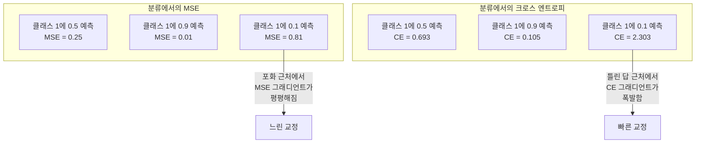
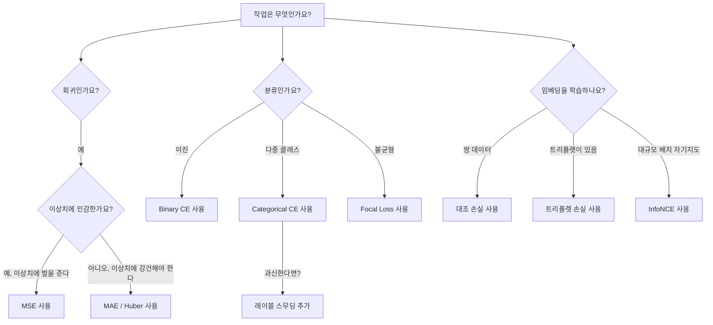
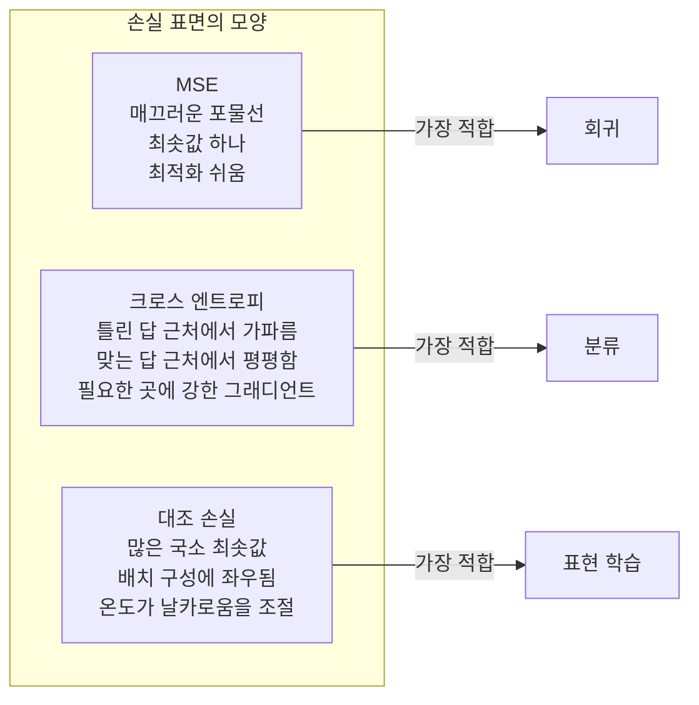

# 손실 함수

> 🇰🇷 이 문서는 한국어 번역본입니다(ELI5 스타일). 원문: [en.md](en.md)

> 신경망이 예측을 내립니다. 정답(ground truth)은 다른 말을 하죠. 얼마나 틀렸을까요? 그 숫자가 바로 손실입니다. 잘못된 손실 함수를 고르면 모델은 엉뚱한 것을 최적화합니다.

**유형:** 만들기(Build)
**언어:** Python
**선수 지식:** 레슨 03.04(활성화 함수)
**시간:** 약 75분

## 학습 목표

- MSE, 이진 크로스 엔트로피, 범주형 크로스 엔트로피, 대조 손실(InfoNCE)을 그래디언트까지 포함해 밑바닥부터 구현합니다
- "모든 입력에 0.5를 예측하는" 실패 모드를 직접 보여 주면서, 분류 문제에서 MSE가 실패하는 이유를 설명합니다
- 크로스 엔트로피에 레이블 스무딩(label smoothing)을 적용하고, 과신한 예측을 막아 주는 원리를 설명합니다
- 회귀, 이진 분류, 다중 클래스 분류, 임베딩 학습 작업에 맞는 올바른 손실 함수를 선택합니다

## 문제 상황

분류 문제에서 MSE를 최소화하는 모델은 모든 입력에 자신만만하게 0.5를 예측합니다. 손실은 확실히 최소화하고 있죠. 하지만 아무 쓸모도 없습니다.

손실 함수는 모델이 실제로 최적화하는 유일한 대상입니다. 정확도도 아니고, F1 점수도 아니고, 상사에게 보고할 어떤 지표도 아닙니다. 옵티마이저는 손실 함수의 그래디언트를 받아서 그 숫자를 작게 만들도록 가중치를 조정합니다. 손실 함수가 여러분이 정말 신경 쓰는 것을 담고 있지 않으면, 모델은 그것을 만족하는 수학적으로 가장 값싼 방법을 찾아낼 겁니다. 그리고 그 방법은 거의 결코 여러분이 원했던 것이 아닙니다.

구체적인 예를 봅시다. 이진 분류 작업이 있습니다. 두 클래스, 50 대 50 비율이죠. 손실로 MSE를 사용합니다. 모델은 모든 입력에 0.5를 예측합니다. 평균 MSE는 0.25인데, 이게 아무것도 배우지 않고서는 도달할 수 있는 최소값입니다. 모델의 판별 능력은 0이지만, 기술적으로는 손실 함수를 최소화한 게 맞습니다. 크로스 엔트로피로 바꾸면 같은 모델이 예측을 0이나 1 쪽으로 밀어낼 수밖에 없습니다. -log(0.5) = 0.693은 끔찍한 손실이고, -log(0.99) = 0.01은 자신 있게 맞춘 예측에 보상을 주기 때문이죠. 손실 함수 선택이 '배우는 모델'과 '지표를 편 취하는 모델'의 차이입니다.

더 심한 경우도 있습니다. 자기지도 학습(self-supervised learning)에서는 레이블조차 없습니다. 대조 손실(contrastive loss)이 학습 신호를 전부 정의합니다. 무엇을 비슷하다고 볼지, 무엇을 다르다고 볼지, 모델이 얼마나 세게 둘을 밀어낼지 말이죠. 대조 손실을 잘못 정의하면 임베딩이 한 점으로 무너집니다. 모든 입력이 같은 벡터로 매핑되는 거죠. 기술적으로는 손실 0. 하지만 완전히 쓸모없습니다.

## 핵심 개념

### 평균 제곱 오차(MSE)

회귀의 기본값입니다. 예측과 타깃의 차이를 제곱하고, 모든 샘플에 대해 평균 냅니다.

```
MSE = (1/n) * sum((y_pred - y_true)^2)
```

왜 제곱하느냐. 오차가 클수록 제곱으로 벌칙이 가중되기 때문입니다. 오차 2는 오차 1보다 4배 비싸고, 오차 10은 100배 비쌉니다. 그래서 MSE는 이상치(outlier)에 민감합니다. 유독 한 번 크게 틀린 예측 하나가 손실을 지배해 버리죠.

실제 숫자로 보면: 주택 가격을 예측하는 모델이 대부분의 집에서 1만 달러 정도 틀리지만, 저택 한 채에서는 20만 달러를 틀렸다면, MSE는 그 저택 한 채를 고치는 데 공격적으로 매달립니다. 나머지 99채의 성능을 해칠 수도 있으면서요.

MSE를 예측값으로 미분한 그래디언트는:

```
dMSE/dy_pred = (2/n) * (y_pred - y_true)
```

오차에 선형적입니다. 오차가 크면 그래디언트도 큽니다. 회귀에서는 이게 장점입니다(큰 오차에는 큰 교정이 필요하니까). 분류에서는 버그입니다(자신 있게 틀린 답은 선형이 아니라 지수적으로 벌해 주고 싶으니까요).

### 크로스 엔트로피 손실

분류의 손실 함수입니다. 정보 이론에 뿌리를 두고 있으며, 예측 확률 분포와 실제 분포 사이의 거리(다이버전스)를 측정합니다.

**이진 크로스 엔트로피(BCE):**

```
BCE = -(y * log(p) + (1 - y) * log(1 - p))
```

y는 실제 레이블(0 또는 1), p는 예측 확률입니다.

-log(p)가 왜 통하는가. 실제 레이블이 1인데 p = 0.99로 예측하면 손실은 -log(0.99) = 0.01입니다. p = 0.01로 예측하면 손실은 -log(0.01) = 4.6이죠. 바로 이 460배 차이가 크로스 엔트로피가 작동하는 이유입니다. 자신 있게 틀린 예측은 철저하게 벌하면서, 자신 있게 맞은 예측은 거의 벌하지 않습니다.

그래디언트도 같은 이야기를 합니다:

```
dBCE/dp = -(y/p) + (1-y)/(1-p)
```

y = 1이고 p가 0에 가까우면 그래디언트는 -1/p로 음의 무한대에 다가갑니다. 모델은 자기 실수를 고치라는 어마어마한 신호를 받는 거죠. p가 1에 가까우면 그래디언트는 아주 작습니다. 이미 맞았으니 고칠 것이 없는 거죠.

**범주형 크로스 엔트로피:**

원-핫 인코딩된 타깃을 가진 다중 클래스 분류용입니다.

```
CCE = -sum(y_i * log(p_i))
```

실제 클래스만 손실에 기여합니다(다른 y_i는 전부 0이므로). 클래스가 10개이고 정답 클래스의 확률이 0.1(무작위 추측)이면 손실은 -log(0.1) = 2.3입니다. 정답 클래스의 확률이 0.9라면 손실은 -log(0.9) = 0.105죠. 모델은 확률 질량을 정답에 집중하는 법을 배웁니다.

### 분류에서 MSE가 실패하는 이유



예측이 0이나 1 근처에 있으면 MSE 그래디언트는 평평해집니다(시그모이드 포화 때문이죠). 크로스 엔트로피 그래디언트는 이것을 보완합니다. -log가 시그모이드의 평평한 구간을 상쇄해서, 가장 필요한 바로 그 지점에서 강한 그래디언트를 줍니다.

### 레이블 스무딩

표준 원-핫 레이블은 "이것은 100% 클래스 3이고 나머지는 0%"라고 말합니다. 굉장히 강한 주장이죠. 레이블 스무딩은 이 주장을 부드럽게 만듭니다:

```
smooth_label = (1 - alpha) * one_hot + alpha / num_classes
```

alpha = 0.1, 클래스 10개라면: [0, 0, 1, 0, ...] 대신 타깃이 [0.01, 0.01, 0.91, 0.01, ...]이 됩니다. 모델은 1.0 대신 0.91을 목표로 삼는 거죠.

왜 통하는가. softmax를 통과해 정확히 1.0을 출력하려면 로짓을 무한대로 밀어야 합니다. 이것은 과신을 낳고, 일반화를 해치고, 분포 변화에 취약한 모델을 만듭니다. 레이블 스무딩은 타깃을 0.9(alpha=0.1일 때)로 제한해서 로짓을 합리적인 범위 안에 유지합니다. GPT와 대부분의 현대 모델은 레이블 스무딩(또는 그에 상당하는 기법)을 사용합니다.

### 대조 손실

레이블도 없습니다. 클래스도 없습니다. 입력 쌍과 질문 하나만 있습니다. 이 둘은 비슷한가요, 다른가요?

**SimCLR 스타일 대조 손실(NT-Xent / InfoNCE):**

이미지 하나를 고릅니다. 그 이미지의 증강된 두 뷰(크롭, 회전, 색 지터)를 만듭니다. 이것이 "양성 쌍(positive pair)"입니다. 비슷한 임베딩을 가져야 하죠. 배치 안의 다른 모든 이미지는 "음성 쌍(negative pair)"입니다. 다른 임베딩을 가져야 하고요.

```
L = -log(exp(sim(z_i, z_j) / tau) / sum(exp(sim(z_i, z_k) / tau)))
```

sim()은 코사인 유사도이고, z_i와 z_j는 양성 쌍, 합은 모든 음성에 대해 계산되며, tau(온도)는 분포의 날카로움을 조절합니다. 온도가 낮을수록 음성을 더 세게 밀어낸다는 뜻입니다. 더 공격적인 분리를 요구하죠.

실제 숫자: 배치 크기 256이면 양성 쌍 하나당 음성이 255개입니다. 온도 tau = 0.07(SimCLR 기본값). 이 손실은 유사도에 대한 softmax처럼 생겼습니다. 양성 쌍의 유사도가 256개 선택지 중 가장 높기를 바라는 거죠.

**트리플렛 손실(Triplet Loss):**

입력 세 개를 받습니다. 앵커(anchor), 양성(같은 클래스), 음성(다른 클래스).

```
L = max(0, d(anchor, positive) - d(anchor, negative) + margin)
```

마진(보통 0.2~1.0)은 양성 거리와 음성 거리 사이의 최소 간격을 강제합니다. 음성이 이미 충분히 멀리 있으면 손실은 0입니다. 그래디언트도 없고, 업데이트도 없죠. 학습이 효율적이 되지만, 신중한 트리플렛 마이닝(앵커에 가까운 어려운 음성을 고르는 작업)이 필요합니다.

### Focal Loss

불균형 데이터셋용입니다. 표준 크로스 엔트로피는 올바르게 분류된 예제를 전부 똑같이 대우합니다. Focal loss는 쉬운 예제의 가중치를 낮춥니다:

```
FL = -alpha * (1 - p_t)^gamma * log(p_t)
```

p_t는 정답 클래스의 예측 확률이고, gamma가 초점 조절을 담당합니다. gamma = 0이면 표준 크로스 엔트로피와 같습니다. gamma = 2(기본값)일 때는:

- 쉬운 예제(p_t = 0.9): 가중치 = (0.1)^2 = 0.01. 사실상 무시됩니다.
- 어려운 예제(p_t = 0.1): 가중치 = (0.9)^2 = 0.81. 그래디언트 신호가 온전합니다.

Focal loss는 객체 탐지를 위해 Lin 등이 소개했습니다. 후보 영역의 99%가 배경(쉬운 음성)인 상황이죠. Focal loss가 없으면 모델은 쉬운 배경 예제에 빠져서 객체를 탐지하는 법을 배우지 못합니다. Focal loss가 있으면 모델의 용량이 중요한 어렵고 모호한 사례에 집중됩니다.

### 손실 함수 결정 트리



### 손실 지형



```figure
cross-entropy-loss
```

## 만들어 보기

### 단계 1: MSE와 그래디언트

```python
def mse(predictions, targets):
    n = len(predictions)
    total = 0.0
    for p, t in zip(predictions, targets):
        total += (p - t) ** 2
    return total / n

def mse_gradient(predictions, targets):
    n = len(predictions)
    grads = []
    for p, t in zip(predictions, targets):
        grads.append(2.0 * (p - t) / n)
    return grads
```

### 단계 2: 이진 크로스 엔트로피

log(0) 문제는 실제로 일어납니다. 양성 예제에 대해 모델이 정확히 0을 예측하면 log(0) = 음의 무한대죠. 클리핑이 이것을 막아 줍니다.

```python
import math

def binary_cross_entropy(predictions, targets, eps=1e-15):
    n = len(predictions)
    total = 0.0
    for p, t in zip(predictions, targets):
        p_clipped = max(eps, min(1 - eps, p))
        total += -(t * math.log(p_clipped) + (1 - t) * math.log(1 - p_clipped))
    return total / n

def bce_gradient(predictions, targets, eps=1e-15):
    grads = []
    for p, t in zip(predictions, targets):
        p_clipped = max(eps, min(1 - eps, p))
        grads.append(-(t / p_clipped) + (1 - t) / (1 - p_clipped))
    return grads
```

### 단계 3: Softmax와 범주형 크로스 엔트로피

Softmax가 원시 로짓을 확률로 바꿉니다. 그다음 원-핫 타깃에 대해 크로스 엔트로피를 계산합니다.

```python
def softmax(logits):
    max_val = max(logits)
    exps = [math.exp(x - max_val) for x in logits]
    total = sum(exps)
    return [e / total for e in exps]

def categorical_cross_entropy(logits, target_index, eps=1e-15):
    probs = softmax(logits)
    p = max(eps, probs[target_index])
    return -math.log(p)

def cce_gradient(logits, target_index):
    probs = softmax(logits)
    grads = list(probs)
    grads[target_index] -= 1.0
    return grads
```

softmax + 크로스 엔트로피의 그래디언트는 아름답게 단순해집니다. 정답 클래스는 (예측 확률 - 1), 나머지 클래스는 (예측 확률)이 전부입니다. 이 우아한 단순화는 우연이 아닙니다. softmax와 크로스 엔트로피가 짝을 이루는 이유죠.

### 단계 4: 레이블 스무딩

```python
def label_smoothed_cce(logits, target_index, num_classes, alpha=0.1, eps=1e-15):
    probs = softmax(logits)
    loss = 0.0
    for i in range(num_classes):
        if i == target_index:
            smooth_target = 1.0 - alpha + alpha / num_classes
        else:
            smooth_target = alpha / num_classes
        p = max(eps, probs[i])
        loss += -smooth_target * math.log(p)
    return loss
```

### 단계 5: 대조 손실(단순화된 InfoNCE)

```python
def cosine_similarity(a, b):
    dot = sum(x * y for x, y in zip(a, b))
    norm_a = math.sqrt(sum(x * x for x in a))
    norm_b = math.sqrt(sum(x * x for x in b))
    if norm_a < 1e-10 or norm_b < 1e-10:
        return 0.0
    return dot / (norm_a * norm_b)

def contrastive_loss(anchor, positive, negatives, temperature=0.07):
    sim_pos = cosine_similarity(anchor, positive) / temperature
    sim_negs = [cosine_similarity(anchor, neg) / temperature for neg in negatives]

    max_sim = max(sim_pos, max(sim_negs)) if sim_negs else sim_pos
    exp_pos = math.exp(sim_pos - max_sim)
    exp_negs = [math.exp(s - max_sim) for s in sim_negs]
    total_exp = exp_pos + sum(exp_negs)

    return -math.log(max(1e-15, exp_pos / total_exp))
```

### 단계 6: 분류에서 MSE vs 크로스 엔트로피

레슨 04의 같은 신경망(원 데이터셋)을 두 손실 함수로 각각 학습시킵니다. 크로스 엔트로피가 더 빨리 수렴하는 걸 지켜 보세요.

```python
import random

def sigmoid(x):
    x = max(-500, min(500, x))
    return 1.0 / (1.0 + math.exp(-x))

def make_circle_data(n=200, seed=42):
    random.seed(seed)
    data = []
    for _ in range(n):
        x = random.uniform(-2, 2)
        y = random.uniform(-2, 2)
        label = 1.0 if x * x + y * y < 1.5 else 0.0
        data.append(([x, y], label))
    return data


class LossComparisonNetwork:
    def __init__(self, loss_type="bce", hidden_size=8, lr=0.1):
        random.seed(0)
        self.loss_type = loss_type
        self.lr = lr
        self.hidden_size = hidden_size

        self.w1 = [[random.gauss(0, 0.5) for _ in range(2)] for _ in range(hidden_size)]
        self.b1 = [0.0] * hidden_size
        self.w2 = [random.gauss(0, 0.5) for _ in range(hidden_size)]
        self.b2 = 0.0

    def forward(self, x):
        self.x = x
        self.z1 = []
        self.h = []
        for i in range(self.hidden_size):
            z = self.w1[i][0] * x[0] + self.w1[i][1] * x[1] + self.b1[i]
            self.z1.append(z)
            self.h.append(max(0.0, z))

        self.z2 = sum(self.w2[i] * self.h[i] for i in range(self.hidden_size)) + self.b2
        self.out = sigmoid(self.z2)
        return self.out

    def backward(self, target):
        if self.loss_type == "mse":
            d_loss = 2.0 * (self.out - target)
        else:
            eps = 1e-15
            p = max(eps, min(1 - eps, self.out))
            d_loss = -(target / p) + (1 - target) / (1 - p)

        d_sigmoid = self.out * (1 - self.out)
        d_out = d_loss * d_sigmoid

        for i in range(self.hidden_size):
            d_relu = 1.0 if self.z1[i] > 0 else 0.0
            d_h = d_out * self.w2[i] * d_relu
            self.w2[i] -= self.lr * d_out * self.h[i]
            for j in range(2):
                self.w1[i][j] -= self.lr * d_h * self.x[j]
            self.b1[i] -= self.lr * d_h
        self.b2 -= self.lr * d_out

    def compute_loss(self, pred, target):
        if self.loss_type == "mse":
            return (pred - target) ** 2
        else:
            eps = 1e-15
            p = max(eps, min(1 - eps, pred))
            return -(target * math.log(p) + (1 - target) * math.log(1 - p))

    def train(self, data, epochs=200):
        losses = []
        for epoch in range(epochs):
            total_loss = 0.0
            correct = 0
            for x, y in data:
                pred = self.forward(x)
                self.backward(y)
                total_loss += self.compute_loss(pred, y)
                if (pred >= 0.5) == (y >= 0.5):
                    correct += 1
            avg_loss = total_loss / len(data)
            accuracy = correct / len(data) * 100
            losses.append((avg_loss, accuracy))
            if epoch % 50 == 0 or epoch == epochs - 1:
                print(f"    Epoch {epoch:3d}: loss={avg_loss:.4f}, accuracy={accuracy:.1f}%")
        return losses
```

## 실전에서 쓰기

PyTorch는 수치 안정성이 내장된 모든 표준 손실 함수를 제공합니다:

```python
import torch
import torch.nn as nn
import torch.nn.functional as F

predictions = torch.tensor([0.9, 0.1, 0.7], requires_grad=True)
targets = torch.tensor([1.0, 0.0, 1.0])

mse_loss = F.mse_loss(predictions, targets)
bce_loss = F.binary_cross_entropy(predictions, targets)

logits = torch.randn(4, 10)
labels = torch.tensor([3, 7, 1, 9])
ce_loss = F.cross_entropy(logits, labels)
ce_smooth = F.cross_entropy(logits, labels, label_smoothing=0.1)
```

`F.cross_entropy`를 사용하세요(`F.nll_loss`에 수동 softmax를 더하는 방식 대신). log-softmax와 음의 로그 가능도를 수치적으로 안정적인 연산 하나로 결합합니다. softmax를 따로 적용한 뒤 log를 취하면 덜 안정적입니다. 큰 지수값들의 뺄셈에서 정밀도를 잃게 되죠.

대조 학습에는 대부분의 팀이 직접 구현하거나 `lightly`, `pytorch-metric-learning` 같은 라이브러리를 씁니다. 핵심 루프는 언제나 같습니다. 쌍별 유사도를 계산하고, 양성과 음성에 대해 softmax를 만들고, 역전파를 돌립니다.

## 출시하기

이 레슨이 만드는 산출물:
- `outputs/prompt-loss-function-selector.md` -- 올바른 손실 함수를 고르기 위한 재사용 가능한 프롬프트
- `outputs/prompt-loss-debugger.md` -- 손실 곡선이 이상해 보일 때 쓰는 진단용 프롬프트

## 연습 문제

1. Huber 손실(스무스 L1 손실)을 구현합니다. 작은 오차에서는 MSE, 큰 오차에서는 MAE처럼 동작하는 손실이죠. 학습 타깃의 5%에 무작위 노이즈(이상치)를 섞은 상태에서, y = sin(x)를 예측하는 회귀 신경망을 MSE vs Huber로 학습시키고 최종 테스트 오차를 비교해 보세요.

2. 이진 분류 학습 루프에 focal loss를 추가합니다. 불균형 데이터셋(클래스 0이 90%, 클래스 1이 10%)을 만들고, 200 에포크 후 소수 클래스 리콜(recall)에서 표준 BCE와 focal loss(gamma=2)를 비교해 보세요.

3. 세미 하드 네거티브 마이닝(semi-hard negative mining)을 적용한 트리플렛 손실을 구현합니다. 5개 클래스의 2D 임베딩 데이터를 생성하세요. 각 앵커에 대해 양성보다는 멀지만 가장 가까운 음성(세미 하드)을 찾습니다. 무작위 트리플렛 선택과 수렴을 비교해 보세요.

4. MSE vs 크로스 엔트로피 비교를 실행하되, 학습 동안 층별 그래디언트 크기를 추적합니다. 에포크별 평균 그래디언트 노름(norm)을 그려 보세요. 모델이 가장 불확실한 초반 에포크에서 크로스 엔트로피가 더 큰 그래디언트를 만드는지 확인합니다.

5. KL 발산 손실을 구현하고, 실제 분포가 원-핫일 때 KL(true || predicted)을 최소화하는 것이 크로스 엔트로피와 같은 그래디언트를 주는지 확인합니다. 그다음 '실제' 분포가 교사 모델의 softmax 출력에서 나오는 소프트 타깃(지식 증류처럼)을 시도해 보세요.

## 핵심 용어

| 용어 | 사람들이 말하는 표현 | 실제 의미 |
|------|----------------|----------------------|
| 손실 함수(Loss function) | "모델이 얼마나 틀렸나" | 예측과 타깃을 받아 옵티마이저가 최소화할 스칼라 하나로 매핑하는 미분 가능한 함수 |
| MSE | "평균 제곱 오차" | 예측과 타깃 차이의 제곱 평균. 큰 오차를 제곱으로 벌합니다 |
| 크로스 엔트로피(Cross-entropy) | "분류의 손실 함수" | -log(p)를 사용해 예측 확률 분포와 실제 분포 사이의 거리를 측정합니다 |
| 이진 크로스 엔트로피(Binary cross-entropy) | "BCE" | 두 클래스용 크로스 엔트로피: -(y*log(p) + (1-y)*log(1-p)) |
| 레이블 스무딩(Label smoothing) | "타깃을 부드럽게 하기" | 딱딱한 0/1 타깃을 부드러운 값(예: 0.1/0.9)으로 바꿔 과신을 막고 일반화를 개선하는 기법 |
| 대조 손실(Contrastive loss) | "당겨 모으고, 밀어내기" | 비슷한 쌍은 임베딩 공간에서 가깝게, 다른 쌍은 멀게 만들어 표현을 학습하는 손실 |
| InfoNCE | "CLIP/SimCLR의 손실" | 유사도 점수에 온도로 스케일링한 정규화 크로스 엔트로피. 대조 학습을 분류 문제로 다룹니다 |
| Focal loss | "불균형 데이터 해결사" | (1-p_t)^gamma로 가중치를 줘서 쉬운 예제는 약하게, 어려운 예제에 집중하게 만든 크로스 엔트로피 |
| 트리플렛 손실(Triplet loss) | "앵커-양성-음성" | 임베딩 공간에서 앵커가 음성보다 양성에 최소 마진 이상 가깝도록 밀어냅니다 |
| 온도(Temperature) | "날카로움 조절 손잡이" | 로짓/유사도를 나누는 스칼라 값으로, 결과 분포가 얼마나 뾰족한지 조절합니다. 낮을수록 뾰족합니다 |

## 더 읽을거리

- Lin et al., "Focal Loss for Dense Object Detection" (2017) -- 객체 탐지(RetinaNet)에서 극단적인 클래스 불균형을 다루기 위해 focal loss를 소개한 논문
- Chen et al., "A Simple Framework for Contrastive Learning of Visual Representations" (SimCLR, 2020) -- NT-Xent 손실로 현대 대조 학습 파이프라인을 정의한 논문
- Szegedy et al., "Rethinking the Inception Architecture" (2016) -- 레이블 스무딩을 정규화 기법으로 소개한 논문. 현재 대부분의 대형 모델에서 표준입니다
- Hinton et al., "Distilling the Knowledge in a Neural Network" (2015) -- 소프트 타깃과 KL 발산을 사용한 지식 증류. 모델 압축의 토대가 된 논문
