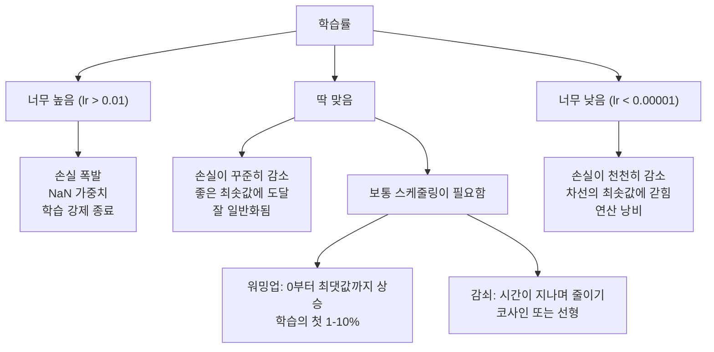
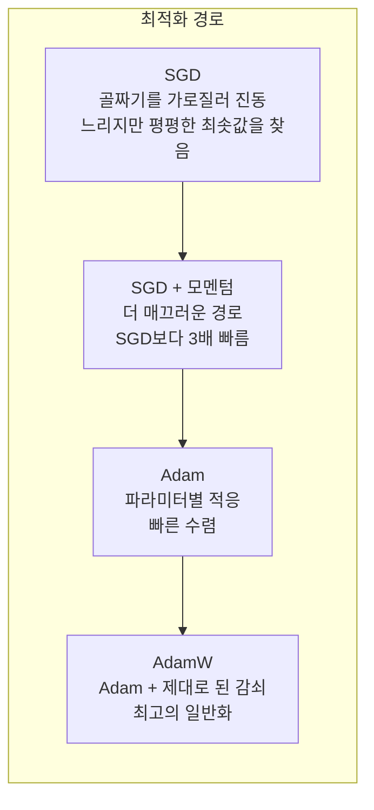
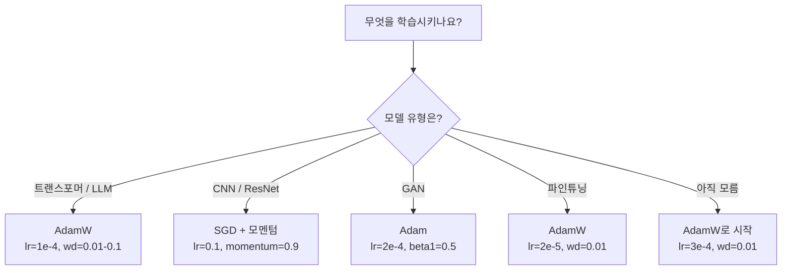

# 옵티마이저

> 🇰🇷 이 문서는 한국어 번역본입니다(ELI5 스타일). 원문: [en.md](en.md)

> 경사 하강법은 어느 방향으로 움직여야 하는지 알려 줍니다. 하지만 얼마나 멀리, 얼마나 빨리 가야 하는지는 말해 주지 않죠. SGD는 나침반이고, Adam은 교통 상황까지 알려 주는 GPS입니다.

**유형:** 만들기(Build)
**언어:** Python
**선수 지식:** 레슨 03.05(손실 함수)
**시간:** 약 75분

## 학습 목표

- SGD, 모멘텀을 곁들인 SGD, Adam, AdamW 옵티마이저를 Python으로 밑바닥부터 구현합니다
- Adam의 편향 보정(bias correction)이 학습 초기 단계에서 0으로 초기화된 모멘트 추정값을 어떻게 보상하는지 설명합니다
- 같은 작업에서 L2 정규화를 곁들인 Adam보다 AdamW가 더 나은 일반화를 보이는 이유를 시연합니다
- 트랜스포머, CNN, GAN, 파인튜닝 각각에 맞는 옵티마이저와 기본 하이퍼파라미터를 선택합니다

## 문제 상황

그래디언트를 계산했습니다. 4,721번 가중치를 0.003 줄여야 손실이 줄어든다는 걸 알죠. 그런데 0.003이 어떤 단위의 값일까요? 무엇으로 스케일된 값일까요? 그리고 1번째 스텝에서 움직인 만큼을 1,000번째 스텝에서도 똑같이 움직여야 할까요?

기본(vanilla) 경사 하강법은 모든 파라미터에 매 스텝 같은 학습률을 적용합니다. w = w - lr * gradient. 이 방식은 실전에서 신경망 학습을 괴롭히는 세 가지 문제를 만듭니다.

첫째, 진동(발진)입니다. 손실 지형은 매끄러운 그릇 모양이 아닌 경우가 대부분입니다. 오히려 길고 좁은 골짜기에 가깝죠. 그래디언트는 골짜기 '건너편'(가파른 방향)을 가리키지, 골짜기 '따라'(완만한 방향) 가리키지 않습니다. 경사 하강법은 좁은 차원을 오가며 왔다 갔다 튕기면서, 유용한 방향으로는 아주 조금씩만 나아갑니다. 여러분도 봤을 겁니다. 손실이 빠르게 떨어지다가 정체되는 건, 모델이 수렴해서가 아니라 진동하고 있기 때문입니다.

둘째, 모든 파라미터에 학습률 하나를 쓰는 건 잘못된 방식입니다. 어떤 가중치는 큰 업데이트가 필요하고(아직 학습이 덜 된 초기 단계니까요), 어떤 가중치는 아주 작은 업데이트가 필요합니다(이미 최적값 근처에 있으니까요). 전자에게 딱 맞는 학습률은 후자를 파괴하고, 그 반대도 마찬가지입니다.

셋째, 안장점(saddle point)입니다. 고차원에서는 손실 지형에 그래디언트가 거의 0인 넓고 평평한 지역이 있습니다. 기본 SGD는 이런 지역을 그래디언트 속도(사실상 0)로 기어갑니다. 모델이 멈춘 것처럼 보이죠. 실제로 멈춘 게 아닙니다. 건너편에 유용한 내리막이 있는 평평한 지역에 있을 뿐입니다. 하지만 SGD에는 그걸 뚫고 나갈 메커니즘이 없습니다.

Adam은 이 세 가지를 모두 해결합니다. 파라미터마다 두 개의 이동 평균을 유지합니다. 평균 그래디언트(모멘텀, 진동 담당)와 평균 제곱 그래디언트(적응형 학습률, 스케일 차이 담당)입니다. 첫 몇 스텝을 위한 편향 보정까지 결합하면, 기본 하이퍼파라미터만으로 문제의 80%를 해결하는 옵티마이저 하나가 완성됩니다. 이 레슨은 그걸 밑바닥부터 만들어 봅니다. 나머지 20%에서 언제, 왜 실패하는지 정확히 이해하기 위해서입니다.

## 핵심 개념

### 확률적 경사 하강법(SGD)

가장 단순한 옵티마이저입니다. 미니배치에서 그래디언트를 계산하고, 반대 방향으로 한 걸음 나아갑니다.

```
w = w - lr * gradient
```

'확률적(stochastic)'이라는 말은 전체 데이터셋 대신 무작위 부분집합(미니배치)으로 그래디언트를 추정한다는 뜻입니다. 이 노이즈는 사실 유용합니다. 뾰족한 국소 최솟값에서 빠져나오는 데 도움이 되거든요. 하지만 그 노이즈가 진동도 일으킵니다.

학습률이 유일한 손잡이입니다. 너무 높으면 손실이 발산하고, 너무 낮으면 학습이 영원히 걸립니다. 최적값은 아키텍처, 데이터, 배치 크기, 현재 학습 단계에 따라 달라집니다. 현대적인 신경망의 기본 SGD에서는 보통 0.01에서 0.1 사이입니다. 하지만 학습 한 번 안에서도 이상적인 학습률은 계속 바뀝니다.

### 모멘텀(Momentum)

언덕을 굴러 내려가는 공 비유는 너무 많이 쓰이긴 했지만 정확합니다. 그래디언트 하나로만 스텝을 밟는 대신, 과거 그래디언트들이 쌓이는 속도(velocity)를 유지합니다.

```
m_t = beta * m_{t-1} + gradient
w = w - lr * m_t
```

beta(보통 0.9)는 얼마나 많은 과거를 기억할지 조절합니다. beta = 0.9면 모멘텀은 대략 최근 10개 그래디언트의 평균입니다(1 / (1 - 0.9) = 10).

이게 왜 진동을 고치는가. 같은 방향을 가리키는 그래디언트들은 서로 쌓입니다. 방향을 뒤집는 그래디언트들은 서로 상쇄되죠. 저 좁은 골짜기에서 '건너편' 성분은 매 스텝 부호가 뒤집히며 감쇠하고, '따라 가는' 성분은 일관되게 유지되며 증폭됩니다. 결과는 유용한 방향으로의 매끄러운 가속입니다.

실제 숫자: 잘못 조건화된 손실 지형에서 SGD 단독으로는 10,000 스텝이 걸릴 수 있습니다. 모멘텀을 곁들인 SGD(beta=0.9)는 같은 문제를 보통 3,000~5,000 스텝에 끝냅니다. 속도 향상이 미미한 수준이 아니라는 뜻이죠.

### RMSProp

실제로 잘 통한 최초의 파라미터별 적응형 학습률 방법입니다. Hinton이 Coursera 강의에서 제안했습니다(정식 논문은 없습니다).

```
s_t = beta * s_{t-1} + (1 - beta) * gradient^2
w = w - lr * gradient / (sqrt(s_t) + epsilon)
```

s_t는 제곱 그래디언트의 이동 평균을 추적합니다. 꾸준히 큰 그래디언트를 받는 파라미터는 큰 수로 나뉩니다(유효 학습률이 작아짐). 작은 그래디언트를 받는 파라미터는 작은 수로 나뉘죠(유효 학습률이 커짐).

이것이 '모든 파라미터에 학습률 하나' 문제를 해결합니다. 이미 큰 업데이트를 받아 온 가중치는 아마 목표에 가까울 테니 속도를 늦추고, 작은 업데이트만 받아 온 가중치는 아마 덜 학습됐을 테니 속도를 올리는 거죠.

엡실론(보통 1e-8)은 파라미터가 아직 업데이트되지 않았을 때 0으로 나누는 것을 막아 줍니다.

### Adam: 모멘텀 + RMSProp

Adam은 두 아이디어를 결합합니다. 파라미터마다 두 개의 지수 이동 평균을 유지하죠:

```
m_t = beta1 * m_{t-1} + (1 - beta1) * gradient        (1차 모멘트: 평균)
v_t = beta2 * v_{t-1} + (1 - beta2) * gradient^2       (2차 모멘트: 분산)
```

**편향 보정**은 대부분의 설명이 건너뛰는 핵심 디테일입니다. 1번째 스텝에서 m_1 = (1 - beta1) * gradient입니다. beta1 = 0.9라면 0.1 * gradient, 즉 실제보다 열 배 작습니다. 이동 평균이 아직 예열되지 않은 거죠. 편향 보정이 이걸 보상합니다:

```
m_hat = m_t / (1 - beta1^t)
v_hat = v_t / (1 - beta2^t)
```

beta1 = 0.9인 1번째 스텝: m_hat = m_1 / (1 - 0.9) = m_1 / 0.1 = 실제 그래디언트. 100번째 스텝에는 (1 - 0.9^100)이 약 1.0이므로 보정이 사라집니다. 편향 보정은 첫 ~10 스텝 동안 중요하고, ~50 스텝 이후에는 무의미합니다.

업데이트 식:

```
w = w - lr * m_hat / (sqrt(v_hat) + epsilon)
```

Adam의 기본값: lr = 0.001, beta1 = 0.9, beta2 = 0.999, epsilon = 1e-8. 이 기본값들이 문제의 80%에서 통합니다. 안 통할 때는 먼저 lr을 바꾸고, 그다음 beta2를 바꿉니다. beta1이나 epsilon은 거의 바꿀 일이 없습니다.

### AdamW: 제대로 된 가중치 감쇠

L2 정규화는 손실에 lambda * w^2을 더합니다. 기본 SGD에서는 이것이 가중치 감쇠와 동등합니다(매 스텝 가중치에서 lambda * w를 빼는 것). 하지만 Adam에서는 이 동등성이 깨집니다.

Loshchilov와 Hutter의 통찰: 손실에 L2를 더하고 나서 Adam이 그 그래디언트를 처리하면, 적응형 학습률이 정규화 항까지 스케일해 버립니다. 그래디언트 분산이 큰 파라미터는 정규화가 약해지고, 분산이 작은 파라미터는 정규화가 강해지죠. 이건 원하는 바가 아닙니다. 원하는 건 그래디언트 통계와 무관하게 균일한 정규화입니다.

AdamW는 Adam 업데이트 이후 가중치에 직접 가중치 감쇠를 적용해서 이 문제를 고칩니다:

```
w = w - lr * m_hat / (sqrt(v_hat) + epsilon) - lr * lambda * w
```

가중치 감쇠 항(lr * lambda * w)은 Adam의 적응형 계수로 스케일되지 않습니다. 모든 파라미터가 같은 비율로 줄어드는 거죠.

사소한 디테일처럼 보이지만 아닙니다. AdamW는 사실상 모든 작업에서 Adam + L2 정규화보다 더 나은 해에 수렴합니다. 트랜스포머, 확산(diffusion) 모델, 대부분의 현대 아키텍처를 학습시킬 때 PyTorch의 기본 옵티마이저이기도 하고요. BERT, GPT, LLaMA, Stable Diffusion은 전부 AdamW로 학습됐습니다.

### 학습률: 가장 중요한 하이퍼파라미터



하이퍼파라미터 하나만 조정할 수 있다면 학습률을 조정하세요. 학습률 10배 변화가 여러분이 내릴 어떤 아키텍처 결정보다 더 큰 영향을 줍니다. 흔한 기본값들:

- SGD: lr = 0.01 ~ 0.1
- Adam/AdamW: lr = 1e-4 ~ 3e-4
- 사전 학습된 모델 파인튜닝: lr = 1e-5 ~ 5e-5
- 학습률 워밍업: 첫 1-10% 스텝 동안 선형 상승

### 옵티마이저 비교



### 어떤 옵티마이저가 언제 이기나



```figure
optimizer-trajectory
```

## 만들어 보기

### 단계 1: 기본 SGD

```python
class SGD:
    def __init__(self, lr=0.01):
        self.lr = lr

    def step(self, params, grads):
        for i in range(len(params)):
            params[i] -= self.lr * grads[i]
```

### 단계 2: 모멘텀을 곁들인 SGD

```python
class SGDMomentum:
    def __init__(self, lr=0.01, beta=0.9):
        self.lr = lr
        self.beta = beta
        self.velocities = None

    def step(self, params, grads):
        if self.velocities is None:
            self.velocities = [0.0] * len(params)
        for i in range(len(params)):
            self.velocities[i] = self.beta * self.velocities[i] + grads[i]
            params[i] -= self.lr * self.velocities[i]
```

### 단계 3: Adam

```python
import math

class Adam:
    def __init__(self, lr=0.001, beta1=0.9, beta2=0.999, epsilon=1e-8):
        self.lr = lr
        self.beta1 = beta1
        self.beta2 = beta2
        self.epsilon = epsilon
        self.m = None
        self.v = None
        self.t = 0

    def step(self, params, grads):
        if self.m is None:
            self.m = [0.0] * len(params)
            self.v = [0.0] * len(params)

        self.t += 1

        for i in range(len(params)):
            self.m[i] = self.beta1 * self.m[i] + (1 - self.beta1) * grads[i]
            self.v[i] = self.beta2 * self.v[i] + (1 - self.beta2) * grads[i] ** 2

            m_hat = self.m[i] / (1 - self.beta1 ** self.t)
            v_hat = self.v[i] / (1 - self.beta2 ** self.t)

            params[i] -= self.lr * m_hat / (math.sqrt(v_hat) + self.epsilon)
```

### 단계 4: AdamW

```python
class AdamW:
    def __init__(self, lr=0.001, beta1=0.9, beta2=0.999, epsilon=1e-8, weight_decay=0.01):
        self.lr = lr
        self.beta1 = beta1
        self.beta2 = beta2
        self.epsilon = epsilon
        self.weight_decay = weight_decay
        self.m = None
        self.v = None
        self.t = 0

    def step(self, params, grads):
        if self.m is None:
            self.m = [0.0] * len(params)
            self.v = [0.0] * len(params)

        self.t += 1

        for i in range(len(params)):
            self.m[i] = self.beta1 * self.m[i] + (1 - self.beta1) * grads[i]
            self.v[i] = self.beta2 * self.v[i] + (1 - self.beta2) * grads[i] ** 2

            m_hat = self.m[i] / (1 - self.beta1 ** self.t)
            v_hat = self.v[i] / (1 - self.beta2 ** self.t)

            params[i] -= self.lr * m_hat / (math.sqrt(v_hat) + self.epsilon)
            params[i] -= self.lr * self.weight_decay * params[i]
```

### 단계 5: 학습 비교

레슨 05의 원 데이터셋으로 같은 두 층짜리 신경망을 네 옵티마이저 전부로 학습시킵니다. 수렴을 비교해 보죠.

```python
import random

def sigmoid(x):
    x = max(-500, min(500, x))
    return 1.0 / (1.0 + math.exp(-x))

def make_circle_data(n=200, seed=42):
    random.seed(seed)
    data = []
    for _ in range(n):
        x = random.uniform(-2, 2)
        y = random.uniform(-2, 2)
        label = 1.0 if x * x + y * y < 1.5 else 0.0
        data.append(([x, y], label))
    return data


class OptimizerTestNetwork:
    def __init__(self, optimizer, hidden_size=8):
        random.seed(0)
        self.hidden_size = hidden_size
        self.optimizer = optimizer

        self.w1 = [[random.gauss(0, 0.5) for _ in range(2)] for _ in range(hidden_size)]
        self.b1 = [0.0] * hidden_size
        self.w2 = [random.gauss(0, 0.5) for _ in range(hidden_size)]
        self.b2 = 0.0

    def get_params(self):
        params = []
        for row in self.w1:
            params.extend(row)
        params.extend(self.b1)
        params.extend(self.w2)
        params.append(self.b2)
        return params

    def set_params(self, params):
        idx = 0
        for i in range(self.hidden_size):
            for j in range(2):
                self.w1[i][j] = params[idx]
                idx += 1
        for i in range(self.hidden_size):
            self.b1[i] = params[idx]
            idx += 1
        for i in range(self.hidden_size):
            self.w2[i] = params[idx]
            idx += 1
        self.b2 = params[idx]

    def forward(self, x):
        self.x = x
        self.z1 = []
        self.h = []
        for i in range(self.hidden_size):
            z = self.w1[i][0] * x[0] + self.w1[i][1] * x[1] + self.b1[i]
            self.z1.append(z)
            self.h.append(max(0.0, z))

        self.z2 = sum(self.w2[i] * self.h[i] for i in range(self.hidden_size)) + self.b2
        self.out = sigmoid(self.z2)
        return self.out

    def compute_grads(self, target):
        eps = 1e-15
        p = max(eps, min(1 - eps, self.out))
        d_loss = -(target / p) + (1 - target) / (1 - p)
        d_sigmoid = self.out * (1 - self.out)
        d_out = d_loss * d_sigmoid

        grads = [0.0] * (self.hidden_size * 2 + self.hidden_size + self.hidden_size + 1)
        idx = 0
        for i in range(self.hidden_size):
            d_relu = 1.0 if self.z1[i] > 0 else 0.0
            d_h = d_out * self.w2[i] * d_relu
            grads[idx] = d_h * self.x[0]
            grads[idx + 1] = d_h * self.x[1]
            idx += 2

        for i in range(self.hidden_size):
            d_relu = 1.0 if self.z1[i] > 0 else 0.0
            grads[idx] = d_out * self.w2[i] * d_relu
            idx += 1

        for i in range(self.hidden_size):
            grads[idx] = d_out * self.h[i]
            idx += 1

        grads[idx] = d_out
        return grads

    def train(self, data, epochs=300):
        losses = []
        for epoch in range(epochs):
            total_loss = 0.0
            correct = 0
            for x, y in data:
                pred = self.forward(x)
                grads = self.compute_grads(y)
                params = self.get_params()
                self.optimizer.step(params, grads)
                self.set_params(params)

                eps = 1e-15
                p = max(eps, min(1 - eps, pred))
                total_loss += -(y * math.log(p) + (1 - y) * math.log(1 - p))
                if (pred >= 0.5) == (y >= 0.5):
                    correct += 1
            avg_loss = total_loss / len(data)
            accuracy = correct / len(data) * 100
            losses.append((avg_loss, accuracy))
            if epoch % 75 == 0 or epoch == epochs - 1:
                print(f"    Epoch {epoch:3d}: loss={avg_loss:.4f}, accuracy={accuracy:.1f}%")
        return losses
```

## 실전에서 쓰기

PyTorch 옵티마이저는 파라미터 그룹, 그래디언트 클리핑, 학습률 스케줄링을 처리해 줍니다:

```python
import torch
import torch.optim as optim

model = torch.nn.Sequential(
    torch.nn.Linear(784, 256),
    torch.nn.ReLU(),
    torch.nn.Linear(256, 10),
)

optimizer = optim.AdamW(model.parameters(), lr=3e-4, weight_decay=0.01)

scheduler = optim.lr_scheduler.CosineAnnealingLR(optimizer, T_max=100)

for epoch in range(100):
    optimizer.zero_grad()
    output = model(torch.randn(32, 784))
    loss = torch.nn.functional.cross_entropy(output, torch.randint(0, 10, (32,)))
    loss.backward()
    torch.nn.utils.clip_grad_norm_(model.parameters(), max_norm=1.0)
    optimizer.step()
    scheduler.step()
```

패턴은 언제나 같습니다. zero_grad, forward, loss, backward, (clip), step, (schedule). 이 순서를 외우세요. 순서를 잘못 지키면(예: optimizer.step() 전에 scheduler.step() 호출) 미묘한 버그의 흔한 원인이 됩니다.

CNN에서는 여전히 많은 실무자가 스텝 또는 코사인 스케줄과 함께 SGD + 모멘텀(lr=0.1, momentum=0.9, weight_decay=1e-4)을 선호합니다. SGD는 더 평평한 최솟값을 찾고, 평평한 최솟값이 종종 더 잘 일반화되죠. 트랜스포머와 LLM에서는 워밍업 + 코사인 감쇠를 곁들인 AdamW가 보편적인 기본값입니다. 측정된 근거 없이는 이 컨센서스와 싸우지 마세요.

## 출시하기

이 레슨이 만드는 산출물:
- `outputs/prompt-optimizer-selector.md` -- 어떤 아키텍처에든 맞는 옵티마이저와 학습률을 고르기 위한 의사결정 프롬프트

## 연습 문제

1. Nesterov 모멘텀을 구현합니다. 현재 위치가 아니라 '미리 내다본(lookahead)' 위치(w - lr * beta * v)에서 그래디언트를 계산하는 방식이죠. 원 데이터셋에서 표준 모멘텀과 수렴을 비교해 보세요.

2. 학습률 워밍업 스케줄을 구현합니다. 첫 10% 학습 스텝 동안 0부터 max_lr까지 선형 상승, 그다음 0까지 코사인 감쇠입니다. 워밍업을 곁들인 Adam vs 워밍업 없는 Adam으로 학습시키고, 원 데이터셋에서 90% 정확도에 도달하는 데 몇 에포크가 걸리는지 측정해 보세요.

3. Adam 학습 중 파라미터별 유효 학습률을 추적합니다. 유효 학습률은 lr * m_hat / (sqrt(v_hat) + eps)입니다. 10, 50, 200 스텝 후의 유효 학습률 분포를 그려 보세요. 모든 파라미터가 같은 속도로 업데이트되고 있나요?

4. 그래디언트 클리핑(전역 노름 기준)을 구현합니다. 최대 그래디언트 노름을 1.0으로 설정하세요. 높은 학습률(Adam에서 lr=0.01)로 클리핑을 적용한 경우와 안 한 경우를 각각 학습시킵니다. 무작위 시드 10개에 대해 클리핑 유무에 따라 몇 번의 실행이 발산했는지(손실이 NaN이 됐는지) 세어 봅니다.

5. 큰 가중치를 가진 신경망에서 Adam vs AdamW를 비교합니다. 모든 가중치를 [-5, 5] 범위의 무작위 값(평소보다 훨씬 큼)으로 초기화하세요. weight_decay=0.1로 200 에포크 학습시키고, 두 옵티마이저에 대해 학습 동안 가중치의 L2 노름을 그려 보세요. AdamW가 가중치가 더 빨리 줄어드는 걸 보여 줘야 합니다.

## 핵심 용어

| 용어 | 사람들이 말하는 표현 | 실제 의미 |
|------|----------------|----------------------|
| 학습률(Learning rate) | "스텝 크기" | 그래디언트 업데이트에 곱해지는 스칼라 배수. 학습에서 단 하나로 가장 큰 영향을 주는 하이퍼파라미터 |
| SGD | "기본 경사 하강법" | 확률적 경사 하강법. 미니배치에서 계산한 lr * gradient를 빼서 가중치를 업데이트합니다 |
| 모멘텀(Momentum) | "굴러가는 공 비유" | 과거 그래디언트의 지수 이동 평균. 진동을 감쇠시키고 일관된 방향을 가속합니다 |
| RMSProp | "적응형 학습률" | 각 파라미터의 그래디언트를 최근 그래디언트의 이동 RMS로 나눕니다. 학습률을 균등화합니다 |
| Adam | "기본 옵티마이저" | 모멘텀(1차 모멘트)과 RMSProp(2차 모멘트)을 초기 스텝용 편향 보정과 함께 결합합니다 |
| AdamW | "제대로 만든 Adam" | 분리된(decoupled) 가중치 감쇠를 곁들인 Adam. 정규화를 그래디언트가 아니라 가중치에 직접 적용합니다 |
| 편향 보정(Bias correction) | "이동 평균의 워밍업" | (1 - beta^t)로 나눠서 Adam의 모멘트 추정이 0으로 초기화된 것을 보상합니다 |
| 가중치 감쇠(Weight decay) | "가중치 줄이기" | 매 스텝 가중치 값의 일정 비율을 빼는 것. 큰 가중치에 벌을 주는 정규화 기법입니다 |
| 학습률 스케줄(Learning rate schedule) | "시간에 따라 lr 바꾸기" | 학습 중에 학습률을 조절하는 함수. 워밍업 + 코사인 감쇠가 현대의 기본값입니다 |
| 그래디언트 클리핑(Gradient clipping) | "그래디언트 노름 제한" | 그래디언트 벡터의 노름이 임계값을 넘으면 크기를 줄입니다. 폭발적인 그래디언트 업데이트를 막습니다 |

## 더 읽을거리

- Kingma & Ba, "Adam: A Method for Stochastic Optimization" (2014) -- 수렴 분석과 편향 보정 유도가 담긴 Adam 원 논문
- Loshchilov & Hutter, "Decoupled Weight Decay Regularization" (2017) -- Adam에서 L2 정규화와 가중치 감쇠가 동등하지 않음을 증명하고 AdamW를 제안한 논문
- Smith, "Cyclical Learning Rates for Training Neural Networks" (2017) -- 고정 학습률 튜닝이 필요 없어지는 LR 범위 테스트와 주기적 스케줄을 소개한 논문
- Ruder, "An Overview of Gradient Descent Optimization Algorithms" (2016) -- 모든 옵티마이저 변형을 명확한 비교와 직관과 함께 정리한 최고의 단행본 서베이
