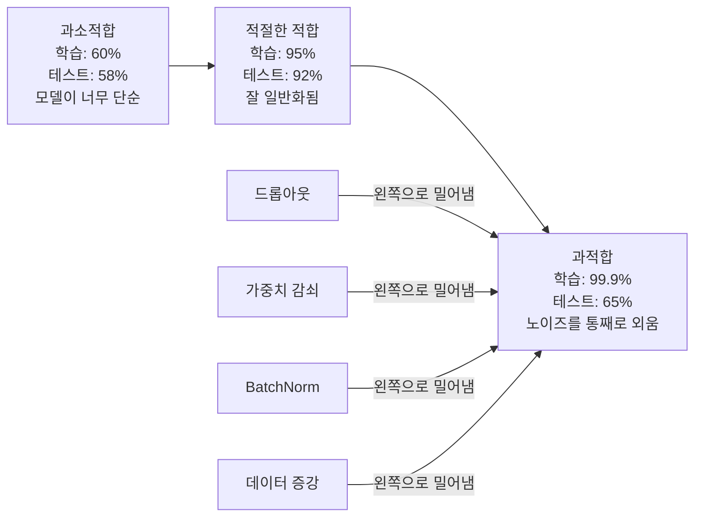
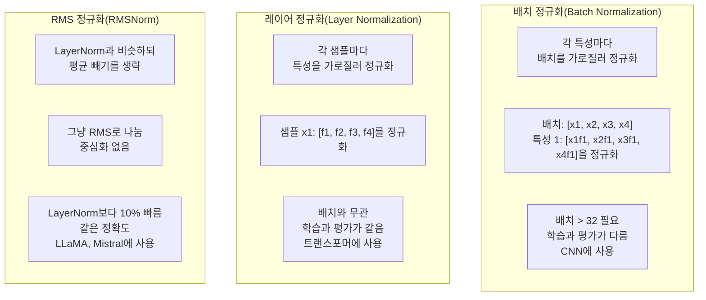
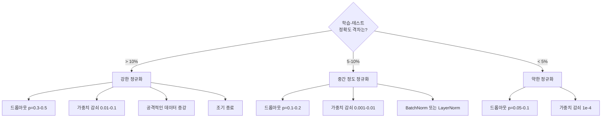

# 정규화

> 🇰🇷 이 문서는 한국어 번역본입니다(ELI5 스타일). 원문: [en.md](en.md)

> 모델이 학습 데이터에서는 99%, 테스트 데이터에서는 60%를 받습니다. 학습한 게 아니라 통째로 외운 거죠. 정규화는 일반화를 강제하기 위해 복잡성에 부과하는 세금입니다.

**유형:** 만들기(Build)
**언어:** Python
**선수 지식:** 레슨 03.06(옵티마이저)
**시간:** 약 75분

## 학습 목표

- 드롭아웃(inverted scaling 방식), L2 가중치 감쇠, 배치 정규화, 레이어 정규화, RMSNorm을 밑바닥부터 구현합니다
- 학습-테스트 정확도 격차를 측정하고, 정규화 실험으로 과적합을 진단합니다
- 트랜스포머가 BatchNorm 대신 LayerNorm을 쓰는 이유와, 현대 LLM이 RMSNorm을 선호하는 이유를 설명합니다
- 과적합의 심각도에 따라 올바른 정규화 기법 조합을 적용합니다

## 문제 상황

파라미터가 충분한 신경망은 어떤 데이터셋이든 통째로 외울 수 있습니다. 가정이 아닙니다. Zhang 등(2017)이 ImageNet에 무작위 레이블을 붙여 표준 신경망을 학습시켜서 증명했습니다. 신경망들은 완전히 무작위로 할당된 레이블에서 학습 손실이 거의 0에 도달했습니다. 배울 패턴이 하나도 없는 백만 개의 무작위 입력-출력 쌍을 통째로 외운 거죠. 학습 손실은 완벽했습니다. 테스트 정확도는 0이었습니다.

이것이 과적합(overfitting) 문제이고, 모델이 커질수록 더 심해집니다. GPT-3는 파라미터가 1,750억 개입니다. 학습 세트는 약 5,000억 토큰이죠. 그 정도 파라미터면 모델이 학습 데이터의 상당 부분을 그대로 외워 버릴 만한 용량이 충분합니다. 정규화가 없으면 일반화 가능한 패턴을 배우는 대신 학습 예제를 그대로 토해 내기만 할 겁니다.

학습 성능과 테스트 성능 사이의 격차가 바로 과적합 격차입니다. 이 레슨의 모든 기법은 저 격차를 서로 다른 각도에서 공략합니다. 드롭아웃은 네트워크가 특정 뉴런 하나에 의존하지 않도록 강제합니다. 가중치 감쇠는 어떤 가중치 하나도 너무 커지지 못하게 합니다. 배치 정규화는 손실 지형을 매끄럽게 만들어서 옵티마이저가 더 평평하고 일반화 잘 되는 최솟값을 찾게 해 줍니다. 레이어 정규화는 같은 일을 하되 배치 정규화가 실패하는 곳(작은 배치, 가변 길이 시퀀스)에서도 동작합니다. RMSNorm은 평균 계산을 빼서 10% 더 빠르게 그 일을 합니다. 각 기법은 단순합니다. 하지만 함께 쓰면 '외우는 모델'과 '일반화하는 모델'의 차이가 됩니다.

## 핵심 개념

### 과적합 스펙트럼

모든 모델은 과소적합(패턴을 담기엔 너무 단순)부터 과적합(노이즈까지 담을 만큼 복잡)까지의 스펙트럼 어딘가에 위치합니다. 달콤한 지점(sweet spot)은 그 사이에 있고, 정규화는 모델을 과적합 쪽에서 그 지점으로 밀어 줍니다.



### 드롭아웃(Dropout)

가장 단순한 정규화 기법이면서 가장 우아한 해석을 가진 기법입니다. 학습 중에 각 뉴런의 출력을 확률 p로 0으로 만듭니다.

```
output = activation(z) * mask    여기서 mask[i] ~ Bernoulli(1 - p)
```

p = 0.5라면 매 순방향 패스마다 뉴런의 절반이 0이 됩니다. 어떤 뉴런이 살아남을지 예측할 수 없으므로, 네트워크는 중복된(redundant) 표현을 배울 수밖에 없습니다. 이것이 공적응(co-adaptation, 특정 다른 뉴런이 있기를 의존하도록 배우는 것)을 막아 줍니다.

앙상블 해석: 뉴런 N개를 가진 네트워크에 드롭아웃을 적용하면 2^N개의 가능한 서브네트워크가 생깁니다(어떤 뉴런이 켜지고 꺼지는지의 모든 조합). 드롭아웃으로 학습하면 2^N개 서브네트워크 전부를 서로 다른 미니배치로 거의 동시에 학습시키는 셈입니다. 테스트 시점에는 모든 뉴런을 사용하고(드롭아웃 없음), 학습 중 기댓값과 맞추기 위해 출력을 (1 - p)로 스케일합니다. 이는 2^N개 서브네트워크의 예측을 평균내는 것과 동일합니다. 모델 하나로 만든 거대한 앙상블이죠.

실무에서는 테스트가 아니라 학습 중에 스케일링을 적용합니다(inverted dropout):

```
학습 중:  output = activation(z) * mask / (1 - p)
테스트 중: output = activation(z)   (바꿀 필요 없음)
```

이 방식이 더 깔끔합니다. 테스트 코드가 드롭아웃을 전혀 알 필요가 없거든요.

기본 비율: 트랜스포머는 p = 0.1, MLP는 p = 0.5, CNN은 p = 0.2-0.3입니다. 드롭아웃이 높을수록 정규화가 강해지고, 과소적합 위험도 커집니다.

### 가중치 감쇠(L2 정규화)

모든 가중치의 제곱 크기를 손실에 더합니다:

```
total_loss = task_loss + (lambda / 2) * sum(w_i^2)
```

정규화 항의 그래디언트는 lambda * w입니다. 즉 매 스텝마다 각 가중치가 자기 크기에 비례하는 비율로 0 쪽으로 줄어듭니다. 큰 가중치일수록 더 세게 벌해지죠. 모델은 어떤 단일 가중치도 지배하지 않는 해로 밀려갑니다.

왜 일반화에 도움이 되는가. 과적합된 모델은 학습 데이터의 노이즈를 증폭시키는 큰 가중치를 갖는 경향이 있습니다. 가중치 감쇠는 가중치를 작게 유지해서 모델의 유효 용량을 제한하고, 외워 둔 괴상한 특성 대신 견고하고 일반화 가능한 특성에 의존하도록 강제합니다.

lambda 하이퍼파라미터가 강도를 조절합니다. 전형적인 값:

- 트랜스포머의 AdamW: 0.01
- CNN의 SGD: 1e-4
- 심하게 과적합된 모델: 0.1

레슨 06에서 다뤘듯이 가중치 감쇠와 L2 정규화는 SGD에서는 동등하지만 Adam에서는 그렇지 않습니다. Adam으로 학습할 때는 언제나 AdamW(분리된 가중치 감쇠)를 사용하세요.

### 배치 정규화(Batch Normalization)

각 층의 출력을 다음 층에 넘기기 전에 미니배치를 가로질러 정규화합니다.

어느 층에서의 활성화 미니배치에 대해:

```
mu = (1/B) * sum(x_i)           (배치 평균)
sigma^2 = (1/B) * sum((x_i - mu)^2)   (배치 분산)
x_hat = (x_i - mu) / sqrt(sigma^2 + eps)   (정규화)
y = gamma * x_hat + beta        (스케일과 이동)
```

gamma와 beta는 학습 가능한 파라미터로, 최적이라면 네트워크가 정규화를 되돌릴 수 있게 해 줍니다. 이게 없으면 모든 층의 출력을 강제로 평균 0, 분산 1로 만들게 되는데, 그게 네트워크가 원하는 건 아닐 수 있죠.

**학습 vs 추론 분리:** 학습 중에는 mu와 sigma가 현재 미니배치에서 나옵니다. 추론 중에는 학습 동안 쌓아 둔 이동 평균을 사용합니다(모멘텀 = 0.1인 지수 이동 평균, 즉 옛날 값 90% + 새 값 10%).

BatchNorm이 왜 작동하는지는 여전히 논쟁 중입니다. 원 논문은 '내부 공변량 변화(internal covariate shift)'를 줄인다고 주장했습니다(앞쪽 층이 업데이트되면서 층 입력의 분포가 바뀌는 현상이죠). Santurkar 등(2018)은 이 설명이 틀렸음을 보였습니다. 실제 이유는 이것입니다. BatchNorm은 손실 지형을 더 매끄럽게 만듭니다. 그래디언트의 예측력이 좋아지고, Lipschitz 상수가 작아지고, 옵티마이저가 더 큰 보폭을 안전하게 밟을 수 있죠. BatchNorm이 더 높은 학습률을 쓸 수 있게 하고 더 빠른 수렴을 가능하게 하는 이유가 바로 이것입니다.

BatchNorm에는 근본적인 한계가 있습니다. 배치 통계에 의존한다는 것입니다. 배치 크기가 1이면 평균과 분산이 무의미합니다. 배치가 작으면(< 32) 통계가 노이즈투성이여서 성능을 해칩니다. 이것이 객체 탐지(메모리가 배치 크기를 제한함)나 언어 모델링(시퀀스 길이가 들쭉날쭉함) 같은 작업에서 중요한 문제가 됩니다.

### 레이어 정규화(Layer Normalization)

배치를 가로지르는 대신 특성을 가로지르며 정규화합니다. 샘플 하나에 대해:

```
mu = (1/D) * sum(x_j)           (특성 평균)
sigma^2 = (1/D) * sum((x_j - mu)^2)   (특성 분산)
x_hat = (x_j - mu) / sqrt(sigma^2 + eps)
y = gamma * x_hat + beta
```

D는 특성 차원입니다. 각 샘플이 독립적으로 정규화되므로 배치 크기에 의존하지 않습니다. 트랜스포머가 BatchNorm 대신 LayerNorm을 쓰는 이유가 바로 이것입니다. 시퀀스 길이는 들쭉날쭉하고, 배치 크기는 종종 작으며(생성 중에는 1이죠), 학습과 추론에서 계산이 동일합니다.

트랜스포머의 LayerNorm은 각 셀프 어텐션 블록과 피드포워드 블록 뒤에 적용되거나(Post-LN), 그 앞에 적용됩니다(Pre-LN, 학습이 더 안정적입니다).

### RMSNorm

평균 빼기를 없앤 LayerNorm입니다. Zhang과 Sennrich가 2019년에 제안했습니다.

```
rms = sqrt((1/D) * sum(x_j^2))
y = gamma * x / rms
```

이게 전부입니다. 평균 계산도, beta 파라미터도 없습니다. 관찰된 사실은 이렇습니다. LayerNorm에서 최근재중심화(평균 빼기)는 모델 성능에 거의 기여하지 않으면서 계산 비용만 치룹니다. 그걸 제거하면 정확도는 그대로면서 오버헤드가 약 10% 줄어듭니다.

LLaMA, LLaMA 2, LLaMA 3, Mistral, 그리고 대부분의 현대 LLM은 LayerNorm 대신 RMSNorm을 씁니다. 수십억 개 파라미터, 수조 토큰 규모에서는 그 10% 절약이 상당합니다.

### 정규화 비교



### 정규화로서의 데이터 증강

모델 수정이 아니라 데이터 수정입니다. 레이블은 유지한 채 학습 입력을 변형합니다:

- 이미지: 무작위 크롭, 뒤집기, 회전, 색 지터, 컷아웃
- 텍스트: 동의어 치환, 역번역, 무작위 삭제
- 오디오: 시간 늘리기, 음높이 이동, 노이즈 추가

효과는 정규화와 동일합니다. 학습 세트의 유효 크기를 늘려서 모델이 특정 예제를 외우기 어렵게 만듭니다. 원본 그대로의 이미지를 한 번만 보는 모델은 그 이미지를 외울 수 있습니다. 하지만 증강된 50가지 버전을 보는 모델은 불변(invariant) 구조를 배울 수밖에 없죠.

### 조기 종료(Early Stopping)

가장 단순한 정규화 기법입니다. 검증 손실이 증가하기 시작하면 학습을 멈추는 거죠. 그 시점에는 모델이 아직 과적합되지 않았습니다. 실무에서는 매 에포크 검증 손실을 추적하고, 최고의 모델을 저장하며, '인내(patience)' 기간(보통 5-20 에포크)만큼 더 학습을 계속합니다. 인내 기간 안에 검증 손실이 개선되지 않으면 학습을 멈추고 저장해 둔 최고의 모델을 불러옵니다.

### 언제 무엇을 적용할까



```figure
l2-regularization
```

## 만들어 보기

### 단계 1: 드롭아웃(학습/평가 모드)

```python
import random
import math


class Dropout:
    def __init__(self, p=0.5):
        self.p = p
        self.training = True
        self.mask = None

    def forward(self, x):
        if not self.training:
            return list(x)
        self.mask = []
        output = []
        for val in x:
            if random.random() < self.p:
                self.mask.append(0)
                output.append(0.0)
            else:
                self.mask.append(1)
                output.append(val / (1 - self.p))
        return output

    def backward(self, grad_output):
        grads = []
        for g, m in zip(grad_output, self.mask):
            if m == 0:
                grads.append(0.0)
            else:
                grads.append(g / (1 - self.p))
        return grads
```

### 단계 2: L2 가중치 감쇠

```python
def l2_regularization(weights, lambda_reg):
    penalty = 0.0
    for w in weights:
        penalty += w * w
    return lambda_reg * 0.5 * penalty

def l2_gradient(weights, lambda_reg):
    return [lambda_reg * w for w in weights]
```

### 단계 3: 배치 정규화

```python
class BatchNorm:
    def __init__(self, num_features, momentum=0.1, eps=1e-5):
        self.gamma = [1.0] * num_features
        self.beta = [0.0] * num_features
        self.eps = eps
        self.momentum = momentum
        self.running_mean = [0.0] * num_features
        self.running_var = [1.0] * num_features
        self.training = True
        self.num_features = num_features

    def forward(self, batch):
        batch_size = len(batch)
        if self.training:
            mean = [0.0] * self.num_features
            for sample in batch:
                for j in range(self.num_features):
                    mean[j] += sample[j]
            mean = [m / batch_size for m in mean]

            var = [0.0] * self.num_features
            for sample in batch:
                for j in range(self.num_features):
                    var[j] += (sample[j] - mean[j]) ** 2
            var = [v / batch_size for v in var]

            for j in range(self.num_features):
                self.running_mean[j] = (1 - self.momentum) * self.running_mean[j] + self.momentum * mean[j]
                self.running_var[j] = (1 - self.momentum) * self.running_var[j] + self.momentum * var[j]
        else:
            mean = list(self.running_mean)
            var = list(self.running_var)

        self.x_hat = []
        output = []
        for sample in batch:
            normalized = []
            out_sample = []
            for j in range(self.num_features):
                x_h = (sample[j] - mean[j]) / math.sqrt(var[j] + self.eps)
                normalized.append(x_h)
                out_sample.append(self.gamma[j] * x_h + self.beta[j])
            self.x_hat.append(normalized)
            output.append(out_sample)
        return output
```

### 단계 4: 레이어 정규화

```python
class LayerNorm:
    def __init__(self, num_features, eps=1e-5):
        self.gamma = [1.0] * num_features
        self.beta = [0.0] * num_features
        self.eps = eps
        self.num_features = num_features

    def forward(self, x):
        mean = sum(x) / len(x)
        var = sum((xi - mean) ** 2 for xi in x) / len(x)

        self.x_hat = []
        output = []
        for j in range(self.num_features):
            x_h = (x[j] - mean) / math.sqrt(var + self.eps)
            self.x_hat.append(x_h)
            output.append(self.gamma[j] * x_h + self.beta[j])
        return output
```

### 단계 5: RMSNorm

```python
class RMSNorm:
    def __init__(self, num_features, eps=1e-6):
        self.gamma = [1.0] * num_features
        self.eps = eps
        self.num_features = num_features

    def forward(self, x):
        rms = math.sqrt(sum(xi * xi for xi in x) / len(x) + self.eps)
        output = []
        for j in range(self.num_features):
            output.append(self.gamma[j] * x[j] / rms)
        return output
```

### 단계 6: 정규화 유무에 따른 학습

```python
def sigmoid(x):
    x = max(-500, min(500, x))
    return 1.0 / (1.0 + math.exp(-x))


def make_circle_data(n=200, seed=42):
    random.seed(seed)
    data = []
    for _ in range(n):
        x = random.uniform(-2, 2)
        y = random.uniform(-2, 2)
        label = 1.0 if x * x + y * y < 1.5 else 0.0
        data.append(([x, y], label))
    return data


class RegularizedNetwork:
    def __init__(self, hidden_size=16, lr=0.05, dropout_p=0.0, weight_decay=0.0):
        random.seed(0)
        self.hidden_size = hidden_size
        self.lr = lr
        self.dropout_p = dropout_p
        self.weight_decay = weight_decay
        self.dropout = Dropout(p=dropout_p) if dropout_p > 0 else None

        self.w1 = [[random.gauss(0, 0.5) for _ in range(2)] for _ in range(hidden_size)]
        self.b1 = [0.0] * hidden_size
        self.w2 = [random.gauss(0, 0.5) for _ in range(hidden_size)]
        self.b2 = 0.0

    def forward(self, x, training=True):
        self.x = x
        self.z1 = []
        self.h = []
        for i in range(self.hidden_size):
            z = self.w1[i][0] * x[0] + self.w1[i][1] * x[1] + self.b1[i]
            self.z1.append(z)
            self.h.append(max(0.0, z))

        if self.dropout and training:
            self.dropout.training = True
            self.h = self.dropout.forward(self.h)
        elif self.dropout:
            self.dropout.training = False
            self.h = self.dropout.forward(self.h)

        self.z2 = sum(self.w2[i] * self.h[i] for i in range(self.hidden_size)) + self.b2
        self.out = sigmoid(self.z2)
        return self.out

    def backward(self, target):
        eps = 1e-15
        p = max(eps, min(1 - eps, self.out))
        d_loss = -(target / p) + (1 - target) / (1 - p)
        d_sigmoid = self.out * (1 - self.out)
        d_out = d_loss * d_sigmoid

        for i in range(self.hidden_size):
            d_relu = 1.0 if self.z1[i] > 0 else 0.0
            d_h = d_out * self.w2[i] * d_relu
            self.w2[i] -= self.lr * (d_out * self.h[i] + self.weight_decay * self.w2[i])
            for j in range(2):
                self.w1[i][j] -= self.lr * (d_h * self.x[j] + self.weight_decay * self.w1[i][j])
            self.b1[i] -= self.lr * d_h
        self.b2 -= self.lr * d_out

    def evaluate(self, data):
        correct = 0
        total_loss = 0.0
        for x, y in data:
            pred = self.forward(x, training=False)
            eps = 1e-15
            p = max(eps, min(1 - eps, pred))
            total_loss += -(y * math.log(p) + (1 - y) * math.log(1 - p))
            if (pred >= 0.5) == (y >= 0.5):
                correct += 1
        return total_loss / len(data), correct / len(data) * 100

    def train_model(self, train_data, test_data, epochs=300):
        history = []
        for epoch in range(epochs):
            total_loss = 0.0
            correct = 0
            for x, y in train_data:
                pred = self.forward(x, training=True)
                self.backward(y)
                eps = 1e-15
                p = max(eps, min(1 - eps, pred))
                total_loss += -(y * math.log(p) + (1 - y) * math.log(1 - p))
                if (pred >= 0.5) == (y >= 0.5):
                    correct += 1
            train_loss = total_loss / len(train_data)
            train_acc = correct / len(train_data) * 100
            test_loss, test_acc = self.evaluate(test_data)
            history.append((train_loss, train_acc, test_loss, test_acc))
            if epoch % 75 == 0 or epoch == epochs - 1:
                gap = train_acc - test_acc
                print(f"    Epoch {epoch:3d}: train_acc={train_acc:.1f}%, test_acc={test_acc:.1f}%, gap={gap:.1f}%")
        return history
```

## 실전에서 쓰기

PyTorch는 모든 정규화와 규제를 모듈로 제공합니다:

```python
import torch
import torch.nn as nn

model = nn.Sequential(
    nn.Linear(784, 256),
    nn.BatchNorm1d(256),
    nn.ReLU(),
    nn.Dropout(0.3),
    nn.Linear(256, 128),
    nn.BatchNorm1d(128),
    nn.ReLU(),
    nn.Dropout(0.3),
    nn.Linear(128, 10),
)

model.train()
out_train = model(torch.randn(32, 784))

model.eval()
out_test = model(torch.randn(1, 784))
```

`model.train()` / `model.eval()` 전환은 결정적입니다. 드롭아웃을 켜고 끄고, BatchNorm에게 배치 통계를 쓸지 이동 통계를 쓸지 알려 줍니다. 추론 전에 `model.eval()`을 잊는 것은 딥러닝에서 가장 흔한 버그 중 하나입니다. 드롭아웃이 여전히 활성화되어 있고 BatchNorm이 미니배치 통계를 쓰고 있으니, 테스트 정확도가 무작위로 출렁이게 되죠.

트랜스포머에서는 패턴이 다릅니다:

```python
class TransformerBlock(nn.Module):
    def __init__(self, d_model=512, nhead=8, dropout=0.1):
        super().__init__()
        self.attention = nn.MultiheadAttention(d_model, nhead, dropout=dropout)
        self.norm1 = nn.LayerNorm(d_model)
        self.ff = nn.Sequential(
            nn.Linear(d_model, d_model * 4),
            nn.GELU(),
            nn.Linear(d_model * 4, d_model),
            nn.Dropout(dropout),
        )
        self.norm2 = nn.LayerNorm(d_model)
        self.dropout = nn.Dropout(dropout)

    def forward(self, x):
        attended, _ = self.attention(x, x, x)
        x = self.norm1(x + self.dropout(attended))
        x = self.norm2(x + self.ff(x))
        return x
```

BatchNorm이 아니라 LayerNorm. 드롭아웃은 p=0.5가 아니라 p=0.1. 이것이 트랜스포머의 기본값입니다.

## 출시하기

이 레슨이 만드는 산출물:
- `outputs/prompt-regularization-advisor.md` -- 과적합을 진단하고 올바른 정규화 전략을 추천하는 프롬프트

## 연습 문제

1. 2D 데이터용 공간 드롭아웃(spatial dropout)을 구현합니다. 개별 뉴런을 끄는 대신 특성 채널 전체를 끕니다. 연속된 특성들의 그룹을 채널로 취급하고 그룹 전체를 끄는 방식으로 시뮬레이션해 보세요. hidden_size=32인 원 데이터셋에서 표준 드롭아웃과 학습-테스트 격차를 비교합니다.

2. 레슨 05의 레이블 스무딩과 이 레슨의 드롭아웃을 결합합니다. 네 가지 구성(둘 다 없음, 드롭아웃만, 레이블 스무딩만, 둘 다)으로 학습시키고 각각의 최종 학습-테스트 정확도 격차를 측정합니다. 어느 조합이 가장 작은 격차를 줍니까?

3. 원 데이터셋 신경망의 은닉층과 활성화 함수 사이에 BatchNorm 층을 추가합니다. 학습률 0.01, 0.05, 0.1에서 BatchNorm 유무에 따라 학습시켜 보세요. BatchNorm이 있으면 기본 신경망이 발산하는 더 높은 학습률에서도 안정적인 학습이 가능해야 합니다.

4. 조기 종료를 구현합니다. 매 에포크 테스트 손실을 추적하고, 최고의 가중치를 저장하며, 테스트 손실이 20 에포크 동안 개선되지 않으면 멈춥니다. 정규화된 신경망을 1000 에포크 돌려 보세요. 어느 에포크가 최고의 테스트 정확도를 기록했는지, 그리고 몇 에포크만큼의 계산을 아꼈는지 보고합니다.

5. 4층 신경망(2층이 아니라)에서 LayerNorm vs RMSNorm을 비교합니다. 둘 다 같은 가중치로 초기화하세요. 200 에포크 학습시키고 최종 정확도, 학습 속도(에포크당 시간), 첫 층에서의 그래디언트 크기를 비교합니다. RMSNorm이 같은 정확도로 더 빠른지 확인합니다.

## 핵심 용어

| 용어 | 사람들이 말하는 표현 | 실제 의미 |
|------|----------------|----------------------|
| 과적합(Overfitting) | "모델이 데이터를 외웠어요" | 모델의 학습 성능이 테스트 성능을 크게 웃도는 상태. 신호가 아니라 노이즈를 배웠다는 뜻입니다 |
| 정규화(Regularization) | "과적합 막기" | 모델 복잡성에 제약을 걸어 일반화를 개선하는 모든 기법. 드롭아웃, 가중치 감쇠, 정규화 층, 증강 등 |
| 드롭아웃(Dropout) | "뉴런 무작위 삭제" | 학습 중 뉴런을 확률 p로 0으로 만들어 중복 표현을 강제합니다. 앙상블 학습과 동등합니다 |
| 가중치 감쇠(Weight decay) | "L2 벌칙" | 매 스텝 lambda * w를 빼서 모든 가중치를 0 쪽으로 줄입니다. 가중치 크기로 복잡성에 벌을 줍니다 |
| 배치 정규화(Batch normalization) | "배치별 정규화" | 학습 중에는 배치 통계로, 추론 중에는 이동 평균으로, 층 출력을 배치 차원을 가로질러 정규화합니다 |
| 레이어 정규화(Layer normalization) | "샘플별 정규화" | 각 샘플 안에서 특성을 가로질러 정규화합니다. 배치와 무관해서 배치 크기가 변하는 트랜스포머에서 사용됩니다 |
| RMSNorm | "평균 뺀 LayerNorm" | 제곱 평균 제곱근 정규화. LayerNorm에서 평균 빼기를 없애서 정확도는 같으면서 10% 빠릅니다 |
| 조기 종료(Early stopping) | "과적합 전에 멈추기" | 검증 손실이 개선을 멈추면 학습을 중단합니다. 가장 단순한 정규화 기법으로, 다른 기법과 함께 자주 씁니다 |
| 데이터 증강(Data augmentation) | "적은 데이터로 많이 만들기" | 학습 입력을 변형(뒤집기, 크롭, 노이즈)해서 유효 데이터셋 크기를 늘리고 불변성 학습을 강제합니다 |
| 일반화 격차(Generalization gap) | "학습-테스트 차이" | 학습 성능과 테스트 성능의 차이. 정규화의 목표는 이 격차를 최소화하는 것입니다 |

## 더 읽을거리

- Srivastava et al., "Dropout: A Simple Way to Prevent Neural Networks from Overfitting" (2014) -- 앙상블 해석과 방대한 실험이 담긴 드롭아웃 원 논문
- Ioffe & Szegedy, "Batch Normalization: Accelerating Deep Network Training by Reducing Internal Covariate Shift" (2015) -- BatchNorm과 그 학습 절차를 소개한, 딥러닝 논문 중 가장 많이 인용된 논문 중 하나
- Zhang & Sennrich, "Root Mean Square Layer Normalization" (2019) -- RMSNorm이 계산을 줄이면서 LayerNorm과 같은 정확도를 냄을 보였고, LLaMA와 Mistral이 채택했습니다
- Zhang et al., "Understanding Deep Learning Requires Rethinking Generalization" (2017) -- 신경망이 무작위 레이블도 외울 수 있음을 보여 일반화에 대한 전통적 견해에 도전한 기념비적인 논문
