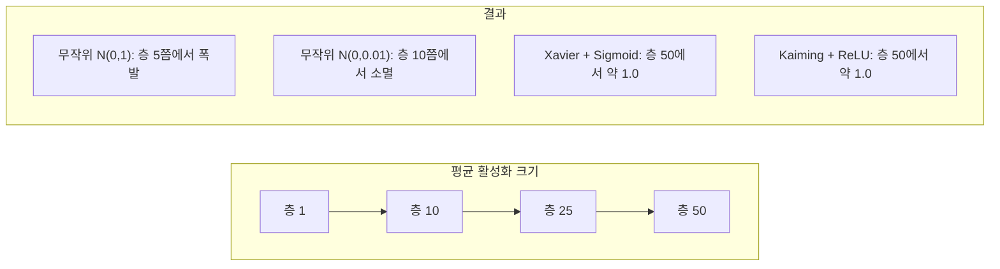
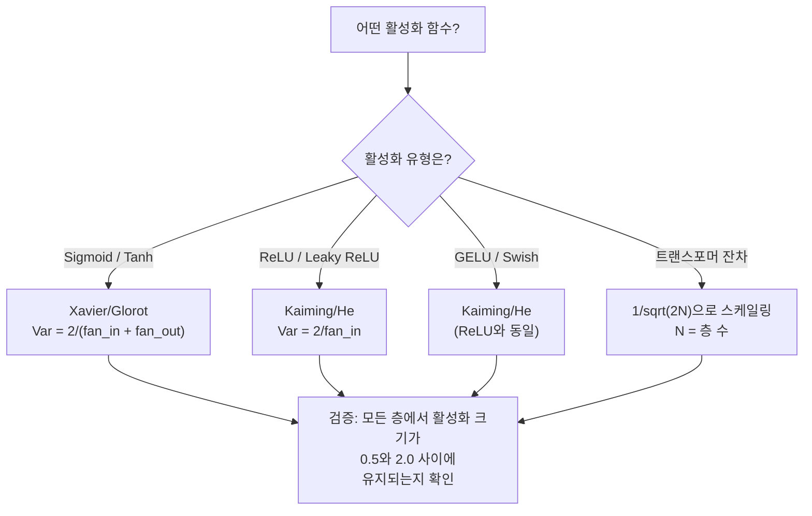

# 가중치 초기화와 학습 안정성

> 🇰🇷 이 문서는 한국어 번역본입니다(ELI5 스타일). 원문: [en.md](en.md)

> 가중치를 잘못 초기화하면 학습은 아예 시작조차 되지 않습니다. 제대로 초기화하면 50층짜리 신경망도 3층짜리처럼 순조롭게 학습됩니다.

**유형:** Build(만들기)
**언어:** Python
**선수 지식:** 레슨 03.04(활성화 함수), 레슨 03.07(정규화)
**시간:** 약 90분

## 학습 목표

- 영(0), 무작위, Xavier/Glorot, Kaiming/He 초기화 전략을 직접 구현하고, 50개 층을 통과하는 동안 활성화 값의 크기에 어떤 영향을 주는지 측정하기
- Xavier 초기화가 Var(w) = 2/(fan_in + fan_out)을, Kaiming 초기화가 Var(w) = 2/fan_in을 쓰는 이유 유도하기
- 영(0)으로 초기화할 때 생기는 대칭성 문제를 보여주고, 단순히 무작위성만으로는 부족한 이유 설명하기
- 활성화 함수에 맞는 올바른 초기화 전략 짝짓기: sigmoid/tanh에는 Xavier, ReLU/GELU에는 Kaiming

## 문제 상황

모든 가중치를 0으로 초기화해 보세요. 아무것도 학습되지 않습니다. 모든 뉴런이 똑같은 함수를 계산하고, 똑같은 그래디언트를 받고, 똑같은 방식으로 갱신됩니다. 10,000 에포크가 지나도 512개 뉴런짜리 은닉층은 여전히 같은 뉴런의 복사본 512개일 뿐입니다. 512개 파라미터 값을 지불하고 1개를 받은 셈입니다.

가중치를 너무 크게 초기화하면 활성화 값이 네트워크를 통과하면서 폭발합니다. 10층쯤에서는 값이 1e15에 도달하고, 20층쯤에서는 무한대로 넘쳐버립니다. 그래디언트도 같은 경로를 거꾸로 따라가다가 같은 운명을 맞습니다.

표준정규분포에서 무작위로 뽑아 초기화하면 3층 정도에서는 잘 동작합니다. 하지만 50층에서는 무작위 스케일이 아주 조금 작으면 신호가 0으로 수그러들고, 아주 조금 크면 무한대로 폭발합니다. "잘 동작"과 "고장" 사이의 경계는 종잇장처럼 얇습니다.

가중치 초기화는 딥러닝에서 가장 과소평가된 결정입니다. 아키텍처는 논문이 되고, 옵티마이저는 블로그 글이 되지만, 초기화는 각주 한 줄 정도의 대접을 받습니다. 하지만 여기서 틀리면 나머지는 전부 무의미합니다. 학습이 시작되기도 전에 네트워크는 이미 죽어 있습니다.

## 핵심 개념

### 대칭성 문제

한 층의 모든 뉴런은 구조가 똑같습니다. 입력에 가중치를 곱하고, 편향을 더하고, 활성화를 적용합니다. 모든 가중치가 같은 값으로 시작하면(0은 그 극단적인 경우입니다) 모든 뉴런이 같은 출력을 계산합니다. 역전파 때는 모든 뉴런이 같은 그래디언트를 받습니다. 갱신 단계에서는 모든 뉴런이 똑같은 크기만큼 변합니다.

여기서 발이 묶입니다. 네트워크에는 수백 개의 파라미터가 있는데 전부 발맞춰 함께 움직일 뿐입니다. 이것이 바로 대칭성(symmetry)이고, 무작위 초기화는 이 대칭성을 부수는 무식하지만 확실한 방법입니다. 각 뉴런이 가중치 공간의 서로 다른 지점에서 출발하니까, 각자 다른 특성(feature)을 배우게 됩니다.

하지만 "무작위"만으로는 부족합니다. 무작위성의 *스케일*이 네트워크가 학습될 수 있는지를 결정합니다.

### 층을 거치는 분산 전파

fan_in개 입력을 받는 하나의 층을 생각해 봅시다.

```
z = w1*x1 + w2*x2 + ... + w_n*x_n
```

각 가중치 wi가 분산 Var(w)를 가진 분포에서 뽑히고, 각 입력 xi의 분산이 Var(x)라면 출력의 분산은 다음과 같습니다.

```
Var(z) = fan_in * Var(w) * Var(x)
```

Var(w) = 1이고 fan_in = 512라면 출력 분산은 입력 분산의 512배입니다. 10층을 지나면 512^10 = 1.2e27. 신호가 폭발해 버립니다.

Var(w) = 0.001이라면 출력 분산은 층마다 0.001 * 512 = 0.512배로 줄어듭니다. 10층을 지나면 0.512^10 = 0.00013. 신호가 사라져 버립니다.

목표는 Var(z) = Var(x)가 되도록 Var(w)를 고르는 것입니다. 그러면 신호의 크기가 층과 층 사이에서 일정하게 유지됩니다.

### Xavier/Glorot 초기화

Glorot와 Bengio(2010)는 sigmoid와 tanh 활성화에 대한 해답을 유도했습니다. 순전파와 역전파 양쪽에서 분산을 일정하게 유지하려면:

```
Var(w) = 2 / (fan_in + fan_out)
```

실제로는 가중치를 다음과 같이 뽑습니다.

```
w ~ Uniform(-limit, limit)  (단, limit = sqrt(6 / (fan_in + fan_out)))
```

또는:

```
w ~ Normal(0, sqrt(2 / (fan_in + fan_out)))
```

이게 동작하는 이유는 sigmoid와 tanh가 0 근처에서는 거의 선형이고, 제대로 초기화된 활성화 값들이 바로 그 0 근처에 머무르기 때문입니다. 그래서 분산이 수십 개 층을 거쳐도 안정적으로 유지됩니다.

### Kaiming/He 초기화

ReLU는 출력의 절반을 죽입니다(음수는 전부 0이 됩니다). 평균적으로 입력의 절반이 0이 되기 때문에 실질적인 fan_in은 절반으로 줄어듭니다. Xavier 초기화는 이를 반영하지 않으므로 필요한 분산을 과소평가합니다.

He 등(2015)은 공식을 이렇게 조정했습니다:

```
Var(w) = 2 / fan_in
```

가중치는 다음과 같이 뽑습니다.

```
w ~ Normal(0, sqrt(2 / fan_in))
```

2라는 인자가 ReLU가 활성화의 절반을 0으로 만드는 것을 보상합니다. 이 보상이 없으면 신호는 층마다 약 0.5배씩 줄어듭니다. 50층이면 0.5^50 = 8.8e-16. Kaiming 초기화가 바로 이 문제를 막아 줍니다.

### 트랜스포머 초기화

GPT-2는 조금 다른 패턴을 도입했습니다. 잔차 연결(residual connection)은 각 서브층(sub-layer)의 출력을 입력에 더합니다:

```
x = x + sublayer(x)
```

더할 때마다 분산이 커집니다. 잔차 층이 N개면 분산은 N에 비례해서 자랍니다. GPT-2는 잔차 층의 가중치를 1/sqrt(2N)으로 스케일링합니다(여기서 N은 층 수). 이렇게 해야 누적된 신호의 크기가 안정적으로 유지됩니다.

Llama 3(4,050억 파라미터, 126개 층)도 비슷한 방식을 씁니다. 이런 스케일링이 없다면 잔차 스트림(residual stream)은 어텐션과 피드포워드 블록 126개 층을 통과하면서 한없이 커져 버립니다.

```mermaid
flowchart TD
    subgraph "영(0) 초기화"
        Z1["층 1<br/>모든 가중치 = 0"] --> Z2["층 2<br/>모든 뉴런이 동일"]
        Z2 --> Z3["층 3<br/>여전히 동일"]
        Z3 --> ZR["결과: 너비와 무관하게<br/>실효 뉴런은 1개"]
    end

    subgraph "Xavier 초기화"
        X1["층 1<br/>Var = 2/(fan_in+fan_out)"] --> X2["층 2<br/>신호 안정"]
        X2 --> X3["층 50<br/>신호 안정"]
        X3 --> XR["결과: sigmoid/tanh로<br/>학습 가능"]
    end

    subgraph "Kaiming 초기화"
        K1["층 1<br/>Var = 2/fan_in"] --> K2["층 2<br/>신호 안정"]
        K2 --> K3["층 50<br/>신호 안정"]
        K3 --> KR["결과: ReLU/GELU로<br/>학습 가능"]
    end
```



### 50개 층을 통과하는 활성화 크기



### 올바른 초기화 고르기



```figure
weight-init-variance
```

## 만들어 보기

### 단계 1: 초기화 전략

가중치 행렬을 초기화하는 네 가지 방법입니다. 각 함수는 fan_in개 열, fan_out개 행을 가진 리스트의 리스트(2차원 행렬)를 반환합니다.

```python
import math
import random


def zero_init(fan_in, fan_out):
    return [[0.0 for _ in range(fan_in)] for _ in range(fan_out)]


def random_init(fan_in, fan_out, scale=1.0):
    return [[random.gauss(0, scale) for _ in range(fan_in)] for _ in range(fan_out)]


def xavier_init(fan_in, fan_out):
    std = math.sqrt(2.0 / (fan_in + fan_out))
    return [[random.gauss(0, std) for _ in range(fan_in)] for _ in range(fan_out)]


def kaiming_init(fan_in, fan_out):
    std = math.sqrt(2.0 / fan_in)
    return [[random.gauss(0, std) for _ in range(fan_in)] for _ in range(fan_out)]
```

### 단계 2: 활성화 함수

각 초기화 전략을 원래 어울리는 활성화 함수와 짝지어 테스트하기 위해 sigmoid, tanh, ReLU가 필요합니다.

```python
def sigmoid(x):
    x = max(-500, min(500, x))
    return 1.0 / (1.0 + math.exp(-x))


def tanh_act(x):
    return math.tanh(x)


def relu(x):
    return max(0.0, x)
```

### 단계 3: 50개 층을 통과하는 순전파

무작위 데이터를 깊은 네트워크에 통과시키면서 각 층에서의 평균 활성화 크기를 측정합니다.

```python
def forward_deep(init_fn, activation_fn, n_layers=50, width=64, n_samples=100):
    random.seed(42)
    layer_magnitudes = []

    inputs = [[random.gauss(0, 1) for _ in range(width)] for _ in range(n_samples)]

    for layer_idx in range(n_layers):
        weights = init_fn(width, width)
        biases = [0.0] * width

        new_inputs = []
        for sample in inputs:
            output = []
            for neuron_idx in range(width):
                z = sum(weights[neuron_idx][j] * sample[j] for j in range(width)) + biases[neuron_idx]
                output.append(activation_fn(z))
            new_inputs.append(output)
        inputs = new_inputs

        magnitudes = []
        for sample in inputs:
            magnitudes.append(sum(abs(v) for v in sample) / width)
        mean_mag = sum(magnitudes) / len(magnitudes)
        layer_magnitudes.append(mean_mag)

    return layer_magnitudes
```

### 단계 4: 실험 실행

모든 조합을 실행합니다: 영(0) 초기화, 무작위 N(0,1), 무작위 N(0,0.01), sigmoid를 곁들인 Xavier, tanh를 곁들인 Xavier, ReLU를 곁들인 Kaiming. 핵심 층에서의 크기를 출력합니다.

```python
def run_experiment():
    configs = [
        ("Zero init + Sigmoid", lambda fi, fo: zero_init(fi, fo), sigmoid),
        ("Random N(0,1) + ReLU", lambda fi, fo: random_init(fi, fo, 1.0), relu),
        ("Random N(0,0.01) + ReLU", lambda fi, fo: random_init(fi, fo, 0.01), relu),
        ("Xavier + Sigmoid", xavier_init, sigmoid),
        ("Xavier + Tanh", xavier_init, tanh_act),
        ("Kaiming + ReLU", kaiming_init, relu),
    ]

    print(f"{'Strategy':<30} {'L1':>10} {'L5':>10} {'L10':>10} {'L25':>10} {'L50':>10}")
    print("-" * 80)

    for name, init_fn, act_fn in configs:
        mags = forward_deep(init_fn, act_fn)
        row = f"{name:<30}"
        for idx in [0, 4, 9, 24, 49]:
            val = mags[idx]
            if val > 1e6:
                row += f" {'EXPLODED':>10}"
            elif val < 1e-6:
                row += f" {'VANISHED':>10}"
            else:
                row += f" {val:>10.4f}"
        print(row)
```

### 단계 5: 대칭성 시연

영(0) 초기화가 동일한 뉴런들을 만들어 내는 것을 확인해 봅니다.

```python
def symmetry_demo():
    random.seed(42)
    weights = zero_init(2, 4)
    biases = [0.0] * 4

    inputs = [0.5, -0.3]
    outputs = []
    for neuron_idx in range(4):
        z = sum(weights[neuron_idx][j] * inputs[j] for j in range(2)) + biases[neuron_idx]
        outputs.append(sigmoid(z))

    print("\nSymmetry Demo (4 neurons, zero init):")
    for i, out in enumerate(outputs):
        print(f"  Neuron {i}: output = {out:.6f}")
    all_same = all(abs(outputs[i] - outputs[0]) < 1e-10 for i in range(len(outputs)))
    print(f"  All identical: {all_same}")
    print(f"  Effective parameters: 1 (not {len(weights) * len(weights[0])})")
```

### 단계 6: 층별 크기 리포트

50개 층을 통과하는 활성화 크기를 막대그래프로 출력합니다.

```python
def magnitude_report(name, magnitudes):
    print(f"\n{name}:")
    for i, mag in enumerate(magnitudes):
        if i % 5 == 0 or i == len(magnitudes) - 1:
            if mag > 1e6:
                bar = "X" * 50 + " EXPLODED"
            elif mag < 1e-6:
                bar = "." + " VANISHED"
            else:
                bar_len = min(50, max(1, int(mag * 10)))
                bar = "#" * bar_len
            print(f"  Layer {i+1:3d}: {bar} ({mag:.6f})")
```

## 사용해 보기

PyTorch는 이 기능들을 내장 함수로 제공합니다:

```python
import torch
import torch.nn as nn

layer = nn.Linear(512, 256)

nn.init.xavier_uniform_(layer.weight)
nn.init.xavier_normal_(layer.weight)

nn.init.kaiming_uniform_(layer.weight, nonlinearity='relu')
nn.init.kaiming_normal_(layer.weight, nonlinearity='relu')

nn.init.zeros_(layer.bias)
```

`nn.Linear(512, 256)`을 호출하면 PyTorch는 기본값으로 Kaiming 균등(uniform) 초기화를 사용합니다. 대부분의 간단한 네트워크가 "그냥 잘 동작"하는 이유는 PyTorch가 이미 올바른 선택을 해 두었기 때문입니다. 하지만 커스텀 아키텍처를 만들거나 20층을 넘는 더 깊은 네트워크를 만들 때는 내부에서 무슨 일이 일어나는지 이해하고, 필요하면 기본값을 직접 바꿔 주어야 합니다.

트랜스포머의 경우 HuggingFace 모델들은 보통 `_init_weights` 메서드에서 초기화를 처리합니다. GPT-2의 구현은 잔차 투영(residual projection) 가중치를 1/sqrt(N)으로 스케일링합니다. 트랜스포머를 처음부터 직접 만든다면 이 부분을 직접 추가해야 합니다.

## 출시하기

이 레슨이 만들어 내는 산출물:
- `outputs/prompt-init-strategy.md` -- 가중치 초기화 문제를 진단하고 올바른 전략을 추천하는 프롬프트

## 연습 문제

1. LeCun 초기화(Var = 1/fan_in, SELU 활성화를 위해 설계됨)를 추가해 보세요. LeCun 초기화 + tanh로 50층 실험을 돌리고 Xavier + tanh와 비교해 보세요.

2. GPT-2의 잔차 스케일링을 구현해 보세요: 각 층의 출력을 잔차 스트림에 더하기 전에 1/sqrt(2*N)을 곱합니다. 스케일링을 적용한 경우와 적용하지 않은 경우로 50층을 실행해서 잔차 크기가 얼마나 빨리 자라는지 측정해 보세요.

3. 네트워크의 층 차원과 활성화 유형을 입력받아 올바른 초기화를 추천하고, 현재 초기화에 문제가 생길 경우 경고하는 "초기화 건강 검진" 함수를 만들어 보세요.

4. fan_in = 16과 fan_in = 1024로 실험을 실행해 보세요. Xavier와 Kaiming은 fan_in에 맞춰 적응하지만 무작위 초기화는 그렇지 못합니다. 층이 커질수록 "동작"과 "고장" 사이의 격차가 어떻게 벌어지는지 보여 주세요.

5. 직교(orthogonal) 초기화를 구현해 보세요(무작위 행렬을 만들고 SVD를 계산한 뒤 직교 행렬 U를 사용합니다). ReLU 네트워크 50층 기준으로 Kaiming과 비교해 보세요.

## 핵심 용어

| 용어 | 사람들이 말하는 것 | 실제 의미 |
|------|----------------|----------------------|
| 가중치 초기화 | "시작 가중치를 무작위로 정하는 것" | 초기 가중치 값을 고르는 전략으로, 네트워크가 애초에 학습될 수 있는지를 결정함 |
| 대칭성 깨기 | "뉴런들을 서로 다르게 만드는 것" | 무작위 초기화를 사용해 뉴런들이 똑같은 함수를 계산하는 대신 서로 다른 특성을 배우도록 보장하는 것 |
| Fan-in | "뉴런으로 들어오는 입력의 수" | 들어오는 연결의 수로, 가중합에서 입력 분산이 얼마나 누적되는지를 결정함 |
| Fan-out | "뉴런에서 나가는 출력의 수" | 나가는 연결의 수로, 역전파 동안 그래디언트 분산을 유지하는 것과 관련 있음 |
| Xavier/Glorot 초기화 | "sigmoid용 초기화" | Var(w) = 2/(fan_in + fan_out). sigmoid와 tanh 활성화를 통과하는 동안 분산을 보존하도록 설계됨 |
| Kaiming/He 초기화 | "ReLU용 초기화" | Var(w) = 2/fan_in. ReLU가 활성화의 절반을 0으로 만드는 것을 반영함 |
| 분산 전파 | "신호가 층을 거치며 커지거나 줄어드는 방식" | 가중치 스케일에 따라 활성화 분산이 층별로 어떻게 변하는지에 대한 수학적 분석 |
| 잔차 스케일링 | "GPT-2의 초기화 기법" | N개 트랜스포머 층을 통과하는 동안 분산이 자라는 것을 막기 위해 잔차 연결 가중치를 1/sqrt(2N)으로 스케일링하는 것 |
| 죽은 네트워크 | "아무것도 학습되지 않음" | 잘못된 초기화 때문에 모든 그래디언트가 0이 되거나 모든 활성화가 포화 상태에 빠진 네트워크 |
| 폭발하는 활성화 | "값이 무한대로 감" | 가중치 분산이 너무 커서 활성화 크기가 층을 거치며 기하급수적으로 커지는 현상 |

## 더 읽을거리

- Glorot & Bengio, "Understanding the difficulty of training deep feedforward neural networks" (2010) -- 분산 분석이 담긴 Xavier 초기화의 원논문
- He et al., "Delving Deep into Rectifiers" (2015) -- ReLU 네트워크용 Kaiming 초기화를 소개한 논문
- Radford et al., "Language Models are Unsupervised Multitask Learners" (2019) -- 잔차 스케일링 초기화가 담긴 GPT-2 논문
- Mishkin & Matas, "All You Need is a Good Init" (2016) -- 해석적 공식에 대한 경험적 대안인 layer-sequential unit-variance 초기화
