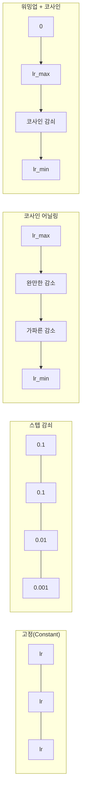
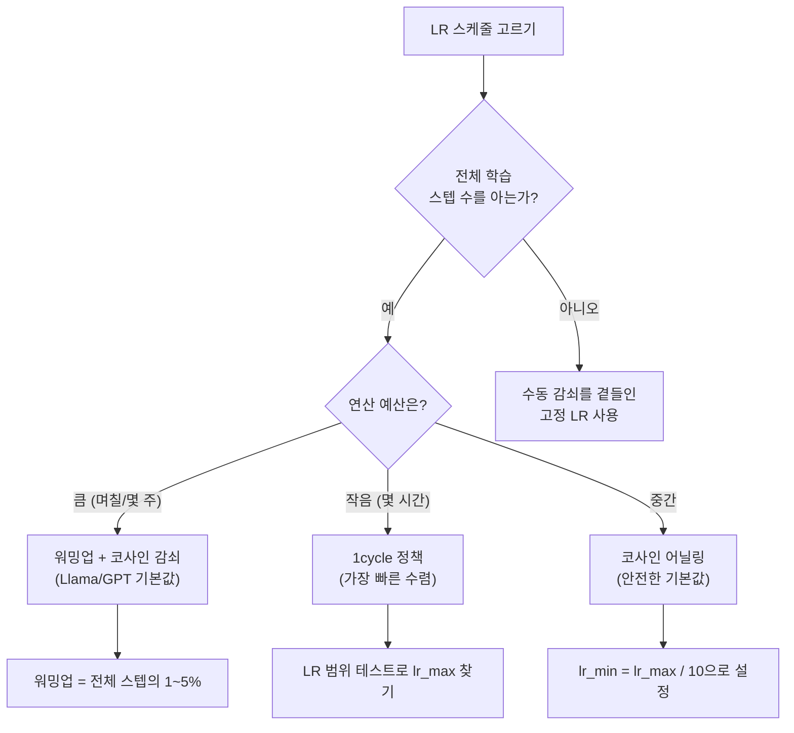
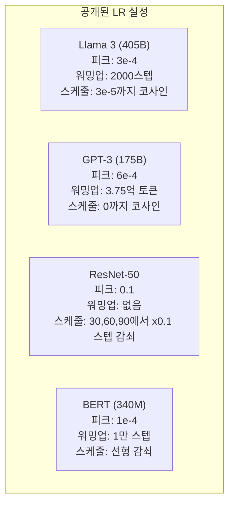

# 학습률 스케줄과 워밍업

> 🇰🇷 이 문서는 한국어 번역본입니다(ELI5 스타일). 원문: [en.md](en.md)

> 학습률은 단연코 가장 중요한 하이퍼파라미터입니다. 아키텍처도 아니고, 데이터셋 크기도 아니고, 활성화 함수도 아닙니다. 바로 학습률입니다. 딱 하나만 튜닝할 수 있다면 이것을 튜닝하세요.

**유형:** Build(만들기)
**언어:** Python
**선수 지식:** 레슨 03.06(옵티마이저), 레슨 03.08(가중치 초기화)
**시간:** 약 90분

## 학습 목표

- 고정(constant), 스텝 감쇠(step decay), 코사인 어닐링(cosine annealing), 워밍업 + 코사인, 1cycle 학습률 스케줄을 처음부터 직접 구현하기
- 학습률 선택에서 나타나는 세 가지 실패 양상을 보여주기: 발산(너무 높음), 정체(너무 낮음), 진동(감쇠 없음)
- Adam 계열 옵티마이저에 워밍업이 꼭 필요한 이유와, 워밍업이 초기 학습을 안정시키는 방식 설명하기
- 같은 과제에서 다섯 가지 스케줄 전부의 수렴 속도를 비교하고, 주어진 학습 예산에 맞는 스케줄 고르기

## 문제 상황

학습률을 0.1로 설정하면 학습이 발산합니다. 손실이 3스텝 만에 무한대로 뛰어 올라갑니다. 0.0001로 설정하면 학습이 기어갑니다. 100 에포크가 지나도 모델이 무작위 상태에서 거의 움직이지 않습니다. 0.01로 설정하면 50 에포크 동안은 잘 되다가, 이후 손실이 최솟값 주변에서 맴돌기만 합니다. 스텝이 너무 커서 최솟값에 다다르지 못하기 때문입니다.

최적의 학습률은 상수가 아닙니다. 학습 도중에 계속 변합니다. 초반에는 넓은 지면을 빠르게 커버하도록 큰 스텝을 원하고, 학습 후반에는 날카로운 최솟값에 안착하도록 아주 작은 스텝을 원합니다. 정확도 90%짜리 모델과 95%짜리 모델의 차이가 운명을 좌우하는 것은 의외로 스케줄 하나일 때가 많습니다.

최근 3년간 발표된 주요 모델은 모두 학습률 스케줄을 사용합니다. Llama 3는 peak lr=3e-4에 워밍업 2000스텝, 3e-5까지의 코사인 감쇠를 썼습니다. GPT-3는 lr=6e-4에 3억 7500만 토큰에 걸친 워밍업을 사용했습니다. 이는 마음대로 정한 수치가 아닙니다. 수백만 달러를 들인 대규모 하이퍼파라미터 탐색의 결과물입니다.

스케줄을 이해해야 하는 이유는 기본값이 여러분의 문제에는 맞지 않기 때문입니다. 사전 학습된 모델을 파인튜닝할 때는 처음부터 학습할 때와 맞는 스케줄이 다릅니다. 배치 크기를 늘리면 워밍업 기간도 바꿔야 합니다. 10,000스텝쯤에서 학습이 깨지면, 그게 스케줄 문제인지 다른 문제인지 판별할 수 있어야 합니다.

## 핵심 개념

### 고정 학습률

가장 단순한 방식입니다. 숫자를 하나 정해서 모든 스텝에 그대로 씁니다.

```
lr(t) = lr_0
```

최적에 가까운 경우는 드뭅니다. 학습 후반에는 너무 커서(최솟값 주변 진동) 좋지 않거나, 초반에는 너무 작아서(작은 스텝에 연산 낭비) 좋지 않습니다. 작은 모델과 디버깅에는 무난하지만, 한 시간 이상 학습되는 대상에는 최악의 선택입니다.

### 스텝 감쇠(Step Decay)

ResNet 시절의 올드스쿨 방식입니다. 정해진 에포크에 학습률을 일정 비율(보통 10배 감소)로 자릅니다.

```
lr(t) = lr_0 * gamma^(floor(epoch / step_size))
```

gamma = 0.1이고 step_size = 30이라는 것은: 학습률이 30 에포크마다 10분의 1로 떨어진다는 뜻입니다. ResNet-50이 이 방식을 썼습니다. lr=0.1로 시작해 30, 60, 90 에포크에서 10분의 1로 감소.

문제는 최적의 감쇠 시점이 데이터셋과 아키텍처에 따라 달라진다는 점입니다. 다른 문제로 옮겨가면 언제 떨어뜨릴지 다시 튜닝해야 합니다. 전환도 갑작스럽습니다. 학습률이 문득 바뀌는 순간 손실이 튀어 오를 수 있습니다.

### 코사인 어닐링

최대 학습률에서 최소 학습률까지 코사인 곡선을 따라 부드럽게 감쇠합니다:

```
lr(t) = lr_min + 0.5 * (lr_max - lr_min) * (1 + cos(pi * t / T))
```

여기서 t는 현재 스텝, T는 전체 스텝 수입니다.

t=0에서는 코사인 항이 1이므로 lr = lr_max입니다. t=T에서는 코사인 항이 -1이므로 lr = lr_min입니다. 감쇠는 처음에는 완만하다가 중반에 가팔라지고, 끝무렵에는 다시 완만해집니다.

요즘 대부분의 학습에서 쓰이는 기본값입니다. lr_max와 lr_min 외에 튜닝할 하이퍼파라미터가 없습니다. 코사인 모양은 "학습의 대부분은 훈련 중반에 일어난다"는 경험적 관찰과 맞아 떨어집니다. 그 중요한 구간에서 적당한 스텝 크기를 유지할 수 있기 때문입니다.

### 워밍업: 왜 작게 시작하는가

Adam을 비롯한 적응형 옵티마이저는 그래디언트의 평균과 분산에 대한 이동 추정값을 유지합니다. 스텝 0에서 이 추정값들은 0으로 초기화되어 있습니다. 즉 처음 몇 번의 그래디언트 갱신은 엉터리 통계에 기반합니다. 이 시기에 학습률이 크면 모델은 방향도 엉터리인 거대한 스텝을 내딛게 됩니다.

워밍업이 이 문제를 고쳐 줍니다. 아주 작은 학습률(보통 lr_max / warmup_steps, 심지어 0)로 시작해서 처음 N스텝에 걸쳐 선형적으로 lr_max까지 올립니다. 전체 학습률에 도달할 무렵에는 Adam의 통계가 안정되어 있습니다.

```
lr(t) = lr_max * (t / warmup_steps)     (t < warmup_steps인 동안)
```

일반적인 워밍업 길이는 전체 학습 스텝의 1~5%입니다. Llama 3는 약 1.8조 토큰을 학습하면서 2000스텝을 워밍업했습니다. GPT-3는 3억 7500만 토큰에 걸쳐 워밍업했습니다.

### 선형 워밍업 + 코사인 감쇠

현대의 기본값입니다. 선형으로 올린 다음 코사인으로 감쇠합니다:

```
if t < warmup_steps:
    lr(t) = lr_max * (t / warmup_steps)
else:
    progress = (t - warmup_steps) / (total_steps - warmup_steps)
    lr(t) = lr_min + 0.5 * (lr_max - lr_min) * (1 + cos(pi * progress))
```

Llama, GPT, PaLM을 비롯한 대부분의 현대 트랜스포머가 이 방식을 사용합니다. 워밍업이 초기 불안정성을 막아 주고, 코사인 감쇠가 모델을 좋은 최솟값에 안착시켜 줍니다.

### 1cycle 정책

Leslie Smith의 발견(2018): 학습 전반부에는 학습률을 낮은 값에서 높은 값으로 올리고, 후반부에는 다시 내립니다. 직관에 어긋납니다. 왜 중간에 학습률을 *올리는* 걸까요?

이론은 이렇습니다. 높은 학습률은 최적화 경로에 잡음을 더함으로써 정규화 역할을 합니다. 올리는 구간 동안 모델이 손실 지형을 더 넓게 탐색하면서 더 좋은 분지(basin)를 찾습니다. 이후 내려오는 구간에서 발견된 가장 좋은 분지 안에서 다듬어집니다.

```
페이즈 1 (0부터 T/2까지):    lr이 lr_max/25에서 lr_max까지 상승
페이즈 2 (T/2부터 T까지):    lr이 lr_max에서 lr_max/10000까지 감소
```

1cycle은 정해진 연산 예산에서 코사인 어닐링보다 빠르게 학습되는 경우가 많습니다. 대신 전체 스텝 수를 미리 알아야 한다는 트레이드오프가 있습니다.

### 스케줄의 모양



### 의사 결정 플로차트



### 발표된 모델들의 실제 수치



```figure
lr-schedule
```

## 만들어 보기

### 단계 1: 스케줄 함수

각 함수는 현재 스텝을 받아 그 스텝의 학습률을 반환합니다.

```python
import math


def constant_schedule(step, lr=0.01, **kwargs):
    return lr


def step_decay_schedule(step, lr=0.1, step_size=100, gamma=0.1, **kwargs):
    return lr * (gamma ** (step // step_size))


def cosine_schedule(step, lr=0.01, total_steps=1000, lr_min=1e-5, **kwargs):
    if step >= total_steps:
        return lr_min
    return lr_min + 0.5 * (lr - lr_min) * (1 + math.cos(math.pi * step / total_steps))


def warmup_cosine_schedule(step, lr=0.01, total_steps=1000, warmup_steps=100, lr_min=1e-5, **kwargs):
    if total_steps <= warmup_steps:
        return lr * (step / max(warmup_steps, 1))
    if step < warmup_steps:
        return lr * step / warmup_steps
    progress = (step - warmup_steps) / (total_steps - warmup_steps)
    return lr_min + 0.5 * (lr - lr_min) * (1 + math.cos(math.pi * progress))


def one_cycle_schedule(step, lr=0.01, total_steps=1000, **kwargs):
    mid = max(total_steps // 2, 1)
    if step < mid:
        return (lr / 25) + (lr - lr / 25) * step / mid
    else:
        progress = (step - mid) / max(total_steps - mid, 1)
        return lr * (1 - progress) + (lr / 10000) * progress
```

### 단계 2: 모든 스케줄 시각화

각 스케줄이 학습 동안 어떻게 변하는지 보여 주는 텍스트 기반 플롯을 출력합니다.

```python
def visualize_schedule(name, schedule_fn, total_steps=500, **kwargs):
    steps = list(range(0, total_steps, total_steps // 20))
    if total_steps - 1 not in steps:
        steps.append(total_steps - 1)

    lrs = [schedule_fn(s, total_steps=total_steps, **kwargs) for s in steps]
    max_lr = max(lrs) if max(lrs) > 0 else 1.0

    print(f"\n{name}:")
    for s, lr_val in zip(steps, lrs):
        bar_len = int(lr_val / max_lr * 40)
        bar = "#" * bar_len
        print(f"  Step {s:4d}: lr={lr_val:.6f} {bar}")
```

### 단계 3: 네트워크 학습

이전 레슨들과 마찬가지로 circle 데이터셋을 대상으로 하는 간단한 두 층 네트워크입니다. 다만 이번에는 스케줄을 바꿔 가며 봅니다.

```python
import random


def sigmoid(x):
    x = max(-500, min(500, x))
    return 1.0 / (1.0 + math.exp(-x))


def relu(x):
    return max(0.0, x)


def relu_deriv(x):
    return 1.0 if x > 0 else 0.0


def make_circle_data(n=200, seed=42):
    random.seed(seed)
    data = []
    for _ in range(n):
        x = random.uniform(-2, 2)
        y = random.uniform(-2, 2)
        label = 1.0 if x * x + y * y < 1.5 else 0.0
        data.append(([x, y], label))
    return data


def train_with_schedule(schedule_fn, schedule_name, data, epochs=300, base_lr=0.05, **kwargs):
    random.seed(0)
    hidden_size = 8
    total_steps = epochs * len(data)

    std = math.sqrt(2.0 / 2)
    w1 = [[random.gauss(0, std) for _ in range(2)] for _ in range(hidden_size)]
    b1 = [0.0] * hidden_size
    w2 = [random.gauss(0, std) for _ in range(hidden_size)]
    b2 = 0.0

    step = 0
    epoch_losses = []

    for epoch in range(epochs):
        total_loss = 0
        correct = 0

        for x, target in data:
            lr = schedule_fn(step, lr=base_lr, total_steps=total_steps, **kwargs)

            z1 = []
            h = []
            for i in range(hidden_size):
                z = w1[i][0] * x[0] + w1[i][1] * x[1] + b1[i]
                z1.append(z)
                h.append(relu(z))

            z2 = sum(w2[i] * h[i] for i in range(hidden_size)) + b2
            out = sigmoid(z2)

            error = out - target
            d_out = error * out * (1 - out)

            for i in range(hidden_size):
                d_h = d_out * w2[i] * relu_deriv(z1[i])
                w2[i] -= lr * d_out * h[i]
                for j in range(2):
                    w1[i][j] -= lr * d_h * x[j]
                b1[i] -= lr * d_h
            b2 -= lr * d_out

            total_loss += (out - target) ** 2
            if (out >= 0.5) == (target >= 0.5):
                correct += 1
            step += 1

        avg_loss = total_loss / len(data)
        accuracy = correct / len(data) * 100
        epoch_losses.append(avg_loss)

    return epoch_losses
```

### 단계 4: 모든 스케줄 비교

같은 네트워크를 각 스케줄로 학습시키고 최종 손실과 수렴 동작을 비교합니다.

```python
def compare_schedules(data):
    configs = [
        ("Constant", constant_schedule, {}),
        ("Step Decay", step_decay_schedule, {"step_size": 15000, "gamma": 0.1}),
        ("Cosine", cosine_schedule, {"lr_min": 1e-5}),
        ("Warmup+Cosine", warmup_cosine_schedule, {"warmup_steps": 3000, "lr_min": 1e-5}),
        ("1cycle", one_cycle_schedule, {}),
    ]

    print(f"\n{'Schedule':<20} {'Start Loss':>12} {'Mid Loss':>12} {'End Loss':>12} {'Best Loss':>12}")
    print("-" * 70)

    for name, schedule_fn, extra_kwargs in configs:
        losses = train_with_schedule(schedule_fn, name, data, epochs=300, base_lr=0.05, **extra_kwargs)
        mid_idx = len(losses) // 2
        best = min(losses)
        print(f"{name:<20} {losses[0]:>12.6f} {losses[mid_idx]:>12.6f} {losses[-1]:>12.6f} {best:>12.6f}")
```

### 단계 5: 학습률이 너무 높을 때 vs 너무 낮을 때

세 가지 실패 양상을 보여 줍니다: 너무 높음(발산), 너무 낮음(기어 가기), 딱 맞음.

```python
def lr_sensitivity(data):
    learning_rates = [1.0, 0.1, 0.01, 0.001, 0.0001]

    print("\nLR Sensitivity (constant schedule, 100 epochs):")
    print(f"  {'LR':>10} {'Start Loss':>12} {'End Loss':>12} {'Status':>15}")
    print("  " + "-" * 52)

    for lr in learning_rates:
        losses = train_with_schedule(constant_schedule, f"lr={lr}", data, epochs=100, base_lr=lr)
        start = losses[0]
        end = losses[-1]

        if end > start or math.isnan(end) or end > 1.0:
            status = "DIVERGED"
        elif end > start * 0.9:
            status = "BARELY MOVED"
        elif end < 0.15:
            status = "CONVERGED"
        else:
            status = "LEARNING"

        end_str = f"{end:.6f}" if not math.isnan(end) else "NaN"
        print(f"  {lr:>10.4f} {start:>12.6f} {end_str:>12} {status:>15}")
```

## 사용해 보기

PyTorch는 `torch.optim.lr_scheduler`에 스케줄러를 제공합니다:

```python
import torch
import torch.optim as optim
from torch.optim.lr_scheduler import CosineAnnealingLR, OneCycleLR, StepLR

model = nn.Sequential(nn.Linear(10, 64), nn.ReLU(), nn.Linear(64, 1))
optimizer = optim.Adam(model.parameters(), lr=3e-4)

scheduler = CosineAnnealingLR(optimizer, T_max=1000, eta_min=1e-5)

for step in range(1000):
    loss = train_step(model, optimizer)
    scheduler.step()
```

워밍업 + 코사인에는 람다 스케줄러나 HuggingFace의 `get_cosine_schedule_with_warmup`을 사용하세요:

```python
from transformers import get_cosine_schedule_with_warmup

scheduler = get_cosine_schedule_with_warmup(
    optimizer,
    num_warmup_steps=2000,
    num_training_steps=100000,
)
```

대부분의 Llama와 GPT 파인튜닝 스크립트가 이 HuggingFace 함수를 사용합니다. 확실하지 않다면 워밍업 + 코사인(워밍업은 전체 스텝의 3~5%)을 쓰세요. 거의 모든 상황에서 통합니다.

## 출시하기

이 레슨이 만들어 내는 산출물:
- `outputs/prompt-lr-schedule-advisor.md` -- 여러분의 학습 환경에 맞는 올바른 학습률 스케줄과 하이퍼파라미터를 추천하는 프롬프트

## 연습 문제

1. 지수 감쇠를 구현해 보세요: lr(t) = lr_0 * gamma^t (gamma = 0.999). circle 데이터셋에서 코사인 어닐링과 비교해 보세요.

2. 학습률 범위 테스트(LR range test, Leslie Smith)를 구현해 보세요: LR을 1e-7에서 1까지 지수적으로 늘려 가며 몇백 스텝을 학습합니다. 손실 대 LR 그래프를 그려 보세요. 손실이 다시 오르기 직전의 값이 최적의 최대 LR입니다.

3. 워밍업 + 코사인으로 학습하되 워밍업 길이를 바꿔 보세요: 전체 스텝의 0%, 1%, 5%, 10%, 20%. 학습이 가장 안정적인 지점을 찾아 보세요.

4. 웜 리스타트(전체 재시작)를 곁들인 코사인 어닐링(SGDR)을 구현해 보세요: T스텝마다 학습률을 lr_max로 초기화하고 다시 감쇠시킵니다. 더 긴 학습 실행에서 표준 코사인과 비교해 보세요.

5. 학습 손실을 감시하다가 손실이 안정되면 자동으로 워밍업에서 코사인으로 전환하고, 손실이 오랫동안 정체되면 lr을 낮추는 "스케줄 외과의"를 만들어 보세요.

## 핵심 용어

| 용어 | 사람들이 말하는 것 | 실제 의미 |
|------|----------------|----------------------|
| 학습률 | "모델이 배우는 속도" | 그래디언트에 곱해져 파라미터 갱신 크기를 결정하는 스칼라 값 |
| 스케줄 | "학습률을 시간에 따라 바꾸는 것" | 학습 스텝을 학습률로 매핑하는 함수로, 수렴을 최적화하도록 설계됨 |
| 워밍업 | "작은 LR로 시작하기" | 옵티마이저 통계를 안정시키기 위해 처음 N스텝에 걸쳐 LR을 거의 0에서 목표값까지 선형적으로 올리는 것 |
| 코사인 어닐링 | "부드러운 LR 감쇠" | 학습 동안 lr_max에서 lr_min까지 코사인 곡선을 따라 LR을 줄이는 것 |
| 스텝 감쇠 | "중요 시점에 LR 낮추기" | 정해진 에포크 간격마다 LR에 일정 인자(보통 0.1)를 곱하는 것 |
| 1cycle 정책 | "올렸다가 내리기" | 한 사이클 안에서 LR을 올렸다가 내려 더 빠른 수렴을 얻는 Leslie Smith의 방법 |
| LR 범위 테스트 | "최적의 학습률 찾기" | LR을 늘려 가며 짧게 학습해서 손실이 발산하기 시작하는 지점을 찾는 것 |
| 웜 리스타트 코사인 | "초기화하고 반복하기" | 주기적으로 LR을 lr_max로 초기화하고 다시 감쇠시키는 것(SGDR) |
| Eta min | "LR의 하한선" | 스케줄이 감쇠해 도달하는 최소 학습률 |
| 피크 학습률 | "최대 LR" | 학습 동안 도달하는 가장 높은 LR로, 보통 워밍업 직후에 나타남 |

## 더 읽을거리

- Loshchilov & Hutter, "SGDR: Stochastic Gradient Descent with Warm Restarts" (2017) -- 코사인 어닐링과 웜 리스타트를 소개한 논문
- Smith, "Super-Convergence: Very Fast Training of Neural Networks Using Large Learning Rates" (2018) -- 1cycle 정책 논문
- Touvron et al., "Llama 2: Open Foundation and Fine-Tuned Chat Models" (2023) -- 대규모로 사용된 워밍업 + 코사인 스케줄 문서화
- Goyal et al., "Accurate, Large Minibatch SGD: Training ImageNet in 1 Hour" (2017) -- 대배치 학습을 위한 선형 스케일링 규칙과 워밍업
