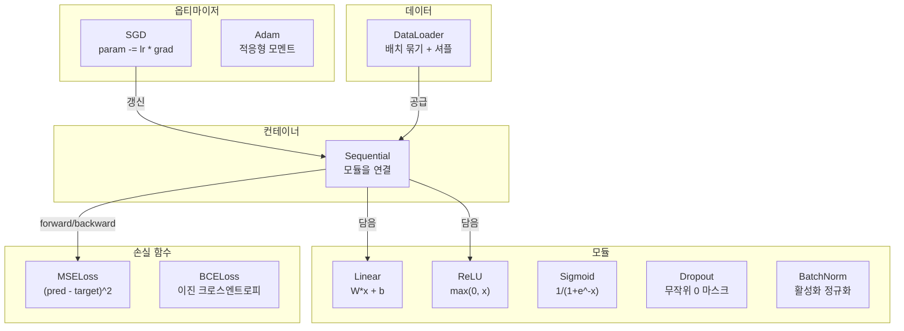
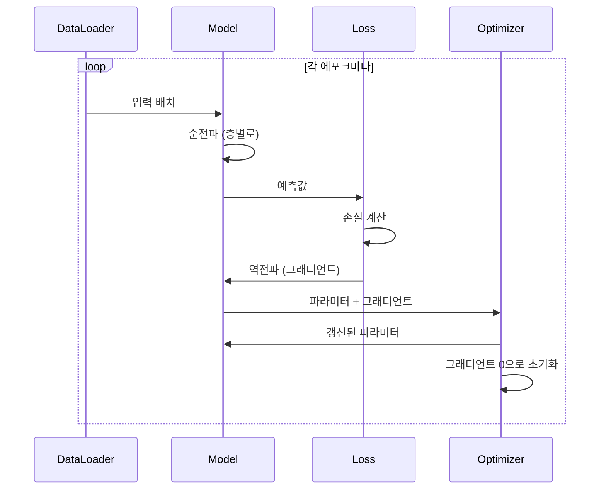
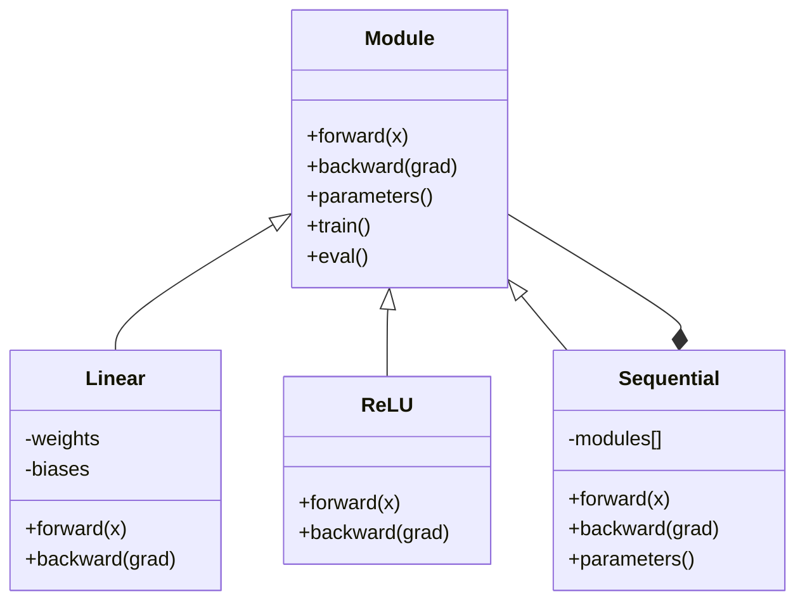

# 나만의 미니 프레임워크 만들기

> 🇰🇷 이 문서는 한국어 번역본입니다(ELI5 스타일). 원문: [en.md](en.md)

> 지금까지 뉴런, 층, 네트워크, 역전파, 활성화 함수, 손실 함수, 옵티마이저, 정규화, 초기화, 학습률 스케줄을 만들었습니다. 모두 따로따로 조각 상태로요. 이제 이것들을 하나로 묶어 프레임워크로 만들 차례입니다. PyTorch도 아니고 TensorFlow도 아닌, 여러분 고유의 프레임워크입니다.

**유형:** Build(만들기)
**언어:** Python
**선수 지식:** 페이즈 03 전체(레슨 01~09)
**시간:** 약 120분

## 학습 목표

- Module, Linear, ReLU, Sigmoid, Dropout, BatchNorm, Sequential, 손실 함수, 옵티마이저, DataLoader를 갖춘 완전한 딥러닝 프레임워크(약 500줄) 만들기
- Module 추상화(forward, backward, parameters)와 train/eval 모드 전환이 왜 필요한지 설명하기
- 모든 구성 요소를 하나로 묶어 circle 분류 과제에서 4층 네트워크를 학습시키는 동작하는 학습 루프 완성하기
- 프레임워크의 각 구성 요소를 PyTorch의 대응물(nn.Module, nn.Sequential, optim.Adam, DataLoader)과 짝지어 보기

## 문제 상황

열 개 레슨에 걸쳐 만든 구성 요소들이 별개의 파일에 흩어져 있습니다. 여기엔 `Value` 클래스, 저기엔 학습 루프, 또 다른 파일엔 가중치 초기화, 그리고 또 다른 곳엔 학습률 스케줄이 있습니다. 네트워크를 학습시키려면 다섯 개 레슨에서 코드를 복사해 붙여 넣고 손으로 직접 연결해야 합니다.

프레임워크가 해결해 주는 것이 바로 이 문제입니다. PyTorch는 `nn.Module`, `nn.Sequential`, `optim.Adam`, `DataLoader`, 그리고 이것들을 묶어 주는 학습 루프 패턴을 제공합니다. TensorFlow는 `keras.Layer`, `keras.Sequential`, `keras.optimizers.Adam`을 제공하죠. 이것들은 마법이 아닙니다. 매번 배관 공사부터 다시 하지 않고도 네트워크를 정의하고, 학습시키고, 평가할 수 있게 해 주는 조직화 패턴일 뿐입니다.

여러분은 똑같은 것을 약 500줄의 파이썬으로 만들 것입니다. numpy도, 외부 의존성도 없이. 어떤 피드포워드 네트워크든 정의하고, SGD나 Adam으로 학습시키고, 데이터를 배치로 묶고, 드롭아웃과 배치 정규화를 적용하고, 어떤 활성화 함수든 쓰고, 학습률을 스케줄링할 수 있는 프레임워크입니다.

완성하고 나면 PyTorch에서 `model = nn.Sequential(...)`을 쓸 때 무슨 일이 일어나는지 정확히 이해하게 됩니다. `model.train()`과 `model.eval()`이 왜 존재하는지 이해하게 됩니다. `optimizer.zero_grad()`가 별도 호출인 이유도 이해하게 됩니다. 전부 직접 만들었으니 전부 이해할 수밖에 없습니다.

## 핵심 개념

### Module 추상화

PyTorch의 모든 층은 `nn.Module`을 상속합니다. Module에는 세 가지 책임이 있습니다:

1. **forward()** -- 입력이 주어지면 출력을 계산
2. **parameters()** -- 학습 가능한 모든 가중치 반환
3. **backward()** -- 그래디언트 계산 (PyTorch에서는 autograd가 처리하고, 우리 프레임워크에서는 직접 구현)

Linear 층은 Module입니다. ReLU 활성화도 Module입니다. 드롭아웃 층도, 배치 정규화 층도 Module입니다. 모두 같은 인터페이스를 갖습니다.

### Sequential 컨테이너

`nn.Sequential`은 Module들을 사슬처럼 연결합니다. 순전파: 데이터를 Module 1에 넣고, 그다음 Module 2, 그다음 Module 3에 넣습니다. 역전파: 사슬을 거꾸로 거슬러 올라갑니다. 컨테이너 자체도 Module입니다. forward(), parameters(), backward()를 갖고 있죠. 이것이 바로 컴포짓(composite) 패턴입니다. Module들의 나열 자체가 Module이 되는 것입니다.

### 학습 모드 vs 평가 모드

드롭아웃은 학습 중에는 뉴런을 무작위로 0으로 만들지만, 평가 중에는 모든 것을 그대로 통과시킵니다. 배치 정규화는 학습 중에는 배치 통계를 쓰지만, 평가 중에는 이동 평균을 사용합니다. `train()`과 `eval()` 메서드가 이 동작을 전환합니다. 모든 Module은 `training` 플래그를 갖습니다.

### 옵티마이저

옵티마이저는 그래디언트를 이용해 파라미터를 갱신합니다. SGD: `param -= lr * grad`. Adam: 모멘텀과 분산 추정값을 유지한 뒤 갱신합니다. 옵티마이저는 네트워크 아키텍처를 알지 못합니다. 파라미터 목록과 그래디언트라는 평평한 리스트만 볼 뿐입니다.

### DataLoader

배치 묶기가 중요한 이유는 두 가지입니다. 첫째, 큰 문제에서는 데이터셋 전체를 메모리에 담을 수 없습니다. 둘째, 미니배치 경사 하강법이 주는 잡음이 지역 최솟값에서 빠져나오는 데 도움이 됩니다. DataLoader는 데이터를 배치로 나누고, 필요하면 에포크 사이에 섞습니다(shuffle).

### 프레임워크 아키텍처



### 학습 루프



### Module 계층 구조



```figure
gradient-clipping
```

## 만들어 보기

### 단계 1: Module 기반 클래스

모든 층이 구현하는 추상 인터페이스입니다.

```python
class Module:
    def __init__(self):
        self.training = True

    def forward(self, x):
        raise NotImplementedError

    def backward(self, grad):
        raise NotImplementedError

    def parameters(self):
        return []

    def train(self):
        self.training = True

    def eval(self):
        self.training = False
```

### 단계 2: Linear 층

가장 기본이 되는 구성 요소입니다. 가중치와 편향을 저장하고, 순전파에서는 Wx + b를 계산하며, 역전파에서는 가중치/입력 그래디언트를 계산합니다.

```python
import math
import random


class Linear(Module):
    def __init__(self, fan_in, fan_out):
        super().__init__()
        std = math.sqrt(2.0 / fan_in)
        self.weights = [[random.gauss(0, std) for _ in range(fan_in)] for _ in range(fan_out)]
        self.biases = [0.0] * fan_out
        self.weight_grads = [[0.0] * fan_in for _ in range(fan_out)]
        self.bias_grads = [0.0] * fan_out
        self.fan_in = fan_in
        self.fan_out = fan_out
        self.input = None

    def forward(self, x):
        self.input = x
        output = []
        for i in range(self.fan_out):
            val = self.biases[i]
            for j in range(self.fan_in):
                val += self.weights[i][j] * x[j]
            output.append(val)
        return output

    def backward(self, grad):
        input_grad = [0.0] * self.fan_in
        for i in range(self.fan_out):
            self.bias_grads[i] += grad[i]
            for j in range(self.fan_in):
                self.weight_grads[i][j] += grad[i] * self.input[j]
                input_grad[j] += grad[i] * self.weights[i][j]
        return input_grad

    def parameters(self):
        params = []
        for i in range(self.fan_out):
            for j in range(self.fan_in):
                params.append((self.weights, i, j, self.weight_grads))
            params.append((self.biases, i, None, self.bias_grads))
        return params
```

### 단계 3: 활성화 모듈

Module로 만든 ReLU, Sigmoid, Tanh입니다. 각각 역전파에 필요한 값을 캐시해 둡니다.

```python
class ReLU(Module):
    def __init__(self):
        super().__init__()
        self.mask = None

    def forward(self, x):
        self.mask = [1.0 if v > 0 else 0.0 for v in x]
        return [max(0.0, v) for v in x]

    def backward(self, grad):
        return [g * m for g, m in zip(grad, self.mask)]


class Sigmoid(Module):
    def __init__(self):
        super().__init__()
        self.output = None

    def forward(self, x):
        self.output = []
        for v in x:
            v = max(-500, min(500, v))
            self.output.append(1.0 / (1.0 + math.exp(-v)))
        return self.output

    def backward(self, grad):
        return [g * o * (1 - o) for g, o in zip(grad, self.output)]


class Tanh(Module):
    def __init__(self):
        super().__init__()
        self.output = None

    def forward(self, x):
        self.output = [math.tanh(v) for v in x]
        return self.output

    def backward(self, grad):
        return [g * (1 - o * o) for g, o in zip(grad, self.output)]
```

### 단계 4: Dropout 모듈

학습 중에는 원소를 무작위로 0으로 만듭니다. 남은 원소는 1/(1-p)를 곱해 기댓값이 그대로 유지되도록 합니다. 평가 모드에서는 아무것도 하지 않습니다.

```python
class Dropout(Module):
    def __init__(self, p=0.5):
        super().__init__()
        self.p = p
        self.mask = None

    def forward(self, x):
        if not self.training:
            return x
        self.mask = [0.0 if random.random() < self.p else 1.0 / (1 - self.p) for _ in x]
        return [v * m for v, m in zip(x, self.mask)]

    def backward(self, grad):
        if self.mask is None:
            return grad
        return [g * m for g, m in zip(grad, self.mask)]
```

### 단계 5: BatchNorm 모듈

배치 전체에서 특성(feature)별로 활성화를 평균 0, 분산 1로 정규화합니다. 평가 모드를 위해 이동 통계(running statistics)를 유지합니다.

```python
class BatchNorm(Module):
    def __init__(self, size, momentum=0.1, eps=1e-5):
        super().__init__()
        self.size = size
        self.gamma = [1.0] * size
        self.beta = [0.0] * size
        self.gamma_grads = [0.0] * size
        self.beta_grads = [0.0] * size
        self.running_mean = [0.0] * size
        self.running_var = [1.0] * size
        self.momentum = momentum
        self.eps = eps
        self.x_norm = None
        self.std_inv = None
        self.batch_input = None

    def forward_batch(self, batch):
        batch_size = len(batch)
        output_batch = []

        if self.training:
            mean = [0.0] * self.size
            for sample in batch:
                for j in range(self.size):
                    mean[j] += sample[j]
            mean = [m / batch_size for m in mean]

            var = [0.0] * self.size
            for sample in batch:
                for j in range(self.size):
                    var[j] += (sample[j] - mean[j]) ** 2
            var = [v / batch_size for v in var]

            self.std_inv = [1.0 / math.sqrt(v + self.eps) for v in var]

            self.x_norm = []
            self.batch_input = batch
            for sample in batch:
                normed = [(sample[j] - mean[j]) * self.std_inv[j] for j in range(self.size)]
                self.x_norm.append(normed)
                output = [self.gamma[j] * normed[j] + self.beta[j] for j in range(self.size)]
                output_batch.append(output)

            for j in range(self.size):
                self.running_mean[j] = (1 - self.momentum) * self.running_mean[j] + self.momentum * mean[j]
                self.running_var[j] = (1 - self.momentum) * self.running_var[j] + self.momentum * var[j]
        else:
            std_inv = [1.0 / math.sqrt(v + self.eps) for v in self.running_var]
            for sample in batch:
                normed = [(sample[j] - self.running_mean[j]) * std_inv[j] for j in range(self.size)]
                output = [self.gamma[j] * normed[j] + self.beta[j] for j in range(self.size)]
                output_batch.append(output)

        return output_batch

    def forward(self, x):
        result = self.forward_batch([x])
        return result[0]

    def backward(self, grad):
        if self.x_norm is None:
            return grad
        for j in range(self.size):
            self.gamma_grads[j] += self.x_norm[0][j] * grad[j]
            self.beta_grads[j] += grad[j]
        return [grad[j] * self.gamma[j] * self.std_inv[j] for j in range(self.size)]

    def parameters(self):
        params = []
        for j in range(self.size):
            params.append((self.gamma, j, None, self.gamma_grads))
            params.append((self.beta, j, None, self.beta_grads))
        return params
```

### 단계 6: Sequential 컨테이너

모듈들을 연결합니다. 순전파는 왼쪽에서 오른쪽으로, 역전파는 오른쪽에서 왼쪽으로 흐릅니다.

```python
class Sequential(Module):
    def __init__(self, *modules):
        super().__init__()
        self.modules = list(modules)

    def forward(self, x):
        for module in self.modules:
            x = module.forward(x)
        return x

    def backward(self, grad):
        for module in reversed(self.modules):
            grad = module.backward(grad)
        return grad

    def parameters(self):
        params = []
        for module in self.modules:
            params.extend(module.parameters())
        return params

    def train(self):
        self.training = True
        for module in self.modules:
            module.train()

    def eval(self):
        self.training = False
        for module in self.modules:
            module.eval()
```

### 단계 7: 손실 함수

MSE와 이진 크로스엔트로피입니다. 각각 손실 값을 반환하고, 그래디언트를 돌려주는 backward()를 제공합니다.

```python
class MSELoss:
    def __call__(self, predicted, target):
        self.predicted = predicted
        self.target = target
        n = len(predicted)
        self.loss = sum((p - t) ** 2 for p, t in zip(predicted, target)) / n
        return self.loss

    def backward(self):
        n = len(self.predicted)
        return [2 * (p - t) / n for p, t in zip(self.predicted, self.target)]


class BCELoss:
    def __call__(self, predicted, target):
        self.predicted = predicted
        self.target = target
        eps = 1e-7
        n = len(predicted)
        self.loss = 0
        for p, t in zip(predicted, target):
            p = max(eps, min(1 - eps, p))
            self.loss += -(t * math.log(p) + (1 - t) * math.log(1 - p))
        self.loss /= n
        return self.loss

    def backward(self):
        eps = 1e-7
        n = len(self.predicted)
        grads = []
        for p, t in zip(self.predicted, self.target):
            p = max(eps, min(1 - eps, p))
            grads.append((-t / p + (1 - t) / (1 - p)) / n)
        return grads
```

### 단계 8: SGD와 Adam 옵티마이저

둘 다 파라미터 목록을 받아 그래디언트로 가중치를 갱신합니다.

```python
class SGD:
    def __init__(self, parameters, lr=0.01):
        self.params = parameters
        self.lr = lr

    def step(self):
        for container, i, j, grad_container in self.params:
            if j is not None:
                container[i][j] -= self.lr * grad_container[i][j]
            else:
                container[i] -= self.lr * grad_container[i]

    def zero_grad(self):
        for container, i, j, grad_container in self.params:
            if j is not None:
                grad_container[i][j] = 0.0
            else:
                grad_container[i] = 0.0


class Adam:
    def __init__(self, parameters, lr=0.001, beta1=0.9, beta2=0.999, eps=1e-8):
        self.params = parameters
        self.lr = lr
        self.beta1 = beta1
        self.beta2 = beta2
        self.eps = eps
        self.t = 0
        self.m = [0.0] * len(parameters)
        self.v = [0.0] * len(parameters)

    def step(self):
        self.t += 1
        for idx, (container, i, j, grad_container) in enumerate(self.params):
            if j is not None:
                g = grad_container[i][j]
            else:
                g = grad_container[i]

            self.m[idx] = self.beta1 * self.m[idx] + (1 - self.beta1) * g
            self.v[idx] = self.beta2 * self.v[idx] + (1 - self.beta2) * g * g

            m_hat = self.m[idx] / (1 - self.beta1 ** self.t)
            v_hat = self.v[idx] / (1 - self.beta2 ** self.t)

            update = self.lr * m_hat / (math.sqrt(v_hat) + self.eps)

            if j is not None:
                container[i][j] -= update
            else:
                container[i] -= update

    def zero_grad(self):
        for container, i, j, grad_container in self.params:
            if j is not None:
                grad_container[i][j] = 0.0
            else:
                grad_container[i] = 0.0
```

### 단계 9: DataLoader

데이터를 배치로 나누고, 필요하면 매 에포크마다 섞습니다.

```python
class DataLoader:
    def __init__(self, data, batch_size=32, shuffle=True):
        self.data = data
        self.batch_size = batch_size
        self.shuffle = shuffle

    def __iter__(self):
        indices = list(range(len(self.data)))
        if self.shuffle:
            random.shuffle(indices)
        for start in range(0, len(indices), self.batch_size):
            batch_indices = indices[start:start + self.batch_size]
            batch = [self.data[i] for i in batch_indices]
            inputs = [item[0] for item in batch]
            targets = [item[1] for item in batch]
            yield inputs, targets

    def __len__(self):
        return (len(self.data) + self.batch_size - 1) // self.batch_size
```

### 단계 10: circle 분류로 4층 네트워크 학습하기

모든 것을 하나로 묶습니다. 모델을 정의하고, 손실을 고르고, 옵티마이저를 고르고, 학습 루프를 돌립니다.

```python
def make_circle_data(n=500, seed=42):
    random.seed(seed)
    data = []
    for _ in range(n):
        x = random.uniform(-2, 2)
        y = random.uniform(-2, 2)
        label = 1.0 if x * x + y * y < 1.5 else 0.0
        data.append(([x, y], [label]))
    return data


def train():
    random.seed(42)

    model = Sequential(
        Linear(2, 16),
        ReLU(),
        Linear(16, 16),
        ReLU(),
        Linear(16, 8),
        ReLU(),
        Linear(8, 1),
        Sigmoid(),
    )

    criterion = BCELoss()
    optimizer = Adam(model.parameters(), lr=0.01)

    data = make_circle_data(500)
    split = int(len(data) * 0.8)
    train_data = data[:split]
    test_data = data[split:]

    loader = DataLoader(train_data, batch_size=16, shuffle=True)

    model.train()

    for epoch in range(100):
        total_loss = 0
        total_correct = 0
        total_samples = 0

        for batch_inputs, batch_targets in loader:
            batch_loss = 0
            for x, t in zip(batch_inputs, batch_targets):
                pred = model.forward(x)
                loss = criterion(pred, t)
                batch_loss += loss

                optimizer.zero_grad()
                grad = criterion.backward()
                model.backward(grad)
                optimizer.step()

                predicted_class = 1.0 if pred[0] >= 0.5 else 0.0
                if predicted_class == t[0]:
                    total_correct += 1
                total_samples += 1

            total_loss += batch_loss

        avg_loss = total_loss / total_samples
        accuracy = total_correct / total_samples * 100

        if epoch % 10 == 0 or epoch == 99:
            print(f"Epoch {epoch:3d} | Loss: {avg_loss:.6f} | Train Accuracy: {accuracy:.1f}%")

    model.eval()
    correct = 0
    for x, t in test_data:
        pred = model.forward(x)
        predicted_class = 1.0 if pred[0] >= 0.5 else 0.0
        if predicted_class == t[0]:
            correct += 1
    test_accuracy = correct / len(test_data) * 100
    print(f"\nTest Accuracy: {test_accuracy:.1f}% ({correct}/{len(test_data)})")

    return model, test_accuracy
```

## 사용해 보기

방금 만든 것과 똑같은 PyTorch 코드입니다:

```python
import torch
import torch.nn as nn
from torch.utils.data import DataLoader, TensorDataset

model = nn.Sequential(
    nn.Linear(2, 16),
    nn.ReLU(),
    nn.Linear(16, 16),
    nn.ReLU(),
    nn.Linear(16, 8),
    nn.ReLU(),
    nn.Linear(8, 1),
    nn.Sigmoid(),
)

criterion = nn.BCELoss()
optimizer = torch.optim.Adam(model.parameters(), lr=0.01)

for epoch in range(100):
    model.train()
    for inputs, targets in dataloader:
        optimizer.zero_grad()
        predictions = model(inputs)
        loss = criterion(predictions, targets)
        loss.backward()
        optimizer.step()

    model.eval()
    with torch.no_grad():
        test_predictions = model(test_inputs)
```

구조가 완전히 동일합니다. `Sequential`, `Linear`, `ReLU`, `Sigmoid`, `BCELoss`, `Adam`, `zero_grad`, `backward`, `step`, `train`, `eval`. 모든 개념이 일대일로 대응됩니다. 차이점은 PyTorch가 autograd를 자동으로 처리한다는 것(각 모듈마다 backward()를 구현할 필요가 없음), GPU에서 돌아간다는 것, 그리고 수년간 최적화를 거쳤다는 것뿐입니다. 하지만 뼈대는 같습니다.

이제 PyTorch 코드를 보면 한 줄 한 줄 무슨 일이 일어나는지 정확히 알 수 있습니다. 바로 그 이해가 이 레슨의 전부입니다.

## 출시하기

이 레슨이 만들어 내는 산출물:
- `outputs/prompt-framework-architect.md` -- 프레임워크 추상화를 활용해 신경망 아키텍처를 설계하기 위한 프롬프트

## 연습 문제

1. 다중 클래스 분류를 위한 `SoftmaxCrossEntropyLoss` 클래스를 추가해 보세요. 예측값에 소프트맥스를 적용하고, 크로스엔트로피 손실을 계산하고, 합쳐진 역전파를 처리합니다. 3클래스 나선(spiral) 데이터셋으로 테스트해 보세요.

2. 옵티마이저 안에 학습률 스케줄링을 구현해 보세요: `set_lr()` 메서드를 추가하고 레슨 09의 코사인 스케줄을 연결합니다. 워밍업 + 코사인으로 circle 분류기를 학습시키고 고정 LR과 비교해 보세요.

3. Sequential에 모든 가중치를 JSON 파일로 직렬화하는 `save()`와 다시 불러오는 `load()` 메서드를 추가해 보세요. 불러온 모델이 원본과 동일한 예측을 내는지 확인합니다.

4. Adam 옵티마이저에 가중치 감쇠(weight decay, L2 정규화)를 구현해 보세요. 매 스텝 가중치를 0 쪽으로 줄이는 `weight_decay` 파라미터를 추가합니다. decay=0과 decay=0.01일 때의 학습을 비교해 보세요.

5. 샘플별 학습 루프를 제대로 된 미니배치 그래디언트 누적으로 바꿔 보세요: 배치 안의 모든 샘플에 걸쳐 그래디언트를 누적한 뒤, 배치 크기로 나누고 옵티마이저 스텝을 한 번만 실행합니다. 이 방식이 수렴 속도에 영향을 주는지 측정해 보세요.

## 핵심 용어

| 용어 | 사람들이 말하는 것 | 실제 의미 |
|------|----------------|----------------------|
| Module | "하나의 층" | 프레임워크의 기본 추상화. forward(), backward(), parameters()를 갖춘 무엇이든 Module |
| Sequential | "층을 순서대로 쌓는 것" | 모듈을 연결하는 컨테이너. 순전파는 순서대로, 역전파는 거꾸로 적용 |
| 순전파(forward pass) | "네트워크 돌리기" | 입력을 각 모듈에 순서대로 통과시켜 출력을 계산하는 것 |
| 역전파(backward pass) | "그래디언트 계산하기" | 손실 그래디언트를 각 모듈을 거꾸로 전파해 파라미터 그래디언트를 구하는 것 |
| 파라미터 | "학습되는 가중치" | 옵티마이저가 갱신할 수 있는 네트워크의 모든 값. 가중치와 편향 |
| 옵티마이저 | "가중치를 갱신하는 것" | 그래디언트를 이용해 파라미터를 갱신하는 알고리즘. SGD, Adam 등의 규칙을 구현 |
| DataLoader | "데이터를 공급하는 것" | 데이터셋을 배치로 나누고, 필요하면 에포크 사이에 섞어 주는 이터레이터 |
| 학습 모드 | "model.train()" | 드롭아웃 같은 확률적 동작과 배치 통계를 쓰는 배치 정규화를 켜는 플래그 |
| 평가 모드 | "model.eval()" | 드롭아웃을 끄고 배치 정규화가 이동 통계를 쓰도록 만드는 플래그 |
| zero grad | "그래디언트 지우기" | 다음 배치의 그래디언트를 계산하기 전에 모든 파라미터 그래디언트를 0으로 초기화하는 것 |

## 더 읽을거리

- Paszke et al., "PyTorch: An Imperative Style, High-Performance Deep Learning Library" (2019) -- PyTorch의 설계 결정을 설명하는 논문
- Chollet, "Deep Learning with Python, Second Edition" (2021) -- 3장에서 같은 module/layer 추상화로 Keras 내부를 다룸
- Johnson, "Tiny-DNN" (https://github.com/tiny-dnn/tiny-dnn) -- 프레임워크 내부를 이해하기 좋은 헤더 온리 C++ 딥러닝 프레임워크
