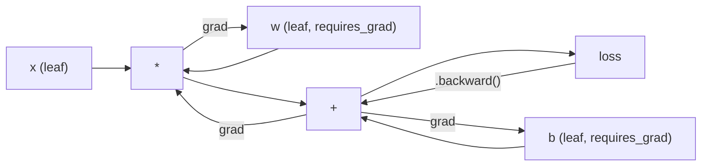
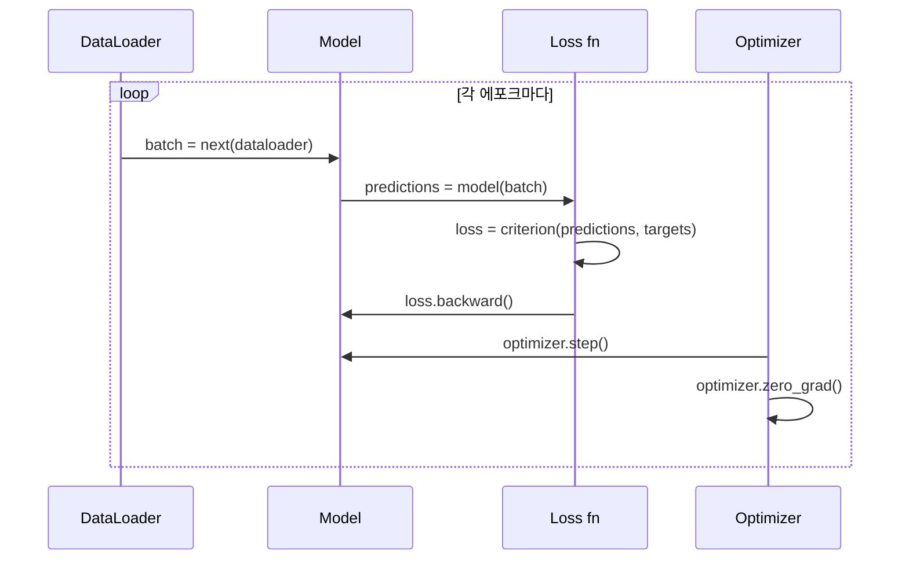

# PyTorch 입문

> 🇰🇷 이 문서는 한국어 번역본입니다(ELI5 스타일). 원문: [en.md](en.md)

> 여러분은 피스톤과 크랭크축으로 엔진을 직접 만들었습니다. 이제 모두가 실제로 타고 다니는 자동차를 배울 차례입니다.

**유형:** Build(만들기)
**언어:** Python
**선수 지식:** 레슨 03.10(나만의 미니 프레임워크 만들기)
**시간:** 약 75분

## 학습 목표

- PyTorch의 nn.Module, nn.Sequential, autograd를 사용해 신경망을 만들고 학습시키기
- PyTorch 텐서, GPU 가속, 표준 학습 루프(zero_grad, forward, loss, backward, step) 사용하기
- 처음부터 만든 미니 프레임워크 구성 요소들을 PyTorch의 대응물로 바꿔 보기
- 같은 과제에서 순수 파이썬 프레임워크와 PyTorch의 학습 속도를 측정하고 비교하기

## 문제 상황

여러분에게는 동작하는 미니 프레임워크가 있습니다. Linear 층, ReLU, 드롭아웃, 배치 정규화, Adam, DataLoader, 학습 루프까지요. 순수 파이썬으로 circle 분류 문제에서 4층 네트워크를 학습시킵니다.

그런데 같은 문제에서 PyTorch보다 500배 느립니다.

여러분의 미니 프레임워크는 중첩된 파이썬 루프로 샘플을 하나씩 처리합니다. PyTorch는 같은 연산을 GPU에서 돌아가는 최적화된 C++/CUDA 커널에 맡깁니다. NVIDIA A100 한 장으로 PyTorch는 ResNet-50(2,560만 파라미터)을 ImageNet(128만 장 이미지)에서 약 6시간 만에 학습합니다. 여러분의 프레임워크라면 같은 과제에 대략 3,000시간이 걸립니다. 메모리가 먼저 바닥나지 않는다면 말이죠.

속도만이 차이가 아닙니다. 여러분의 프레임워크에는 GPU 지원이 없습니다. 자동 미분도 없습니다. 모든 모듈의 backward()를 손으로 직접 썼잖아요. 직렬화도 없고, 분산 학습도 없고, 혼합 정밀도(mixed precision)도 없고, print문 없이는 그래디언트 흐름을 디버깅할 방법도 없습니다.

PyTorch는 이 모든 공백을 메워 줍니다. 그러면서도 여러분이 이미 만든 정확히 같은 멘탈 모델을 유지합니다. Module, forward(), parameters(), backward(), optimizer.step(). 개념은 일대일로 이어지고, 문법도 거의 동일합니다. 달라진 것은 PyTorch가 여러분이 처음부터 설계한 바로 그 인터페이스 뒤에 10년치 시스템 엔지니어링을 감추고 있다는 점뿐입니다.

## 핵심 개념

### PyTorch가 승리한 이유

2015년의 TensorFlow는 무엇이든 실행하기 전에 정적 계산 그래프를 정의하도록 요구했습니다. 그래프를 만들고, 컴파일하고, 그다음 데이터를 흘려 넣는 방식이었습니다. 디버깅이란 그래프 시각화를 한참 들여다보는 일이었죠. 아키텍처를 바꾸려면 그래프를 처음부터 다시 만들어야 했습니다.

PyTorch는 2017년 다른 철학으로 등장했습니다. 바로 즉시 실행(eager execution)입니다. 여러분은 파이썬을 씁니다. 그러면 그 즉시 실행됩니다. `y = model(x)`는 실제로 지금 y를 계산합니다. "나중에 y를 계산할 노드를 그래프에 추가"하는 게 아니라요. 덕분에 표준 파이썬 디버깅 도구가 그대로 동작했습니다. print()가 되고, pdb가 되고, 순전파 안의 if/else도 됐습니다.

2020년경에는 시장이 답을 내렸습니다. ML 연구 논문에서 PyTorch가 차지하는 비율은 7%(2017)에서 75% 이상(2022)으로 뛰었습니다. Meta, Google DeepMind, OpenAI, Anthropic, Hugging Face가 모두 PyTorch를 주력 프레임워크로 사용합니다. TensorFlow 2.x도 대응으로 즉시 실행을 도입했습니다. PyTorch의 설계가 옳았다는 묵시적 인정이었습니다.

교훈은 이것입니다. 개발자 경험은 복리로 쌓입니다. 10% 느리지만 디버깅이 50% 빠른 프레임워크가 언제나 이깁니다.

### 텐서(Tensor)

텐서는 세 가지 핵심 속성을 가진 다차원 배열입니다. shape, dtype, device입니다.

```python
import torch

x = torch.zeros(3, 4)           # shape: (3, 4), dtype: float32, device: cpu
x = torch.randn(2, 3, 224, 224) # 224x224 RGB 이미지 2장짜리 배치
x = torch.tensor([1, 2, 3])     # 파이썬 리스트로부터 생성
```

**Shape**는 차원 구성을 뜻합니다. 스칼라는 (), 벡터는 (n,), 행렬은 (m, n), 이미지 배치는 (batch, channels, height, width)입니다.

**Dtype**은 정밀도와 메모리를 결정합니다.

| dtype | 비트 | 범위 | 용도 |
|-------|------|-------|----------|
| float32 | 32 | 소수 약 7자리 | 기본 학습 |
| float16 | 16 | 소수 약 3.3자리 | 혼합 정밀도 |
| bfloat16 | 16 | float32와 같은 범위, 정밀도는 낮음 | LLM 학습 |
| int8 | 8 | -128~127 | 양자화 추론 |

**Device**는 계산이 어디서 일어나는지 결정합니다.

```python
device = torch.device("cuda" if torch.cuda.is_available() else "cpu")
x = torch.randn(3, 4, device=device)
x = x.to("cuda")
x = x.cpu()
```

모든 연산에서 텐서는 같은 디바이스에 있어야 합니다. 초보자가 부딪히는 1등 PyTorch 에러가 바로 `RuntimeError: Expected all tensors to be on the same device`입니다. 해결법은 계산 전에 모든 것을 같은 디바이스로 옮기는 것입니다.

**형태 바꾸기(reshape)**는 상수 시간에 수행됩니다. 데이터를 바꾸는 게 아니라 메타데이터만 바꾸기 때문입니다.

```python
x = torch.randn(2, 3, 4)
x.view(2, 12)      # (2, 12)로 형태 변경 -- 연속(contiguous)이어야 함
x.reshape(6, 4)    # (6, 4)로 형태 변경 -- 언제나 동작
x.permute(2, 0, 1) # 차원 순서 재배치
x.unsqueeze(0)     # 차원 추가: (1, 2, 3, 4)
x.squeeze()        # 크기 1짜리 차원 제거
```

### Autograd

여러분의 미니 프레임워크는 모든 모듈마다 backward()를 직접 구현해야 했습니다. PyTorch는 그렇지 않습니다. 텐서에 가해지는 모든 연산을 방향성 비순환 그래프(계산 그래프)에 기록해 두었다가, 그 그래프를 거꾸로 순회하며 그래디언트를 자동으로 계산합니다.



여러분의 프레임워크와의 핵심 차이는 PyTorch가 테이프(tape) 기반 자동 미분을 쓴다는 점입니다. 모든 연산이 순전파 동안 "테이프"에 추가됩니다. `.backward()`를 호출하면 테이프를 거꾸로 재생합니다.

```python
x = torch.randn(3, requires_grad=True)
y = x ** 2 + 3 * x
z = y.sum()
z.backward()
print(x.grad)  # dz/dx = 2x + 3
```

autograd의 세 가지 규칙:

1. `requires_grad=True`인 리프(leaf) 텐서만 그래디언트를 누적합니다
2. 그래디언트는 기본적으로 누적됩니다. 각 역전파 전에 `optimizer.zero_grad()`를 호출하세요
3. `torch.no_grad()`는 그래디언트 추적을 끕니다(평가 시에 사용)

### nn.Module

`nn.Module`은 PyTorch의 모든 신경망 구성 요소의 기반 클래스입니다. 이 추상화는 레슨 10에서 이미 만들었죠. PyTorch 버전에는 자동 파라미터 등록, 재귀적 모듈 탐색, 디바이스 관리, state dict 직렬화가 추가되어 있습니다.

```python
import torch.nn as nn

class MLP(nn.Module):
    def __init__(self, input_dim, hidden_dim, output_dim):
        super().__init__()
        self.layer1 = nn.Linear(input_dim, hidden_dim)
        self.relu = nn.ReLU()
        self.layer2 = nn.Linear(hidden_dim, output_dim)

    def forward(self, x):
        x = self.layer1(x)
        x = self.relu(x)
        x = self.layer2(x)
        return x
```

`__init__`에서 `nn.Module`이나 `nn.Parameter`를 속성으로 할당하면 PyTorch가 자동으로 등록합니다. `model.parameters()`는 등록된 모든 파라미터를 재귀적으로 수집합니다. 미니 프레임워크에서 하던 것처럼 가중치를 손으로 모을 필요가 없는 이유입니다.

핵심 구성 요소들:

| 모듈 | 하는 일 | 파라미터 수 |
|--------|-------------|------------|
| nn.Linear(in, out) | Wx + b | in*out + out |
| nn.Conv2d(in_ch, out_ch, k) | 2D 합성곱 | in_ch*out_ch*k*k + out_ch |
| nn.BatchNorm1d(features) | 활성화 정규화 | 2 * features |
| nn.Dropout(p) | 무작위로 0 만들기 | 0 |
| nn.ReLU() | max(0, x) | 0 |
| nn.GELU() | 가우시안 오차 선형 | 0 |
| nn.Embedding(vocab, dim) | 룩업 테이블 | vocab * dim |
| nn.LayerNorm(dim) | 샘플별 정규화 | 2 * dim |

### 손실 함수와 옵티마이저

PyTorch에는 여러분이 만든 모든 것의 프로덕션(운영 환경) 수준 버전이 들어 있습니다.

**손실 함수**(`torch.nn`에서):

| 손실 | 과제 | 입력 |
|------|------|-------|
| nn.MSELoss() | 회귀 | 모든 형태 |
| nn.CrossEntropyLoss() | 다중 클래스 분류 | 로짓(소프트맥스 아님) |
| nn.BCEWithLogitsLoss() | 이진 분류 | 로짓(시그모이드 아님) |
| nn.L1Loss() | 회귀(강건함) | 모든 형태 |
| nn.CTCLoss() | 시퀀스 정렬 | 로그 확률 |

주의: `CrossEntropyLoss`는 내부적으로 `LogSoftmax` + `NLLLoss`를 합친 것입니다. 소프트맥스 출력이 아니라 원시 로짓(raw logits)을 넘기세요. 이걸 실수하면 그래디언트가 조용히 틀어지는 흔한 함정입니다.

**옵티마이저**(`torch.optim`에서):

| 옵티마이저 | 언제 사용 | 일반적인 LR |
|-----------|-------------|-----------|
| SGD(params, lr, momentum) | CNN, 잘 튜닝된 파이프라인 | 0.01~0.1 |
| Adam(params, lr) | 기본 출발점 | 1e-3 |
| AdamW(params, lr, weight_decay) | 트랜스포머, 파인튜닝 | 1e-4~1e-3 |
| LBFGS(params) | 소규모, 2차 방법 | 1.0 |

### 학습 루프

모든 PyTorch 학습 루프는 같은 5단계 패턴을 따릅니다. 레슨 10에서 이미 봤죠.



정석 패턴:

```python
for epoch in range(num_epochs):
    model.train()
    for inputs, targets in train_loader:
        inputs, targets = inputs.to(device), targets.to(device)
        optimizer.zero_grad()
        outputs = model(inputs)
        loss = criterion(outputs, targets)
        loss.backward()
        optimizer.step()
```

배치 루프 안의 다섯 줄. GPT-4, Stable Diffusion, LLaMA를 학습시킨 다섯 줄입니다. 아키텍처는 바뀌고, 데이터는 바뀌지만, 이 다섯 줄은 바뀌지 않습니다.

### Dataset과 DataLoader

PyTorch의 `Dataset`은 `__len__`과 `__getitem__` 두 메서드를 가진 추상 클래스입니다. `DataLoader`는 여기에 배치 묶기, 셔플, 멀티프로세스 데이터 로딩을 덧씌웁니다.

```python
from torch.utils.data import Dataset, DataLoader

class MNISTDataset(Dataset):
    def __init__(self, images, labels):
        self.images = images
        self.labels = labels

    def __len__(self):
        return len(self.labels)

    def __getitem__(self, idx):
        return self.images[idx], self.labels[idx]

loader = DataLoader(dataset, batch_size=64, shuffle=True, num_workers=4)
```

`num_workers=4`는 데이터 4개 프로세스를 띄워 GPU가 현재 배치를 학습하는 동안 다음 데이터를 병렬로 불러옵니다. 디스크 병목이 걸리는 워크로드(큰 이미지, 오디오)에서는 이것만으로 학습 속도가 두 배가 되기도 합니다.

### GPU 학습

모델을 GPU로 옮기기:

```python
device = torch.device("cuda" if torch.cuda.is_available() else "cpu")
model = model.to(device)
```

모든 파라미터와 버퍼가 재귀적으로 GPU로 옮겨집니다. 그다음 학습 중에는 각 배치를 옮깁니다:

```python
inputs, targets = inputs.to(device), targets.to(device)
```

**혼합 정밀도(mixed precision)**는 순전파/역전파를 float16으로 돌리되 마스터 가중치는 float32로 유지하는 방식으로, 최신 GPU(A100, H100, RTX 4090)에서 메모리 사용량을 절반으로 줄이고 처리량을 두 배로 높입니다:

```python
from torch.amp import autocast, GradScaler

scaler = GradScaler()
for inputs, targets in loader:
    with autocast(device_type="cuda"):
        outputs = model(inputs)
        loss = criterion(outputs, targets)
    scaler.scale(loss).backward()
    scaler.step(optimizer)
    scaler.update()
    optimizer.zero_grad()
```

### 비교: 미니 프레임워크 vs PyTorch vs JAX

| 특성 | 미니 프레임워크(L10) | PyTorch | JAX |
|---------|---------------------|---------|-----|
| 자동 미분 | 손수 작성한 backward() | 테이프 기반 autograd | 함수형 변환 |
| 실행 방식 | 즉시 실행(파이썬 루프) | 즉시 실행(C++ 커널) | 추적 + JIT 컴파일 |
| GPU 지원 | 없음 | 있음 (CUDA, ROCm, MPS) | 있음 (CUDA, TPU) |
| 속도 (MNIST MLP) | 에포크당 ~300초 | 에포크당 ~0.5초 | 에포크당 ~0.3초 |
| 모듈 시스템 | 커스텀 Module 클래스 | nn.Module | 상태 없는 함수 (Flax/Equinox) |
| 디버깅 | print() | print(), pdb, breakpoint() | 더 어려움 (JIT 추적이 print를 막음) |
| 생태계 | 없음 | Hugging Face, Lightning, timm | Flax, Optax, Orbax |
| 학습 곡선 | 직접 만들었음 | 보통 | 가파름(함수형 패러다임) |
| 프로덕션 사용 | 장난감 수준 문제 | Meta, OpenAI, Anthropic, HF | Google DeepMind, Midjourney |

```figure
dropout-mask
```

## 만들어 보기

PyTorch 기본 요소만 사용해 MNIST에서 학습하는 3층 MLP입니다. 고수준 래퍼도 없고, `torchvision.datasets`도 없습니다. 원본 데이터를 직접 내려받고 파싱합니다.

### 단계 1: 원본 파일에서 MNIST 불러오기

MNIST는 gzip으로 압축된 4개 파일로 배포됩니다: 학습 이미지(60,000 x 28 x 28), 학습 레이블, 테스트 이미지(10,000 x 28 x 28), 테스트 레이블. 다운로드해서 이진 포맷을 직접 파싱합니다.

```python
import torch
import torch.nn as nn
import struct
import gzip
import urllib.request
import os

def download_mnist(path="./mnist_data"):
    base_url = "https://storage.googleapis.com/cvdf-datasets/mnist/"
    files = [
        "train-images-idx3-ubyte.gz",
        "train-labels-idx1-ubyte.gz",
        "t10k-images-idx3-ubyte.gz",
        "t10k-labels-idx1-ubyte.gz",
    ]
    os.makedirs(path, exist_ok=True)
    for f in files:
        filepath = os.path.join(path, f)
        if not os.path.exists(filepath):
            urllib.request.urlretrieve(base_url + f, filepath)

def load_images(filepath):
    with gzip.open(filepath, "rb") as f:
        magic, num, rows, cols = struct.unpack(">IIII", f.read(16))
        data = f.read()
        images = torch.frombuffer(bytearray(data), dtype=torch.uint8)
        images = images.reshape(num, rows * cols).float() / 255.0
    return images

def load_labels(filepath):
    with gzip.open(filepath, "rb") as f:
        magic, num = struct.unpack(">II", f.read(8))
        data = f.read()
        labels = torch.frombuffer(bytearray(data), dtype=torch.uint8).long()
    return labels
```

### 단계 2: 모델 정의

3층 MLP입니다: 784 -> 256 -> 128 -> 10. ReLU 활성화. 정규화를 위한 드롭아웃. 단순함을 위해 배치 정규화는 넣지 않습니다.

```python
class MNISTModel(nn.Module):
    def __init__(self):
        super().__init__()
        self.net = nn.Sequential(
            nn.Linear(784, 256),
            nn.ReLU(),
            nn.Dropout(0.2),
            nn.Linear(256, 128),
            nn.ReLU(),
            nn.Dropout(0.2),
            nn.Linear(128, 10),
        )

    def forward(self, x):
        return self.net(x)
```

출력층은 10개의 원시 로짓(숫자 하나당 하나)을 냅니다. 소프트맥스는 없습니다. `CrossEntropyLoss`가 내부에서 처리하기 때문입니다.

파라미터 수: 784*256 + 256 + 256*128 + 128 + 128*10 + 10 = 235,146. 요즘 기준으로는 아주 작은 규모입니다. GPT-2 small은 1억 2,400만입니다. 이 모델은 몇 초 만에 학습됩니다.

### 단계 3: 학습 루프

정석인 forward-loss-backward-step 패턴입니다.

```python
def train_one_epoch(model, loader, criterion, optimizer, device):
    model.train()
    total_loss = 0
    correct = 0
    total = 0
    for images, labels in loader:
        images, labels = images.to(device), labels.to(device)
        optimizer.zero_grad()
        outputs = model(images)
        loss = criterion(outputs, labels)
        loss.backward()
        optimizer.step()
        total_loss += loss.item() * images.size(0)
        _, predicted = outputs.max(1)
        correct += predicted.eq(labels).sum().item()
        total += labels.size(0)
    return total_loss / total, correct / total


def evaluate(model, loader, criterion, device):
    model.eval()
    total_loss = 0
    correct = 0
    total = 0
    with torch.no_grad():
        for images, labels in loader:
            images, labels = images.to(device), labels.to(device)
            outputs = model(images)
            loss = criterion(outputs, labels)
            total_loss += loss.item() * images.size(0)
            _, predicted = outputs.max(1)
            correct += predicted.eq(labels).sum().item()
            total += labels.size(0)
    return total_loss / total, correct / total
```

평가 중에는 `torch.no_grad()`를 쓴다는 점에 주목하세요. autograd를 꺼서 메모리 사용량을 줄이고 추론 속도를 높입니다. 이게 없으면 PyTorch는 어차피 쓰지 않을 계산 그래프까지 만들어 댑니다.

### 단계 4: 모든 것을 하나로 묶기

```python
def main():
    device = torch.device("cuda" if torch.cuda.is_available() else "cpu")

    download_mnist()
    train_images = load_images("./mnist_data/train-images-idx3-ubyte.gz")
    train_labels = load_labels("./mnist_data/train-labels-idx1-ubyte.gz")
    test_images = load_images("./mnist_data/t10k-images-idx3-ubyte.gz")
    test_labels = load_labels("./mnist_data/t10k-labels-idx1-ubyte.gz")

    train_dataset = torch.utils.data.TensorDataset(train_images, train_labels)
    test_dataset = torch.utils.data.TensorDataset(test_images, test_labels)
    train_loader = torch.utils.data.DataLoader(
        train_dataset, batch_size=64, shuffle=True
    )
    test_loader = torch.utils.data.DataLoader(
        test_dataset, batch_size=256, shuffle=False
    )

    model = MNISTModel().to(device)
    criterion = nn.CrossEntropyLoss()
    optimizer = torch.optim.Adam(model.parameters(), lr=1e-3)

    num_params = sum(p.numel() for p in model.parameters())
    print(f"Device: {device}")
    print(f"Parameters: {num_params:,}")
    print(f"Train samples: {len(train_dataset):,}")
    print(f"Test samples: {len(test_dataset):,}")
    print()

    for epoch in range(10):
        train_loss, train_acc = train_one_epoch(
            model, train_loader, criterion, optimizer, device
        )
        test_loss, test_acc = evaluate(
            model, test_loader, criterion, device
        )
        print(
            f"Epoch {epoch+1:2d} | "
            f"Train Loss: {train_loss:.4f} | Train Acc: {train_acc:.4f} | "
            f"Test Loss: {test_loss:.4f} | Test Acc: {test_acc:.4f}"
        )

    torch.save(model.state_dict(), "mnist_mlp.pt")
    print(f"\nModel saved to mnist_mlp.pt")
    print(f"Final test accuracy: {test_acc:.4f}")
```

10 에포크 후 예상 출력: 테스트 정확도 약 97.8%. CPU 학습 시간: 약 30초. GPU: 약 5초. 같은 아키텍처의 여러분 미니 프레임워크: 약 45분.

## 사용해 보기

### 빠른 비교: 미니 프레임워크 vs PyTorch

| 미니 프레임워크(레슨 10) | PyTorch |
|---------------------------|---------|
| `model = Sequential(Linear(784, 256), ReLU(), ...)` | `model = nn.Sequential(nn.Linear(784, 256), nn.ReLU(), ...)` |
| `pred = model.forward(x)` | `pred = model(x)` |
| `optimizer.zero_grad()` | `optimizer.zero_grad()` |
| `grad = criterion.backward()` 후 `model.backward(grad)` | `loss.backward()` |
| `optimizer.step()` | `optimizer.step()` |
| GPU 없음 | `model.to("cuda")` |
| 모든 모듈의 역전파를 손으로 구현 | autograd가 전부 처리 |

인터페이스는 거의 동일합니다. 차이는 후드 아래 전부에 있습니다.

### 모델 저장과 불러오기

```python
torch.save(model.state_dict(), "model.pt")

model = MNISTModel()
model.load_state_dict(torch.load("model.pt", weights_only=True))
model.eval()
```

모델 객체가 아니라 항상 `state_dict()`(파라미터 사전)를 저장하세요. 모델 객체를 저장하면 pickle이 쓰이는데, 코드를 리팩터링하면 깨집니다. state dict는 이식 가능합니다.

### 학습률 스케줄링

```python
scheduler = torch.optim.lr_scheduler.CosineAnnealingLR(
    optimizer, T_max=10
)
for epoch in range(10):
    train_one_epoch(model, train_loader, criterion, optimizer, device)
    scheduler.step()
```

PyTorch에는 15개 이상의 스케줄러가 들어 있습니다: StepLR, ExponentialLR, CosineAnnealingLR, OneCycleLR, ReduceLROnPlateau. 모두 같은 옵티마이저 인터페이스에 연결됩니다.

## 출시하기

이 레슨은 두 개의 산출물을 만듭니다:

- `outputs/prompt-pytorch-debugger.md` -- 흔한 PyTorch 학습 실패를 진단하기 위한 프롬프트
- `outputs/skill-pytorch-patterns.md` -- PyTorch 학습 패턴을 정리한 스킬 레퍼런스

## 연습 문제

1. **배치 정규화 추가하기.** 각 linear 층 뒤(활성화 함수 앞)에 `nn.BatchNorm1d`를 넣으세요. 드롭아웃만 쓴 버전과 테스트 정확도와 학습 속도를 비교합니다. 배치 정규화는 더 적은 에포크로 98% 이상에 도달해야 합니다.

2. **학습률 파인더 구현하기.** 학습률을 1e-7에서 1.0까지 지수적으로 늘려 가며 한 에포크를 학습합니다. 손실 대 LR 그래프를 그리세요. 손실이 다시 오르기 직전이 최적 LR입니다. 이것으로 MNIST 모델의 더 나은 LR을 고르세요.

3. **혼합 정밀도로 GPU에 이식하기.** 학습 루프에 `torch.amp.autocast`와 `GradScaler`를 추가하세요. GPU에서 혼합 정밀도를 쓸 때와 안 쓸 때의 처리량(샘플/초)을 측정합니다. A100에서는 약 2배 속도 향상을 기대할 수 있습니다.

4. **커스텀 Dataset 만들기.** Fashion-MNIST(MNIST와 같은 포맷이지만 의류 이미지)를 내려받으세요. `__getitem__`과 `__len__`을 갖춘 `FashionMNISTDataset(Dataset)` 클래스를 구현합니다. 같은 MLP를 학습시키고 정확도를 비교하세요. Fashion-MNIST는 더 어렵습니다. 약 88% 정도를 예상하세요(MNIST는 약 98%).

5. **Adam을 SGD + 모멘텀으로 바꾸기.** `SGD(params, lr=0.01, momentum=0.9)`로 학습해 보세요. 수렴 곡선을 비교합니다. 그다음 `CosineAnnealingLR` 스케줄러를 추가하고 10 에포크까지 SGD가 Adam을 따라잡는지 확인하세요.

## 핵심 용어

| 용어 | 사람들이 말하는 것 | 실제 의미 |
|------|----------------|----------------------|
| 텐서 | "다차원 배열" | 자료형과 디바이스 정보를 갖고 모든 연산에 자동 미분 지원이 내장된 배열 |
| Autograd | "자동 역전파" | 순전파 동안 연산을 기록해 두었다가 거꾸로 재생해 정확한 그래디언트를 계산하는 테이프 기반 시스템 |
| nn.Module | "하나의 층" | 미분 가능한 계산 블록의 기반 클래스. 파라미터를 등록하고, 중첩을 지원하고, train/eval 모드를 처리 |
| state_dict | "모델 가중치" | 파라미터 이름을 텐서에 매핑하는 OrderedDict. 학습된 모델의 이식 가능하고 직렬화 가능한 표현 |
| .backward() | "그래디언트 계산" | 계산 그래프를 거꾸로 순회하며 requires_grad=True인 모든 리프 텐서의 그래디언트를 계산하고 누적 |
| .to(device) | "GPU로 옮기기" | 모든 파라미터와 버퍼를 지정한 디바이스(CPU, CUDA, MPS)로 재귀적으로 전송 |
| DataLoader | "데이터 파이프라인" | Dataset으로부터 데이터를 배치로 묶고, 섞고, 필요하면 병렬로 불러오는 이터레이터 |
| 혼합 정밀도 | "float16 쓰기" | 수치 안정성을 위해 float32 마스터 가중치는 유지하면서 순전파/역전파를 float16으로 수행해 속도를 얻는 학습 방식 |
| 즉시 실행(eager execution) | "지금 바로 실행" | 연산이 호출되는 즉시 실행되고 나중의 컴파일 단계로 미루지 않는 것. PyTorch를 TF 1.x와 구별짓는 핵심 설계 선택 |
| zero_grad | "그래디언트 초기화" | 다음 역전파 전에 모든 파라미터 그래디언트를 0으로 설정하는 것. PyTorch는 그래디언트를 기본적으로 누적하기 때문 |

## 더 읽을거리

- Paszke et al., "PyTorch: An Imperative Style, High-Performance Deep Learning Library" (2019) -- PyTorch의 설계 트레이드오프를 설명하는 원 논문
- PyTorch Tutorials: "Learning PyTorch with Examples" (https://pytorch.org/tutorials/beginner/pytorch_with_examples.html) -- 텐서에서 nn.Module까지의 공식 학습 경로
- PyTorch Performance Tuning Guide (https://pytorch.org/tutorials/recipes/recipes/tuning_guide.html) -- 혼합 정밀도, DataLoader 워커, pinned 메모리 등 프로덕션 최적화 기법
- Horace He, "Making Deep Learning Go Brrrr" (https://horace.io/brrr_intro.html) -- GPU 학습이 빠른 이유와 PyTorch 특화 최적화 전략
