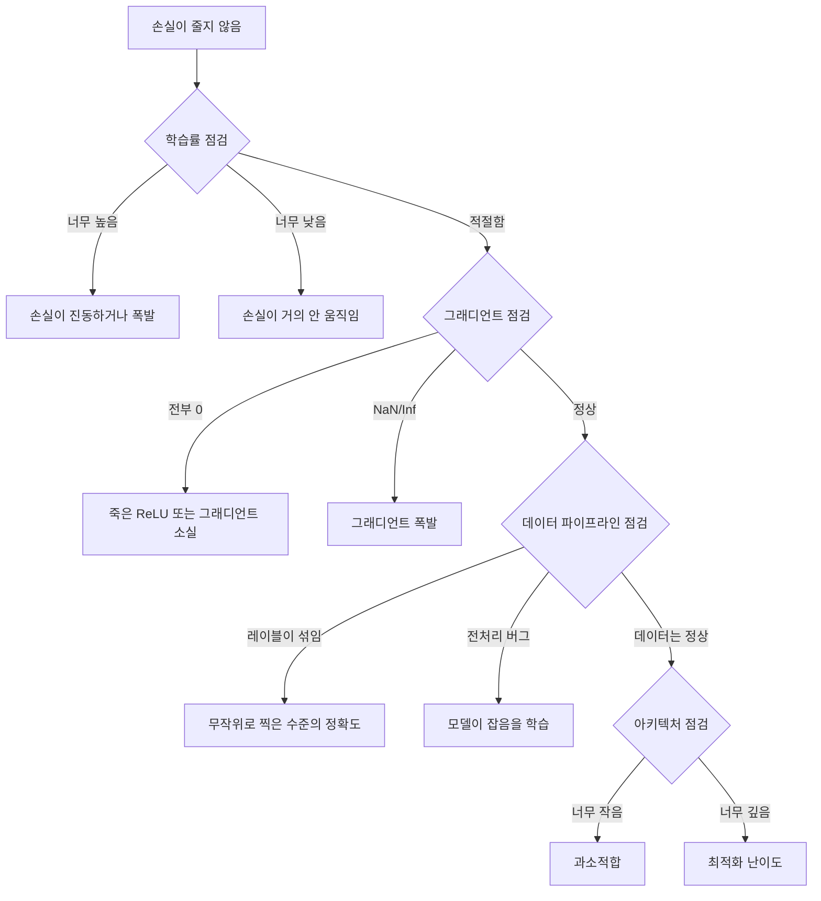
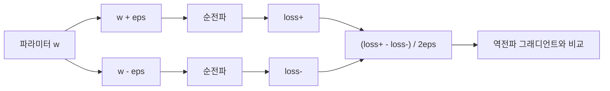
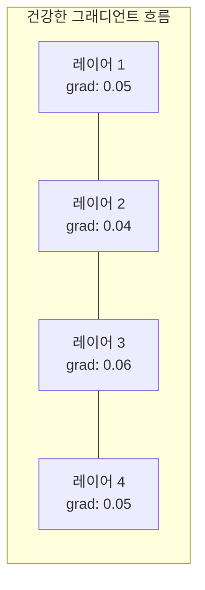
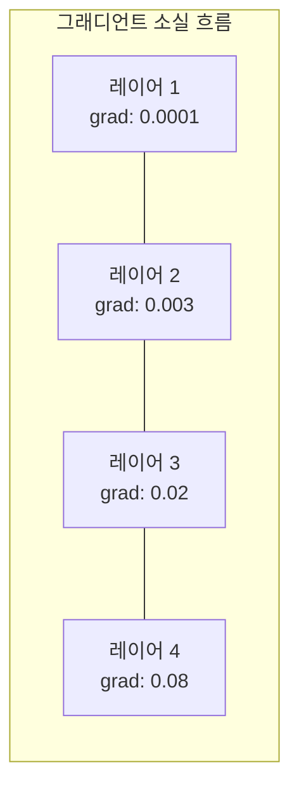
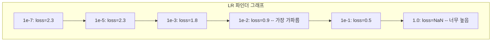

> 🇰🇷 이 문서는 한국어 번역본입니다(ELI5 스타일). 원문: [en.md](en.md)

# 신경망 디버깅

> 네트워크가 컴파일됐습니다. 실행됐습니다. 숫자 하나를 뱉었습니다. 그 숫자가 틀렸는데 아무것도 터지지 않았습니다. 여기가 가장 어려운 종류의 디버깅, 오류 메시지조차 없는 디버깅의 세계입니다.

**유형:** Build
**사용 언어:** Python, PyTorch
**선수 지식:** 페이즈 03 레슨 01-10 (특히 역전파, 손실 함수, 옵티마이저)
**시간:** 약 90분

## 학습 목표

- 체계적인 디버깅 전략을 써서 흔한 신경망 실패(NaN 손실, 평평한 손실 곡선, 과적합, 진동)를 진단합니다
- "배치 하나 과적합(overfit one batch)" 기법으로 모델 아키텍처와 학습 루프가 올바른지 검증합니다
- 그래디언트 크기, 활성화 분포, 가중치 노름을 들여다보며 그래디언트 소실/폭발 문제를 찾아냅니다
- 데이터 파이프라인, 모델 아키텍처, 손실 함수, 옵티마이저, 학습률 문제를 아우르는 디버깅 체크리스트를 만듭니다

## 문제 상황

전통적인 소프트웨어는 고장 나면 죽습니다. 널 포인터는 예외를 던지고, 타입 불일치는 컴파일 시점에 실패하고, 한 칸 어긋난(off-by-one) 오류는 명백히 틀린 출력을 냅니다.

신경망은 그런 사치를 주지 않습니다.

고장 난 신경망도 끝까지 실행되고, 손실 값을 출력하고, 예측을 냅니다. 손실은 줄어들 수 있고, 예측은 그럴듯해 보일 수 있습니다. 하지만 모델은 조용히 틀려 있습니다 — 지름길을 배우거나, 잡음을 외우거나, 쓸모없는 국소 최솟값으로 수렴하고 있죠. 구글 연구자들은 ML 디버깅 시간의 60~70%가 오류를 내지 않으면서 모델 품질을 떨어뜨리는 "조용한(silent)" 버그에 쓰인다고 추정했습니다.

잘 동작하는 모델과 고장 난 모델의 차이는 대개 단 한 줄의 잘못 배치된 코드입니다: 빠진 `zero_grad()` 하나, 뒤바뀐 차원 하나, 10배 어긋난 학습률 하나. 고전인 "Recipe for Training Neural Networks"(2019)는 이렇게 시작합니다: "신경망에서 가장 흔한 실수는 충돌하지 않는 버그다."

이 레슨은 그런 버그를 찾는 법을 가르칩니다.

## 핵심 개념

### 디버깅 마인드셋

찍어 보고 기도하는(print-and-pray) 디버깅은 잊으세요. 신경망 디버깅에는 체계적인 접근이 필요합니다. 피드백 루프가 느리고(학습 한 번에 몇 분에서 몇 시간) 증상이 모호하기 때문입니다(손실이 나쁜 것만으로 20가지 원인이 가능합니다).

황금률: **단순하게 시작하고, 복잡한 것은 한 번에 하나씩 더하고, 각 조각을 독립적으로 검증합니다.**



### 증상 1: 손실이 줄지 않음

가장 흔한 호소입니다. 학습 루프는 돌고, 에포크는 지나가는데, 손실은 그대로이거나 미친 듯이 진동합니다.

**잘못된 학습률.** 너무 높으면 손실이 진동하거나 NaN으로 뛰고, 너무 낮으면 줄어드는 속도가 너무 느려서 평평해 보입니다. Adam은 1e-3에서, SGD는 1e-1 또는 1e-2에서 시작하세요. 다른 원인이라고 결론 내리기 전에 10배씩 차이 나는 학습률 세 개(예: 1e-2, 1e-3, 1e-4)를 반드시 시도하세요.

**죽은 ReLU.** ReLU 뉴런이 큰 음수 입력을 받으면 0을 출력하고 그래디언트도 0이 됩니다. 다시는 활성화되지 않죠. 뉴런이 충분히 죽으면 네트워크는 학습할 수 없습니다. 점검법: 각 ReLU 레이어 뒤에서 정확히 0인 활성화의 비율을 출력해 보세요. 절반을 넘게 죽어 있으면 LeakyReLU로 바꾸거나 학습률을 낮추세요.

**그래디언트 소실.** sigmoid나 tanh 활성화를 쓰는 깊은 네트워크에서는 그래디언트가 뒤로 전파되며 지수적으로 줄어듭니다. 첫 번째 레이어에 도달할 무렵이면 거의 0입니다. 앞쪽 레이어들은 학습을 멈춥니다. 해결: ReLU/GELU를 쓰거나, 잔차 연결(residual connection)을 더하거나, 배치 정규화를 쓰세요.

**그래디언트 폭발.** 반대 문제입니다 — 그래디언트가 지수적으로 커집니다. RNN과 아주 깊은 네트워크에서 흔합니다. 손실이 NaN으로 뜁니다. 해결: 그래디언트 클리핑(`torch.nn.utils.clip_grad_norm_`), 학습률 낮추기, 또는 정규화 추가.

### 증상 2: 손실은 줄어드는데 모델이 나쁨

손실은 내려가고, 학습 정확도는 99%를 찍습니다. 그런데 테스트 정확도는 55%입니다. 아니면 실제 데이터에서 말이 안 되는 출력을 냅니다.

**과적합.** 모델이 패턴을 배우는 대신 학습 데이터를 외워 버립니다. 학습 손실과 검증 손실의 격차가 시간이 지나며 벌어집니다. 해결: 데이터 더 모으기, 드롭아웃, 가중치 감쇠, 조기 종료, 데이터 증강.

**데이터 누수.** 테스트 데이터가 학습에 새어 들어갔습니다. 정확도가 수상할 만큼 높습니다. 흔한 원인: 나누기 전에 섞기, 전체 데이터셋 통계로 전처리하기, 분할을 가로지르는 중복 샘플. 해결: 먼저 나누고, 그다음 전처리하고, 중복을 검사하세요.

**레이블 오류.** 대부분의 실제 데이터셋에서 레이블의 5~10%는 틀렸습니다(Northcutt 등, 2021 — "Pervasive Label Errors in Test Sets"). 모델은 잡음을 배웁니다. 해결: confident learning으로 잘못 레이블된 예제를 찾아 고치거나, 손실 절단(loss truncation)으로 손실이 큰 샘플을 무시하세요.

### 증상 3: 손실에 NaN 또는 Inf

손실 값이 `nan`이나 `inf`가 됩니다. 학습은 죽었습니다.

**학습률이 너무 높음.** 그래디언트 갱신이 너무 멀리 날아가 가중치가 폭발합니다. 해결: 10분의 1로 줄이세요.

**log(0) 또는 log(음수).** 교차 엔트로피 손실은 `log(p)`를 계산합니다. 모델이 정확히 0이나 음수 확률을 출력하면 log가 폭발합니다. 해결: 예측을 `[eps, 1-eps]`(단, `eps=1e-7`)로 잘라 두세요(clamp).

**0으로 나누기.** 배치 정규화는 표준편차로 나눕니다. 값이 전부 같은 배치는 std=0입니다. 해결: 분모에 엡실론을 더하세요(PyTorch는 기본으로 하지만, 직접 구현한 코드는 놓치기 쉽습니다).

**수치 오버플로.** 큰 활성화 값이 `exp()`에 들어가면 Inf가 나옵니다. 소프트맥스가 특히 취약합니다. 해결: 지수를 취하기 전에 최댓값을 빼세요(log-sum-exp 트릭).

### 기법 1: 그래디언트 검사(gradient checking)

해석적 그래디언트(역전파가 계산한 값)와 수치적 그래디언트(유한 차분으로 계산한 값)를 비교합니다. 둘이 어긋나면 역전파에 버그가 있는 겁니다.

파라미터 `w`의 수치적 그래디언트:

```
grad_numerical = (loss(w + eps) - loss(w - eps)) / (2 * eps)
```

일치도 지표(상대 차이):

```
rel_diff = |grad_analytical - grad_numerical| / max(|grad_analytical|, |grad_numerical|, 1e-8)
```

`rel_diff < 1e-5`면: 정상. `rel_diff > 1e-3`이면: 거의 확실히 버그입니다.



### 기법 2: 활성화 통계

학습 내내 각 레이어 뒤의 활성화 평균과 표준편차를 관찰하세요. 건강한 네트워크는 (정규화 이후) 평균이 0 근처, 표준편차가 1 근처인 활성화를 유지하거나, 최소한 경계 안에 갇혀 있습니다.

| 건강 상태 지표 | 평균 | 표준편차 | 진단 |
|-----------------|------|-----|-----------|
| 건강 | ~0 | ~1 | 네트워크가 정상적으로 학습 중 |
| 포화 | >>0 또는 <<0 | ~0 | 활성화가 극단값에 고착됨 |
| 죽음 | 0 | 0 | 뉴런이 죽음(전부 0) |
| 폭발 | >>10 | >>10 | 활성화가 경계 없이 커짐 |

### 기법 3: 그래디언트 흐름 시각화

레이어별 평균 그래디언트 크기를 그려 보세요. 건강한 네트워크라면 그래디언트 크기가 레이어들 사이에서 대체로 비슷해야 합니다. 앞쪽 레이어의 그래디언트가 뒤쪽보다 1000배 작다면 그래디언트 소실입니다.





### 기법 4: 배치 하나 과적합 테스트(overfit-one-batch)

딥러닝에서 가장 중요한 단 하나의 디버깅 기법입니다.

작은 배치 하나(8~32개 샘플)를 잡습니다. 그 배치로 100번 이상 반복 학습합니다. 손실은 거의 0으로 가고 학습 정확도는 100%를 찍어야 합니다. 그렇지 않다면 모델이나 학습 루프에 근본적인 버그가 있는 것입니다 — 본격 학습으로 넘어가지 마세요.

이 테스트가 잡아내는 것들:
- 망가진 손실 함수
- 망가진 역전파
- 데이터를 표현하기에 너무 작은 아키텍처
- 모델 파라미터와 연결되지 않은 옵티마이저
- 어긋난 데이터와 레이블

실행하는 데 30초 걸리고, 전체 학습을 디버깅하는 데 들일 몇 시간을 아껴 줍니다.

### 기법 5: 학습률 파인더(learning rate finder)

Leslie Smith(2017)가 제안한 방법으로, 학습률을 아주 작은 값(1e-7)부터 아주 큰 값(10)까지 한 에포크에 걸쳐 증가시키면서 손실을 기록합니다. 손실 대비 학습률 그래프를 그리면, 최적 학습률은 대략 손실이 가장 빠르게 줄어들기 시작하는 지점의 10분의 1입니다.



이 예에서 최적 학습률: 약 1e-3 (가장 가파른 지점보다 한 자릿수, 즉 10배 작은 값).

### 흔한 PyTorch 버그

PyTorch 커뮤니티 전체의 시간을 가장 많이 잡아먹는 버그들입니다:

| 버그 | 증상 | 해결 |
|-----|---------|-----|
| `optimizer.zero_grad()` 잊기 | 그래디언트가 배치마다 쌓임, 손실 진동 | `loss.backward()` 전에 `optimizer.zero_grad()` 추가 |
| 테스트 때 `model.eval()` 잊기 | 드롭아웃과 배치 정규화가 다르게 동작, 실행마다 테스트 정확도가 달라짐 | `model.eval()`과 `torch.no_grad()` 추가 |
| 잘못된 텐서 모양 | 조용한(silent) 브로드캐스팅이 틀린 결과를 냄, 오류 없음 | 디버깅 중에는 연산마다 모양 출력 |
| CPU/GPU 불일치 | `RuntimeError: expected CUDA tensor` | 모델과 데이터 모두에 `.to(device)` 적용 |
| 텐서 detach 누락 | 계산 그래프가 끝없이 커짐, OOM | `.detach()` 또는 `with torch.no_grad()` 사용 |
| in-place 연산이 autograd를 망가뜨림 | `RuntimeError: modified by in-place operation` | `x += 1`을 `x = x + 1`로 교체 |
| 데이터 정규화 안 함 | 손실이 무작위 찍기 수준에 고착 | 입력을 평균=0, 표준편차=1로 정규화 |
| 레이블 dtype 틀림 | 교차 엔트로피는 `Long`이 필요한데 `Float`이 들어옴 | 레이블 캐스팅: `labels.long()` |

### 종합 디버깅 표

| 증상 | 가능성 높은 원인 | 처음 시도할 것 |
|---------|-------------|-------------------|
| 손실이 -log(1/클래스 수)에 고착 | 모델이 균등 분포를 예측 중 | 데이터 파이프라인 점검, 레이블이 입력과 맞는지 확인 |
| 몇 단계 후 손실 NaN | 학습률이 너무 높음 | 학습률을 10분의 1로 |
| 즉시 손실 NaN | log(0) 또는 0으로 나누기 | log/나누기 연산에 엡실론 추가 |
| 손실이 크게 진동 | 학습률이 너무 높거나 배치가 너무 작음 | 학습률 낮추기, 배치 키우기 |
| 손실이 줄다가 정체 | 파인튜닝 단계에 학습률이 너무 높음 | 학습률 스케줄 추가(코사인 또는 계단식 감쇠) |
| 학습 정확도는 높고 테스트는 낮음 | 과적합 | 드롭아웃, 가중치 감쇠, 데이터 추가 |
| 학습 = 테스트 = 찍기 수준 | 모델이 아무것도 배우지 못함 | 배치 하나 과적합 테스트 실행 |
| 학습 = 테스트인데 둘 다 낮음 | 과소적합 | 더 큰 모델, 더 많은 레이어, 더 많은 특성(feature) |
| 그래디언트가 전부 0 | 죽은 ReLU 또는 떨어져 나간(detached) 계산 그래프 | LeakyReLU로 교체, `.requires_grad` 확인 |
| 학습 중 메모리 부족 | 배치가 너무 크거나 그래프가 해제되지 않음 | 배치 줄이기, 평가에는 `torch.no_grad()` 사용 |

```figure
learning-curves
```

## 만들어 보기

활성화, 그래디언트, 손실 곡선을 관찰하는 진단 도구 상자입니다. 여러분이 직접 네트워크를 일부러 망가뜨리고, 이 도구로 각 문제를 진단해 보게 됩니다.

### 단계 1: NetworkDebugger 클래스

PyTorch 모델에 훅(hook)을 걸어 레이어별 활성화·그래디언트 통계를 기록합니다.

```python
import torch
import torch.nn as nn
import math


class NetworkDebugger:
    def __init__(self, model):
        self.model = model
        self.activation_stats = {}
        self.gradient_stats = {}
        self.loss_history = []
        self.lr_losses = []
        self.hooks = []
        self._register_hooks()

    def _register_hooks(self):
        for name, module in self.model.named_modules():
            if isinstance(module, (nn.Linear, nn.Conv2d, nn.ReLU, nn.LeakyReLU)):
                hook = module.register_forward_hook(self._make_activation_hook(name))
                self.hooks.append(hook)
                hook = module.register_full_backward_hook(self._make_gradient_hook(name))
                self.hooks.append(hook)

    def _make_activation_hook(self, name):
        def hook(module, input, output):
            with torch.no_grad():
                out = output.detach().float()
                self.activation_stats[name] = {
                    "mean": out.mean().item(),
                    "std": out.std().item(),
                    "fraction_zero": (out == 0).float().mean().item(),
                    "min": out.min().item(),
                    "max": out.max().item(),
                }
        return hook

    def _make_gradient_hook(self, name):
        def hook(module, grad_input, grad_output):
            if grad_output[0] is not None:
                with torch.no_grad():
                    grad = grad_output[0].detach().float()
                    self.gradient_stats[name] = {
                        "mean": grad.mean().item(),
                        "std": grad.std().item(),
                        "abs_mean": grad.abs().mean().item(),
                        "max": grad.abs().max().item(),
                    }
        return hook

    def record_loss(self, loss_value):
        self.loss_history.append(loss_value)

    def check_loss_health(self):
        if len(self.loss_history) < 2:
            return "NOT_ENOUGH_DATA"
        recent = self.loss_history[-10:]
        if any(math.isnan(v) or math.isinf(v) for v in recent):
            return "NAN_OR_INF"
        if len(self.loss_history) >= 20:
            first_half = sum(self.loss_history[:10]) / 10
            second_half = sum(self.loss_history[-10:]) / 10
            if second_half >= first_half * 0.99:
                return "NOT_DECREASING"
        if len(recent) >= 5:
            diffs = [recent[i+1] - recent[i] for i in range(len(recent)-1)]
            if max(diffs) - min(diffs) > 2 * abs(sum(diffs) / len(diffs)):
                return "OSCILLATING"
        return "HEALTHY"

    def check_activations(self):
        issues = []
        for name, stats in self.activation_stats.items():
            if stats["fraction_zero"] > 0.5:
                issues.append(f"DEAD_NEURONS: {name} has {stats['fraction_zero']:.0%} zero activations")
            if abs(stats["mean"]) > 10:
                issues.append(f"EXPLODING_ACTIVATIONS: {name} mean={stats['mean']:.2f}")
            if stats["std"] < 1e-6:
                issues.append(f"COLLAPSED_ACTIVATIONS: {name} std={stats['std']:.2e}")
        return issues if issues else ["HEALTHY"]

    def check_gradients(self):
        issues = []
        grad_magnitudes = []
        for name, stats in self.gradient_stats.items():
            grad_magnitudes.append((name, stats["abs_mean"]))
            if stats["abs_mean"] < 1e-7:
                issues.append(f"VANISHING_GRADIENT: {name} abs_mean={stats['abs_mean']:.2e}")
            if stats["abs_mean"] > 100:
                issues.append(f"EXPLODING_GRADIENT: {name} abs_mean={stats['abs_mean']:.2e}")
        if len(grad_magnitudes) >= 2:
            first_mag = grad_magnitudes[0][1]
            last_mag = grad_magnitudes[-1][1]
            if last_mag > 0 and first_mag / last_mag > 100:
                issues.append(f"GRADIENT_RATIO: first/last = {first_mag/last_mag:.0f}x (vanishing)")
        return issues if issues else ["HEALTHY"]

    def print_report(self):
        print("\n=== NETWORK DEBUGGER REPORT ===")
        print(f"\nLoss health: {self.check_loss_health()}")
        if self.loss_history:
            print(f"  Last 5 losses: {[f'{v:.4f}' for v in self.loss_history[-5:]]}")
        print("\nActivation diagnostics:")
        for item in self.check_activations():
            print(f"  {item}")
        print("\nGradient diagnostics:")
        for item in self.check_gradients():
            print(f"  {item}")
        print("\nPer-layer activation stats:")
        for name, stats in self.activation_stats.items():
            print(f"  {name}: mean={stats['mean']:.4f} std={stats['std']:.4f} zero={stats['fraction_zero']:.1%}")
        print("\nPer-layer gradient stats:")
        for name, stats in self.gradient_stats.items():
            print(f"  {name}: abs_mean={stats['abs_mean']:.2e} max={stats['max']:.2e}")

    def remove_hooks(self):
        for hook in self.hooks:
            hook.remove()
        self.hooks.clear()
```

### 단계 2: 배치 하나 과적합 테스트

```python
def overfit_one_batch(model, x_batch, y_batch, criterion, lr=0.01, steps=200):
    optimizer = torch.optim.Adam(model.parameters(), lr=lr)
    model.train()
    print("\n=== OVERFIT ONE BATCH TEST ===")
    print(f"Batch size: {x_batch.shape[0]}, Steps: {steps}")

    for step in range(steps):
        optimizer.zero_grad()
        output = model(x_batch)
        loss = criterion(output, y_batch)
        loss.backward()
        optimizer.step()

        if step % 50 == 0 or step == steps - 1:
            with torch.no_grad():
                preds = (output > 0).float() if output.shape[-1] == 1 else output.argmax(dim=1)
                targets = y_batch if y_batch.dim() == 1 else y_batch.squeeze()
                acc = (preds.squeeze() == targets).float().mean().item()
            print(f"  Step {step:3d} | Loss: {loss.item():.6f} | Accuracy: {acc:.1%}")

    final_loss = loss.item()
    if final_loss > 0.1:
        print(f"\n  FAIL: Loss did not converge ({final_loss:.4f}). Model or training loop is broken.")
        return False
    print(f"\n  PASS: Loss converged to {final_loss:.6f}")
    return True
```

### 단계 3: 학습률 파인더

```python
def find_learning_rate(model, x_data, y_data, criterion, start_lr=1e-7, end_lr=10, steps=100):
    import copy
    original_state = copy.deepcopy(model.state_dict())
    optimizer = torch.optim.SGD(model.parameters(), lr=start_lr)
    lr_mult = (end_lr / start_lr) ** (1 / steps)

    model.train()
    results = []
    best_loss = float("inf")
    current_lr = start_lr

    print("\n=== LEARNING RATE FINDER ===")

    for step in range(steps):
        optimizer.zero_grad()
        output = model(x_data)
        loss = criterion(output, y_data)

        if math.isnan(loss.item()) or loss.item() > best_loss * 10:
            break

        best_loss = min(best_loss, loss.item())
        results.append((current_lr, loss.item()))

        loss.backward()
        optimizer.step()

        current_lr *= lr_mult
        for param_group in optimizer.param_groups:
            param_group["lr"] = current_lr

    model.load_state_dict(original_state)

    if len(results) < 10:
        print("  Could not complete LR sweep -- loss diverged too quickly")
        return results

    min_loss_idx = min(range(len(results)), key=lambda i: results[i][1])
    suggested_lr = results[max(0, min_loss_idx - 10)][0]

    print(f"  Swept {len(results)} steps from {start_lr:.0e} to {results[-1][0]:.0e}")
    print(f"  Minimum loss {results[min_loss_idx][1]:.4f} at lr={results[min_loss_idx][0]:.2e}")
    print(f"  Suggested learning rate: {suggested_lr:.2e}")

    return results
```

### 단계 4: 그래디언트 검사기

```python
def _flat_to_multi_index(flat_idx, shape):
    multi_idx = []
    remaining = flat_idx
    for dim in reversed(shape):
        multi_idx.insert(0, remaining % dim)
        remaining //= dim
    return tuple(multi_idx)


def gradient_check(model, x, y, criterion, eps=1e-4):
    model.train()
    x_double = x.double()
    y_double = y.double()
    model_double = model.double()

    print("\n=== GRADIENT CHECK ===")
    overall_max_diff = 0
    checked = 0

    for name, param in model_double.named_parameters():
        if not param.requires_grad:
            continue

        layer_max_diff = 0

        model_double.zero_grad()
        output = model_double(x_double)
        loss = criterion(output, y_double)
        loss.backward()
        analytical_grad = param.grad.clone()

        num_checks = min(5, param.numel())
        for i in range(num_checks):
            idx = _flat_to_multi_index(i, param.shape)
            original = param.data[idx].item()

            param.data[idx] = original + eps
            with torch.no_grad():
                loss_plus = criterion(model_double(x_double), y_double).item()

            param.data[idx] = original - eps
            with torch.no_grad():
                loss_minus = criterion(model_double(x_double), y_double).item()

            param.data[idx] = original

            numerical = (loss_plus - loss_minus) / (2 * eps)
            analytical = analytical_grad[idx].item()

            denom = max(abs(numerical), abs(analytical), 1e-8)
            rel_diff = abs(numerical - analytical) / denom

            layer_max_diff = max(layer_max_diff, rel_diff)
            checked += 1

        overall_max_diff = max(overall_max_diff, layer_max_diff)
        status = "OK" if layer_max_diff < 1e-5 else "MISMATCH"
        print(f"  {name}: max_rel_diff={layer_max_diff:.2e} [{status}]")

    model.float()

    print(f"\n  Checked {checked} parameters")
    if overall_max_diff < 1e-5:
        print("  PASS: Gradients match (rel_diff < 1e-5)")
    elif overall_max_diff < 1e-3:
        print("  WARN: Small differences (1e-5 < rel_diff < 1e-3)")
    else:
        print("  FAIL: Gradient mismatch detected (rel_diff > 1e-3)")
    return overall_max_diff
```

### 단계 5: 일부러 망가뜨린 네트워크들

이제 도구 상자를 망가진 네트워크에 적용해 하나씩 진단해 봅니다.

```python
def demo_broken_networks():
    torch.manual_seed(42)
    x = torch.randn(64, 10)
    y = (x[:, 0] > 0).long()

    print("\n" + "=" * 60)
    print("BUG 1: Learning rate too high (lr=10)")
    print("=" * 60)
    model1 = nn.Sequential(nn.Linear(10, 32), nn.ReLU(), nn.Linear(32, 2))
    debugger1 = NetworkDebugger(model1)
    optimizer1 = torch.optim.SGD(model1.parameters(), lr=10.0)
    criterion = nn.CrossEntropyLoss()
    for step in range(20):
        optimizer1.zero_grad()
        out = model1(x)
        loss = criterion(out, y)
        debugger1.record_loss(loss.item())
        loss.backward()
        optimizer1.step()
    debugger1.print_report()
    debugger1.remove_hooks()

    print("\n" + "=" * 60)
    print("BUG 2: Dead ReLUs from bad initialization")
    print("=" * 60)
    model2 = nn.Sequential(nn.Linear(10, 32), nn.ReLU(), nn.Linear(32, 32), nn.ReLU(), nn.Linear(32, 2))
    with torch.no_grad():
        for m in model2.modules():
            if isinstance(m, nn.Linear):
                m.weight.fill_(-1.0)
                m.bias.fill_(-5.0)
    debugger2 = NetworkDebugger(model2)
    optimizer2 = torch.optim.Adam(model2.parameters(), lr=1e-3)
    for step in range(50):
        optimizer2.zero_grad()
        out = model2(x)
        loss = criterion(out, y)
        debugger2.record_loss(loss.item())
        loss.backward()
        optimizer2.step()
    debugger2.print_report()
    debugger2.remove_hooks()

    print("\n" + "=" * 60)
    print("BUG 3: Missing zero_grad (gradients accumulate)")
    print("=" * 60)
    model3 = nn.Sequential(nn.Linear(10, 32), nn.ReLU(), nn.Linear(32, 2))
    debugger3 = NetworkDebugger(model3)
    optimizer3 = torch.optim.SGD(model3.parameters(), lr=0.01)
    for step in range(50):
        out = model3(x)
        loss = criterion(out, y)
        debugger3.record_loss(loss.item())
        loss.backward()
        optimizer3.step()
    debugger3.print_report()
    debugger3.remove_hooks()

    print("\n" + "=" * 60)
    print("HEALTHY NETWORK: Correct setup for comparison")
    print("=" * 60)
    model_good = nn.Sequential(nn.Linear(10, 32), nn.ReLU(), nn.Linear(32, 2))
    debugger_good = NetworkDebugger(model_good)
    optimizer_good = torch.optim.Adam(model_good.parameters(), lr=1e-3)
    for step in range(50):
        optimizer_good.zero_grad()
        out = model_good(x)
        loss = criterion(out, y)
        debugger_good.record_loss(loss.item())
        loss.backward()
        optimizer_good.step()
    debugger_good.print_report()
    debugger_good.remove_hooks()

    print("\n" + "=" * 60)
    print("OVERFIT-ONE-BATCH TEST (healthy model)")
    print("=" * 60)
    model_test = nn.Sequential(nn.Linear(10, 32), nn.ReLU(), nn.Linear(32, 2))
    overfit_one_batch(model_test, x[:8], y[:8], criterion)

    print("\n" + "=" * 60)
    print("LEARNING RATE FINDER")
    print("=" * 60)
    model_lr = nn.Sequential(nn.Linear(10, 32), nn.ReLU(), nn.Linear(32, 2))
    find_learning_rate(model_lr, x, y, criterion)

    print("\n" + "=" * 60)
    print("GRADIENT CHECK")
    print("=" * 60)
    model_grad = nn.Sequential(nn.Linear(10, 8), nn.ReLU(), nn.Linear(8, 2))
    gradient_check(model_grad, x[:4], y[:4], criterion)
```

## 활용하기

### PyTorch 내장 도구

```python
import torch
import torch.nn as nn

model = nn.Sequential(
    nn.Linear(768, 256),
    nn.ReLU(),
    nn.Linear(256, 10),
)

with torch.autograd.detect_anomaly():
    output = model(input_tensor)
    loss = criterion(output, target)
    loss.backward()

for name, param in model.named_parameters():
    if param.grad is not None:
        print(f"{name}: grad_mean={param.grad.abs().mean():.2e}")
```

### Weights & Biases 연동

```python
import wandb

wandb.init(project="debug-training")

for epoch in range(100):
    loss = train_one_epoch()
    wandb.log({
        "loss": loss,
        "lr": optimizer.param_groups[0]["lr"],
        "grad_norm": torch.nn.utils.clip_grad_norm_(model.parameters(), float("inf")),
    })

    for name, param in model.named_parameters():
        if param.grad is not None:
            wandb.log({f"grad/{name}": wandb.Histogram(param.grad.cpu().numpy())})
```

### TensorBoard

```python
from torch.utils.tensorboard import SummaryWriter

writer = SummaryWriter("runs/debug_experiment")

for epoch in range(100):
    loss = train_one_epoch()
    writer.add_scalar("Loss/train", loss, epoch)

    for name, param in model.named_parameters():
        writer.add_histogram(f"weights/{name}", param, epoch)
        if param.grad is not None:
            writer.add_histogram(f"gradients/{name}", param.grad, epoch)
```

### 디버그 체크리스트 (본격 학습 전에)

1. 배치 하나 과적합 테스트를 실행합니다. 실패하면 거기서 멈춥니다.
2. 모델 요약을 출력합니다 — 파라미터 수가 합리적인지 확인합니다.
3. 무작위 데이터로 순전파 한 번을 돌립니다 — 출력 모양을 확인합니다.
4. 5 에포크 학습합니다 — 손실이 줄어드는지 확인합니다.
5. 활성화 통계를 확인합니다 — 죽은 레이어도, 폭발도 없어야 합니다.
6. 그래디언트 흐름을 확인합니다 — 소실도, 폭발도 없어야 합니다.
7. 데이터 파이프라인을 검증합니다 — 레이블과 함께 무작위 샘플 5개를 출력합니다.

## 출시하기

이 레슨이 만드는 산출물:
- `outputs/prompt-nn-debugger.md` — 신경망 학습 실패를 진단하는 프롬프트
- `outputs/skill-debug-checklist.md` — 학습 문제를 디버깅하기 위한 의사 결정 트리 체크리스트

디버깅을 위한 핵심 배포 패턴:
- 프로덕션(운영 환경) 학습 스크립트에 모니터링 훅을 추가합니다
- N 단계마다 활성화·그래디언트 통계를 W&B나 TensorBoard에 기록합니다
- NaN 손실, 죽은 뉴런(0 비율 80% 초과), 그래디언트 폭발에 대한 자동 알림을 구현합니다
- 아키텍처나 데이터 파이프라인을 바꿀 때는 반드시 배치 하나 과적합 테스트를 실행합니다

## 연습 문제

1. **그래디언트 폭발 탐지기 추가.** `NetworkDebugger`를 고쳐 그래디언트가 임계값을 넘을 때 감지하고 그래디언트 클리핑 값을 자동으로 제안하게 만들어 보세요. 정규화가 전혀 없는 20층 네트워크에서 테스트해 보세요.

2. **죽은 뉴런 되살리기.** 죽은 ReLU 뉴런(항상 0을 출력)을 찾아내 그 입력 가중치를 Kaiming 초기화로 다시 초기화하는 함수를 작성해 보세요. 뉴런의 70%를 넘게 죽은 네트워크가 이 방법으로 회복됨을 보이세요.

3. **그래프 그리기 기능이 있는 학습률 파인더 구현.** `find_learning_rate`가 결과를 CSV로 저장하게 확장하고, 그 CSV를 읽어 matplotlib으로 학습률-손실 곡선을 그려 주는 별도 스크립트를 작성해 보세요. CIFAR-10에서 ResNet-18의 최적 학습률을 찾아 보세요.

4. **데이터 파이프라인 검증기 만들기.** 학습/테스트 분할을 가로지르는 중복 샘플, 레이블 분포 불균형(10:1을 넘는 비율), 입력 정규화 여부(평균 0 근처, 표준편차 1 근처), 데이터 속의 NaN/Inf 값을 검사하는 함수를 작성해 보세요. 일부러 오염시킨 데이터셋에서 실행해 보세요.

5. **실제 실패 디버깅.** 레슨 10의 미니 프레임워크를 가져와 미묘한 버그(예: backward에서 가중치 행렬을 전치)를 심고, 그래디언트 검사로 어떤 파라미터의 그래디언트가 틀렸는지 정확히 찾아내 보세요. 디버깅 과정을 기록으로 남기세요.

## 핵심 용어

| 용어 | 사람들이 말하는 것 | 실제 의미 |
|------|----------------|----------------------|
| 조용한 버그(silent bug) | "돌아가는데 결과가 나쁨" | 오류를 내지 않으면서 모델 품질을 떨어뜨리는 버그 — ML에서 가장 지배적인 실패 모드 |
| 죽은 ReLU | "뉴런이 죽었다" | 입력이 항상 음수라서 항상 0을 출력하고 영구히 그래디언트 0을 받는 ReLU 뉴런 |
| 그래디언트 소실 | "앞쪽 레이어가 학습을 멈춘다" | 그래디언트가 레이어를 거치며 지수적으로 줄어들어 앞쪽 가중치가 사실상 얼어 붙는 현상 |
| 그래디언트 폭발 | "손실이 NaN이 됐다" | 그래디언트가 레이어를 거치며 지수적으로 커져 가중치 갱신이 오버플로날 만큼 커지는 현상 |
| 그래디언트 검사 | "역전파가 맞는지 확인" | 역전파의 해석적 그래디언트와 유한 차분의 수치적 그래디언트를 비교하는 것 |
| 배치 하나 과적합 | "가장 중요한 디버그 테스트" | 모델이 학습할 수 '있는지' 검증하려고 작은 배치 하나로 학습해 보는 것 — 안 되면 근본적으로 뭔가 망가진 것 |
| 학습률 파인더 | "학습률을 훑어서 찾기" | 한 에포크에 걸쳐 학습률을 지수적으로 증가시키고, 손실이 발산하기 직전의 값을 고르는 것 |
| 데이터 누수 | "테스트 데이터가 학습에 샜다" | 테스트 셋의 정보가 학습을 오염시켜 비정상적으로 높은 정확도가 나오는 상황 |
| 활성화 통계 | "레이어 건강 상태 관찰" | 죽은/포화된/폭발하는 뉴런을 찾으려고 각 레이어 출력의 평균, 표준편차, 0 비율을 추적하는 것 |
| 그래디언트 클리핑 | "그래디언트 크기에 상한 두기" | 그래디언트 노름이 임계값을 넘으면 비례해 줄여 폭발적인 갱신을 막는 것 |

## 더 읽을거리

- Smith, "Cyclical Learning Rates for Training Neural Networks" (2017) — 학습률 범위 테스트(LR 파인더)를 소개한 논문
- Northcutt 등, "Pervasive Label Errors in Test Sets Destabilize Machine Learning Benchmarks" (2021) — ImageNet, CIFAR-10 등 주요 벤치마크의 레이블 3~6%가 틀렸음을 보인 논문
- Zhang 등, "Understanding Deep Learning Requires Rethinking Generalization" (2017) — 신경망이 무작위 레이블도 외울 수 있음을 보인 논문. 배치 하나 과적합 테스트가 동작하는 이유이기도 합니다
- `torch.autograd.detect_anomaly`와 `torch.autograd.set_detect_anomaly`에 대한 PyTorch 문서 — 내장 NaN/Inf 탐지 기능
