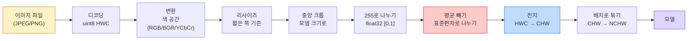
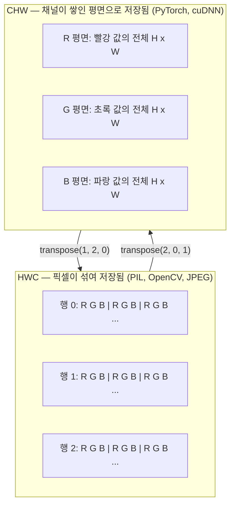

> 🇰🇷 이 문서는 한국어 번역본입니다(ELI5 스타일). 원문: [en.md](en.md)

# 이미지 기초 — 픽셀, 채널, 색 공간

> 이미지는 빛 샘플들의 텐서입니다. 여러분이 앞으로 쓸 모든 비전 모델은 이 한 가지 사실에서 출발합니다.

**유형:** Build
**사용 언어:** Python
**선수 지식:** 페이즈 1 레슨 12(텐서 연산), 페이즈 3 레슨 11(PyTorch 입문)
**시간:** 약 45분

## 학습 목표

- 연속적인 장면이 픽셀로 이산화되는 과정과, 샘플링/양자화 결정이 이후 모든 모델의 상한선을 정하는 이유를 설명합니다
- 이미지를 NumPy 배열로 읽고, 잘라내고(슬라이싱), 들여다보고, HWC와 CHW 레이아웃 사이를 자유롭게 오갑니다
- RGB, 그레이스케일, HSV, YCbCr 사이를 변환하고 각 색 공간이 왜 존재하는지 설명합니다
- 사전 학습된 PyTorch 비전 모델이 기대하는 그대로 픽셀 수준 전처리(정규화, 표준화, 리사이즈, 채널 우선 배치)를 적용합니다

## 문제 상황

여러분이 읽을 모든 논문, 내려받을 모든 사전 학습 가중치, 호출할 모든 비전 API는 입력의 특정 인코딩을 가정합니다. 모델이 `float32`를 원하는데 `uint8` 이미지를 넘겨도 그냥 돌아갑니다 — 그리고 조용히 엉터리 결과를 냅니다. RGB로 학습된 네트워크에 BGR을 먹이면 정확도가 10포인트나 무너집니다. 채널 우선(channels-first)을 기대하는 모델에 채널 마지막(channels-last) 입력을 주면 첫 번째 합성곱 레이어가 높이를 특성(feature) 채널로 취급합니다. 이 중 하나도 오류를 던지지 않습니다. 그저 지표를 망가뜨리고, 여러분은 파일을 불러오는 방식 속에 숨어 있는 버그를 일주일 내내 쫓아다니게 됩니다.

합성곱은 무엇 위를 미끄러지는지 알면 어렵지 않습니다. 어려운 점은 "이미지"라는 말이 카메라, JPEG 디코더, PIL, OpenCV, torchvision, CUDA 커널에게 각각 다르게 읽힌다는 것입니다. 스택마다 축 순서, 바이트 범위, 채널 관례이 다릅니다. 이것들을 구분하지 못하는 비전 엔지니어는 망가진 파이프라인을 그대로 출시해 버립니다.

이 레슨은 기초를 다져서 페이즈의 나머지가 그 위에 지어질 수 있게 합니다. 끝날 무렵이면 픽셀이 무엇인지, 픽셀당 숫자가 하나가 아니라 셋인 이유, "ImageNet 통계로 정규화"가 실제로 하는 일, 그리고 이 페이즈의 다른 모든 레슨이 가정할 두세 가지 레이아웃 사이를 오가는 법을 알게 됩니다.

## 핵심 개념

### 전체 전처리 파이프라인 한눈에 보기

모든 프로덕션(운영 환경) 비전 시스템은 되돌릴 수 있는 변환들의 같은 나열입니다. 한 단계라도 틀리면 모델은 학습 때와 다른 입력을 보게 됩니다.



빨간색과 파란색 상자 두 곳이 조용한 실패의 80%가 사는 곳입니다: 표준화 누락과 잘못된 레이아웃.

### 픽셀은 정사각형이 아니라 샘플이다

카메라 센서는 작은 감지기 격자 위에 떨어진 광자를 셉니다. 각 감지기는 찰나의 순간 동안 빛을 모아, 자기에게 부딪힌 광자 수에 비례하는 전압을 냅니다. 그런 다음 센서는 그 전압을 정수로 이산화합니다. 감지기 하나가 픽셀 하나가 됩니다.

```
Continuous scene                 Sensor grid                     Digital image
(infinite detail)                (H x W detectors)               (H x W integers)

    ~~~~~                        +--+--+--+--+--+                 210 198 180 155 120
   ~   ~   ~                     |  |  |  |  |  |                 205 195 178 152 118
  ~ light ~      ---->           +--+--+--+--+--+     ---->       200 190 175 150 115
   ~~~~~                         |  |  |  |  |  |                 195 185 170 148 112
                                 +--+--+--+--+--+                 188 180 165 145 108
```

이 단계에서 두 가지 선택이 이뤄지고, 이것들이 이후 모든 것의 상한선을 정합니다:

- **공간 샘플링**은 장면의 각도당 감지기 수를 정합니다. 너무 적으면 가장자리가 울퉁불퉁해지고(앨리어싱), 너무 많으면 저장과 연산이 폭발합니다.
- **강도 양자화**는 전압을 얼마나 잘게 구분할지 정합니다. 8비트는 256단계를 주며 디스플레이 표준입니다. 10, 12, 16비트는 더 매끄러운 그라데이션을 주며, 의료 영상, HDR, 센서 raw 파이프라인에서 중요합니다.

픽셀은 면적을 가진 색칠된 정사각형이 아닙니다. 하나의 측정값입니다. 리사이즈하거나 회전할 때 하는 일은 그 측정 격자를 다시 샘플링하는 것입니다.

### 채널이 셋인 이유

감지기 하나가 가시광선 전체 스펙트럼에 걸쳐 광자를 셉니다 — 이게 그레이스케일입니다. 색을 얻으려면 센서가 격자를 빨강, 초록, 파랑 필터의 모자이크로 덮습니다. 데모자이킹(demosaicing) 후에는 모든 공간 위치가 정수 셋을 갖습니다: 근처의 빨강 필터 감지기, 초록 필터 감지기, 파랑 필터 감지기의 반응입니다. 이 정수 셋이 픽셀의 RGB 삼중값입니다.

```
One pixel in memory:

    (R, G, B) = (210, 140, 30)   <- reddish-orange

An H x W RGB image:

    shape (H, W, 3)     stored as   H rows of W pixels of 3 values
                                    each in [0, 255] for uint8
```

셋이라는 숫자에 마법은 없습니다. 깊이 카메라는 Z 채널을 더하고, 인공위성은 적외선·자외선 밴드를 더합니다. 의료 스캔은 채널이 하나(X-ray, CT)이거나 여러 개(고스펙트럼)인 경우가 많습니다. 채널 수가 마지막 축이고, 합성곱 레이어는 그 축을 가로지르는 섞기를 학습합니다.

### 두 가지 레이아웃 관례: HWC와 CHW

같은 텐서, 두 가지 순서. 모든 라이브러리는 하나를 택합니다.

```
HWC (height, width, channels)           CHW (channels, height, width)

   W ->                                    H ->
  +-----+-----+-----+                     +-----+-----+
H |R G B|R G B|R G B|                   C |R R R R R R|
| +-----+-----+-----+                   | +-----+-----+
v |R G B|R G B|R G B|                   v |G G G G G G|
  +-----+-----+-----+                     +-----+-----+
                                          |B B B B B B|
                                          +-----+-----+

   PIL, OpenCV, matplotlib,              PyTorch, most deep learning
   almost every image file on disk       frameworks, cuDNN kernels
```

CHW가 존재하는 이유는 합성곱 커널이 H와 W를 가로질러 미끄러지기 때문입니다. 채널 축을 맨 앞에 두면 각 커널이 채널별로 연속된 2D 평면을 보게 되어 벡터화가 깔끔해집니다. 디스크 포맷은 HWC를 유지하는데, 센서에서 스캔라인이 나오는 방식과 맞기 때문입니다.

여러분이 천 번쯤 타이핑하게 될 한 줄 변환:

```
img_chw = img_hwc.transpose(2, 0, 1)      # NumPy
img_chw = img_hwc.permute(2, 0, 1)        # PyTorch 텐서
```

메모리 레이아웃, 시각화:



### 바이트 범위와 dtype

세 가지 관례이 주류입니다:

| 관례 | dtype | 범위 | 어디서 보나 |
|------------|-------|-------|------------------|
| 원본(raw) | `uint8` | [0, 255] | 디스크의 파일, PIL, OpenCV 출력 |
| 정규화 | `float32` | [0.0, 1.0] | `img.astype('float32') / 255` 이후 |
| 표준화 | `float32` | 대략 [-2, +2] | 평균을 빼고 표준편차로 나눈 이후 |

합성곱 신경망은 표준화된 입력으로 학습됐습니다. ImageNet 통계 `mean=[0.485, 0.456, 0.406]`, `std=[0.229, 0.224, 0.225]`는 ImageNet 학습셋 전체에서, [0, 1]로 정규화된 픽셀 기준으로 계산한 세 채널의 산술 평균과 표준편차입니다. 표준화된 float을 기대하는 모델에 원본 `uint8`을 먹이는 것이 응용 비전에서 가장 흔한 조용한 실패입니다.

### 색 공간과 그것이 존재하는 이유

RGB는 캡처 포맷이지만, 모델에 항상 가장 유용한 표현인 것은 아닙니다.

```
 RGB               HSV                       YCbCr / YUV

 R red             H hue (angle 0-360)       Y luminance (brightness)
 G green           S saturation (0-1)        Cb chroma blue-yellow
 B blue            V value/brightness (0-1)  Cr chroma red-green

 Linear to         Separates color from      Separates brightness from
 sensor output     brightness. Useful for    color. JPEG and most video
                   color thresholding, UI    codecs compress the chroma
                   sliders, simple filters   channels harder because the
                                             human eye is less sensitive
                                             to chroma detail than to Y.
```

요즘 대부분의 CNN에는 RGB를 먹입니다. 다른 색 공간을 만나는 경우는:

- **HSV** — 고전적인 컴퓨터 비전 코드, 색 기반 세그멘테이션, 화이트 밸런싱.
- **YCbCr** — JPEG 내부 들여다보기, 비디오 파이프라인, Y만 다루는 초해상도 모델.
- **그레이스케일** — OCR, 문서 모델, 색이 신호가 아니라 방해 변수인 모든 경우.

RGB에서 그레이스케일로 가는 것은 가중합이지 평균이 아닙니다. 사람 눈이 빨강이나 파랑보다 초록에 더 민감하기 때문입니다:

```
Y = 0.299 R + 0.587 G + 0.114 B       (ITU-R BT.601, 고전적인 가중치)
```

### 종횡비, 리사이즈, 보간

모든 모델은 입력 크기가 고정되어 있습니다(대부분의 ImageNet 분류기는 224x224, 요즘 검출기는 384x384 또는 512x512). 여러분의 이미지는 거의 맞지 않죠. 중요한 리사이즈 선택 세 가지:

- **짧은 쪽을 리사이즈한 뒤 중앙 크롭** — 표준 ImageNet 레시피입니다. 종횡비를 유지하지만 가장자리 픽셀 띠를 버립니다.
- **리사이즈 후 패딩** — 종횡비와 모든 픽셀을 유지하고 검은 띠를 더합니다. 검출과 OCR의 표준입니다.
- **목표 크기로 바로 리사이즈** — 이미지를 늘립니다. 저렴하지만 기하학이 왜곡됩니다. 많은 분류 과제에서는 괜찮습니다.

보간 방법은 새 격자가 옛 격자와 맞지 않을 때 중간 픽셀을 어떻게 계산할지 정합니다:

```
Nearest neighbour     fastest, blocky, only choice for masks/labels
Bilinear              fast, smooth, default for most image resizing
Bicubic               slower, sharper on upscaling
Lanczos               slowest, best quality, used for final display
```

경험칙: 학습에는 바이리니어, 사람이 볼 산출물에는 바이큐빅이나 lanczos, 정수 클래스 ID가 들어 있는 것에는 최근접.

```figure
conv-output-size
```

## 만들어 보기

### 단계 1: 이미지 텐서를 만들고 모양 들여다보기

결정론적인 합성 이미지부터 시작합니다. 그래야 첫 실습이 NumPy만으로 오프라인에서 돌아갑니다. 파일 디코딩은 별도의 경계입니다: JPEG이나 PNG 디코더가 RGB 바이트를 돌려주고 나면, 아래의 모든 텐서 연산은 동일합니다.

```python
import numpy as np

def synthetic_rgb(h=128, w=192, seed=0):
    rng = np.random.default_rng(seed)
    yy, xx = np.meshgrid(np.linspace(0, 1, h), np.linspace(0, 1, w), indexing="ij")
    r = (np.sin(xx * 6) * 0.5 + 0.5) * 255
    g = yy * 255
    b = (1 - yy) * xx * 255
    rgb = np.stack([r, g, b], axis=-1) + rng.normal(0, 6, (h, w, 3))
    return np.clip(rgb, 0, 255).astype(np.uint8)

arr = synthetic_rgb()

print(f"type:   {type(arr).__name__}")
print(f"dtype:  {arr.dtype}")
print(f"shape:  {arr.shape}     # (H, W, C)")
print(f"min:    {arr.min()}")
print(f"max:    {arr.max()}")
print(f"pixel at (0, 0): {arr[0, 0]}")
```

예상 출력: `shape: (H, W, 3)`, `dtype: uint8`, 범위 `[0, 255]`. 바이트가 카메라에서 왔든, 이미지 디코더에서 왔든, 이 합성 생성기에서 왔든, 이것이 표준적인 디코딩 표현입니다.

### 단계 2: 채널 분리와 레이아웃 재배치

R, G, B를 따로 뽑아 낸 뒤, PyTorch용으로 HWC에서 CHW로 바꿉니다.

```python
R = arr[:, :, 0]
G = arr[:, :, 1]
B = arr[:, :, 2]
print(f"R shape: {R.shape}, mean: {R.mean():.1f}")
print(f"G shape: {G.shape}, mean: {G.mean():.1f}")
print(f"B shape: {B.shape}, mean: {B.mean():.1f}")

arr_chw = arr.transpose(2, 0, 1)
print(f"\nHWC shape: {arr.shape}")
print(f"CHW shape: {arr_chw.shape}")
```

채널마다 하나씩, 그레이스케일 평면 세 개입니다. CHW는 축 순서만 바꿉니다. 메모리 레이아웃이 허락하면 데이터 복사는 엄밀히는 필요 없습니다.

### 단계 3: 그레이스케일과 HSV 변환

가중합 그레이스케일, 그다음 손으로 짠 RGB-to-HSV입니다.

```python
def rgb_to_grayscale(rgb):
    weights = np.array([0.299, 0.587, 0.114], dtype=np.float32)
    return (rgb.astype(np.float32) @ weights).astype(np.uint8)

def rgb_to_hsv(rgb):
    rgb_f = rgb.astype(np.float32) / 255.0
    r, g, b = rgb_f[..., 0], rgb_f[..., 1], rgb_f[..., 2]
    cmax = np.max(rgb_f, axis=-1)
    cmin = np.min(rgb_f, axis=-1)
    delta = cmax - cmin

    h = np.zeros_like(cmax)
    mask = delta > 0
    argmax = np.argmax(rgb_f, axis=-1)
    rmax = mask & (argmax == 0)
    gmax = mask & (argmax == 1)
    bmax = mask & (argmax == 2)
    h[rmax] = ((g[rmax] - b[rmax]) / delta[rmax]) % 6
    h[gmax] = ((b[gmax] - r[gmax]) / delta[gmax]) + 2
    h[bmax] = ((r[bmax] - g[bmax]) / delta[bmax]) + 4
    h = h * 60.0

    s = np.divide(delta, cmax, out=np.zeros_like(delta), where=cmax > 0)
    v = cmax
    return np.stack([h, s, v], axis=-1)

gray = rgb_to_grayscale(arr)
hsv = rgb_to_hsv(arr)
print(f"gray shape: {gray.shape}, range: [{gray.min()}, {gray.max()}]")
print(f"hsv   shape: {hsv.shape}")
print(f"hue range: [{hsv[..., 0].min():.1f}, {hsv[..., 0].max():.1f}] degrees")
print(f"sat range: [{hsv[..., 1].min():.2f}, {hsv[..., 1].max():.2f}]")
print(f"val range: [{hsv[..., 2].min():.2f}, {hsv[..., 2].max():.2f}]")
```

색상(hue)은 도(degree) 단위로, 채도와 명도는 [0, 1] 범위로 나옵니다. OpenCV의 `hsv_full` 관례와 일치합니다.

### 단계 4: 정규화, 표준화, 그리고 되돌리기

원본 바이트에서 사전 학습된 ImageNet 모델이 기대하는 정확한 텐서로 갔다가, 다시 되돌아옵니다.

```python
mean = np.array([0.485, 0.456, 0.406], dtype=np.float32)
std = np.array([0.229, 0.224, 0.225], dtype=np.float32)

def preprocess_imagenet(rgb_uint8):
    x = rgb_uint8.astype(np.float32) / 255.0
    x = (x - mean) / std
    x = x.transpose(2, 0, 1)
    return x

def deprocess_imagenet(chw_float32):
    x = chw_float32.transpose(1, 2, 0)
    x = x * std + mean
    x = np.clip(x * 255.0, 0, 255).astype(np.uint8)
    return x

x = preprocess_imagenet(arr)
print(f"preprocessed shape: {x.shape}     # (C, H, W)")
print(f"preprocessed dtype: {x.dtype}")
print(f"preprocessed mean per channel:  {x.mean(axis=(1, 2)).round(3)}")
print(f"preprocessed std  per channel:  {x.std(axis=(1, 2)).round(3)}")

roundtrip = deprocess_imagenet(x)
max_diff = np.abs(roundtrip.astype(int) - arr.astype(int)).max()
print(f"roundtrip max pixel diff: {max_diff}    # should be 0 or 1")
```

채널별 평균은 0에 가깝고, 표준편차는 1에 가까워야 합니다. 이 preprocess/deprocess 쌍이 바로 torchvision의 `transforms.Normalize` 호출이 내부에서 하는 일 그 자체입니다.

### 단계 5: 밑바닥부터 리사이즈

최근접 이웃은 각 출력 좌표를 소스 픽셀 하나로 반올림합니다. 바이리니어 보간은 둘러싼 네 픽셀을 찾아 거리로 섞습니다. 아래 두 구현은 끝점 정렬 좌표를 써서 첫 소스 픽셀과 마지막 소스 픽셀이 고정되어 있습니다.

```python
def resize_coordinates(source_length, target_length):
    if target_length == 1:
        return np.zeros(1, dtype=np.float32)
    return np.linspace(0, source_length - 1, target_length, dtype=np.float32)

def nearest_resize(image, target_height, target_width):
    y = np.rint(resize_coordinates(image.shape[0], target_height)).astype(int)
    x = np.rint(resize_coordinates(image.shape[1], target_width)).astype(int)
    return image[y[:, None], x[None, :]]

def bilinear_resize(image, target_height, target_width):
    y = resize_coordinates(image.shape[0], target_height)
    x = resize_coordinates(image.shape[1], target_width)
    y0 = np.floor(y).astype(int)
    x0 = np.floor(x).astype(int)
    y1 = np.minimum(y0 + 1, image.shape[0] - 1)
    x1 = np.minimum(x0 + 1, image.shape[1] - 1)
    wy = (y - y0)[:, None, None]
    wx = (x - x0)[None, :, None]

    source = image.astype(np.float32)
    top = source[y0[:, None], x0[None, :]] * (1 - wx)
    top += source[y0[:, None], x1[None, :]] * wx
    bottom = source[y1[:, None], x0[None, :]] * (1 - wx)
    bottom += source[y1[:, None], x1[None, :]] * wx
    result = top * (1 - wy) + bottom * wy
    return np.clip(np.rint(result), 0, 255).astype(image.dtype)

target_height = arr.shape[0] * 3
target_width = arr.shape[1] * 3
nearest = nearest_resize(arr, target_height, target_width)
bilinear = bilinear_resize(arr, target_height, target_width)

def local_roughness(x):
    gy = np.diff(x.astype(float), axis=0)
    gx = np.diff(x.astype(float), axis=1)
    return float(np.abs(gy).mean() + np.abs(gx).mean())

for name, out in [("nearest", nearest), ("bilinear", bilinear)]:
    print(f"{name:>8}  shape={out.shape}  roughness={local_roughness(out):6.2f}")
```

최근접은 가장자리를 그대로 유지하기 때문에 거칠기 점수가 가장 높습니다. 바이리니어는 새 픽셀마다 각 축에서 두 위치를 섞기 때문에 더 매끄럽습니다. 실행 가능한 동반 코드는 같은 분리 가능한 아이디어를 Catmull-Rom 3차 커널로 축당 네 이웃까지 확장한 뒤, 이미지 라이브러리 없이 세 결과를 모두 출력합니다.

## 활용하기

PyTorch는 같은 연산을 배치로 묶인, 장치를 인식하는 텐서에 대해 수행합니다. 아래 코드는 짧은 쪽을 리사이즈하고, 중앙 크롭을 하고, 각 채널을 표준화해서, 사전 학습된 모델이 기대하는 NCHW 텐서를 만듭니다.

```python
import torch
import torch.nn.functional as F

image_hwc = torch.from_numpy(synthetic_rgb(256, 320))
batch = image_hwc.permute(2, 0, 1).unsqueeze(0).float() / 255.0

height, width = batch.shape[-2:]
scale = 256 / min(height, width)
resized_height = round(height * scale)
resized_width = round(width * scale)
batch = F.interpolate(
    batch,
    size=(resized_height, resized_width),
    mode="bilinear",
    align_corners=False,
    antialias=True,
)

top = (resized_height - 224) // 2
left = (resized_width - 224) // 2
batch = batch[:, :, top:top + 224, left:left + 224]

mean = torch.tensor([0.485, 0.456, 0.406]).view(1, 3, 1, 1)
std = torch.tensor([0.229, 0.224, 0.225]).view(1, 3, 1, 1)
batch = (batch - mean) / std

print(f"tensor dtype: {batch.dtype}")
print(f"batched shape: {tuple(batch.shape)}")
print(f"per-channel mean: {batch.mean(dim=(0, 2, 3)).tolist()}")
print(f"per-channel std:  {batch.std(dim=(0, 2, 3)).tolist()}")
```

정확히 이 순서의 네 단계입니다: 바이트를 float으로 바꾸고 HWC를 NCHW로 바꾸기, 짧은 쪽을 256으로 리사이즈하기, 224x224 중앙 크롭, 그다음 ImageNet 평균을 빼고 표준편차로 나누기. 이 순서를 뒤바꾸면 모델에 도달하는 것이 조용히 달라집니다.

## 출시하기

이 레슨이 만드는 산출물:

- `outputs/prompt-vision-preprocessing-audit.md` — 모델 카드나 데이터셋 카드를, 팀이 반드시 지켜야 할 정확한 전처리 불변 조건의 체크리스트로 바꿔 주는 프롬프트.
- `outputs/skill-image-tensor-inspector.md` — 이미지 모양 텐서나 배열이 주어지면 dtype, 레이아웃, 범위, 그리고 원본/정규화/표준화 중 어느 상태인지 보고해 주는 스킬.

## 연습 문제

1. **(쉬움)** 서로 다른 네 가지 색을 가진 2x2 RGB `uint8` 배열을 만드세요. HWC를 CHW로 바꿨다가 되돌리고, 두 모양을 모두 출력하고, 왕복이 모든 값을 보존함을 증명하세요.
2. **(보통)** `standardize(img, mean, std)`와 그 역함수를 작성해서, 어떤 uint8 이미지에서든 `roundtrip_max_diff <= 1` 테스트를 통과하게 만드세요. 함수는 같은 호출로 HWC의 단일 이미지와 NCHW의 배치 양쪽에서 동작해야 합니다.
3. **(어려움)** 3채널 ImageNet 표준화 텐서를, RGB의 가중 혼합을 하나의 그레이스케일 채널로 만드는 1x1 합성곱에 통과시켜 보세요. 가중치를 `[0.299, 0.587, 0.114]`로 초기화하고 얼려(freeze) 두고, 출력이 직접 짠 `rgb_to_grayscale`과 부동소수점 오차 이내로 일치하는지 확인하세요. 어떤 고전적인 색 공간 변환을 1x1 합성곱으로 쓸 수 있을까요?

## 핵심 용어

| 용어 | 사람들이 말하는 것 | 실제 의미 |
|------|----------------|----------------------|
| 픽셀 | "색칠된 정사각형" | 격자 한 위치에서의 빛 강도 샘플 하나 — 색이면 숫자 셋, 그레이스케일이면 하나 |
| 채널 | "그 색" | 이미지 텐서에 쌓인 평행한 공간 격자 중 하나. HWC에서는 마지막 축, CHW에서는 첫 축 |
| HWC / CHW | "그 모양" | 이미지 텐서의 축 순서. 디스크와 PIL은 HWC, PyTorch와 cuDNN은 CHW |
| 정규화(normalize) | "이미지 크기 조절" | 255로 나눠 픽셀을 [0, 1]에 두는 것 — 필요하지만 충분하지는 않음 |
| 표준화(standardize) | "0을 중심으로" | 채널별로 평균을 빼고 표준편차로 나눠 입력 분포를 모델이 학습한 분포에 맞추는 것 |
| 그레이스케일 변환 | "채널 평균 내기" | 인간의 휘도 지각에 맞춘 0.299/0.587/0.114 계수의 가중합 |
| 보간 | "리사이즈가 픽셀 고르는 방식" | 새 격자가 옛 격자와 맞지 않을 때 출력 값을 정하는 규칙 — 레이블에는 최근접, 학습에는 바이리니어, 표시에는 바이큐빅 |
| 종횡비 | "가로 나누기 세로" | "리사이즈 후 패딩"과 "리사이즈 후 늘리기"를 구분하는 비율 |

## 더 읽을거리

- [Charles Poynton — A Guided Tour of Color Space](https://poynton.ca/PDFs/Guided_tour.pdf) — 색 공간이 왜 이렇게 많은지, 각각이 언제 중요한지에 관한 가장 명쾌한 기술적 설명
- [PyTorch Vision Transforms 문서](https://pytorch.org/vision/stable/transforms.html) — 프로덕션에서 실제로 조립하게 될 변환 파이프라인 전체
- [How JPEG Works (Colt McAnlis)](https://www.youtube.com/watch?v=F1kYBnY6mwg) — 색차 서브샘플링, DCT, 그리고 JPEG이 RGB가 아니라 YCbCr로 인코딩하는 이유에 대한 날카로운 시각적 투어
- [ImageNet 전처리 관례 (torchvision models)](https://pytorch.org/vision/stable/models.html) — `mean=[0.485, 0.456, 0.406]`의 공식 출처, 그리고 모델 동물원(zoo)의 모든 모델이 이 값을 기대하는 이유
