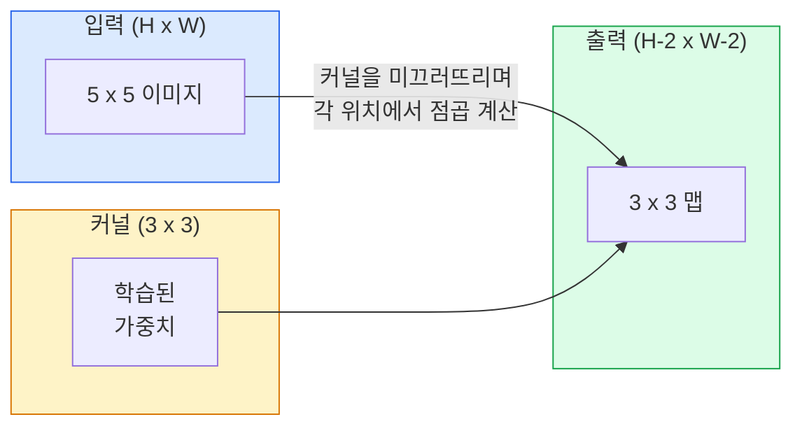
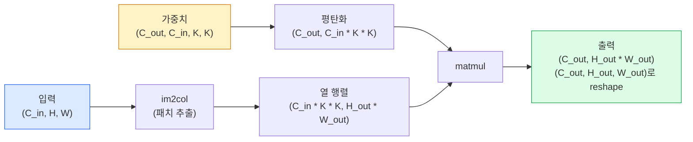

> 🇰🇷 이 문서는 한국어 번역본입니다(ELI5 스타일). 원문: [en.md](en.md)

# 밑바닥부터 만드는 합성곱

> 합성곱은 이미지 위를 미끄러뜨리며 모든 위치에서 같은 가중치를 공유하는, 아주 작은 밀집(dense) 레이어입니다.

**유형:** Build
**사용 언어:** Python
**선수 지식:** 페이즈 3(딥러닝 핵심), 페이즈 4 레슨 01(이미지 기초)
**시간:** 약 75분

## 학습 목표

- NumPy만으로 2D 합성곱을 밑바닥부터 구현합니다. 중첩 루프 버전과 벡터화된 `im2col` 버전 모두입니다
- 입력 크기, 커널 크기, 패딩, 스트라이드의 어떤 조합에서든 출력 공간 크기를 계산하고 `(H - K + 2P) / S + 1` 공식을 정당화합니다
- 커널(엣지, 블러, 샤픈, 소벨)을 손으로 설계하고 각각이 왜 그런 활성화 패턴을 만드는지 설명합니다
- 합성곱을 쌓아 특성 추출기(feature extractor)를 만들고, 쌓은 깊이와 수용 영역(receptive field) 크기를 연결합니다

## 문제 상황

224x224 RGB 이미지 위의 밀집(fully connected) 레이어는 뉴런 하나당 입력 가중치 224 * 224 * 3 = 150,528개가 필요합니다. 유닛 1,000개짜리 은닉층 하나면 벌써 파라미터 1억 5천만 개입니다 — 아직 유용한 걸 하나도 배우기 전에도요. 더 나쁜 것은, 그 레이어는 왼쪽 위의 개와 오른쪽 아래의 개가 같은 패턴이라는 생각이 없다는 점입니다. 모든 픽셀 위치를 독립적으로 취급하는데, 이미지에서는 이게 정확히 틀린 태도입니다. 고양이를 세 픽셀 옮겼다고 네트워크가 개념을 다시 배워야 해서는 안 되죠.

이미지 모델에 필요한 두 성질은 **이동 등변성(translation equivariance)**(입력이 이동하면 출력도 이동한다)과 **파라미터 공유**(같은 특성 검출기가 어디서든 돈다)입니다. 밀집 레이어는 둘 다 못 줍니다. 합성곱은 둘 다 공짜로 줍니다.

합성곱은 딥러닝을 위해 발명된 게 아닙니다. JPEG 압축, 포토샵의 가우시안 블러, 산업용 비전의 엣지 검출, 그리고 지금까지 나온 모든 오디오 필터를 떠받치는 바로 그 연산입니다. 2012년부터 2020년까지 ImageNet을 CNN이 지배한 이유는, 근처 값들이 서로 연관되고 같은 패턴이 어디서든 나타날 수 있는 데이터에는 합성곱이 옳은 사전 지식(prior)이기 때문입니다.

## 핵심 개념

### 커널 하나, 미끄러지다

2D 합성곱은 커널(또는 필터)이라 불리는 작은 가중치 행렬을 입력 위로 미끄러뜨리고, 각 위치에서 요소별 곱의 합을 계산합니다. 그 합이 출력 픽셀 하나가 됩니다.



5x5 입력에 대한 구체적인 3x3 예(패딩 없음, 스트라이드 1):

```
Input X (5 x 5):                Kernel W (3 x 3):

  1  2  0  1  2                   1  0 -1
  0  1  3  1  0                   2  0 -2
  2  1  0  2  1                   1  0 -1
  1  0  2  1  3
  2  1  1  0  1

커널이 유효한 모든 3 x 3 윈도우 위를 미끄러집니다. 출력 Y는 3 x 3입니다:

 Y[0,0] = sum( W * X[0:3, 0:3] )
 Y[0,1] = sum( W * X[0:3, 1:4] )
 Y[0,2] = sum( W * X[0:3, 2:5] )
 Y[1,0] = sum( W * X[1:4, 0:3] )
 ... 이런 식으로 계속
```

이 한 줄 공식 — **가중치 공유, 지역성, 슬라이딩 윈도우** — 가 아이디어의 전부입니다. 나머지는 장부 정리일 뿐입니다.

### 출력 크기 공식

입력 공간 크기 `H`, 커널 크기 `K`, 패딩 `P`, 스트라이드 `S`가 주어지면:

```
H_out = floor( (H - K + 2P) / S ) + 1
```

이걸 외우세요. 아키텍처 하나당 수십 번씩 계산하게 됩니다.

| 시나리오 | H | K | P | S | H_out |
|----------|---|---|---|---|-------|
| 패딩 없는 valid 합성곱 | 32 | 3 | 0 | 1 | 30 |
| same 합성곱 (크기 유지) | 32 | 3 | 1 | 1 | 32 |
| 절반으로 다운샘플 | 32 | 3 | 1 | 2 | 16 |
| 2x2 풀링 | 32 | 2 | 0 | 2 | 16 |
| 넓은 수용 영역 | 32 | 7 | 3 | 2 | 16 |

"same 패딩"은 S == 1일 때 H_out == H가 되도록 P를 고른다는 뜻입니다. 홀수 K에 대해서는 P = (K - 1) / 2입니다. 3x3 커널이 지배하는 이유가 바로 이것입니다 — 중심이 존재하는 가장 작은 홀수 커널이기 때문입니다.

### 패딩

패딩이 없으면 합성곱은 특성 맵을 계속 줄입니다. 20개를 쌓으면 224x224 이미지가 184x184가 됩니다. 그러면 가장자리에서 연산을 낭비하고, 모양이 서로 맞아야 하는 잔차 연결(residual connection)이 복잡해집니다.

```
Zero padding (P = 1) on a 5 x 5 input:

  0  0  0  0  0  0  0
  0  1  2  0  1  2  0
  0  0  1  3  1  0  0
  0  2  1  0  2  1  0       이제 커널이 픽셀 (0, 0)을 중심에
  0  1  0  2  1  3  0       놓아도 곱할 세 행·세 열의 값이
  0  2  1  1  0  1  0       생깁니다.
  0  0  0  0  0  0  0
```

실전에서 만나는 모드들: `zero`(가장 흔함), `reflect`(가장자리를 거울처럼 반사. 생성 모델에서 딱딱한 경계를 피함), `replicate`(가장자리 복사), `circular`(둘레를 이어 붙임. 토러스 문제에 사용).

### 스트라이드

스트라이드는 미끄러짐의 보폭입니다. 기본값은 `stride=1`입니다. `stride=2`는 공간 차원을 절반으로 만들며, 별도의 풀링 레이어 없이 CNN 내부에서 다운샘플하는 고전적인 방법입니다 — 요즘 아키텍처(ResNet, ConvNeXt, MobileNet)는 어딘가에서 max-pool 대신 strided 합성곱을 씁니다.

```
Stride 1 on a 5 x 5 input, 3 x 3 kernel:

  starts: (0,0) (0,1) (0,2)        -> 출력 행 0
          (1,0) (1,1) (1,2)        -> 출력 행 1
          (2,0) (2,1) (2,2)        -> 출력 행 2

  출력: 3 x 3

같은 입력에 스트라이드 2:

  starts: (0,0) (0,2)              -> 출력 행 0
          (2,0) (2,2)              -> 출력 행 1

  출력: 2 x 2
```

### 여러 입력 채널

실제 이미지는 채널이 셋입니다. RGB 입력에 대한 3x3 합성곱은 실제로는 3x3x3 부피입니다. 입력 채널마다 3x3 슬라이스 하나씩 있고, 각 공간 위치에서 세 슬라이스 전체에 걸쳐 곱하고 더한 뒤 편향(bias)을 더합니다.

```
Input:   (C_in,  H,  W)        3 x 5 x 5
Kernel:  (C_in,  K,  K)        3 x 3 x 3 (one kernel)
Output:  (1,     H', W')       2D map

C_out개 출력 채널을 내는 레이어라면 커널을 C_out개 쌓습니다:

Weight:  (C_out, C_in, K, K)   e.g. 64 x 3 x 3 x 3
Output:  (C_out, H', W')       64 x 3 x 3

파라미터 수: C_out * C_in * K * K + C_out   (+ C_out은 편향)
```

모델을 설계할 때 계산하게 될 바로 그 마지막 줄입니다. 3채널 입력에 대한 64채널 3x3 합성곱은 `64 * 3 * 3 * 3 + 64 = 1,792`개의 파라미터를 가집니다. 저렴하죠.

### im2col 트릭

중첩 루프는 읽기 쉽지만 느립니다. GPU는 큰 행렬 곱을 원합니다. 트릭은 이것입니다: 입력의 모든 수용 영역 윈도우를 큰 행렬의 한 열로 펴고, 커널을 한 행으로 펴면, 합성곱 전체가 행렬 곱 하나가 됩니다.



모든 프로덕션 합성곱 구현은 이것의 변형에 캐시 타일링 트릭을 얹은 것입니다(직접 합성곱, Winograd, 큰 커널용 FFT 합성곱). im2col을 이해하면 핵심을 이해한 것입니다.

### 수용 영역(receptive field)

3x3 합성곱 하나는 입력 픽셀 9개를 봅니다. 3x3 합성곱 두 개를 쌓으면 두 번째 층의 뉴런이 5x5 입력 픽셀을 봅니다. 3x3 합성곱 셋이면 7x7입니다. 일반적으로:

```
RF after L stacked K x K convs (stride 1) = 1 + L * (K - 1)

스트라이드가 있으면:   수용 영역은 레이어마다 스트라이드와 함께 곱셈적으로 자란다.
```

"끝까지 3x3" 전략(VGG, ResNet, ConvNeXt)이 통하는 이유 전부가 여기 있습니다. 3x3 합성곱 두 개는 5x5 합성곱 하나와 같은 입력 영역을 보지만, 파라미터는 더 적고 사이에 비선형성이 하나 더 들어 있습니다.

```figure
convolution-kernel
```

## 만들어 보기

### 단계 1: 배열 패딩하기

가장 작은 부품부터 시작합니다. H x W 배열 주위를 0으로 채우는 함수입니다.

```python
import numpy as np

def pad2d(x, p):
    if p == 0:
        return x
    h, w = x.shape[-2:]
    out = np.zeros(x.shape[:-2] + (h + 2 * p, w + 2 * p), dtype=x.dtype)
    out[..., p:p + h, p:p + w] = x
    return out

x = np.arange(9).reshape(3, 3)
print(x)
print()
print(pad2d(x, 1))
```

뒤쪽 축만 보는 트릭 `x.shape[:-2]` 덕분에 같은 함수가 `(H, W)`, `(C, H, W)`, `(N, C, H, W)` 어디서든 수정 없이 동작합니다.

### 단계 2: 중첩 루프로 2D 합성곱

기준 구현입니다 — 느리지만 모호함이 없습니다. `torch.nn.functional.conv2d`가 원리적으로 하는 일이 바로 이것입니다.

```python
def conv2d_naive(x, w, b=None, stride=1, padding=0):
    c_in, h, w_in = x.shape
    c_out, c_in_w, kh, kw = w.shape
    assert c_in == c_in_w

    x_pad = pad2d(x, padding)
    h_out = (h + 2 * padding - kh) // stride + 1
    w_out = (w_in + 2 * padding - kw) // stride + 1

    out = np.zeros((c_out, h_out, w_out), dtype=np.float32)
    for oc in range(c_out):
        for i in range(h_out):
            for j in range(w_out):
                hs = i * stride
                ws = j * stride
                patch = x_pad[:, hs:hs + kh, ws:ws + kw]
                out[oc, i, j] = np.sum(patch * w[oc])
        if b is not None:
            out[oc] += b[oc]
    return out
```

네 겹의 중첩 루프입니다(출력 채널, 행, 열, 그리고 C_in, kh, kw에 걸친 암묵적 합). 이것이 여러분이 더 빠른 구현을 모두 검증할 때의 기준 진실(ground truth)입니다.

### 단계 3: 손으로 만든 커널로 검증하기

수직 소벨 커널을 만들고, 합성 계단 이미지에 적용해서 수직 엣지가 밝게 켜지는지 보세요.

```python
def synthetic_step_image():
    img = np.zeros((1, 16, 16), dtype=np.float32)
    img[:, :, 8:] = 1.0
    return img

sobel_x = np.array([
    [[-1, 0, 1],
     [-2, 0, 2],
     [-1, 0, 1]]
], dtype=np.float32)[None]

x = synthetic_step_image()
y = conv2d_naive(x, sobel_x, padding=1)
print(y[0].round(1))
```

7번 열(왼쪽에서 오른쪽으로 밝아지는 경계)에서 큰 양수가, 나머지에서는 0이 나올 겁니다. 이 한 줄 출력이 수학이 맞다는 확인 사항입니다.

### 단계 4: im2col

입력의 모든 커널 크기 윈도우를 행렬의 한 열로 바꿉니다. `C_in=3, K=3`이면 각 열은 숫자 27개입니다.

```python
def im2col(x, kh, kw, stride=1, padding=0):
    c_in, h, w = x.shape
    x_pad = pad2d(x, padding)
    h_out = (h + 2 * padding - kh) // stride + 1
    w_out = (w + 2 * padding - kw) // stride + 1

    cols = np.zeros((c_in * kh * kw, h_out * w_out), dtype=x.dtype)
    col = 0
    for i in range(h_out):
        for j in range(w_out):
            hs = i * stride
            ws = j * stride
            patch = x_pad[:, hs:hs + kh, ws:ws + kw]
            cols[:, col] = patch.reshape(-1)
            col += 1
    return cols, h_out, w_out
```

여전히 파이썬 루프이긴 하지만, 이제 무거운 일은 벡터화된 행렬 곱 하나가 맡습니다.

### 단계 5: im2col + matmul로 빠른 합성곱

네 겹 루프를 행렬 곱 하나로 바꿉니다.

```python
def conv2d_im2col(x, w, b=None, stride=1, padding=0):
    c_out, c_in, kh, kw = w.shape
    cols, h_out, w_out = im2col(x, kh, kw, stride, padding)
    w_flat = w.reshape(c_out, -1)
    out = w_flat @ cols
    if b is not None:
        out += b[:, None]
    return out.reshape(c_out, h_out, w_out)
```

정확성 검사: 두 구현을 모두 돌려 비교합니다.

```python
rng = np.random.default_rng(0)
x = rng.normal(0, 1, (3, 16, 16)).astype(np.float32)
w = rng.normal(0, 1, (8, 3, 3, 3)).astype(np.float32)
b = rng.normal(0, 1, (8,)).astype(np.float32)

y_naive = conv2d_naive(x, w, b, padding=1)
y_im2col = conv2d_im2col(x, w, b, padding=1)

print(f"max abs diff: {np.max(np.abs(y_naive - y_im2col)):.2e}")
```

`max abs diff`는 `1e-5` 근처여야 합니다 — 이 차이는 부동소수점 누적 순서 때문이지 버그가 아닙니다.

### 단계 6: 손으로 만든 커널 모음

어떤 학습도 하기 전에 합성곱 레이어 하나가 무엇을 표현할 수 있는지 보여 주는 다섯 필터입니다.

```python
KERNELS = {
    "identity": np.array([[0, 0, 0], [0, 1, 0], [0, 0, 0]], dtype=np.float32),
    "blur_3x3": np.ones((3, 3), dtype=np.float32) / 9.0,
    "sharpen": np.array([[0, -1, 0], [-1, 5, -1], [0, -1, 0]], dtype=np.float32),
    "sobel_x": np.array([[-1, 0, 1], [-2, 0, 2], [-1, 0, 1]], dtype=np.float32),
    "sobel_y": np.array([[-1, -2, -1], [0, 0, 0], [1, 2, 1]], dtype=np.float32),
}

def apply_kernel(img2d, kernel):
    x = img2d[None].astype(np.float32)
    w = kernel[None, None]
    return conv2d_im2col(x, w, padding=1)[0]
```

아무 그레이스케일 이미지에나 적용해 보면, blur는 부드럽게 하고, sharpen은 엣지를 선명하게 하고, Sobel-x는 수직 엣지를, Sobel-y는 수평 엣지를 밝힙니다. AlexNet과 VGG의 *첫* 학습된 합성곱 레이어가 결국 배운 패턴이 정확히 이것들입니다 — 나중에 어떤 과제가 오든 좋은 이미지 모델에는 엣지와 덩어리(blob) 검출기가 필요하기 때문입니다.

## 활용하기

PyTorch의 `nn.Conv2d`는 같은 연산을 autograd, CUDA 커널, cuDNN 최적화로 감싼 것입니다. 모양(셰이프) 의미는 동일합니다.

```python
import torch
import torch.nn as nn

conv = nn.Conv2d(in_channels=3, out_channels=64, kernel_size=3, stride=1, padding=1)
print(conv)
print(f"weight shape: {tuple(conv.weight.shape)}   # (C_out, C_in, K, K)")
print(f"bias shape:   {tuple(conv.bias.shape)}")
print(f"param count:  {sum(p.numel() for p in conv.parameters())}")

x = torch.randn(8, 3, 224, 224)
y = conv(x)
print(f"\ninput  shape: {tuple(x.shape)}")
print(f"output shape: {tuple(y.shape)}")
```

`padding=1`을 `padding=0`으로 바꾸면 출력이 222x222로 줄고, `stride=1`을 `stride=2`로 바꾸면 112x112로 줄어듭니다. 위에서 외운 그 공식 그대로입니다.

## 출시하기

이 레슨이 만드는 산출물:

- `outputs/prompt-cnn-architect.md` — 입력 크기, 파라미터 예산, 목표 수용 영역이 주어지면 매 단계에 알맞은 K/S/P를 가진 `Conv2d` 레이어 스택을 설계해 주는 프롬프트.
- `outputs/skill-conv-shape-calculator.md` — 네트워크 명세를 레이어별로 훑으면서 모든 블록의 출력 모양, 수용 영역, 파라미터 수를 돌려주는 스킬.

## 연습 문제

1. **(쉬움)** 128x128 그레이스케일 입력과 `[Conv3x3(s=1,p=1), Conv3x3(s=2,p=1), Conv3x3(s=1,p=1), Conv3x3(s=2,p=1)]` 스택이 주어졌을 때, 각 레이어의 출력 공간 크기와 수용 영역을 손으로 계산하세요. 더미 합성곱으로 만든 PyTorch `nn.Sequential`로 검증하세요.
2. **(보통)** `conv2d_naive`와 `conv2d_im2col`이 `groups` 인자를 받도록 확장하세요. `groups=C_in=C_out`이 depthwise 합성곱을 재현하고, 그 파라미터 수가 `C * C * K * K`가 아니라 `C * K * K`임을 보이세요.
3. **(어려움)** `conv2d_im2col`의 역전파를 손으로 구현하세요: 출력의 그래디언트가 주어지면 `x`와 `w`의 그래디언트를 계산합니다. 같은 입력과 가중치에 대해 `torch.autograd.grad`와 비교해 검증하세요. 트릭: im2col의 그래디언트는 `col2im`이며, 겹치는 윈도우들을 누적해야 합니다.

## 핵심 용어

| 용어 | 사람들이 말하는 것 | 실제 의미 |
|------|----------------|----------------------|
| 합성곱 | "필터를 미끄러뜨리기" | 공유된 가중치로 모든 공간 위치에 적용되는 학습 가능한 점곱. 수학적으로는 상관(cross-correlation)이지만 모두가 합성곱이라 부름 |
| 커널 / 필터 | "특성 검출기" | 모양이 (C_in, K, K)인 작은 가중치 텐서. 입력 윈도우와의 점곱이 출력 픽셀 하나가 됨 |
| 스트라이드 | "얼마나 점프하나" | 연달은 커널 위치 사이의 보폭. 스트라이드 2는 각 공간 차원을 절반으로 |
| 패딩 | "가장자리의 0들" | 커널이 경계 픽셀을 중심에 놓을 수 있도록 입력 주위에 더하는 값. `same` 패딩은 출력 크기를 입력과 같게 유지 |
| 수용 영역 | "뉴런이 보는 범위" | 특정 출력 활성화가 의존하는 원본 입력의 패치. 깊이와 스트라이드에 따라 커짐 |
| im2col | "GEMM 트릭" | 모든 수용 윈도우를 열로 재배열해 합성곱을 하나의 큰 행렬 곱으로 만드는 것 — 모든 빠른 conv 커널의 핵심 |
| depthwise 합성곱 | "채널당 커널 하나" | `groups == C_in`인 합성곱. 각 출력 채널을 자기 짝 입력 채널만으로 계산. MobileNet과 ConvNeXt의 척추 |
| 이동 등변성 | "밀면 밀린다" | 입력을 k픽셀 이동하면 출력도 k픽셀 이동하는 성질. 가중치 공유로 공짜로 얻음 |

## 더 읽을거리

- [A guide to convolution arithmetic for deep learning (Dumoulin & Visin, 2016)](https://arxiv.org/abs/1603.07285) — 모든 강의가 슬쩍 베끼는 패딩/스트라이드/확장(dilation) 다이어그램의 정본
- [CS231n: Convolutional Neural Networks for Visual Recognition](https://cs231n.github.io/convolutional-networks/) — 원조 강의 노트. im2col의 원조 설명도 여기 들어 있습니다
- [The Annotated ConvNet (fast.ai)](https://nbviewer.org/github/fastai/fastbook/blob/master/13_convolutions.ipynb) — 손으로 하는 합성곱부터 학습된 숫자 분류기까지 걸어가는 노트북
- [Receptive Field Arithmetic for CNNs (Dang Ha The Hien)](https://distill.pub/2019/computing-receptive-fields/) — 수용 영역 계산을 논문 수준으로 잘 만든 인터랙티브 설명
