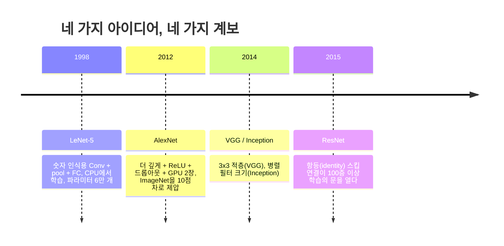
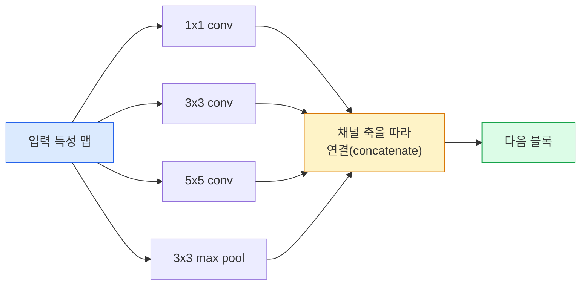
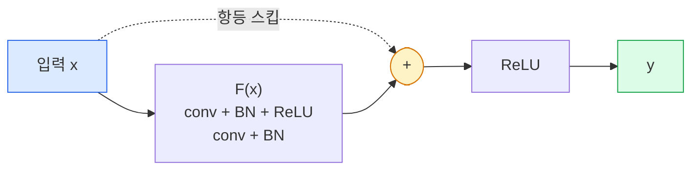

> 🇰🇷 이 문서는 한국어 번역본입니다(ELI5 스타일). 원문: [en.md](en.md)

# CNN — LeNet에서 ResNet까지

> 지난 30년 동안 나온 주요 CNN은 전부 '합성곱 – 비선형 활성 – 다운샘플링'이라는 같은 레시피에 새 아이디어를 하나씩 얹은 것에 지나지 않습니다. 그 아이디어를 순서대로 배워 봅시다.

**유형:** 학습 + 빌드
**언어:** Python
**선수 지식:** 페이즈 3 레슨 11(PyTorch), 페이즈 4 레슨 01(이미지 기초), 페이즈 4 레슨 02(밑바닥부터 만드는 합성곱)
**시간:** 약 75분

## 학습 목표

- LeNet-5 -> AlexNet -> VGG -> Inception -> ResNet으로 이어지는 아키텍처 계보를 따라가 보고, 각 계보가 기여한 '딱 하나'의 새 아이디어를 말할 수 있습니다
- LeNet-5, VGG 스타일 블록, ResNet BasicBlock을 PyTorch로 각각 40줄 안으로 구현합니다
- 잔차 연결(residual connection)이 어떻게 1,000층짜리 네트워크를 '학습 불가능' 상태에서 '최고 수준'으로 바꾸는지 설명합니다
- 모던 백본(ResNet-18, ResNet-50)을 읽고, 소스 코드를 보기 전에 출력 shape, 수용 영역(receptive field), 파라미터 수를 예측합니다

## 문제 상황

2011년 최고의 ImageNet 분류기는 top-5 정확도 약 74%를 기록했습니다. 2012년 AlexNet은 85%, 2015년 ResNet은 96%를 기록했습니다. 새로운 데이터도 없었고, 새로운 GPU 세대도 없었습니다. 그 향상은 전부 아키텍처 아이디어에서 나왔습니다. 실무 비전 엔지니어라면 어떤 아이디어가 어떤 논문에서 나왔는지 알아야 합니다. 2026년에 출시하는 프로덕션(운영 환경) 백본은 전부 그 조각들의 재조합이고, 그 아이디어들은 계속 다른 분야로 전이되고 있기 때문입니다. 그룹 합성곱(grouped conv)은 CNN에서 트랜스포머로, 잔차 연결은 ResNet에서 지금 존재하는 모든 LLM(대규모 언어 모델)으로, 배치 정규화는 확산(diffusion) 모델로 각각 전이되었습니다.

이 네트워크들을 순서대로 공부하면 흔한 실수도 예방할 수 있습니다: LeNet 크기의 네트워크로 충분한 문제에 가장 큰 모델을 가져다 쓰는 실수 말입니다. MNIST에는 ResNet이 필요 없습니다. 각 계보의 스케일링 곡선을 알면 그 곡선의 어느 지점에 자리 잡아야 하는지 알 수 있습니다.

## 개념

### 비전을 바꾼 네 가지 아이디어



고전 비전에서 이 네 번의 도약만큼 중요했던 것은 없습니다.

### LeNet-5 (1998)

얀 르쿤(Yann LeCun)의 숫자 인식기입니다. 파라미터 60,000개. conv-pool 블록 두 개, 완전 연결층 두 개, tanh 활성화. 오늘날 모든 CNN이 물려받은 템플릿을 여기서 정의했습니다:

```
input (1, 32, 32)
  conv 5x5 -> (6, 28, 28)
  avg pool 2x2 -> (6, 14, 14)
  conv 5x5 -> (16, 10, 10)
  avg pool 2x2 -> (16, 5, 5)
  flatten -> 400
  dense -> 120
  dense -> 84
  dense -> 10
```

오늘날 우리가 CNN이라 부르는 모든 것 — 합성곱과 다운샘플링을 번갈아 쌓아 작은 분류 헤드(head)로 보내는 구조 — 은 층을 더 붙이고 채널을 키우고 활성화만 개선한 LeNet입니다.

### AlexNet (2012)

ImageNet을 제압한 세 가지 변화:

1. **ReLU** — tanh 대신 사용. 그래디언트 소실이 멈추고 학습 속도가 6배 빨라집니다.
2. **드롭아웃** — 완전 연결 헤드에 적용. 정규화(regularization)가 별도의 트릭이 아니라 하나의 레이어가 됩니다.
3. **깊이와 폭** — 합성곱 5개층, dense 3개층, 파라미터 6,000만 개, 모델을 GPU 2장에 나눠 담아 학습.

논문의 Figure 2에는 지금도 GPU 2장에 나눈 두 스트림이 나란히 그려져 있습니다. 그 병렬화는 하드웨어 편법이지 아키텍처적 통찰은 아니었습니다 — 하지만 위의 세 아이디어는 여러분이 쓰는 모든 모델 안에 여전히 살아 있습니다.

### VGG (2014)

VGG가 던진 질문은 이것입니다: 3x3 합성곱만 쓰고 깊게 쌓으면 어떻게 될까?

```
stack:   conv 3x3 -> conv 3x3 -> pool 2x2
repeat:  합성곱 층 16개 또는 19개 반복
```

3x3 합성곱 두 개는 5x5 합성곱 하나와 같은 5x5 입력 영역을 보지만 파라미터는 더 적고(2*9*C^2 = 18C^2 vs 25*C^2), 그 사이에 ReLU가 하나 더 들어갑니다. VGG는 이 관찰을 아키텍처 전체로 만들었습니다. 블록 종류 하나를 반복하기만 한다는 그 단순함 덕분에 이후의 모든 모델의 기준점이 되었습니다.

대가: 파라미터 1억 3,800만 개, 학습이 느리고 추론 비용도 큽니다.

### Inception (2014, 같은 해)

"커널 크기는 뭘 써야 할까?"라는 질문에 구글이 내린 답: 전부 다, 병렬로.



각 브랜치는 맡은 일이 있습니다 — 1x1은 채널 믹싱, 3x3은 국소적 질감, 5x5는 더 큰 패턴, 풀링은 이동 불변(shift-invariant) 특성 — 그리고 concat 덕분에 다음 층이 유용한 브랜치를 골라 쓸 수 있습니다. Inception v1은 파라미터 수가 통제를 벗어나지 않도록 각 브랜치 안에 1x1 합성곱을 병목(bottleneck)으로 넣었습니다.

### 열화(degradation) 문제

2015년 무렵, VGG-19는 학습됐지만 VGG-32는 안 됐습니다. 깊이는 도움이 되어야 마땅한데, 약 20층을 넘어서자 학습 손실과 테스트 손실이 함께 나빠졌습니다. 이건 과적합(overfitting)이 아닙니다. 레이어를 지날 때마다 그래디언트가 곱셈적으로 줄어들어 옵티마이저가 쓸모 있는 가중치를 찾지 못하는 문제입니다.

```
일반적인 깊은 네트워크:
  y = f_L( f_{L-1}( ... f_1(x) ... ) )

초기 레이어에 대한 그래디언트:
  dL/dW_1 = dL/dy * df_L/df_{L-1} * ... * df_2/df_1 * df_1/dW_1

곱셈 항 하나하나의 크기는 대략 (가중치 크기) x (활성값 증폭 배율)입니다.
배율이 1보다 작은 항을 100개 쌓으면 그래디언트는 사실상 0이 됩니다.
```

VGG가 19층에서 동작한 것은 (동시에 발표된) 배치 정규화가 활성값 스케일을 잘 유지해 줬기 때문입니다. 하지만 배치 정규화조차 30층 남짓을 넘는 깊이는 구해내지 못했습니다.

### ResNet (2015)

He, Zhang, Ren, Sun이 모든 것을 고친 변경 하나를 제안했습니다:

```
표준 블록:   y = F(x)
잔차 블록:   y = F(x) + x
```

`+ x`가 있다는 것은 레이어가 `F(x)`를 0으로 만드는 방법으로 '아무것도 하지 않는' 선택을 언제든 할 수 있다는 뜻입니다. 이제 1,000층 ResNet은 기껏해야 1층 네트워크 정도로 나쁠 수밖에 없습니다. 블록마다 사소한 탈출구가 생기기 때문입니다. 이 보장이 있으면 옵티마이저는 모든 블록을 *조금씩* 쓸모 있게 만들려 들고, 조금 쓸모 있는 블록 100개가 쌓이면 그것이 곧 최고 수준이 됩니다.



이 블록의 두 변형이 어디에서나 등장합니다:

- **BasicBlock** (ResNet-18, ResNet-34): 3x3 conv 두 개, 둘을 건너뛰는 스킵.
- **Bottleneck** (ResNet-50, -101, -152): 1x1로 줄이고, 중간 3x3, 1x1로 되돌리고, 이 세 개를 건너뛰는 스킵. 채널 수가 많을 때 더 저렴합니다.

스킵이 다운샘플링(stride=2)을 건너야 할 때는 shape를 맞추기 위해 항등 경로를 stride=2인 1x1 conv로 대체합니다.

### 비전을 넘어 잔차가 중요한 이유

이 아이디어의 본질은 이미지 분류가 아니었습니다. 깊은 네트워크를 '그래디언트가 살아남기를 빌어야 하는 구조'에서 믿고 쓸 수 있고 확장 가능한 공학 도구로 바꾼 것입니다. 다음 페이즈에서 읽게 될 모든 트랜스포머의 모든 블록에는 똑같은 스킵 연결이 들어 있습니다. ResNet이 없었다면 GPT도 없었을 겁니다.

```figure
pooling
```

## 만들어 보기

### 단계 1: LeNet-5

최소한이면서 충실한 LeNet. tanh 활성화, 평균 풀링. 현대에 맞춘 유일한 양보는 원래의 Gaussian 연결 대신 `nn.CrossEntropyLoss`를 쓴다는 점입니다.

```python
import torch
import torch.nn as nn
import torch.nn.functional as F

class LeNet5(nn.Module):
    def __init__(self, num_classes=10):
        super().__init__()
        self.conv1 = nn.Conv2d(1, 6, kernel_size=5)
        self.conv2 = nn.Conv2d(6, 16, kernel_size=5)
        self.pool = nn.AvgPool2d(2)
        self.fc1 = nn.Linear(16 * 5 * 5, 120)
        self.fc2 = nn.Linear(120, 84)
        self.fc3 = nn.Linear(84, num_classes)

    def forward(self, x):
        x = self.pool(torch.tanh(self.conv1(x)))
        x = self.pool(torch.tanh(self.conv2(x)))
        x = torch.flatten(x, 1)
        x = torch.tanh(self.fc1(x))
        x = torch.tanh(self.fc2(x))
        return self.fc3(x)

net = LeNet5()
x = torch.randn(1, 1, 32, 32)
print(f"output: {net(x).shape}")
print(f"params: {sum(p.numel() for p in net.parameters()):,}")
```

실행 결과는 `output: torch.Size([1, 10])`, `params: 61,706`입니다. 모던 비전을 연 첫 숫자 분류기가 바로 이것, 이게 전부입니다.

### 단계 2: VGG 블록

재사용 가능한 블록 하나: 3x3 conv 두 개, ReLU, 배치 정규화, max pool.

```python
class VGGBlock(nn.Module):
    def __init__(self, in_c, out_c):
        super().__init__()
        self.conv1 = nn.Conv2d(in_c, out_c, kernel_size=3, padding=1)
        self.bn1 = nn.BatchNorm2d(out_c)
        self.conv2 = nn.Conv2d(out_c, out_c, kernel_size=3, padding=1)
        self.bn2 = nn.BatchNorm2d(out_c)
        self.pool = nn.MaxPool2d(2)

    def forward(self, x):
        x = F.relu(self.bn1(self.conv1(x)))
        x = F.relu(self.bn2(self.conv2(x)))
        return self.pool(x)

class MiniVGG(nn.Module):
    def __init__(self, num_classes=10):
        super().__init__()
        self.stack = nn.Sequential(
            VGGBlock(3, 32),
            VGGBlock(32, 64),
            VGGBlock(64, 128),
        )
        self.head = nn.Sequential(
            nn.AdaptiveAvgPool2d(1),
            nn.Flatten(),
            nn.Linear(128, num_classes),
        )

    def forward(self, x):
        return self.head(self.stack(x))

net = MiniVGG()
x = torch.randn(1, 3, 32, 32)
print(f"output: {net(x).shape}")
print(f"params: {sum(p.numel() for p in net.parameters()):,}")
```

CIFAR 크기 입력에 VGG 블록 세 개, 적응형 풀 하나, 선형 층 하나. 약 29만 파라미터. CIFAR-10에는 충분합니다.

### 단계 3: ResNet BasicBlock

ResNet-18과 ResNet-34의 핵심 빌딩 블록입니다.

```python
class BasicBlock(nn.Module):
    def __init__(self, in_c, out_c, stride=1):
        super().__init__()
        self.conv1 = nn.Conv2d(in_c, out_c, kernel_size=3, stride=stride, padding=1, bias=False)
        self.bn1 = nn.BatchNorm2d(out_c)
        self.conv2 = nn.Conv2d(out_c, out_c, kernel_size=3, stride=1, padding=1, bias=False)
        self.bn2 = nn.BatchNorm2d(out_c)
        if stride != 1 or in_c != out_c:
            self.shortcut = nn.Sequential(
                nn.Conv2d(in_c, out_c, kernel_size=1, stride=stride, bias=False),
                nn.BatchNorm2d(out_c),
            )
        else:
            self.shortcut = nn.Identity()

    def forward(self, x):
        out = F.relu(self.bn1(self.conv1(x)))
        out = self.bn2(self.conv2(out))
        out = out + self.shortcut(x)
        return F.relu(out)
```

합성곱 층의 `bias=False`는 배치 정규화 관례입니다 — BN의 beta 파라미터가 이미 편향 역할을 하므로 conv bias까지 들고 있으면 낭비입니다. `shortcut`은 stride나 채널 수가 바뀔 때만 실제 conv가 필요하고, 그렇지 않으면 아무것도 하지 않는 항등(identity)입니다.

### 단계 4: 아주 작은 ResNet

BasicBlock 네 그룹을 쌓아 CIFAR 크기 입력에서 동작하는 ResNet을 만듭니다.

```python
class TinyResNet(nn.Module):
    def __init__(self, num_classes=10):
        super().__init__()
        self.stem = nn.Sequential(
            nn.Conv2d(3, 32, kernel_size=3, stride=1, padding=1, bias=False),
            nn.BatchNorm2d(32),
            nn.ReLU(inplace=True),
        )
        self.layer1 = self._make_group(32, 32, num_blocks=2, stride=1)
        self.layer2 = self._make_group(32, 64, num_blocks=2, stride=2)
        self.layer3 = self._make_group(64, 128, num_blocks=2, stride=2)
        self.layer4 = self._make_group(128, 256, num_blocks=2, stride=2)
        self.head = nn.Sequential(
            nn.AdaptiveAvgPool2d(1),
            nn.Flatten(),
            nn.Linear(256, num_classes),
        )

    def _make_group(self, in_c, out_c, num_blocks, stride):
        blocks = [BasicBlock(in_c, out_c, stride=stride)]
        for _ in range(num_blocks - 1):
            blocks.append(BasicBlock(out_c, out_c, stride=1))
        return nn.Sequential(*blocks)

    def forward(self, x):
        x = self.stem(x)
        x = self.layer1(x)
        x = self.layer2(x)
        x = self.layer3(x)
        x = self.layer4(x)
        return self.head(x)

net = TinyResNet()
x = torch.randn(1, 3, 32, 32)
print(f"output: {net(x).shape}")
print(f"params: {sum(p.numel() for p in net.parameters()):,}")
```

블록 두 개짜리 그룹 네 개. 그룹 2, 3, 4의 시작에서 stride 2. 다운샘플링할 때마다 채널 수가 두 배. 대략 280만 파라미터. ResNet-152까지 깔끔하게 확장되는 표준 레시피가 바로 이것입니다.

### 단계 5: 파라미터 대비 특성 효율 비교

같은 입력을 세 네트워크에 모두 통과시키고 파라미터 수를 비교합니다.

```python
def summary(name, net, x):
    y = net(x)
    params = sum(p.numel() for p in net.parameters())
    print(f"{name:12s}  input {tuple(x.shape)} -> output {tuple(y.shape)}  params {params:>10,}")

x = torch.randn(1, 3, 32, 32)
summary("LeNet5",     LeNet5(),       torch.randn(1, 1, 32, 32))
summary("MiniVGG",    MiniVGG(),      x)
summary("TinyResNet", TinyResNet(),   x)
```

모델 셋, 시대 셋, 파라미터 수는 세 자릿수 차이입니다. CIFAR-10 정확도로는 대략 이렇습니다: LeNet 60%, MiniVGG 89%, TinyResNet 93% (몇 에포크 학습 후).

## 활용하기

`torchvision.models`는 위의 모든 모델을 사전학습된 버전으로 제공합니다. 호출 방법이 계열마다 똑같다는 것, 그게 바로 백본 추상화의 요점입니다.

```python
from torchvision.models import resnet18, ResNet18_Weights, vgg16, VGG16_Weights

r18 = resnet18(weights=ResNet18_Weights.IMAGENET1K_V1)
r18.eval()

print(f"ResNet-18 params: {sum(p.numel() for p in r18.parameters()):,}")
print(r18.layer1[0])
print()

v16 = vgg16(weights=VGG16_Weights.IMAGENET1K_V1)
v16.eval()
print(f"VGG-16   params: {sum(p.numel() for p in v16.parameters()):,}")
```

ResNet-18은 파라미터 1,170만 개. VGG-16은 1억 3,800만 개. ImageNet top-1 정확도는 비슷합니다(69.8% vs 71.6%). 잔차 연결은 12배의 파라미터 효율을 가져다줍니다. 2016년부터 2021년 ViT가 등장할 때까지 ResNet 변형들이 지배했고, 연산량이 제약인 실제 배포 환경에서는 지금도 지배적인 이유입니다.

전이 학습(transfer learning) 레시피는 언제나 같습니다: 사전학습 가중치를 불러오고, 백본을 프리즈(freeze, 얼리기)하고, 분류 헤드를 교체합니다.

```python
for p in r18.parameters():
    p.requires_grad = False
r18.fc = nn.Linear(r18.fc.in_features, 10)
```

세 줄입니다. 이제 ImageNet이 비용을 들여 학습한 표현(representation)을 물려받은 10클래스 CIFAR 분류기가 생겼습니다.

## 출시하기

이 레슨의 산출물:

- `outputs/prompt-backbone-selector.md` — 과제, 데이터셋 크기, 연산 예산을 보고 알맞은 CNN 계열(LeNet/VGG/ResNet/MobileNet/ConvNeXt)을 골라 주는 프롬프트.
- `outputs/skill-residual-block-reviewer.md` — PyTorch 모듈을 읽고 스킵 연결 실수(stride 변화 시 빠진 shortcut, shortcut 활성화 순서, 덧셈 기준 BN 위치)를 잡아 주는 스킬.

## 연습 문제

1. **(쉬움)** `TinyResNet`의 파라미터를 레이어별로 손으로 세어 보세요. `sum(p.numel() for p in net.parameters())`와 비교합니다. 파라미터 예산의 대부분은 어디로 갈까요 — conv, BN, 아니면 분류 헤드?
2. **(보통)** Bottleneck 블록(스킵 있는 1x1 -> 3x3 -> 1x1)을 구현하고, 이것으로 CIFAR용 ResNet-50 스타일 네트워크를 만들어 보세요. 파라미터를 `TinyResNet`과 비교합니다.
3. **(어려움)** `BasicBlock`에서 스킵 연결을 제거하고, 'plain' 34블록 네트워크와 34블록 ResNet을 각각 CIFAR-10에서 10 에포크씩 학습하세요. 두 모델의 학습 손실을 에포크별로 그래프로 그립니다. 깊은 plain 네트워크가 얕은 쌍둥이보다 높은 손실에 수렴한다는 He et al. Figure 1 결과를 재현해 봅시다.

## 핵심 용어

| 용어 | 사람들이 말하는 것 | 실제 의미 |
|------|----------------|----------------------|
| 백본(Backbone) | "그 모델" | 과제 헤드에 들어갈 특성 맵을 만들어 내는 합성곱 블록 스택 |
| 잔차 연결(Residual connection) | "스킵 연결" | `y = F(x) + x`; F를 0으로 만들어 항등을 학습할 수 있게 해 주므로 임의의 깊이도 학습 가능 |
| BasicBlock | "스킵 있는 3x3 conv 두 개" | ResNet-18/34의 빌딩 블록: conv-BN-ReLU-conv-BN-덧셈-ReLU |
| Bottleneck | "1x1로 줄이고, 3x3, 1x1로 확대" | ResNet-50/101/152의 블록; 3x3이 폭을 줄인 상태에서 돌기 때문에 채널 수가 많을 때 저렴함 |
| 열화 문제(degradation problem) | "깊을수록 나쁘다" | plain 합성곱 약 20층을 넘기면 학습/테스트 오차가 모두 증가; 해결책은 잔차 연결이지 더 많은 데이터가 아님 |
| 스템(Stem) | "첫 번째 층" | 3채널 입력을 기본 특성 폭으로 바꾸는 초기 conv; ImageNet은 보통 7x7 stride 2, CIFAR는 3x3 stride 1 |
| 헤드(Head) | "분류기" | 백본 마지막 블록 뒤의 층들: 적응형 풀, flatten, 선형 층(들) |
| 전이 학습(Transfer learning) | "사전학습 가중치" | ImageNet으로 학습한 백본을 불러와 자기 과제에는 헤드만 파인튜닝하는 것 |

## 더 읽을거리

- [Deep Residual Learning for Image Recognition (He et al., 2015)](https://arxiv.org/abs/1512.03385) — ResNet 논문; 모든 그림이 볼 가치가 있습니다
- [Very Deep Convolutional Networks (Simonyan & Zisserman, 2014)](https://arxiv.org/abs/1409.1556) — VGG 논문; "왜 3x3인가"에 관한 여전히 최고의 참고 자료
- [ImageNet Classification with Deep CNNs (Krizhevsky et al., 2012)](https://papers.nips.cc/paper_files/paper/2012/hash/c399862d3b9d6b76c8436e924a68c45b-Abstract.html) — AlexNet; 손으로 만든 특성(hand-crafted feature) 시대를 끝낸 논문
- [Going Deeper with Convolutions (Szegedy et al., 2014)](https://arxiv.org/abs/1409.4842) — Inception v1; 지금도 비전 트랜스포머에 등장하는 병렬 필터 아이디어
