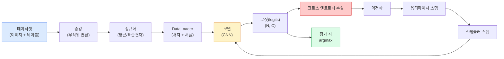

> 🇰🇷 이 문서는 한국어 번역본입니다(ELI5 스타일). 원문: [en.md](en.md)

# 이미지 분류

> 분류기(classifier)란 픽셀을 클래스 확률 분포로 바꾸는 함수입니다. 나머지는 전부 배관 작업이죠.

**유형:** 빌드
**언어:** Python
**선수 지식:** 페이즈 2 레슨 09(모델 평가), 페이즈 3 레슨 10(미니 프레임워크), 페이즈 4 레슨 03(CNN)
**시간:** 약 75분

## 학습 목표

- CIFAR-10에서 엔드투엔드 이미지 분류 파이프라인(데이터셋, 증강, 모델, 학습 루프, 평가)을 구축합니다
- 각 구성 요소(dataloader, 손실, 옵티마이저, 스케줄러, 증강)의 역할을 설명하고, 하나라도 깨지면 손실 곡선에 어떻게 드러나는지 예측합니다
- mixup, cutout, 레이블 스무딩(label smoothing)을 밑바닥부터 구현하고, 각각을 언제 도입할 가치가 있는지 근거를 댑니다
- 혼동 행렬(confusion matrix)과 클래스별 정밀도/재현율 표를 읽어, 전체 정확도만으로는 보이지 않는 데이터셋/모델 실패를 진단합니다

## 문제 상황

실제로 출시되는 모든 비전 과제는 어떤 수준에서든 이미지 분류로 귀결됩니다. 탐지(detection)는 영역을 분류하고, 세그멘테이션(segmentation)은 픽셀을 분류하고, 검색(retrieval)은 클래스 중심과의 유사도로 순위를 매깁니다. 분류를 제대로 해내는 것 — 데이터셋 루프, 증강 정책, 손실, 평가 — 이 바로 이 페이즈의 다른 모든 과제로 전이되는 스킬입니다.

분류 버그의 대부분은 모델 안에 있지 않습니다. 파이프라인 안에 있습니다: 깨진 정규화, 섞이지 않은(shuffle 안 한) 학습 세트, 레이블을 왜곡하는 증강, 학습 데이터로 오염된 검증 분할, 30 에포크쯤 조용히 발산해 버리는 학습률. 올바른 설정이라면 CIFAR-10에서 93%를 찍을 CNN이 깨진 설정에서는 흔히 70~75%를 기록하고, 그 와중에도 손실 곡선은 그럴듯해 보입니다.

이 레슨은 파이프라인 전체를 손으로 직접 연결해 모든 부품을 들여다볼 수 있게 만듭니다. 버그를 숨길 수 있는 `torchvision.datasets`의 기능은 아무것도 쓰지 않습니다.

## 개념

### 분류 파이프라인



이 루프의 모든 줄이 버그가 숨을 수 있는 자리입니다. 크로스 엔트로피는 softmax 출력이 아니라 raw 로짓을 받으므로, 손실 앞에 `model(x).softmax()`를 넣으면 조용히 엉터리 그래디언트를 계산합니다. 증강은 입력에만 적용하지 레이블에는 적용하지 않습니다 — 둘 다 섞는 mixup은 예외입니다. `optimizer.zero_grad()`는 스텝마다 한 번씩 반드시 호출해야 합니다. 건너뛰면 그래디언트가 쌓여서 학습률이 극도로 불안정한 것처럼 보입니다. 이 버그들은 전부 오류를 던지지 않으면서 학습 곡선만 눌러 펴 버립니다.

### 크로스 엔트로피, 로짓, 소프트맥스

분류기는 이미지당 `C`개의 숫자를 출력하는데 이를 로짓(logits)이라 부릅니다. softmax를 적용하면 확률 분포로 바뀝니다:

```
softmax(z)_i = exp(z_i) / sum_j exp(z_j)
```

크로스 엔트로피는 정답 클래스의 음의 로그 확률을 측정합니다:

```
CE(z, y) = -log( softmax(z)_y )
        = -z_y + log( sum_j exp(z_j) )
```

오른쪽 형태가 수치적으로 안정한 형태입니다(log-sum-exp). PyTorch의 `nn.CrossEntropyLoss`는 softmax + NLL을 한 연산으로 합쳐 놓았고 raw 로짓을 바로 받습니다. 자기 손으로 softmax를 먼저 적용하는 것은 거의 항상 버그입니다 — log(softmax(softmax(z))), 즉 아무 의미 없는 값을 계산하게 됩니다.

### 증강이 왜 동작하나

CNN은 (가중치 공유 덕분에) 이동에 대해서는 귀납적 편향(inductive bias)이 있지만, 크롭, 뒤집기, 색상 지터, 가림(occlusion)에 대한 불변성(invariance)은 기본 내장돼 있지 않습니다. 그 불변성을 가르치는 유일한 방법은 그 불변성을 드러내는 픽셀을 보여 주는 것입니다. 학습 중의 모든 무작위 변환은 이런 말입니다: "이 두 이미지는 같은 레이블이다. 그 차이를 무시하는 특성(feature)을 배워라."

```
원본 크롭:      "왼쪽을 보는 개"
뒤집기:          "오른쪽을 보는 개"      <- 같은 레이블, 다른 픽셀
회전(+15):      "살짝 기운 개"
색상 지터:      "따뜻한 빛 속의 개"
RandomErasing:  "한 조각 빠진 개"
```

규칙은 이것입니다: 증강은 레이블을 보존해야 합니다. 숫자 이미지에 cutout과 회전을 하면 "6"이 "9"로 뒤집힐 수 있습니다. 그런 데이터셋에서는 회전 범위를 줄이고, 숫자 특유의 불변성을 존중하는 증강을 고르세요.

### Mixup과 cutmix

보통의 증강은 픽셀을 변형하지만 레이블은 원핫(one-hot) 그대로 둡니다. **Mixup**과 **cutmix**는 둘 다 섞어 버림으로써 그 관행을 깹니다.

```
Mixup:
  lambda ~ Beta(a, a)
  x = lambda * x_i + (1 - lambda) * x_j
  y = lambda * y_i + (1 - lambda) * y_j

Cutmix:
  x_j의 무작위 사각형을 x_i에 붙여 넣기
  y = y_i와 y_j의 면적 가중 혼합
```

왜 도움이 될까요? 모델이 뾰족한 원핫 목표를 통째로 외우는 것을 멈추고 클래스 사이를 보간하는 법을 배우기 때문입니다. 학습 손실은 올라가고, 테스트 정확도는 올라갑니다. 어떤 분류기에든 적용할 수 있는 가장 싼 강인함(robustness) 업그레이드입니다.

### 레이블 스무딩

mixup의 사촌 격입니다. `[0, 0, 1, 0, 0]` 대신 `[eps/C, eps/C, 1-eps, eps/C, eps/C]`(예: `eps` = 0.1처럼 작은 값)을 목표로 학습합니다. 모델이 지나치게 뾰족한 로짓을 만드는 것을 막고, 거의 공짜로 보정(calibration)을 개선합니다. PyTorch 1.10부터 `nn.CrossEntropyLoss(label_smoothing=0.1)`로 내장되어 있습니다.

### 정확도 너머의 평가

집계 정확도는 불균형을 숨깁니다. 항상 다수 클래스만 예측하는 90 대 10 이진 분류기도 90%를 기록합니다. 실제로 무슨 일이 벌어지는지 알려 주는 도구들:

- **클래스별 정확도** — 클래스당 숫자 하나; 성능이 뒤처지는 클래스가 바로 드러납니다.
- **혼동 행렬** — C x C 격자. 행 i 열 j = 진짜 클래스 i를 클래스 j로 예측한 횟수. 대각선은 정답이고, 대각선 밖이 여러분의 모델이 사는 곳입니다.
- **Top-1 / Top-5** — 정답 클래스가 예측 상위 1개(또는 5개) 안에 들었는지; ImageNet에서 Top-5가 중요한 이유는 "Norwich terrier"와 "Norfolk terrier" 같은 클래스가 실제로도 구분이 애매하기 때문입니다.
- **보정(ECE)** — 확신도 0.8인 예측이 실제로 80% 확률로 맞습니까? 모던 네트워크는 체계적으로 과신(over-confident)합니다; 온도 스케일링(temperature scaling)이나 레이블 스무딩으로 고칩니다.

```figure
receptive-field
```

## 만들어 보기

### 단계 1: 결정론적 합성 데이터셋

CIFAR-10은 디스크에 있는 데이터입니다. 이 레슨을 재현 가능하고 빠르게 만들기 위해 CIFAR처럼 생긴 합성 데이터셋 — 모델이 반드시 배워야 하는 클래스별 구조를 지닌 32x32 RGB 이미지 — 을 만듭니다. 완전히 같은 파이프라인이 실제 CIFAR-10에서도 그대로 동작합니다.

```python
import numpy as np
import torch
from torch.utils.data import Dataset


def synthetic_cifar(num_per_class=1000, num_classes=10, seed=0):
    rng = np.random.default_rng(seed)
    X = []
    Y = []
    for c in range(num_classes):
        centre = rng.uniform(0, 1, (3,))
        freq = 2 + c
        for _ in range(num_per_class):
            yy, xx = np.meshgrid(np.linspace(0, 1, 32), np.linspace(0, 1, 32), indexing="ij")
            r = np.sin(xx * freq) * 0.5 + centre[0]
            g = np.cos(yy * freq) * 0.5 + centre[1]
            b = (xx + yy) * 0.5 * centre[2]
            img = np.stack([r, g, b], axis=-1)
            img += rng.normal(0, 0.08, img.shape)
            img = np.clip(img, 0, 1)
            X.append(img.astype(np.float32))
            Y.append(c)
    X = np.stack(X)
    Y = np.array(Y)
    idx = rng.permutation(len(X))
    return X[idx], Y[idx]


class ArrayDataset(Dataset):
    def __init__(self, X, Y, transform=None):
        self.X = X
        self.Y = Y
        self.transform = transform

    def __len__(self):
        return len(self.X)

    def __getitem__(self, i):
        img = self.X[i]
        if self.transform is not None:
            img = self.transform(img)
        img = torch.from_numpy(img).permute(2, 0, 1)
        return img, int(self.Y[i])
```

각 클래스는 고유한 색 팔레트와 주파수 패턴을 가지고, 여기에 가우시안 노이즈를 더해 모델이 픽셀을 통째로 외우는 대신 신호를 배우도록 강제합니다. 클래스 열 개, 클래스당 이미지 천 장, 순서 섞기 완료.

### 단계 2: 정규화와 증강

모든 비전 파이프라인이 가지고 있는 두 가지 변환입니다.

```python
def standardize(mean, std):
    mean = np.array(mean, dtype=np.float32)
    std = np.array(std, dtype=np.float32)
    def _fn(img):
        return (img - mean) / std
    return _fn


def random_hflip(p=0.5):
    def _fn(img):
        if np.random.random() < p:
            return img[:, ::-1, :].copy()
        return img
    return _fn


def random_crop(pad=4):
    def _fn(img):
        h, w = img.shape[:2]
        padded = np.pad(img, ((pad, pad), (pad, pad), (0, 0)), mode="reflect")
        y = np.random.randint(0, 2 * pad)
        x = np.random.randint(0, 2 * pad)
        return padded[y:y + h, x:x + w, :]
    return _fn


def compose(*fns):
    def _fn(img):
        for fn in fns:
            img = fn(img)
        return img
    return _fn
```

크롭 전에 0 패딩이 아니라 reflect 패딩을 합니다. 검은 테두리는 모델이 쓸모 없는 방향으로 배워버릴 신호이기 때문입니다.

### 단계 3: Mixup

학습 스텝 안에서 이미지 두 장과 레이블 두 개를 섞습니다. 배치 변환으로 구현해서 데이터셋 내부가 아니라 forward pass 바로 옆에 둡니다.

```python
def mixup_batch(x, y, num_classes, alpha=0.2):
    if alpha <= 0:
        return x, torch.nn.functional.one_hot(y, num_classes).float()
    lam = float(np.random.beta(alpha, alpha))
    idx = torch.randperm(x.size(0), device=x.device)
    x_mixed = lam * x + (1 - lam) * x[idx]
    y_onehot = torch.nn.functional.one_hot(y, num_classes).float()
    y_mixed = lam * y_onehot + (1 - lam) * y_onehot[idx]
    return x_mixed, y_mixed


def soft_cross_entropy(logits, soft_targets):
    log_probs = torch.log_softmax(logits, dim=-1)
    return -(soft_targets * log_probs).sum(dim=-1).mean()
```

`soft_cross_entropy`는 소프트 레이블 분포에 대한 크로스 엔트로피입니다. 목표가 정확한 원핫이면 보통의 원핫 경우로 환원됩니다.

### 단계 4: 학습 루프

완전한 레시피: 데이터를 한 번 훑고, 배치마다 그래디언트 한 번, 스케줄러는 에포크마다 한 번 스텝.

```python
import torch
import torch.nn as nn
from torch.utils.data import DataLoader
from torch.optim import SGD
from torch.optim.lr_scheduler import CosineAnnealingLR

def train_one_epoch(model, loader, optimizer, device, num_classes, use_mixup=True):
    model.train()
    total, correct, loss_sum = 0, 0, 0.0
    for x, y in loader:
        x, y = x.to(device), y.to(device)
        if use_mixup:
            x_m, y_soft = mixup_batch(x, y, num_classes)
            logits = model(x_m)
            loss = soft_cross_entropy(logits, y_soft)
        else:
            logits = model(x)
            loss = nn.functional.cross_entropy(logits, y, label_smoothing=0.1)
        optimizer.zero_grad()
        loss.backward()
        optimizer.step()
        loss_sum += loss.item() * x.size(0)
        total += x.size(0)
        # mixup이 켜져 있으면(모델이 y가 아니라 소프트 목표를 봤으므로)
        # 섞지 않은 레이블 `y`에 대한 학습 정확도는 어디까지나 근사치다.
        # 대략적인 진행 상황 신호로만 쓰고, 실제 성능은 검증(val) 정확도로 판단한다.
        with torch.no_grad():
            pred = logits.argmax(dim=-1)
            correct += (pred == y).sum().item()
    return loss_sum / total, correct / total


@torch.no_grad()
def evaluate(model, loader, device, num_classes):
    model.eval()
    total, correct = 0, 0
    loss_sum = 0.0
    cm = torch.zeros(num_classes, num_classes, dtype=torch.long)
    for x, y in loader:
        x, y = x.to(device), y.to(device)
        logits = model(x)
        loss = nn.functional.cross_entropy(logits, y)
        pred = logits.argmax(dim=-1)
        for t, p in zip(y.cpu(), pred.cpu()):
            cm[t, p] += 1
        loss_sum += loss.item() * x.size(0)
        total += x.size(0)
        correct += (pred == y).sum().item()
    return loss_sum / total, correct / total, cm
```

학습 루프를 작성할 때마다 확인하는 다섯 가지 불변식:

1. 학습 전 `model.train()`, 평가 전 `model.eval()` — 드롭아웃과 배치 정규화 동작을 바꿉니다.
2. `.backward()` 전에 `.zero_grad()`.
3. 지표를 누적할 때는 `.item()`으로 계산 그래프를 붙들고 있지 않게 합니다.
4. 평가 중에는 `@torch.no_grad()` — 메모리와 시간을 아끼고 사소한 사고를 막습니다.
5. argmax는 softmax가 아니라 raw 로짓에 — 결과는 같고 연산은 하나 줄어듭니다.

### 단계 5: 조립하기

이전 레슨의 `TinyResNet`을 사용해 몇 에포크 학습하고 평가합니다.

```python
from main import synthetic_cifar, ArrayDataset
from main import standardize, random_hflip, random_crop, compose
from main import mixup_batch, soft_cross_entropy
from main import train_one_epoch, evaluate
# TinyResNet은 이전 레슨(03-cnns-lenet-to-resnet)에서 가져온다.
# 임포트 경로는 이전 레슨 코드를 저장해 둔 위치에 맞게 조정할 것.
from cnns_lenet_to_resnet import TinyResNet  # 예시용 플레이스홀더

X, Y = synthetic_cifar(num_per_class=500)
split = int(0.9 * len(X))
X_train, Y_train = X[:split], Y[:split]
X_val, Y_val = X[split:], Y[split:]

mean = [0.5, 0.5, 0.5]
std = [0.25, 0.25, 0.25]
train_tf = compose(random_hflip(), random_crop(pad=4), standardize(mean, std))
eval_tf = standardize(mean, std)

train_ds = ArrayDataset(X_train, Y_train, transform=train_tf)
val_ds = ArrayDataset(X_val, Y_val, transform=eval_tf)

train_loader = DataLoader(train_ds, batch_size=128, shuffle=True, num_workers=0)
val_loader = DataLoader(val_ds, batch_size=256, shuffle=False, num_workers=0)

device = "cuda" if torch.cuda.is_available() else "cpu"
model = TinyResNet(num_classes=10).to(device)
optimizer = SGD(model.parameters(), lr=0.1, momentum=0.9, weight_decay=5e-4, nesterov=True)
scheduler = CosineAnnealingLR(optimizer, T_max=10)

for epoch in range(10):
    tr_loss, tr_acc = train_one_epoch(model, train_loader, optimizer, device, 10, use_mixup=True)
    va_loss, va_acc, _ = evaluate(model, val_loader, device, 10)
    scheduler.step()
    print(f"epoch {epoch:2d}  lr {scheduler.get_last_lr()[0]:.4f}  "
          f"train {tr_loss:.3f}/{tr_acc:.3f}  val {va_loss:.3f}/{va_acc:.3f}")
```

합성 데이터셋에서는 다섯 에포크 안에 검증 정확도가 거의 완벽에 도달합니다. 그게 포인트입니다: 파이프라인이 올바르고, 모델은 배울 수 있는 것을 배울 수 있습니다. 데이터셋을 실제 CIFAR-10으로 바꿔도 같은 루프가 수정 없이 ~90%까지 학습됩니다.

### 단계 6: 혼동 행렬 읽기

정확도만으로는 모델이 어디서 실패하는지 절대 알 수 없습니다. 혼동 행렬은 알려 줍니다.

```python
def print_confusion(cm, labels=None):
    c = cm.shape[0]
    labels = labels or [str(i) for i in range(c)]
    print(f"{'':>6}" + "".join(f"{l:>5}" for l in labels))
    for i in range(c):
        row = cm[i].tolist()
        print(f"{labels[i]:>6}" + "".join(f"{v:>5}" for v in row))
    print()
    tp = cm.diag().float()
    fp = cm.sum(dim=0).float() - tp
    fn = cm.sum(dim=1).float() - tp
    prec = tp / (tp + fp).clamp_min(1)
    rec = tp / (tp + fn).clamp_min(1)
    f1 = 2 * prec * rec / (prec + rec).clamp_min(1e-9)
    for i in range(c):
        print(f"{labels[i]:>6}  prec {prec[i]:.3f}  rec {rec[i]:.3f}  f1 {f1[i]:.3f}")

_, _, cm = evaluate(model, val_loader, device, 10)
print_confusion(cm)
```

행은 진짜 클래스, 열은 예측입니다. 클래스 3과 5 사이에 대각선 밖 카운트가 몰려 있다면 모델이 그 둘을 헷갈린다는 뜻이고, 목표를 정한 데이터 수집이나 클래스별 증강의 출발점이 됩니다.

## 활용하기

`torchvision`은 위의 모든 것을 관용적인 컴포넌트로 감싸 줍니다. 실제 CIFAR-10이라면 전체 파이프라인이 학습 루프 더러 네 줄이면 됩니다.

```python
from torchvision.datasets import CIFAR10
from torchvision.transforms import Compose, RandomCrop, RandomHorizontalFlip, ToTensor, Normalize

mean = (0.4914, 0.4822, 0.4465)
std = (0.2470, 0.2435, 0.2616)
train_tf = Compose([
    RandomCrop(32, padding=4, padding_mode="reflect"),
    RandomHorizontalFlip(),
    ToTensor(),
    Normalize(mean, std),
])
eval_tf = Compose([ToTensor(), Normalize(mean, std)])

train_ds = CIFAR10(root="./data", train=True,  download=True, transform=train_tf)
val_ds   = CIFAR10(root="./data", train=False, download=True, transform=eval_tf)
```

두 가지를 눈여겨보세요. 평균/표준편차는 **데이터셋 고유 값**입니다 — ImageNet이 아니라 CIFAR-10 학습 세트에서 계산한 값이죠. 그리고 reflect 패딩은 커뮤니티 기본 크롭 정책입니다. 여기에 ImageNet 통계를 복붙하면 눈에 띄지 않는 ~1% 정확도 누수가 생기고, 누군가 모델을 프로파일링하기 전까지는 아무도 알아차리지 못합니다.

## 출시하기

이 레슨의 산출물:

- `outputs/prompt-classifier-pipeline-auditor.md` — 학습 스크립트를 위의 다섯 가지 불변식 기준으로 감사(audit)하고 첫 번째 위반을 끌어 올리는 프롬프트.
- `outputs/skill-classification-diagnostics.md` — 혼동 행렬과 클래스 이름 목록을 받아 클래스별 실패를 요약하고 가장 영향 큰 수정 하나를 제안하는 스킬.

## 연습 문제

1. **(쉬움)** 같은 모델을 mixup 유무로 갈라 합성 데이터셋에서 다섯 에포크씩 학습하세요. 둘 다 학습/검증 손실을 그래프로 그립니다. mixup을 쓴 쪽의 학습 손실은 더 높은데 검증 정확도는 비슷하거나 더 나은 이유를 설명합니다.
2. **(보통)** Cutout — 학습 이미지마다 무작위 8x8 사각형을 0으로 만들기 — 을 구현하고, 증강 없음 / hflip+crop / hflip+crop+cutout / hflip+crop+mixup으로 소거 실험(ablation)을 돌립니다. 각각의 검증 정확도를 보고합니다.
3. **(어려움)** CIFAR-100 파이프라인(클래스 100개, 같은 입력 크기)을 만들고 ResNet-34 학습을 공개된 정확도의 1% 이내로 재현합니다. 보너스: 학습률 세 가지와 weight decay 두 가지를 스윕하고, 로컬 CSV에 로그를 남기고, 최종 혼동 행렬 기반 최다 혼동 표를 만들어 봅니다.

## 핵심 용어

| 용어 | 사람들이 말하는 것 | 실제 의미 |
|------|----------------|----------------------|
| 로짓(Logits) | "raw 출력" | 이미지당 C개 숫자의 pre-softmax 벡터; 크로스 엔트로피는 softmax를 통과한 값이 아니라 이것을 기대함 |
| 크로스 엔트로피 | "그 손실" | 정답 클래스의 음의 로그 확률; log-softmax와 NLL을 안정적인 한 연산으로 합침 |
| DataLoader | "배치 만들어 주는 것" | 데이터셋을 셔플, 배치, (선택) 멀티 워커 로딩으로 감쌈; 학습 버그의 절반은 이 녀석 탓으로 돌려지곤 함 |
| 증강(Augmentation) | "무작위 변환" | 학습 시점의 레이블 보존 픽셀 변환; CNN이 기본적으로 갖지 못한 불변성을 가르침 |
| Mixup / Cutmix | "이미지 두 장 섞기" | 입력과 레이블을 모두 블렌딩해 분류기가 딱딱한 경계 대신 부드러운 보간을 학습하게 함 |
| 레이블 스무딩(Label smoothing) | "부드러운 목표" | 원핫을 (1-eps, eps/(C-1), ...)로 교체; 보정을 개선하고 정확도도 조금 올림 |
| Top-k 정확도 | "Top-5" | 정답 클래스가 확률 상위 k개 예측 안에 들었는지; 실제로 애매한 클래스가 있는 데이터셋에서 사용 |
| 혼동 행렬(Confusion matrix) | "오류가 사는 곳" | C x C 표에서 (i, j) 항목은 진짜 클래스 i를 j로 예측한 이미지 수; 대각선은 정답, 대각선 밖이 고칠 곳을 알려 줌 |

## 더 읽을거리

- [CS231n: Training Neural Networks](https://cs231n.github.io/neural-networks-3/) — 학습 파이프라인을 한 페이지에서 가장 명확하게 훑어 준 자료
- [Bag of Tricks for Image Classification (He et al., 2019)](https://arxiv.org/abs/1812.01187) — 합치면 ImageNet ResNet 정확도에 3~4%를 더하는 작은 트릭들의 총목록
- [mixup: Beyond Empirical Risk Minimization (Zhang et al., 2017)](https://arxiv.org/abs/1710.09412) — mixup 원조 논문; 세 페이지 이론 + 설득력 있는 실험
- [Why temperature scaling matters (Guo et al., 2017)](https://arxiv.org/abs/1706.04599) — 모던 네트워크가 보정되지 않았음을 증명하고 스칼라 파라미터 하나로 고친 논문
