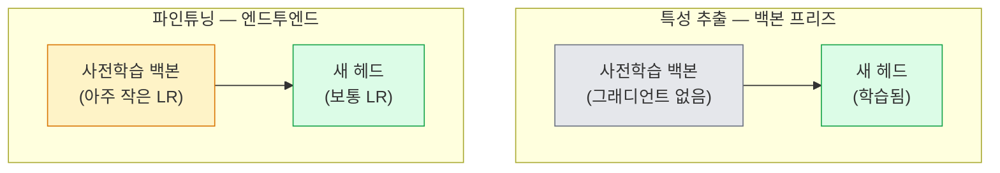

> 🇰🇷 이 문서는 한국어 번역본입니다(ELI5 스타일). 원문: [en.md](en.md)

# 전이 학습과 파인튜닝

> 누군가 백만 GPU시간을 들여 네트워크에게 가장자리, 질감, 물체 부위가 어떻게 생겼는지 가르쳐 놨습니다. 자기만의 네트워크를 학습하기 전에 그 특성을 먼저 빌려 쓰는 게 정상입니다.

**유형:** 빌드
**언어:** Python
**선수 지식:** 페이즈 4 레슨 03(CNN), 페이즈 4 레슨 04(이미지 분류)
**시간:** 약 75분

## 학습 목표

- 특성 추출(feature extraction)과 파인튜닝을 구분하고, 데이터셋 크기, 도메인 거리, 연산 예산에 따라 알맞은 쪽을 고릅니다
- 사전학습된 백본을 불러오고 분류 헤드를 교체한 뒤, 20줄 미만으로 헤드만 학습해 동작하는 베이스라인을 만듭니다
- 판별적 학습률(discriminative learning rate)로 레이어를 점진적으로 언프리즈(unfreeze)해, 초반의 범용 특성이 후반의 과제 특이 부분보다 더 작은 업데이트를 받게 합니다
- 세 가지 흔한 실패를 진단합니다: 언프리즈한 블록에 너무 높은 학습률로 인한 특성 표류(drift), 작은 데이터셋에서의 BN 통계 붕괴, 그리고 망각(catastrophic forgetting)

## 문제 상황

ImageNet에서 ResNet-50을 학습하면 GPU시간 약 2,000시간이 듭니다. 출시하는 과제마다 그 예산을 가진 팀은 거의 없습니다. 실제로 거의 모든 팀이 출시하는 것은 사전학습 백본에, 과제 이미지 몇백~몇천 장으로 학습한 새 헤드를 얹은 모델입니다.

이건 지름길이 아닙니다. ImageNet으로 학습한 CNN의 첫 합성곱 블록은 가장자리(edge)와 Gabor 비슷한 필터를 배웁니다. 그다음 몇 블록은 질감과 단순한 모티프를 배웁니다. 중간 블록은 물체 부위를 배웁니다. 마지막 블록은 ImageNet 1,000개 카테고리처럼 보이기 시작하는 조합을 배웁니다. 이 위계의 처음 90%는 의료 영상, 산업 검사, 위성 데이터, 그 밖의 모든 비전 과제로 거의 그대로 전이됩니다 — 자연에 존재하는 가장자리와 질감의 어휘는 한정되어 있기 때문입니다. 학습 대상은 마지막 10%입니다.

전이를 제대로 하는 길에는 세 가지 버그가 기다리고 있습니다: 너무 높은 학습률로 사전학습 특성을 파괴하기, 너무 많이 프리즈해서 모델을 정보 굶기기, 그리고 네트워크 나머지가 배운 적 없는 작은 데이터셋 쪽으로 BatchNorm의 이동 통계(running statistics)를 흘려보내기. 이 레슨은 그 셋을 각각 일부러 하나씩 겪어 봅니다.

## 개념

### 특성 추출 대 파인튜닝

두 가지 레짐(regime)이고, 사전학습 특성을 얼마나 신뢰하는지와 데이터가 얼마나 있는지로 고릅니다.



경험 법칙:

| 데이터셋 크기 | 도메인 거리 | 레시피 |
|--------------|-----------------|--------|
| 1,000장 미만 | ImageNet과 가까움 | 백본 프리즈, 헤드만 학습 |
| 1,000~10,000장 | 가까움 | 첫 2~3개 스테이지 프리즈, 나머지 파인튜닝 |
| 10,000~100,000장 | 무관 | 판별적 LR로 엔드투엔드 파인튜닝 |
| 100,000장 초과 | 멀리 있음 | 전부 파인튜닝; 도메인이 충분히 멀면 처음부터 학습 고려 |

"ImageNet과 가까움"은 대략 물체가 담긴 자연 RGB 사진을 뜻합니다. 의료 CT, 정사영 위성 영상, 현미경 사진은 먼 도메인입니다 — 특성은 여전히 도움이 되지만, 더 많은 레이어가 적응하도록 풀어 줘야 합니다.

### 프리즈가 애초에 왜 동작하나

CNN이 ImageNet에서 배우는 특성은 1,000개 카테고리에 특화된 것이 아닙니다. 자연 이미지의 통계 — 특정 방향의 가장자리, 질감, 명암 패턴, 형태 원시 요소 — 에 특화된 것입니다. 그 통계는 사람이 이름 붙일 수 있는 거의 모든 시각 도메인에서 안정적입니다. 그래서 ImageNet으로 학습한 모델도 백본은 그대로 두고(백본 파인튜닝 없이) 새 선형 헤드만 붙여 CIFAR-10을 제로샷 평가하면 80%를 넘습니다. 헤드가 하는 일은 이미 배워 둔 특성 중 이 과제에는 무엇에 가중치를 둘지 고르는 것입니다.

### 판별적 학습률

언프리즈를 한다면 초반 레이어는 후반 레이어보다 천천히 학습해야 합니다. 초반 레이어는 보존하고 싶은 범용 특성을 부호화하고, 후반 레이어는 크게 움직여야 하는 과제 특이 구조를 부호화합니다.

```
전형적인 레시피:

  stage 0 (스템 + 첫 그룹):      lr = base_lr / 100    (거의 고정)
  stage 1:                       lr = base_lr / 10
  stage 2:                       lr = base_lr / 3
  stage 3 (백본 마지막 그룹):    lr = base_lr
  헤드:                          lr = base_lr  (또는 약간 더 높게)
```

PyTorch에서는 옵티마이저에 넘기는 파라미터 그룹 목록이 전부입니다. 모델 하나, 학습률 다섯 개, 추가 코드 0줄.

### BatchNorm 문제

BN 레이어는 ImageNet에서 계산된 `running_mean`과 `running_var` 버퍼를 들고 있습니다. 과제의 픽셀 분포가 다르다면 — 조명이 다르거나, 센서가 다르거나, 색 공간이 다르면 — 그 버퍼는 틀린 값입니다. 선호 순서대로 세 가지 선택지:

1. **BN을 train 모드로 두고 파인튜닝.** BN이 다른 것들과 함께 이동 통계를 갱신하게 둡니다. 과제 데이터셋이 중간 크기(예시 5,000개 이상)일 때의 기본 선택.
2. **BN을 eval 모드로 프리즈.** ImageNet 통계를 유지하고 가중치만 학습합니다. 데이터셋이 작아 BN의 이동 평균이 잡음이 될 만큼 작을 때가 옳은 선택.
3. **BN을 GroupNorm으로 교체.** 이동 평균 문제를 아예 제거합니다. GPU당 배치 크기가 아주 작은 탐지·세그멘테이션 백본에서 사용됩니다.

이걸 잘못 처리하면 정확도가 조용히 5~15%씩 떨어집니다.

### 헤드 설계

분류 헤드는 선형 층 1~3개에 드롭아웃(선택)입니다. 모든 torchvision 백본은 기본 헤드를 함께 배송하며, 이를 교체합니다:

```
backbone.fc = nn.Linear(backbone.fc.in_features, num_classes)          # ResNet
backbone.classifier[1] = nn.Linear(..., num_classes)                    # EfficientNet, MobileNet
backbone.heads.head = nn.Linear(..., num_classes)                       # torchvision ViT
```

작은 데이터셋에서는 선형 층 하나면 보통 충분합니다. 은닉층 추가(Linear -> ReLU -> Dropout -> Linear)는 과제 분포가 백본의 학습 분포에서 더 멀 때 도움이 됩니다.

### 레이어별 LR 감쇠(layer-wise LR decay)

모던 파인튜닝(BEiT, DINOv2, ViT-B 파인튜닝)에서 쓰는, 판별적 LR의 더 매끄러운 버전입니다. 레이어를 스테이지로 묶는 대신 모든 레이어에 바로 위 레이어보다 살짝 작은 LR을 줍니다:

```
lr_layer_k = base_lr * decay^(L - k)
```

decay = 0.75, 트랜스포머 블록 L = 12이면 첫 블록은 헤드 LR의 `0.75^11 ≈ 0.04x`로 학습합니다. 트랜스포머 파인튜닝에서 CNN보다 더 중요합니다. CNN에서는 스테이지 그룹 학습률로 보통 충분합니다.

### 무엇을 평가하나

전이 학습 실행에는 처음부터 학습(scratch run)에서는 추적하지 않는 두 숫자가 필요합니다:

- **사전학습 전용 정확도** — 백본을 프리즈한 상태의 헤드 정확도. 바닥(floor)입니다.
- **파인튜닝 정확도** — 엔드투엔드 학습 후의 같은 모델. 천장(ceiling)입니다.

파인튜닝이 사전학습 전용보다 낮다면 학습률 또는 BN 버그입니다. 항상 둘 다 출력하세요.

```figure
transfer-learning
```

## 만들어 보기

### 단계 1: 사전학습 백본 불러와 들여다보기

```python
import torch
import torch.nn as nn
from torchvision.models import resnet18, ResNet18_Weights

backbone = resnet18(weights=ResNet18_Weights.IMAGENET1K_V1)
print(backbone)
print()
print("classifier head:", backbone.fc)
print("feature dim:", backbone.fc.in_features)
```

`ResNet18`은 스테이지 네 개(`layer1..layer4`)에 스템과 `fc` 헤드가 더해진 구조입니다. 모든 torchvision 분류 백본이 이와 유사한 구조를 가집니다.

### 단계 2: 특성 추출 — 전부 프리즈, 헤드 교체

```python
def make_feature_extractor(num_classes=10):
    model = resnet18(weights=ResNet18_Weights.IMAGENET1K_V1)
    for p in model.parameters():
        p.requires_grad = False
    model.fc = nn.Linear(model.fc.in_features, num_classes)
    return model

model = make_feature_extractor(num_classes=10)
trainable = sum(p.numel() for p in model.parameters() if p.requires_grad)
frozen = sum(p.numel() for p in model.parameters() if not p.requires_grad)
print(f"trainable: {trainable:>10,}")
print(f"frozen:    {frozen:>10,}")
```

학습 가능한 것은 `model.fc`뿐입니다. 백본은 프리즈된 특성 추출기입니다.

### 단계 3: 판별적 파인튜닝

스테이지별 학습률로 파라미터 그룹을 만들어 주는 유틸리티입니다.

```python
def discriminative_param_groups(model, base_lr=1e-3, decay=0.3):
    stages = [
        ["conv1", "bn1"],
        ["layer1"],
        ["layer2"],
        ["layer3"],
        ["layer4"],
        ["fc"],
    ]
    groups = []
    for i, names in enumerate(stages):
        lr = base_lr * (decay ** (len(stages) - 1 - i))
        params = [p for n, p in model.named_parameters()
                  if any(n.startswith(k) for k in names)]
        if params:
            groups.append({"params": params, "lr": lr, "name": "_".join(names)})
    return groups

model = resnet18(weights=ResNet18_Weights.IMAGENET1K_V1)
model.fc = nn.Linear(model.fc.in_features, 10)
for p in model.parameters():
    p.requires_grad = True

groups = discriminative_param_groups(model)
for g in groups:
    print(f"{g['name']:>10s}  lr={g['lr']:.2e}  params={sum(p.numel() for p in g['params']):>8,}")
```

`decay=0.3`은 각 스테이지가 다음 스테이지 속도의 30%로 학습한다는 뜻입니다. `fc`는 `base_lr`, `layer4`는 `0.3 * base_lr`, `conv1`은 `0.3^5 * base_lr ≈ 0.00243 * base_lr`. 극단적으로 들리지만, 경험적으로 동작합니다.

### 단계 4: BatchNorm 처리

BN의 이동 통계는 프리즈하되 가중치는 프리즈하지 않는 헬퍼입니다.

```python
def freeze_bn_stats(model):
    for m in model.modules():
        if isinstance(m, (nn.BatchNorm1d, nn.BatchNorm2d, nn.BatchNorm3d)):
            m.eval()
            for p in m.parameters():
                p.requires_grad = False
    return model
```

매 에포크 시작에 `model.train()`을 호출한 뒤에 이것을 호출합니다. `model.train()`은 전부 학습 모드로 뒤집는데, 이것은 BN 레이어만 되돌립니다.

### 단계 5: 최소한의 엔드투엔드 파인튜닝 루프

```python
from torch.optim import SGD
from torch.utils.data import DataLoader
from torch.optim.lr_scheduler import CosineAnnealingLR
import torch.nn.functional as F

def fine_tune(model, train_loader, val_loader, device, epochs=5, base_lr=1e-3, freeze_bn=False):
    model = model.to(device)
    groups = discriminative_param_groups(model, base_lr=base_lr)
    optimizer = SGD(groups, momentum=0.9, weight_decay=1e-4, nesterov=True)
    scheduler = CosineAnnealingLR(optimizer, T_max=epochs)

    for epoch in range(epochs):
        model.train()
        if freeze_bn:
            freeze_bn_stats(model)
        tr_loss, tr_correct, tr_total = 0.0, 0, 0
        for x, y in train_loader:
            x, y = x.to(device), y.to(device)
            logits = model(x)
            loss = F.cross_entropy(logits, y, label_smoothing=0.1)
            optimizer.zero_grad()
            loss.backward()
            optimizer.step()
            tr_loss += loss.item() * x.size(0)
            tr_total += x.size(0)
            tr_correct += (logits.argmax(-1) == y).sum().item()
        scheduler.step()

        model.eval()
        va_total, va_correct = 0, 0
        with torch.no_grad():
            for x, y in val_loader:
                x, y = x.to(device), y.to(device)
                pred = model(x).argmax(-1)
                va_total += x.size(0)
                va_correct += (pred == y).sum().item()
        print(f"epoch {epoch}  train {tr_loss/tr_total:.3f}/{tr_correct/tr_total:.3f}  "
              f"val {va_correct/va_total:.3f}")
    return model
```

위 레시피로 CIFAR-10에서 다섯 에포크면 `ResNet18-IMAGENET1K_V1`이 제로샷 선형 프로브(linear probe) 정확도 ~70%에서 파인튜닝 정확도 ~93%로 올라갑니다. 백본을 건드리지 않은 헤드만으로는 86%쯤에서 정체됩니다.

### 단계 6: 점진적 언프리징(progressive unfreezing)

끝에서 시작 쪽으로 한 에포크에 한 스테이지씩 언프리즈하는 스케줄입니다. 에포크 몇 개를 추가로 쓰는 대가로 특성 표류를 완화합니다.

```python
def progressive_unfreeze_schedule(model):
    stages = ["layer4", "layer3", "layer2", "layer1"]
    yielded = set()

    def start():
        for p in model.parameters():
            p.requires_grad = False
        for p in model.fc.parameters():
            p.requires_grad = True

    def unfreeze(epoch):
        if epoch < len(stages):
            name = stages[epoch]
            yielded.add(name)
            for n, p in model.named_parameters():
                if n.startswith(name):
                    p.requires_grad = True
            return name
        return None

    return start, unfreeze
```

첫 에포크 전에 `start()`를 한 번 호출합니다. 각 에포크 시작에 `unfreeze(epoch)`를 호출합니다. 학습 가능 파라미터 집합이 바뀔 때마다 옵티마이저를 다시 만드세요. 그렇지 않으면 프리즈된 파라미터의 캐시된 모멘트가 옵티마이저를 혼란스럽게 만듭니다.

## 활용하기

대부분의 실제 과제에서는 `torchvision.models` + 세 줄이면 충분합니다. 위의 무거운 장비는 라이브러리 기본값으로 못 고치는 문제에 부딪혔을 때 필요합니다.

```python
from torchvision.models import resnet50, ResNet50_Weights

model = resnet50(weights=ResNet50_Weights.IMAGENET1K_V2)
model.fc = nn.Linear(model.fc.in_features, num_classes)
optimizer = torch.optim.AdamW(model.parameters(), lr=1e-4, weight_decay=1e-4)
```

프로덕션급 기본값 두 가지 더:

- `timm`은 일관된 API로 사전학습 비전 백본 약 800개를 배송합니다(`timm.create_model("resnet50", pretrained=True, num_classes=10)`). torchvision 동물원을 넘는 파인튜닝이라면 이것이 표준입니다.
- 트랜스포머라면 `transformers.AutoModelForImageClassification.from_pretrained(name, num_labels=N)`이 텍스트 모델과 같은 로딩 방식으로 ViT / BEiT / DeiT를 줍니다.

## 출시하기

이 레슨의 산출물:

- `outputs/prompt-fine-tune-planner.md` — 데이터셋 크기, 도메인 거리, 연산 예산을 보고 특성 추출 / 점진적 / 엔드투엔드 파인튜닝 중 하나를 고르는 프롬프트.
- `outputs/skill-freeze-inspector.md` — PyTorch 모델을 받아 어떤 파라미터가 학습 가능한지, 어떤 BatchNorm 레이어가 eval 모드인지, 옵티마이저가 실제로 학습 가능 파라미터를 먹고 있는지 보고하는 스킬.

## 연습 문제

1. **(쉬움)** `ResNet18`을 선형 프로브(백본 프리즈)와 전체 파인튜닝으로 각각 같은 합성-CIFAR 데이터셋에서 학습하세요. 두 정확도를 나란히 보고합니다. 어떤 차이가 '특성이 잘 전이된다'를 말해 주고, 어떤 차이가 '그렇지 않다'를 말해 주는지 설명합니다.
2. **(보통)** 일부러 버그를 만듭니다: 헤드가 아니라 백본 스테이지에 `base_lr = 1e-1`을 설정합니다. 학습 손실이 폭발하는 것을 보이고, `discriminative_param_groups` 헬퍼를 적용해 회복시킵니다. 각 스테이지가 발산하기 시작하는 학습률을 기록합니다.
3. **(어려움)** 의료 영상 데이터셋(예: CheXpert-small, PatchCamelyon, HAM10000)을 가져와 세 레짐을 비교합니다: (a) ImageNet 사전학습 프리즈 백본 + 선형 헤드; (b) ImageNet 사전학습 엔드투엔드 파인튜닝; (c) 처음부터 학습. 각각의 정확도와 연산 비용을 보고합니다. 어느 데이터셋 크기부터 처음부터 학습이 경쟁력해질까요?

## 핵심 용어

| 용어 | 사람들이 말하는 것 | 실제 의미 |
|------|----------------|----------------------|
| 특성 추출(Feature extraction) | "프리즈하고 헤드만 학습" | 백본 파라미터는 프리즈, 새 분류 헤드만 그래디언트를 받음 |
| 파인튜닝(Fine-tuning) | "엔드투엔드 재학습" | 모든 파라미터 학습 가능, 보통 처음부터 학습보다 훨씬 작은 LR |
| 판별적 LR(Discriminative LR) | "초반 레이어에 작은 LR" | 옵티마이저 파라미터 그룹에서 초반 스테이지 LR이 후반 스테이지 LR의 일부 |
| 레이어별 LR 감쇠(Layer-wise LR decay) | "부드러운 LR 그래디언트" | 레이어별 LR에 decay^(L - k) 곱하기; 트랜스포머 파인튜닝에서 흔함 |
| 망각(Catastrophic forgetting) | "모델이 ImageNet을 잃음" | 너무 높은 LR이 새 과제 신호를 배우기 전에 사전학습 특성을 덮어씀 |
| BN 통계 표류(BN statistics drift) | "running mean이 틀림" | BatchNorm의 running_mean/var가 현재 과제와 다른 분포에서 계산되어 조용히 정확도를 깎음 |
| 선형 프로브(Linear probe) | "프리즈 백본 + 선형 헤드" | 사전학습 특성의 평가 — 프리즈된 표현 위에서 최선의 선형 분류기가 내는 정확도 |
| 급격한 붕괴(Catastrophic collapse) | "전부 한 클래스만 예측" | 헤드의 그래디언트가 자리 잡기 전에 특성을 파괴할 만큼 높은 LR로 파인튜닝할 때 발생 |

## 더 읽을거리

- [How transferable are features in deep neural networks? (Yosinski et al., 2014)](https://arxiv.org/abs/1411.1792) — 레이어 간 특성 전이 가능성을 정량화한 논문
- [Universal Language Model Fine-tuning (ULMFiT, Howard & Ruder, 2018)](https://arxiv.org/abs/1801.06146) — 판별적 LR / 점진적 언프리징의 원조 레시피; 그 아이디어는 비전으로 그대로 전이됩니다
- [timm documentation](https://huggingface.co/docs/timm) — 모던 비전 백본과 그 학습에 쓰인 정확한 파인튜닝 기본값의 참고 자료
- [A Simple Framework for Linear-Probe Evaluation (Kornblith et al., 2019)](https://arxiv.org/abs/1805.08974) — 선형 프로브 정확도가 왜 중요한지, 어떻게 올바르게 보고하는지
