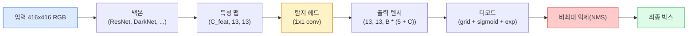

> 🇰🇷 이 문서는 한국어 번역본입니다(ELI5 스타일). 원문: [en.md](en.md)

# 객체 탐지 — 밑바닥부터 만드는 YOLO

> 탐지는 분류에 회귀를 더한 것을 특성 맵의 모든 위치에서 돌리고, 비최대 억제(NMS)로 다듬는 것입니다.

**유형:** 빌드
**언어:** Python
**선수 지식:** 페이즈 4 레슨 03(CNN), 페이즈 4 레슨 04(이미지 분류), 페이즈 4 레슨 05(전이 학습)
**시간:** 약 75분

## 학습 목표

- 탐지를 조밀한(dense) 예측 문제로 바꾸는 격자-앵커 설계를 설명하고, 출력 텐서의 모든 숫자가 무엇을 뜻하는지 말합니다
- 박스 사이의 IoU(Intersection-over-Union)를 계산하고 비최대 억제(NMS)를 밑바닥부터 구현합니다
- 사전학습 백본 위에 최소한의 YOLO 스타일 헤드를 만듭니다 — 분류, objectness, 박스 회귀 손실 포함
- 탐지 지표 한 줄(precision@0.5, recall, mAP@0.5, mAP@0.5:0.95)을 읽고 다음에 어떤 손잡이를 돌릴지 고릅니다

## 문제 상황

분류는 "이 이미지는 개다"라고 말합니다. 탐지는 "(112, 40, 280, 210) 픽셀에 개가 있고, (400, 180, 560, 310)에 고양이가 있으며, 프레임에 그 외 아무것도 없다"라고 말합니다. 이 한 가지 구조적 변화 — 이미지당 레이블 하나 대신 개수가 정해지지 않은 레이블 박스를 예측하는 것 — 이 모든 자율 시스템, 모든 감시 제품, 모든 문서 레이아웃 파서, 모든 공장 비전 라인이 의존하는 핵심입니다.

탐지는 비전의 모든 공학적 트레이드오프가 한꺼번에 드러나는 곳이기도 합니다. 정확한 박스를 원하고(회귀 헤드), 각 박스의 올바른 클래스를 원하고(분류 헤드), 탐지할 것이 없을 때를 모델이 알길 원하고(objectness 점수), 진짜 물체 하나당 정확히 예측 하나를 원합니다(비최대 억제). 하나라도 빠지면 파이프라인은 물체를 놓치거나, 환각 박스를 보고하거나, 같은 물체를 살짝 다른 위치에서 열다섯 번 예측합니다.

YOLO(You Only Look Once, Redmon et al. 2016)는 이 모든 것을 합성곱 신경망의 forward pass 한 번으로 처리해 실시간으로 만든 설계였고, 같은 구조적 결정들이 오늘날에도 모던 탐지기(YOLOv8, YOLOv9, YOLO-NAS, RT-DETR)의 뼈대입니다. 핵심을 배워 두면 모든 변형이 같은 부품의 재배열로 보입니다.

## 개념

### 조밀한 예측으로서의 탐지

분류기는 이미지당 C개 숫자를 출력합니다. YOLO 스타일 탐지기는 이미지당 `(S x S x (5 + C))`개 숫자를 출력합니다. S는 공간 격자 크기입니다.



`S * S` 격자 칸 각각이 박스 `B`개를 예측합니다. 박스 하나당:

- 기하를 나타내는 숫자 4개: `tx, ty, tw, th`.
- objectness 점수 하나: "이 칸의 중심에 물체가 있는가?"
- 클래스 확률 C개.

칸당 총합: `B * (5 + C)`. `S=13, B=2, C=20`인 VOC에서는 칸당 50개 숫자입니다.

### 격자와 앵커가 필요한 이유

맨 회귀는 모든 물체의 `(x, y, w, h)`를 절대 좌표로 예측합니다. 합성곱 신경망에게 이건 어렵습니다. 이미지를 평행이동한다고 해서 모든 예측이 같은 만큼 이동해야 하는 건 아니기 때문입니다 — 각 물체는 공간적으로 자기 자리에 묶여 있습니다. 격자는 각 정답 박스를 그 중심이 속한 격자 칸에 배정함으로써 이를 해결합니다; 오직 그 칸만 그 물체에 책임을 집니다.

앵커는 두 번째 문제를 다룹니다. 16픽셀 수용 영역(receptive field)의 특성 칸에서 500픽셀짜리 박스를 회귀하는 건 3x3 conv에게 쉽지 않습니다. 대신 칸마다 `B`개의 선험적 박스 모양(앵커)을 미리 정의하고 각 앵커에서 작은 델타를 예측합니다. 모델은 무에서 유로 회귀하는 대신 올바른 앵커를 고르고 살짝 밀어붙이는 법을 배웁니다.

```
앵커 박스 선험 (416x416 입력의 예):

  small:   (30,  60)
  medium:  (75,  170)
  large:   (200, 380)

각 격자 칸에서 모든 앵커가 (tx, ty, tw, th, obj, c_1, ..., c_C)를 내놓는다.
```

모던 탐지기는 흔히 FPN에 해상도별로 다른 앵커 집합을 씁니다 — 얕고 고해상도인 맵에는 작은 앵커, 깊고 저해상도인 맵에는 큰 앵커. 같은 아이디어의 스케일 확장입니다.

### 예측 디코딩

raw `tx, ty, tw, th`는 박스 좌표가 아닙니다; 그리기 전에 변환해야 하는 회귀 목표입니다:

```
centre x  = (sigmoid(tx) + cell_x) * stride
centre y  = (sigmoid(ty) + cell_y) * stride
width     = anchor_w * exp(tw)
height    = anchor_h * exp(th)
```

`sigmoid`는 중심 오프셋을 칸 안에 가둡니다. `exp`는 부호 반전 없이 폭이 앵커에서 자유롭게 스케일되게 합니다. `stride`는 격자 좌표를 다시 픽셀로 되돌립니다. 이 디코드 단계는 v2 이후 모든 YOLO 버전에서 같습니다.

### IoU

탐지의 만능 박스 유사도 지표:

```
IoU(A, B) = area(A intersect B) / area(A union B)
```

IoU = 1이면 동일, IoU = 0이면 겹침 없음. 예측과 정답 박스 사이의 IoU가 그 예측이 참 양성(true positive)인지를 결정합니다(보통 IoU >= 0.5). 두 예측 사이의 IoU는 NMS가 중복 제거에 씁니다.

### 비최대 억제(NMS)

인접한 앵커들로 학습된 conv 네트워크는 같은 물체에 겹치는 박스를 여러 개 예측하곤 합니다. NMS는 가장 높은 신뢰도의 예측을 남기고 그 외 IoU가 기준을 넘는 예측을 지웁니다.

```
NMS(boxes, scores, iou_threshold):
    박스를 점수 내림차순으로 정렬
    keep = []
    박스가 빌 때까지:
        최고 점수 박스를 골라 keep에 추가
        고른 박스와 IoU > iou_threshold인 박스를 모두 제거
    keep을 반환
```

전형적인 기준값: 객체 탐지에서 0.45. 최근 탐지기는 표준 NMS를 `soft-NMS`, `DIoU-NMS`로 바꾸거나 억제를 직접 학습하기도(RT-DETR) 하지만 구조적 목적은 같습니다.

### 손실

YOLO 손실은 가중치를 두고 더한 세 손실입니다:

```
L = lambda_coord * L_box(pred, target, where obj=1)
  + lambda_obj   * L_obj(pred, 1,     where obj=1)
  + lambda_noobj * L_obj(pred, 0,     where obj=0)
  + lambda_cls   * L_cls(pred, target, where obj=1)
```

박스 회귀 손실과 분류 손실에는 물체가 있는 칸만 기여합니다. 물체가 없는 칸은 objectness 손실에만 기여합니다(침묵하는 법을 가르침). `lambda_noobj`는 보통 작습니다(~0.5). 대다수 칸이 비어 있어서 그대로 두면 총 손실을 지배해 버리기 때문입니다.

모던 변형들은 MSE 박스 손실을 CIoU / DIoU(IoU를 직접 최적화)로 바꾸고, 클래스 불균형에는 focal loss를 쓰고, objectness의 균형을 quality focal loss로 맞춥니다. 세 구성 요소 구조는 그대로입니다.

### 탐지 지표

정확도는 탐지로 전이되지 않습니다. 전이되는 네 숫자:

- **Precision@IoU=0.5** — 양성으로 세어진 예측 중 실제로 맞는 비율.
- **Recall@IoU=0.5** — 실제 물체 중 우리가 찾아낸 비율.
- **AP@0.5** — IoU 기준 0.5에서의 정밀도-재현율 곡선 아래 면적; 클래스당 숫자 하나.
- **mAP@0.5:0.95** — IoU 기준 0.5, 0.55, ..., 0.95에 걸친 AP 평균. COCO 지표; 가장 엄격하고 정보가 풍부합니다.

네 개를 전부 보고하세요. mAP@0.5는 강한데 mAP@0.5:0.95가 약한 탐지기는 대충은 잡지만 촘촘하지 않은 것입니다; 더 나은 박스 회귀 손실로 고칩니다. 정밀도가 높고 재현율이 낮은 탐지기는 너무 보수적입니다; 신뢰도 기준값을 낮추거나 objectness 가중치를 올립니다.

```figure
object-detection-nms
```

## 만들어 보기

### 단계 1: IoU

이 레슨 전체의 일꾼입니다. `(x1, y1, x2, y2)` 형식의 박스 배열 두 개에 동작합니다.

```python
import numpy as np

def box_iou(boxes_a, boxes_b):
    ax1, ay1, ax2, ay2 = boxes_a[:, 0], boxes_a[:, 1], boxes_a[:, 2], boxes_a[:, 3]
    bx1, by1, bx2, by2 = boxes_b[:, 0], boxes_b[:, 1], boxes_b[:, 2], boxes_b[:, 3]

    inter_x1 = np.maximum(ax1[:, None], bx1[None, :])
    inter_y1 = np.maximum(ay1[:, None], by1[None, :])
    inter_x2 = np.minimum(ax2[:, None], bx2[None, :])
    inter_y2 = np.minimum(ay2[:, None], by2[None, :])

    inter_w = np.clip(inter_x2 - inter_x1, 0, None)
    inter_h = np.clip(inter_y2 - inter_y1, 0, None)
    inter = inter_w * inter_h

    area_a = (ax2 - ax1) * (ay2 - ay1)
    area_b = (bx2 - bx1) * (by2 - by1)
    union = area_a[:, None] + area_b[None, :] - inter
    return inter / np.clip(union, 1e-8, None)
```

쌍별 IoU의 `(N_a, N_b)` 행렬을 반환합니다. 배열 하나를 `(1, 4)` 모양으로 만들면 정답 박스 하나와 비교할 때 쓸 수 있습니다.

### 단계 2: 비최대 억제

```python
def nms(boxes, scores, iou_threshold=0.45):
    order = np.argsort(-scores)
    keep = []
    while len(order) > 0:
        i = order[0]
        keep.append(i)
        if len(order) == 1:
            break
        rest = order[1:]
        ious = box_iou(boxes[[i]], boxes[rest])[0]
        order = rest[ious <= iou_threshold]
    return np.array(keep, dtype=np.int64)
```

결정론적이고, 정렬 때문에 `O(N log N)`이며, 동일한 입력에서 `torchvision.ops.nms`와 같은 동작을 합니다.

### 단계 3: 박스 인코딩과 디코딩

픽셀 좌표와 네트워크가 실제로 회귀하는 `(tx, ty, tw, th)` 목표 사이를 변환합니다.

```python
def encode(box_xyxy, cell_x, cell_y, stride, anchor_wh):
    x1, y1, x2, y2 = box_xyxy
    cx = 0.5 * (x1 + x2)
    cy = 0.5 * (y1 + y2)
    w = x2 - x1
    h = y2 - y1
    tx = cx / stride - cell_x
    ty = cy / stride - cell_y
    tw = np.log(w / anchor_wh[0] + 1e-8)
    th = np.log(h / anchor_wh[1] + 1e-8)
    return np.array([tx, ty, tw, th])


def decode(tx_ty_tw_th, cell_x, cell_y, stride, anchor_wh):
    tx, ty, tw, th = tx_ty_tw_th
    cx = (sigmoid(tx) + cell_x) * stride
    cy = (sigmoid(ty) + cell_y) * stride
    w = anchor_wh[0] * np.exp(tw)
    h = anchor_wh[1] * np.exp(th)
    return np.array([cx - w / 2, cy - h / 2, cx + w / 2, cy + h / 2])


def sigmoid(x):
    return 1.0 / (1.0 + np.exp(-x))
```

테스트: 박스를 인코딩했다가 다시 디코딩해 보세요 — 원래 박스와 아주 가까운 값이 나와야 합니다(sigmoid 역변환이 `tx`가 post-sigmoid 범위 밖일 때 완벽히 가역이지 않다는 점까지).

### 단계 4: 최소한의 YOLO 헤드

특성 맵 위의 1x1 conv 하나, `(B, S, S, num_anchors, 5 + C)`로 reshape.

```python
import torch
import torch.nn as nn

class YOLOHead(nn.Module):
    def __init__(self, in_c, num_anchors, num_classes):
        super().__init__()
        self.num_anchors = num_anchors
        self.num_classes = num_classes
        self.conv = nn.Conv2d(in_c, num_anchors * (5 + num_classes), kernel_size=1)

    def forward(self, x):
        n, _, h, w = x.shape
        y = self.conv(x)
        y = y.view(n, self.num_anchors, 5 + self.num_classes, h, w)
        y = y.permute(0, 3, 4, 1, 2).contiguous()
        return y
```

출력 shape: `(N, H, W, num_anchors, 5 + C)`. 마지막 차원은 `[tx, ty, tw, th, obj, cls_0, ..., cls_{C-1}]`를 담습니다.

### 단계 5: 정답 할당

정답 박스마다 어느 `(칸, 앵커)`가 책임질지 정합니다.

```python
def assign_targets(boxes_xyxy, classes, anchors, stride, grid_size, num_classes):
    num_anchors = len(anchors)
    target = np.zeros((grid_size, grid_size, num_anchors, 5 + num_classes), dtype=np.float32)
    has_obj = np.zeros((grid_size, grid_size, num_anchors), dtype=bool)

    for box, cls in zip(boxes_xyxy, classes):
        x1, y1, x2, y2 = box
        cx, cy = 0.5 * (x1 + x2), 0.5 * (y1 + y2)
        gx, gy = int(cx / stride), int(cy / stride)
        bw, bh = x2 - x1, y2 - y1

        ious = np.array([
            (min(bw, aw) * min(bh, ah)) / (bw * bh + aw * ah - min(bw, aw) * min(bh, ah))
            for aw, ah in anchors
        ])
        best = int(np.argmax(ious))
        aw, ah = anchors[best]

        target[gy, gx, best, 0] = cx / stride - gx
        target[gy, gx, best, 1] = cy / stride - gy
        target[gy, gx, best, 2] = np.log(bw / aw + 1e-8)
        target[gy, gx, best, 3] = np.log(bh / ah + 1e-8)
        target[gy, gx, best, 4] = 1.0
        target[gy, gx, best, 5 + cls] = 1.0
        has_obj[gy, gx, best] = True
    return target, has_obj
```

앵커 선택은 "정답과의 shape IoU가 최선인 것" — YOLOv2/v3 할당과 일치하는 싼 근사입니다. v5 이상은 같은 아이디어를 다듬는 더 정교한 전략(task-aligned matching, dynamic k)을 씁니다.

### 단계 6: 세 가지 손실

```python
def yolo_loss(pred, target, has_obj, lambda_coord=5.0, lambda_obj=1.0, lambda_noobj=0.5, lambda_cls=1.0):
    has_obj_t = torch.from_numpy(has_obj).bool()
    target_t = torch.from_numpy(target).float()

    # 박스 회귀 손실: 물체가 있는 칸에서만
    box_pred = pred[..., :4][has_obj_t]
    box_true = target_t[..., :4][has_obj_t]
    loss_box = torch.nn.functional.mse_loss(box_pred, box_true, reduction="sum")

    # objectness 손실
    obj_pred = pred[..., 4]
    obj_true = target_t[..., 4]
    loss_obj_pos = torch.nn.functional.binary_cross_entropy_with_logits(
        obj_pred[has_obj_t], obj_true[has_obj_t], reduction="sum")
    loss_obj_neg = torch.nn.functional.binary_cross_entropy_with_logits(
        obj_pred[~has_obj_t], obj_true[~has_obj_t], reduction="sum")

    # 물체가 있는 칸의 분류 손실
    cls_pred = pred[..., 5:][has_obj_t]
    cls_true = target_t[..., 5:][has_obj_t]
    loss_cls = torch.nn.functional.binary_cross_entropy_with_logits(
        cls_pred, cls_true, reduction="sum")

    total = (lambda_coord * loss_box
             + lambda_obj * loss_obj_pos
             + lambda_noobj * loss_obj_neg
             + lambda_cls * loss_cls)
    return total, {"box": loss_box.item(), "obj_pos": loss_obj_pos.item(),
                   "obj_neg": loss_obj_neg.item(), "cls": loss_cls.item()}
```

모든 YOLO 튜토리얼이 하드코딩하거나 스윕하는 하이퍼파라미터 다섯 개입니다. 비율이 중요합니다: `lambda_coord=5, lambda_noobj=0.5`는 원조 YOLOv1 논문을 그대로 반영하며 지금도 무난한 기본값입니다.

### 단계 7: 추론 파이프라인

헤드의 raw 출력을 디코딩하고, sigmoid/exp를 적용하고, objectness로 문턱을 걸고, NMS를 돌립니다.

```python
def postprocess(pred_tensor, anchors, stride, img_size, conf_threshold=0.25, iou_threshold=0.45):
    pred = pred_tensor.detach().cpu().numpy()
    grid_h, grid_w = pred.shape[1], pred.shape[2]
    num_anchors = len(anchors)

    boxes, scores, classes = [], [], []
    for gy in range(grid_h):
        for gx in range(grid_w):
            for a in range(num_anchors):
                tx, ty, tw, th, obj, *cls = pred[0, gy, gx, a]
                score = sigmoid(obj) * sigmoid(np.array(cls)).max()
                if score < conf_threshold:
                    continue
                cls_idx = int(np.argmax(cls))
                cx = (sigmoid(tx) + gx) * stride
                cy = (sigmoid(ty) + gy) * stride
                w = anchors[a][0] * np.exp(tw)
                h = anchors[a][1] * np.exp(th)
                boxes.append([cx - w / 2, cy - h / 2, cx + w / 2, cy + h / 2])
                scores.append(float(score))
                classes.append(cls_idx)

    if not boxes:
        return np.zeros((0, 4)), np.zeros((0,)), np.zeros((0,), dtype=int)
    boxes = np.array(boxes)
    scores = np.array(scores)
    classes = np.array(classes)
    keep = nms(boxes, scores, iou_threshold)
    return boxes[keep], scores[keep], classes[keep]
```

이것이 평가 경로 전부입니다: 헤드 -> 디코드 -> 문턱 -> NMS.

## 활용하기

`torchvision.models.detection`은 같은 개념 구조의 프로덕션 탐지기를 배송합니다. 사전학습 모델 불러오기는 세 줄입니다.

```python
import torch
from torchvision.models.detection import fasterrcnn_resnet50_fpn_v2

model = fasterrcnn_resnet50_fpn_v2(weights="DEFAULT")
model.eval()
with torch.no_grad():
    predictions = model([torch.randn(3, 400, 600)])
print(predictions[0].keys())
print(f"boxes:  {predictions[0]['boxes'].shape}")
print(f"scores: {predictions[0]['scores'].shape}")
print(f"labels: {predictions[0]['labels'].shape}")
```

실시간 추론 파이프라인이라면 `ultralytics`(YOLOv8/v9)가 표준입니다: `from ultralytics import YOLO; model = YOLO('yolov8n.pt'); model(img)`. 모델이 디코딩과 NMS를 내부에서 처리하고 위에서 직접 만든 것과 같은 `boxes / scores / labels` 트리오를 반환합니다.

## 출시하기

이 레슨의 산출물:

- `outputs/prompt-detection-metric-reader.md` — `precision, recall, AP, mAP@0.5:0.95` 한 줄을 한 줄 진단과 가장 유용한 다음 실험 하나로 바꾸는 프롬프트.
- `outputs/skill-anchor-designer.md` — 정답 박스 데이터셋을 받아 `(w, h)`에 k-평균을 돌리고 FPN 레벨별 앵커 집합과, 앵커 개수를 정하는 데 필요한 커버리지 통계를 반환하는 스킬.

## 연습 문제

1. **(쉬움)** `box_iou`를 구현하고 무작위 박스 쌍 1,000개에서 `torchvision.ops.box_iou`와 비교해 보세요. 최대 절대 오차가 `1e-6` 미만인지 확인합니다.
2. **(보통)** `yolo_loss`의 박스 손실을 MSE 대신 `CIoU`로 쓰는 버전으로 포팅합니다. 100장짜리 합성 데이터셋에서 같은 에포크 수로 CIoU가 MSE보다 더 나은 최종 mAP@0.5:0.95에 수렴함을 보입니다.
3. **(어려움)** 멀티스케일 추론을 구현합니다: 같은 이미지를 세 해상도로 모델에 통과시키고, 박스 예측을 합친 뒤 마지막에 NMS 한 번을 돌립니다. 홀드아웃 세트에서 단일 스케일 추론 대비 mAP 상승을 측정합니다.

## 핵심 용어

| 용어 | 사람들이 말하는 것 | 실제 의미 |
|------|----------------|----------------------|
| 앵커(Anchor) | "박스 선험" | 각 격자 칸에 미리 정의된 박스 모양; 절대 좌표 대신 델타를 예측의 기준으로 삼음 |
| IoU | "겹침" | 두 박스의 intersection-over-union; 탐지의 만능 유사도 측도 |
| NMS | "중복 제거" | 최고 점수 예측을 남기고 기준 이상 겹치는 것을 지우는 탐욕 알고리즘 |
| Objectness | "여기 뭔가 있다" | 칸별·앵커별로, 그 칸 중심에 물체가 있는지 예측하는 스칼라 |
| 격자 스트라이드(Grid stride) | "다운샘플 배율" | 격자 칸당 픽셀 수; 416픽셀 입력에 13 격자 헤드면 stride 32 |
| mAP | "평균 평균 정밀도" | 정밀도-재현율 곡선 아래 면적의 평균; 클래스와 (COCO라면) IoU 기준에 걸쳐 평균 |
| AP@0.5 | "PASCAL VOC AP" | IoU 기준 0.5의 평균 정밀도; 관대한 버전의 지표 |
| mAP@0.5:0.95 | "COCO AP" | IoU 기준 0.5~0.95를 0.05 간격으로 평균; 엄격한 버전이자 현재 커뮤니티 표준 |

## 더 읽을거리

- [YOLOv1: You Only Look Once (Redmon et al., 2016)](https://arxiv.org/abs/1506.02640) — 창업 논문; 이후의 모든 YOLO는 이 구조의 정교화입니다
- [YOLOv3 (Redmon & Farhadi, 2018)](https://arxiv.org/abs/1804.02767) — 멀티스케일 FPN식 헤드를 도입한 논문; 여전히 가장 명확한 다이어그램
- [Ultralytics YOLOv8 docs](https://docs.ultralytics.com) — 현재의 프로덕션 참고 자료; 데이터셋 형식, 증강, 학습 레시피를 다룹니다
- [The Illustrated Guide to Object Detection (Jonathan Hui)](https://jonathan-hui.medium.com/object-detection-series-24d03a12f904) — 탐지기 동물원 전체를 가장 잘 풀어 쓴 영어 가이드; DETR, RetinaNet, FCOS, YOLO의 관계 이해에 보물급
