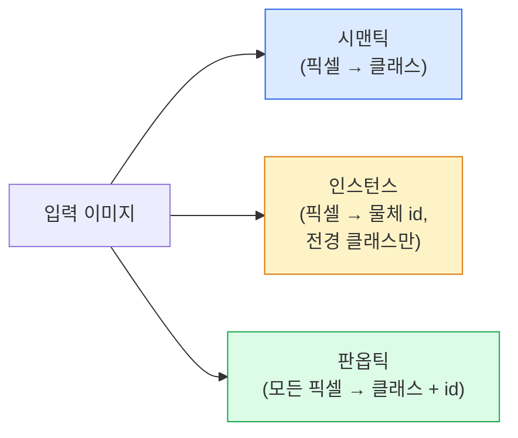
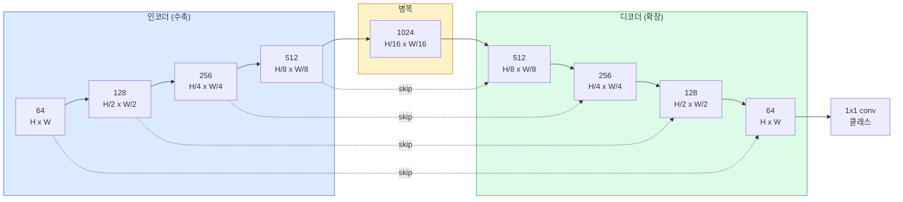

> 🇰🇷 이 문서는 한국어 번역본입니다(ELI5 스타일). 원문: [en.md](en.md)

# 시맨틱 세그멘테이션 — U-Net

> 세그멘테이션은 모든 픽셀에서 하는 분류입니다. U-Net은 다운샘플링 인코더와 업샘플링 디코더를 짝지어 그 사이에 스킵 연결을 놓는 방식으로 이걸 가능하게 만듭니다.

**유형:** 빌드
**언어:** Python
**선수 지식:** 페이즈 4 레슨 03(CNN), 페이즈 4 레슨 04(이미지 분류)
**시간:** 약 75분

## 학습 목표

- 시맨틱, 인스턴스, 판옵틱(panoptic) 세그멘테이션을 구분하고 주어진 문제에 알맞은 과제를 고릅니다
- 인코더 블록, 병목(bottleneck), 전치 합성곱(transposed convolution) 디코더, 스킵 연결로 PyTorch에서 U-Net을 밑바닥부터 만듭니다
- 픽셀별 크로스 엔트로피, Dice 손실, 그리고 의료·산업 세그멘테이션의 현재 기본값인 결합 손실을 구현합니다
- 클래스별 IoU와 Dice 지표를 읽고, 나쁜 점수가 소형 물체 recall 문제인지, 경계 정확도 문제인지, 클래스 불균형 문제인지 진단합니다

## 문제 상황

분류는 이미지당 레이블 하나를 출력합니다. 탐지는 이미지당 박스 몇 개를 출력합니다. 세그멘테이션은 픽셀당 레이블 하나를 출력합니다. 크기 `H x W` 입력에 출력은 `H x W`(시맨틱) 또는 `H x W x N_instances`(인스턴스) 텐서입니다. 이미지 하나가 아니라 이미지당 수백만 개의 예측입니다.

세그멘테이션의 구조 덕분에 조밀한 예측(dense prediction) 비전 제품 거의 전부가 이것 위에서 돌아갑니다: 의료 영상(종양 마스크), 자율 주행(도로, 차선, 장애물), 위성(건물 윤곽, 작물 경계), 문서 파싱(레이아웃 영역), 로보틱스(잡을 수 있는 영역). 그 어떤 과제도 물체에 박스를 치는 걸로는 풀리지 않습니다; 정확한 실루엣이 필요합니다.

아키텍처 문제는 말로는 간단하지만 푸는 건 간단하지 않습니다: 네트워크가 이미지의 전역 맥락(이게 무슨 장면인가)과 국소 픽셀 디테일(정확히 어느 픽셀이 도로이고 어느 픽셀이 인도인가)을 동시에 봐야 합니다. 표준 CNN은 맥락을 얻으려고 공간을 압축하고, 그 과정에서 디테일을 버립니다. U-Net은 둘 다 얻어낸 설계입니다.

## 개념

### 시맨틱 대 인스턴스 대 판옵틱



- **시맨틱**은 "이 픽셀은 도로, 저 픽셀은 자동차"라고 말합니다. 나란히 붙은 자동차 두 대는 한 덩어리로 뭉칩니다.
- **인스턴스**는 "이 픽셀은 자동차 3호, 저 픽셀은 자동차 5호"라고 말합니다. 배경 물질은 무시합니다("stuff" = 하늘, 도로, 잔디).
- **판옵틱**은 둘을 통합합니다: 모든 픽셀에 클래스 레이블, 모든 물체 인스턴스에 고유 id, 물질(stuff)과 물체(thing)를 모두 분할합니다.

이 레슨은 시맨틱을 다룹니다. 다음 레슨(Mask R-CNN)이 인스턴스입니다.

### U-Net의 모양



인코더는 공간 해상도를 네 번 절반으로 줄이고 채널을 두 배로 늘립니다. 디코더는 그 반대입니다: 공간 해상도를 네 번 두 배로, 채널은 절반으로. 스킵 연결은 모든 해상도에서 인코더 특성과 디코더 특성을 이어 붙입니다(concatenate). 마지막 1x1 conv가 풀 해상도에서 `64 -> num_classes`로 바꿉니다.

스킵 연결이 필요한 이유: 디코더는 픽셀 수준 예측을 내놓으려 할 때까지 작은 특성 맵만 봐 왔습니다. 스킵이 없으면 가장자리를 정확히 위치시킬 수 없습니다. 그 정보는 인코더에서 압축되어 버렸으니까요. 스킵 연결은 인코더가 내려가는 길에 계산한 고해상도 특성 맵을 디코더에게 건네 줍니다.

### 전치 합성곱 대 쌍선형 업샘플

디코더는 공간 차원을 늘려야 합니다. 두 가지 선택지:

- **전치 합성곱** (`nn.ConvTranspose2d`) — 학습 가능한 업샘플. 전통적 U-Net 기본값. stride와 커널 크기가 균등하게 나눠지지 않으면 체커보드 아티팩트가 생길 수 있습니다.
- **쌍선형 업샘플 + 3x3 conv** — 부드러운 업샘플 뒤에 conv. 아티팩트가 더 적고 파라미터도 더 적어, 요즘의 모던 기본값입니다.

둘 다 실전에서 만납니다. 첫 U-Net에는 쌍선형이 더 안전합니다.

### 픽셀 격자 위의 크로스 엔트로피

C클래스 시맨틱 세그멘테이션에서 모델 출력은 `(N, C, H, W)`입니다. 목표는 정수 클래스 ID를 담은 `(N, H, W)`입니다. 크로스 엔트로피는 분류 경우와 동일한데, 모든 공간 위치에 적용될 뿐입니다:

```
Loss = mean over (n, h, w) of -log( softmax(logits[n, :, h, w])[target[n, h, w]] )
```

PyTorch의 `F.cross_entropy`는 이 shape를 기본 처리합니다. reshape도 필요 없습니다.

### Dice 손실과 왜 필요한가

크로스 엔트로피는 모든 픽셀을 똑같이 취급합니다. 한 클래스가 프레임을 지배할 때는(의료 영상: 배경 99%, 종양 1%) 틀린 취급입니다. 네트워크는 전부 배경이라고 예측해 99% 정확도를 내고도 아무 쓸모가 없을 수 있습니다.

Dice 손실은 예측 마스크와 진짜 마스크의 겹침을 직접 최적화함으로써 이 문제를 풉니다:

```
Dice(p, y) = 2 * sum(p * y) / (sum(p) + sum(y) + epsilon)
Dice_loss = 1 - Dice
```

여기서 `p`는 클래스의 sigmoid/softmax 확률 맵, `y`는 이진 정답 마스크입니다. 겹침이 완벽할 때만 손실이 0입니다. 비율 기반이라서 클래스 불균형은 무관합니다.

실전에서는 **결합 손실**을 씁니다:

```
L = L_cross_entropy + lambda * L_dice       (lambda ~ 1)
```

크로스 엔트로피는 학습 초반에 안정적인 그래디언트를 주고, Dice는 학습 후반부를 실제 마스크 모양 맞추기에 집중시킵니다. 이 조합이 의료 영상의 기본값이고, 클래스 불균형 데이터셋에서는 이기기 어렵습니다.

### 평가 지표

- **픽셀 정확도** — 맞게 예측한 픽셀 비율. 쌉니다. 분류의 정확도와 같은 이유로 불균형 데이터에서는 망가집니다.
- **클래스별 IoU** — 각 클래스 마스크의 intersection over union; 클래스 평균이 mIoU.
- **Dice (픽셀판 F1)** — IoU와 비슷합니다; `Dice = 2 * IoU / (1 + IoU)`. 의료 영상은 Dice를, 자율 주행 커뮤니티는 IoU를 선호하지만 단조 관계라서 순위는 같습니다.
- **경계 F1** — 예측 경계가 정답 경계와 얼마나 가까운지 측정하며, 작은 어긋남도 벌합니다. 반도체 검사 같은 고정밀 과제에서 중요합니다.

mIoU만이 아니라 클래스별 IoU를 보고하세요. 평균 IoU는 나머지 아홉이 85%일 때 15%짜리 클래스 하나를 숨깁니다.

### 입력 해상도 트레이드오프

U-Net의 인코더는 해상도를 네 번 절반으로 줄이므로 입력은 16으로 나눠떨어져야 합니다. 의료 이미지는 흔히 512x512 또는 1024x1024입니다. 자율주행 크롭은 2048x1024입니다. U-Net의 메모리 비용은 `H * W * C_max`에 비례하고, 1024x1024에 1024채널 병목이면 forward pass만으로 이미 VRAM 기가바이트를 씁니다.

표준 우회법 두 가지:
1. 입력을 타일링 — 겹침이 있는 256x256 타일을 처리하고 이어 붙입니다.
2. 병목을 확장 합성곱(dilated convolution)으로 교체해 공간 해상도를 더 높게 유지하면서 수용 영역을 넓힙니다(DeepLab 계열).

첫 모델이라면 64채널 기본 U-Net에 256x256 입력으로 8GB VRAM에서 편하게 학습됩니다.

```figure
segmentation-flood
```

## 만들어 보기

### 단계 1: 인코더 블록

배치 정규화와 ReLU가 붙은 3x3 conv 두 개. 첫 conv가 채널 수를 바꾸고, 둘째는 유지합니다.

```python
import torch
import torch.nn as nn
import torch.nn.functional as F

class DoubleConv(nn.Module):
    def __init__(self, in_c, out_c):
        super().__init__()
        self.net = nn.Sequential(
            nn.Conv2d(in_c, out_c, kernel_size=3, padding=1, bias=False),
            nn.BatchNorm2d(out_c),
            nn.ReLU(inplace=True),
            nn.Conv2d(out_c, out_c, kernel_size=3, padding=1, bias=False),
            nn.BatchNorm2d(out_c),
            nn.ReLU(inplace=True),
        )

    def forward(self, x):
        return self.net(x)
```

이 블록은 곳곳에서 재사용됩니다. `bias=False`인 이유는 BN의 beta가 편향을 처리하기 때문입니다.

### 단계 2: Down과 Up 블록

```python
class Down(nn.Module):
    def __init__(self, in_c, out_c):
        super().__init__()
        self.net = nn.Sequential(
            nn.MaxPool2d(2),
            DoubleConv(in_c, out_c),
        )

    def forward(self, x):
        return self.net(x)


class Up(nn.Module):
    def __init__(self, in_c, out_c):
        super().__init__()
        self.up = nn.Upsample(scale_factor=2, mode="bilinear", align_corners=False)
        self.conv = DoubleConv(in_c, out_c)

    def forward(self, x, skip):
        x = self.up(x)
        if x.shape[-2:] != skip.shape[-2:]:
            x = F.interpolate(x, size=skip.shape[-2:], mode="bilinear", align_corners=False)
        x = torch.cat([skip, x], dim=1)
        return self.conv(x)
```

공간 전용 shape 검사(`shape[-2:]`)가 16으로 나눠떨어지지 않는 입력을 처리합니다; concat 전에 안전한 `F.interpolate`로 텐서를 맞춥니다. 전체 shape를 비교하면 채널 수 차이에서도 발동하는데, 그건 조용히 interpolate할 문제가 아니라 시끄럽게 날 오류여야 합니다.

### 단계 3: U-Net

```python
class UNet(nn.Module):
    def __init__(self, in_channels=3, num_classes=2, base=64):
        super().__init__()
        self.inc = DoubleConv(in_channels, base)
        self.d1 = Down(base, base * 2)
        self.d2 = Down(base * 2, base * 4)
        self.d3 = Down(base * 4, base * 8)
        self.d4 = Down(base * 8, base * 16)
        self.u1 = Up(base * 16 + base * 8, base * 8)
        self.u2 = Up(base * 8 + base * 4, base * 4)
        self.u3 = Up(base * 4 + base * 2, base * 2)
        self.u4 = Up(base * 2 + base, base)
        self.outc = nn.Conv2d(base, num_classes, kernel_size=1)

    def forward(self, x):
        x1 = self.inc(x)
        x2 = self.d1(x1)
        x3 = self.d2(x2)
        x4 = self.d3(x3)
        x5 = self.d4(x4)
        x = self.u1(x5, x4)
        x = self.u2(x, x3)
        x = self.u3(x, x2)
        x = self.u4(x, x1)
        return self.outc(x)

net = UNet(in_channels=3, num_classes=2, base=32)
x = torch.randn(1, 3, 256, 256)
print(f"output: {net(x).shape}")
print(f"params: {sum(p.numel() for p in net.parameters()):,}")
```

출력 shape `(1, 2, 256, 256)` — 입력과 같은 공간 크기, `num_classes` 채널. `base=32`에서 약 770만 파라미터.

### 단계 4: 손실들

```python
def dice_loss(logits, targets, num_classes, eps=1e-6):
    probs = F.softmax(logits, dim=1)
    targets_one_hot = F.one_hot(targets, num_classes).permute(0, 3, 1, 2).float()
    dims = (0, 2, 3)
    intersection = (probs * targets_one_hot).sum(dim=dims)
    denom = probs.sum(dim=dims) + targets_one_hot.sum(dim=dims)
    dice = (2 * intersection + eps) / (denom + eps)
    return 1 - dice.mean()


def combined_loss(logits, targets, num_classes, lam=1.0):
    ce = F.cross_entropy(logits, targets)
    dc = dice_loss(logits, targets, num_classes)
    return ce + lam * dc, {"ce": ce.item(), "dice": dc.item()}
```

Dice는 클래스별로 계산한 뒤 평균 냅니다(macro Dice). `eps`는 배치에 없는 클래스에서 0으로 나누는 것을 막습니다.

### 단계 5: IoU 지표

```python
@torch.no_grad()
def iou_per_class(logits, targets, num_classes):
    preds = logits.argmax(dim=1)
    ious = torch.zeros(num_classes)
    for c in range(num_classes):
        pred_c = (preds == c)
        true_c = (targets == c)
        inter = (pred_c & true_c).sum().float()
        union = (pred_c | true_c).sum().float()
        ious[c] = (inter / union) if union > 0 else torch.tensor(float("nan"))
    return ious
```

길이 C의 벡터를 반환합니다. `nan`은 배치에 없는 클래스를 표시합니다 — mIoU를 계산할 때 그것들을 평균에 넣지 마세요.

### 단계 6: 엔드투엔드 검증용 합성 데이터셋

네트워크가 픽셀 색이 아니라 모양을 배워야 하도록, 색 배경 위에 모양을 생성합니다.

```python
import numpy as np
from torch.utils.data import Dataset, DataLoader

def synthetic_segmentation(num_samples=200, size=64, seed=0):
    rng = np.random.default_rng(seed)
    images = np.zeros((num_samples, size, size, 3), dtype=np.float32)
    masks = np.zeros((num_samples, size, size), dtype=np.int64)
    for i in range(num_samples):
        bg = rng.uniform(0, 1, (3,))
        images[i] = bg
        masks[i] = 0
        num_shapes = rng.integers(1, 4)
        for _ in range(num_shapes):
            cls = int(rng.integers(1, 3))
            color = rng.uniform(0, 1, (3,))
            cx, cy = rng.integers(10, size - 10, size=2)
            r = int(rng.integers(4, 12))
            yy, xx = np.meshgrid(np.arange(size), np.arange(size), indexing="ij")
            if cls == 1:
                mask = (xx - cx) ** 2 + (yy - cy) ** 2 < r ** 2
            else:
                mask = (np.abs(xx - cx) < r) & (np.abs(yy - cy) < r)
            images[i][mask] = color
            masks[i][mask] = cls
        images[i] += rng.normal(0, 0.02, images[i].shape)
        images[i] = np.clip(images[i], 0, 1)
    return images, masks


class SegDataset(Dataset):
    def __init__(self, images, masks):
        self.images = images
        self.masks = masks

    def __len__(self):
        return len(self.images)

    def __getitem__(self, i):
        img = torch.from_numpy(self.images[i]).permute(2, 0, 1).float()
        mask = torch.from_numpy(self.masks[i]).long()
        return img, mask
```

세 클래스: 배경(0), 원(1), 사각형(2). 네트워크는 모양을 구분하는 법을 배워야 합니다.

### 단계 7: 학습 루프

```python
def train_one_epoch(model, loader, optimizer, device, num_classes):
    model.train()
    loss_sum, total = 0.0, 0
    iou_sum = torch.zeros(num_classes)
    for x, y in loader:
        x, y = x.to(device), y.to(device)
        logits = model(x)
        loss, _ = combined_loss(logits, y, num_classes)
        optimizer.zero_grad()
        loss.backward()
        optimizer.step()
        loss_sum += loss.item() * x.size(0)
        total += x.size(0)
        iou_sum += iou_per_class(logits, y, num_classes).nan_to_num(0)
    return loss_sum / total, iou_sum / len(loader)
```

합성 데이터셋에서 이것을 10~30 에포크 돌리면 모양 클래스의 mIoU가 0.9를 넘어 오르는 걸 볼 수 있습니다. `nan_to_num(0)`은 배치에 없는 클래스를 0으로 취급합니다; 정확한 클래스별 IoU를 위해서는 존재 여부로 마스킹하고, 여기서 평균 내지 말고 평가 시점에 배치들에 걸쳐 `torch.nanmean`을 쓰세요.

## 활용하기

프로덕션에서는 `segmentation_models_pytorch`("smp")가 모든 표준 세그멘테이션 아키텍처를 torchvision 또는 timm 백본과 함께 감싸 줍니다. 세 줄:

```python
import segmentation_models_pytorch as smp

model = smp.Unet(
    encoder_name="resnet34",
    encoder_weights="imagenet",
    in_channels=3,
    classes=3,
)
```

실전에서 알아둘 만한 것들:
- **DeepLabV3+**는 max-pool 기반 다운샘플링을 확장 합성곱으로 교체해 병목이 해상도를 유지하게 합니다; 위성과 주행 데이터에서 경계가 더 빨리 좋아집니다.
- **SegFormer**는 conv 인코더를 계층적 트랜스포머로 바꿉니다; 여러 벤치마크의 현재 SOTA.
- **Mask2Former** / **OneFormer**는 시맨틱, 인스턴스, 판옵틱 세그멘테이션을 단일 아키텍처로 통합합니다.

세 가지 모두 같은 데이터 로더로 `smp`나 `transformers`에서 그대로 갈아 끼울 수 있습니다.

## 출시하기

이 레슨의 산출물:

- `outputs/prompt-segmentation-task-picker.md` — 시맨틱, 인스턴스, 판옵틱 중 하나를 고르고 주어진 과제의 아키텍처를 이름 짓는 프롬프트.
- `outputs/skill-segmentation-mask-inspector.md` — 클래스 분포, 예측 마스크 통계, 과소 예측되거나 경계가 번진 클래스를 보고하는 스킬.

## 연습 문제

1. **(쉬움)** 이진 세그멘테이션 과제(전경 vs 배경)용 `bce_dice_loss`를 구현하세요. 전경이 픽셀의 5%일 때 합성 2클래스 데이터셋에서 결합 손실이 BCE 단독보다 빨리 수렴하는지 확인합니다.
2. **(보통)** `nn.Upsample + conv` 업 블록을 `nn.ConvTranspose2d` 업 블록으로 교체합니다. 둘 다 합성 데이터셋에서 학습하고 mIoU를 비교합니다. 전치 합성곱 버전에서 체커보드 아티팩트가 어디에 나타나는지 관찰합니다.
3. **(어려움)** 실제 세그멘테이션 데이터셋(Oxford-IIIT Pets, Cityscapes 미니 분할, 또는 의료 부분집합)을 가져와 U-Net을 `smp.Unet` 참고치의 2 IoU 포인트 이내로 학습합니다. 클래스별 IoU를 보고하고, 손실에 Dice를 더하면 어떤 클래스가 가장 큰 이득을 보는지 확인합니다.

## 핵심 용어

| 용어 | 사람들이 말하는 것 | 실제 의미 |
|------|----------------|----------------------|
| 시맨틱 세그멘테이션 | "모든 픽셀에 레이블" | C클래스로의 픽셀별 분류; 같은 클래스의 인스턴스는 합쳐짐 |
| 인스턴스 세그멘테이션 | "모든 물체에 레이블" | 같은 클래스의 서로 다른 인스턴스를 분리; 전경만 |
| 판옵틱 세그멘테이션 | "시맨틱 + 인스턴스" | 모든 픽셀에 클래스; 모든 물체(thing) 인스턴스에 고유 id |
| 스킵 연결(Skip connection) | "U-Net 다리" | 인코더 특성을 같은 해상도의 디코더 특성에 이어 붙이기; 고주파 디테일을 보존 |
| 전치 합성곱(Transposed conv) | "역합성곱(deconvolution)" | 학습 가능한 업샘플; 체커보드 아티팩트를 만들 수 있음 |
| Dice 손실(Dice loss) | "겹침 손실" | 1 - 2|A ∩ B| / (|A| + |B|); 마스크 겹침을 직접 최적화하고 클래스 불균형에 강건 |
| mIoU | "평균 intersection over union" | 클래스에 걸친 IoU 평균; 세그멘테이션의 커뮤니티 표준 지표 |
| 경계 F1(Boundary F1) | "경계 정확도" | 경계 픽셀만으로 계산한 F1 점수; 정밀도가 중요한 과제에서 중요 |

## 더 읽을거리

- [U-Net: Convolutional Networks for Biomedical Image Segmentation (Ronneberger et al., 2015)](https://arxiv.org/abs/1505.04597) — 원조 논문; 모두가 베끼는 그림은 2페이지에 있습니다
- [Fully Convolutional Networks (Long et al., 2015)](https://arxiv.org/abs/1411.4038) — 세그멘테이션을 처음 엔드투엔드 conv 문제로 만든 논문
- [segmentation_models_pytorch](https://github.com/qubvel/segmentation_models.pytorch) — 프로덕션 세그멘테이션의 참고 자료; 모든 표준 아키텍처와 모든 표준 손실
- [Lessons learned from training SOTA segmentation (kaggle.com competitions)](https://www.kaggle.com/code/iafoss/carvana-unet-pytorch) — 실제 데이터에서 TTA, 의사 레이블(pseudo-labeling), 클래스 가중치가 왜 중요한지 훑어 보기
