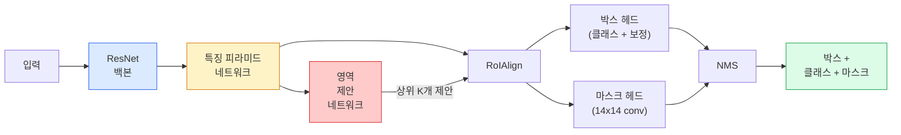

> 🇰🇷 이 문서는 한국어 번역본입니다(ELI5 스타일). 원문: [en.md](en.md)

# 인스턴스 세그멘테이션 — Mask R-CNN

> Faster R-CNN 검출기에 작은 마스크 브랜치만 붙이면 인스턴스 세그멘테이션이 됩니다. 문제는 RoIAlign인데, 이게 겉보기보다 훨씬 어렵습니다.

**유형:** Build + Learn (만들면서 배우기)
**언어:** Python
**선수 지식:** 페이즈 4 레슨 06(YOLO), 페이즈 4 레슨 07(U-Net)
**시간:** 약 75분

## 학습 목표

- Mask R-CNN 아키텍처를 처음부터 끝까지 따라가기: 백본, FPN, RPN, RoIAlign, 박스 헤드, 마스크 헤드
- RoIAlign을 직접 구현하고, RoIPool은 더 이상 쓰이지 않는 이유 설명하기
- torchvision의 `maskrcnn_resnet50_fpn_v2` 사전 학습 모델로 프로덕션(운영 환경) 수준의 인스턴스 마스크를 얻고, 출력 형식을 올바르게 읽기
- 박스 헤드와 마스크 헤드만 교체하고 백본은 얼려 둔 채, 작은 커스텀 데이터셋으로 Mask R-CNN 파인튜닝하기

## 문제 상황

시맨틱 세그멘테이션(semantic segmentation)은 클래스 하나당 마스크 하나를 줍니다. 인스턴스 세그멘테이션은 객체 하나당 마스크 하나를 줍니다. 두 객체가 같은 클래스를 공유해도 마찬가지입니다. 개체 수 세기, 프레임 사이 추적, 길이 재기(벽돌 벽에서 벽돌 하나하나의 바운딩 박스, 현미경 사진에서 세포 하나하나)는 모두 인스턴스 세그멘테이션이 필요합니다.

Mask R-CNN(He et al., 2017)은 인스턴스 세그멘테이션을 '검출 + 마스크' 문제로 다시 정의해서 이 문제를 풀었습니다. 설계가 너무 깔끔했기 때문에 그 후 5년 동안 거의 모든 인스턴스 세그멘테이션 논문이 Mask R-CNN 변형이었고, torchvision 구현은 지금도 중소 규모 데이터셋의 프로덕션 기본 선택으로 쓰입니다.

진짜 어려운 엔지니어링 문제는 샘플링입니다. 모서리가 픽셀 경계와 맞지 않는 제안 박스(proposal box)에서 고정 크기의 특성(feature) 영역을 어떻게 잘라낼까요? 여기서 틀리면 어디서든 mAP가 0.1포인트 단위로 깎입니다. 그 답이 RoIAlign입니다.

## 핵심 개념

### 아키텍처



이해해야 할 다섯 가지 구성 요소:

1. **백본(backbone)** — ImageNet으로 학습된 ResNet-50 또는 ResNet-101. 스트라이드(stride) 4, 8, 16, 32짜리 특징 맵 계층 구조를 만들어 냅니다.
2. **FPN(Feature Pyramid Network)** — 탑다운(top-down) 경로와 lateral 연결을 더해, 모든 레벨에 의미 정보가 풍부한 C채널짜리 특징을 공급합니다. 검출기는 객체 크기에 맞는 FPN 레벨을 골라 사용합니다.
3. **RPN(Region Proposal Network)** — 모든 앵커 위치에서 "여기 객체가 있는가?", "박스를 어떻게 보정할까?"를 예측하는 작은 conv 헤드입니다. 이미지당 약 1,000개의 제안(proposal)을 만들어 냅니다.
4. **RoIAlign** — 어떤 FPN 레벨의 어떤 박스에서든 고정 크기(예: 7x7) 특징 패치를 샘플링합니다. 쌍선형(bilinear) 샘플링을 쓰며, 좌표 양자화(반올림)가 전혀 없습니다.
5. **헤드들** — 박스를 보정하고 클래스를 고르는 두 층짜리 박스 헤드, 그리고 제안마다 `28x28` 이진 마스크를 출력하는 작은 conv 헤드로 이루어집니다.

### 왜 RoIPool이 아니라 RoIAlign인가

초기 Fast R-CNN은 RoIPool을 썼습니다. RoIPool은 제안 박스를 격자로 나누고, 각 칸에서 최댓값 특징을 고르며, 모든 좌표를 정수로 반올림합니다. 이 반올림 때문에 특징 맵과 입력 픽셀 좌표 사이가 최악의 경우 특징 맵 픽셀 하나만큼 어긋납니다. 224x224 이미지에서는 사소하지만, 특징 맵이 스트라이드 32이면 치명적입니다.

```
RoIPool:
  박스 (34.7, 51.3, 98.2, 142.9)
  반올림 -> (34, 51, 98, 142)
  격자 분할 -> 각 칸 경계를 또 반올림
  어긋남이 매 단계마다 누적됨

RoIAlign:
  박스 (34.7, 51.3, 98.2, 142.9)
  쌍선형 보간으로 정확한 실수 좌표에서 샘플링
  어디서도 반올림하지 않음
```

RoIAlign은 COCO에서 mask AP를 공짜로 3~4포인트 끌어올립니다. 위치 파악(localisation)을 중요하게 생각하는 검출기라면 이제 전부 RoIAlign을 씁니다. YOLOv7-seg, RT-DETR, Mask2Former 모두 마찬가지입니다.

### 한 문단으로 보는 RPN

특징 맵의 모든 위치에 크기와 모양이 서로 다른 K개의 앵커 박스를 놓습니다. 각 앵커마다 객체 존재 점수(objectness)와, 앵커를 더 잘 맞는 박스로 바꾸는 회귀 오프셋을 예측합니다. 점수 기준 상위 약 1,000개 박스를 남기고 IoU 0.7로 NMS를 적용한 뒤, 살아남은 박스를 헤드로 넘깁니다. RPN은 자체 미니 손실로 학습되는데, 구조는 레슨 6의 YOLO 손실과 같고 클래스만 두 개(객체 / 객체 아님)인 버전입니다.

### 마스크 헤드

각 제안(RoIAlign 이후)마다 마스크 헤드는 아주 작은 FCN입니다. 3x3 conv 네 개, 2배 업샘플링용 deconv, 마지막으로 `28x28` 해상도에 `num_classes`개 출력 채널을 내는 1x1 conv로 이루어집니다. 예측된 클래스에 해당하는 채널만 사용하고 나머지는 무시합니다. 덕분에 마스크 예측이 분류와 서로 분리(decoupling)됩니다.

28x28 마스크를 제안의 원래 픽셀 크기로 업샘플링하면 최종 이진 마스크가 됩니다.

### 손실 함수들

Mask R-CNN은 네 가지 손실을 모두 더한 형태입니다:

```
L = L_rpn_cls + L_rpn_box + L_box_cls + L_box_reg + L_mask
```

- `L_rpn_cls`, `L_rpn_box` — RPN 제안에 대한 객체 존재 점수 + 박스 회귀 손실입니다.
- `L_box_cls` — 헤드 분류기에서 (C+1)개 클래스(배경 포함)에 대한 크로스엔트로피입니다.
- `L_box_reg` — 헤드의 박스 보정에 대한 smooth L1 손실입니다.
- `L_mask` — 28x28 마스크 출력에 대한 픽셀별 이진 크로스엔트로피입니다.

각 손실에는 기본 가중치가 정해져 있고, torchvision 구현에서는 이 가중치를 생성자 인자로 조정할 수 있습니다.

### 출력 형식

`torchvision.models.detection.maskrcnn_resnet50_fpn_v2`는 이미지별로 딕셔너리 하나씩을 담은 리스트를 반환합니다:

```
{
    "boxes":  (N, 4) — (x1, y1, x2, y2) 픽셀 좌표,
    "labels": (N,) 클래스 ID, 0 = 배경이므로 실제 인덱스는 1부터 시작,
    "scores": (N,) 신뢰도 점수,
    "masks":  (N, 1, H, W) [0, 1] 범위의 float 마스크 — 0.5로 임계값을 넘기면 이진 마스크,
}
```

마스크는 이미 전체 이미지 해상도입니다. 28x28 헤드 출력이 내부적으로 업샘플링된 상태로 나옵니다.

```figure
cv3-roialign-sampling
```

## 만들어 보기

### 단계 1: RoIAlign을 직접 구현하기

Mask R-CNN의 구성 요소 가운데 유일하게, 글보다 코드로 보는 편이 더 이해하기 쉬운 부분입니다.

```python
import torch
import torch.nn.functional as F

def roi_align_single(feature, box, output_size=7, spatial_scale=1 / 16.0):
    """
    feature: (C, H, W) 단일 이미지 특징 맵
    box: 원본 이미지 픽셀 좌표계의 (x1, y1, x2, y2)
    output_size: 출력 격자의 한 변 크기 (박스 헤드는 7, 마스크 헤드는 14)
    spatial_scale: 특징 맵 스트라이드의 역수
    """
    C, H, W = feature.shape
    x1, y1, x2, y2 = [c * spatial_scale - 0.5 for c in box]
    bin_w = (x2 - x1) / output_size
    bin_h = (y2 - y1) / output_size

    grid_y = torch.linspace(y1 + bin_h / 2, y2 - bin_h / 2, output_size)
    grid_x = torch.linspace(x1 + bin_w / 2, x2 - bin_w / 2, output_size)
    yy, xx = torch.meshgrid(grid_y, grid_x, indexing="ij")

    gx = 2 * (xx + 0.5) / W - 1
    gy = 2 * (yy + 0.5) / H - 1
    grid = torch.stack([gx, gy], dim=-1).unsqueeze(0)
    sampled = F.grid_sample(feature.unsqueeze(0), grid, mode="bilinear",
                            align_corners=False)
    return sampled.squeeze(0)
```

모든 값이 쌍선형 샘플링된 위치에서 나옵니다. 반올림 없음, 양자화 없음, 손실되는 그래디언트도 없습니다.

### 단계 2: torchvision의 RoIAlign과 비교하기

```python
from torchvision.ops import roi_align

feature = torch.randn(1, 16, 50, 50)
boxes = torch.tensor([[0, 10, 20, 100, 90]], dtype=torch.float32)  # (batch_idx, x1, y1, x2, y2)

ours = roi_align_single(feature[0], boxes[0, 1:].tolist(), output_size=7, spatial_scale=1/4)
theirs = roi_align(feature, boxes, output_size=(7, 7), spatial_scale=1/4, sampling_ratio=1, aligned=True)[0]

print(f"shape ours:   {tuple(ours.shape)}")
print(f"shape theirs: {tuple(theirs.shape)}")
print(f"max|diff|:    {(ours - theirs).abs().max().item():.3e}")
```

`sampling_ratio=1`, `aligned=True`로 두면 두 결과가 `1e-5` 이내로 일치합니다.

### 단계 3: 사전 학습된 Mask R-CNN 불러오기

```python
import torch
from torchvision.models.detection import maskrcnn_resnet50_fpn_v2, MaskRCNN_ResNet50_FPN_V2_Weights

model = maskrcnn_resnet50_fpn_v2(weights=MaskRCNN_ResNet50_FPN_V2_Weights.DEFAULT)
model.eval()
print(f"params: {sum(p.numel() for p in model.parameters()):,}")
print(f"classes (including background): {len(model.roi_heads.box_predictor.cls_score.out_features * [0])}")
```

파라미터 4,600만 개, 클래스 91개(COCO)입니다. 첫 번째 클래스(id 0)는 배경이며, 모델이 실제로 검출하는 것들은 id 1부터 시작합니다.

### 단계 4: 추론 실행하기

```python
with torch.no_grad():
    x = torch.randn(3, 400, 600)
    predictions = model([x])
p = predictions[0]
print(f"boxes:  {tuple(p['boxes'].shape)}")
print(f"labels: {tuple(p['labels'].shape)}")
print(f"scores: {tuple(p['scores'].shape)}")
print(f"masks:  {tuple(p['masks'].shape)}")
```

마스크 텐서의 모양은 `(N, 1, H, W)`입니다. 0.5로 임계값을 적용하면 객체별 이진 마스크를 얻습니다:

```python
binary_masks = (p['masks'] > 0.5).squeeze(1)  # (N, H, W) 불리언
```

### 단계 5: 커스텀 클래스 수에 맞게 헤드 교체하기

흔히 쓰는 파인튜닝 레시피는 이렇습니다. 백본, FPN, RPN은 재사용하고 두 분류 헤드만 교체합니다.

```python
from torchvision.models.detection.faster_rcnn import FastRCNNPredictor
from torchvision.models.detection.mask_rcnn import MaskRCNNPredictor

def build_custom_maskrcnn(num_classes):
    model = maskrcnn_resnet50_fpn_v2(weights=MaskRCNN_ResNet50_FPN_V2_Weights.DEFAULT)
    in_features = model.roi_heads.box_predictor.cls_score.in_features
    model.roi_heads.box_predictor = FastRCNNPredictor(in_features, num_classes)
    in_features_mask = model.roi_heads.mask_predictor.conv5_mask.in_channels
    hidden_layer = 256
    model.roi_heads.mask_predictor = MaskRCNNPredictor(in_features_mask, hidden_layer, num_classes)
    return model

custom = build_custom_maskrcnn(num_classes=5)
print(f"custom cls_score.out_features: {custom.roi_heads.box_predictor.cls_score.out_features}")
```

`num_classes`에는 배경 클래스가 포함되어야 합니다. 객체 클래스가 4개인 데이터셋이라면 `num_classes=5`를 씁니다.

### 단계 6: 학습이 필요 없는 부분은 얼려 두기

데이터셋이 작으면 백본과 FPN을 얼립니다(freeze). 그러면 RPN의 객체 존재 점수 + 회귀와 두 헤드만 학습합니다.

```python
def freeze_backbone_and_fpn(model):
    # torchvision Mask R-CNN은 FPN을 `model.backbone` 안에(`model.backbone.fpn`으로)
    # 넣어 두기 때문에, `model.backbone.parameters()`를 순회하면 ResNet 특징 층과
    # FPN의 lateral/출력 conv가 모두 함께 다뤄집니다.
    for p in model.backbone.parameters():
        p.requires_grad = False
    return model

custom = freeze_backbone_and_fpn(custom)
trainable = sum(p.numel() for p in custom.parameters() if p.requires_grad)
print(f"trainable after freeze: {trainable:,}")
```

500장짜리 데이터셋에서는 이 선택이 '수렴'과 '과적합'의 차이를 만듭니다.

## 활용하기

torchvision에서 Mask R-CNN 학습 루프 전체는 40줄 정도이고, 작업이 바뀌어도 의미 있게 달라지지 않습니다. 데이터셋만 바꾸면 바로 돌아갑니다.

```python
def train_step(model, images, targets, optimizer):
    model.train()
    loss_dict = model(images, targets)
    losses = sum(loss for loss in loss_dict.values())
    optimizer.zero_grad()
    losses.backward()
    optimizer.step()
    return {k: v.item() for k, v in loss_dict.items()}
```

`targets` 리스트에는 이미지별 딕셔너리가 들어가며, 각 딕셔너리에 `boxes`, `labels`, `masks`(`(num_instances, H, W)` 이진 텐서)가 있어야 합니다. 모델은 학습 중에는 손실 네 개짜리 딕셔너리를, 평가 중에는 예측 리스트를 반환하며, 어느 쪽인지는 `model.training` 값으로 결정됩니다.

`pycocotools` 평가기는 박스와 마스크 각각에 대해 mAP@IoU=0.5:0.95를 계산해 줍니다. 두 숫자를 모두 봐야 병목이 박스 헤드인지 마스크 헤드인지 알 수 있습니다.

## 산출물

이 레슨에서 만드는 것:

- `outputs/prompt-instance-vs-semantic-router.md` — 질문 세 개로 인스턴스/시맨틱/파놉틱(panoptic) 중 무엇이 필요한지, 그리고 시작할 정확한 모델이 무엇인지 골라 주는 프롬프트입니다.
- `outputs/skill-mask-rcnn-head-swapper.md` — 새 `num_classes`만 주면 어떤 torchvision 검출 모델이든 헤드를 교체하는 10줄 코드를 만들어 주는 스킬입니다.

## 연습 문제

1. **(쉬움)** 무작위 박스 100개로 직접 만든 RoIAlign을 `torchvision.ops.roi_align`과 비교해 검증하세요. 최대 절대 오차를 보고하고, RoIPool(2017년 이전 방식)도 실행해 보서 경계 근처 박스에서 약 1~2개 특징 맵 픽셀만큼 어긋나는지 확인하세요.
2. **(보통)** 50장짜리 커스텀 데이터셋(풍선, 물고기, 포트홀, 로고 중 아무 두 클래스나)으로 `maskrcnn_resnet50_fpn_v2`를 파인튜닝하세요. 백본을 얼린 채 20 에포크 학습하고 mask AP@0.5를 보고하세요.
3. **(어려움)** Mask R-CNN의 마스크 헤드를 28x28 대신 56x56으로 예측하는 헤드로 교체하세요. 교체 전후의 mAP@IoU=0.75를 측정하고, 개선(또는 개선 없음)이 예상되는 경계 정밀도/메모리 트레이드오프와 일치하는지 설명하세요.

## 핵심 용어

| 용어 | 흔히 하는 말 | 실제 의미 |
|------|----------------|----------------------|
| Mask R-CNN | "검출에 마스크를 더한 것" | Faster R-CNN + 제안마다 클래스별 28x28 마스크를 예측하는 작은 FCN 헤드 |
| FPN | "특징 피라미드" | 탑다운 + lateral 연결로 모든 스트라이드 레벨에 의미 정보가 풍부한 C채널 특징을 공급하는 구조 |
| RPN | "영역 제안기" | 이미지당 약 1,000개의 객체/객체 아님 제안을 만들어 내는 작은 conv 헤드 |
| RoIAlign | "반올림 없는 크롭" | 실수 좌표 박스에서도 쌍선형 샘플링으로 고정 크기 특징 격자를 뽑아 내는 연산 |
| RoIPool | "2017년 이전 크롭" | RoIAlign과 목적은 같지만 박스 좌표를 반올림함. 이제는 폐기됨 |
| Mask AP | "인스턴스 mAP" | 박스 IoU 대신 마스크 IoU로 계산한 평균 정밀도. COCO 인스턴스 세그멘테이션 지표 |
| Binary mask head | "클래스별 마스크" | 제안마다 클래스별 이진 마스크를 하나씩 예측하며, 예측된 클래스의 채널만 사용 |
| Background class | "클래스 0" | "객체 없음"을 뜻하는 만능 클래스. 실제 클래스 인덱스는 1부터 시작 |

## 더 읽을거리

- [Mask R-CNN (He et al., 2017)](https://arxiv.org/abs/1703.06870) — 원문 논문. RoIAlign을 다룬 3절이 필독입니다
- [FPN: Feature Pyramid Networks (Lin et al., 2017)](https://arxiv.org/abs/1612.03144) — FPN 논문. 모든 현대 검출기가 사용합니다
- [torchvision Mask R-CNN 튜토리얼](https://pytorch.org/tutorials/intermediate/torchvision_tutorial.html) — 파인튜닝 루프의 표준 참고 자료
- [Detectron2 model zoo](https://github.com/facebookresearch/detectron2/blob/main/MODEL_ZOO.md) — 거의 모든 검출/세그멘테이션 변형에 대해 학습된 가중치를 갖춘 프로덕션 구현 모음
