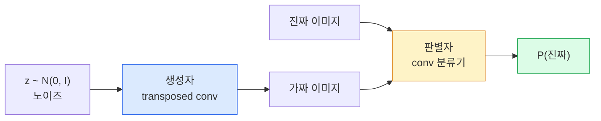
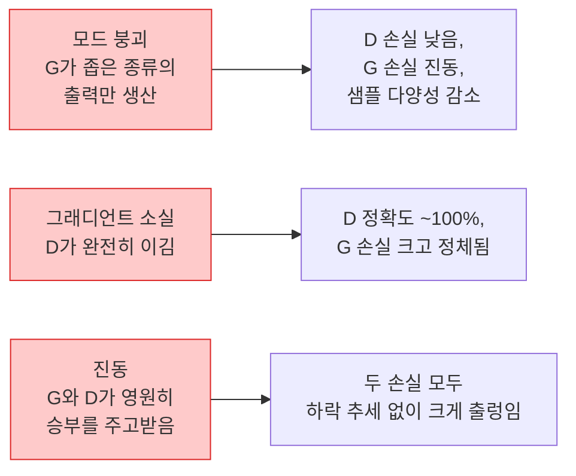

> 🇰🇷 이 문서는 한국어 번역본입니다(ELI5 스타일). 원문: [en.md](en.md)

# 이미지 생성 — GAN

> GAN은 정해진 게임을 하는 두 개의 신경망입니다. 하나는 그림을 그리고, 하나는 비평합니다. 그림이 비평가를 속일 때까지 둘은 함께 실력을 키웁니다.

**유형:** Build (직접 만들기)
**언어:** Python
**선수 지식:** 페이즈 4 레슨 03(CNN), 페이즈 3 레슨 06(옵티마이저), 페이즈 3 레슨 07(정규화)
**시간:** 약 75분

## 학습 목표

- 생성자와 판별자 사이의 미니맥스(minimax) 게임을 설명하고, 균형점이 왜 p_model = p_data에 해당하는지 설명하기
- PyTorch로 DCGAN을 구현해 60줄 이내에서 32x32 크기의 일관된 합성 이미지를 생성해 내기
- 세 가지 표준 트릭으로 GAN 학습을 안정화하기: non-saturating 손실, 스펙트럴 노멀라이제이션(spectral norm), TTUR(two-timescale update rule)
- 학습 곡선을 읽어 건강한 수렴과 모드 붕괴(mode collapse), 진동, 판별자 완승을 구분하기

## 문제 상황

분류는 이미지를 레이블에 대응시키는 법을 신경망에 가르칩니다. 생성은 이 문제를 뒤집습니다. 같은 분포에서 나온 것처럼 보이는 새 이미지를 뽑아 내는 것이죠. 비교해 볼 '정답' 출력은 없고, 흉내 내고 싶은 분포만 있을 뿐입니다.

표준 손실 함수(MSE, 크로스엔트로피)로는 '이 샘플이 실제 분포에서 나왔는가'를 잴 수 없습니다. 픽셀별 오차를 최소화하면 실제 같은 샘플이 아니라 흐릿한 평균 이미지가 나옵니다. 돌파구는 손실 자체를 학습하는 것이었습니다. 진짜와 가짜를 구별하는 게 임무인 두 번째 신경망을 학습시키고, 그 판단을 이용해 생성자를 밀어붙이는 방식입니다.

GAN(Goodfellow et al., 2014)이 이 프레임워크를 정의했습니다. 2018년 무렵 StyleGAN은 사진과 구별이 어려운 1024x1024 얼굴을 만들어 냈습니다. 이후 디퓨전(diffusion) 모델이 품질과 제어 가능성 면에서 왕좌를 가져갔지만, 디퓨전을 실용적으로 만드는 모든 트릭(정규화 선택, 잠재 공간, 특징 손실)은 처음에 GAN을 통해 이해됐던 것들입니다.

## 핵심 개념

### 두 개의 신경망



**생성자(generator)** G는 노이즈 벡터 `z`를 받아 이미지를 출력합니다. **판별자(discriminator)** D는 이미지를 받아 스칼라 하나를 출력합니다. 그 이미지가 진짜일 확률입니다.

### 게임

G는 D가 틀리길 원하고, D는 맞히길 원합니다. 수식으로 쓰면:

```
min_G max_D  E_x[log D(x)] + E_z[log(1 - D(G(z)))]
```

오른쪽부터 읽으면: D는 진짜 이미지(`log D(real)`)와 가짜 이미지(`log (1 - D(fake))`)에 대한 정확도를 최대화합니다. G는 가짜에 대한 D의 정확도를 최소화합니다. `D(G(z))`가 높아지기를 바라는 것이죠.

Goodfellow는 이 미니맥스가 전역 균형점을 가진다는 것을 증명했습니다. `p_G = p_data`가 되고, D는 모든 곳에서 0.5를 출력하며, 생성 분포와 실제 분포 사이의 Jensen-Shannon 발산이 0이 되는 지점입니다. 어려운 것은 그 지점에 도달하는 일입니다.

### Non-saturating 손실

위 수식은 수치적으로 불안정합니다. 학습 초반에는 모든 가짜에 대해 `D(G(z))`가 0에 가까워서, `log(1 - D(G(z)))`의 G에 대한 그래디언트가 사라집니다. 해결책은 G의 손실을 뒤집는 것입니다.

```
L_D = -E_x[log D(x)] - E_z[log(1 - D(G(z)))]
L_G = -E_z[log D(G(z))]                          # non-saturating 형태
```

이제 `D(G(z))`가 0에 가까우면 G의 손실은 커지고 그래디언트도 유의미합니다. 모든 현대 GAN이 이 변형으로 학습합니다.

### DCGAN 아키텍처 규칙

Radford, Metz, Chintala(2015)는 수년간의 실패한 실험을 GAN 학습을 안정화하는 다섯 가지 규칙으로 정리했습니다:

1. 풀링을 스트라이드 conv로 대체한다(두 신경망 모두).
2. 생성자와 판별자 양쪽에 배치 정규화(batch norm)를 쓴다. 단, G의 출력과 D의 입력은 예외로 한다.
3. 깊은 아키텍처에서는 완전연결(fully connected) 층을 제거한다.
4. G는 출력층을 제외한 모든 층에 ReLU를 쓴다(출력은 [-1, 1] 범위의 tanh).
5. D는 모든 층에 LeakyReLU(negative_slope=0.2)를 쓴다.

모든 현대 conv 기반 GAN(StyleGAN, BigGAN, GigaGAN)은 여전히 이 규칙에서 출발해 부품을 하나씩 교체해 갑니다.

### 실패 양상과 그 신호



- **모드 붕괴(mode collapse)**: G가 D를 속이는 이미지 하나를 찾고 그것만 계속 만들어 냅니다. 해결: minibatch discrimination, spectral norm, 레이블 조건화(label-conditioning)를 추가합니다.
- **판별자 완승**: D가 너무 빨리 너무 강해져서 G의 그래디언트가 사라집니다. 해결: D를 작게 만들거나, D 학습률을 낮추거나, 진짜 레이블에 레이블 스무딩(label smoothing)을 적용합니다.
- **진동**: 두 신경망이 균형점에 가까워지지 못한 채 승부만 계속 주고받습니다. 해결: TTUR(D가 G보다 2~4배 빠르게 학습)을 쓰거나 Wasserstein 손실로 전환합니다.

### 평가

GAN에는 정답(ground truth)이 없습니다. 그럼 잘 작동하는지 어떻게 알까요?

- **샘플 눈으로 확인** — 매 에포크가 끝날 때 샘플 64개를 그냥 눈으로 봅니다. 생략 불가입니다.
- **FID(Fréchet Inception Distance)** — 진짜 이미지 집합과 생성 이미지 집합의 Inception-v3 특징 분포 사이 거리. 낮을수록 좋습니다. 커뮤니티 표준 지표입니다.
- **Inception Score** — 더 오래됐고 깨지기 쉬운 지표입니다. FID를 쓰는 편이 좋습니다.
- **생성 모델용 정밀도/재현율** — 품질(precision)과 커버리지(recall)를 따로따로 측정합니다. FID 하나만 보는 것보다 정보가 많습니다.

소규모 합성 데이터 실험이라면 샘플을 눈으로 확인하는 것으로 충분합니다.

```figure
cv-gan-image
```

## 만들어 보기

### 단계 1: 생성자

64차원 노이즈를 받아 32x32 이미지를 만드는 작은 DCGAN 생성자입니다.

```python
import torch
import torch.nn as nn

class Generator(nn.Module):
    def __init__(self, z_dim=64, img_channels=3, feat=64):
        super().__init__()
        self.net = nn.Sequential(
            nn.ConvTranspose2d(z_dim, feat * 4, kernel_size=4, stride=1, padding=0, bias=False),
            nn.BatchNorm2d(feat * 4),
            nn.ReLU(inplace=True),
            nn.ConvTranspose2d(feat * 4, feat * 2, kernel_size=4, stride=2, padding=1, bias=False),
            nn.BatchNorm2d(feat * 2),
            nn.ReLU(inplace=True),
            nn.ConvTranspose2d(feat * 2, feat, kernel_size=4, stride=2, padding=1, bias=False),
            nn.BatchNorm2d(feat),
            nn.ReLU(inplace=True),
            nn.ConvTranspose2d(feat, img_channels, kernel_size=4, stride=2, padding=1, bias=False),
            nn.Tanh(),
        )

    def forward(self, z):
        return self.net(z.view(z.size(0), -1, 1, 1))
```

transposed conv 네 개로 이루어져 있고, 각각 `kernel_size=4, stride=2, padding=1`이라 공간 크기를 정확히 두 배로 늘립니다. 출력 활성값은 tanh 덕분에 [-1, 1] 범위입니다.

### 단계 2: 판별자

생성자의 거울상입니다. LeakyReLU와 스트라이드 conv로 이루어져 있고, 스칼라 로짓(logit) 하나로 끝납니다.

```python
class Discriminator(nn.Module):
    def __init__(self, img_channels=3, feat=64):
        super().__init__()
        self.net = nn.Sequential(
            nn.Conv2d(img_channels, feat, kernel_size=4, stride=2, padding=1),
            nn.LeakyReLU(0.2, inplace=True),
            nn.Conv2d(feat, feat * 2, kernel_size=4, stride=2, padding=1, bias=False),
            nn.BatchNorm2d(feat * 2),
            nn.LeakyReLU(0.2, inplace=True),
            nn.Conv2d(feat * 2, feat * 4, kernel_size=4, stride=2, padding=1, bias=False),
            nn.BatchNorm2d(feat * 4),
            nn.LeakyReLU(0.2, inplace=True),
            nn.Conv2d(feat * 4, 1, kernel_size=4, stride=1, padding=0),
        )

    def forward(self, x):
        return self.net(x).view(-1)
```

마지막 conv가 `4x4` 특징 맵을 `1x1`로 줄입니다. 출력은 이미지당 스칼라 하나이며, sigmoid는 손실을 계산할 때만 적용합니다.

### 단계 3: 학습 스텝

번갈아 진행합니다. 매 배치마다 D를 한 번 업데이트한 뒤 G를 한 번 업데이트합니다.

```python
import torch.nn.functional as F

def train_step(G, D, real, z, opt_g, opt_d, device):
    real = real.to(device)
    bs = real.size(0)

    # D 스텝
    opt_d.zero_grad()
    d_real = D(real)
    d_fake = D(G(z).detach())
    loss_d = (F.binary_cross_entropy_with_logits(d_real, torch.ones_like(d_real))
              + F.binary_cross_entropy_with_logits(d_fake, torch.zeros_like(d_fake)))
    loss_d.backward()
    opt_d.step()

    # G 스텝
    opt_g.zero_grad()
    d_fake = D(G(z))
    loss_g = F.binary_cross_entropy_with_logits(d_fake, torch.ones_like(d_fake))
    loss_g.backward()
    opt_g.step()

    return loss_d.item(), loss_g.item()
```

D 스텝의 `G(z).detach()`가 결정적입니다. D를 업데이트하는 동안에는 그래디언트가 G로 흘러 들어가면 안 됩니다. 이걸 깜빡하는 것이 초보자의 고전적 버그입니다.

### 단계 4: 합성 도형으로 전체 학습 루프 돌리기

```python
from torch.utils.data import DataLoader, TensorDataset
import numpy as np

def synthetic_images(num=2000, size=32, seed=0):
    rng = np.random.default_rng(seed)
    imgs = np.zeros((num, 3, size, size), dtype=np.float32) - 1.0
    for i in range(num):
        r = rng.uniform(6, 12)
        cx, cy = rng.uniform(r, size - r, size=2)
        yy, xx = np.meshgrid(np.arange(size), np.arange(size), indexing="ij")
        mask = (xx - cx) ** 2 + (yy - cy) ** 2 < r ** 2
        color = rng.uniform(-0.5, 1.0, size=3)
        for c in range(3):
            imgs[i, c][mask] = color[c]
    return torch.from_numpy(imgs)

device = "cuda" if torch.cuda.is_available() else "cpu"
data = synthetic_images()
loader = DataLoader(TensorDataset(data), batch_size=64, shuffle=True)

G = Generator(z_dim=64, img_channels=3, feat=32).to(device)
D = Discriminator(img_channels=3, feat=32).to(device)
opt_g = torch.optim.Adam(G.parameters(), lr=2e-4, betas=(0.5, 0.999))
opt_d = torch.optim.Adam(D.parameters(), lr=2e-4, betas=(0.5, 0.999))

for epoch in range(10):
    for (batch,) in loader:
        z = torch.randn(batch.size(0), 64, device=device)
        ld, lg = train_step(G, D, batch, z, opt_g, opt_d, device)
    print(f"epoch {epoch}  D {ld:.3f}  G {lg:.3f}")
```

`Adam(lr=2e-4, betas=(0.5, 0.999))`은 DCGAN의 기본값입니다. beta1을 낮게 잡아야 모멘텀 항이 적대적 게임을 지나치게 안정시키는 일을 막을 수 있습니다.

### 단계 5: 샘플링

```python
@torch.no_grad()
def sample(G, n=16, z_dim=64, device="cpu"):
    G.eval()
    z = torch.randn(n, z_dim, device=device)
    imgs = G(z)
    imgs = (imgs + 1) / 2
    return imgs.clamp(0, 1)
```

샘플링 전에는 항상 eval 모드로 전환하세요. DCGAN에서는 배치 통계 대신 배치 정규화의 누적 통계(running stats)가 쓰이기 때문에 이 차이가 실제로 중요합니다.

### 단계 6: 스펙트럴 정규화

판별자의 배치 정규화를 갈아 끼우는(drop-in) 대체재로, 네트워크가 1-립시츠(1-Lipschitz)임을 보장합니다. 'D가 너무 강함' 실패의 대부분을 고쳐 줍니다.

```python
from torch.nn.utils import spectral_norm

def build_sn_discriminator(img_channels=3, feat=64):
    return nn.Sequential(
        spectral_norm(nn.Conv2d(img_channels, feat, 4, 2, 1)),
        nn.LeakyReLU(0.2, inplace=True),
        spectral_norm(nn.Conv2d(feat, feat * 2, 4, 2, 1)),
        nn.LeakyReLU(0.2, inplace=True),
        spectral_norm(nn.Conv2d(feat * 2, feat * 4, 4, 2, 1)),
        nn.LeakyReLU(0.2, inplace=True),
        spectral_norm(nn.Conv2d(feat * 4, 1, 4, 1, 0)),
    )
```

`Discriminator`를 `build_sn_discriminator()`로 바꾸면 TTUR 트릭이 필요 없는 경우가 많습니다. 스펙트럴 노멀라이제이션은 적용할 수 있는 가장 쉬운 단일 견고성 업그레이드입니다.

## 활용하기

제대로 된 생성 작업이라면 사전 학습 가중치를 쓰거나 디퓨전으로 전환하세요. 표준 라이브러리 두 개:

- `torch_fidelity`는 커스텀 평가 코드를 짜지 않아도 생성기의 FID / IS를 계산해 줍니다.
- `pytorch-gan-zoo`(레거시)와 `StudioGAN`은 검증된 DCGAN, WGAN-GP, SN-GAN, StyleGAN, BigGAN 구현을 제공합니다.

2026년 기준으로 GAN이 여전히 최선인 선택인 분야는 실시간 이미지 생성(지연 시간 10ms 미만), 스타일 트랜스퍼, 정밀한 제어가 필요한 image-to-image 변환(Pix2Pix, CycleGAN)입니다. 사실성과 텍스트 조건부 생성에서는 디퓨전이 이깁니다.

## 산출물

이 레슨에서 만드는 것:

- `outputs/prompt-gan-training-triage.md` — 학습 곡선 설명을 읽고 실패 양상(모드 붕괴, D 완승, 진동)을 골라 권장 해결책 하나를 제시하는 프롬프트입니다.
- `outputs/skill-dcgan-scaffold.md` — `z_dim`, 목표 `image_size`, `num_channels`만 주면 학습 루프와 샘플 저장기까지 포함한 DCGAN 스캐폴드를 작성해 주는 스킬입니다.

## 연습 문제

1. **(쉬움)** 위의 DCGAN을 합성 원 데이터셋으로 학습시키고, 매 에포크 끝에 샘플 16개짜리 그리드를 저장하세요. 몇 번째 에포크쯤 생성된 원이 분명히 동그랗게 보이나요?
2. **(보통)** 판별자의 배치 정규화를 스펙트럴 노멀라이제이션으로 교체하세요. 두 버전을 나란히 학습시키고, 어느 쪽이 더 빨리 수렴하는지, 세 시드에서 어느 쪽 분산이 낮은지 답하세요.
3. **(어려움)** 조건부 DCGAN을 구현하세요. G와 D 양쪽에 클래스 레이블을 넣습니다(G에서는 원-핫 벡터를 노이즈에 연결, D에서는 클래스 임베딩 채널을 연결). 레슨 7의 합성 '원 vs 사각형' 데이터셋으로 학습시키고, 특정 레이블을 지정해 샘플링해서 클래스 조건화가 작동함을 보이세요.

## 핵심 용어

| 용어 | 흔히 하는 말 | 실제 의미 |
|------|----------------|----------------------|
| Generator (G) | "그림 그리는 신경망" | 노이즈를 이미지로 바꾸며, 판별자를 속이도록 학습됨 |
| Discriminator (D) | "비평가" | 이진 분류기. 진짜 이미지와 생성 이미지를 구별하도록 학습됨 |
| Minimax | "그 게임" | G에 대해 최소화하고 D에 대해 최대화하는 적대적 손실. 균형점은 p_G = p_data |
| Non-saturating loss | "수치적으로 제대로 된 버전" | 학습 초반 그래디언트 소실을 피하려고 G의 손실을 log(1 - D(G(z))) 대신 -log(D(G(z)))로 쓰는 것 |
| Mode collapse | "생성자가 한 가지만 만듦" | G가 데이터 분포의 일부만 만들어 냄. SN, minibatch discrimination, 더 큰 배치로 해결 |
| TTUR | "학습률 두 개" | D가 G보다, 보통 2~4배 빠르게 학습. 학습을 안정화함 |
| Spectral norm | "1-립시츠 층" | 각 층의 립시츠 상수를 묶어 두는 가중치 정규화. D가 무한정 가팔라지는 것을 막음 |
| FID | "Fréchet Inception Distance" | 진짜/생성 집합의 Inception-v3 특징 분포 사이 거리. 표준 평가 지표 |

## 더 읽을거리

- [Generative Adversarial Networks (Goodfellow et al., 2014)](https://arxiv.org/abs/1406.2661) — 모든 것을 시작한 논문
- [DCGAN (Radford, Metz, Chintala, 2015)](https://arxiv.org/abs/1511.06434) — GAN을 학습 가능하게 만든 아키텍처 규칙
- [Spectral Normalization for GANs (Miyato et al., 2018)](https://arxiv.org/abs/1802.05957) — 가장 쓸모 많은 단일 안정화 트릭
- [StyleGAN3 (Karras et al., 2021)](https://arxiv.org/abs/2106.12423) — SOTA GAN. 지난 10년간의 트릭을 모아 놓은 베스트 앨범처럼 읽힙니다
