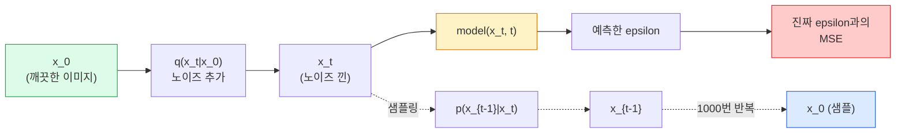

> 🇰🇷 이 문서는 한국어 번역본입니다(ELI5 스타일). 원문: [en.md](en.md)

# 이미지 생성 — 디퓨전 모델

> 디퓨전 모델은 노이즈 제거(denoising)를 배웁니다. 노이즈 낀 이미지에서 아주 조금의 노이즈만 제거하도록 학습시키고, 그 걸음을 거꾸로 천 번 반복하면 이미지 생성기가 완성됩니다.

**유형:** Build (직접 만들기)
**언어:** Python
**선수 지식:** 페이즈 4 레슨 07(U-Net), 페이즈 1 레슨 06(확률), 페이즈 3 레슨 06(옵티마이저)
**시간:** 약 75분

## 학습 목표

- 순방향 노이즈 과정 `x_0 -> x_1 -> ... -> x_T`를 유도하고, 닫힌 형태의 `q(x_t | x_0)`가 어떤 t에서도 성립하는 이유 설명하기
- 각 단계에서 추가된 노이즈를 회귀하는 DDPM식 학습 목표와, 순수 노이즈에서 이미지로 거슬러 올라가는 샘플러 구현하기
- 어떤 타임스텝의 노이즈든 예측하는, 시간 조건이 붙은 U-Net(CPU에서도 학습 가능한 크기) 만들기
- DDPM 샘플링과 DDIM 샘플링의 차이와 각각이 알맞은 상황 설명하기(레슨 23에서 flow matching과 rectified flow를 자세히 다룹니다)

## 문제 상황

GAN은 한 번에 생성합니다. 노이즈를 넣고 순전파 한 번에 이미지가 나오죠. 빠르지만 학습이 어렵습니다. 디퓨전 모델은 반복적으로 생성합니다. 순수 노이즈에서 시작해 작은 걸음으로 노이즈를 제거하면 이미지가 떠오릅니다. 느리지만 학습이 쉽습니다. 지난 5년간 주도한 것은 후자의 특성입니다. 작은 팀이라도 디퓨전 모델을 학습시키면 그럴듯한 샘플을 얻을 수 있는 반면, GAN 학습은 수년간의 실패한 실행을 겪으며 익혀야 하는 기술이기 때문입니다.

학습 안정성만이 아닙니다. 디퓨전의 반복 구조야말로 현대 이미지 생성의 모든 기능(텍스트 조건부 생성, 인페인팅, 이미지 편집, 초해상도, 제어 가능한 스타일)을 여는 열쇠입니다. 샘플링 루프의 매 걸음이 새로운 제약을 주입할 자리가 됩니다. 그래서 Stable Diffusion, Imagen, DALL-E 3, Midjourney, 그리고 여러분이 쓰게 될 모든 제어 가능한 이미지 모델이 전부 디퓨전 기반인 것입니다.

이 레슨은 최소한의 DDPM을 만듭니다. 순방향 노이즈 추가, 역방향 노이즈 제거, 학습 루프죠. 다음 레슨(Stable Diffusion)에서는 여기에 VAE, 텍스트 인코더, classifier-free guidance를 얹어 프로덕션(운영 환경) 시스템으로 조립합니다.

## 핵심 개념

### 순방향 과정

이미지 `x_0`를 가져옵니다. 가우시안 노이즈를 아주 조금 섞어 `x_1`을 만듭니다. 조금 더 섞어 `x_2`를 만듭니다. 이렇게 T단계를 거치면 `x_T`는 순수 가우시안 노이즈와 거의 구별되지 않습니다.

```
q(x_t | x_{t-1}) = N(x_t; sqrt(1 - beta_t) * x_{t-1},  beta_t * I)
```

`beta_t`는 작은 분산 스케줄로, 보통 T=1000단계에 걸쳐 0.0001에서 0.02까지 선형으로 늘어납니다. 매 단계마다 신호가 조금 줄어들고 새 노이즈가 주입됩니다.

### 닫힌 형태 도약

노이즈를 한 번에 한 단계씩 섞는 것은 마르코프 연쇄(Markov chain)지만, 수식을 접으면 `x_0`에서 `x_t`를 한 단계에 바로 샘플링할 수 있습니다.

```
Define alpha_t = 1 - beta_t
Define alpha_bar_t = prod_{s=1..t} alpha_s

Then:
  q(x_t | x_0) = N(x_t; sqrt(alpha_bar_t) * x_0,  (1 - alpha_bar_t) * I)

Equivalently:
  x_t = sqrt(alpha_bar_t) * x_0 + sqrt(1 - alpha_bar_t) * epsilon
  where epsilon ~ N(0, I)
```

이 한 줄 수식이 디퓨전이 실용적인 이유 전부입니다. 학습할 때는 무작위 `t`를 골라 `x_0`에서 `x_t`를 바로 샘플링하고 한 번에 학습합니다. 전체 마르코프 연쇄를 시뮬레이션할 필요가 없습니다.

### 역방향 과정

순방향 과정은 고정되어 있습니다. 신경망이 배우는 것은 역방향 과정 `p(x_{t-1} | x_t)`입니다. 디퓨전 모델은 `x_{t-1}`을 직접 예측하지 않고 t단계에서 더해진 노이즈 `epsilon`을 예측하며, 수식이 그로부터 `x_{t-1}`을 계산해 냅니다.



### 학습 손실

매 학습 스텝마다:

1. 실제 이미지 `x_0`를 샘플링합니다.
2. 타임스텝 `t`를 [1, T]에서 균등하게 샘플링합니다.
3. 노이즈 `epsilon ~ N(0, I)`를 샘플링합니다.
4. `x_t = sqrt(alpha_bar_t) * x_0 + sqrt(1 - alpha_bar_t) * epsilon`을 계산합니다.
5. 네트워크로 `epsilon_theta(x_t, t)`를 예측합니다.
6. `|| epsilon - epsilon_theta(x_t, t) ||^2`을 최소화합니다.

이게 전부입니다. 신경망은 어떤 타임스텝의 노이즈든 예측하는 법을 배웁니다. 손실은 MSE 하나입니다. 적대적 게임도, 붕괴도, 진동도 없습니다.

### 샘플러 (DDPM)

생성하려면 `x_T ~ N(0, I)`에서 시작해 한 번에 한 걸음씩 거꾸로 걸어갑니다.

```
for t = T, T-1, ..., 1:
    eps = model(x_t, t)
    x_{t-1} = (1 / sqrt(alpha_t)) * (x_t - (beta_t / sqrt(1 - alpha_bar_t)) * eps) + sqrt(beta_t) * z
    where z ~ N(0, I) if t > 1, else 0
return x_0
```

핵심은 이것입니다. 역방향 조건부 분포는 일반적으로 닫힌 형태로 알려져 있지 않지만, 이렇게 특수한 가우시안 순방향 과정에서는 알려져 있습니다. 그 복잡해 보이는 계수들이 베이즈 정리가 주는 결과입니다.

### 왜 1000단계인가

순방향 노이즈 스케줄은 각 단계가 딱 알맞은 양의 노이즈를 더해서 역방향 단계가 거의 가우시안이 되도록 고릅니다. 단계가 너무 적으면 역방향 단계가 가우시안에서 멀어져 네트워크가 제대로 모델링하지 못합니다. 너무 많으면 샘플링 비용만 늘고 얻는 이득은 점점 줄어듭니다. 선형 스케줄의 T=1000이 DDPM 기본값입니다.

### DDIM: 20배 빠른 샘플링

학습은 그대로입니다. 바뀌는 것은 샘플링입니다. DDIM(Song et al., 2020)은 재학습 없이 타임스텝을 건너뛰는 결정론적 역방향 과정을 정의합니다. DDIM으로 50단계 샘플링하면 1000단계 DDPM에 버금가는 품질이 나옵니다. 모든 프로덕션(운영 환경) 시스템은 DDIM이나 더 빠른 변형(DPM-Solver, Euler ancestral)을 사용합니다.

### 시간 조건부

네트워크 `epsilon_theta(x_t, t)`는 지금 몇 번째 타임스텝의 노이즈를 제거하는지 알아야 합니다. 현대 디퓨전 모델은 사인파 시간 임베딩(sinusoidal time embedding, 트랜스포머의 위치 인코딩과 같은 아이디어)으로 `t`를 주입하며, 이 임베딩이 U-Net의 모든 레벨에서 특징 맵에 더해집니다.

```
t_embedding = sinusoidal(t)
feature_map += MLP(t_embedding)
```

시간 조건이 없으면 네트워크가 이미지만 보고 노이즈 수준을 추측해야 합니다. 되긴 하지만 샘플 효율이 훨씬 떨어집니다.

```figure
cv-diffusion-image
```

## 만들어 보기

### 단계 1: 노이즈 스케줄

```python
import torch

def linear_beta_schedule(T=1000, beta_start=1e-4, beta_end=2e-2):
    return torch.linspace(beta_start, beta_end, T)


def precompute_schedule(betas):
    alphas = 1.0 - betas
    alphas_cumprod = torch.cumprod(alphas, dim=0)
    return {
        "betas": betas,
        "alphas": alphas,
        "alphas_cumprod": alphas_cumprod,
        "sqrt_alphas_cumprod": torch.sqrt(alphas_cumprod),
        "sqrt_one_minus_alphas_cumprod": torch.sqrt(1.0 - alphas_cumprod),
        "sqrt_recip_alphas": torch.sqrt(1.0 / alphas),
    }

schedule = precompute_schedule(linear_beta_schedule(T=1000))
```

한 번 미리 계산해 두고, 학습과 샘플링 때는 인덱스로 꺼내 씁니다.

### 단계 2: 순방향 확산 (q_sample)

```python
def q_sample(x0, t, noise, schedule):
    sqrt_a = schedule["sqrt_alphas_cumprod"][t].view(-1, 1, 1, 1)
    sqrt_one_minus_a = schedule["sqrt_one_minus_alphas_cumprod"][t].view(-1, 1, 1, 1)
    return sqrt_a * x0 + sqrt_one_minus_a * noise
```

한 줄짜리 닫힌 형태입니다. `t`는 타임스텝의 배치로, 배치 안의 이미지마다 하나씩입니다.

### 단계 3: 아주 작은 시간 조건 U-Net

```python
import torch.nn as nn
import torch.nn.functional as F
import math

def timestep_embedding(t, dim=64):
    half = dim // 2
    freqs = torch.exp(-math.log(10000) * torch.arange(half, device=t.device) / half)
    args = t[:, None].float() * freqs[None]
    emb = torch.cat([args.sin(), args.cos()], dim=-1)
    return emb


class TinyUNet(nn.Module):
    def __init__(self, img_channels=3, base=32, t_dim=64):
        super().__init__()
        self.t_mlp = nn.Sequential(
            nn.Linear(t_dim, base * 4),
            nn.SiLU(),
            nn.Linear(base * 4, base * 4),
        )
        self.t_dim = t_dim
        self.enc1 = nn.Conv2d(img_channels, base, 3, padding=1)
        self.enc2 = nn.Conv2d(base, base * 2, 4, stride=2, padding=1)
        self.mid = nn.Conv2d(base * 2, base * 2, 3, padding=1)
        self.dec1 = nn.ConvTranspose2d(base * 2, base, 4, stride=2, padding=1)
        self.dec2 = nn.Conv2d(base * 2, img_channels, 3, padding=1)
        self.time_proj = nn.Linear(base * 4, base * 2)

    def forward(self, x, t):
        t_emb = timestep_embedding(t, self.t_dim)
        t_emb = self.t_mlp(t_emb)
        t_proj = self.time_proj(t_emb)[:, :, None, None]

        h1 = F.silu(self.enc1(x))
        h2 = F.silu(self.enc2(h1)) + t_proj
        h3 = F.silu(self.mid(h2))
        d1 = F.silu(self.dec1(h3))
        d2 = torch.cat([d1, h1], dim=1)
        return self.dec2(d2)
```

병목 지점에 시간 조건을 주입한 두 레벨짜리 U-Net입니다. 실제 이미지를 다루려면 깊이와 너비를 키우세요.

### 단계 4: 학습 루프

```python
def train_step(model, x0, schedule, optimizer, device, T=1000):
    model.train()
    x0 = x0.to(device)
    bs = x0.size(0)
    t = torch.randint(0, T, (bs,), device=device)
    noise = torch.randn_like(x0)
    x_t = q_sample(x0, t, noise, schedule)
    pred = model(x_t, t)
    loss = F.mse_loss(pred, noise)
    optimizer.zero_grad()
    loss.backward()
    optimizer.step()
    return loss.item()
```

이것이 학습 루프 전부입니다. GAN 게임도 없고, 특수한 손실도 없이 MSE 호출 하나입니다.

### 단계 5: 샘플러 (DDPM)

```python
@torch.no_grad()
def sample(model, schedule, shape, T=1000, device="cpu"):
    model.eval()
    x = torch.randn(shape, device=device)
    betas = schedule["betas"].to(device)
    sqrt_one_minus_a = schedule["sqrt_one_minus_alphas_cumprod"].to(device)
    sqrt_recip_alphas = schedule["sqrt_recip_alphas"].to(device)

    for t in reversed(range(T)):
        t_batch = torch.full((shape[0],), t, dtype=torch.long, device=device)
        eps = model(x, t_batch)
        coef = betas[t] / sqrt_one_minus_a[t]
        mean = sqrt_recip_alphas[t] * (x - coef * eps)
        if t > 0:
            x = mean + torch.sqrt(betas[t]) * torch.randn_like(x)
        else:
            x = mean
    return x
```

샘플 배치 하나를 만드는 데 순전파 1000번이 듭니다. 실제 코드에서는 이것을 DDIM 50단계 샘플러로 바꿔 씁니다.

### 단계 6: DDIM 샘플러 (결정론적, 약 20배 빠름)

```python
@torch.no_grad()
def sample_ddim(model, schedule, shape, steps=50, T=1000, device="cpu", eta=0.0):
    model.eval()
    x = torch.randn(shape, device=device)
    alphas_cumprod = schedule["alphas_cumprod"].to(device)

    ts = torch.linspace(T - 1, 0, steps + 1).long()
    for i in range(steps):
        t = ts[i]
        t_prev = ts[i + 1]
        t_batch = torch.full((shape[0],), t, dtype=torch.long, device=device)
        eps = model(x, t_batch)
        a_t = alphas_cumprod[t]
        a_prev = alphas_cumprod[t_prev] if t_prev >= 0 else torch.tensor(1.0, device=device)
        x0_pred = (x - torch.sqrt(1 - a_t) * eps) / torch.sqrt(a_t)
        sigma = eta * torch.sqrt((1 - a_prev) / (1 - a_t) * (1 - a_t / a_prev))
        dir_xt = torch.sqrt(1 - a_prev - sigma ** 2) * eps
        noise = sigma * torch.randn_like(x) if eta > 0 else 0
        x = torch.sqrt(a_prev) * x0_pred + dir_xt + noise
    return x
```

`eta=0`이면 완전히 결정론적입니다(같은 노이즈 입력이면 항상 같은 출력). `eta=1`이면 DDPM으로 돌아갑니다.

## 활용하기

프로덕션 작업이라면 `diffusers`를 쓰세요:

```python
from diffusers import DDPMScheduler, UNet2DModel

unet = UNet2DModel(sample_size=32, in_channels=3, out_channels=3, layers_per_block=2)
scheduler = DDPMScheduler(num_train_timesteps=1000)
```

이 라이브러리는 바로 쓸 수 있는 스케줄러(DDPM, DDIM, DPM-Solver, Euler, Heun), 설정 가능한 U-Net, 텍스트-이미지 및 이미지-이미지 파이프라인, LoRA 파인튜닝 헬퍼를 제공합니다.

연구용으로는 `k-diffusion`(Katherine Crowson)이 가장 충실한 참조 구현과 가장 좋은 샘플링 변형을 갖추고 있습니다.

## 산출물

이 레슨에서 만드는 것:

- `outputs/prompt-diffusion-sampler-picker.md` — 품질 목표, 지연 시간 예산, 조건부 유형에 따라 DDPM / DDIM / DPM-Solver / Euler 중 하나를 골라 주는 프롬프트입니다.
- `outputs/skill-noise-schedule-designer.md` — T와 목표 훼손 수준이 주어지면 선형/코사인/시그모이드 베타 스케줄을 만들고, 시간에 따른 신호 대 잡음비 진단 그래프까지 그려 주는 스킬입니다.

## 연습 문제

1. **(쉬움)** 순방향 과정을 시각화하세요. 이미지 하나를 골라 `t in [0, 100, 250, 500, 750, 1000]`에서 `x_t`를 그려 보세요. `x_1000`이 순수 가우시안 노이즈처럼 보이는지 확인합니다.
2. **(보통)** 합성 원 데이터셋으로 TinyUNet을 20 에포크 학습시키고 원 16개를 샘플링하세요. DDPM(1000단계)과 DDIM(50단계) 샘플링을 비교합니다. 같은 노이즈 시드에서 비슷한 이미지가 나오나요?
3. **(어려움)** 코사인 노이즈 스케줄(Nichol & Dhariwal, 2021)을 구현하세요: `alpha_bar_t = cos^2((t/T + s) / (1 + s) * pi / 2)`. 같은 모델을 선형 스케줄과 코사인 스케줄로 각각 학습시키고, 단계 수가 적을 때 코사인이 더 좋은 샘플을 낸다는 것을 보이세요.

## 핵심 용어

| 용어 | 흔히 하는 말 | 실제 의미 |
|------|----------------|----------------------|
| Forward process | "시간이 지나며 노이즈를 더함" | T단계에 걸쳐 이미지를 가우시안 노이즈로 망가뜨리는 고정된 마르코프 연쇄 |
| Reverse process | "한 걸음씩 노이즈 제거" | 노이즈에서 이미지로 거슬러 올라가는, 학습된 분포 |
| Epsilon prediction | "노이즈를 예측" | 학습 목표: `epsilon_theta(x_t, t)`가 t단계에서 더해진 노이즈를 예측 |
| Beta schedule | "노이즈 양" | 단계마다 얼마나 노이즈가 들어갈지 정하는 T개의 작은 분산 수열 |
| alpha_bar_t | "누적 유지 계수" | 시각 t까지의 (1 - beta_s) 곱. t가 클수록 남은 신호가 적음 |
| DDPM sampler | "조상적(ancestral), 확률적" | 각 x_{t-1}을 그 조건부 가우시안에서 샘플링. 1000단계 |
| DDIM sampler | "결정론적, 빠름" | 샘플링을 결정론적 ODE로 다시 씀. 20-100단계로 비슷한 품질 |
| Time conditioning | "모델에게 t를 알려줌" | U-Net에 주입되는 t의 사인파 임베딩. 네트워크가 노이즈 수준을 알게 함 |

## 더 읽을거리

- [Denoising Diffusion Probabilistic Models (Ho et al., 2020)](https://arxiv.org/abs/2006.11239) — 디퓨전을 실용적으로 만들고 FID에서 GAN을 이긴 논문
- [Improved DDPM (Nichol & Dhariwal, 2021)](https://arxiv.org/abs/2102.09672) — 코사인 스케줄과 v-파라미터화
- [DDIM (Song, Meng, Ermon, 2020)](https://arxiv.org/abs/2010.02502) — 실시간 추론을 가능하게 만든 결정론적 샘플러
- [Elucidating the Design Space of Diffusion (Karras et al., 2022)](https://arxiv.org/abs/2206.00364) — 모든 디퓨전 설계 선택을 한곳에서 통합해 본 시각. 현재 최고의 참고 자료
