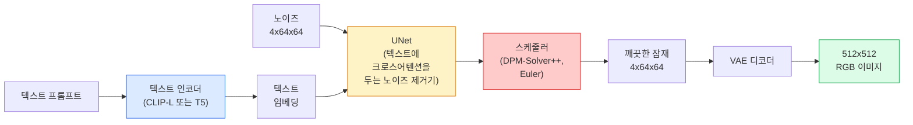

> 🇰🇷 이 문서는 한국어 번역본입니다(ELI5 스타일). 원문: [en.md](en.md)

# Stable Diffusion — 아키텍처와 파인튜닝

> Stable Diffusion은 사전 학습된 VAE의 잠재 공간(latent space)에서 돌아가는 DDPM입니다. 크로스어텐션으로 텍스트 조건을 받고, 빠른 결정론적 ODE 솔버로 샘플링하며, classifier-free guidance로 방향을 조절합니다.

**유형:** Learn + Use (배우고 활용하기)
**언어:** Python
**선수 지식:** 페이즈 4 레슨 10(디퓨전), 페이즈 7 레슨 02(셀프 어텐션)
**시간:** 약 75분

## 학습 목표

- Stable Diffusion 파이프라인의 다섯 가지 구성 요소를 따라가기: VAE, 텍스트 인코더, U-Net, 스케줄러, 안전성 검사기 — 그리고 각각이 실제로 하는 일
- 잠재 확산(latent diffusion) 설명하기. 3x512x512 이미지 대신 4x64x64 잠재 공간에서 학습하면 품질 손실 없이 연산량이 48배 줄어드는 이유
- `diffusers`로 이미지 생성, image-to-image, 인페인팅, ControlNet 유도 생성 실행하기
- 작은 커스텀 데이터셋으로 LoRA 파인튜닝을 하고, 추론 때 LoRA 어댑터 불러오기

## 문제 상황

512x512 RGB 이미지로 DDPM을 직접 학습시키는 일은 비쌉니다. 매 학습 스텝마다 3x512x512 = 786,432개 입력 값을 다루는 U-Net을 역전파로 통과하고, 샘플링은 같은 U-Net을 50번 이상 순전파해야 합니다. Stable Diffusion 1.5(2022년 공개) 수준의 품질이라면 픽셀 공간 디퓨전은 학습에 대략 256 GPU-개월이 필요하고, 소비자용 GPU에서 이미지 한 장에 10-30초가 듭니다.

오픈 웨이트(open-weight) 텍스트-이미지 생성을 실용적으로 만든 묘수는 **잠재 확산(latent diffusion)**(Rombach et al., CVPR 2022)입니다. 3x512x512 이미지를 4x64x64 잠재 텐서로 바꿨다 되돌리는 VAE를 학습시키고, 디퓨전은 그 잠재 공간에서 진행합니다. 연산량은 `(3*512*512)/(4*64*64) = 48배` 줄어듭니다. 샘플링은 같은 GPU에서 수십 초 걸리던 것이 2초 미만으로 내려갑니다.

거의 모든 현대 이미지 생성 모델(SDXL, SD3, FLUX, HunyuanDiT, Wan-Video)은 오토인코더, 노이즈 제거기(U-Net 또는 DiT), 텍스트 조건부에 변형을 가한 잠재 확산 모델입니다. Stable Diffusion을 배우면 이 템플릿을 배운 것이나 다름없습니다.

## 핵심 개념

### 파이프라인



- **VAE** — 얼려 둔(고정된) 오토인코더. 인코더는 이미지를 잠재 표현으로 바꾸고(img2img와 학습에 사용), 디코더는 잠재 표현을 다시 이미지로 되돌립니다.
- **텍스트 인코더** — CLIP 텍스트 인코더(SD 1.x/2.x), CLIP-L + CLIP-G(SDXL), 또는 T5-XXL(SD3/FLUX). 토큰 임베딩의 수열을 만들어 냅니다.
- **U-Net** — 노이즈 제거기입니다. 모든 해상도 레벨에서 잠재 표현이 텍스트 임베딩을 보는(attend) 크로스어텐션 층을 갖고 있습니다.
- **스케줄러** — 샘플링 알고리즘입니다(DDIM, Euler, DPM-Solver++). 시그마를 고르고, 예측한 노이즈를 잠재 표현에 다시 섞어 넣습니다.
- **안전성 검사기** — 출력 이미지에 선택적으로 거는 NSFW/불법 콘텐츠 필터입니다.

### Classifier-free guidance (CFG)

일반 텍스트 조건부는 프롬프트 `c`마다 `epsilon_theta(x_t, t, c)`를 학습합니다. CFG는 같은 네트워크를 학습할 때 10% 확률로 `c`를 빼고(빈 임베딩으로 대체) 조건부 노이즈와 무조건부 노이즈를 둘 다 예측하는 모델 하나를 만듭니다. 추론 때는:

```
eps = eps_uncond + w * (eps_cond - eps_uncond)
```

`w`는 가이던스 스케일입니다. `w=0`은 무조건부, `w=1`은 일반 조건부, `w>1`은 다양성을 희생하면서 출력을 "프롬프트에 더 강하게 조건부"인 쪽으로 밉니다. SD 기본값은 `w=7.5`입니다.

CFG 덕분에 텍스트-이미지 생성이 프로덕션(운영 환경) 품질로 작동합니다. CFG가 없으면 프롬프트는 출력을 약하게 기울이는 데 그치지만, 있으면 프롬프트가 지배합니다.

### 잠재 공간의 기하학

VAE의 4채널 잠재 표현은 단순한 압축 이미지가 아닙니다. 이곳은 산술 연산이 대략 의미 편집에 대응하는 다양체(manifold)이고(프롬프트 엔지니어링과 보간이 모두 이 자리를 씁니다), 디퓨전 U-Net이 자신의 모델링 자원을 전부 쏟도록 학습된 곳이기도 합니다. 무작위 4x64x64 잠재 표현을 디코딩하면 무작위처럼 보이는 이미지가 나오는 게 아니라 쓰레기가 나옵니다. 유효한 이미지로 디코딩되는 것은 잠재 공간의 특정 부분 다양체뿐이기 때문입니다.

두 가지 결과가 따라옵니다:

1. **Img2img** = 이미지를 잠재 표현으로 인코딩하고, 부분 노이즈를 더하고, 노이즈 제거기를 돌리고, 디코딩합니다. 인코딩이 거의 역변환이라 이미지 구조는 살아남고, 내용은 프롬프트에 따라 바뀝니다.
2. **인페인팅** = img2img와 같지만 노이즈 제거기가 마스크 영역만 갱신합니다. 마스크 밖 영역은 인코딩된 잠재 표현 그대로 유지됩니다.

### U-Net 아키텍처

SD의 U-Net은 레슨 10의 TinyUNet을 키운 버전에 세 가지를 더한 것입니다:

- 모든 공간 해상도에 **트랜스포머 블록**이 들어가며, 셀프 어텐션 + 텍스트 임베딩으로의 크로스어텐션을 담습니다.
- 사인파 인코딩 위에 MLP를 얹은 **시간 임베딩**.
- 같은 해상도끼리 인코더와 디코더를 잇는 **스킵 연결**.

파라미터 수는 SD 1.5가 약 8억 6천만, SDXL이 약 26억, FLUX가 약 120억입니다. 파라미터 증가분은 대부분 어텐션 층에 있습니다.

### LoRA 파인튜닝

Stable Diffusion 전체 파인튜닝은 VRAM 20GB 이상을 요구하고 8억 6천만 개 파라미터를 갱신합니다. LoRA(Low-Rank Adaptation)는 베이스 모델을 얼려 둔 채 어텐션 층에 작은 저계수 분해(rank-decomposition) 행렬을 주입합니다. SD용 LoRA 어댑터는 보통 10-50MB이고, 소비자용 GPU 한 장으로 10-60분 안에 학습되며, 추론 때 갈아 끼우는(drop-in) 수정으로 불러올 수 있습니다.

```
Original: W_q : (d_in, d_out)   frozen
LoRA:     W_q + alpha * (A @ B)   where A : (d_in, r), B : (r, d_out)

r is typically 4-32.
```

거의 모든 커뮤니티 파인튜닝이 LoRA 형태로 배포됩니다. CivitAI와 Hugging Face에는 수백만 개가 올라와 있습니다.

### 마주치게 될 스케줄러들

- **DDIM** — 결정론적, 약 50단계, 단순함.
- **Euler ancestral** — 확률적, 30-50단계, 샘플이 약간 더 창의적.
- **DPM-Solver++ 2M Karras** — 결정론적, 20-30단계, 프로덕션 기본값.
- **LCM / TCD / Turbo** — consistency 모델과 증류 변형들. 약간의 품질을 희생하고 1-4단계.

`diffusers`에서 스케줄러 교체는 한 줄 바꾸기이며, 재학습 없이 샘플 문제를 고쳐 주기도 합니다.

```figure
cv3-latent-compression
```

## 만들어 보기

이 레슨은 Stable Diffusion을 처음부터 다시 만들지 않고 `diffusers`를 끝까지 사용합니다. 다시 만들어야 할 부품들(VAE, 텍스트 인코더, U-Net, 스케줄러)은 각자 별도의 레슨 주제입니다. 여기서의 목표는 프로덕션 API에 익숙해지는 것입니다.

### 단계 1: 텍스트-이미지

```python
import torch
from diffusers import StableDiffusionPipeline

pipe = StableDiffusionPipeline.from_pretrained(
    "runwayml/stable-diffusion-v1-5",
    torch_dtype=torch.float16,
).to("cuda")

image = pipe(
    prompt="a dog riding a skateboard in tokyo, studio ghibli style",
    guidance_scale=7.5,
    num_inference_steps=25,
    generator=torch.Generator("cuda").manual_seed(42),
).images[0]
image.save("dog.png")
```

`float16`은 눈에 띄는 품질 저하 없이 VRAM을 절반으로 줄입니다. 기본 DPM-Solver++에서 `num_inference_steps=25`는 DDIM의 `num_inference_steps=50`에 맞먹습니다.

### 단계 2: 스케줄러 교체

```python
from diffusers import DPMSolverMultistepScheduler, EulerAncestralDiscreteScheduler

pipe.scheduler = DPMSolverMultistepScheduler.from_config(pipe.scheduler.config)
pipe.scheduler = EulerAncestralDiscreteScheduler.from_config(pipe.scheduler.config)
```

스케줄러 상태는 U-Net 가중치와 분리되어 있습니다. DDPM으로 학습하고 어떤 스케줄러로든 샘플링할 수 있습니다.

### 단계 3: Image-to-image

```python
from diffusers import StableDiffusionImg2ImgPipeline
from PIL import Image

img2img = StableDiffusionImg2ImgPipeline.from_pretrained(
    "runwayml/stable-diffusion-v1-5",
    torch_dtype=torch.float16,
).to("cuda")

init_image = Image.open("dog.png").convert("RGB").resize((512, 512))
out = img2img(
    prompt="a dog riding a skateboard, oil painting",
    image=init_image,
    strength=0.6,
    guidance_scale=7.5,
).images[0]
```

`strength`는 노이즈 제거 전에 얼마나 노이즈를 더할지 정합니다(0.0 = 그대로, 1.0 = 완전 재생성). 0.5-0.7이 스타일 트랜스퍼의 표준 범위입니다.

### 단계 4: 인페인팅

```python
from diffusers import StableDiffusionInpaintPipeline

inpaint = StableDiffusionInpaintPipeline.from_pretrained(
    "runwayml/stable-diffusion-inpainting",
    torch_dtype=torch.float16,
).to("cuda")

image = Image.open("dog.png").convert("RGB").resize((512, 512))
mask = Image.open("dog_mask.png").convert("L").resize((512, 512))

out = inpaint(
    prompt="a cat",
    image=image,
    mask_image=mask,
    guidance_scale=7.5,
).images[0]
```

마스크에서 흰 픽셀이 재생성할 영역입니다. 검은 픽셀은 보존됩니다.

### 단계 5: LoRA 불러오기

```python
pipe.load_lora_weights("sayakpaul/sd-lora-ghibli")
pipe.fuse_lora(lora_scale=0.8)

image = pipe(prompt="a village square in ghibli style").images[0]
```

`lora_scale`은 세기를 조절합니다. 0.0 = 효과 없음, 1.0 = 최대 효과. `fuse_lora`는 속도를 위해 어댑터를 가중치에 그 자리에서 구워 넣지만, 그 대신 교체가 막힙니다. 다른 어댑터를 불러오기 전에 `pipe.unfuse_lora()`를 호출하세요.

### 단계 6: LoRA 학습 (개요)

실제 LoRA 학습 코드는 `peft`나 `diffusers.training`에 들어 있습니다. 개요는 이렇습니다:

```python
# 의사코드
for step, batch in enumerate(dataloader):
    images, prompts = batch
    latents = vae.encode(images).latent_dist.sample() * 0.18215

    t = torch.randint(0, num_train_timesteps, (batch_size,))
    noise = torch.randn_like(latents)
    noisy_latents = scheduler.add_noise(latents, noise, t)

    text_emb = text_encoder(tokenizer(prompts))

    pred_noise = unet(noisy_latents, t, text_emb)  # 여기서 LoRA 가중치가 주입됨

    loss = F.mse_loss(pred_noise, noise)
    loss.backward()
    optimizer.step()
```

그래디언트를 받는 것은 LoRA 행렬뿐입니다. 베이스 U-Net, VAE, 텍스트 인코더는 얼려 둡니다. 배치 크기 1과 그래디언트 체크포인팅을 쓰면 VRAM 8GB 안에 들어갑니다.

## 활용하기

프로덕션에서 실제로 내리는 결정들:

- **모델 계열**: 오픈소스 커뮤니티 파인튜닝에는 SD 1.5, 더 높은 충실도에는 SDXL, 최신 수준과 엄격한 라이선스 요건에는 SD3 / FLUX.
- **스케줄러**: 20-30단계에는 DPM-Solver++ 2M Karras, 지연 시간 1초 미만이면 LCM-LoRA.
- **정밀도**: 4080/4090에서는 `float16`, A100 이상에서는 `bfloat16`, VRAM이 빠듯하면 `int8`(`bitsandbytes` 또는 `compel` 사용).
- **조건부**: 일반 텍스트로도 충분합니다. 더 강한 제어가 필요하면 베이스 파이프라인 위에 ControlNet(canny, depth, pose)을 얹으세요.

대량 생성에는 `AUTO1111` / `ComfyUI`가 커뮤니티 도구입니다. 프로덕션 API에는 `diffusers` + `accelerate` 또는 TensorRT 컴파일을 곁친 `optimum-nvidia`를 씁니다.

## 산출물

이 레슨에서 만드는 것:

- `outputs/prompt-sd-pipeline-planner.md` — 지연 시간 예산, 충실도 목표, 라이선스 제약이 주어지면 SD 1.5 / SDXL / SD3 / FLUX 중 모델을, 스케줄러와 정밀도까지 골라 주는 프롬프트입니다.
- `outputs/skill-lora-training-setup.md` — 캡션, 랭크, 배치 크기, 학습률을 포함한 LoRA 학습 설정 전체를 커스텀 데이터셋에 맞게 작성해 주는 스킬입니다.

## 연습 문제

1. **(쉬움)** 같은 프롬프트를 `guidance_scale`을 `[1, 3, 5, 7.5, 10, 15]`로 바꿔 가며 생성하세요. 이미지가 어떻게 변하는지 설명하고, 어느 가이던스 값에서 이상 현상(artefact)이 나타나는지 답하세요.
2. **(보통)** 실제 사진 하나를 골라 `StableDiffusionImg2ImgPipeline`에 `strength`를 `[0.2, 0.4, 0.6, 0.8, 1.0]`로 바꿔 가며 돌려 보세요. 어느 strength가 스타일을 바꾸면서 구도를 유지하나요? 1.0이 입력을 완전히 무시하는 이유는 무엇인가요?
3. **(어려움)** 단일 대상(반려동물, 로고, 캐릭터)의 이미지 10-20장으로 LoRA를 학습시키고, 그 대상이 등장하는 새로운 장면을 생성하세요. 입력 이미지에 과적합되지 않으면서 대상의 정체성을 가장 잘 보존한 LoRA 랭크와 학습 스텝 수를 보고하세요.

## 핵심 용어

| 용어 | 흔히 하는 말 | 실제 의미 |
|------|----------------|----------------------|
| Latent diffusion | "잠재 공간에서 확산" | 픽셀 공간(3x512x512) 대신 VAE 잠재 공간(4x64x64)에서 DDPM 전체를 실행. 연산량 48배 절감 |
| VAE scale factor | "0.18215" | VAE의 날 잠재 표현을 대략 단위 분산으로 맞추는 스케일 상수. 모든 SD 파이프라인에 하드코딩됨 |
| Classifier-free guidance | "CFG" | 조건부 노이즈 예측과 무조건부 노이즈 예측을 섞음. 가장 영향력 큰 추론 조절 장치 |
| Scheduler | "샘플러" | 노이즈 + 모델 예측을 노이즈 제거된 잠재 궤적으로 바꾸는 알고리즘 |
| LoRA | "저계수 어댑터" | 베이스 가중치를 건드리지 않고 어텐션 층만 파인튜닝하는 작은 저계수 분해 행렬 |
| Cross-attention | "텍스트-이미지 어텐션" | 잠재 토큰이 텍스트 토큰을 보는 어텐션. 모든 U-Net 레벨에서 프롬프트 정보를 주입 |
| ControlNet | "구조 조건부" | 추가 입력(canny, depth, pose, segmentation)으로 SD를 조종하는 별도 학습 어댑터 |
| DPM-Solver++ | "기본 스케줄러" | 2차 결정론적 ODE 솔버. 2026년 기준 낮은 단계 수(20-30)에서 최고 품질 |

## 더 읽을거리

- [High-Resolution Image Synthesis with Latent Diffusion (Rombach et al., 2022)](https://arxiv.org/abs/2112.10752) — Stable Diffusion 논문. 설계를 정당화하는 모든 ablation이 들어 있음
- [Classifier-Free Diffusion Guidance (Ho & Salimans, 2022)](https://arxiv.org/abs/2207.12598) — CFG 논문
- [LoRA: Low-Rank Adaptation of Large Language Models (Hu et al., 2021)](https://arxiv.org/abs/2106.09685) — LoRA는 NLP에서 처음 나왔고 거의 수정 없이 SD로 옮겨졌음
- [diffusers 문서](https://huggingface.co/docs/diffusers) — 모든 SD / SDXL / SD3 / FLUX 파이프라인의 참고 자료
