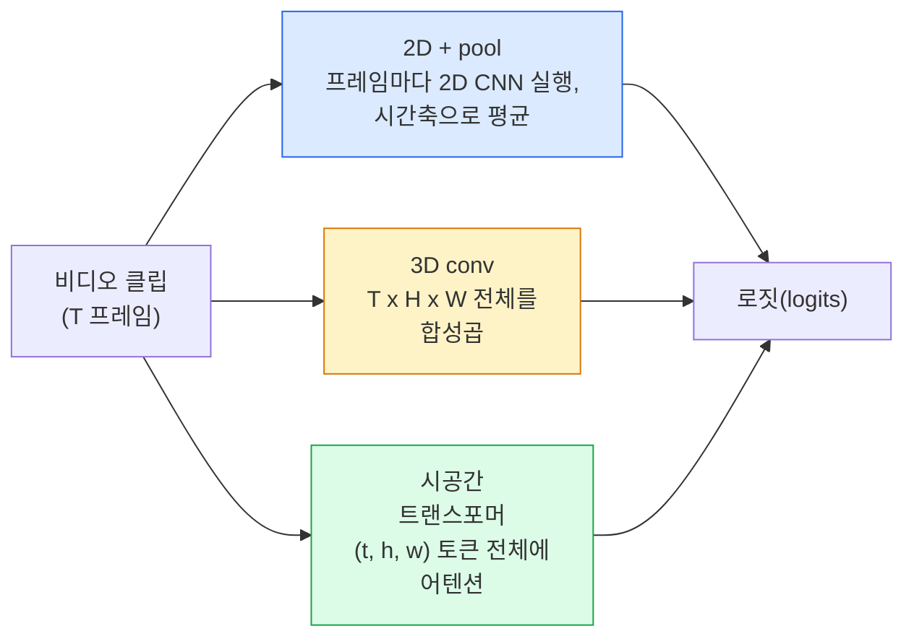

> 🇰🇷 이 문서는 한국어 번역본입니다(ELI5 스타일). 원문: [en.md](en.md)

# 비디오 이해 — 시간축 모델링

> 비디오는 이미지의 연속에, 그 이미지들을 이어 주는 물리 법칙까지 더한 것입니다. 모든 비디오 모델은 시간을 하나의 추가 축으로 다루거나(3D conv), 어텐션으로 살펴볼 수열로 다루거나(트랜스포머), 한 번 뽑아 둔 뒤 풀링할 특징으로 다룹니다(2D+pool).

**유형:** Learn + Build (배우고 만들기)
**언어:** Python
**선수 지식:** 페이즈 4 레슨 03(CNN), 페이즈 4 레슨 04(이미지 분류)
**시간:** 약 45분

## 학습 목표

- 세 가지 주요 비디오 모델링 접근법(2D+pool, 3D conv, 시공간 트랜스포머)을 구분하고 비용과 정확도의 트레이드오프를 예측하기
- PyTorch로 프레임 샘플링, 시간축 풀링, 2D+pool 베이스라인 분류기 구현하기
- I3D의 "팽창된(inflated)" 3D 커널이 ImageNet 가중치를 잘 전이하는 이유와, 인수분해(factorised) (2+1)D conv가 다르게 동작하는 방식 설명하기
- 표준 행동 인식 데이터셋과 지표 읽기: Kinetics-400/600, UCF101, Something-Something V2, 클립 수준과 비디오 수준의 top-1 정확도

## 문제 상황

30fps의 30초 비디오는 이미지 900장입니다. 순진하게 말하면 비디오 분류는 이미지 분류를 900번 돌린 뒤 뭔가 집계하는 일입니다. 행동이 거의 모든 프레임에 그대로 보이면(스포츠, 요리, 운동 영상) 이 방식이 통하지만, 행동 자체가 움직임으로 정의되면 크게 실패합니다. '무언가를 왼쪽에서 오른쪽으로 밀기'는 어느 한 프레임에서 보면 그냥 멈춰 있는 두 물체에 불과합니다.

모든 비디오 아키텍처의 핵심 질문은 이것입니다. 시간 구조를 언제, 어떻게 모델링하는가? 이 답이 나머지 전부를 결정합니다. 연산 비용, 사전 학습 전략, ImageNet 가중치 재사용 가능 여부, 어떤 데이터셋으로 학습하는지가요.

이 레슨은 정지 이미지 레슨보다 의도적으로 짧습니다. 이미지 쪽 핵심 장비는 이미 갖춰져 있고, 비디오 이해는 대부분 시간축 이야기, 즉 샘플링과 모델링과 집계의 문제이기 때문입니다.

## 핵심 개념

### 세 가지 아키텍처 계열



### 2D + pool

2D CNN(ResNet, EfficientNet, ViT)을 가져옵니다. 샘플링된 프레임마다 독립적으로 실행하고, 프레임별 임베딩을 평균(또는 최댓값 풀링, 어텐션 풀링)합니다. 풀링된 벡터를 분류기에 넣습니다.

장점:
- ImageNet 사전 학습이 그대로 전이됩니다.
- 구현이 가장 간단합니다.
- 저렴합니다. T 프레임 x 이미지 한 장 추론 비용.

단점:
- 움직임을 모델링할 수 없습니다. 행동 = 외형의 집합.
- 시간축 풀링은 순서를 구분하지 못합니다. "문 열기"와 "문 닫기"가 똑같아 보입니다.

언제 쓰나: 외형이 중요한 작업, 작은 비디오 데이터셋에서의 전이 학습, 초기 베이스라인.

### 3D 합성곱

2D (H, W) 커널을 3D (T, H, W) 커널로 바꿉니다. 네트워크가 공간과 시간 양쪽에 걸쳐 합성곱을 수행합니다. 초기 계열: C3D, I3D, SlowFast.

I3D 트릭: 사전 학습된 2D ImageNet 모델을 가져와 각 2D 커널을 새 시간축을 따라 복제해서 '팽창(inflate)'시킵니다. 3x3 2D conv가 3x3x3 3D conv가 되는 것이죠. 덕분에 3D 모델이 처음부터 학습하는 대신 강한 사전 학습 가중치를 얻습니다.

장점:
- 움직임을 직접 모델링합니다.
- I3D 팽창 덕분에 공짜 전이 학습이 됩니다.

단점:
- 2D 버전보다 FLOPs가 T/8배 더 듭니다(3짜리 시간 커널을 3번 쌓은 경우).
- 시간 커널이 작습니다. 긴 범위의 움직임에는 피라미드나 듀얼 스트림 방식이 필요합니다.

언제 쓰나: 움직임이 신호인 행동 인식(Something-Something V2, 움직임 중심 클래스가 많은 Kinetics).

### 시공간 트랜스포머

비디오를 시공간 패치 격자로 토큰화하고 전체에 걸쳐 어텐션을 둡니다. TimeSformer, ViViT, Video Swin, VideoMAE.

중요한 어텐션 패턴들:
- **통합(joint)** — (t, h, w) 전체에 걸친 하나의 큰 어텐션. `T*H*W`에 대해 이차식이라 비쌉니다.
- **분할(divided)** — 블록마다 어텐션 두 개: 하나는 시간축, 하나는 공간축. 거의 선형으로 늘어납니다.
- **인수분해(factorised)** — 블록 사이에서 시간 어텐션과 공간 어텐션이 번갈아 나옵니다.

장점:
- 모든 주요 벤치마크에서 SOTA 정확도.
- 패치 팽창을 통해 이미지 트랜스포머(ViT)에서 전이됩니다.
- 희소 어텐션으로 긴 컨텍스트의 비디오를 지원합니다.

단점:
- 연산을 많이 먹습니다.
- 어텐션 패턴을 신중하게 골라야 합니다. 그러지 않으면 실행 시간이 폭주합니다.

언제 쓰나: 큰 데이터셋, 고충실도 비디오 이해, 비디오+텍스트 멀티모달 작업.

### 프레임 샘플링

30fps의 10초 클립은 300프레임입니다. 이 300장을 모델에 전부 밀어 넣는 것은 낭비입니다. 표준 전략들:

- **균등 샘플링** — 클립 전체에 걸쳐 T개 프레임을 고르게 뽑습니다. 2D+pool의 기본값.
- **밀집 샘플링** — 무작위 연속 T프레임 윈도우. 움직임에는 이웃 프레임이 필요하므로 3D conv에서 흔합니다.
- **멀티 클립** — 같은 비디오에서 T프레임 윈도우를 여러 개 뽑아 각각 분류하고, 테스트 때 예측을 평균 냅니다.

T는 보통 8, 16, 32, 64입니다. T가 클수록 연산은 늘어나지만 시간 신호도 많아집니다.

### 평가

두 가지 수준:
- **클립 수준 정확도** — 모델이 T프레임 클립 하나를 보고 top-k를 보고합니다.
- **비디오 수준 정확도** — 비디오당 여러 클립의 클립 수준 예측을 평균 냅니다. 더 높고 안정적입니다.

둘 다 항상 보고하세요. 클립 78% / 비디오 82%인 모델은 테스트 시점 평균에 크게 의존하는 것이고, 80% / 81%인 모델은 클립 하나하나가 더 튼튼한 것입니다.

### 만나게 될 데이터셋들

- **Kinetics-400 / 600 / 700** — 범용 행동 데이터셋. 클립 40만 개, YouTube URL 기반(상당수는 이제 죽은 링크).
- **Something-Something V2** — 움직임으로 정의되는 행동("X를 왼쪽에서 오른쪽으로 옮기기"). 2D+pool로는 풀 수 없습니다.
- **UCF-101**, **HMDB-51** — 더 오래되고 작지만 여전히 보고 대상입니다.
- **AVA** — 공간과 시간에서 행동의 *위치 찾기(localisation)*. 분류보다 어렵습니다.

```figure
v4-video-temporal
```

## 만들어 보기

### 단계 1: 프레임 샘플러

프레임 목록(또는 비디오 텐서)에 동작하는 균등/밀집 샘플러입니다.

```python
import numpy as np

def sample_uniform(num_frames_total, T):
    if num_frames_total <= T:
        return list(range(num_frames_total)) + [num_frames_total - 1] * (T - num_frames_total)
    step = num_frames_total / T
    return [int(i * step) for i in range(T)]


def sample_dense(num_frames_total, T, rng=None):
    rng = rng or np.random.default_rng()
    if num_frames_total <= T:
        return list(range(num_frames_total)) + [num_frames_total - 1] * (T - num_frames_total)
    start = int(rng.integers(0, num_frames_total - T + 1))
    return list(range(start, start + T))
```

둘 다 비디오 텐서를 자를 때 쓰는 `T`개 인덱스를 반환합니다.

### 단계 2: 2D+pool 베이스라인

모든 프레임에 2D ResNet-18을 돌리고, 특징을 평균 풀링한 뒤 분류합니다.

```python
import torch
import torch.nn as nn
from torchvision.models import resnet18, ResNet18_Weights

class FramePool(nn.Module):
    def __init__(self, num_classes=400, pretrained=True):
        super().__init__()
        weights = ResNet18_Weights.IMAGENET1K_V1 if pretrained else None
        backbone = resnet18(weights=weights)
        self.features = nn.Sequential(*(list(backbone.children())[:-1]))  # 전역 평균 풀링은 유지
        self.head = nn.Linear(512, num_classes)

    def forward(self, x):
        # x: (N, T, 3, H, W)
        N, T = x.shape[:2]
        x = x.view(N * T, *x.shape[2:])
        feats = self.features(x).view(N, T, -1)
        pooled = feats.mean(dim=1)
        return self.head(pooled)

model = FramePool(num_classes=10)
x = torch.randn(2, 8, 3, 224, 224)
print(f"output: {model(x).shape}")
print(f"params: {sum(p.numel() for p in model.parameters()):,}")
```

파라미터 1,100만 개, ImageNet 사전 학습, 프레임마다 실행, 평균, 분류. 이 베이스라인은 외형 중심 작업에서 제대로 된 3D 모델과 5-10포인트 이내인 경우가 많습니다. 더 강한 ImageNet 백본을 재활용하기 때문에 어쩌면 더 나을 때도 있습니다.

### 단계 3: I3D식 팽창 3D conv

2D conv 하나를, 가중치를 새 시간축을 따라 반복해서 3D conv로 바꿉니다.

```python
def inflate_2d_to_3d(conv2d, time_kernel=3):
    out_c, in_c, kh, kw = conv2d.weight.shape
    weight_3d = conv2d.weight.data.unsqueeze(2)  # (out, in, 1, kh, kw)
    weight_3d = weight_3d.repeat(1, 1, time_kernel, 1, 1) / time_kernel
    conv3d = nn.Conv3d(in_c, out_c, kernel_size=(time_kernel, kh, kw),
                        padding=(time_kernel // 2, conv2d.padding[0], conv2d.padding[1]),
                        stride=(1, conv2d.stride[0], conv2d.stride[1]),
                        bias=False)
    conv3d.weight.data = weight_3d
    return conv3d

conv2d = nn.Conv2d(3, 64, kernel_size=3, padding=1, bias=False)
conv3d = inflate_2d_to_3d(conv2d, time_kernel=3)
print(f"2D weight shape:  {tuple(conv2d.weight.shape)}")
print(f"3D weight shape:  {tuple(conv3d.weight.shape)}")
x = torch.randn(1, 3, 8, 56, 56)
print(f"3D output shape:  {tuple(conv3d(x).shape)}")
```

`time_kernel`로 나누어 주면 활성값 크기가 대략 일정하게 유지됩니다. 첫 순전파에서 배치 정규화 통계가 깨지지 않게 하려면 중요한 부분입니다.

### 단계 4: 인수분해 (2+1)D conv

3D conv를 2D(공간)와 1D(시간) conv로 쪼갭니다. 수용 영역은 같고 파라미터는 더 적으며, 일부 벤치마크에서는 정확도가 더 좋습니다.

```python
class Conv2Plus1D(nn.Module):
    def __init__(self, in_c, out_c, kernel_size=3):
        super().__init__()
        mid_c = (in_c * out_c * kernel_size * kernel_size * kernel_size) \
                // (in_c * kernel_size * kernel_size + out_c * kernel_size)
        self.spatial = nn.Conv3d(in_c, mid_c, kernel_size=(1, kernel_size, kernel_size),
                                 padding=(0, kernel_size // 2, kernel_size // 2), bias=False)
        self.bn = nn.BatchNorm3d(mid_c)
        self.act = nn.ReLU(inplace=True)
        self.temporal = nn.Conv3d(mid_c, out_c, kernel_size=(kernel_size, 1, 1),
                                  padding=(kernel_size // 2, 0, 0), bias=False)

    def forward(self, x):
        return self.temporal(self.act(self.bn(self.spatial(x))))

c = Conv2Plus1D(3, 64)
x = torch.randn(1, 3, 8, 56, 56)
print(f"(2+1)D output: {tuple(c(x).shape)}")
```

완전한 R(2+1)D 네트워크는 ResNet-18의 모든 3x3 conv를 `Conv2Plus1D`로 바꾼 것과 같습니다.

## 활용하기

프로덕션 비디오 작업을 커버하는 라이브러리 두 개:

- `torchvision.models.video` — Kinetics 사전 학습 가중치를 갖춘 R(2+1)D, MViT, Swin3D. 이미지 모델과 같은 API.
- `pytorchvideo`(Meta) — 모델 동물원(model zoo), Kinetics / SSv2 / AVA용 데이터 로더, 표준 변환.

비전-언어 비디오 모델(비디오 캡셔닝, 비디오 QA)에는 `transformers`(`VideoMAE`, `VideoLLaMA`, `InternVideo`)를 쓰세요.

## 산출물

이 레슨에서 만드는 것:

- `outputs/prompt-video-architecture-picker.md` — 외형 대 움직임, 데이터셋 크기, 연산 예산에 따라 2D+pool / I3D / (2+1)D / 트랜스포머 중 하나를 골라 주는 프롬프트입니다.
- `outputs/skill-frame-sampler-auditor.md` — 비디오 파이프라인의 샘플러를 검사해 흔한 버그(인덱스가 하나 어긋남, `num_frames < T`일 때 고르지 않은 샘플링, 종횡비를 유지하는 크롭 부재 등)를 표시해 주는 스킬입니다.

## 연습 문제

1. **(쉬움)** T=8인 FramePool과 T=8인 I3D식 3D ResNet의 FLOPs를 (근사치로) 계산하세요. 2D+pool이 3-5배 저렴한 이유를 정당화합니다.
2. **(보통)** 합성 비디오 데이터셋을 만드세요. 무작위 방향으로 움직이는 공들, 움직임 방향으로 레이블링("left-to-right", "right-to-left", "diagonal-up"). 이 데이터로 FramePool을 학습시키고, 거의 찍는 수준의 정확도에 그치는 모습을 보여서 움직임 작업에 외형만으로는 부족함을 증명합니다.
3. **(어려움)** ResNet-18의 모든 Conv2d를 `Conv2Plus1D`로 바꿔 R(2+1)D-18을 만드세요. ImageNet 사전 학습 ResNet-18에서 첫 conv의 가중치를 팽창시킵니다. 연습 문제 2의 움직임 데이터셋으로 학습시켜 FramePool을 이겨 보세요.

## 핵심 용어

| 용어 | 흔히 하는 말 | 실제 의미 |
|------|----------------|----------------------|
| 2D + pool | "프레임별 분류기" | 샘플링된 프레임마다 2D CNN을 돌리고, 시간축으로 특징을 평균 풀링한 뒤 분류 |
| 3D convolution | "시공간 커널" | (T, H, W) 전체를 합성곱하는 커널. 움직임을 기본적으로 모델링할 수 있음 |
| Inflation | "2D 가중치를 3D로 끌어올림" | 2D conv 가중치를 새 시간축을 따라 반복해 3D conv 가중치를 초기화하고, 활성값 스케일을 유지하려고 kernel_T로 나눔 |
| (2+1)D | "인수분해 conv" | 3D를 2D 공간 + 1D 시간으로 쪼갬. 파라미터는 더 적고 그 사이 비선형성이 하나 더해짐 |
| Divided attention | "시간 다음 공간" | 층마다 어텐션 두 개를 갖는 트랜스포머 블록: 같은 프레임의 토큰끼리 하나, 같은 위치의 토큰끼리 하나 |
| Clip | "T프레임 윈도우" | T개 프레임을 샘플링한 부분 수열. 비디오 모델이 소비하는 단위 |
| Clip vs video accuracy | "두 가지 평가 설정" | 클립 = 비디오당 샘플 하나, 비디오 = 여러 샘플링 클립의 평균 |
| Kinetics | "비디오계의 ImageNet" | 400-700개 행동 클래스, 30만 개 이상 YouTube 클립, 표준 비디오 사전 학습 코퍼스 |

## 더 읽을거리

- [I3D: Quo Vadis, Action Recognition (Carreira & Zisserman, 2017)](https://arxiv.org/abs/1705.07750) — 팽창과 Kinetics 데이터셋을 소개
- [R(2+1)D: A Closer Look at Spatiotemporal Convolutions (Tran et al., 2018)](https://arxiv.org/abs/1711.11248) — 인수분해 conv. 지금도 강한 베이스라인
- [TimeSformer: Is Space-Time Attention All You Need? (Bertasius et al., 2021)](https://arxiv.org/abs/2102.05095) — 최초의 강한 비디오 트랜스포머
- [VideoMAE (Tong et al., 2022)](https://arxiv.org/abs/2203.12602) — 비디오용 마스크 오토인코더 사전 학습. 현재 지배적인 사전 학습 레시피
