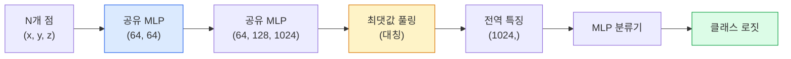

> 🇰🇷 이 문서는 한국어 번역본입니다(ELI5 스타일). 원문: [en.md](en.md)

# 3D 비전 — 포인트 클라우드와 NeRF

> 3D 비전에는 두 가지 맛이 있습니다. 포인트 클라우드는 센서가 내놓는 날 출력이고, NeRF는 학습된 볼륨 필드입니다. 둘 다 '공간의 어디에 무엇이 있는가'에 답합니다.

**유형:** Learn + Build (배우고 만들기)
**언어:** Python
**선수 지식:** 페이즈 4 레슨 03(CNN), 페이즈 1 레슨 12(텐서 연산)
**시간:** 약 45분

## 학습 목표

- 명시적 3D 표현(포인트 클라우드, 메시, 복셀)과 암시적 3D 표현(부호 있는 거리 필드, NeRF)을 구분하고 각각이 언제 쓰이는지 이해하기
- 순서 없는 점 집합 위에서도 신경망이 순열 불변성을 갖게 만드는 PointNet의 대칭 함수 트릭 이해하기
- NeRF 순전파 따라가기: 레이 캐스팅, 볼류메트릭 렌더링, 위치 인코딩, MLP 밀도+색상 헤드
- `nerfstudio`나 `instant-ngp`로 포즈가 달린 소수의 이미지에서 사전 학습된 3D 재구성 수행하기

## 문제 상황

카메라는 2D 이미지를 만들어 냅니다. LIDAR는 순서가 없는 3D 점 집합을 만들어 냅니다. 구조 추정(structure-from-motion) 파이프라인은 성긴 3D 키포인트 구름을 만들어 냅니다. NeRF는 포즈가 달린 몇 장의 사진만으로 3D 장면 전체를 재구성합니다. 전부 '비전'이지만, 어느 것도 CNN이 원하는 조밀한 텐서와는 닮지 않았습니다.

3D 비전이 중요한 이유는 가치 높은 로봇 작업 대부분이 3D에서 벌어지기 때문입니다. 파지, 장애물 회피, 내비게이션, AR 오클루전, 3D 콘텐츠 캡처. 2D 이미지만 아는 비전 엔지니어는 이 분야에서 가장 빨리 자라는 영역(AR/VR 콘텐츠, 로보틱스, 자율주행 스택, 부동산이나 건설용 NeRF 기반 3D 재구성)에서 배제됩니다.

두 표현이 각기 다른 이유로 지배적입니다. 포인트 클라우드는 센서가 공짜로 주는 것입니다. NeRF와 그 후속 기술들(3D Gaussian splatting, 뉴럴 SDF)은 신경망에게 장면 학습을 맡겼을 때 얻는 것입니다.

## 핵심 개념

### 포인트 클라우드

포인트 클라우드는 R^3 공간의 점 N개로 이루어진 순서 없는 집합이며, 각 점에 특성(feature)(색상, 강도, 법선)이 붙기도 합니다.

```
cloud = [
  (x1, y1, z1, r1, g1, b1),
  (x2, y2, z2, r2, g2, b2),
  ...
  (xN, yN, zN, rN, gN, bN),
]
```

격자도 없고 연결성도 없습니다. 두 가지 성질이 신경망을 곤란하게 만듭니다:

- **순열 불변성** — 출력이 점의 순서에 의존하면 안 됩니다.
- **가변 N** — 모델 하나가 크기가 다른 클라우드를 모두 처리해야 합니다.

PointNet(Qi et al., 2017)은 하나의 아이디어로 둘 다 해결했습니다. 모든 점에 공유 MLP를 적용한 뒤, 대칭 함수(최댓값 풀링)로 집계합니다. 결과는 순서에 의존하지 않는 고정 크기 벡터입니다.

```
f(P) = max_{p in P} MLP(p)
```

이것이 PointNet의 핵심 전부입니다. 더 깊은 변형들(PointNet++, Point Transformer)은 계층적 샘플링과 지역 집계를 더하지만, 대칭 함수 트릭은 그대로입니다.

### PointNet 아키텍처



"공유 MLP"는 같은 MLP가 모든 점에 독립적으로 실행된다는 뜻입니다. 효율을 위해 점 차원에 걸친 1x1 conv로 구현합니다.

### 신경 방사장(Neural Radiance Fields, NeRF)

NeRF(Mildenhall et al., 2020)는 '사진 N장으로 3D 장면을 재구성할 수 있는가?'라는 질문에, 장면 그 자체인 신경망으로 답했습니다. 이 네트워크는 `(x, y, z, viewing_direction)`을 `(밀도, 색상)`으로 대응시킵니다. 새 시점을 렌더링하는 일은 이 네트워크 위에서 돌리는 레이 캐스팅 루프입니다.

```
NeRF MLP:  (x, y, z, theta, phi) -> (sigma, r, g, b)

새 시점의 픽셀 (u, v)을 렌더링하려면:
  1. 카메라에서 픽셀 (u, v)를 지나는 광선을 쏜다
  2. 광선을 따라 거리 t_1, t_2, ..., t_N에 점을 샘플링한다
  3. 각 점에서 MLP에 질의한다
  4. (1 - exp(-sigma * dt))로 가중치를 둔 색상들을 합성한다
  5. 그 합이 렌더링된 픽셀 색이다
```

손실은 렌더링된 픽셀을 학습 사진의 정답 픽셀과 비교합니다. 렌더링 단계를 통과하는 역전파가 MLP를 갱신합니다. 3D 정답도, 명시적 기하학도 없습니다. 장면은 MLP 가중치 안에 저장됩니다.

### NeRF의 위치 인코딩

`(x, y, z)`에 그냥 MLP를 쓰면 고주파 디테일을 표현할 수 없습니다. MLP는 스펙트럼상 저주파 쪽으로 치우쳐 있기 때문입니다. NeRF는 각 좌표를 MLP 전에 푸리에 특징 벡터로 인코딩해서 이 문제를 고칩니다:

```
gamma(p) = (sin(2^0 pi p), cos(2^0 pi p), sin(2^1 pi p), cos(2^1 pi p), ...)
```

주파수 레벨은 L=10까지 씁니다. 이것은 트랜스포머가 위치에 쓰는 것과 같은 트릭이며, 디퓨전의 시간 조건부(레슨 10)에서 다시 등장합니다. 이것이 없으면 NeRF 결과는 흐릿해집니다.

### 볼류메트릭 렌더링

```
C(r) = sum_i T_i * (1 - exp(-sigma_i * delta_i)) * c_i

T_i  = exp(- sum_{j<i} sigma_j * delta_j)
delta_i = t_{i+1} - t_i
```

`T_i`는 투과율(transmittance), 즉 빛이 i번 점까지 살아남은 양입니다. `(1 - exp(-sigma_i * delta_i))`는 i번 점의 불투명도이고, `c_i`는 색상입니다. 최종 픽셀은 광선을 따른 가중 합입니다.

### NeRF를 대체한 것들

순수 NeRF는 학습이 느리고(수 시간) 렌더링도 느립니다(이미지당 수 초). 그 이후의 계보:

- **Instant-NGP**(2022) — 해시 그리드 인코딩이 MLP의 위치 입력을 대체합니다. 몇 초 만에 학습됩니다.
- **Mip-NeRF 360** — 경계가 없는 장면과 안티에일리어싱을 다룹니다.
- **3D Gaussian Splatting**(2023) — 볼륨 필드를 수백만 개의 3D 가우시안으로 대체합니다. 몇 분 만에 학습하고 실시간으로 렌더링합니다. 현재의 프로덕션 기본값입니다.

2026년에 실제로 서비스되는 NeRF 제품은 사실상 전부 3D Gaussian splatting입니다. 다만 머릿속 모델은 여전히 NeRF입니다.

### 데이터셋과 벤치마크

- **ShapeNet** — 3D CAD 모델을 포인트 클라우드로 분류하고 분할하는 데이터셋.
- **ScanNet** — 분할용 실내 실측 스캔.
- **KITTI** — 자율주행용 실외 LIDAR 포인트 클라우드.
- **NeRF Synthetic** / **Blended MVS** — 뷰 합성용 포즈가 달린 이미지 데이터셋.
- **Mip-NeRF 360** 데이터셋 — 경계 없는 실제 장면.

```figure
nerf-rays
```

## 만들어 보기

### 단계 1: PointNet 분류기

```python
import torch
import torch.nn as nn

class PointNet(nn.Module):
    def __init__(self, num_classes=10):
        super().__init__()
        self.mlp1 = nn.Sequential(
            nn.Conv1d(3, 64, 1),    nn.BatchNorm1d(64),   nn.ReLU(inplace=True),
            nn.Conv1d(64, 64, 1),   nn.BatchNorm1d(64),   nn.ReLU(inplace=True),
        )
        self.mlp2 = nn.Sequential(
            nn.Conv1d(64, 128, 1),  nn.BatchNorm1d(128),  nn.ReLU(inplace=True),
            nn.Conv1d(128, 1024, 1), nn.BatchNorm1d(1024), nn.ReLU(inplace=True),
        )
        self.head = nn.Sequential(
            nn.Linear(1024, 512),   nn.BatchNorm1d(512),  nn.ReLU(inplace=True),
            nn.Dropout(0.3),
            nn.Linear(512, 256),    nn.BatchNorm1d(256),  nn.ReLU(inplace=True),
            nn.Dropout(0.3),
            nn.Linear(256, num_classes),
        )

    def forward(self, x):
        # x: (N, 3, num_points) — Conv1d를 위해 전치된 형태
        x = self.mlp1(x)
        x = self.mlp2(x)
        x = torch.max(x, dim=-1)[0]       # (N, 1024)
        return self.head(x)

pts = torch.randn(4, 3, 1024)
net = PointNet(num_classes=10)
print(f"output: {net(pts).shape}")
print(f"params: {sum(p.numel() for p in net.parameters()):,}")
```

파라미터 약 160만 개입니다. 클라우드당 점 1,024개로 실행합니다.

### 단계 2: 위치 인코딩

```python
def positional_encoding(x, L=10):
    """
    x: (..., D) -> (..., D * 2 * L)
    """
    freqs = 2.0 ** torch.arange(L, dtype=x.dtype, device=x.device)
    args = x.unsqueeze(-1) * freqs * 3.141592653589793
    sinc = torch.cat([args.sin(), args.cos()], dim=-1)
    return sinc.reshape(*x.shape[:-1], -1)

x = torch.randn(5, 3)
y = positional_encoding(x, L=10)
print(f"input:  {x.shape}")
print(f"encoded: {y.shape}     # (5, 60)")
```

`2^l * pi`를 곱할수록 점점 더 높은 주파수가 됩니다.

### 단계 3: 아주 작은 NeRF MLP

```python
class TinyNeRF(nn.Module):
    def __init__(self, L_pos=10, L_dir=4, hidden=128):
        super().__init__()
        self.L_pos = L_pos
        self.L_dir = L_dir
        pos_dim = 3 * 2 * L_pos
        dir_dim = 3 * 2 * L_dir
        self.trunk = nn.Sequential(
            nn.Linear(pos_dim, hidden), nn.ReLU(inplace=True),
            nn.Linear(hidden, hidden),  nn.ReLU(inplace=True),
            nn.Linear(hidden, hidden),  nn.ReLU(inplace=True),
            nn.Linear(hidden, hidden),  nn.ReLU(inplace=True),
        )
        self.sigma = nn.Linear(hidden, 1)
        self.color = nn.Sequential(
            nn.Linear(hidden + dir_dim, hidden // 2), nn.ReLU(inplace=True),
            nn.Linear(hidden // 2, 3), nn.Sigmoid(),
        )

    def forward(self, x, d):
        x_enc = positional_encoding(x, self.L_pos)
        d_enc = positional_encoding(d, self.L_dir)
        h = self.trunk(x_enc)
        sigma = torch.relu(self.sigma(h)).squeeze(-1)
        rgb = self.color(torch.cat([h, d_enc], dim=-1))
        return sigma, rgb

nerf = TinyNeRF()
x = torch.randn(128, 3)
d = torch.randn(128, 3)
s, c = nerf(x, d)
print(f"sigma: {s.shape}   rgb: {c.shape}")
```

원조 NeRF(깊이 8짜리 MLP 트렁크 2개)에 비하면 아주 작습니다. 아키텍처를 보여 주기엔 충분합니다.

### 단계 4: 광선을 따라 볼류메트릭 렌더링

```python
def volumetric_render(sigma, rgb, t_vals):
    """
    sigma: (..., N_samples)
    rgb:   (..., N_samples, 3)
    t_vals: (N_samples,) distances along the ray
    """
    delta = torch.cat([t_vals[1:] - t_vals[:-1], torch.full_like(t_vals[:1], 1e10)])
    alpha = 1.0 - torch.exp(-sigma * delta)
    trans = torch.cumprod(torch.cat([torch.ones_like(alpha[..., :1]), 1.0 - alpha + 1e-10], dim=-1), dim=-1)[..., :-1]
    weights = alpha * trans
    rendered = (weights.unsqueeze(-1) * rgb).sum(dim=-2)
    depth = (weights * t_vals).sum(dim=-1)
    return rendered, depth, weights


N = 64
t_vals = torch.linspace(2.0, 6.0, N)
sigma = torch.rand(N) * 0.5
rgb = torch.rand(N, 3)
rendered, depth, weights = volumetric_render(sigma, rgb, t_vals)
print(f"rendered colour: {rendered.tolist()}")
print(f"depth:           {depth.item():.2f}")
```

광선 하나, 샘플 64개를 RGB 픽셀 하나와 깊이 하나로 합성합니다.

## 활용하기

실무 작업에는:

- `nerfstudio`(Tancik et al.) — NeRF / Instant-NGP / Gaussian Splatting의 현재 기준(reference) 라이브러리. 명령줄 도구에 웹 뷰어까지 갖추고 있습니다.
- `pytorch3d`(Meta) — 미분 가능 렌더링, 포인트 클라우드 유틸리티, 메시 연산.
- `open3d` — 포인트 클라우드 처리, 정합(registration), 시각화.

배포에는 3D Gaussian splatting이 렌더링이 100배 빠르다는 이유로 순수 NeRF를 크게 대체했습니다. 재구성 품질은 비슷합니다.

## 산출물

이 레슨에서 만드는 것:

- `outputs/prompt-3d-task-router.md` — 작업과 입력 데이터에 따라 알맞은 3D 표현(포인트 클라우드, 메시, 복셀, NeRF, 가우시안 스플랫)으로 안내하는 프롬프트입니다.
- `outputs/skill-point-cloud-loader.md` — .ply / .pcd / .xyz 파일용 PyTorch `Dataset`을 올바른 정규화, 중심 정렬, 점 샘플링과 함께 작성해 주는 스킬입니다.

## 연습 문제

1. **(쉬움)** PointNet이 순열 불변임을 보이세요. 같은 클라우드를 두 번 통과시키되 한 번은 점 순서를 섞습니다. 출력이 부동소수점 오차 수준에서 동일한지 확인합니다.
2. **(보통)** 카메라 내부 파라미터와 포즈가 주어지면 H x W 이미지의 모든 픽셀에 대한 광선 원점과 방향을 만드는 최소한의 광선 생성 함수를 구현하세요.
3. **(어려움)** 색칠한 큐브의 렌더링 뷰들(미분 가능 렌더링이나 간단한 레이 트레이서로 생성)로 이루어진 합성 데이터셋에서 TinyNeRF를 학습시키세요. 에포크 1, 10, 100에서 렌더링 손실을 보고하고, 몇 번째 에포크쯤 알아볼 수 있는 뷰가 나오는지 답하세요.

## 핵심 용어

| 용어 | 흔히 하는 말 | 실제 의미 |
|------|----------------|----------------------|
| Point cloud | "LIDAR에서 나온 3D 점들" | 순서 없는 (x, y, z) 집합 + 점별 선택적 특성 |
| PointNet | "포인트 클라우드용 첫 신경망" | 점마다 공유 MLP + 대칭(최댓값) 풀링. 구조적으로 순열 불변 |
| NeRF | "장면 그 자체인 MLP" | (x, y, z, 방향)을 (밀도, 색상)으로 대응시키는 네트워크. 레이 캐스팅으로 렌더링 |
| Positional encoding | "푸리에 특징" | MLP의 저주파 편향을 이기려고 각 좌표를 여러 주파수의 sin/cos로 인코딩 |
| Volumetric rendering | "광선 적분" | 광선을 따라 모은 샘플을 투과율과 알파로 픽셀 하나로 합성 |
| Instant-NGP | "해시 그리드 NeRF" | NeRF의 좌표 MLP를 다중 해상도 해시 그리드로 대체. 100-1000배 빠름 |
| 3D Gaussian splatting | "수백만 개의 가우시안" | 장면 = 3D 가우시안의 모음. 실시간 렌더링, 몇 분 만에 학습 |
| SDF | "부호 있는 거리 필드" | 가장 가까운 표면까지의 부호 있는 거리를 돌려주는 함수. 또 하나의 암시적 표현 |

## 더 읽을거리

- [PointNet (Qi et al., 2017)](https://arxiv.org/abs/1612.00593) — 순열 불변 분류기
- [NeRF (Mildenhall et al., 2020)](https://arxiv.org/abs/2003.08934) — 사진으로부터의 3D 재구성을 신경망 문제로 만든 논문
- [Instant-NGP (Müller et al., 2022)](https://arxiv.org/abs/2201.05989) — 해시 그리드, 1000배 가속
- [3D Gaussian Splatting (Kerbl et al., 2023)](https://arxiv.org/abs/2308.04079) — 프로덕션에서 NeRF를 대체한 아키텍처
