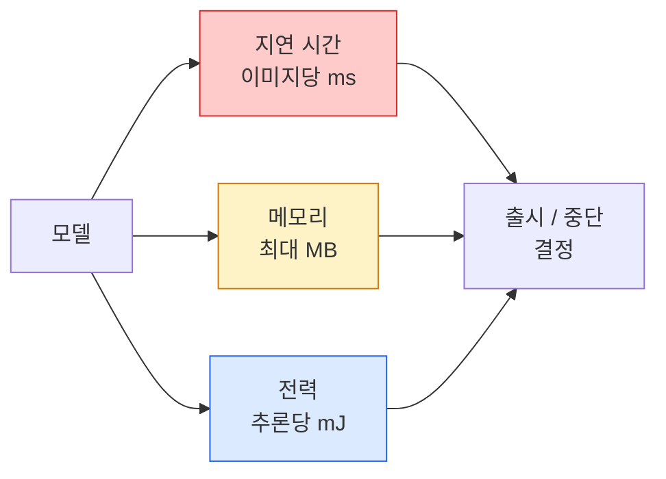

# 실시간 비전 — 엣지 배포

> 🇰🇷 이 문서는 한국어 번역본입니다(ELI5 스타일). 원문: [en.md](en.md)

> 엣지 추론은 정확도 90짜리 모델을 RAM 2GB짜리 기기에서 30fps로 돌아가게 만드는 기술입니다. 정확도의 매 퍼센트 포인트가 지연 시간의 매 밀리초와 맞바뀝니다.

**유형:** Learn + Build
**언어:** Python
**선수 지식:** 페이즈 4 레슨 04(이미지 분류), 페이즈 10 레슨 11(양자화)
**시간:** 약 75분

## 학습 목표

- 어떤 PyTorch 모델이든 추론 지연 시간, 최대 메모리, 처리량을 측정하고, FLOPs / 파라미터 수 / 지연 시간의 트레이드오프를 읽을 수 있습니다
- PyTorch의 학습 후 양자화(post-training quantisation)로 비전 모델을 INT8로 양자화하고, 정확도 손실이 1% 미만인지 검증합니다
- ONNX로 내보내고 ONNX Runtime 또는 TensorRT로 컴파일합니다. 가장 흔한 내보내기 실패 세 가지와 그 해결책을 말할 수 있습니다
- 엣지 제약 조건에서 MobileNetV3, EfficientNet-Lite, ConvNeXt-Tiny, MobileViT 중 무엇을 고를지 설명할 수 있습니다

## 문제 상황

학습 시점의 비전 모델은 부동소수점 괴물입니다. 파라미터 1억 개, 순전파 한 번에 10 GFLOPs, VRAM 2GB. 이중 하나도 스마트폰, 자동차 인포테인먼트 장치, 산업용 카메라, 드론에는 들어가지 않습니다. 비전 시스템을 출시한다는 건 똑같은 예측을 100배 작은 예산 안에 집어넣는 일입니다.

대부분의 일은 세 가지 다이얼이 해줍니다: 모델 선택(같은 레시피의 더 작은 아키텍처), 양자화(FP32 대신 INT8), 추론 런타임(ONNX Runtime, TensorRT, Core ML, TFLite). 이걸 제대로 잡느냐 못 잡느냐가 워크스테이션에서만 돌아가는 데모와 3만 원짜리 카메라 모듈에 실리는 제품의 차이입니다.

이 레슨은 먼저 측정 규율을 세웁니다(측정할 수 없는 것은 최적화할 수 없습니다). 그다음 세 가지 다이얼을 하나씩 다룹니다. 목표는 모든 엣지 런타임을 외우는 게 아니라, 어떤 지렛대가 있는지 그리고 각 지렛대가 내가 생각하는 대로 작동하는지 어떻게 검증하는지 아는 것입니다.

## 개념

### 세 가지 예산



- **지연 시간**: p50, p95, p99. p50만 평균 내면 실시간 시스템에서 중요한 꼬리(tail) 동작이 가려집니다.
- **최대 메모리**: 기기가 한 번이라도 겪는 최댓값이지 안정 상태의 평균이 아닙니다. 임베디드 대상에서는 메모리 부족(OOM)이 치명적이므로 중요합니다.
- **전력 / 에너지**: 배터리로 도는 기기에서 추론 한 번당 밀리줄(mJ). 보통 CPU/GPU 사용률 * 시간으로 근사합니다.

엣지 결정은 (모델, 지연 시간, 메모리, 정확도) 표에서 나옵니다. 모든 칸은 워크스테이션이 아니라 대상 기기에서 측정한 값이어야 합니다.

### 측정 규율

모든 엣지 프로파일링이 지켜야 하는 세 가지 규칙:

1. 측정 전에 더미 순전파 5~10회로 모델을 **워밍업**합니다. 차가운 캐시와 JIT 컴파일은 대표성 없는 첫 숫자를 만들어 냅니다.
2. 시간 측정 구간 앞뒤로 `torch.cuda.synchronize()`로 GPU 작업을 **동기화**합니다. 이게 없으면 커널 실행이 아니라 커널 실행 요청(dispatch)을 측정하는 셈입니다.
3. 입력 크기를 **프로덕션(운영 환경) 해상도로 고정**합니다. 224x224에서의 지연 시간은 512x512에서의 지연 시간이 아닙니다.

### FLOPs라는 대리 지표

FLOPs(추론당 부동소수점 연산 수)는 값싸고 기기와 무관한 지연 시간 대리 지표입니다. 아키텍처 비교에는 유용하지만 실제 시간(wall-clock) 절대값으로는 오해를 부릅니다. FLOPs가 10% 더 많은 모델이 실전에서는 2배 빠를 수 있습니다. 하드웨어 친화적인 연산을 쓰기 때문입니다(depthwise 합성곱은 컴파일이 잘 되고, 큰 7x7 합성곱은 그렇지 않습니다).

규칙: 아키텍처 탐색에는 FLOPs를, 배포 결정에는 실기기 지연 시간을 사용하세요.

### 한 문단 요약: 양자화

FP32 가중치와 활성화 값을 INT8로 바꿉니다. 모델 크기는 1/4로 줄고, 메모리 대역폭은 1/4로 줄고, INT8 커널이 있는 하드웨어(요즘 모든 모바일 SoC, Tensor Core를 가진 모든 NVIDIA GPU)에서는 연산량이 2~4배 줄어듭니다. 비전 작업에서 학습 후 정적 양자화로 인한 정확도 손실은 보통 0.1~1퍼센트 포인트입니다.

종류:

- **동적(dynamic)** — 가중치만 INT8로 양자화하고 활성화는 FP로 계산합니다. 간단하지만 속도 향상이 적습니다.
- **정적(학습 후, post-training)** — 가중치를 양자화하고 작은 보정(calibration) 세트로 활성화 범위를 보정합니다. 동적보다 훨씬 빠릅니다.
- **양자화 인지 학습(QAT)** — 학습 중에 양자화를 시뮬레이션해서 모델이 양자화를 피하도록 학습합니다. 정확도는 가장 좋지만 레이블된 데이터가 필요합니다.

비전에서는 학습 후 정적 양자화만으로 노력은 5% 들이고 효과는 95%를 얻습니다. PTQ의 정확도 손실이 감당 안 될 때만 QAT를 쓰세요.

### 가지치기와 증류

- **가지치기(pruning)** — 중요하지 않은 가중치(크기 기반)나 채널(structured)을 제거합니다. 과다 파라미터화된 모델에서는 잘 통하지만, 이미 작은 아키텍처에는 별 효과가 없습니다.
- **증류(distillation)** — 작은 학생 모델이 큰 교사 모델의 로짓(logits)을 흉내 내도록 학습시킵니다. 모델을 줄이며 잃은 정확도를 대부분 되찾아 줍니다. 프로덕션 엣지 모델의 표준 기법입니다.

### 추론 런타임들

- **PyTorch eager** — 느립니다. 배포용이 아니라 개발용입니다.
- **TorchScript** — 레거시입니다. `torch.compile`과 ONNX 내보내기로 대체됐습니다.
- **ONNX Runtime** — 중립적인 런타임입니다. CPU, CUDA, CoreML, TensorRT, OpenVINO 모두 ONNX 프로바이더를 제공합니다. 여기서 시작하세요.
- **TensorRT** — NVIDIA의 컴파일러입니다. NVIDIA GPU(워크스테이션과 Jetson)에서 가장 좋은 지연 시간을 냅니다. ONNX Runtime과 통합하거나 단독으로 쓸 수 있습니다.
- **Core ML** — Apple의 iOS/macOS 런타임입니다. `.mlmodel` 또는 `.mlpackage`가 필요합니다.
- **TFLite** — Google의 Android/ARM 런타임입니다. `.tflite`가 필요합니다.
- **OpenVINO** — Intel의 CPU/VPU 런타임입니다. `.xml` + `.bin`이 필요합니다.

실전에서는: PyTorch -> ONNX로 내보내고 -> 대상에 맞는 런타임을 고릅니다. ONNX가 공용어(lingua franca)입니다.

### 엣지 아키텍처 선택표

| 예산 | 모델 | 이유 |
|--------|-------|-----|
| < 3M params | MobileNetV3-Small | 어디서든 컴파일되는 좋은 베이스라인 |
| 3-10M | EfficientNet-Lite-B0 | TFLite에서 파라미터당 최고 정확도 |
| 10-20M | ConvNeXt-Tiny | 파라미터 대비 정확도가 가장 좋고 CPU 친화적 |
| 20-30M | MobileViT-S 또는 EfficientViT | ImageNet급 정확도를 내는 트랜스포머 |
| 30-80M | Swin-V2-Tiny | 스택이 윈도우 어텐션을 지원할 경우 |

특별한 이유가 없다면 이 모두를 INT8로 양자화하세요.

```figure
cnn-param-count
```

## 만들어 보기

### 단계 1: 지연 시간 올바르게 측정하기

```python
import time
import torch

def measure_latency(model, input_shape, device="cpu", warmup=10, iters=50):
    model = model.to(device).eval()
    x = torch.randn(input_shape, device=device)
    with torch.no_grad():
        for _ in range(warmup):
            model(x)
        if device == "cuda":
            torch.cuda.synchronize()
        times = []
        for _ in range(iters):
            if device == "cuda":
                torch.cuda.synchronize()
            t0 = time.perf_counter()
            model(x)
            if device == "cuda":
                torch.cuda.synchronize()
            times.append((time.perf_counter() - t0) * 1000)
    times.sort()
    return {
        "p50_ms": times[len(times) // 2],
        "p95_ms": times[int(len(times) * 0.95)],
        "p99_ms": times[int(len(times) * 0.99)],
        "mean_ms": sum(times) / len(times),
    }
```

워밍업하고, 동기화하고, `time.perf_counter()`를 씁니다. 평균뿐 아니라 백분위수를 보고하세요.

### 단계 2: 파라미터 수와 FLOP 수

```python
def parameter_count(model):
    return sum(p.numel() for p in model.parameters())

def flops_estimate(model, input_shape):
    """
    conv/linear만 있는 모델을 위한 대략적인 FLOP 계산.
    프로덕션에서는 `fvcore`나 `ptflops`를 사용할 것.
    """
    total = 0
    def conv_hook(m, inp, out):
        nonlocal total
        c_out, c_in, kh, kw = m.weight.shape
        h, w = out.shape[-2:]
        total += 2 * c_in * c_out * kh * kw * h * w
    def linear_hook(m, inp, out):
        nonlocal total
        total += 2 * m.in_features * m.out_features
    hooks = []
    for m in model.modules():
        if isinstance(m, torch.nn.Conv2d):
            hooks.append(m.register_forward_hook(conv_hook))
        elif isinstance(m, torch.nn.Linear):
            hooks.append(m.register_forward_hook(linear_hook))
    model.eval()
    with torch.no_grad():
        model(torch.randn(input_shape))
    for h in hooks:
        h.remove()
    return total
```

실제 프로젝트에서는 `fvcore.nn.FlopCountAnalysis`나 `ptflops`를 쓰세요. 모든 모듈 타입을 정확히 처리해 줍니다.

### 단계 3: 학습 후 정적 양자화

```python
def quantise_ptq(model, calibration_loader, backend="x86"):
    import torch.ao.quantization as tq
    model = model.eval().cpu()
    model.qconfig = tq.get_default_qconfig(backend)
    tq.prepare(model, inplace=True)
    with torch.no_grad():
        for x, _ in calibration_loader:
            model(x)
    tq.convert(model, inplace=True)
    return model
```

세 단계입니다: 설정 -> prepare(관측기(observer) 삽입) -> 실제 데이터로 보정 -> convert(융합 + 양자화). 모델이 미리 융합되어 있어야 합니다(`Conv -> BN -> ReLU`를 `ConvBnReLU`로). 이건 `torch.ao.quantization.fuse_modules`이 처리해 줍니다.

### 단계 4: ONNX 내보내기

```python
def export_onnx(model, sample_input, path="model.onnx"):
    model = model.eval()
    torch.onnx.export(
        model,
        sample_input,
        path,
        input_names=["input"],
        output_names=["output"],
        dynamic_axes={"input": {0: "batch"}, "output": {0: "batch"}},
        opset_version=17,
    )
    return path
```

2026년 현재 안전한 기본값은 `opset_version=17`입니다. `dynamic_axes`를 지정하면 ONNX 모델을 임의의 배치 크기로 실행할 수 있습니다.

### 단계 5: 벤치마크와 상황별 비교

```python
import torch.nn as nn
from torchvision.models import mobilenet_v3_small

def compare_regimes():
    model = mobilenet_v3_small(weights=None, num_classes=10)
    params = parameter_count(model)
    flops = flops_estimate(model, (1, 3, 224, 224))
    lat_fp32 = measure_latency(model, (1, 3, 224, 224), device="cpu")
    print(f"FP32 MobileNetV3-Small: {params:,} params  {flops/1e9:.2f} GFLOPs  "
          f"p50={lat_fp32['p50_ms']:.2f}ms  p95={lat_fp32['p95_ms']:.2f}ms")
```

같은 함수를 `resnet50`, `efficientnet_v2_s`, `convnext_tiny`에도 돌리면 배포 결정에 필요한 비교표가 완성됩니다.

## 사용해 보기

프로덕션 스택은 세 가지 경로 중 하나로 수렴합니다:

- **웹 / 서버리스**: PyTorch -> ONNX -> ONNX Runtime(CPU 또는 CUDA 프로바이더). 가장 쉽고 대부분의 용도에 충분합니다.
- **NVIDIA 엣지(Jetson, GPU 서버)**: PyTorch -> ONNX -> TensorRT. 지연 시간은 가장 좋지만 공수가 가장 큽니다.
- **모바일**: PyTorch -> ONNX -> Core ML(iOS) 또는 TFLite(Android). 내보내기 전에 양자화하세요.

측정에는 `torch-tb-profiler`, `nvprof` / `nsys`, macOS의 Instruments가 레이어별 분석을 제공합니다. `benchmark_app`(OpenVINO)과 `trtexec`(TensorRT)은 단독 CLI 숫자를 제공합니다.

## 출시하기

이 레슨에서 만드는 산출물:

- `outputs/prompt-edge-deployment-planner.md` — 대상 기기와 지연 시간 SLA가 주어지면 백본, 양자화 전략, 런타임을 골라 주는 프롬프트
- `outputs/skill-latency-profiler.md` — 워밍업, 동기화, 백분위수, 메모리 추적이 들어간 완전한 지연 시간 벤치마킹 스크립트를 작성해 주는 스킬

## 연습 문제

1. **(쉬움)** `resnet18`, `mobilenet_v3_small`, `efficientnet_v2_s`, `convnext_tiny`의 CPU 224x224 p50 지연 시간을 측정하세요. 표를 보고하고, ms당 정확도가 가장 좋은 아키텍처가 무엇인지 찾아내세요.
2. **(보통)** `mobilenet_v3_small`에 학습 후 정적 양자화를 적용하세요. FP32 대비 INT8 지연 시간과 CIFAR-10 등의 홀드아웃(held-out) 부분집합에서의 정확도 손실을 보고하세요.
3. **(어려움)** `convnext_tiny`를 ONNX로 내보내고 `CPUExecutionProvider`를 쓰는 `onnxruntime`으로 실행해서 PyTorch eager 베이스라인과 지연 시간을 비교하세요. ONNX Runtime이 처음으로 더 빨라지는 레이어를 찾고 그 이유를 설명하세요.

## 핵심 용어

| 용어 | 사람들이 말하는 방식 | 실제 의미 |
|------|----------------|----------------------|
| 지연 시간 | "얼마나 빠른가" | 입력부터 출력까지의 시간. 평균이 아니라 p50/p95/p99 백분위수 |
| FLOPs | "모델 크기" | 순전파 한 번당 부동소수점 연산 수. 컴퓨팅 비용의 대략적인 대리 지표 |
| INT8 양자화 | "8비트" | FP32 가중치/활성화를 8비트 정수로 교체. 약 1/4 크기, 2~4배 빠름 |
| PTQ | "학습 후 양자화" | 재학습 없이 학습된 모델을 양자화. 쉽고 보통은 충분함 |
| QAT | "양자화 인지 학습" | 학습 중 양자화를 시뮬레이션. 정확도는 가장 좋지만 레이블된 데이터 필요 |
| ONNX | "중립 포맷" | 모든 주류 추론 런타임이 지원하는 모델 교환 포맷 |
| TensorRT | "NVIDIA 컴파일러" | ONNX를 NVIDIA GPU용 최적화된 엔진으로 컴파일 |
| 증류 | "교사 -> 학생" | 작은 모델이 큰 모델의 로짓을 흉내 내도록 학습. 잃은 정확도 대부분을 회복 |

## 더 읽을거리

- [EfficientNet (Tan & Le, 2019)](https://arxiv.org/abs/1905.11946) — 효율적인 아키텍처를 위한 복합 스케일링(compound scaling)
- [MobileNetV3 (Howard et al., 2019)](https://arxiv.org/abs/1905.02244) — h-swish와 squeeze-excite를 쓰는 모바일 우선 아키텍처
- [A Practical Guide to TensorRT Optimization (NVIDIA)](https://developer.nvidia.com/blog/accelerating-model-inference-with-tensorrt-tips-and-best-practices-for-pytorch-users/) — 논문의 처리량 수치를 실제로 얻는 방법
- [ONNX Runtime 문서](https://onnxruntime.ai/docs/) — 양자화, 그래프 최적화, 프로바이더 선택
