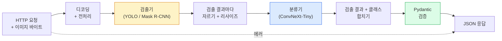

# 완전한 비전 파이프라인 만들기 — 캡스톤

> 🇰🇷 이 문서는 한국어 번역본입니다(ELI5 스타일). 원문: [en.md](en.md)

> 프로덕션(운영 환경) 비전 시스템은 데이터 계약으로 이어 놓은 모델과 규칙의 사슬입니다. 부품은 이미 이 페이즈 안에 다 있습니다. 캡스톤은 그것들을 처음부터 끝까지 연결하는 일입니다.

**유형:** Build
**언어:** Python
**선수 지식:** 페이즈 4 레슨 01-15
**시간:** 약 120분

## 학습 목표

- 객체를 검출하고 분류하고 구조화된 JSON을 내뱉는 프로덕션 비전 파이프라인을 설계합니다 — 모든 실패 경로를 처리하면서요
- 검출기(Mask R-CNN 또는 YOLO), 분류기(ConvNeXt-Tiny), 데이터 계약(Pydantic)을 하나의 서비스로 연결합니다
- 엔드투엔드 파이프라인을 벤치마크하고 첫 번째 병목을 찾아냅니다(보통 전처리, 그다음이 검출기입니다)
- 이미지 업로드를 받아 파이프라인을 실행하고 분류가 붙은 검출 결과를 돌려주는 최소한의 FastAPI 서비스를 출시합니다

## 문제 상황

개별 비전 모델은 유용하지만, 비전 제품은 그런 모델들의 사슬입니다. 매장 진열대 감사 시스템은 검출기 + 제품 분류기 + 가격 OCR 파이프라인입니다. 자율주행은 2D 검출기 + 3D 검출기 + 세그멘터 + 트래커 + 플래너입니다. 의료 사전 스크리닝은 세그멘터 + 영역 분류기 + 임상의 UI입니다.

이 사슬을 연결하는 작업이야말로 ML 프로토타입과 제품을 가르는 부분입니다. 모델 사이의 모든 인터페이스는 새로운 버그 온상입니다. 좌표 변환 하나하나, 정규화 하나하나, 마스크 리사이즈 하나하나가 조용히 실패할 후보입니다. 파이프라인은 가장 약한 인터페이스만큼만 강합니다.

이 캡스톤은 최소한으로 동작하는 파이프라인을 만듭니다: 검출 + 분류 + 구조화된 출력 + 서빙 레이어. 페이즈 4의 나머지 모든 것들이 이 뼈대에 끼워 들어갑니다: Mask R-CNN을 YOLOv8로 바꾸고, OCR 헤드를 붙이고, 세그멘테이션 브랜치를 추가하고, 트래커를 추가하세요. 아키텍처는 안정적이고, 부품은 교체 가능합니다.

## 개념

### 파이프라인



일곱 단계입니다. 모델 단계는 둘뿐이고 비용이 큽니다. 나머지 다섯 단계가 바로 버그가 사는 곳입니다.

### Pydantic 데이터 계약

모든 모델 경계를 타입이 있는 객체로 만듭니다. 조용한 실패가 시끄러운 실패로 바뀝니다.

```
Detection(
    box: tuple[float, float, float, float],   # (x1, y1, x2, y2), 절대 픽셀 좌표
    score: float,                              # [0, 1]
    class_id: int,                             # 검출기의 레이블 맵에서 온 값
    mask: Optional[list[list[int]]],           # 있으면 RLE로 인코딩
)

PipelineResult(
    image_id: str,
    detections: list[Detection],
    classifications: list[Classification],
    inference_ms: float,
)
```

검출기가 `(x1, y1, x2, y2)`가 아니라 `(cx, cy, w, h)`로 박스를 돌려주면, Pydantic 검증이 경계에서 즉시 실패해 줍니다. 덕분에 조용히 빈 영역만 돌려주는 다운스트림 크롭을 디버깅하느라 시간을 낭비하지 않고 바로 알아차립니다.

### 지연 시간이 쓰이는 곳

거의 모든 비전 파이프라인에서 성립하는 세 가지 사실:

1. **전처리가 흔히 가장 큰 단일 블록입니다.** JPEG 디코딩, 색 공간 변환, 리사이즈 — 전부 CPU 바운드라서 놓치기 쉽습니다.
2. **GPU 시간은 검출기가 지배합니다.** GPU 시간의 70~90%가 검출 순전파에 들어갑니다.
3. **후처리(NMS, RLE 인코딩/디코딩)는 GPU에서는 싸고 CPU에서는 셉니다.** 항상 실제 대상에서 프로파일링하세요.

분포를 알면 최적화가 우선순위 목록으로 바뀝니다.

### 실패 양상

- **검출 결과가 비어 있음** — 빈 목록을 반환하고 크래시하지 않습니다. 로그를 남깁니다.
- **범위를 벗어난 박스** — 자르기 전에 이미지 크기로 클램프(clamp)합니다.
- **아주 작은 크롭** — 분류기의 최소 입력보다 작은 박스는 분류를 건너뜁니다.
- **손상된 업로드** — 500이 아니라 구체적인 오류 코드와 함께 400 응답을 줍니다.
- **모델 로딩 실패** — 첫 요청이 아니라 서비스 시작 시점에 실패합니다.

프로덕션 파이프라인은 실패를 감추는 범용 `try/except`를 쓰지 않고 이 각각을 처리합니다. 모든 실패에는 이름 붙은 코드와 응답이 대응됩니다.

### 배칭

프로덕션 서비스는 여러 클라이언트를 상대합니다. 요청들에 걸쳐 검출과 분류를 배치로 묶으면 처리량이 곱절로 늘어납니다. 트레이드오프는 배치가 채워질 때까지 기다리는 추가 지연입니다. 전형적인 설정: 최대 20ms까지 요청을 모으고, 배치로 묶고, 처리하고, 응답을 나눠 줍니다. `torchserve`와 `triton`은 이걸 기본으로 지원하고, 부하가 예측 가능한 작은 서비스는 자체 마이크로 배처를 만들기도 합니다.

```figure
v4-vision-pipeline
```

## 만들어 보기

### 단계 1: 데이터 계약

```python
from pydantic import BaseModel, Field
from typing import List, Optional, Tuple

class Detection(BaseModel):
    box: Tuple[float, float, float, float]
    score: float = Field(ge=0, le=1)
    class_id: int = Field(ge=0)
    mask_rle: Optional[str] = None


class Classification(BaseModel):
    detection_index: int
    class_id: int
    class_name: str
    score: float = Field(ge=0, le=1)


class PipelineResult(BaseModel):
    image_id: str
    detections: List[Detection]
    classifications: List[Classification]
    inference_ms: float
```

5초짜리 코드가 진지한 파이프라인에서는 한 시간짜리 디버깅을 막아 줍니다.

### 단계 2: 최소한의 Pipeline 클래스

```python
import time
import numpy as np
import torch
from PIL import Image

class VisionPipeline:
    def __init__(self, detector, classifier, class_names,
                 device="cpu", min_crop=32):
        self.detector = detector.to(device).eval()
        self.classifier = classifier.to(device).eval()
        self.class_names = class_names
        self.device = device
        self.min_crop = min_crop

    def preprocess(self, image):
        """
        image: PIL.Image 또는 np.ndarray (H, W, 3) uint8
        반환: 기기에 올라간 CHW float 텐서
        """
        if isinstance(image, Image.Image):
            image = np.asarray(image.convert("RGB"))
        tensor = torch.from_numpy(image).permute(2, 0, 1).float() / 255.0
        return tensor.to(self.device)

    @torch.no_grad()
    def detect(self, image_tensor):
        return self.detector([image_tensor])[0]

    @torch.no_grad()
    def classify(self, crops):
        if len(crops) == 0:
            return []
        batch = torch.stack(crops).to(self.device)
        logits = self.classifier(batch)
        probs = logits.softmax(-1)
        scores, cls = probs.max(-1)
        return list(zip(cls.tolist(), scores.tolist()))

    def run(self, image, image_id="anonymous"):
        t0 = time.perf_counter()
        tensor = self.preprocess(image)
        det = self.detect(tensor)

        crops = []
        detections = []
        valid_indices = []
        for i, (box, score, cls) in enumerate(zip(det["boxes"], det["scores"], det["labels"])):
            x1, y1, x2, y2 = [max(0, int(b)) for b in box.tolist()]
            x2 = min(x2, tensor.shape[-1])
            y2 = min(y2, tensor.shape[-2])
            detections.append(Detection(
                box=(x1, y1, x2, y2),
                score=float(score),
                class_id=int(cls),
            ))
            if (x2 - x1) < self.min_crop or (y2 - y1) < self.min_crop:
                continue
            crop = tensor[:, y1:y2, x1:x2]
            crop = torch.nn.functional.interpolate(
                crop.unsqueeze(0),
                size=(224, 224),
                mode="bilinear",
                align_corners=False,
            )[0]
            crops.append(crop)
            valid_indices.append(i)

        class_preds = self.classify(crops)

        classifications = []
        for valid_idx, (cls_id, cls_score) in zip(valid_indices, class_preds):
            classifications.append(Classification(
                detection_index=valid_idx,
                class_id=int(cls_id),
                class_name=self.class_names[cls_id],
                score=float(cls_score),
            ))

        return PipelineResult(
            image_id=image_id,
            detections=detections,
            classifications=classifications,
            inference_ms=(time.perf_counter() - t0) * 1000,
        )
```

모든 인터페이스에 타입이 붙어 있습니다. 모든 실패 경로에는 구체적인 처리 결정이 붙어 있습니다.

### 단계 3: 검출기와 분류기 연결하기

```python
from torchvision.models.detection import maskrcnn_resnet50_fpn_v2
from torchvision.models import convnext_tiny

# 학습 없이도 그럴듯한 파이프라인을 만들 수 있도록 ImageNet 사전 학습 가중치를 사용한다
detector = maskrcnn_resnet50_fpn_v2(weights="DEFAULT")
classifier = convnext_tiny(weights="DEFAULT")
class_names = [f"imagenet_class_{i}" for i in range(1000)]

pipe = VisionPipeline(detector, classifier, class_names)

# 합성 이미지로 스모크 테스트
test_image = (np.random.rand(400, 600, 3) * 255).astype(np.uint8)
result = pipe.run(test_image, image_id="demo")
print(result.model_dump_json(indent=2)[:500])
```

### 단계 4: FastAPI 서비스

```python
from fastapi import FastAPI, UploadFile, HTTPException
from io import BytesIO

app = FastAPI()
pipe = None  # 시작 시 초기화됨

@app.on_event("startup")
def load():
    global pipe
    detector = maskrcnn_resnet50_fpn_v2(weights="DEFAULT").eval()
    classifier = convnext_tiny(weights="DEFAULT").eval()
    pipe = VisionPipeline(detector, classifier, class_names=[f"c{i}" for i in range(1000)])

@app.post("/detect")
async def detect_endpoint(file: UploadFile):
    if file.content_type not in {"image/jpeg", "image/png", "image/webp"}:
        raise HTTPException(status_code=400, detail="unsupported image type")
    data = await file.read()
    try:
        img = Image.open(BytesIO(data)).convert("RGB")
    except Exception:
        raise HTTPException(status_code=400, detail="cannot decode image")
    result = pipe.run(img, image_id=file.filename or "upload")
    return result.model_dump()
```

`uvicorn main:app --host 0.0.0.0 --port 8000`으로 실행합니다. `curl -F 'file=@dog.jpg' http://localhost:8000/detect`로 테스트합니다.

### 단계 5: 파이프라인 벤치마크

```python
import time

def benchmark(pipe, num_runs=20, image_size=(400, 600)):
    img = (np.random.rand(*image_size, 3) * 255).astype(np.uint8)
    pipe.run(img)  # 워밍업

    stages = {"preprocess": [], "detect": [], "classify": [], "total": []}
    for _ in range(num_runs):
        t0 = time.perf_counter()
        tensor = pipe.preprocess(img)
        t1 = time.perf_counter()
        det = pipe.detect(tensor)
        t2 = time.perf_counter()
        crops = []
        for box in det["boxes"]:
            x1, y1, x2, y2 = [max(0, int(b)) for b in box.tolist()]
            x2 = min(x2, tensor.shape[-1])
            y2 = min(y2, tensor.shape[-2])
            if (x2 - x1) >= pipe.min_crop and (y2 - y1) >= pipe.min_crop:
                crop = tensor[:, y1:y2, x1:x2]
                crop = torch.nn.functional.interpolate(
                    crop.unsqueeze(0), size=(224, 224), mode="bilinear", align_corners=False
                )[0]
                crops.append(crop)
        pipe.classify(crops)
        t3 = time.perf_counter()
        stages["preprocess"].append((t1 - t0) * 1000)
        stages["detect"].append((t2 - t1) * 1000)
        stages["classify"].append((t3 - t2) * 1000)
        stages["total"].append((t3 - t0) * 1000)

    for stage, times in stages.items():
        times.sort()
        print(f"{stage:12s}  p50={times[len(times)//2]:7.1f} ms  p95={times[int(len(times)*0.95)]:7.1f} ms")
```

CPU에서 전형적인 출력: 전처리 약 3ms, 검출 300~500ms, 분류 20~40ms, 전체 350~550ms. GPU에서는 검출이 20~40ms로 줄어서 전처리 + 분류가 상대적으로 더 눈에 띄기 시작합니다.

## 사용해 보기

프로덕션 템플릿은 모두 같은 구조로 수렴합니다. 거기에 더해:

- **모델 버전 관리** — 응답에 항상 모델 이름과 가중치 해시를 기록합니다.
- **요청별 트레이스 ID** — 모든 요청의 모든 단계 시간을 기록해서 느린 응답을 단계와 연관 지을 수 있게 합니다.
- **폴백 경로** — 분류기가 시간 초과되면 요청 전체를 실패 처리하지 말고 분류 없는 검출 결과만 돌려줍니다.
- **안전 필터** — NSFW / PII 필터는 분류 다음, 응답이 서비스를 떠나기 전에 실행합니다.
- **배치 엔드포인트** — 대량 처리를 위해 이미지 URL 목록을 받는 `/detect_batch`를 둡니다.

프로덕션 서빙에서는 `torchserve`, `Triton Inference Server`, `BentoML`이 배칭, 버전 관리, 메트릭, 헬스 체크를 기본으로 제공합니다. 프로토타입과 소규모 제품이라면 `FastAPI`를 직접 돌려도 충분합니다.

## 출시하기

이 레슨에서 만드는 산출물:

- `outputs/prompt-vision-service-shape-reviewer.md` — 비전 서비스 코드를 검토해서 계약/응답 형태 위반을 찾아내고 가장 먼저 터질 버그를 지목해 주는 프롬프트
- `outputs/skill-pipeline-budget-planner.md` — 목표 지연 시간과 처리량이 주어지면 각 파이프라인 단계에 시간 예산을 배정하고, 예산을 가장 먼저 넘길 단계를 표시해 주는 스킬

## 연습 문제

1. **(쉬움)** 아무 공개 데이터셋에서 10장의 이미지로 파이프라인을 실행하세요. 단계별 평균 시간과 이미지당 검출 개수 분포를 보고하세요.
2. **(보통)** `Detection`에 마스크 출력 필드를 추가하고 RLE로 인코딩하세요. 객체 10개가 있는 이미지에서도 JSON이 1MB 미만을 유지하는지 확인하세요.
3. **(어려움)** 분류기 앞에 마이크로 배처를 추가하세요: 최대 10ms까지 크롭을 모았다가 한 번의 GPU 호출로 전부 분류하고, 요청별로 결과를 돌려줍니다. 초당 동시 요청 5개에서의 처리량 증가와 추가된 지연 시간을 측정하세요.

## 핵심 용어

| 용어 | 사람들이 말하는 방식 | 실제 의미 |
|------|----------------|----------------------|
| 파이프라인 | "그 시스템" | 전처리, 추론, 후처리 단계가 순서대로 이어진 사슬. 각 단계 사이에 타입이 있는 인터페이스가 있음 |
| 데이터 계약 | "그 스키마" | 모든 단계의 입력과 출력이 따라야 하는 Pydantic / dataclass 정의. 경계에서 통합 버그를 잡아 줌 |
| 전처리 | "모델 앞" | 디코딩, 색 변환, 리사이즈, 정규화. 보통 CPU 시간을 가장 많이 잠아먹는 구간 |
| 후처리 | "모델 뒤" | NMS, 마스크 리사이즈, 임계값 처리, RLE 인코딩. GPU에서는 싸고 CPU에서는 비쌈 |
| 마이크로 배처 | "모아서 한 번에" | 고정된 시간 창 동안 여러 요청을 기다렸다가 배치 순전파 한 번으로 처리하는 집계기 |
| 트레이스 ID | "요청 id" | 모든 단계에서 기록되는 요청별 식별자. 느린 요청을 엔드투엔드로 추적할 수 있게 해 줌 |
| 실패 코드 | "이름 붙은 에러" | 범용 500 대신 실패 종류마다 붙는 구체적인 오류 코드. 클라이언트의 재시도 로직을 가능하게 함 |
| 헬스 체크 | "준비 상태 프로브" | 서비스가 응답할 수 있는 상태인지 알려 주는 가벼운 엔드포인트. 로드밸런서가 이에 의존함 |

## 더 읽을거리

- [Full Stack Deep Learning — Deploying Models](https://fullstackdeeplearning.com/course/2022/lecture-5-deployment/) — 프로덕션 ML 배포의 정석적인 개관
- [BentoML 문서](https://docs.bentoml.com) — 배칭, 버전 관리, 메트릭을 갖춘 서빙 프레임워크
- [torchserve 문서](https://pytorch.org/serve/) — PyTorch 공식 서빙 라이브러리
- [NVIDIA Triton Inference Server](https://developer.nvidia.com/triton-inference-server) — 배칭과 멀티 모델 지원을 갖춘 고처리량 서빙
