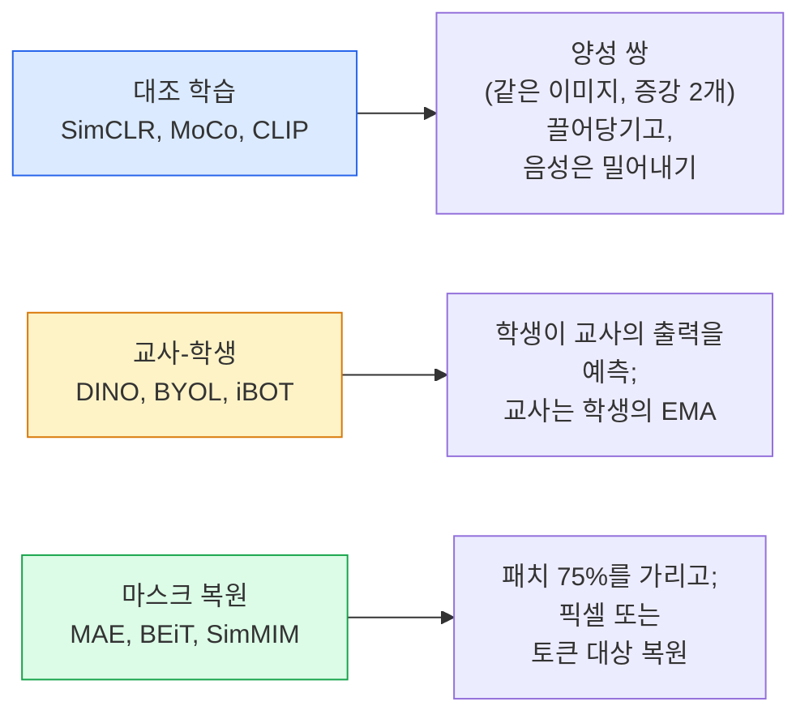

# 자기지도 비전 — SimCLR, DINO, MAE

> 🇰🇷 이 문서는 한국어 번역본입니다(ELI5 스타일). 원문: [en.md](en.md)

> 레이블이 지도 학습 비전의 병목입니다. 자기지도 사전 학습은 그 병목을 없앱니다. 레이블 없는 이미지 1억 장에서 시각 특성을 배우고, 레이블된 이미지 1만 장으로 파인튜닝하는 거죠.

**유형:** Learn + Build
**언어:** Python
**선수 지식:** 페이즈 4 레슨 04(이미지 분류), 페이즈 4 레슨 14(ViT)
**시간:** 약 75분

## 학습 목표

- 세 가지 주요 자기지도 계열 — 대조 학습(SimCLR), 교사-학생(DINO), 마스크 복원(MAE) — 을 따라가 보고 각각이 무엇을 최적화하는지 말할 수 있습니다
- InfoNCE 손실을 처음부터 직접 구현하고, 배치 512에서는 되는데 32에서는 왜 실패하는지 설명할 수 있습니다
- MAE의 75% 마스크 비율이 왜 자의적인 게 아닌지, 그리고 텍스트의 BERT 15%와 어떻게 다른지 설명할 수 있습니다
- DINOv2 또는 MAE ImageNet 체크포인트로 선형 프로브(linear probing)와 제로샷 검색을 수행합니다

## 문제 상황

지도 학습용 ImageNet은 레이블된 이미지 130만 장이고, 주석을 다는 데 약 1,000만 달러가 들었다고 추정됩니다. 의료와 산업 데이터셋은 더 작고 레이블링 비용은 더 씁니다. 모든 비전 팀이 묻는 질문은 이것입니다. 값싼 레이블 없는 데이터 — YouTube 프레임, 웹 크롤, 웹캠 영상, 위성 촬영 — 로 사전 학습한 다음 작은 레이블 세트로 파인튜닝할 수는 없을까?

자기지도 학습이 그 답입니다. LAION이나 JFT로 학습한 현대의 자기지도 ViT는 파인튜닝하면 지도 학습 ImageNet 정확도에 도달하거나 능가합니다. 게다가 지도 학습 사전 학습보다 다운스트림 작업(검출, 세그멘테이션, 깊이 추정)으로의 전이도 더 잘 됩니다. DINOv2(Meta, 2023)와 MAE(Meta, 2022)가 지금은 전이 가능한 비전 특성의 프로덕션(운영 환경) 기본 선택지입니다.

개념적 전환은 이것입니다. 모델을 학습시키려는 과제, 즉 프리텍스트 과제(pretext task)는 다운스트림 과제와 같을 필요가 없다는 것. 중요한 건 그 과제가 모델에게 유용한 특성을 배우도록 강제한다는 점입니다. 흑백 이미지의 색을 맞혀 보라든지, 이미지를 회전시키고 회전 각도를 분류하라든지, 패치를 가리고 복원하라든지 — 전부 통했습니다. 규모를 키울 수 있었던 세 가지 접근은 대조 학습, 교사-학생 증류, 마스크 복원입니다.

## 개념

### 세 가지 계열



### 대조 학습 (SimCLR)

이미지 한 장을 가져다 무작위 증강 두 개를 적용해 뷰(view) 두 개를 만듭니다. 두 뷰를 같은 인코더와 프로젝션 헤드에 통과시킵니다. 그리고 "이 두 임베딩은 가까워야 한다", "이 임베딩은 배치 안 다른 모든 이미지의 임베딩과 멀어야 한다"라는 손실을 최소화합니다.

```
Loss for positive pair (z_i, z_j) among 2N views per batch:

   L_ij = -log( exp(sim(z_i, z_j) / tau) / sum_k in batch \ {i} exp(sim(z_i, z_k) / tau) )

sim = cosine similarity
tau = temperature (0.1 standard)
```

이게 InfoNCE 손실입니다. 양성 하나당 음성이 많이 필요하기 때문에 배치 크기가 중요합니다 — SimCLR은 512~8192가 필요합니다. MoCo는 과거 배치들의 모멘텀 큐를 도입해 음성 개수를 배치 크기에서 분리했습니다.

### 교사-학생 (DINO)

같은 아키텍처의 네트워크 둘: 학생과 교사입니다. 교사는 학생 가중치의 지수 이동 평균(EMA)입니다. 둘 다 이미지의 증강된 뷰를 봅니다. 학생의 출력이 교사의 출력과 일치하도록 학습합니다 — 명시적인 음성이 없습니다.

```
loss = CE( student_output(view_1),  teacher_output(view_2) )
     + CE( student_output(view_2),  teacher_output(view_1) )

teacher_weights = m * teacher_weights + (1 - m) * student_weights   (m ≈ 0.996)
```

"상수 하나를 예측하는" 붕괴가 일어나지 않는 이유: 교사의 출력을 센터링하고(차원별 평균을 뺌) 샤프닝합니다(작은 온도로 나눔). 센터링은 한 차원이 지배하는 걸 막고, 샤프닝은 출력이 균등 분포로 무너지는 걸 막습니다.

DINOv2는 이 DINO를 검수된 1억 4,200만 장의 이미지로 확장한 것입니다. 그 결과 나온 특성은 현재 제로샷 시각 검색과 밀집 예측(dense prediction)의 SOTA입니다.

### 마스크 복원 (MAE)

ViT 입력의 패치 75%를 가립니다. 보이는 25%만 인코더에 통과시킵니다. 작은 디코더가 인코더 출력과 가려진 위치의 마스크 토큰을 받아서, 가려진 패치의 픽셀을 복원하도록 학습됩니다.

```
Encoder:  visible 25% of patches -> features
Decoder:  features + mask tokens at masked positions -> reconstructed pixels
Loss:     MSE between reconstructed and original pixels on masked patches only
```

MAE를 작동하게 만드는 핵심 설계 선택:

- **75% 마스크 비율** — 높습니다. 인코더가 의미론적 특성을 배우도록 강제합니다. 25%만 가리면 복원이 거의 너무 쉬워집니다(이웃 픽션이 워낙 상관돼 있어서 CNN으로도 해치울 수 있을 정도).
- **비대칭 인코더/디코더** — 큰 ViT 인코더는 보이는 패치만 봅니다. 복원은 작은 디코더(8레이어, 512차원)가 처리합니다. 순진한 BEiT보다 사전 학습이 3배 빠릅니다.
- **픽셀 공간 복원 대상** — BEiT의 토큰화된 대상보다 단순하고 ViT에서 더 잘 작동합니다.

사전 학습이 끝나면 디코더는 버립니다. 인코더가 특성 추출기입니다.

### 왜 15%가 아니라 75%인가

BERT는 토큰의 15%를 가립니다. MAE는 75%를 가립니다. 차이는 정보 밀도입니다.

- 자연어는 토큰당 엔트로피가 높습니다. 15%만 가려도 예측이 여전히 어렵습니다. 가려진 각 위치에 그럴듯한 후보가 많기 때문입니다.
- 이미지 패치는 엔트로피가 낮습니다. 가리지 않은 이웃만으로도 가려진 패치의 픽셀이 거의 정확히 결정되곤 합니다. 예측이 의미 이해를 요구하게 만들려면 공격적으로 가려야 합니다.

75%면 단순한 공간적 외삽으로는 과제를 풀 수 없을 만큼 높아서, 인코더가 이미지 내용을 표현해야만 합니다.

### 선형 프로브 평가

자기지도 사전 학습 후의 표준 평가는 **선형 프로브(linear probe)**입니다. 인코더를 얼리고, 그 위에 선형 분류기 하나만 ImageNet 레이블로 학습합니다. top-1 정확도를 보고합니다.

- SimCLR ResNet-50: 약 71% (2020)
- DINO ViT-S/16: 약 77% (2021)
- MAE ViT-L/16: 약 76% (2022)
- DINOv2 ViT-g/14: 약 86% (2023)

선형 프로브는 특성 품질의 순수한 척도입니다. 파인튜닝은 보통 2~5포인트를 더하지만 헤드 재학습의 효과까지 섞여 버립니다.

```figure
data-augmentation
```

## 만들어 보기

### 단계 1: 두 뷰 증강 파이프라인

```python
import torch
import torchvision.transforms as T

two_view_train = lambda: T.Compose([
    T.RandomResizedCrop(96, scale=(0.2, 1.0)),
    T.RandomHorizontalFlip(),
    T.ColorJitter(0.4, 0.4, 0.4, 0.1),
    T.RandomGrayscale(p=0.2),
    T.ToTensor(),
])


class TwoViewDataset(torch.utils.data.Dataset):
    def __init__(self, base):
        self.base = base
        self.aug = two_view_train()

    def __len__(self):
        return len(self.base)

    def __getitem__(self, i):
        img, _ = self.base[i]
        v1 = self.aug(img)
        v2 = self.aug(img)
        return v1, v2
```

각 `__getitem__`은 같은 이미지의 증강된 뷰 두 개를 돌려줍니다. 레이블은 필요 없습니다.

### 단계 2: InfoNCE 손실

```python
import torch.nn.functional as F

def info_nce(z1, z2, tau=0.1):
    """
    z1, z2: 짝지어진 뷰들의 (N, D) L2-정규화 임베딩
    """
    N, D = z1.shape
    z = torch.cat([z1, z2], dim=0)  # (2N, D)
    sim = z @ z.T / tau              # (2N, 2N)

    mask = torch.eye(2 * N, dtype=torch.bool, device=z.device)
    sim = sim.masked_fill(mask, float("-inf"))

    targets = torch.cat([torch.arange(N, 2 * N), torch.arange(0, N)]).to(z.device)
    return F.cross_entropy(sim, targets)
```

호출 전에 임베딩을 L2 정규화하세요. `tau=0.1`은 SimCLR 기본값이고, 낮출수록 손실이 날카로워져서 더 많은 음성이 필요해집니다.

### 단계 3: InfoNCE 동작 확인

```python
z1 = F.normalize(torch.randn(16, 32), dim=-1)
z2 = z1.clone()
loss_same = info_nce(z1, z2, tau=0.1).item()
z2_random = F.normalize(torch.randn(16, 32), dim=-1)
loss_random = info_nce(z1, z2_random, tau=0.1).item()
print(f"InfoNCE with identical pairs:  {loss_same:.3f}")
print(f"InfoNCE with random pairs:     {loss_random:.3f}")
```

동일한 쌍이면 손실이 낮아야 합니다(큰 배치와 낮은 온도에서는 0에 가까움). 무작위 쌍은 16쌍 배치 기준 log(2N-1) = ~log(31) = ~3.4가 나와야 합니다.

### 단계 4: MAE 스타일 마스킹

```python
def random_mask_indices(num_patches, mask_ratio=0.75, seed=0):
    g = torch.Generator().manual_seed(seed)
    n_keep = int(num_patches * (1 - mask_ratio))
    perm = torch.randperm(num_patches, generator=g)
    visible = perm[:n_keep]
    masked = perm[n_keep:]
    return visible.sort().values, masked.sort().values


num_patches = 196
visible, masked = random_mask_indices(num_patches, mask_ratio=0.75)
print(f"visible: {len(visible)} / {num_patches}")
print(f"masked:  {len(masked)} / {num_patches}")
```

단순하고 빠르며 주어진 시드에 대해 결정적입니다. 실제 MAE 구현은 이걸 배치 단위로 처리하고 샘플별 마스크를 유지합니다.

## 사용해 보기

2026년 프로덕션 표준은 DINOv2입니다:

```python
import torch
from transformers import AutoImageProcessor, AutoModel

processor = AutoImageProcessor.from_pretrained("facebook/dinov2-base")
model = AutoModel.from_pretrained("facebook/dinov2-base")
model.eval()

# 제로샷 검색을 위한 이미지별 임베딩
with torch.no_grad():
    inputs = processor(images=[pil_image], return_tensors="pt")
    outputs = model(**inputs)
    embedding = outputs.last_hidden_state[:, 0]  # CLS token
```

이렇게 나온 768차원 임베딩이 현대의 이미지 검색, 밀집 대응(dense correspondence), 제로샷 전이 파이프라인의 등뼈입니다. 다운스트림 작업 파인튜닝은 선형 헤드면 거의 충분합니다.

이미지-텍스트 임베딩에는 SigLIP이나 OpenCLIP이 그에 해당하고, MAE 스타일 파인튜닝에는 `timm` 저장소에 모든 MAE 체크포인트가 들어 있습니다.

## 출시하기

이 레슨에서 만드는 산출물:

- `outputs/prompt-ssl-pretraining-picker.md` — 데이터셋 크기, 컴퓨팅 자원, 다운스트림 작업이 주어지면 SimCLR / MAE / DINOv2 중 하나를 골라 주는 프롬프트
- `outputs/skill-linear-probe-runner.md` — 얼려 둔 인코더 + 레이블된 데이터셋 조합에 대한 선형 프로브 평가를 작성해 주는 스킬

## 연습 문제

1. **(쉬움)** 잘 정렬된 임베딩에서는 온도를 낮출 때 InfoNCE 손실이 떨어지고, 무작위 임베딩에서는 온도를 낮출 때 손실이 올라가는지 검증하세요. `tau in [0.05, 0.1, 0.2, 0.5]` 대 손실 그래프를 만드세요.
2. **(보통)** DINO 스타일 센터 버퍼를 구현하세요. 센터링이 없으면 학생이 몇 에포크 안에 상수 벡터로 붕괴함을 보이세요.
3. **(어려움)** 레슨 10의 TinyUNet을 백본으로 써서 CIFAR-100에서 MAE를 학습하세요. 10, 50, 200 에포크에서의 선형 프로브 정확도를 보고하세요. 같은 1,000장 이미지 부분집합에서 MAE 사전 학습 선형 프로브가 처음부터 지도 학습으로 학습한 선형 프로브를 이긴다는 것을 보이세요.

## 핵심 용어

| 용어 | 사람들이 말하는 방식 | 실제 의미 |
|------|----------------|----------------------|
| 자기지도 | "레이블 없음" | 레이블 없는 데이터에서 유용한 표현을 만들어 내는 프리텍스트 과제 |
| 프리텍스트 과제 | "가짜 과제" | 자기지도 학습(SSL) 중에 쓰는 목표 함수(패치 복원, 뷰 매칭 등). 사전 학습 후에는 버려짐 |
| 선형 프로브 | "얼린 인코더 + 선형 헤드" | 표준 SSL 평가: 얼린 특성 위에 선형 분류기만 학습 |
| InfoNCE | "대조 손실" | 코사인 유사도에 대한 softmax. 양성 쌍이 정답 클래스이고 나머지는 전부 음성 |
| EMA 교사 | "이동 평균 교사" | 가중치가 학생의 지수 이동 평균인 교사. BYOL, MoCo, DINO가 사용 |
| 마스크 비율 | "가려진 패치 %" | MAE에서 가려지는 패치의 비율. 비전은 75%, 텍스트는 15% |
| 표현 붕괴 | "상수 출력" | 인코더가 모든 입력에 상수 벡터를 출력하는 SSL 실패. 센터링, 샤프닝, 음성으로 방지 |
| DINOv2 | "프로덕션 SSL 백본" | Meta의 2023년 자기지도 ViT. 2026년 기준 가장 강한 범용 이미지 특성 |

## 더 읽을거리

- [SimCLR (Chen et al., 2020)](https://arxiv.org/abs/2002.05709) — 대조 학습의 대표 문헌
- [DINO (Caron et al., 2021)](https://arxiv.org/abs/2104.14294) — 모멘텀, 센터링, 샤프닝이 들어간 교사-학생
- [MAE (He et al., 2022)](https://arxiv.org/abs/2111.06377) — ViT를 위한 마스크드 오토인코더 사전 학습
- [DINOv2 (Oquab et al., 2023)](https://arxiv.org/abs/2304.07193) — 자기지도 ViT를 프로덕션급 특성으로 확장
