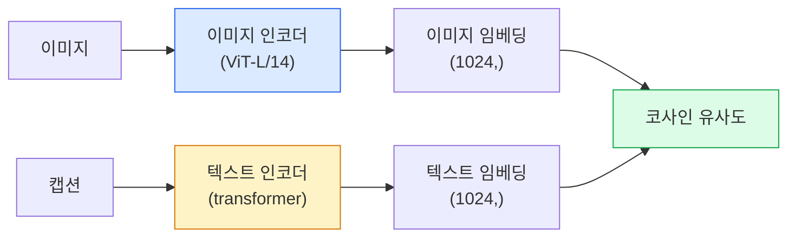

# 오픈 어휘 비전 — CLIP

> 🇰🇷 이 문서는 한국어 번역본입니다(ELI5 스타일). 원문: [en.md](en.md)

> 이미지 인코더와 텍스트 인코더를 함께 학습시켜서, 짝이 맞는 (이미지, 캡션) 쌍이 공유 공간의 같은 지점에 도착하게 만듭니다. 트릭은 이게 전부입니다.

**유형:** Build + Use
**언어:** Python
**선수 지식:** 페이즈 4 레슨 14(ViT), 페이즈 4 레슨 17(자기지도 학습)
**시간:** 약 45분

## 학습 목표

- CLIP의 투 타워(two-tower) 아키텍처와 대조 학습 목표를 설명할 수 있습니다
- 사전 학습된 CLIP(또는 SigLIP)을 작업별 학습 없이 제로샷 분류에 사용합니다
- 제로샷 분류를 처음부터 직접 구현합니다: 클래스 프롬프트를 인코딩하고, 코사인 유사도를 계산하고, argmax를 취합니다
- CLIP, SigLIP, OpenCLIP, LLaVA/LLaMA-vision 계열 모델을 구분합니다 — 2026년 기준 각각의 용도는 무엇인가

## 문제 상황

전통적인 분류기는 닫힌 어휘(closed-vocabulary)입니다. 1000클래스 ImageNet 모델은 1000개 레이블만 예측할 수 있습니다. 새 카테고리가 생길 때마다 레이블된 데이터와 재학습된 헤드가 필요합니다.

CLIP(Radford 등, OpenAI 2021)은 웹에서 긁어 모은 (이미지, 캡션) 쌍 4억 개로 학습하면 추론 시점에 자연어로만 표현되는 어떤 카테고리 집합으로도 분류할 수 있는 모델이 나온다는 걸 보여줬습니다. 문장 하나를 쓰는 것만으로 새 클래스를 가르치는 셈입니다.

이 능력 — 제로샷 전이 — 때문에 모든 현대 비전 시스템은 CLIP 계열 체크포인트에서 출발합니다. 검출(Grounding DINO, OWL-ViT), 세그멘테이션(CLIPSeg, SAM), 검색, 콘텐츠 검수, VLM, 텍스트-이미지 생성이 전부 CLIP 스타일의 공동 임베딩 위에 세워져 있습니다.

## 개념

### 투 타워



두 인코더 모두 같은 임베딩 차원으로 끝나는 선형 투영을 붙입니다(CLIP-B/32는 512, CLIP-L/14는 1024). L2 정규화를 하고 코사인 유사도를 계산합니다.

### 목표 함수

(이미지, 캡션) 쌍 N개의 배치가 주어지면 NxN 유사도 행렬을 만듭니다. 대각선(짝이 맞는 쌍)은 유사도가 높고 대각선 밖(짝이 아닌 쌍)은 낮도록 두 인코더를 학습시킵니다.

```
sim_matrix = image_embeddings @ text_embeddings.T / tau

loss_i2t = cross_entropy(sim_matrix,       targets=arange(N))
loss_t2i = cross_entropy(sim_matrix.T,     targets=arange(N))
loss = (loss_i2t + loss_t2i) / 2
```

대칭입니다. 이미지에서 텍스트를 찾고 텍스트에서 이미지를 찾는 검색 둘 다 작동해야 하기 때문입니다. `tau`(온도)는 보통 스칼라 파라미터로 학습하며, 0.07로 초기화합니다.

### SigLIP: 더 나은 손실

SigLIP(Zhai 등, 2023)은 softmax를 쌍별 sigmoid로 바꿨습니다:

```
loss = mean over pairs of log(1 + exp(-y_ij * sim_ij))
y_ij = +1 if matching, -1 otherwise
```

쌍별 손실은 CLIP이 요구하는 배치 수준 정규화를 없앱니다. SigLIP은 작은 배치 크기에서 더 잘 학습되고 같은 데이터량에서 CLIP과 맞먹거나 능가합니다.

### 제로샷 분류

학습된 CLIP이 주어지면:

1. 각 클래스마다 프롬프트를 만듭니다: "a photo of a {class}".
2. 모든 클래스 프롬프트를 텍스트 인코더로 인코딩합니다 -> `T`, 모양 (C, d).
3. 테스트 이미지를 인코딩합니다 -> `I`, 모양 (1, d).
4. 유사도 = `I @ T.T`, 모양 (1, C).
5. Argmax -> 예측 클래스.

프롬프트 엔지니어링이 중요합니다. OpenAI는 ImageNet용 프롬프트 템플릿 80개를 공개했습니다("a photo of a {}", "a blurry photo of a {}", "a sketch of a {}", ...). 클래스별로 모든 템플릿의 임베딩을 평균 내면 top-1 정확도가 1~3% 더 올라갑니다.

### 2026년 CLIP 스타일 모델의 활용처

- **제로샷 분류** — 직접 사용.
- **이미지 검색** — 모든 이미지를 한 번 인코딩해 두고, 추론 시점에 쿼리만 임베딩합니다.
- **텍스트 조건 검출** — Grounding DINO, OWL-ViT는 검출기에 CLIP 텍스트 타워를 감쌉니다.
- **텍스트 조건 세그멘테이션** — CLIPSeg. SAM은 CLIP을 통해 텍스트 프롬프트 입력을 받습니다.
- **VLM** — LLaVA, Qwen-VL, InternVL은 CLIP 계열 비전 인코더를 LLM에 연결합니다.
- **텍스트-이미지 생성** — Stable Diffusion, DALL-E 3가 CLIP 텍스트 임베딩을 조건으로 씁니다.

공유 임베딩 공간만 있으면 모든 비전+언어 작업이 거리 계산이 됩니다.

```figure
clip-contrastive
```

## 만들어 보기

### 단계 1: 아주 작은 투 타워 모델

진짜 CLIP은 ViT + 트랜스포머입니다. 이 레슨에서는 학습 신호가 CPU에서도 보이도록, 미리 추출한 특성 위에 놓이는 작은 MLP로 타워를 대신합니다.

```python
import torch
import torch.nn as nn
import torch.nn.functional as F


class TwoTower(nn.Module):
    def __init__(self, img_in=128, txt_in=64, emb=64):
        super().__init__()
        self.image_proj = nn.Sequential(nn.Linear(img_in, 128), nn.ReLU(), nn.Linear(128, emb))
        self.text_proj = nn.Sequential(nn.Linear(txt_in, 128), nn.ReLU(), nn.Linear(128, emb))
        self.logit_scale = nn.Parameter(torch.ones([]) * 2.6592)  # ln(1/0.07)

    def forward(self, img_feats, txt_feats):
        i = F.normalize(self.image_proj(img_feats), dim=-1)
        t = F.normalize(self.text_proj(txt_feats), dim=-1)
        return i, t, self.logit_scale.exp()
```

투영 두 개, 같은 차원의 출력, 학습되는 온도. 실제 CLIP API와 같은 형태입니다.

### 단계 2: 대조 손실

```python
def clip_loss(image_emb, text_emb, logit_scale):
    N = image_emb.size(0)
    sim = logit_scale * image_emb @ text_emb.T
    targets = torch.arange(N, device=sim.device)
    l_i = F.cross_entropy(sim, targets)
    l_t = F.cross_entropy(sim.T, targets)
    return (l_i + l_t) / 2
```

대칭입니다. logit_scale이 높을수록 = softmax가 날카로울수록 = 더 확신에 차지만 불안정해질 위험이 있습니다.

### 단계 3: 제로샷 분류기

```python
@torch.no_grad()
def zero_shot_classify(model, image_feats, class_text_feats, class_names):
    """
    image_feats:      (N, img_in)
    class_text_feats: (C, txt_in)   클래스당 하나의 평균 임베딩
    """
    i = F.normalize(model.image_proj(image_feats), dim=-1)
    t = F.normalize(model.text_proj(class_text_feats), dim=-1)
    sim = i @ t.T
    pred = sim.argmax(dim=-1)
    return [class_names[p] for p in pred.tolist()]
```

단계마다 한 줄입니다. 프로덕션 CLIP 체크포인트로 쓰이는 것과 정확히 같은 제로샷 절차입니다.

### 단계 4: 동작 확인

```python
torch.manual_seed(0)
model = TwoTower()

img = torch.randn(8, 128)
txt = torch.randn(8, 64)
i, t, scale = model(img, txt)
loss = clip_loss(i, t, scale)
print(f"batch size: {i.size(0)}   loss: {loss.item():.3f}")
```

무작위로 초기화된 모델이라면 손실이 `log(N) = log(8) = 2.08`에 가까워야 합니다 — 아직 아무 구조도 배우지 않았을 때의 대칭 교차 엔트로피 목표값입니다.

## 사용해 보기

2026년 커뮤니티 기본 선택지는 OpenCLIP입니다:

```python
import open_clip
import torch
from PIL import Image

model, _, preprocess = open_clip.create_model_and_transforms("ViT-B-32", pretrained="laion2b_s34b_b79k")
tokenizer = open_clip.get_tokenizer("ViT-B-32")

image = preprocess(Image.open("dog.jpg")).unsqueeze(0)
text = tokenizer(["a photo of a dog", "a photo of a cat", "a photo of a car"])

with torch.no_grad():
    image_features = model.encode_image(image)
    text_features = model.encode_text(text)
    image_features = image_features / image_features.norm(dim=-1, keepdim=True)
    text_features = text_features / text_features.norm(dim=-1, keepdim=True)
    probs = (100.0 * image_features @ text_features.T).softmax(dim=-1)

print(probs)
```

SigLIP은 더 최신이고, 작은 규모에서 더 잘 학습되며, 새 작업에는 이쪽이 권장됩니다: `google/siglip-base-patch16-224`. Hugging Face가 둘 다 배포합니다.

## 출시하기

이 레슨에서 만드는 산출물:

- `outputs/prompt-zero-shot-class-picker.md` — 클래스 목록과 도메인이 주어지면 제로샷 CLIP용 클래스 템플릿을 설계해 주는 프롬프트
- `outputs/skill-image-text-retriever.md` — 어떤 CLIP 체크포인트로든 이미지 임베딩 인덱스를 구축하고, 텍스트로 찾기와 이미지로 찾기를 지원하게 만들어 주는 스킬

## 연습 문제

1. **(쉬움)** 사전 학습된 OpenCLIP ViT-B/32로 CIFAR-10 제로샷 분류를 80개 템플릿 프롬프트 세트로 수행하세요. top-1 정확도를 보고하세요. 85~90% 정도가 나와야 합니다.
2. **(보통)** 같은 CIFAR-10 작업에서 단일 템플릿("a photo of a {}")과 80개 템플릿 평균 임베딩을 비교하세요. 격차를 수치화하고 템플릿이 왜 도움이 되는지 설명하세요.
3. **(어려움)** 제로샷 이미지 검색 인덱스를 만드세요: CLIP으로 이미지 1,000장을 임베딩하고, FAISS 인덱스를 만들고, 자연어 설명으로 질의합니다. 직접 작성한 홀드아웃 질의 20개에 대한 검색 recall@5를 보고하세요.

## 핵심 용어

| 용어 | 사람들이 말하는 방식 | 실제 의미 |
|------|----------------|----------------------|
| 투 타워 | "듀얼 인코더" | 각각의 이미지/텍스트 인코더가 공유 차원의 투영 헤드로 끝나는 구조 |
| 제로샷 | "작업별 학습 없음" | 추론 시점에 텍스트로만 묘사된 클래스로 분류. 레이블은 전혀 건드리지 않음 |
| 온도 / logit_scale | "tau" | softmax 전에 유사도 행렬을 스케일링하는 학습된 스칼라 |
| 프롬프트 템플릿 | "A photo of a {}" | 클래스 이름을 감싸는 자연어 틀. 템플릿을 많이 모아 평균 내면 제로샷 정확도가 올라감 |
| CLIP | "이미지+텍스트 모델" | 2021년 OpenAI 모델. 2026년 현재 이 분야의 공용어 |
| SigLIP | "시그모이드 CLIP" | softmax를 쌍별 sigmoid로 교체. 작은 배치에서 더 잘 학습됨 |
| OpenCLIP | "공개된 재현" | LAION으로 커뮤니티가 학습한 CLIP 변형. 오픈소스 파이프라인의 프로덕션 기본 선택지 |
| VLM | "비전-언어 모델" | CLIP 계열 인코더 + LLM을 묶어 이미지에 대해 질문에 답하도록 학습한 모델 |

## 더 읽을거리

- [CLIP: Learning Transferable Visual Models from Natural Language Supervision (Radford et al., 2021)](https://arxiv.org/abs/2103.00020)
- [SigLIP: Sigmoid Loss for Language-Image Pre-Training (Zhai et al., 2023)](https://arxiv.org/abs/2303.15343)
- [OpenCLIP](https://github.com/mlfoundations/open_clip) — 커뮤니티 코드베이스
- [DINOv2 vs CLIP vs MAE: a features comparison](https://huggingface.co/blog/dinov2) — 나란히 비교한 사용 사례가 있는 HF 가이드
