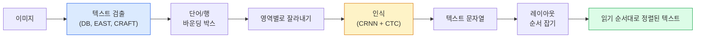

# OCR & 문서 이해

> 🇰🇷 이 문서는 한국어 번역본입니다(ELI5 스타일). 원문: [en.md](en.md)

> OCR은 3단계 파이프라인입니다 — 텍스트 박스를 찾고, 문자를 인식하고, 배치를 잡습니다. 모든 현대 OCR 시스템은 이 단계들을 재배치하거나 합칩니다.

**유형:** Learn + Use
**언어:** Python
**선수 지식:** 페이즈 4 레슨 06(검출), 페이즈 7 레슨 02(셀프 어텐션)
**시간:** 약 45분

## 학습 목표

- 고전적인 OCR 파이프라인(검출 -> 인식 -> 레이아웃)과 현대적인 엔드투엔드 대안들(Donut, Qwen-VL-OCR)을 따라가 볼 수 있습니다
- 시퀀스-투-시퀀스 OCR 학습을 위한 CTC(Connectionist Temporal Classification) 손실을 구현합니다
- 학습 없이 PaddleOCR이나 EasyOCR로 프로덕션(운영 환경) 문서 파싱을 수행합니다
- OCR, 레이아웃 파싱, 문서 이해를 구분하고 작업마다 올바른 도구를 고를 수 있습니다

## 문제 상황

텍스트로 가득한 이미지는 어디에나 있습니다: 영수증, 청구서, 신분증, 스캔된 책, 양식, 화이트보드, 간판, 스크린샷. 여기서 구조화된 데이터를 뽑아내는 것 — 문자뿐 아니라 "이게 총액이다"라는 판단까지 — 은 응용 비전 분야에서 가장 가치 높은 문제 중 하나입니다.

이 분야는 세 개의 실력 층으로 나뉩니다:

1. **OCR 그 자체**: 픽셀을 텍스트로 바꿉니다.
2. **레이아웃 파싱**: OCR 출력을 영역으로 묶습니다(제목, 본문, 표, 머리글).
3. **문서 이해**: 레이아웃에서 구조화된 필드를 추출합니다("invoice_total = $42.50").

각 층마다 고전적 접근과 현대적 접근이 있고, "이미지에서 텍스트를 얻고 싶다"와 "이 영수증에서 총액이 필요하다" 사이의 간극은 대부분의 팀이 생각하는 것보다 큽니다.

## 개념

### 고전적인 파이프라인



- **텍스트 검출**은 행별 또는 단어별 사각형(quadrilateral)을 만들어 냅니다.
- **인식**은 각 영역을 고정 높이로 잘라 CNN + BiLSTM + CTC로 문자 시퀀스를 만듭니다.
- **레이아웃**은 읽기 순서를 다시 세웁니다(라틴 문자는 위에서 아래로, 왼쪽에서 오른쪽으로. 아랍어와 일본어는 다릅니다).

### 한 문단 요약: CTC

OCR 인식은 고정 길이 특성 맵에서 가변 길이 시퀀스를 만들어 냅니다. CTC(Graves 등, 2006)는 문자 단위 정렬 없이 이걸 학습할 수 있게 해 줍니다. 모델은 매 시간 단계에서 (어휘 + blank)에 대한 분포를 출력하고, CTC 손실은 반복을 합치고 blank를 제거했을 때 목표 텍스트가 되는 모든 정렬 경로에 대해 주변화(marginalise)합니다.

```
raw output: "h h h _ _ e e l l _ l l o _ _"
after merge repeats and remove blanks: "hello"
```

CTC 덕분에 CRNN이 2015년에 작동했고, 2026년에도 대부분의 프로덕션 OCR 모델을 여전히 CTC로 학습시킵니다.

### 현대적인 엔드투엔드 모델들

- **Donut**(Kim 등, 2022) — ViT 인코더 + 텍스트 디코더. 이미지를 읽고 JSON을 바로 내뱉습니다. 텍스트 검출기도 레이아웃 모듈도 없습니다.
- **TrOCR** — 행(row) 단위 OCR을 위한 ViT + 트랜스포머 디코더.
- **Qwen-VL-OCR / InternVL** — OCR 작업용으로 파인튜닝된 완전한 비전-언어 모델. 2026년 기준 복잡한 문서에서 최고 정확도.
- **PaddleOCR** — 성숙한 프로덕션 패키지로 포장된 고전적인 DB + CRNN 파이프라인. 여전히 오픈소스의 일등 공신입니다.

엔드투엔드 모델은 더 많은 데이터와 컴퓨팅을 요구하지만, 다단계 파이프라인의 오류 누적을 건너뜁니다.

### 레이아웃 파싱

구조화된 문서라면 레이아웃 검출기(LayoutLMv3, DocLayNet)를 돌려서 각 영역에 레이블을 붙입니다: Title, Paragraph, Figure, Table, Footnote. 읽기 순서는 그 다음 "레이아웃 순서대로 영역을 순회하며 이어 붙이기"가 됩니다.

양식(form)에는 **키-값 추출** 모델을 씁니다(시각적으로 풍부한 문서는 Donut, 평범한 스캔본은 LayoutLMv3). 이 모델들은 이미지 + 검출된 텍스트 + 위치를 받아 구조화된 키-값 쌍을 예측합니다.

### 평가 지표

- **문자 오류율(CER)** — 레벤슈타인 거리 / 기준 텍스트 길이. 낮을수록 좋습니다. 프로덕션 목표: 깨끗한 스캔본에서 2% 미만.
- **단어 오류율(WER)** — 단어 수준에서 같은 계산.
- **구조화 필드에 대한 F1** — 키-값 작업용. `{invoice_total: 42.50}`가 올바르게 나오는지 측정합니다.
- **JSON 편집 거리** — 엔드투엔드 문서 파싱용. Donut 논문이 정규화된 트리 편집 거리를 도입했습니다.

```figure
cv3-ctc-collapse
```

## 만들어 보기

### 단계 1: CTC 손실 + 그리디 디코더

```python
import torch
import torch.nn as nn
import torch.nn.functional as F


def ctc_loss(log_probs, targets, input_lengths, target_lengths, blank=0):
    """
    log_probs:      (T, N, C) 어휘에 대한 log-softmax, 인덱스 0에 blank 포함
    targets:        (N, S) 정수 목표 시퀀스 (blank 없음)
    input_lengths:  (N,) 샘플별 사용된 시간 단계 수
    target_lengths: (N,) 샘플별 목표 길이
    """
    return F.ctc_loss(log_probs, targets, input_lengths, target_lengths,
                      blank=blank, reduction="mean", zero_infinity=True)


def greedy_ctc_decode(log_probs, blank=0):
    """
    log_probs: (T, N, C) log-softmax
    반환: 인덱스 시퀀스 목록 (blank 제거, 반복 병합)
    """
    preds = log_probs.argmax(dim=-1).transpose(0, 1).cpu().tolist()
    out = []
    for seq in preds:
        decoded = []
        prev = None
        for idx in seq:
            if idx != prev and idx != blank:
                decoded.append(idx)
            prev = idx
        out.append(decoded)
    return out
```

`F.ctc_loss`는 가능하면 효율적인 CuDNN 구현을 사용합니다. 그리디 디코더는 빔 서치보다 단순하고 보통 CER 차이 1% 이내입니다.

### 단계 2: 아주 작은 CRNN 인식기

행(row) OCR을 위한 최소한의 CNN + BiLSTM입니다.

```python
class TinyCRNN(nn.Module):
    def __init__(self, vocab_size=40, hidden=128, feat=32):
        super().__init__()
        self.cnn = nn.Sequential(
            nn.Conv2d(1, feat, 3, 1, 1), nn.BatchNorm2d(feat), nn.ReLU(inplace=True),
            nn.MaxPool2d(2),
            nn.Conv2d(feat, feat * 2, 3, 1, 1), nn.BatchNorm2d(feat * 2), nn.ReLU(inplace=True),
            nn.MaxPool2d(2),
            nn.Conv2d(feat * 2, feat * 4, 3, 1, 1), nn.BatchNorm2d(feat * 4), nn.ReLU(inplace=True),
            nn.MaxPool2d((2, 1)),
            nn.Conv2d(feat * 4, feat * 4, 3, 1, 1), nn.BatchNorm2d(feat * 4), nn.ReLU(inplace=True),
            nn.MaxPool2d((2, 1)),
        )
        self.rnn = nn.LSTM(feat * 4, hidden, bidirectional=True, batch_first=True)
        self.head = nn.Linear(hidden * 2, vocab_size)

    def forward(self, x):
        # x: (N, 1, H, W)
        f = self.cnn(x)                # (N, C, H', W')
        f = f.mean(dim=2).transpose(1, 2)  # (N, W', C)
        h, _ = self.rnn(f)
        return F.log_softmax(self.head(h).transpose(0, 1), dim=-1)  # (W', N, vocab)
```

고정 높이 입력입니다(CNN이 높이를 1까지 max-pool 합니다). 너비가 CTC의 시간 차원입니다.

### 단계 3: 합성 OCR

엔드투엔드 스모크 테스트를 위해 흰 바탕에 검은 숫자 문자열을 생성합니다.

```python
import numpy as np

def synthetic_line(text, height=32, char_width=16):
    W = char_width * len(text)
    img = np.ones((height, W), dtype=np.float32)
    for i, c in enumerate(text):
        x = i * char_width
        shade = 0.0 if c.isalnum() else 0.5
        img[6:height - 6, x + 2:x + char_width - 2] = shade
    return img


def build_batch(strings, vocab):
    H = 32
    W = 16 * max(len(s) for s in strings)
    imgs = np.ones((len(strings), 1, H, W), dtype=np.float32)
    target_lengths = []
    targets = []
    for i, s in enumerate(strings):
        imgs[i, 0, :, :16 * len(s)] = synthetic_line(s)
        ids = [vocab.index(c) for c in s]
        targets.extend(ids)
        target_lengths.append(len(ids))
    return torch.from_numpy(imgs), torch.tensor(targets), torch.tensor(target_lengths)


vocab = ["_"] + list("0123456789abcdefghijklmnopqrstuvwxyz")
imgs, targets, lengths = build_batch(["hello", "world"], vocab)
print(f"images: {imgs.shape}   targets: {targets.shape}   lengths: {lengths.tolist()}")
```

진짜 OCR 데이터셋은 여기에 폰트, 노이즈, 회전, 블러, 색을 더합니다. 위 파이프라인 자체는 동일합니다.

### 단계 4: 학습 개요

```python
model = TinyCRNN(vocab_size=len(vocab))
opt = torch.optim.Adam(model.parameters(), lr=1e-3)

for step in range(200):
    strings = ["abc" + str(step % 10)] * 4 + ["xyz" + str((step + 1) % 10)] * 4
    imgs, targets, target_lens = build_batch(strings, vocab)
    log_probs = model(imgs)  # (W', 8, vocab)
    input_lens = torch.full((8,), log_probs.size(0), dtype=torch.long)
    loss = ctc_loss(log_probs, targets, input_lens, target_lens, blank=0)
    opt.zero_grad(); loss.backward(); opt.step()
```

이 간단한 합성 데이터에서는 200스텝 동안 손실이 약 3에서 약 0.2로 떨어져야 합니다.

## 사용해 보기

프로덕션 경로는 세 가지입니다:

- **PaddleOCR** — 성숙하고, 빠르고, 다국어입니다. 한 줄 사용법: `paddleocr.PaddleOCR(lang="en").ocr(image_path)`.
- **EasyOCR** — Python 네이티브, 다국어, PyTorch 백본.
- **Tesseract** — 고전입니다. 모델들이 애를 먹는 오래된 스캔 문서에는 여전히 유용합니다.

엔드투엔드 문서 파싱에는 Donut이나 VLM을 쓰세요:

```python
from transformers import DonutProcessor, VisionEncoderDecoderModel

processor = DonutProcessor.from_pretrained("naver-clova-ix/donut-base-finetuned-cord-v2")
model = VisionEncoderDecoderModel.from_pretrained("naver-clova-ix/donut-base-finetuned-cord-v2")
```

영수증, 청구서처럼 반복되는 구조를 가진 양식에는 Donut을 파인튜닝하세요. 임의의 문서나 추론이 필요한 OCR에는 Qwen-VL-OCR 같은 VLM이 현재 기본 선택지입니다.

## 출시하기

이 레슨에서 만드는 산출물:

- `outputs/prompt-ocr-stack-picker.md` — 문서 유형, 언어, 구조가 주어지면 Tesseract / PaddleOCR / Donut / VLM-OCR 중 하나를 골라 주는 프롬프트
- `outputs/skill-ctc-decoder.md` — 길이 정규화를 포함해서 그리디 및 빔 서치 CTC 디코더를 처음부터 작성해 주는 스킬

## 연습 문제

1. **(쉬움)** TinyCRNN을 5자리 무작위 숫자 문자열로 500스텝 학습하세요. 홀드아웃(held-out) 세트에 대한 CER을 보고하세요.
2. **(보통)** 그리디 디코딩을 빔 서치(beam_width=5)로 바꾸세요. CER 변화를 보고하세요. 빔 서치가 이기는 입력은 어떤 것인가요?
3. **(어려움)** 영수증 20장에 PaddleOCR을 적용해 품목 행(item lines)을 추출하고, 손으로 레이블한 정답과 비교해 {item_name, price} 쌍의 F1을 계산하세요.

## 핵심 용어

| 용어 | 사람들이 말하는 방식 | 실제 의미 |
|------|----------------|----------------------|
| OCR | "픽셀에서 텍스트로" | 이미지 영역을 문자 시퀀스로 바꾸는 일 |
| CTC | "정렬 불필요 손실" | 시간 단계별 레이블 없이 시퀀스 모델을 학습시키는 손실. 정렬 경로 전체에 대해 주변화 |
| CRNN | "고전 OCR 모델" | 합성곱 특성 추출기 + BiLSTM + CTC. 2015년 베이스라인이지만 프로덕션에서 아직 쓰임 |
| Donut | "엔드투엔드 OCR" | ViT 인코더 + 텍스트 디코더. 이미지에서 JSON을 바로 내뱉음 |
| 레이아웃 파싱 | "영역 찾기" | 문서에서 Title/Table/Figure/Paragraph 영역을 검출하고 레이블링 |
| 읽기 순서 | "텍스트 시퀀스" | 인식된 영역을 문장처럼 배열하는 순서. 라틴 문자는 사소하지만 섞인 레이아웃에서는 그렇지 않음 |
| CER / WER | "오류율" | 문자 또는 단어 단위의 레벤슈타인 거리 / 기준 길이 |
| VLM-OCR | "읽는 LLM" | OCR 작업용으로 학습되거나 프롬프트된 비전-언어 모델. 복잡한 문서에서 현재 SOTA |

## 더 읽을거리

- [CRNN (Shi et al., 2015)](https://arxiv.org/abs/1507.05717) — 최초의 CNN+RNN+CTC 아키텍처
- [CTC (Graves et al., 2006)](https://www.cs.toronto.edu/~graves/icml_2006.pdf) — CTC 원 논문. 알고리즘 아이디어가 빽빽하게 들어 있음
- [Donut (Kim et al., 2022)](https://arxiv.org/abs/2111.15664) — OCR 없는 문서 이해 트랜스포머
- [PaddleOCR](https://github.com/PaddlePaddle/PaddleOCR) — 오픈소스 프로덕션 OCR 스택
